## 5.1. Движения, виды движений. Преобразование подобия, гомотетия

---
**стр. 289**
---

**ГЛАВА 5**

**ПРЕОБРАЗОВАНИЯ ФИГУР**

*Преобразованием фигур $\Phi$ и $\Phi_1$ называется правило, позволяющее каждой точке фигуры $\Phi$ поставить в соответствие какую-либо точку фигуры $\Phi_1$, и наоборот, каждой точке фигуры $\Phi_1$ поставить в соответствие некоторую точку фигуры $\Phi$.*

*Композицией преобразований $\varphi_1, \varphi_2, \dots, \varphi_n$ фигуры $M$ называется преобразование, являющееся результатом последовательного осуществления преобразований $\varphi_1, \varphi_2, \dots, \varphi_n$.*

Композиция преобразований $\varphi_1, \varphi_2, \dots, \varphi_n$ обозначается $\varphi_n \circ \dots \circ \varphi_2 \circ \varphi_1$.

Таким образом, если $A$ — точка фигуры $M$, то, применив к точке $A$ указанную композицию преобразований, получим точку $A^* = \varphi_n(\dots\varphi_2(\varphi_1(A)))$.

**§ 21. ДВИЖЕНИЯ, ВИДЫ ДВИЖЕНИЙ. ПРЕОБРАЗОВАНИЕ ПОДОБИЯ, ГОМОТЕТИЯ**

*Движением называется преобразование одной фигуры в другую, при котором сохраняются расстояния между точками, другими словами, **движение** — это преобразование, которое точкам $A$ и $B$ фигуры $\Phi$ ставит в соответствие такие точки $A_1$ и $B_1$ фигуры $\Phi_1$, что $A_1B_1 = AB$.*

Заметим, что преобразование, обратное для движения, также является движением.

---
**стр. 290**
---

**Свойства движения**

**Свойство 21.1.** *При движении точки, лежащие на прямой, переходят в точки, лежащие на прямой, причем порядок взаимного расположения точек на прямой сохраняется.*

**Доказательство.** Пусть точки $A, B$ и $C$ принадлежат прямой $l$, причем точка $B$ лежит между точками $A$ и $C$, т. е. $AB + BC = AC$ (рис. 21.1). Пусть, далее, точки $A_1, B_1$ и $C_1$ — точки, в которые при движении переходят соответственно точки $A, B$ и $C$.

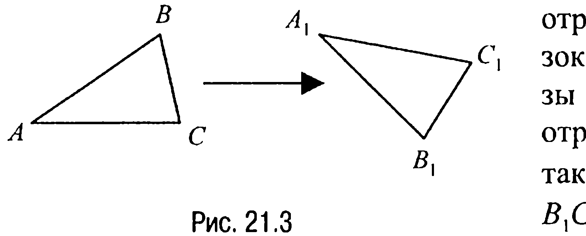

Тогда по определению движения $A_1B_1 = AB$, $B_1C_1 = BC$, $A_1C_1 = AC$. Но в таком случае, складывая почленно первые два равенства, имеем $A_1B_1 + B_1C_1 = AB + BC = AC$.

Далее, так как $A_1B_1 + B_1C_1 = AC$, а по условию $AC = A_1C_1$, приходим к выводу, что $A_1B_1 + B_1C_1 = A_1C_1$, т. е. действительно точки $A$, $B$ и $C$ прямой $l$ переходят соответственно в точки $A_1$, $B_1$ и $C_1$ некоторой прямой $l_1$, где точка $B_1$ лежит между точками $A_1$ и $C_1$.

**Следствие 21.1.** *При движении прямые переходят в прямые, лучи — в лучи, отрезок заданной длины — в отрезок той же длины.*

**Свойство 21.2.** *При движении окружность переходит в окружность того же радиуса.*

**Доказательство.** При некотором движении центр $O$ окружности радиуса $r$ перейдет в некоторую точку $O_1$, а произвольная точка $M$ окружности перейдет в точку $M_1$ такую, что $O_1M_1 = OM = r$ (рис. 21.2).

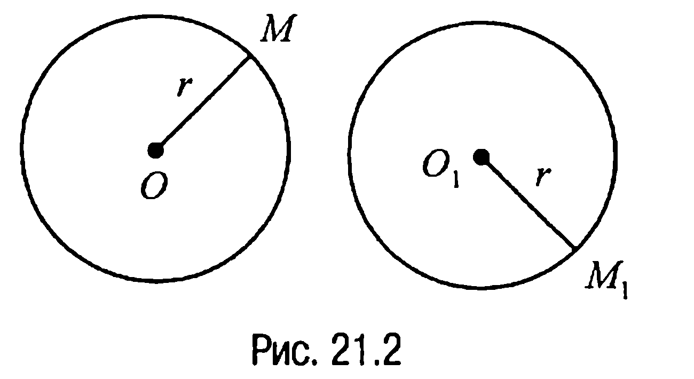

Поэтому при выбранном движении окружность с центром $O$ и радиусом $r$ перейдет в окружность с центром $O_1$ и радиусом $r$, т. е. в окружность того же радиуса.

---
**стр. 291**
---

**Свойство 21.3.** *При движении треугольник отображается на равный ему треугольник.*

**Доказательство.** Рассмотрим треугольник $ABC$ (рис. 21.3).

Тогда поскольку при движении отрезок переходит в отрезок той же длины, то образы сторон $AB$, $BC$ и $AC$ — отрезки $A_1B_1$, $B_1C_1$ и $A_1C_1$ таковы, что $A_1B_1 = AB$, $B_1C_1 = BC$ и $A_1C_1 = AC$.

Но в таком случае образ треугольника $ABC$ — тоже треугольник ($\Delta A_1B_1C_1$), равный треугольнику $ABC$ (по третьему признаку равенства треугольников).

**Следствие 21.2.** *При движении угол переходит в равный ему угол.*

Рассмотрим некоторые примеры движений.

**21.1. Симметрии**

**Точки $A$ и $A_1$ называются симметричными относительно точки $O$, если точка $O$ принадлежит отрезку $AA_1$ и этой точкой отрезок $AA_1$ делится пополам.**

Точка, симметричная точке $O$, есть сама точка $O$.

*Преобразование фигуры $F$ в фигуру $F_1$, при котором каждая ее точка $X$ переходит в точку $X_1$, симметричную относительно данной точки $O$, называется* **симметрией относительно точки $O$, или центральной симметрией**.

**Теорема 21.1.** *Симметрия относительно точки является движением.*

**Доказательство.** Пусть $X$ и $Y$ — произвольные точки фигуры $F$. Симметрия относительно точки $O$ переводит эти точки в точки $X_1$ и $Y_1$ соответственно.

А тогда если точки $X$, $Y$ и $O$ не лежат на одной прямой (рис. 21.4), то из равенства треугольников $XOY$ и $X_1OY_1$ ($\angle XOY = \angle X_1OY_1$, $OX = OX_1$, $OY = OY_1$) следует, что $XY = X_1Y_1$ и, значит, симмет-

---
**стр. 292**
---

рия относительно точки $O$ является движением.

Если же точки $X$, $Y$ и $O$ лежат на одной прямой, то справедли-

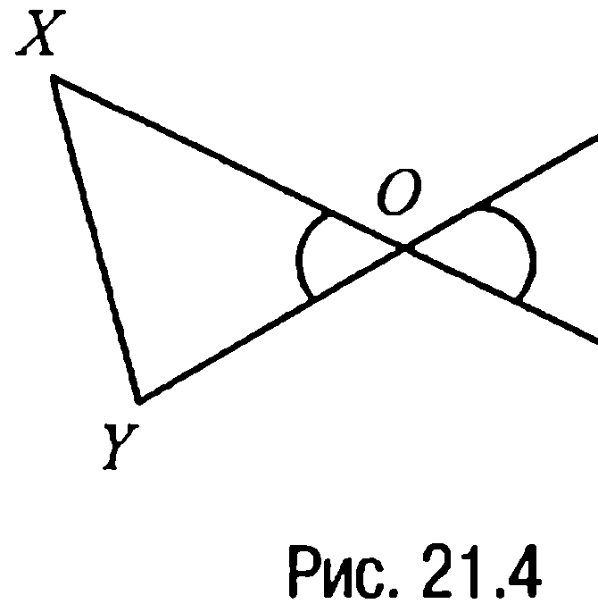

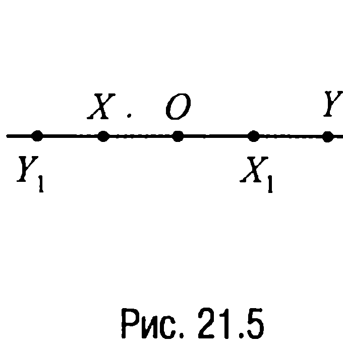

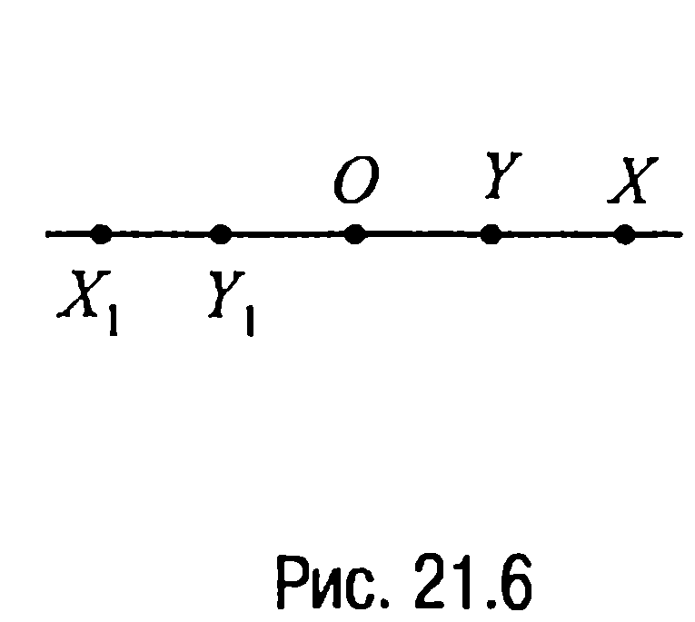

вость теоремы следует из определения симметрии относительно точки $O$

$XY = |OX + OY| = |OX_1 + OY_1| = X_1Y_1$ (рис. 21.5) или $XY = |OX - OY| = |OX_1 - OY_1| = X_1Y_1$ (рис. 21.6).

**Точки $A$ и $A_1$ называются симметричными относительно прямой $l$, если отрезок $AA_1$ перпендикулярен прямой $l$ и делится этой прямой пополам.**

Если точка $X$ лежит на прямой $l$, то симметричная ей точка есть сама точка $X$.

*Преобразование фигуры $F$ в фигуру $F_1$, при котором каждая ее точка $X$ переходит в точку $X_1$, симметричную относительно данной прямой $l$, называется* **симметрией относительно прямой $l$, или осевой симметрией**.

**Теорема 21.2.** *Симметрия относительно прямой является движением.*

**Доказательство.** Пусть $X$ и $Y$ — произвольные точки фигуры $F$.

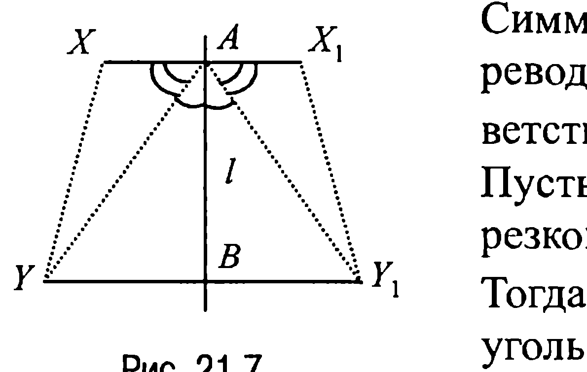

Симметрия относительно прямой $l$ переводит эти точки в точки $X_1$ и $Y_1$ соответственно.

Пусть $A$ и $B$ — точки пересечения отрезков $XX_1$ и $YY_1$ с прямой $l$ (рис. 21.7).

Тогда из равенства прямоугольных треугольников $ABY$ и $ABY_1$ следует, что $AY = AY_1$, а $\angle BAY = \angle BAY_1$. Но в таком случае из равенств $\angle BAX = \angle BAX_1 = 90^\circ$ получаем, что $\angle YAX =$

---
**стр. 293**
---

$= \angle Y_1AX_1$ и, значит, треугольники $YAX$ и $Y_1AX_1$ оказываются равными. Из равенства же этих треугольников вытекает равенство $XY = X_1Y_1$, которое и доказывает требуемое.

**21.2. Поворот**

Отметим на плоскости точку $O$ (центр поворота) и угол $\varphi$ (угол поворота) (рис. 21.8).

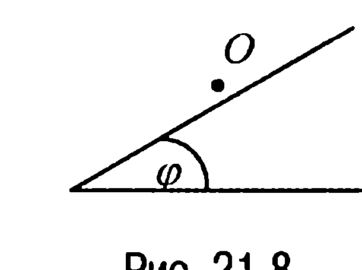

*Преобразование фигуры $F$ в фигуру $F_1$, при котором каждая точка $X$ фигуры $F$ переходит в точку $X_1$ такую, что угол между лучами $OX$ и $OX_1$ равен $\varphi$, а $OX_1 = OX$, называется* **поворотом около точки $O$ на угол $\varphi$**.

Если поворот совершается против движения часовой стрелки, то угол поворота считается положительным, если же поворот совершается по ходу часовой стрелки, то угол поворота считается отрицательным.

**Теорема 21.3.** *Поворот является движением.*

**Доказательство.** Пусть при повороте около точки $O$ на угол $\varphi$ точки $X$ и $Y$ фигуры $F$ переходят в точки $X_1$ и $Y_1$ соответственно (рис. 21.9).

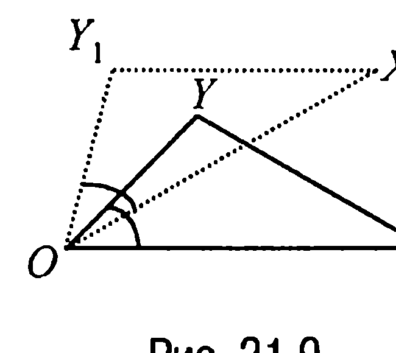

Тогда из равенства треугольников $OXY$ и $OX_1Y_1$ ($OX = OX_1$, $OY = OY_1$, $\angle XOY = \angle X_1OY_1$) следует, что $XY = X_1Y_1$. Последний факт означает, что поворот сохраняет расстояния между точками и, значит, действительно является движением.

**21.3. Параллельный перенос**

Рассмотрим на плоскости декартовы координаты $x$, $y$.

*Преобразование фигуры $F$ в фигуру $F_1$, при котором каждая ее точка $M(x; y)$ переходит в точку $M_1(x + a; y + b)$, где $a$ и $b$ одни и те же для всех точек фигуры $F$, называется* **параллельным переносом**.

---
**стр. 294**
---

Параллельный перенос определяется формулами

$$x_1 = x + a, \quad y_1 = y + b.$$

Эти формулы выражают координаты $(x_1; y_1)$ точки $M_1$, в которую переходит точка $M(x; y)$ при параллельном переносе.

**Теорема 21.4.** *Параллельный перенос является движением.*

**Доказательство.** При параллельном переносе две произвольные точки $A(x_1; y_1)$ и $B(x_2; y_2)$ фигуры $F$ переходят в точки $A_1(x_1 + a; y_1 + b)$ и $B_1(x_2 + a; y_2 + b)$ соответственно. А тогда, воспользовавшись формулой для нахождения расстояния между двумя точками, имеем:

$$AB^2 = (x_2 - x_1)^2 + (y_2 - y_1)^2, \quad A_1B_1^2 = (x_2 - x_1)^2 + (y_2 - y_1)^2.$$

Отсюда находим, что $AB = A_1B_1$ и, значит, параллельный перенос действительно является движением.

**21.4. Преобразование подобия, гомотетия**

Преобразование фигуры $F$ в фигуру $F_1$ называется **преобразованием подобия**, если при этом преобразовании расстояния между точками изменяются в одно и то же число раз.

Это означает, что если произвольные точки $X$ и $Y$ фигуры $F$ при преобразовании подобия переходят в точки $X_1$ и $Y_1$ фигуры $F_1$ соответственно, то $X_1Y_1 = k \cdot XY$, где число $k > 0$ является одним и тем же для всех точек $X, Y$.

Число $k$ **называется коэффициентом подобия**, а фигуры $F$ и $F_1$ подобными. При $k = 1$ преобразование подобия, очевидно, является движением.

Для обозначения подобия фигур используется следующий знак: $\sim$.

**Гомотетией с коэффициентом $k \neq 0$ и центром в точке $O$** *называется преобразование фигуры $F$ в фигуру $F_1$, при котором каждая точка $X$ фигуры $F$ переходит в точ-*

---
**стр. 295**
---

ку $X_1$ такую, что $OX_1 = k \cdot OX$. При этом, если $k > 0$, то точка $X_1$ лежит на луче $OX$, если же $k < 0$, то точка $X_1$ лежит на продолжении луча $OX$.

Очевидно, что при $k = -1$ гомотетия является симметрией относительно точки $O$.

**Свойства гомотетии**

**Свойство 21.4.** *Гомотетия есть преобразование подобия.*

**Доказательство.** Пусть точка $O$ — центр гомотетии, $k$ — коэффициент гомотетии, а $X$ и $Y$ — две произвольные точки фигуры $F$. При гомотетии точки $X$ и $Y$ переходят в точки $X_1$ и $Y_1$, лежащие на лучах $OX$ и $OY$ (рис. 21.10) или на их продолжениях (рис. 21.11)

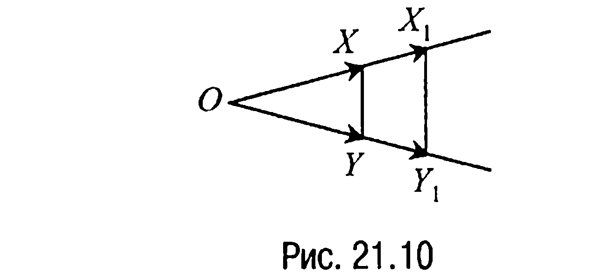

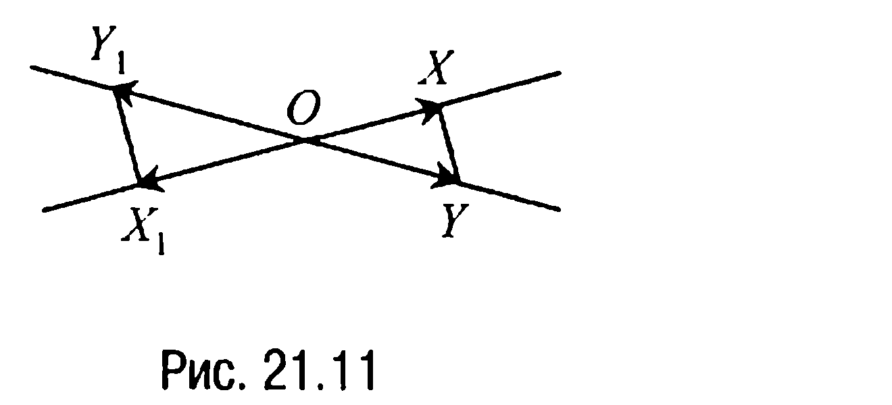

соответственно, причем $OX_1 = k \cdot OX$, $OY_1 = k \cdot OY$.

Из последних двух равенств следуют векторные равенства $\overline{OX_1} = k \cdot \overline{OX}$, $\overline{OY_1} = k \cdot \overline{OY}$. Но в таком случае $\overline{OY_1} - \overline{OX_1} = k \cdot (\overline{OY} - \overline{OX})$ и, значит, поскольку $\overline{OY_1} - \overline{OX_1} = \overline{X_1Y_1}$, $\overline{OY} - \overline{OX} = \overline{XY}$, приходим к равенству $\overline{X_1Y_1} = k \cdot \overline{XY}$.

Из последнего равенства вытекает, что $|\overline{X_1Y_1}| = |k \cdot \overline{XY}|$ или, что $X_1Y_1 = k \cdot XY$, а это и доказывает требуемое.

**Свойство 21.5.** *Гомотетия переводит прямую в прямую, отрезок — в отрезок.*

**Доказательство.** Пусть точки $X, Y$ и $Z$ — точки прямой $l$, причем точка $Y$ лежит между точками $X$ и $Z$. Очевидно, что такое расположение точек имеет место тогда и только тогда, когда $XY + YZ = XZ$.

---
**стр. 296**
---

Обозначим через $X_1$, $Y_1$ и $Z_1$ образы точек $X$, $Y$ и $Z$ соответственно при гомотетии с центром в точке $O$ и коэффициентом гомотетии, равным $k$. Тогда в соответствии со свойством 21.4 имеем:

$$X_1Y_1 = k \cdot XY, \quad Y_1Z_1 = k \cdot YZ, \quad X_1Z_1 = k \cdot XZ,$$

откуда следует, что $XY = \frac{1}{k}X_1Y_1$, $YZ = \frac{1}{k}Y_1Z_1$, $XZ = \frac{1}{k}X_1Z_1$.

Но в таком случае $X_1Y_1 + Y_1Z_1 = X_1Z_1$ и, значит, точки $X_1$, $Y_1$ и $Z_1$ лежат на одной прямой, причем точка $Y_1$ находится между точками $X_1$ и $Z_1$.

Докажем теперь, что любая точка $P_1$ прямой $X_1Z_1$ является образом некоторой точки $P$ прямой $l(XZ)$.

Действительно, пусть $P_1$ — такая точка, что $X_1P_1 + P_1Z_1 = X_1Z_1$. Тогда очевидно, что в силу единственности точки, делящей отрезок в данном отношении, и свойства 21.4 точка $P$ прямой $l$, удовлетворяющая условию $\frac{XP}{XZ} = \frac{X_1P_1}{X_1Z_1}$, и будет прообразом точки $P_1$.

Доказанный факт и означает, что гомотетия переводит прямую в прямую, а отрезок — в отрезок.

**Свойство 21.6.** *Гомотетия с положительным коэффициентом переводит луч в себя (в сонаправленный луч), а гомотетия с отрицательным коэффициентом переводит луч в его продолжение (в противоположно направленный луч).*

Справедливость этого свойства следует из определения гомотетии и свойства 21.5.

**Свойство 21.7.** *Гомотетия сохраняет углы.*

Справедливость этого свойства вытекает из свойства 21.4, причем при $k > 0$ оно иллюстрируется рис. 21.10, а при $k < 0$ — рис. 21.11.

**Свойство 21.8.** *При $k \neq 1$ гомотетия переводит прямую, не проходящую через центр гомотетии, в параллельную прямую, отрезок — в параллельный отрезок. Прямые, проходящие через центр гомотетии, отображаются на себя.*

Первая часть этого утверждения очевидным образом следует из свойства 21.4, а вторая — из определения гомотетии.

---
**стр. 297**
---

**Свойство 21.9.** *Гомотетия переводит окружность в окружность.*

**Доказательство.** Пусть даны окружность радиуса $R$ с центром в точке $Q$ и гомотетия с центром $O$ и коэффициентом $k$ (точки $O$ и $Q$ могут совпадать).

Введем декартовы координаты $(x; y)$, приняв центр гомотетии $O$ за начало координат декартовой системы (рис. 21.12).

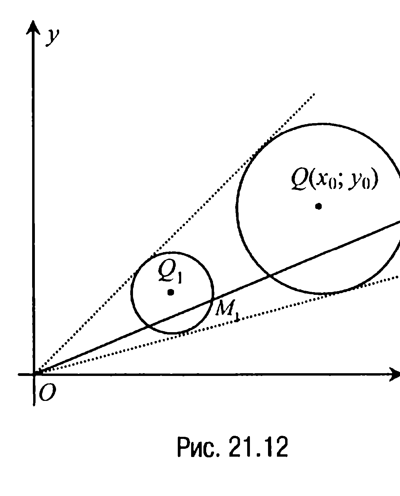

Тогда уравнение заданной окружности примет вид $(x - x_0)^2 + (y - y_0)^2 = R^2$, где $(x_0; y_0)$ — координаты точки $Q$. Любая же точка $M(x; y)$ окружности перейдет при выбранной гомотетии в точку $M_1(x_1; y_1)$, где $x_1 = k \cdot x, y_1 = k \cdot y$.

Подставляя теперь в уравнение окружности значения $x = \frac{1}{k} x_1, y = \frac{1}{k} y_1$, получим уравнение $(x_1 - k \cdot x_0)^2 + (y_1 - k \cdot y_0)^2 = (k \cdot R)^2$. Отсюда следует, что при заданной гомотетии любая точка $M(x; y)$ данной окружности переходит в точку $M_1(x_1; y_1)$ окружности радиуса $|k| \cdot R$ с центром в точке $Q_1(k \cdot x_0; k \cdot y_0)$.

Заметив теперь, что любая точка $M_1$ окружности радиуса $|k| \cdot R$ с центром в точке $Q_1$ является образом некоторой точки данной окружности (что очевидно), приходим к выводу о справедливости свойства 21.9.

**Свойство 21.10.** *Преобразование, обратное гомотетии с коэффициентом $k \neq 0$, есть гомотетия с тем же центром гомотетии и коэффициентом гомотетии, равным $1/k$.*

**Доказательство.** Пусть при гомотетии с центром $O$ и коэффициентом $k \neq 0$ точка $X$ переходит в точку $X_1$. Тогда $OX_1 = k \cdot OX$ и,

---
**стр. 298**
---

значит, $\overline{OX_1} = k \cdot \overline{OX}$ или $\overline{OX} = \frac{1}{k} \overline{OX_1}$. Из последнего же равенства следует равенство $|\overline{OX}| = \frac{1}{k} |\overline{OX_1}|$, откуда $OX = \frac{1}{k} \cdot OX_1$, что и доказывает требуемое.

**Свойство 21.11.** *Композиция двух гомотетий с общим центром и коэффициентами $k_1$ и $k_2$ есть гомотетия с тем же центром и коэффициентом $k = k_1 \cdot k_2$.*

**Доказательство.** При гомотетии с центром $O$ и коэффициентом $k_1$ точка $X$ переходит в точку $X_1$ такую, что $OX_1 = k_1 \cdot OX$. При гомотетии с тем же центром и коэффициентом $k_2$ точка $X_1$ переходит в точку $X_2$ такую, что $OX_2 = k_2 \cdot OX_1 = k_2 \cdot (k_1 \cdot OX) = k_1 \cdot k_2 \cdot OX$. Последнее равенство и означает справедливость свойства.

**Теорема 21.5.** *Преобразование подобия с коэффициентом $k$ есть композиция гомотетии с коэффициентом $k$ и движения.*

**Доказательство.** Пусть преобразование подобия с коэффициентом $k > 0$ переводит фигуру $F$ в фигуру $F_1$. Гомотетия с любым центром и тем же коэффициентом $k$ переведет ту же фигуру $F$ в фигуру $F^*$ (рис. 21.13).

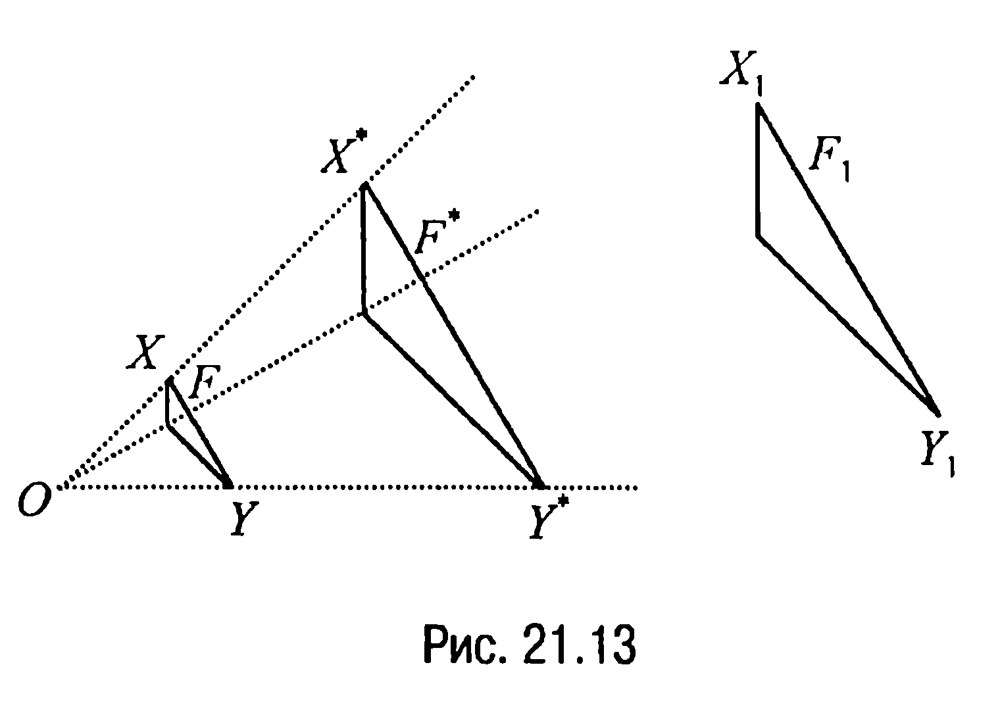

Тогда произвольным точкам $X, Y$ фигуры $F$ ставятся в соответствие при гомотетии точки $X^*, Y^*$ такие, что $X^*Y^* = k \cdot XY$. Но и для точек $X_1, Y_1$ фигуры $F_1$, соответствующих при преобразовании подобия точкам $X, Y$, справедливо аналогичное равенство $X_1Y_1 = k \cdot XY$.

Таким образом, для любых точек $X^*, Y^*$ фигуры $F^*$ верно равенство $X_1Y_1 = X^*Y^*$, которое означает, что фигуры $F_1$ и $F^*$ равны, а значит, существует движение, переводящее фигуру $F^*$ в фигуру $F_1$. Теорема доказана.

---
**стр. 299**
---

**21.5. Свойства преобразования подобия**

**Свойство 21.12.** *Преобразование подобия переводит прямую в прямую, отрезок — в отрезок, луч — в луч.*

**Свойство 21.13.** *Преобразование подобия сохраняет углы.*

**Свойство 21.14.** *Преобразование подобия переводит треугольник в треугольник. Соответственные стороны этих треугольников пропорциональны, а соответственные углы равны.*

**Свойство 21.15.** *Преобразование подобия переводит окружность в окружность.*

**Свойство 21.16.** *Преобразование, обратное преобразованию подобия с коэффициентом $k$, есть преобразование подобия с коэффициентом, равным $1/k$.*

**Свойство 21.17.** *Композиция преобразований подобия с коэффициентами $k_1$ и $k_2$ есть преобразование подобия с коэффициентом $k = k_1 \cdot k_2$.*

Справедливость сформулированных свойств следует из свойств гомотетии, движения и теоремы 21.5.

**ЗАДАЧИ**

**21.1.** Двое игроков поочередно выкладывают на прямоугольный столик монеты одного наименования. Монету разрешается класть только на свободное место. Проигрывает тот, кто не может сделать очередной ход. Доказать, что первый игрок всегда может выиграть.

**Решение.** Первый игрок кладет монету в центр столика, а затем каждый раз кладет монеты симметрично монетам второго игрока относительно центра стола.

---
**стр. 300**
---

При такой стратегии игры первый игрок выигрывает за конечное число ходов, число которых не более $S/S^*$, где $S$ — площадь столика, а $S^*$ — площадь монеты.

**21.2.** *Окружность пересекает стороны $CB$, $CA$, $AB$ треугольника $ABC$ в точках $A_1$ и $A_2$, $B_1$ и $B_2$, $C_1$ и $C_2$ соответственно. Доказать, что если перпендикуляры к сторонам треугольника, проведенные через точки $A_1$, $B_1$ и $C_1$, пересекаются в одной точке, то и перпендикуляры к сторонам, проведенные через точки $A_2$, $B_2$ и $C_2$, также пересекаются в одной точке.*

**Решение.** Пусть перпендикуляры к сторонам, проведенные через точки $A_1$, $B_1$ и $C_1$, пересекаются в точке $M_1$ и пусть точка $O$ — центр окружности (рис. 21.14).

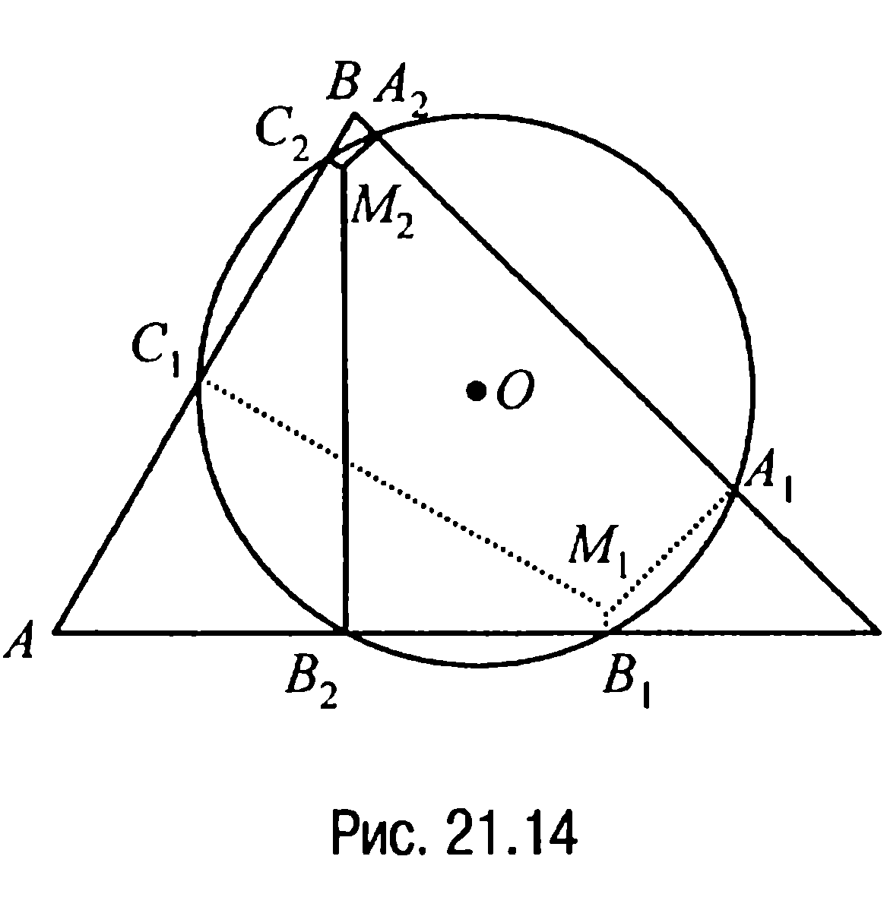

Тогда прямая, проведенная через точку $A_1$ перпендикулярно стороне $BC$, будет симметрична относительно точки $O$ прямой, проходящей через точку $A_2$ также перпендикулярно стороне $BC$.

Аналогичная ситуация имеет место и по отношению к прямым, проходящим через точки $B_1$, $B_2$ и $C_1$, $C_2$ перпендикулярно сторонам $AC$ и $AB$ соответственно.

Последнее и означает, что перпендикуляры к сторонам треугольника $ABC$, проведенные через точки $A_2$, $B_2$ и $C_2$, пересекаются в точке $M_2$, симметричной точке $M_1$ относительно центра окружности $O$.

**21.3.** *Окружности $s_1$ и $s_2$, имеющие равные радиусы, касаются внутренним образом окружности $s$ в точках $A_1$ и $A_2$. Произвольная точка $C$ окружности $s$ соединена отрезками с точками $A_1$ и $A_2$. Эти отрезки пересекают окружно-*

---
**стр. 301**
---

сти $s_1$ и $s_2$ в точках $B_1$ и $B_2$ соответственно. Доказать, что прямые $A_1A_2$ и $B_1B_2$ параллельны.

**Решение.** Проведем диаметр $MN$ окружности $s$, являющийся осью симметрии окружностей $s_1$ и $s_2$, и пусть точки $C'$ и $B_2'$ симметричны точкам $C$ и $B_2$ относительно этого диаметра (рис. 21.15).

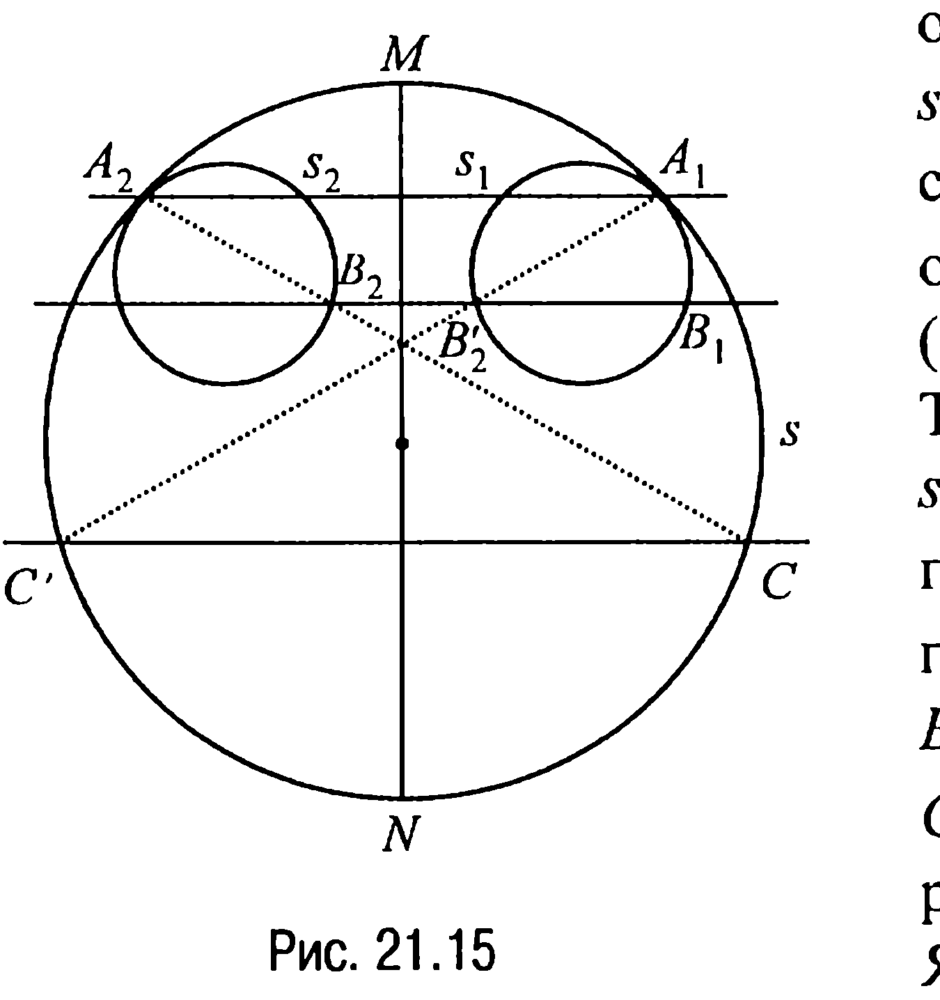

Тогда поскольку окружности $s_1$ и $s$ гомотетичны с центром гомотетии в точке $A_1$, причем при этой гомотетии прямая $B_1B_2'$ переходит в прямую $CC'$, то эти прямые будут параллельными.

Ясно также, что параллельными будут и прямые $B_2B_2'$ и $CC'$, а значит, точки $B_1$, $B_2'$ и $B_2$ лежат на одной прямой, параллельной прямой $CC'$.

Но в таком случае, замечая, что прямая $A_1A_2$ параллельна прямой $CC'$, приходим к требуемому.

**21.4.** *Точка $M$ лежит на диаметре $AB$ окружности. Хорда $CD$ проходит через точку $M$ и пересекает отрезок $AB$ под углом $45^\circ$. Доказать, что сумма $CM^2 + MD^2$ не зависит от выбора точки $M$.*

**Решение.** Пусть точки $C'$ и $D'$ симметричны точкам $C$ и $D$ относительно прямой $AB$ соответственно (рис. 21.16).

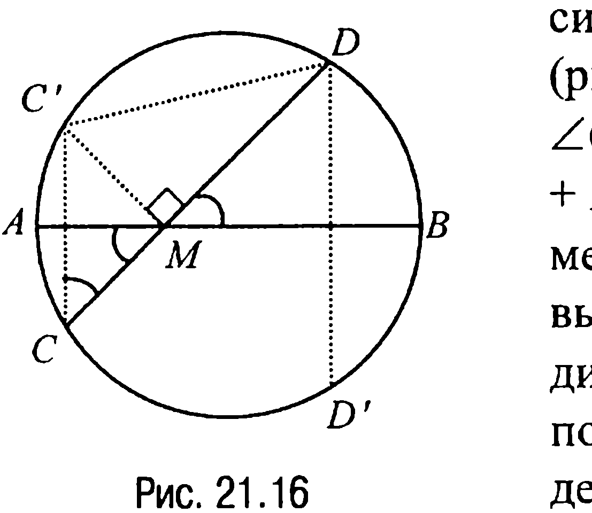

Тогда поскольку $\angle C'MD = 90^\circ$, то $CM^2 + MD^2 = C'M^2 + MD^2 = C'D^2$. Но в таком случае, замечая, что $\angle C'CD = 45^\circ$<!-- вероятная опечатка оригинала: по смыслу задачи угол между хордой и диаметром -->, приходим к выводу, что при сдвиге точки $M$ вдоль диаметра $AB$ длина хорды $C'D$ будет постоянной, а значит, постоянным будет и квадрат этой длины, что и доказывает требуемое.

---
**стр. 302**
---

**21.5.** *В каком месте следует построить мост $MN$ через реку, разделяющую деревни $A$ и $B$, чтобы путь $AMNB$ из деревни $A$ в деревню $B$ был кратчайшим? (Берега реки считаются параллельными прямыми, а мост — перпендикулярным к берегам).*

**Решение.** Пусть $A'$ — точка, в которую переходит точка $A$ при параллельном переносе на вектор $\overrightarrow{MN}$ (рис. 21.17). Тогда $A'N = AM$ и поскольку $AMNA'$ — параллелограмм, то $AM + MN = AA' + A'N$. Таким образом, $AM + MN + NB = AA' + A'N + NB$. Но длина отрезка $AA' = MN$ постоянна, следовательно, для того чтобы путь $AMNB$ был кратчайшим, необходимо, чтобы была наименьшей сумма $A'N + NB$. А это, очевидно, будет тогда, когда точка $N$ лежит на прямой $A'B$.

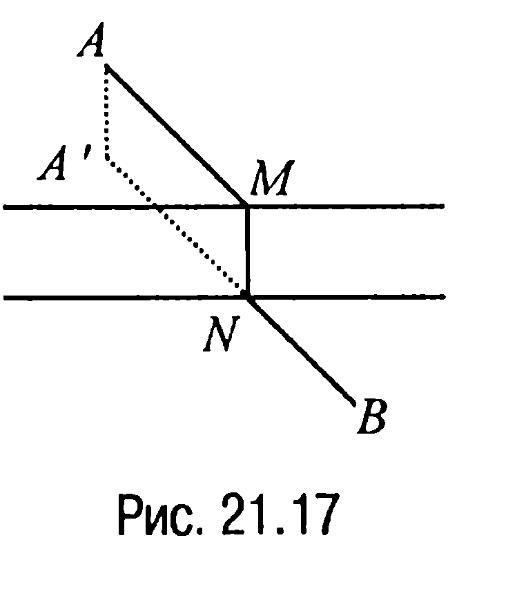

**Ответ:** мост $MN$ следует строить так, чтобы точка $N$ была точкой пересечения прямой $A'B$ и ближайшего к деревне $B$ берега реки, где $A'$ — точка, в которую переходит точка $A$ при параллельном переносе на вектор $\overrightarrow{MN}$.

**21.6.** *Доказать, что если отрезок, соединяющий середины противолежащих сторон выпуклого четырехугольника, равен полусумме двух других сторон, то такой четырехугольник — трапеция или параллелограмм.*

**Решение.** Пусть точки $E$ и $F$ — середины сторон $AB$ и $CD$ выпуклого четырехугольника $ABCD$ соответственно, причем $EF = \frac{1}{2}(AD + BC)$ (рис. 21.18) и пусть точка $K$ — это образ точки $D$ при параллельном переносе на вектор $\overline{BC}$.

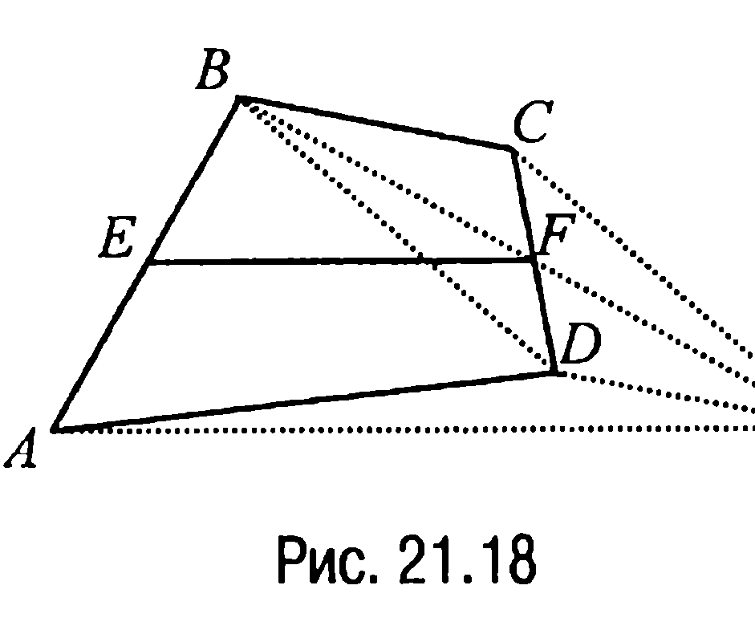

Тогда так как точка $F$ — середина диагонали $CD$ параллелограмма $BCKD$, то эта точка является серединной точкой и для диагонали $BK$. Но в таком случае отрезок $EF$ — средняя линия треугольника $ABK$ и,

---
**стр. 303**
---

значит, $AK = 2EF = AD + DK$. Отсюда следует, что точка $D$ должна лежать на отрезке $AK$, что и доказывает требуемое.

**21.7.** *Прямая $l$ пересекает стороны $AB$ и $CD$ квадрата $ABCD$ в точках $M$ и $N$ ($MN \nparallel AD$). Перпендикулярная к $l$ прямая $\gamma$ пересекает стороны $BC$ и $AD$ (или их продолжения) в точках $P$ и $Q$ соответственно. Доказать, что $MN = PQ$.*

**Решение.** Проведем через центр $O$ квадрата $ABCD$ прямые $M'N'$ и $P'Q'$, параллельные $MN$ и $PQ$ соответственно (рис. 21.19).

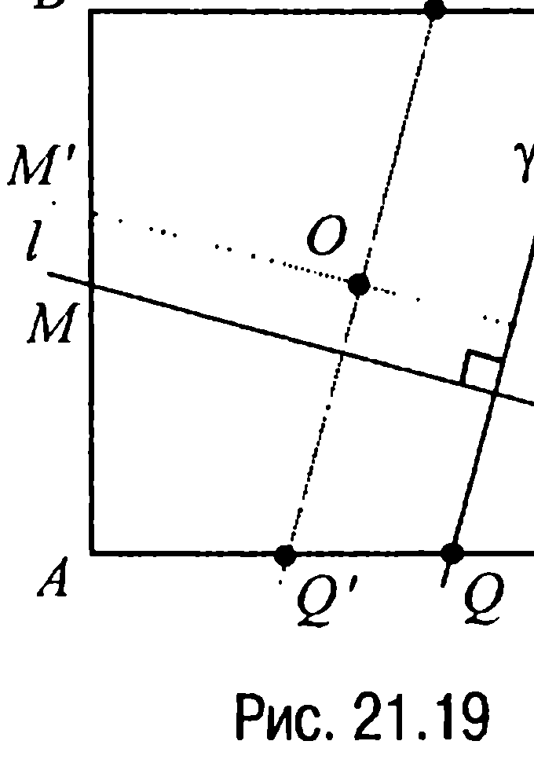

Тогда, очевидно, $MN = M'N'$ и $PQ = P'Q'$. При повороте по ходу часовой стрелки на угол $90°$ около точки $O$ точка $P'$ перейдет в точку $N'$ (так как отрезок $BC$ перейдет в отрезок $CD$), а точка $Q'$ перейдет в точку $M'$.

Таким образом, в результате поворота отрезок $P'Q'$ перейдет в равный ему отрезок $N'M'$, поскольку при повороте длины отрезков не меняются. Последний же факт с учетом предыдущих двух равенств и доказывает требуемое.

▼ **21.8.** *Доказать, что центры гомотетии трех попарно гомотетичных фигур лежат на одной прямой.*

**Решение.** Пусть $O_1, O_2$ и $O_3$ — центры гомотетии попарно гомоте-

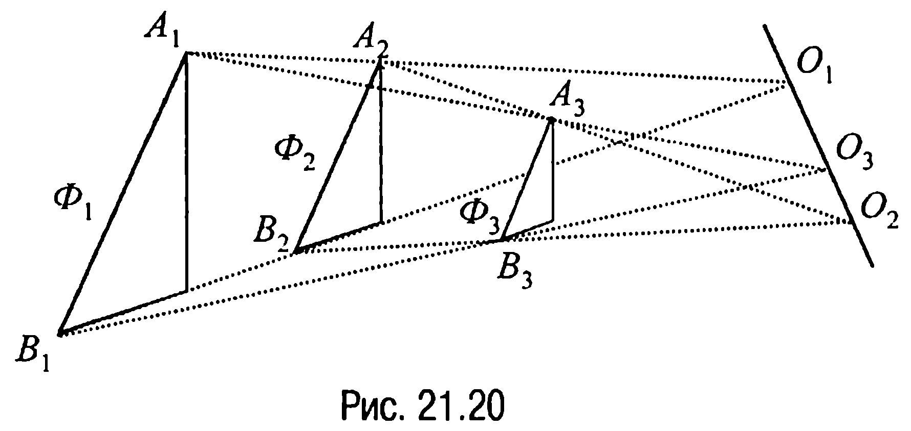

тичных фигур $\Phi_1$ и $\Phi_2$, $\Phi_2$ и $\Phi_3$, $\Phi_3$ и $\Phi_1$ соответственно. Не умаляя общности рассуждений, доказательство проведем для пар гомоте-

---
**стр. 304**
---

тичных точек $A_1, B_1 \in \Phi_1, A_2, B_2 \in \Phi_2, A_3, B_3 \in \Phi_3$ каждой фигуры (рис. 21.20). Тогда гомотетия с центром $O_1$ переводит отрезок $A_1B_1$ в отрезок $A_2B_2$, где $\frac{A_1B_1}{A_2B_2} = \frac{O_1A_1}{O_1A_2}$, гомотетия с центром $O_2$ переводит отрезок $A_2B_2$ в отрезок $A_3B_3$, где $\frac{A_2B_2}{A_3B_3} = \frac{O_2A_2}{O_2A_3}$, а гомотетия с центром $O_3$ переводит отрезок $A_3B_3$ в отрезок $A_1B_1$, где $\frac{A_3B_3}{A_1B_1} = \frac{O_3A_3}{O_3A_1}$.

Но в таком случае $\frac{A_1B_1}{A_2B_2} \cdot \frac{A_2B_2}{A_3B_3} \cdot \frac{A_3B_3}{A_1B_1} = \frac{O_1A_1}{O_1A_2} \cdot \frac{O_2A_2}{O_2A_3} \cdot \frac{O_3A_3}{O_3A_1}$ или $\frac{O_1A_1}{O_1A_2} \cdot \frac{O_2A_2}{O_2A_3} \cdot \frac{O_3A_3}{O_3A_1} = 1$, откуда по теореме Менелая, примененной к треугольнику $A_1A_2A_3$, и следует, что точки $O_1, O_3, O_2$ лежат на одной прямой.

**21.9.** *В треугольник $ABC$ вписан квадрат со стороной $d$ таким образом, что две его вершины лежат на основании, а две другие вершины лежат на боковых сторонах треугольника. Доказать, что если $r$ — радиус вписанной в треугольник $ABC$ окружности, то $\sqrt{2}\,r < d < 2r$.*

**Решение.** Построим вписанную и описанную окружности квадрата и проведем к этим окружностям касательные, параллельные сторонам треугольника $ABC$, как это показано на рис. 21.21.

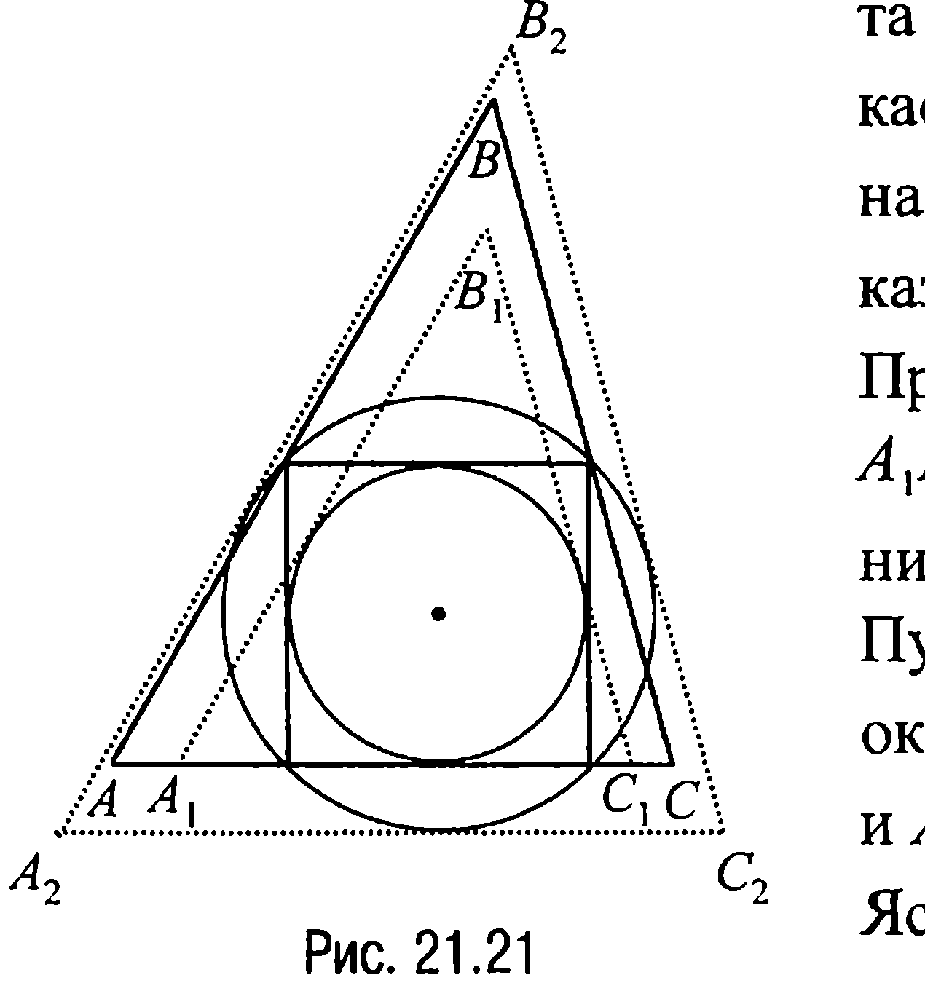

При этом образуются треугольники $A_1B_1C_1$ и $A_2B_2C_2$, подобные треугольнику $ABC$. Пусть $r_1$ и $r_2$ — радиусы вписанных окружностей треугольников $A_1B_1C_1$ и $A_2B_2C_2$ соответственно. Ясно, что $r_1 < r < r_2$. Ясно также,

---
**стр. 305**
---

что $r_1 = \frac{1}{2}d$, $r_2 = \frac{1}{\sqrt{2}}d$, поэтому $\frac{1}{2}d = r_1 < r$, $\frac{1}{\sqrt{2}}d = r_2 > r$, т. е. $d < 2r$ и $d > \sqrt{2}r$, что и требовалось доказать.

**ЗАДАЧИ ДЛЯ САМОСТОЯТЕЛЬНОГО РЕШЕНИЯ**

**21.1С.** *В треугольнике $ABC$ проведены медианы $AF$ и $CE$. Доказать, что если $\angle BAF = \angle BCE = 30°$, то треугольник $ABC$ равносторонний.*

**21.2С.** *В прямоугольном треугольнике $ABC$ на катете $BC$ отмечена точка $M$ таким образом, что $BM = 2MC$. Точка $K$ — середина гипотенузы $AB$. Найти угол $BAM$, если угол $MKC$ равен $\varphi$.*

**21.3С.** *Точка $M$, расположенная внутри треугольника $ABC$, движется параллельно стороне $BC$ до пересечения со стороной $CA$, затем она движется параллельно стороне $AB$ до пересечения со стороной $BC$, затем — параллельно $AC$ до пересечения с $AB$ и т. д. Доказать, что через некоторое число шагов траектория движения точки замкнется.*

**21.4С.** *На последовательных отрезках $AB$ и $BC$ прямой по одну сторону от нее построены равносторонние треугольники $AMB$ и $BNC$. Точка $K$ — середина отрезка $AN$, а точка $L$ — середина отрезка $MC$. Доказать, что треугольник $KBL$ — равносторонний.*

**21.5С.** *Пусть $s_1$, $s_2$ и $s_3$, $s_4$ — две пары касающихся между собой окружностей, вписанных в один и тот же угол; $r_1$, $r_2$ и $r_3$, $r_4$ — их радиусы ($r_1 > r_2$, $r_3 > r_4$). Доказать, что*

$$\frac{r_1}{r_2} = \frac{r_3}{r_4}.$$

---
**стр. 306**
---

**21.6С.** *К окружностям $s_1$, $s_2$ и $s_3$ различных радиусов проведены общие внешние касательные: $AD$ и $AE$ — к $s_1$ и $s_2$, $BF$ и $BG$ — к $s_2$ и $s_3$, $CK$ и $CH$ — к $s_1$ и $s_3$. Доказать, что точки $A$, $B$ и $C$ лежат на одной прямой.*

**21.7С.** *Населенные пункты $A$ и $B$ разделены двумя каналами, у каждого из которых параллельные берега. В каких местах следует построить переправы $CD$ и $EF$ через первый и второй каналы соответственно (переправы считаются перпендикулярными к берегам каналов), чтобы путь $ACDEFB$ из пункта $A$ в пункт $B$ был кратчайшим?*
