## 6.1. Задачи на доказательство и вычисление

---
**стр. 307**
---

**ГЛАВА 6**

**ЗАДАЧИ НА МАКСИМУМ И МИНИМУМ**

**§ 22. ЗАДАЧИ НА ДОКАЗАТЕЛЬСТВО И ВЫЧИСЛЕНИЕ**

**22.1. Треугольники**

**22.1.** *Доказать, что среди всех треугольников, вписанных в данный остроугольный треугольник, наименьший периметр имеет треугольник с вершинами в основаниях высот данного.*

**Решение.** Отметим на стороне $BC$ остроугольного треугольника

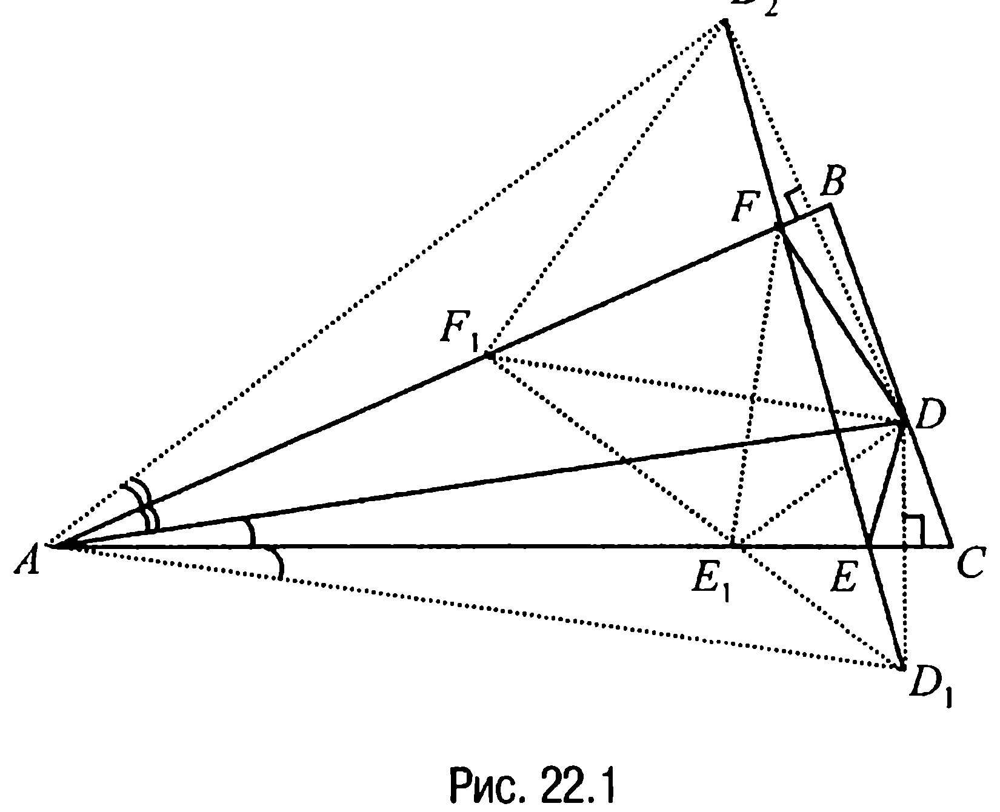

$ABC$ произвольную точку $D$ (рис. 22.1) и найдем на сторонах $AB$ и $AC$ соответственно точки $F$ и $E$ такие, чтобы при выбранной точке $D$ периметр треугольника $DEF$ был наименьшим.

Для этого отметим точки $D_1$ и $D_2$, симметричные точке $D$ относительно сторон $AC$ и $AB$ соответственно.

---
**стр. 308**
---

А тогда в качестве вершин $E$ и $F$ следует выбрать точки пересечения отрезка $D_1D_2$ со сторонами $AC$ и $AB$, поскольку периметр треугольника $DEF$ равен длине отрезка $D_1D_2$ (периметр любого другого треугольника $DE_1F_1$ равен длине ломаной $D_1E_1F_1D_2$, причем эта длина больше длины отрезка $D_1D_2$).

Таким образом, остается определить положение точки $D$, при котором длина отрезка $D_1D_2$ будет наименьшей.

Дальнейшие рассуждения здесь следующие. Так как при любом положении точки $D$ на отрезке $BC$ угол $D_1AD_2$ равен удвоенному углу $CAB$, а $D_1A = D_2A = DA$, то длина отрезка $D_1D_2$ будет наименьшей, когда наименьшей будет длина отрезка $DA$, т. е. когда отрезок $DA$ — высота треугольника $ABC$.

А поскольку выше было доказано существование и единственность минимального (по периметру) треугольника $DEF$, то, повторяя проведенные рассуждения относительно других сторон треугольника $ABC$, придем к выводу, что точки $E$ и $F$ также должны быть основаниями соответствующих высот треугольника $ABC$.

**22.2.** *Через точку $A$, лежащую внутри угла с вершиной $O$, проведена прямая, отсекающая от этого угла треугольник $OMN$. Доказать, что треугольник $OMN$ имеет наименьшую возможную площадь тогда и только тогда, когда точка $A$ является серединой отрезка $MN$.*

**Решение.** Пусть $MN$ — произвольная прямая, проходящая через

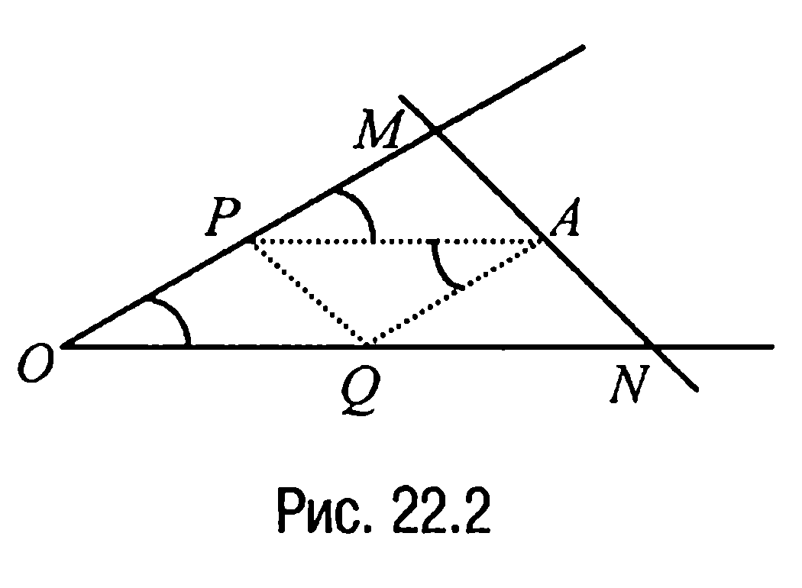

точку $A$, лежащую внутри угла с вершиной $O$ (рис. 22.2), и пусть $P$ и $Q$ — точки пересечения прямых, проходящих через точку $A$ параллельно прямым $ON$ и $OM$ соответственно, с прямыми $OM$ и $ON$. Введем следующие обозначения: $x$ — площадь треугольника $APM$, $y$ — площадь треугольника $ANQ$, $z$ — площадь треугольника $AQP$, $S$ — площадь треугольника $OMN$, $AM = a$, $AN = b$.

А тогда если $h_1$ — высота треугольника $PMA$, опущенная из вершины $M$, $h_2$ — высота треугольника $QAN$, опущенная из верши-

---
**стр. 309**
---

ны $A$, $\angle MAP = \angle MNO = \phi$, то так как $h_1 = a \cdot \sin \phi$, $h_2 = b \cdot \sin \phi$, находим, что $x = \frac{1}{2} PA \cdot a \cdot \sin \phi$, $z = \frac{1}{2} PA \cdot b \cdot \sin \phi$ и, значит, $\frac{x}{z} = \frac{a}{b}$.

С другой стороны, на основании свойства 19.3 справедливо равенство $\frac{y}{z} = \frac{QN}{PA} = \frac{QN}{OQ}$, а по обобщенной теореме Фалеса $\frac{QN}{OQ} = \frac{b}{a}$ и, следовательно $\frac{y}{z} = \frac{b}{a}$. Таким образом, $S = x + y + 2z = z \left( \frac{a}{b} + \frac{b}{a} + 2 \right) = 4z + z \frac{(a-b)^2}{ab}$. Отсюда вывод: наименьшее значение $S$ — это $4z$ и оно достигается тогда и только тогда, когда $a = b$, что и требовалось доказать.

**22.3.** *Даны две параллельные прямые $l_1$ и $l_2$ и точка $A$ между ними, лежащая на расстоянии $d$ от прямой $l_1$ и на расстоянии $b$ от прямой $l_2$. Известно, что вершины $B$ и $C$ треугольника $ABC$ лежат на прямых $l_1$ и $l_2$ соответственно и $\angle CAB = \phi$. Какова наименьшая возможная площадь треугольника $ABC$?*

**Решение.** Пусть $D$ и $E$ — точки пересечения перпендикуляра к

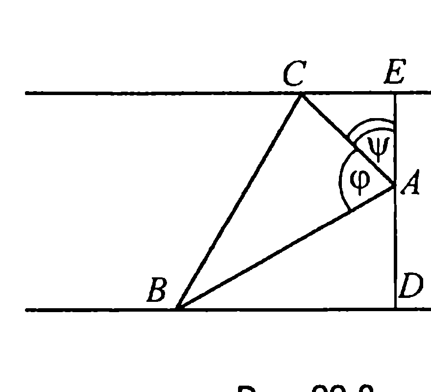

прямым $l_1$ и $l_2$ соответственно с этими прямыми и пусть $DA = d$, $AE = b$, $\angle EAC = \psi$ (рис. 22.3). Тогда $\angle BAD = 180^\circ - (\phi + \psi)$ и из прямоугольных треугольников $CEA$ и $ADB$ соответственно находим, что $AC = \frac{b}{\cos \psi}$, $AB = \frac{d}{\cos(180^\circ - (\phi + \psi))} = -\frac{d}{\cos(\phi + \psi)}$, и поэтому площадь треугольника $CAB$ — это $S = -\frac{db \sin \phi}{2 \cos \psi \cdot \cos(\phi + \psi)} = -\frac{db \sin \phi}{\cos \psi + \cos(\phi + 2\psi)}$.

Очевидно, что полученное значение площади треугольника $CAB$

---
**стр. 310**
---

будет наименьшим, если $\phi + 2\psi = 180^\circ$. Таким образом, искомым значением площади будет

$$S = \frac{db \sin \phi}{1 - \cos \phi} = \frac{2db \sin \frac{\phi}{2} \cos \frac{\phi}{2}}{2 \sin^2 \frac{\phi}{2}} = d \cdot b \cdot \operatorname{ctg} \frac{\phi}{2}.$$

**Ответ:** $d \cdot b \cdot \operatorname{ctg} \frac{\phi}{2}$.

**22.4.** *Дан прямоугольный треугольник, один из острых углов которого равен $\phi$. Найти отношение радиусов описанной и вписанной окружностей и определить, при каком $\phi$ это отношение будет наименьшим.*

**Решение.** Если $R$ — радиус описанной, а $r$ — радиус вписанной

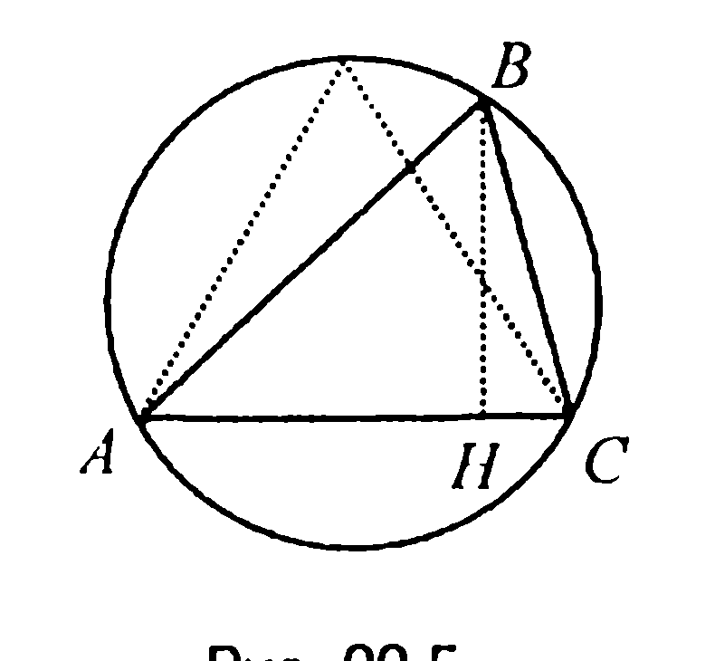

окружности (рис. 22.4), то, очевидно, $2R = r \cdot \operatorname{ctg} \frac{\phi}{2} + r \cdot \operatorname{ctg} \left( \frac{\pi}{4} - \frac{\phi}{2} \right)$.

А тогда, заметив, что $\operatorname{ctg} \frac{\phi}{2} + \operatorname{ctg} \left( \frac{\pi}{4} - \frac{\phi}{2} \right) =$

$$= \frac{\cos \frac{\phi}{2} \sin \left( \frac{\pi}{4} - \frac{\phi}{2} \right) + \cos \left( \frac{\pi}{4} - \frac{\phi}{2} \right) \sin \frac{\phi}{2}}{\sin \frac{\phi}{2} \cdot \sin \left( \frac{\pi}{4} - \frac{\phi}{2} \right)} = \frac{2 \sin \frac{\pi}{4}}{\cos \left( \phi - \frac{\pi}{4} \right) - \cos \frac{\pi}{4}} =$$

$$= \frac{2}{\sqrt{2} \cos \left( \phi - \frac{\pi}{4} \right) - 1}, \text{ приходим к выводу, что } \frac{R}{r} = \frac{1}{\sqrt{2} \cos \left( \phi - \frac{\pi}{4} \right) - 1}.$$

Что же касается второго вопроса, то ответ здесь такой: отношение $R/r$ будет наименьшим, когда $\cos \left( \phi - \frac{\pi}{4} \right) = 1$, т. е. когда $\phi = \frac{\pi}{4}$.

**Ответ:** $\frac{1}{\sqrt{2} \cos \left( \phi - \frac{\pi}{4} \right) - 1}; \phi = \frac{\pi}{4}$.

---
**стр. 311**
---

**22.5.** *Доказать, что из всех треугольников с одним и тем же основанием и одинаковым углом при вершине равнобедренный имеет наибольшую площадь.*

**Решение.** Из условия следует, что все рассматриваемые треугольники вписаны в одну и ту же окружность.

Пусть треугольник $ABC$ — один из них (рис. 22.5) и пусть $BH = h$ — высота тре-

угольника, опущенная на основание $AC$. Тогда площадь треугольника $S_{\triangle ABC} = \frac{1}{2} AC \cdot h$

и, значит, чем больше высота, тем больше площадь треугольника (при постоянном основании). А поскольку наиболее удаленной точкой окружности от хорды $AC$ является точка пересечения окружности с перпендикулярным к хорде диаметром, то отсюда и следует требуемое.

**22.6.** *Гипотенуза прямоугольного треугольника равна $c$. Каковы должны быть катеты этого треугольника, чтобы площадь его была наибольшей?*

**Решение.** Так как все прямоугольные треугольники с одной и той же гипотенузой $c$ вписаны в одну и ту же окружность, то в соответствии с предыдущей задачей наибольшую площадь будет иметь прямоугольный треугольник с равными катетами, каждый из которых равен $\frac{c\sqrt{2}}{2}$.

**Ответ:** $\frac{c\sqrt{2}}{2}, \frac{c\sqrt{2}}{2}$.

**22. 2. Четырехугольники**

**22.7.** *Внутри угла $\phi$ с вершиной в точке $O$ отмечена точка $A$. На различных сторонах угла отмечены точки $M$ и $N$ таким образом, что $\angle MAN = \psi$ ($\phi + \psi > 180^\circ$). Доказать, что четырехугольник $OMAN$ имеет наименьшую возможную площадь в том случае, когда $MA = AN$.*

**Решение.** Наряду с четырехугольником $OMAN$, у которого сторона

---
**стр. 312**
---

$MA = AN$ и $\angle MAN = \psi$, рассмотрим четырехугольник $OM_1AN_1$ (рис. 22.6), у которого $\angle M_1AN_1 = \psi$.

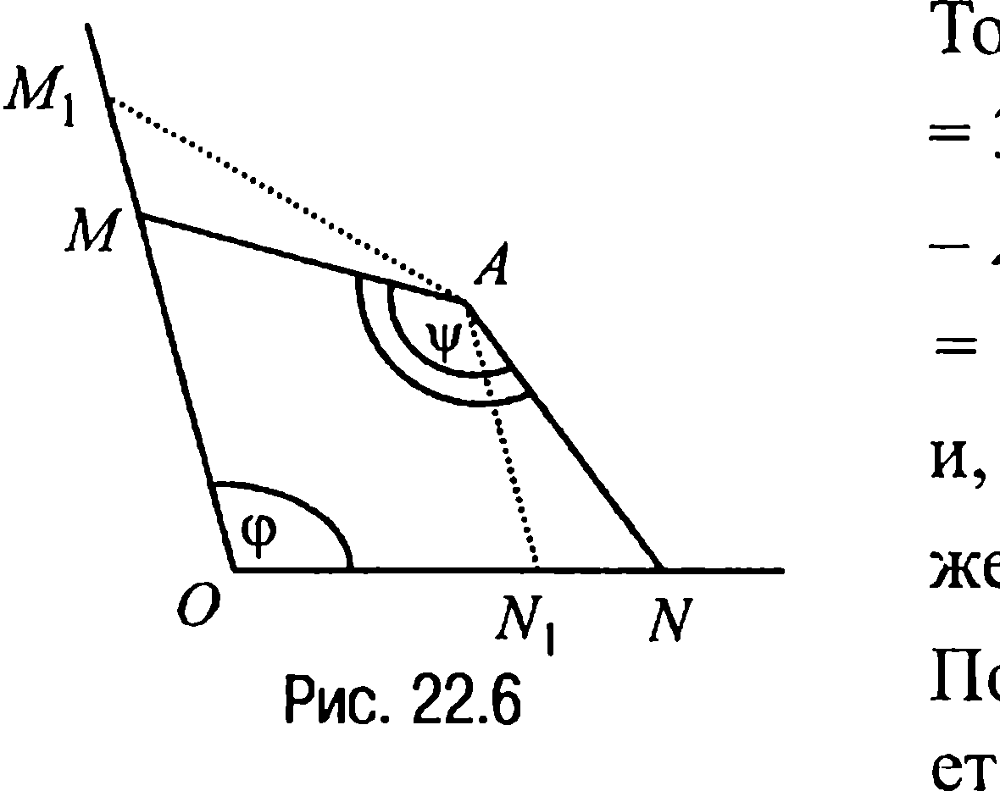

Тогда поскольку $\angle OM_1A = \angle MM_1A = 360^\circ - (\varphi + \psi) - \angle AN_1O < 180^\circ - \angle AN_1O = \angle ANN_1$, $\angle M_1AN = \angle N_1AN$, $MA = AN$, то $M_1A > AN_1$ и, значит, $S_{\Delta M_1AM} > S_{\Delta ANN_1}$. Последнее же означает, что $S_{OM_1AN_1} > S_{OMAN}$. Полученное неравенство и доказывает требуемое.

**22.8.** Среди всех прямоугольников, вписанных в треугольник $ABC$ таким образом, что две вершины прямоугольника лежат на основании $AC$, а две другие — на боковых сторонах $AB$ и $BC$ соответственно, найти 1) прямоугольник с наибольшей площадью и 2) прямоугольник с наименьшей диагональю.

**Решение.** Пусть основание треугольника $AC = a$, высота треугольника $BD = h$ и пусть $KLMN$ — вписанный в треугольник $ABC$ прямоугольник со сторонами $LM = x$ и $KL = y$ (рис. 22.7). Найдем сначала среди прямоугольников тот, у которого наибольшая площадь. Рассуждения здесь следующие.

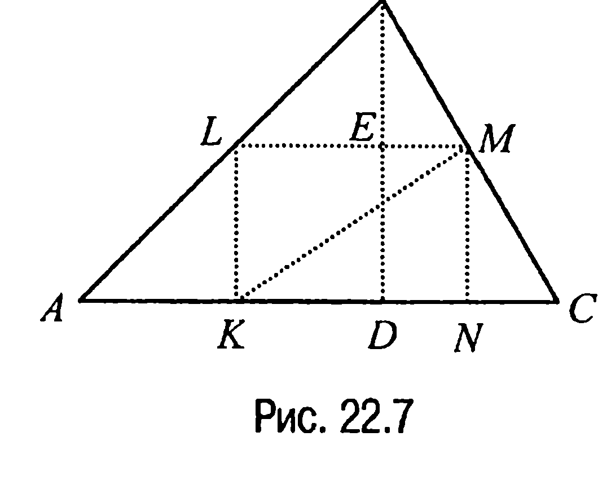

Пусть $E$ — точка пересечения высоты $BD$ треугольника и стороны $LM$ прямоугольника. Тогда так как треугольники $LBM$ и $ABC$ подобны, то

$$\frac{LM}{AC} = \frac{BE}{BD} \quad \text{или} \quad \frac{x}{a} = \frac{h-y}{h},$$

откуда вытекает, что $x = (h-y)\frac{a}{h}$. Полученное равенство позволяет заключить, что площадь любого вписанного в треугольник $ABC$ прямоугольника

$$S = x \cdot y = \frac{a}{h}y(h-y)$$

является функцией только одной переменной $y$. А поскольку парабола, за-

---
**стр. 313**
---

данная уравнением $S(y) = \frac{a}{h} y \cdot (h-y) = -\frac{a}{h} y^2 + ay$, направлена ветвями вниз, то на интервале $(0; h)$ функция $S(y)$ имеет максимум, который достигается в точке $y = \frac{h}{2}$. При таком значении $y$ находим, что $x = \frac{a}{2}$.

Таким образом, среди всех вписанных в треугольник $ABC$ прямоугольников тот будет иметь наибольшую площадь, у которого одна из сторон является средней линией треугольника

$$(\text{при этом } \frac{x}{y} = \frac{a}{h}).$$

Выясним теперь, у какого из вписанных в треугольник $ABC$ прямоугольников диагональ является наименьшей.

Итак, пусть у прямоугольника $KLMN$ (рис. 22.7) диагональ $KM = d$. Тогда $d^2 = x^2 + y^2 = y^2 + \left(\frac{a}{h}(h-y)\right)^2 = \left(1 + \left(\frac{a}{h}\right)^2\right) y^2 - 2\frac{a^2}{h} y + a^2$ и, следовательно, диагонали прямоугольников также являются функцией только одной переменной $y$.

А так как для параболы, заданной уравнением

$$f(y) = \left(1 + \left(\frac{a}{h}\right)^2\right) y^2 - 2\frac{a^2}{h} y + a^2,$$

с ветвями, направленными вверх, минимум достигается при $y = y_0 = h\frac{(a/h)^2}{1 + (a/h)^2}$, то соответствующее этому значению $y$ значение $x_0 = h\frac{a/h}{1 + (a/h)^2}$. Следовательно, диагональ будет наименьшей у того прямоугольника, у которого отношение сторон $\frac{x_0}{y_0} = \frac{h}{a}$.

В заключение заметим, что отношение сторон прямоугольника с наименьшей диагональю обратно отношению сторон прямоугольника с наибольшей площадью (прямоугольники вписаны в один и

---
**стр. 314**
---

тот же треугольник).

**Ответ:** 1) прямоугольник, у которого одна из сторон является средней линией треугольника; 2) прямоугольник, у которого отношение стороны, лежащей на основании $AC$ треугольника, к смежной стороне прямоугольника равно отношению высоты треугольника, опущенной из вершины $B$ на основание $AC$ треугольника, к основанию $AC$ треугольника.

**22.9.** *Какой среди всех прямоугольников, имеющих один и тот же периметр $2p$, имеет наибольшую площадь?*

**Решение.** Обозначим одну сторону прямоугольника через $x$. Тогда из условия следует, что смежная ей сторона равна $p - x$. Значит площадь прямоугольника $S = x(p - x)$, и поскольку произведение двух положительных сомножителей, сумма которых постоянна, принимает наибольшее значение, когда эти сомножители равны между собой, то $x = p - x$, откуда следует, что $x = \frac{p}{2}$.

Таким образом, среди всех прямоугольников с одним и тем же периметром наибольшую площадь имеет квадрат.

**Ответ:** квадрат со стороной, равной $\frac{p}{2}$.

**22.10.** *Найти сторону «наибольшего» из квадратов, внутренние точки которых лежат внутри правильного шестиугольника со стороной $a$.*

**Решение.** Так как правильный шестиугольник и квадрат — фигуры центрально-симметричные, то центр вписанного в шестиугольник квадрата (очевидно, что именно среди вписанных в шестиугольник квадратов и следует искать искомый) должен совпадать с центром шестиугольника.

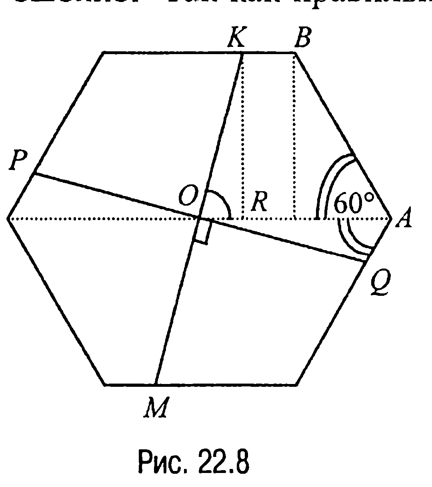

Пусть в правильном шестиугольнике сторона $AB = a$, точка $O$ — центр симметрии шестиугольника, $K$ — одна из вершин квадрата, $M$ — цен-

---
**стр. 315**
---

трально-симметричная ей точка, $R$ — основание перпендикуляра, опущенного из точки $K$ на прямую $AO$, $P$ и $Q$ — точки пересечения прямой, проходящей через точку $O$ перпендикулярно $KM$, с противолежащими сторонами шестиугольника, $\angle AOK = \phi$ (рис. 22.8). Тогда из прямоугольного треугольника $KRO$ следует, что

$$KO = \frac{KR}{\sin \phi} = \frac{\sqrt{3} \cdot a}{2 \sin \phi}.$$

С другой стороны, поскольку $\angle QOA = 90^\circ - \phi$ и, значит, $\angle AQO = 180^\circ - (90^\circ - \phi + 60^\circ) = 30^\circ + \phi$, то по теореме синусов из треугольника $AQO$ имеем: $\dfrac{OQ}{\sin 60^\circ} = \dfrac{AO}{\sin(30^\circ + \phi)}$, откуда, с учётом того, что $AO = AB = a$, находим $OQ = \dfrac{a\sqrt{3}}{2\sin(30^\circ + \phi)}$.

Дальнейшие рассуждения здесь следующие. Во-первых, чтобы задача имела решение, должно выполняться неравенство $OQ \ge KO$ ($KM$ — диагональ квадрата) или $\sin(30^\circ + \phi) \le \sin \phi$.

Далее, так как $\angle BOA < \phi$, то $\phi > 60^\circ$, а с учётом того, что всегда можно считать, что $\phi \le 90^\circ$, то приходим к неравенствам $60^\circ < \phi \le 90^\circ$.

Но в таком случае, чтобы выполнялось условие $\sin(30^\circ + \phi) \le \sin \phi$, необходимо и достаточно, чтобы $75^\circ \le \phi \le 90^\circ$. Из формулы же для вычисления отрезка $KO$ вытекает, что с увеличением угла $\phi$ диагональ квадрата уменьшается. Поэтому $\phi$ нужно выбрать минимальным, т. е. равным $75^\circ$. Таким образом, $KO = \dfrac{a\sqrt{3}}{2\sin 75^\circ} = \dfrac{a\sqrt{3}}{2\cos 15^\circ}$ и, следовательно, сторона искомого квадрата — это

$$KO \cdot \sqrt{2} = \frac{a\sqrt{6}}{2\cos 15^\circ} = \frac{a\sqrt{6}}{2\left(\dfrac{\sqrt{6}+\sqrt{2}}{4}\right)} = a \cdot (3 - \sqrt{3}).$$

**Ответ:** $a \cdot (3 - \sqrt{3})$.

---
**стр. 316**
---

**22.11.** *В выпуклый четырехугольник с площадью $S$ вписан параллелограмм, стороны которого соответственно параллельны диагоналям четырехугольника. Какова наибольшая возможная площадь этого параллелограмма?*

**Решение.** Пусть $ABCD$ — данный четырехугольник, $O$ — точка пересечения его диагоналей, $EFGH$ — произвольный параллелограмм, удовлетворяющий условиям задачи (рис. 22.9), и пусть $AC = d_1$, $BD = d_2$, $\angle EFG = \phi$.

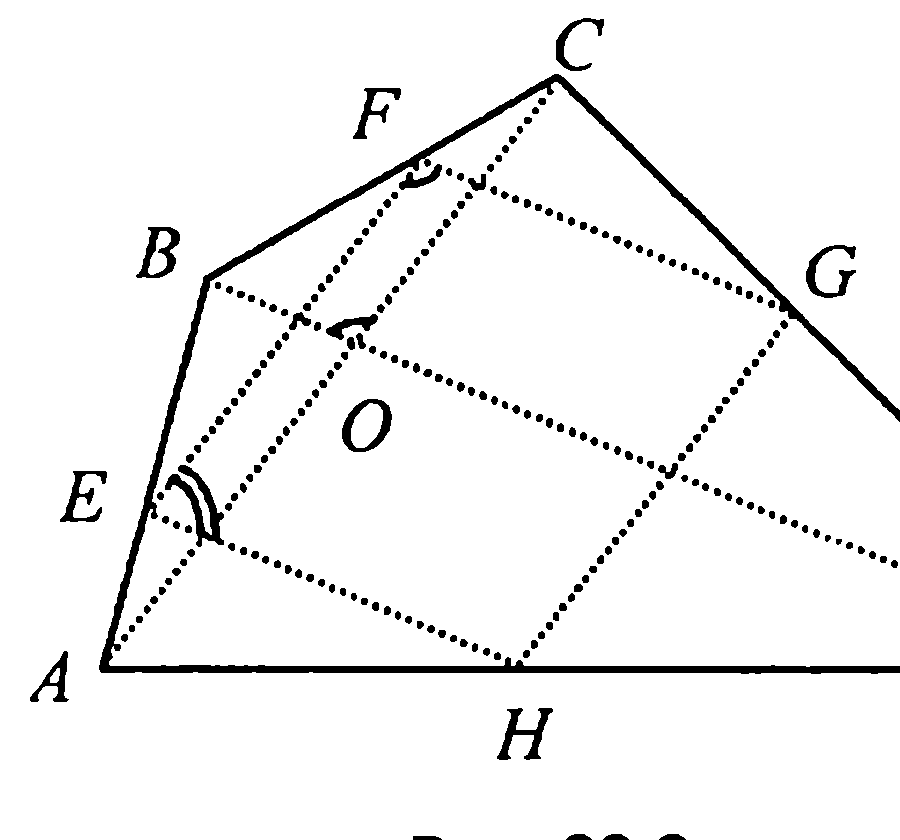

Тогда так как треугольник $AEH$ подобен треугольнику $ABD$ с некоторым положительным коэффициентом подобия $x < 1$, то $AE = x \cdot AB$, $EH = x \cdot BD = x \cdot d_2$, а $EF = (1 - x) \cdot d_1$. А поскольку $\sin \angle HEF = \sin(\pi - \phi) = \sin \phi$, то площадь $S_{EFGH} = EF \cdot FG \sin \phi = EF \cdot EH \cdot \sin \phi = x \cdot (1 - x) d_1 \cdot d_2 \cdot \sin \phi =$
$= 2x \cdot (1 - x) \dfrac{1}{2} d_1 \cdot d_2 \cdot \sin \phi = 2x \cdot (1 - x) \cdot S_{ABCD} = 2x \cdot (1 - x) \cdot S.$

Но в таком случае, замечая, что наибольшее значение квадратного трехчлена $f(x) = -x^2 + x$ на интервале $0 < x < 1$ достигается при $x_0 = \dfrac{1}{2}$ и оно равно $\dfrac{1}{4}$, приходим к выводу, что наибольшую среди рассматриваемых параллелограммов площадь имеет тот, площадь которого равна $S/2$.

Заметим, что таким параллелограммом (задачи 13.1; 19.11) будет параллелограмм, вершинами которого являются середины сторон данного четырехугольника.

**Ответ:** $S/2$.

**22.12.** *Две стороны параллелограмма лежат на сторонах данного треугольника, а одна из его вершин принадлежит третьей стороне. При каких условиях площадь параллелограмма будет наибольшей?*

**Решение.** Пусть $ABC$ — данный треугольник с основанием $AC = a$ и высотой $BG = H$ (рис. 22.10), четырехугольник $ADEF$ — впи-

---
**стр. 317**
---

санный в треугольник параллелограмм с высотой $EK = h$.

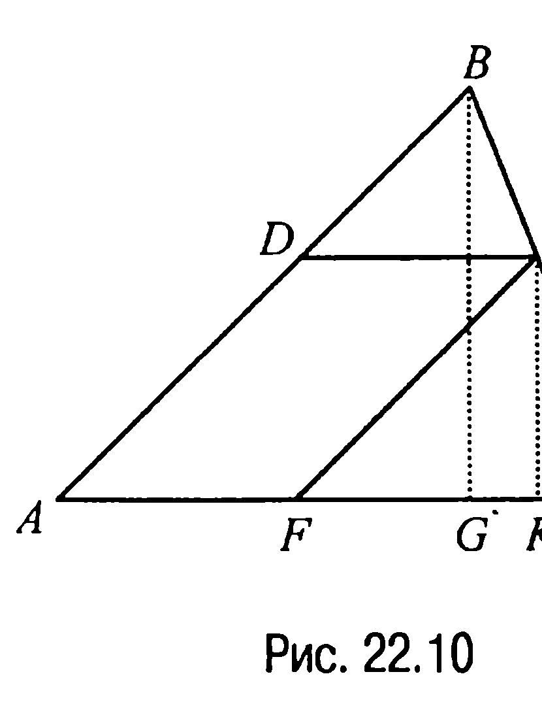

Тогда так как треугольник $FEC$ подобен треугольнику $ABC$ с некоторым коэффициентом подобия $x$ ($0 < x < 1$), то $FC = x \cdot AC$, $h = x \cdot H$ и, значит, площадь параллелограмма $S_{ADEF} = AF \cdot h = (1 - x) \cdot x \cdot a \cdot H$. Отсюда следует, что поскольку $a$ и $H$ фиксированы, то площадь параллелограмма будет наибольшей, когда значение квадратного трехчлена $f(x) = (1 - x) \cdot x = -x^2 + x$ на промежутке $0 < x < 1$ будет наибольшим.

А это, очевидно, будет тогда, когда $x = \dfrac{1}{2}$, т. е. когда $h = H/2$.

**Ответ:** при условии, что $h = H/2$, где $h$ — высота параллелограмма, а $H$ — высота треугольника, или, что то же самое, при условии, когда одна из сторон параллелограмма совпадает со средней линией треугольника.

**22.13.** *Боковая сторона равнобочной трапеции равна её меньшему основанию, равному $a$. Каково должно быть большее основание трапеции, чтобы её площадь была наибольшей?*

**Решение.** Пусть четырёхугольник $ABCD$ (рис. 22.11) — равнобочная трапеция, у которой $AB = BC = CD = a$, $BE = h$ — высота. Обозначим $AE = x$. Тогда площадь трапеции

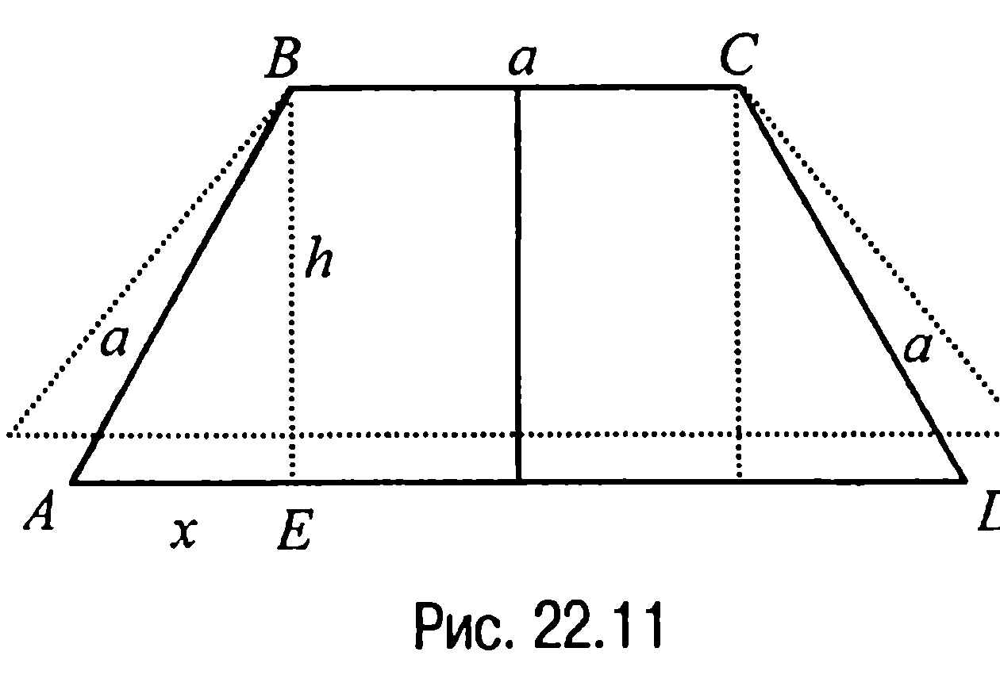

$$S_{ABCD} = \frac{1}{2}(2a + 2x) \cdot h = (a + x) \cdot h = (a + x)\sqrt{a^2 - x^2} =$$
$$= \sqrt{(a + x)^2(a^2 - x^2)} = \sqrt{-x^4 - 2ax^3 + 2a^3x + a^4} .$$

Таким образом, задача свелась к нахождению того значения $x$, при котором функция, заданная уравнением $f(x) = -x^4 - 2ax^3 + 2a^3x + a^4$, где $0 < x < a$, достигает максимума.

---
**стр. 318**
---

Дальнейшие рассуждения стандартные. Вычислим производную $f'(x) = -4x^3 - 6ax^2 + 2a^3 = -4\left(x - \frac{a}{2}\right)(x + a)^2$. Критической точкой, удовлетворяющей условию $0 < x < a$, здесь является точка $x = \frac{a}{2}$, которая, как легко проверить, действительно оказывается точкой максимума для функции $f(x)$. Следовательно, площадь трапеции будет наибольшей, когда ее большее основание $AD = 2a$.

**Ответ:** $2a$.

**22.3. Окружность, круг**

**22.14.** *Дан угол $\phi$ ($\phi < 90^\circ$) с вершиной $O$. На одной из сторон угла отмечены точки $A$ и $B$, причем $OA = a$. На другой стороне угла отмечена точка $M$ таким образом, что $\angle AMB = 90^\circ$. Каково наименьшее возможное значение длины отрезка $AB$?*

**Решение.** Опишем около треугольника $AMB$ (рис. 22.12) окружность. Если окружность пересекает сторону угла, на которой лежит точка $M$, то длину отрезка $AB$ можно уменьшить.

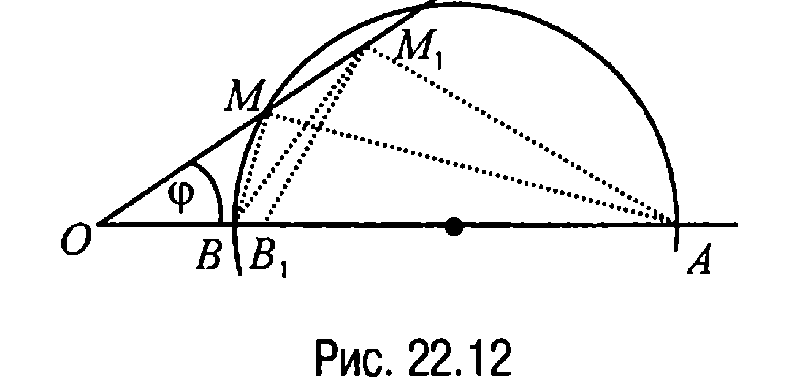

Действительно, пусть $M_1$ (рис. 22.12) — любая точка на высекаемой окружностью хорде, тогда $\angle AM_1B > 90^\circ$ и, следовательно, на отрезке $AB$ существует точка $B_1$ такая, что $\angle AM_1B_1 = 90^\circ$. Таким образом, если минимальный отрезок существует, то окружность, описанная около существующего треугольника, касается стороны угла. Докажем существование минимального отрезка, выведя формулу

---
**стр. 319**
---

для вычисления длины отрезка $AB$. Итак, пусть имеет место тот случай расположения точек $A, M, B$, когда окружность, построенная на $AB$ как на диаметре касается стороны угла в точке $M$ (рис. 22.13) и пусть $P$ — середина отрезка $AB$, $MP = x$.

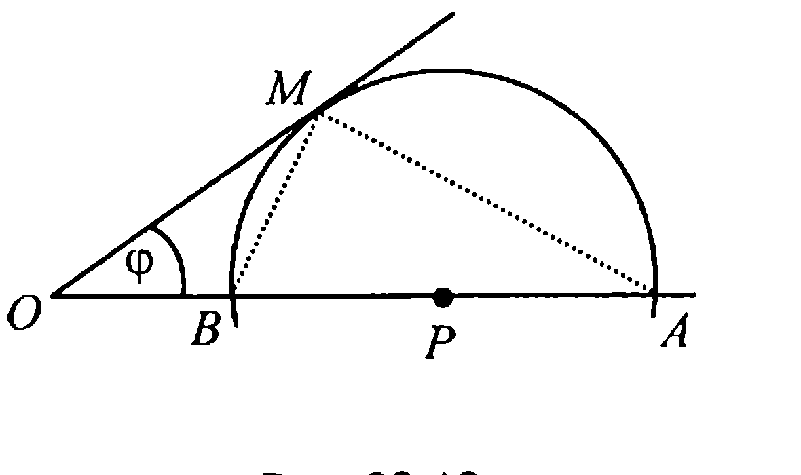

Тогда $AB = 2x$, $OP = a - x$, $\sin \phi = \frac{x}{a - x}$, откуда $x = \frac{a \sin \phi}{1 + \sin \phi}$.

Таким образом, наименьшее значение длины отрезка $AB$ — это $AB = \frac{2a \sin \phi}{1 + \sin \phi}$.

**Ответ:** $AB = \frac{2a \sin \phi}{1 + \sin \phi}$.

**22.15.** *В треугольнике $ABC$ на основании $AB$ (или на его продолжении) отмечена произвольным образом точка $M$ и около треугольников $MCA$ и $BCM$ описаны окружности. Доказать, что отношение радиусов этих окружностей при изменении положения точки $M$ есть величина постоянная. Найти такое положение точки $M$, при котором радиусы окружностей будут иметь наименьшую величину.*

**Решение.** Пусть $R_1$ и $R_2$ — радиусы окружностей, описанных соответственно около треугольников $MCA$ и $BCM$, $\angle AMC = \phi$, $BC = a$, $AC = b$ (рис. 22.14).

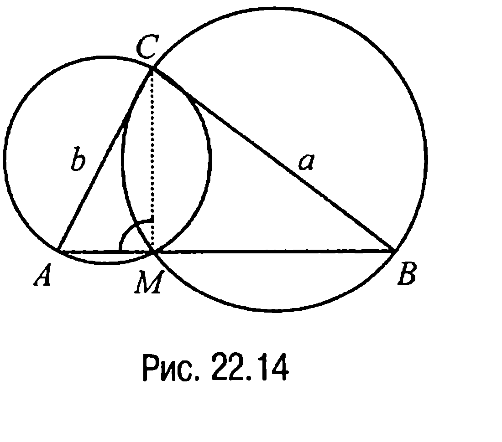

Тогда по расширенной теореме синусов $2R_1 = \frac{b}{\sin \phi}$, $2R_2 = \frac{a}{\sin(\pi - \phi)} = \frac{a}{\sin \phi}$, откуда следует, что $\frac{R_1}{R_2} = \frac{b}{a}$ и что дает ответ на первый вопрос.

---
**стр. 320**
---

Очевидным является и ответ на второй вопрос: радиусы $R_1$ и $R_2$ будут наименьшими тогда, когда $\phi = \frac{\pi}{2}$, т. е. тогда, когда точка $M$ является основанием высоты треугольника $ABC$, опущенной из вершины $C$ на прямую $AB$.

**Ответ на второй вопрос:** точка $M$ является основанием высоты треугольника $ABC$, опущенной из вершины $C$ на прямую $AB$.

**22.16.** *В произвольный треугольник периметра $2p$ вписана окружность. К этой окружности проведена касательная, параллельная стороне треугольника. Найти максимально возможную длину отрезка касательной, концы которого принадлежат сторонам треугольника.*

**Решение.** Пусть треугольник $ABC$ (рис. 22.15) имеет периметр $P_{\Delta ABC} = 2p$, $AB = c$, $A_1B_1 = x$, где $A_1$ и $B_1$ — концы отрезка касательной к вписанной в треугольник $ABC$ окружности.

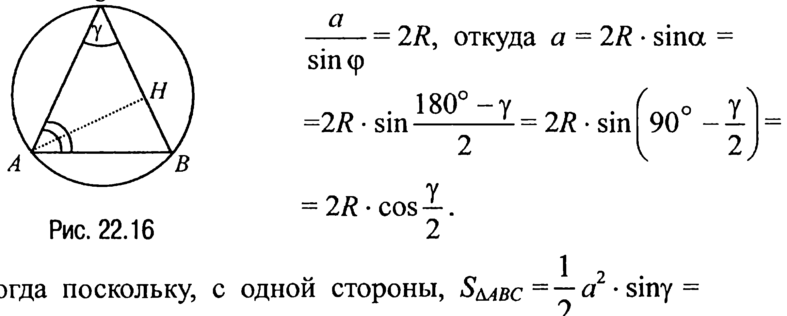

Тогда так как треугольник $A_1B_1C$ подобен треугольнику $ABC$, то $\frac{P_{\Delta A_1B_1C}}{P_{\Delta ABC}} = \frac{x}{c}$ или, замечая, что $P_{\Delta A_1B_1C} = AC + BC - AB = 2p - 2c$, имеем $\frac{2p - 2c}{2p} = \frac{x}{c}$, откуда $x = \frac{c(p - c)}{p}$. Из вида числителя в правой части последнего равенства следует, что максимум $x$ достигается при $c = p/2$ и этот максимум равен $p/4$.

**Ответ:** $\frac{p}{4}$.

**22.17.** *В круг радиуса $R$ вписан равнобедренный треугольник. При каком значении угла $\gamma$ при вершине треугольника высота, проведенная к боковой стороне, имеет наибольшую длину? Найти эту длину.*

**Решение.** Пусть в равнобедренном треугольнике $ABC$ (рис. 22.16)

---
**стр. 321**
---

$AC = BC = a$, $\angle BCA = \gamma$, $\angle CAB = \alpha$, $AH = h$ — высота.

По расширенной теореме синусов

$\frac{a}{\sin \alpha} = 2R$, откуда $a = 2R \cdot \sin \alpha =$
$= 2R \cdot \sin \frac{180^\circ - \gamma}{2} = 2R \cdot \sin \left(90^\circ - \frac{\gamma}{2}\right) =$
$= 2R \cdot \cos \frac{\gamma}{2}$.

Тогда поскольку, с одной стороны, $S_{\triangle ABC} = \frac{1}{2} a^2 \cdot \sin \gamma =$
$= 2R^2 \cdot \cos^2 \frac{\gamma}{2} \cdot \sin \gamma = R^2 \cdot (1 + \cos \gamma) \cdot \sin \gamma$, а, с другой,
$S_{\triangle ABC} = \frac{1}{2} a \cdot h = R \cdot h \cdot \cos \frac{\gamma}{2}$, то $R^2 \cdot (1 + \cos \gamma) \cdot \sin \gamma = R \cdot h \cdot \cos \frac{\gamma}{2}$.
Отсюда $h = \frac{R(1 + \cos \gamma) \sin \gamma}{\cos \frac{\gamma}{2}}$ и, значит, $h^2 = \frac{R^2 (1 + \cos \gamma)^2 \sin^2 \gamma}{\cos^2 \frac{\gamma}{2}} =$
$= 2R^2 \cdot (1 + \cos \gamma) \cdot \sin^2 \gamma = 2R^2 \cdot (1 + \cos \gamma) \cdot (1 - \cos^2 \gamma) = 2R^2 \cdot (-\cos^3 \gamma - $
$- \cos^2 \gamma + \cos \gamma + 1)$.

Таким образом, чтобы ответить на первый вопрос, требуется найти на промежутке $-1 < x < 1$ наибольшее значение функции $f(x) = -x^3 - x^2 + x + 1$.

Стандартное исследование показывает, что наибольшее значение на указанном промежутке функция $f$ принимает в точке $x = \frac{1}{3}$.

При таком значении $x$ искомый угол $\gamma = \arccos \frac{1}{3}$, а
$h = \sqrt{2R^2 f\left(\frac{1}{3}\right)} = R\sqrt{2\left(-\frac{1}{27} - \frac{1}{9} + \frac{1}{3} + 1\right)} = \frac{8R}{3\sqrt{3}} = \frac{8R\sqrt{3}}{9}$.

**Ответ:** $\gamma = \arccos \frac{1}{3}$; $\frac{8R\sqrt{3}}{9}$.

---
**стр. 322**
---

**ЗАДАЧИ ДЛЯ САМОСТОЯТЕЛЬНОГО РЕШЕНИЯ**

**22.1С.** *Доказать, что из всех треугольников с одним и тем же основанием и одинаковым углом при вершине равнобедренный треугольник имеет наибольший периметр.*

**22.2С.** *Доказать, что из всех треугольников с общим углом $\gamma$ при вершине и данной суммой боковых сторон $(a + b)$ равнобедренный треугольник имеет наименьшее основание.*

**22.3С.** *Высота прямоугольного треугольника, опущенная на гипотенузу, равна $h$. Какую наименьшую длину может иметь медиана, делящая пополам больший катет?*

**22.4С.** *Треугольник $ABC$ с площадью $S$ и углом $\alpha$ при вершине $A$ разделен на две равновеликие фигуры $AMN$ и $CMNB$ прямой $MN$, где $M$ и $N$ — точки на сторонах $AC$ и $AB$ соответственно. Найти периметр фигуры $AMN$ при условии, что длина $MN$ — наименьшая возможная.*

**22.5С.** *Точка $C$ перемещается по отрезку $AB$, длина которого равна $l$. На отрезках $AC$ и $CB$ как на основаниях построены равносторонние треугольники по одну сторону от $AB$. Определить положение точки $C$, при котором расстояние между вершинами треугольников оказывается наименьшим.*

**22.6С.** *Боковые стороны трапеции перпендикулярны. Какое наибольшее значение может иметь площадь треугольника, образованного диагоналями и средней линией трапеции, если известно, что основания трапеции равны $a$ и $b$ ($a > b$)?*

---
**стр. 323**
---

**22.7С.** *Внутри угла $\phi$ с вершиной в точке $O$ отмечена точка $A$. На разных сторонах угла отмечены точки $M$ и $N$ таким образом, что $\angle MAN = \psi$ ($\phi + \psi < 180^\circ$). Доказать, что четырехугольник $OMAN$ имеет наибольшую возможную площадь в том случае, когда $AM = AN$.*

**22.8С.** *Из всех прямоугольников с площадью $S$ найти прямоугольник с наименьшим периметром.*

**22.9С.** *В остроугольный треугольник $ABC$ вписан параллелограмм $AKMT$ (точки $K$, $M$ и $T$ лежат на сторонах треугольника $AB$, $BC$ и $AC$ соответственно). При каком положении вершин параллелограмма:*
*а) диагональ $AM$ будет наименьшей?*
*б) диагональ $KT$ будет наименьшей?*

**22.10С.** *Водный канал имеет заданную глубину $h$ и площадь поперечного сечения $S$. Если поперечное сечение есть равнобочная трапеция, то каким должен быть угол наклона ее боковых сторон, чтобы сумма нижнего основания и боковых сторон трапеции была наименьшей?*

**22.11С.** *Найти стороны прямоугольника наибольшего периметра, вписанного в полуокружность радиуса $R$.*

**22.12С.** *Из всех прямоугольников, вписанных в окружность радиуса $R$, найти прямоугольник наибольшей площади.*

**22.13С.** *На окружности радиуса $R$ отмечена точка $A$. На каком расстоянии от точки $A$ нужно провести хорду $BC$, параллельную касательной к окружности в точке $A$, чтобы площадь треугольника $ABC$ была наибольшей?*

---
**стр. 324**
---

**22.14С.** *В окружности радиуса $R$ проведен диаметр $AB$. На диаметре отмечена точка $M$ на расстоянии $d$ от центра. Через точку $M$ проведена хорда $CD$. Какова наибольшая возможная площадь четырехугольника $ACBD$?*

**22.15С.** *В круг радиуса $R$ вписан угол $\phi$. Какими должны быть длины хорд, образующих этот угол, чтобы их сумма была наибольшей?*

---
**стр. 325**
---

**ГЛАВА 7**

**ЗАДАЧИ НА ПОСТРОЕНИЕ**

В задачах на построение требуется построить некоторую геометрическую фигуру (точку, прямую, окружность, треугольник, четырехугольник и т. д.) с помощью циркуля и линейки (иногда только с помощью линейки, а иногда только с помощью циркуля).

*При этом линейка считается односторонней и без делений, т. е. с помощью линейки можно проводить произвольную прямую; прямую, проходящую через заданную точку; прямую, проходящую через две заданные точки.* Но с помощью линейки нельзя измерять и откладывать отрезки, нельзя, пользуясь ее краями, проводить параллельные прямые. С помощью циркуля можно, например, провести произвольную окружность или окружность с заданным центром и заданным радиусом.

Главное в задачах на построение заключается не столько в фактическом построении искомой фигуры, сколько:
а) в нахождении способа решения задачи путем установления связей между искомыми элементами и данными задачи (**анализ**);
б) в описании последовательности действий, ведущих к построению требуемой фигуры (**построение**);
в) в доказательстве того, что построенная фигура удовлетворяет условиям задачи (**доказательство**);
г) в выяснении вопроса об условиях возможности решения и числе решений задачи (**исследование**).

Часто, когда задача достаточно простая, некоторые из указанных пунктов (например, анализ и (или) исследование) при построении опускаются.

Особо отметим следующее. Возможность того или иного построения всегда основывается на каких-то математических утверждениях. Таковыми утверждениями могут быть либо аксиомы геометрии, либо математические факты, доказываемые на основании аксиом геометрии и уже доказанных утверждений.
