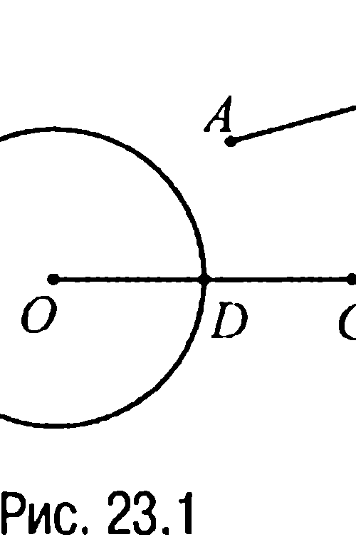
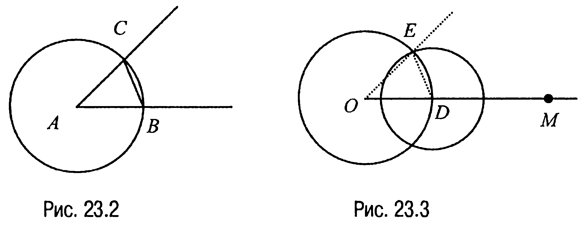
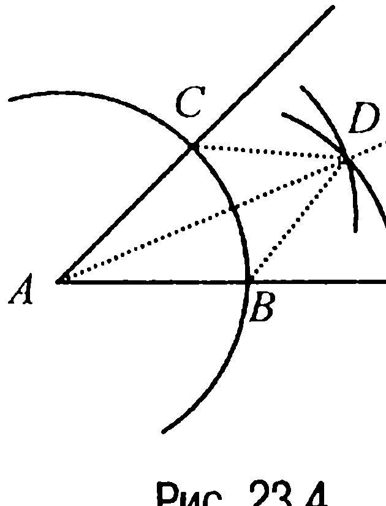
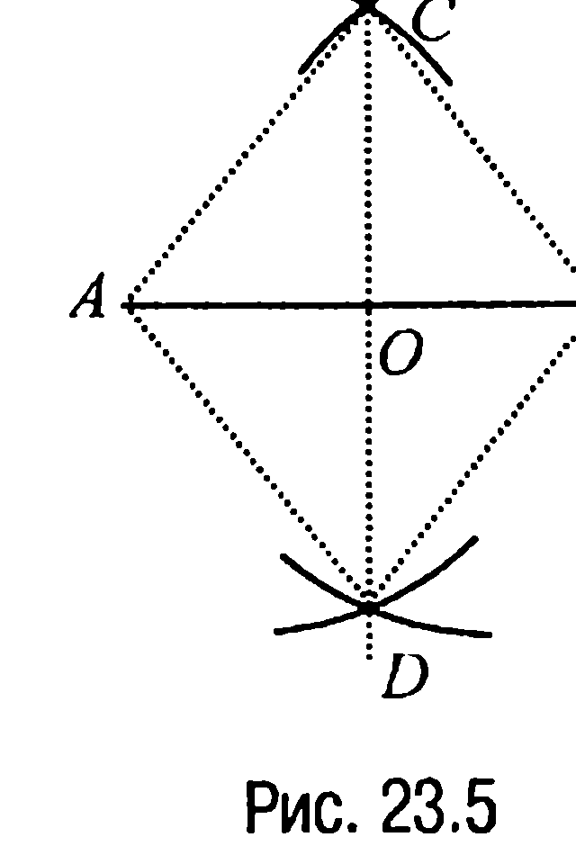
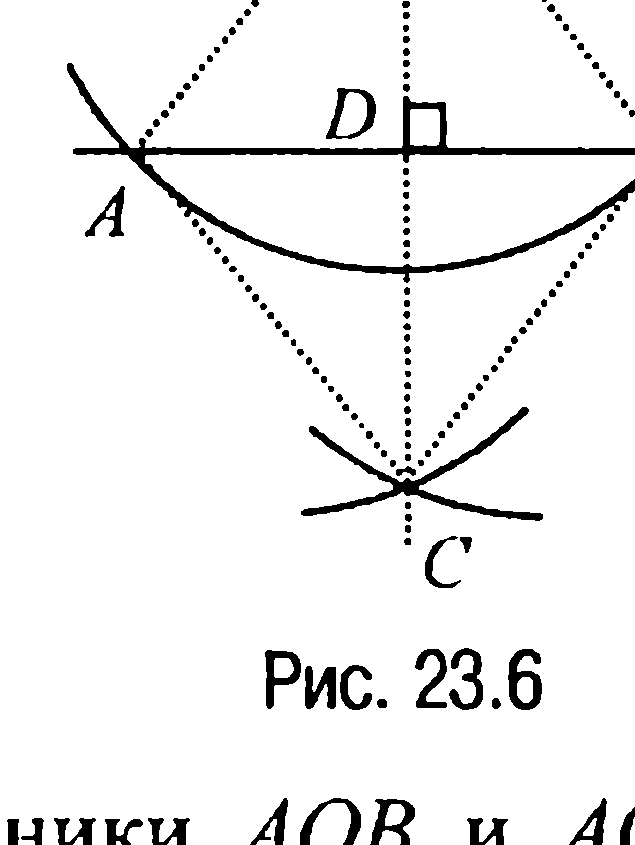
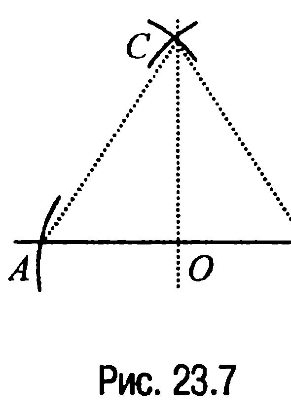
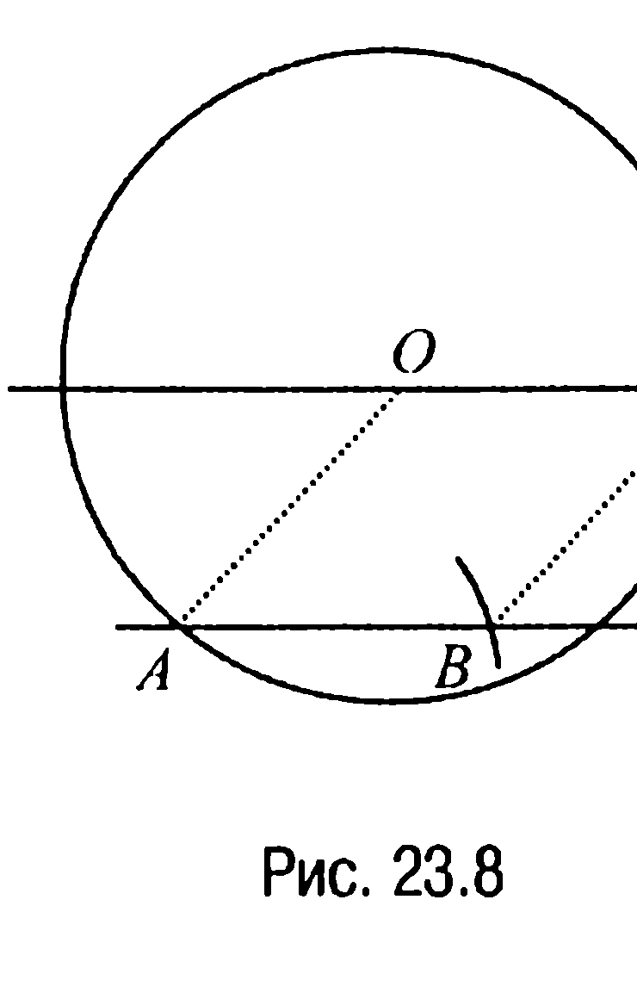
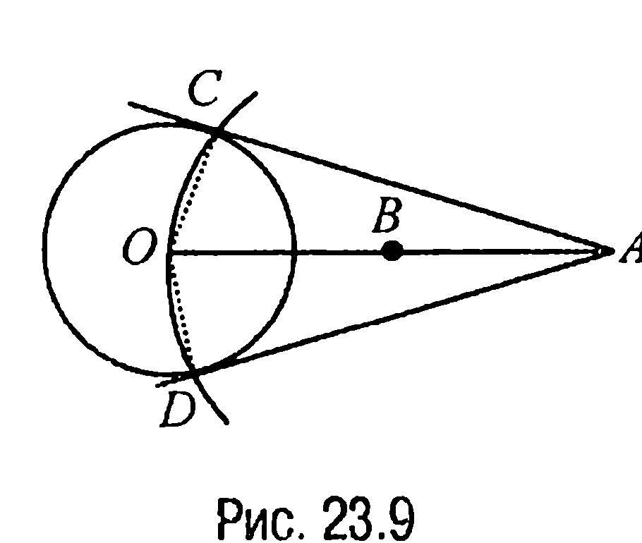

## 7.1. Простейшие (основные) задачи на построение

---
**стр. 326**
---

**§ 23. ПРОСТЕЙШИЕ (ОСНОВНЫЕ) ЗАДАЧИ НА ПОСТРОЕНИЕ**

На основе простейших задач можно решать более сложные и самые разнообразные задачи на построение. Поэтому приводимые ниже простейшие задачи обычно называют **основными задачами на построение.**

**23.1.** *На данном луче от его начала отложить отрезок, равный данному.*

**Решение.** Рассмотрим луч $OC$ с началом в точке $O$ и отрезок $AB$ (рис. 23.1).

С помощью циркуля проведем окружность с центром $O$ и радиусом $AB$. Эта окружность пересечет луч $OC$ в некоторой точке $D$. Очевидно, что отрезок $OD$ и будет искомым.

**23.2.** *Отложить от данного луча угол, равный данному.*

**Решение.** Рассмотрим угол с вершиной $A$ (рис. 23.2) и луч $OM$ (рис. 23.3).

Требуется построить угол, равный углу с вершиной $A$, так, чтобы одна из его сторон совпала с лучом $OM$.

Проведем окружность произвольного радиуса с центром в точке $A$ (рис. 23.2). Эта окружность пересечет стороны угла в точках $B$ и $C$. Далее, проведем окружность того же радиуса с центром в точке $O$ (рис. 23.3). Эта окружность пересечет луч $OM$ в некото-

---
**стр. 327**
---

рой точке $D$. Наконец, проведем окружность с центром в точке $D$ и радиусом $BC$. Окружности с центрами $O$ и $D$ пересекаются в двух точках. Обозначим одну из этих точек через $E$. Тогда угол $MOE$ и будет искомым.

Действительно, так как треугольники $BAC$ и $DOE$ равны как треугольники с соответственно равными сторонами, то углы $BAC$ и $DOE$ являются соответствующими углами этих треугольников и, значит, равны.

**23.3.** *Построить биссектрису данного угла.*

**Решение.** Из вершины $A$ данного угла (рис. 23.4) как из центра проводим окружность произвольного радиуса.

Затем из точек $B$ и $C$ пересечения этой окружности со сторонами угла проводим тем же радиусом окружности, пересекающиеся в точке $D$, отличной от точки $A$. Луч $AD$ и будет искомой биссектрисой, поскольку из равенства треугольников $ACD$ и $ABD$ следует равенство соответствующих углов $CAD$ и $DAB$.

**23.4.** *Разделить данный отрезок пополам (построить серединный перпендикуляр данного отрезка).*

**Решение.** Пусть $AB$ — данный отрезок (рис. 23.5). Из точек $A$ и $B$ радиусом $AB$ проводим окружности. Пусть $C$ и $D$ — точки пересечения этих окружностей. Тогда если через точки $C$ и $D$ провести прямую, то точка $O$ пересечения этой прямой с отрезком $AB$ и будет серединной точкой отрезка $AB$.

Действительно, так как треугольники $CAD$ и $CBD$ равны (по третьему признаку равенства треугольников), то будут равными углы $ACO$ и $BCO$, а значит, равными будут и треугольники $ACO$ и $BCO$ (по первому признаку равенства треугольников). Но в таком случае отрезок $AO$ равен отрезку $OB$, что и доказывает требуемое.

---
**стр. 328**
---

Тот же факт, что прямая $CD$ перпендикулярна отрезку $AB$, вытекает из того, что равные углы $AOC$ и $BOC$ являются смежными и, следовательно, оказываются прямыми.

**23.5.** *Из данной точки, не принадлежащей данной прямой, опустить на эту прямую перпендикуляр.*

**Решение.** Пусть $O$ и $l$ (рис. 23.6) — данные точка и прямая соответственно. Из точки $O$ как из центра проводим произвольным радиусом окружность, пересекающую прямую $l$ в точках $A$ и $B$. Затем из точек $A$ и $B$ как из центров проводим тем же радиусом окружности, пересекающиеся в точке $C$, отличной от точки $O$. Прямая $OC$ и будет искомой прямой.

Действительно, пусть $D$ — точка пересечения прямых $OC$ и $l$. Тогда так как треугольники $AOB$ и $ACB$ равны (по третьему признаку равенства треугольников), то будут равными углы $OAD$ и $CAD$. Но в таком случае равными будут треугольники $OAD$ и $CAD$ (по первому признаку равенства треугольников), и, значит, равными будут углы $ADO$ и $ADC$. Но поскольку эти углы смежные, то они оказываются углами прямыми, откуда и следует требуемое.

**23.6.** *Из данной точки, принадлежащей данной прямой, восстановить к этой прямой перпендикуляр.*

**Решение.** Из данной точки $O$, принадлежащей прямой $l$ (рис. 23.7), как из центра проводим произвольным радиусом окружность, пересекающую прямую $l$ в точках $A$ и $B$. Затем из точек $A$ и $B$ как из центров проводим радиусом $AB$ окружности. Пусть $C$ — точка пересечения этих окружностей. Тогда прямая $OC$ и будет искомым перпендикуляром, что следует из равенства углов $AOC$ и $BOC$ равных (по третьему признаку равенства треугольников) треугольников $AOC$ и $BOC$.

---
**стр. 329**
---

**23.7.** *Построить прямую, проходящую через данную точку параллельно данной прямой.*

**Решение.** Через данную точку $O$, не принадлежащую данной прямой $l$ (рис. 23.8), как из центра проводим произвольным радиусом окружность, пересекающую прямую $l$.

Пусть $A$ — одна из точек пересечения построенной окружности с прямой $l$. На луче с вершиной $A$, лежащем на прямой $l$, откладываем отрезок $AB$, равный отрезку $AO$. Затем тем же раствором циркуля из точки $B$ засекаем точку $C$ на построенной окружности с центром в точке $O$.

Прямая $OC$ и будет искомой прямой, поскольку четырехугольник $OABC$ — ромб.

Приведем еще одну задачу, которая хотя и не относится к простейшим, но часто используется при решении многих задач на построение.

**23.8.** *Через данную точку провести касательную к данной окружности.*

**Решение.** Если данная точка принадлежит данной окружности, то задача сводится к задаче 23.6.

Предположим теперь, что данная точка $A$ лежит вне данной окружности с центром в точке $O$ (рис. 23.9). В этом случае задача решается следующим образом. Делим отрезок $OA$ пополам. Затем из серединной точки $B$ отрезка $OA$ проводим окружность радиуса $BO$.

Тогда если $C$ и $D$ — точки пересечения обеих окружностей, то прямые $AC$ и $AD$ и будут искомыми касательными (углы $OCA$ и $ODA$ — прямые, как вписанные в окружность, построенную на отрезке $OA$ как на диаметре).
