## 7.2. Построение треугольника по трем элементам

---
**стр. 330**
---

§ 24. ПОСТРОЕНИЕ ТРЕУГОЛЬНИКА ПО ТРЕМ ЭЛЕМЕНТАМ

**24.1.** *Построить треугольник по двум сторонам и углу между ними.*

**Решение.** Сначала уточним, как нужно понимать эту задачу, т. е. что в задаче дано и какое построение нужно сделать. А задачу нужно понимать следующим образом. Даны отрезки $P_1Q_1$, $P_2Q_2$ и угол $hk$ (рис. 24.1).

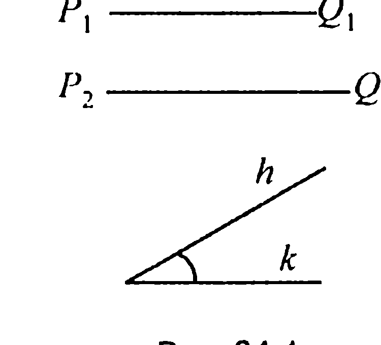

Требуется с помощью циркуля и линейки построить такой треугольник $ABC$, у которого две стороны, скажем $AB$ и $AC$, равны соответственно данным отрезкам $P_1Q_1$ и $P_2Q_2$, а угол $CAB$ между этими сторонами равен данному углу $hk$.

Построение же состоит в следующем. Проведем прямую $l$ и на ней с помощью циркуля отложим отрезок $AB$, равный отрезку $P_1Q_1$ (рис. 24.2).

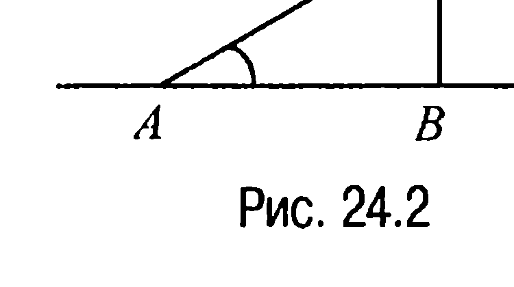

Затем построим угол $BAM$, равный данному углу $hk$. Далее, на луче $AM$ отложим отрезок $AC$, равный отрезку $P_2Q_2$, и проведем отрезок $BC$. Полученный треугольник $ABC$ и будет искомым.

Действительно, по построению $AB = P_1Q_1$, $AC = P_2Q_2$, $\angle CAB = \angle hk$.

Отметим, что описанный ход построений показывает, что искомый треугольник можно построить при любых данных отрезках $P_1Q_1$, $P_2Q_2$ и неразвернутом угле $hk$. А поскольку прямую $l$ и точку $A$ на ней можно выбирать произвольно, то существует бесконечно много треугольников, которые удовлетворяют условиям задачи. Тем не менее так как все эти треугольники равны между собой (по первому признаку равенства треугольников), то говорят, что данная задача имеет единственное решение.

---
**стр. 331**
---

**24.2.** *Построить треугольник по стороне и двум прилежащим к ней углам.*

**Решение.** Пусть даны отрезок $PQ$ и углы $hk$ и $mn$ (рис. 24.3). Требуется с помощью циркуля и линейки построить такой треугольник $ABC$, у которого одна сторона, скажем $AC$, равна данному отрезку $PQ$, а углы $CAB$ и $ACB$ равны данным углам $hk$ и $mn$.

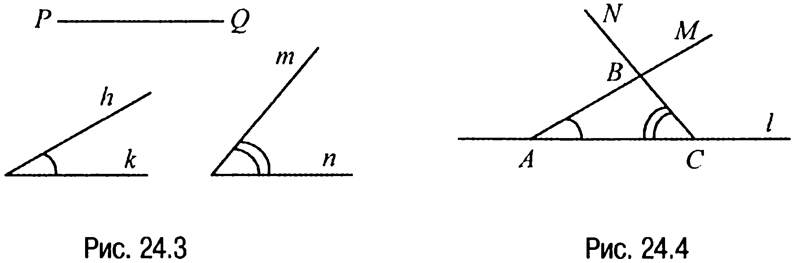

Построение следующее. Проведем прямую $l$ и на ней с помощью циркуля отложим отрезок $AC$, равный отрезку $PQ$ (рис. 24.4). Затем построим угол $CAM$, равный данному углу $hk$, и угол $ACN$, равный данному углу $mn$. Точка $B$ — точка пересечения лучей $AM$ и $CN$, будет третьей вершиной искомого треугольника $ABC$.

Описанный ход построений показывает, что искомый треугольник можно построить при любом данном отрезке $PQ$ и неразвернутых углах $hk$ и $mn$, сумма которых меньше $180°$.

**24.3.** *Построить треугольник по трем сторонам.*

**Решение.** Пусть даны отрезки $P_1Q_1$, $P_2Q_2$, $P_3Q_3$ (рис. 24.5). Требуется построить треугольник $ABC$ такой, чтобы $AB = P_1Q_1$, $BC = P_2Q_2$, $CA = P_3Q_3$.

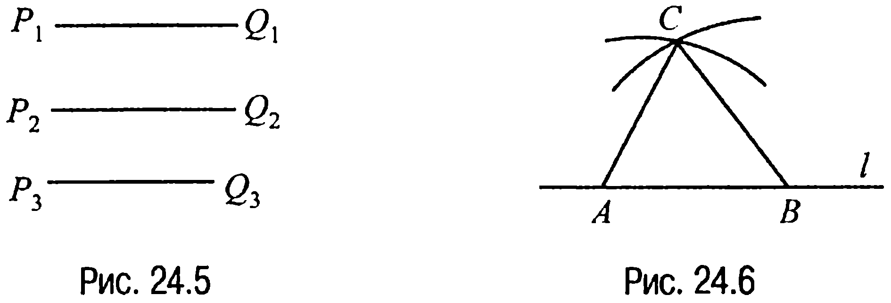

В данном случае поступаем следующим образом. Проведем прямую $l$ и на ней с помощью циркуля отложим отрезок $AB$, равный отрезку $P_1Q_1$ (рис. 24.6). Затем построим две окружности: одну с центром в точке $A$ и радиусом $P_3Q_3$, а вторую — с центром в точке

---
**стр. 332**
---

$B$ и радиусом $P_2Q_2$. Пусть $C$ — одна из точек пересечения этих окружностей. Тогда если мы проведем отрезки $AC$ и $BC$, то, очевидно, получим искомый треугольник $ABC$.

Отметим, что данная задача не всегда имеет решение. Действительно, как известно, в любом треугольнике сумма любых его двух сторон больше, чем третья сторона, а поэтому если какой-нибудь из данных отрезков больше или равен сумме двух других отрезков, то нельзя построить треугольник, стороны которого были бы равны данным отрезкам.

**24.4.** *Построить треугольник по двум сторонам и высоте к третьей стороне.*

**Решение.** Пусть даны три отрезка $P_1Q_1$, $P_2Q_2$, $P_3Q_3$ (рис. 24.7). Требуется построить треугольник $ABC$ такой, у которого две стороны, скажем $AB$ и $AC$, равны соответственно данным отрезкам $P_1Q_1$, $P_2Q_2$, а высота $AH$ равна отрезку $P_3Q_3$.

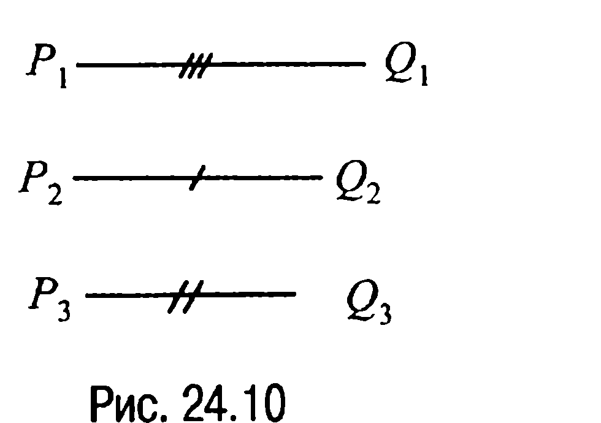

**Анализ.** Допустим, что искомый треугольник $ABC$ построен (рис. 24.8). Очевидно, что сторона $AB$ и высота $AH$ являются соответственно гипотенузой и катетом прямоугольного треугольника $AHB$. Поэтому построение треугольника $ABC$ можно провести по такому плану: сначала строим прямоугольный треугольник $AHB$, а затем достраиваем его до всего треугольника $ABC$.

**Построение.** Строим прямоугольный треугольник $AHB$, у которого гипотенуза $AB$ равна данному отрезку $P_1Q_1$, а катет $AH$ равен данному отрезку $P_3Q_3$ (построение такого треугольника сводится к уже известным построениям). Затем из точки $A$ как из центра проводим окружность радиуса $P_2Q_2$. Точка $C$ — одна из точек пересечения этой окружности с прямой $BH$, и будет третьей вершиной искомого треугольника $ABC$.

---
**стр. 333**
---

**Доказательство.** То, что треугольник $ABC$ действительно является искомым, следует из того, что по построению сторона $AB$ равна $P_1Q_1$, сторона $AC$ равна $P_2Q_2$, а высота $AH$ равна $P_3Q_3$, т. е. треугольник $ABC$ удовлетворяет всем условиям задачи.

**Исследование.** Данная задача не всегда имеет решение. Действительно, если хотя бы один из отрезков $P_1Q_1$ или $P_2Q_2$ меньше, чем $P_3Q_3$, то задача не имеет решения потому, что наклонные $AB$ и $AC$ не могут быть меньше, чем перпендикуляр $AH$.

Задача не имеет решения и в том случае, когда $P_1Q_1 = P_2Q_2 = P_3Q_3$.

В остальных случаях задача всегда имеет решение. В частности, если $P_1Q_1 > P_3Q_3$, а $P_2Q_2 = P_3Q_3$, то задача имеет единственное решение (в этом случае сторона $AC$ совпадает с высотой $AH$ и искомый треугольник является прямоугольным).

Если $P_1Q_1 > P_3Q_3$, а $P_2Q_2 = P_1Q_1$, то задача также имеет единственное решение (в этом случае треугольник $ABC$ оказывается равнобедренным).

Наконец, если $P_1Q_1 > P_3Q_3$, $P_2Q_2 > P_3Q_3$, $P_1Q_1 \neq P_2Q_2$, то задача имеет два решения — треугольники $ABC$ и $ABC_1$ (рис. 24.9).

**24.5.** *Построить треугольник по двум сторонам и высоте, опущенной на одну из этих сторон.*

**Решение.** Пусть даны три отрезка $P_1Q_1$, $P_2Q_2$, $P_3Q_3$ (рис. 24.10). Требуется построить такой треугольник $ABC$, у которого стороны $AC$ и $AB$ равны соответственно $P_1Q_1$, $P_2Q_2$, а высота $BH$ равна данному отрезку $P_3Q_3$.

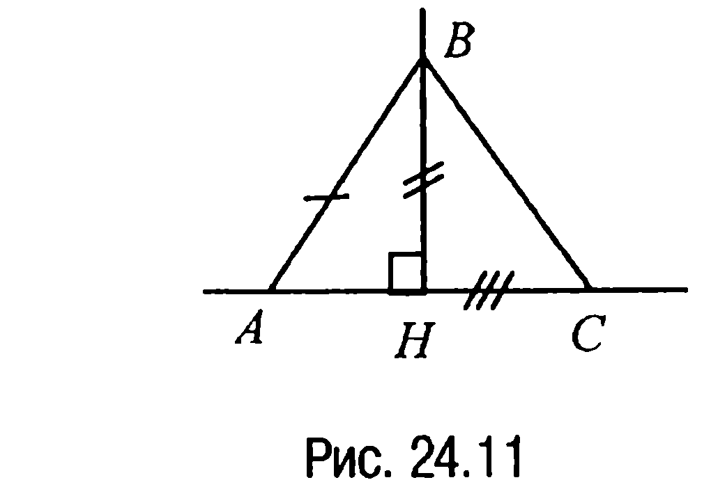

**Анализ.** Допустим, что искомый треугольник $ABC$ построен (рис. 24.11). Тогда сторона $AB$ и высота $BH$ являются гипотенузой и соответственно катетом прямоугольного треугольника $BHA$. Поэтому построение треугольника $ABC$ можно провести по такому плану. Сначала строим прямоугольный треугольник $BHA$, а за-

---
**стр. 334**
---

тем достраиваем его до всего треугольника $ABC$.

**Построение.** Строим прямоугольный треугольник $BHA$, у которого гипотенуза $AB$ равна данному отрезку $P_2Q_2$, а катет $BH$ равен данному отрезку $P_3Q_3$. Затем из точки $A$ как из центра проводим окружность радиуса $P_1Q_1$. Пусть $C$ — одна из точек пересечения прямой $AH$ с этой окружностью. Проведя отрезки $AC$ и $BC$, получим искомый треугольник $ABC$.

**Доказательство.** То, что треугольник $ABC$ — искомый, следует из того, что по построению сторона $AC$ равна $P_1Q_1$, сторона $AB$ равна $P_2Q_2$, а высота $BH$ равна $P_3Q_3$ и, значит, треугольник $ABC$ удовлетворяет всем условиям задачи.

**Исследование.** Если $P_1Q_1 = P_2Q_2$, то задача имеет два решения

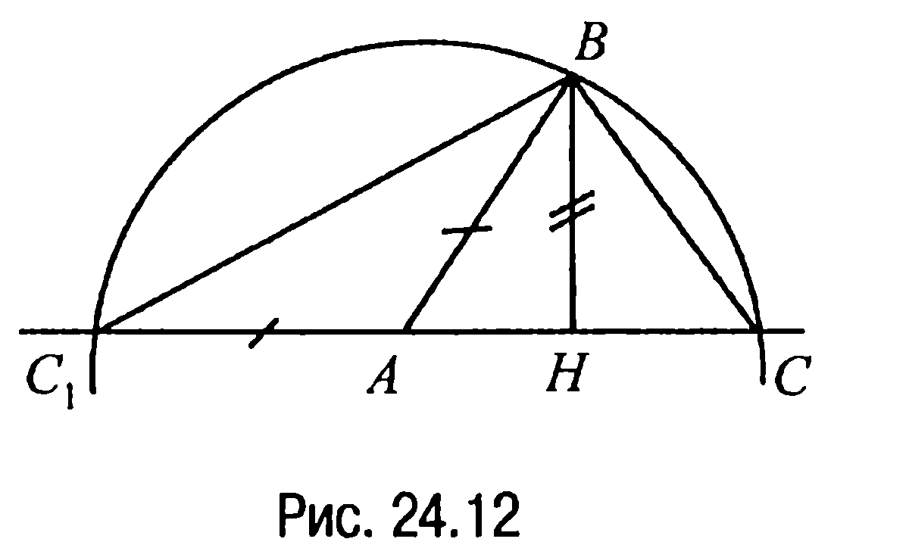

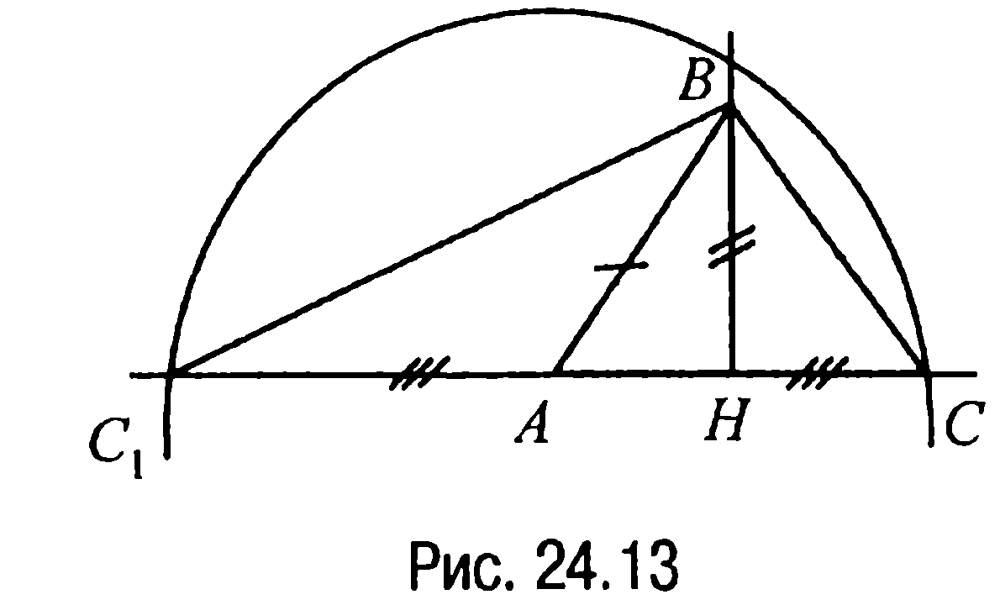

(равнобедренные треугольники $ABC$ и $ABC_1$ (рис. 24.12)). Если $P_1Q_1 > P_3Q_3$, $P_2Q_2 > P_3Q_3$ и $P_1Q_1 \neq P_2Q_2$, то задача также имеет два решения — треугольники $ABC$ и $ABC_1$ (рис. 24.13).

**24.6.** *Построить треугольник по двум сторонам и медиане, проведенной к третьей стороне.*

**Решение.** Пусть даны три отрезка $P_1Q_1$, $P_2Q_2$, $P_3Q_3$ (рис. 24.14).

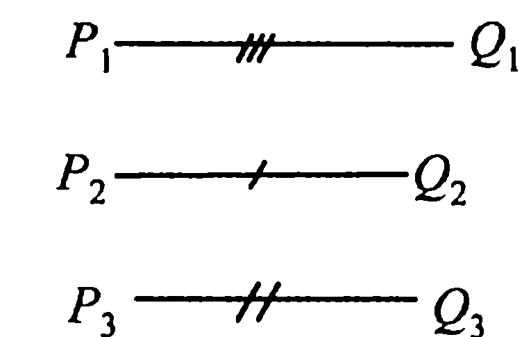

Требуется построить такой треугольник $ABC$, у которого, например, стороны $AB$ и $BC$ равны соответственно отрезкам $P_1Q_1$ и $P_2Q_2$, а медиана $BD$ равна отрезку $P_3Q_3$.

**Анализ.** Пусть искомый треугольник $ABC$ построен (рис. 24.15). Если продолжить медиану $BD$ за точку $D$ на ее длину, то получим новый треугольник $ADE$, равный треугольнику $CDB$ ($BD = DE$, $AD = DC$, $\angle ADE = \angle CDB$). Поэтому построение искомого

---
**стр. 335**
---

треугольника $ABC$ сводится по существу к построению треугольника $ABE$.

**Построение.** Сначала строим треугольник $ABE$, у которого сторона $AB$ равна данному отрезку $P_1Q_1$, $AE = P_2Q_2$, а $BE = 2BD$, где отрезок $BD$ равен отрезку $P_3Q_3$. Затем из точки $D$ проведем дугу радиуса $AD$, а из точки $B$ — дугу радиуса $AE = P_2Q_2$. Точка $C$ пересечения этих двух дуг и будет третьей вершиной искомого треугольника.

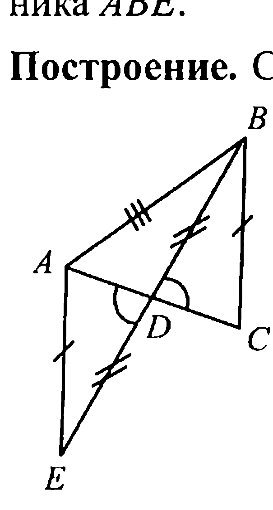

**Доказательство.** То, что треугольник $ABC$ является искомым, следует из того, что по построению $AB = P_1Q_1$, $BC = P_2Q_2$, $BD = P_3Q_3$ и, значит, треугольник $ABC$ удовлетворяет всем условиям задачи.

**Исследование.** Задача не всегда имеет решение. Действительно, поскольку любая сторона треугольника меньше суммы двух других сторон, то $BH < AB + AH$. А так как $BH = 2BD$, $AH = BC$, то должно выполняться неравенство $2BD < AB + BC$ или неравенство $BD < \frac{1}{2}(AB + BC)$, т. е. задача имеет решение только в том случае, когда для данных отрезков выполняется неравенство $P_3Q_3 < \frac{1}{2}(P_1Q_1 + P_2Q_2)$. <!-- вероятная опечатка оригинала: вместо $BH$ и $AH$ по смыслу построения должны быть $BE$ и $AE$ -->

**24.7.** *Построить треугольник по стороне, медиане, проведенной к этой стороне, и радиусу описанной окружности.*

**Решение.** Пусть даны три отрезка $P_1Q_1$, $P_2Q_2$, $P_3Q_3$ (рис. 24.16). Требуется построить такой треугольник $ABC$, у которого сторона $AC$ равна отрезку $P_1Q_1$, медиана $BD$ равна отрезку $P_2Q_2$, а радиус описанной около треугольника $ABC$ окружности равен отрезку $P_3Q_3$.

---
**стр. 336**
---

**Анализ.** Допустим, что искомый треугольник $ABC$ построен

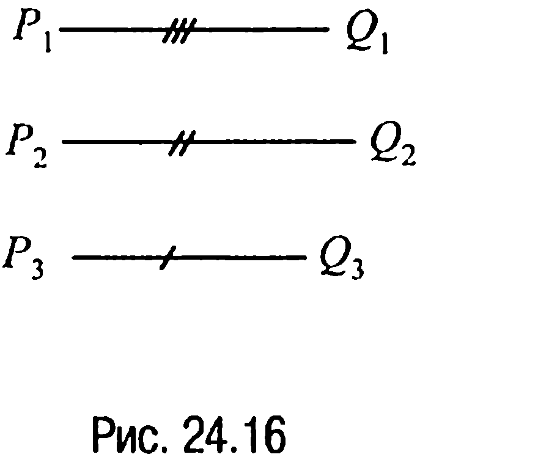

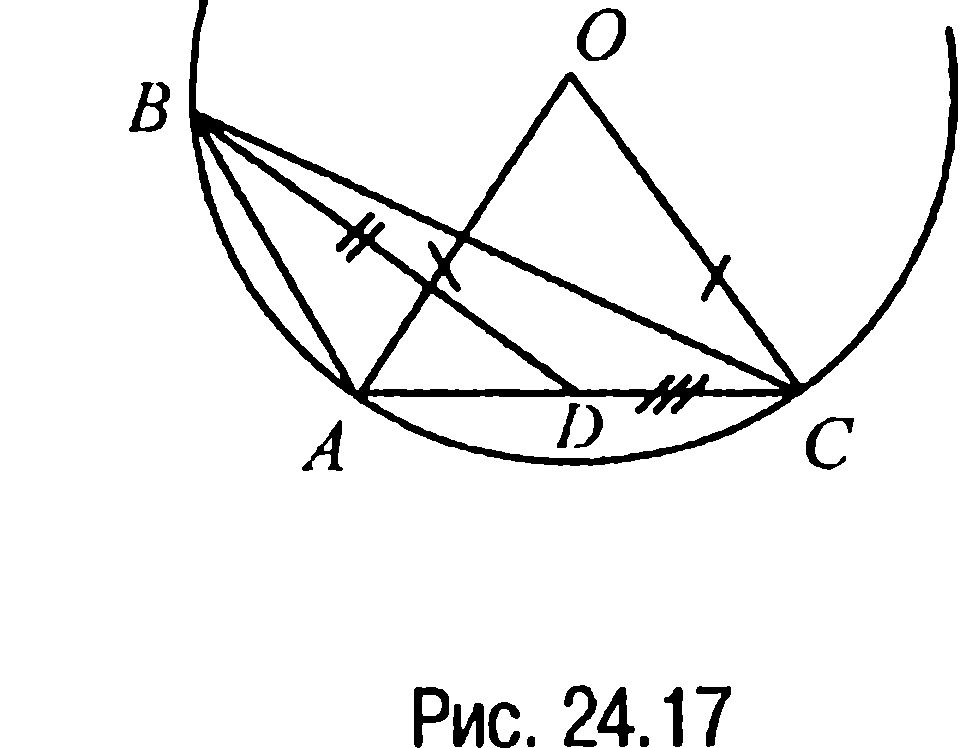

(рис. 24.17). Тогда $OA = OC = P_3Q_3$. Поэтому построение треугольника $ABC$ можно провести по такому плану. Сначала строим треугольник $AOC$, а затем, учитывая остальные условия задачи, — искомый треугольник $ABC$.

**Построение.** Строим равнобедренный треугольник $AOC$, у которого сторона $AC$ равна данному отрезку $P_1Q_1$, а равные стороны $OA$ и $OC$ равны данному отрезку $P_3Q_3$. Затем из точки $O$ как из центра описываем радиусом $OA = OC = P_3Q_3$ окружность. Далее, используя простейшее построение, связанное с делением отрезка пополам, находим середину $D$ отрезка $AC$. А тогда точка $B$ пересечения построенной окружности с центром в точке $O$ с окружностью с центром в точке $D$ и радиусом $P_2Q_2$ и будет третьей вершиной искомого треугольника.

**Доказательство.** То, что построенный треугольник $ABC$ — искомый треугольник, следует из того, что сторона $AC$ равна данному отрезку $P_1Q_1$ по построению. Медиана $BD$ равна данному отрезку $P_2Q_2$, а радиус описанной около треугольника $AOC$ окружности $OA$ равен данному отрезку $P_3Q_3$.

**Исследование.** Очевидно, что задача имеет решения не при любых данных отрезках $P_1Q_1, P_2Q_2, P_3Q_3$. Именно, задача не имеет решений, когда $P_2Q_2 > P_1Q_1 > P_3Q_3$. Если $P_1Q_1 = P_2Q_2 = P_3Q_3$, то задача имеет два решения. Два решения задача имеет и в случаях, когда $P_1Q_1 > P_2Q_2 > P_3Q_3$ и когда $P_2Q_2 > P_1Q_1, P_3Q_3 > P_1Q_1$.

---
**стр. 337**
---

**24.8.** *Построить треугольник по стороне и проведенным к ней медиане и высоте.*

**Решение.** Пусть даны три отрезка $P_1Q_1, P_2Q_2, P_3Q_3$ (рис. 24.18).

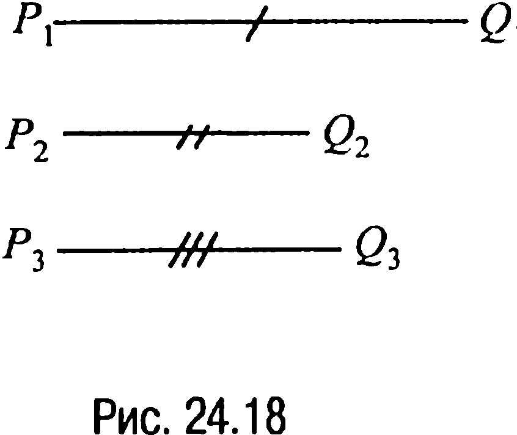

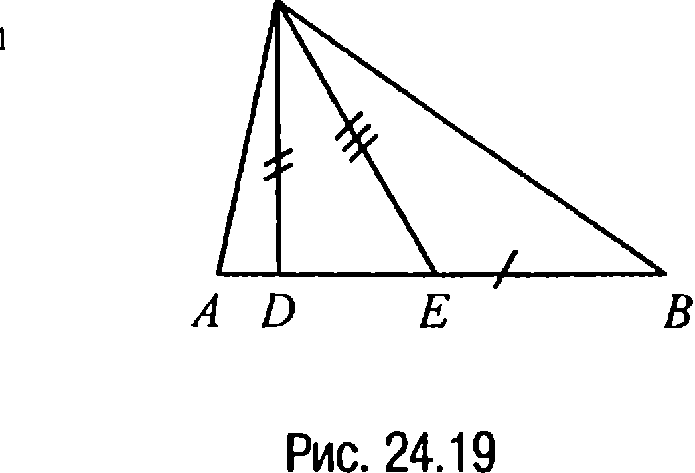

Требуется построить такой треугольник $ABC$, у которого сторона $AB$ равна отрезку $P_1Q_1$, а высота $CD$ и медиана $CE$ равны соответственно отрезкам $P_2Q_2$ и $P_3Q_3$ ($P_3Q_3 > P_2Q_2$).

**Анализ.** Пусть треугольник $ABC$ построен (рис. 24.19). Рассмотрение этого треугольника (с заданными элементами) подсказывает самый короткий путь построения искомого треугольника. Именно, начинать решать задачу следует с построения прямоугольного треугольника $EDC$, а затем построенный прямоугольный треугольник уже достраивать до искомого.

**Построение.** Сначала строим прямоугольный треугольник $EDC$, у которого гипотенуза $CE$ равна данному отрезку $P_3Q_3$, а катет $DC$ равен данному отрезку $P_2Q_2$. Чтобы построить отрезки $BE$ и $EA$, нужно данный отрезок $P_1Q_1$, равный $AB$, поделить пополам и затем на прямой $DE$ по разные стороны от точки $E$ отложить полученную половину отрезка $P_1Q_1$. Концевые точки $A$ и $B$ отложенных отрезков и будут вершинами искомого треугольника.

**Доказательство.** То, что построенный треугольник $ABC$ — искомый, следует из того, что по построению сторона $AB$ равна данному отрезку $P_1Q_1$, высота $CD$ равна данному отрезку $P_2Q_2$, а медиана $CE$ равна данному отрезку $P_3Q_3$ и, значит, треугольник $ABC$ удовлетворяет всем условиям задачи.

**Исследование.** Очевидно, что задача всегда имеет два решения: треугольник $ABC$ (рис. 24.19) и треугольник, симметричный треугольнику $ABC$ относительно прямой $AB$.

---
**стр. 338**
---

**24.9.** *Построить треугольник по данной стороне, прилежащему к ней углу и разности двух других сторон.*

**Решение.** Пусть даны два отрезка $P_1Q_1, P_2Q_2$ и угол $\alpha$ (рис. 24.20).

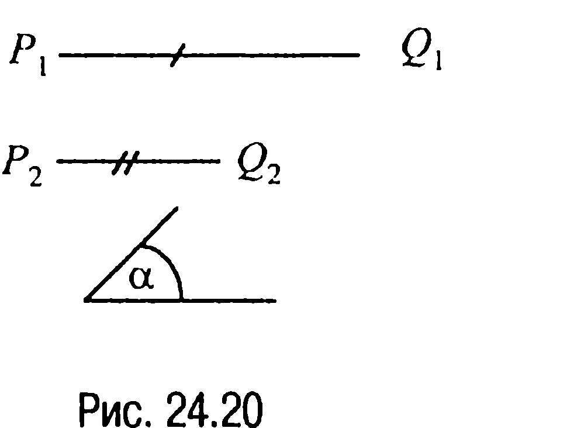

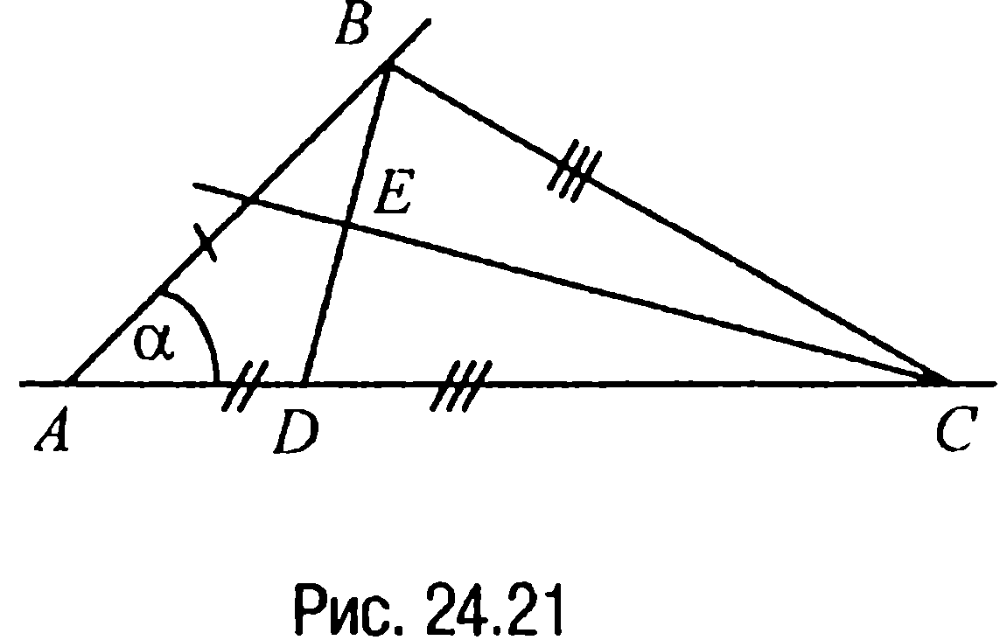

Требуется построить такой треугольник $ABC$, у которого сторона $AB$ равна отрезку $P_1Q_1$, угол $BAC$ равен $\alpha$, а разность сторон $AC$ и $BC$ равна $P_2Q_2$.

**Анализ.** Пусть треугольник $ABC$ построен (рис. 24.21). Рассмотрение этого треугольника позволяет наметить план построения. Именно, сначала нужно построить треугольник, у которого одна сторона равна заданной стороне искомого треугольника, другая сторона — разности двух других его сторон, а угол между двумя сторонами равен заданному углу $\alpha$. В результате такого построения получим треугольник $ABD$. Заключительное построение связано с построением третьей вершины $C$ искомого треугольника.

**Построение.** Сначала строим треугольник $ABD$ по двум сторонам и углу между ними. Затем находим середину $E$ стороны $BD$ и проводим через точку $E$ перпендикуляр к стороне $BD$. Точка $C$ пересечения этого перпендикуляра с прямой $AD$ и будет третьей вершиной искомого треугольника.

**Доказательство.** Треугольник $ABC$ является искомым, поскольку по построению сторона $AB$ равна данному отрезку $P_1Q_1$, разность сторон $AC$ и $BC$ равна данному отрезку $P_2Q_2$, а угол $BAD$ равен данному углу $\alpha$ и, значит, треугольник удовлетворяет всем условиям задачи.

**Исследование.** Задача имеет два решения: треугольник $ABC$ и треугольник, симметричный треугольнику $ABC$ относительно стороны $AC$.
