## 7.3. Некоторые методы решения задач на построение

---
**стр. 339**
---

**ЗАДАЧИ ДЛЯ САМОСТОЯТЕЛЬНОГО РЕШЕНИЯ**

**24.1С.** *Построить треугольник по трем медианам.*

**24.2С.** *Построить треугольник по медиане, биссектрисе и высоте, проведенным к стороне из противолежащей ей вершины.*

**24.3С.** *Построить треугольник по двум высотам и медиане, если их основания лежат на разных сторонах треугольника.*

**24.4С.** *Построить треугольник по двум высотам и медиане, если основания одной из высот и медианы лежат на одной и той же стороне треугольника.*

**24.5С.** *Построить треугольник по двум углам и сумме меньшей стороны и проведенной к ней высоты.*

**24.6С.** *Построить треугольник по сумме двух сторон и двум углам, прилежащим к одной из этих сторон.*

**24.7С.** *Построить треугольник по стороне, прилежащему к ней углу и периметру.*

**§ 25. НЕКОТОРЫЕ МЕТОДЫ РЕШЕНИЯ ЗАДАЧ НА ПОСТРОЕНИЕ**

Среди всего многообразия задач на построение существуют задачи, решаемые определенными методами.

В связи с этим необходимо знать наиболее характерные признаки задач, решаемых тем или иным методом. Эти признаки определяются самим содержанием метода, при этом применение общей схемы, вообще говоря, несколько видоизменяется. Так, в первую очередь устанавливается, каким методом данная задача может быть решена, построение же вспомогательного чертежа не всегда является необходимым.

---
**стр. 340**
---

Иногда целесообразно сочетать анализ с построением, проводя анализ не полностью, а частично, причем построение выполняется поэтапно, учитывая особенности, вытекающие из сущности применяемого метода.

**25.1. Метод геометрического места точек**

*Геометрическим местом точек на плоскости называется фигура, состоящая из всех тех точек плоскости, которые удовлетворяют некоторому определенному условию.*

Метод геометрических мест точек особенно удобен тогда, когда требуется построить точку (или точки), удовлетворяющую нескольким условиям.

При решении задач этим методом часто используется знание следующих геометрических мест:

а) геометрическое место точек, находящихся на данном расстоянии $d$ от точки $A$, есть окружность радиуса $d$ с центром в точке $A$;

б) геометрическое место точек, равноудаленных от точек $A$ и $B$, есть серединный перпендикуляр к отрезку $AB$;

в) геометрическое место точек, находящихся на заданном расстоянии от прямой $l$, есть две прямые, параллельные $l$;

г) геометрическое место точек выпуклого неразвернутого угла, равноудаленных от его сторон, есть биссектриса этого угла;

д) геометрическое место центров окружностей, касающихся данной прямой $AB$ в точке $C$, есть перпендикуляр к $AB$ в точке $C$;

е) геометрическое место вершин прямоугольных треугольников с гипотенузой $AB$ есть окружность с диаметром $AB$, за исключением точек $A$ и $B$.

При использовании метода геометрических мест обычно строят фигуры $\Phi_1, \Phi_2, \ldots, \Phi_k$, удовлетворяющие соответственно 1-му, 2-му, $\ldots$, $k$-му условию.

А тогда поскольку искомая точка должна удовлетворять всем условиям задачи, то она должна принадлежать всем геометрическим местам $\Phi_1, \Phi_2, \ldots, \Phi_k$. Таким образом, если построить

---
**стр. 341**
---

геометрические места $\Phi_1, \Phi_2, \ldots, \Phi_k$, то их точка пересечения и будет искомой точкой. При этом задача будет иметь столько решений, сколько общих точек имеют геометрические места $\Phi_1, \Phi_2, \ldots, \Phi_k$.

**25.1.** *На прямой $l$ отмечены точки $A, B, C, D$. Требуется указать такую точку $M$, из которой отрезки $AB, BC, CD$ видны под одним и тем же углом, т. е. требуется указать такую точку $M$, чтобы $\angle AMB = \angle BMC = \angle CMD$.*

**Решение. Анализ.** Задачу можно переформулировать следующим образом. На прямой $l$ отмечены точки $A, B, C, D$. Требуется указать такую точку $M$, чтобы отрезки $MB$ и $MC$ были соответственно биссектрисами треугольников $AMC$ и $BMD$ (рис. 25.1).

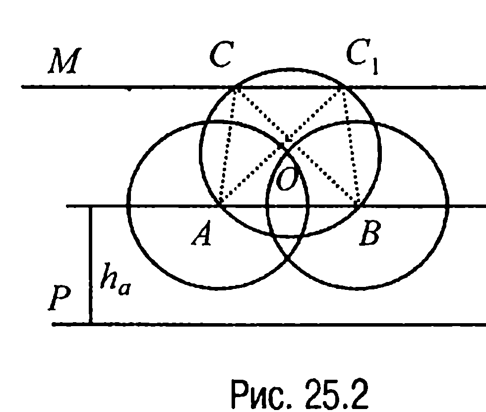

А тогда поскольку биссектриса любого угла треугольника делит противолежащую сторону на отрезки, пропорциональные прилежащим сторонам треугольника, то должны выполняться равенства $MA : MC = BA : BC$ и $MB : MD = CB : CD$.

Геометрическим местом точек, удовлетворяющих первому из приведенных равенств, является или серединный перпендикуляр к отрезку $AC$ в случае, если $AB = BC$, или окружность, описанная около прямоугольных треугольников $BME$ с гипотенузой $BE$, за исключением точек $B$ и $E$ в случае, когда $AB \neq BC$ (что следует из свойств 8.5X, 8.8X и пункта е) настоящего параграфа).

Точка $M$ должна принадлежать и геометрическому месту точек, отношение расстояний которых от точек $B$ и $D$ равно $BC : CD$. Это тоже или серединный перпендикуляр к отрезку $BD$, если $BC = CD$, или окружность, описанная около прямоугольных треугольников $FMC$ с гипотенузой $FC$, за исключением точек $F$ и $C$.

---
**стр. 342**
---

Итак, искомая точка $M$ должна быть точкой пересечения или обеих окружностей, или одного из перпендикуляров с окружностью (в случае, когда $AB = BC = CD$, задача решений не имеет).

**Построение.** Пусть $AB = a$, $BC = b$, $CD = c$. Строим окружность, которая пересекает прямую $l$ в точках $B$ и $E$ таким образом, что $AE : CE = BA : BC$. Центр этой окружности — середина отрезка $BE$. А тогда если $a > b$, $CE = x$, то $AE = AB + BC + CE = a + b + x$ и, значит,

$$\frac{a+b+x}{x} = \frac{a}{b}, \text{ откуда } x = \frac{b(a+b)}{a-b}.$$

Итак, если точка $E$ прямой $l$ такова, что точка $C$ находится между точками $B$ и $E$, то одна из окружностей строится так, как это указано выше (в случае, когда $a < b$, точка $A$ находится между точками $B$ и $E$).

Аналогичный вывод имеет место и относительно другой окружности.

**Исследование.** Если $a \le b < c$ или $c \le b < a$, то задача всегда имеет решение. Если же $a \le b$ и $c \le b$, то задача решений не имеет. Наконец, из расположения окружностей можно сделать вывод, что они пересекаются только в том случае, когда $3ac > b(a+b+c)$, т. е. когда $a > b(1+b/c)/(3-b/c)$ и $c > b(1+b/a)/(3-b/a)$. Другими словами, пересечение окружностей возможно только лишь в случае, когда $a > \frac{b}{3}$ (каким бы ни было при этом $c$).

**25.2.** *Построить треугольник по стороне $a$, высоте $h_a$, опущенной на сторону $a$, и радиусу $R$ описанной около треугольника окружности.*

**Решение.** Отложим отрезок $AB = a$ (рис. 25.2).

Тогда задача сводится к определению положения вершины $C$, которая должна

а) находиться на расстоянии $h_a$ от прямой $AB$;

б) находиться на описанной около треугольника окружности радиуса $R$.

Первому условию будут удовлетворять все точки двух прямых

---
**стр. 343**
---

$MN$ и $PQ$, которые параллельны прямой $AB$ и находятся на расстоянии $h_a$ от нее.

Центр $O$ описанной около треугольника $ABC$ окружности является точкой пересечения двух окружностей радиуса $R$ с центрами в точках $A$ и $B$. Выберем одну из этих точек пересечения окружностей и построим окружность $s$ с центром в выбранной точке и радиусом $R$.

Точки $C$ и $C_1$ пересечения окружности $s$ с прямой $MN$ и будут третьими вершинами искомых треугольников.

Отметим, что удовлетворять условиям задачи будут и треугольники, симметричные треугольникам $ACB$ и $AC_1B$ относительно прямой $AB$.

**25.3.** *Даны точка $A$ и окружность $s$. Требуется провести через точку $A$ прямую таким образом, чтобы хорда, высекаемая окружностью $s$ на этой прямой, имела данную длину $d$.*

**Решение.** Пусть $R$ — радиус окружности $s$ с центром в точке $O$ и

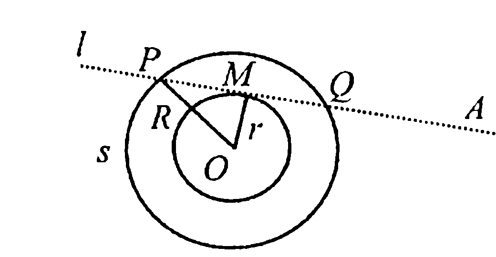

пусть окружность $s$ высекает на прямой $l$, проходящей через точку $A$, хорду $PQ$ (рис. 25.3). Обозначим через $M$ серединную точку хорды $PQ$. Тогда $OM^2 = OP^2 - MP^2 = R^2 - d^2/4$ и, значит, искомая прямая является касательной к окружности с центром $O$ и радиусом $r = \sqrt{R^2 - \frac{d^2}{4}}$, проходящей через точку $A$.

Таким образом, чтобы решить задачу, нужно сначала построить окружность радиуса $r$, а затем провести к ней касательную, проходящую через точку $A$.

**25.2. Метод спрямления**

При решении ряда геометрических задач удобно пользоваться специальным методом, который называется *спрямлением*. Суть этого метода состоит в том, что если в условии задачи указана

---
**стр. 344**
---

сумма двух или нескольких отрезков, являющихся звеньями некоторой ломаной, то на чертеже выпрямляют эту ломаную, повернув или переложив отрезки так, чтобы они оказались на одной прямой. В результате получается вспомогательная фигура, с помощью которой решаемая задача сводится к более простой или известной задаче.

**25.4.** *Построить равнобедренный треугольник по заданному углу при основании и сумме основания и боковой стороны.*

**Решение. Анализ.** Пусть $ABC$ — искомый равнобедренный треугольник, у которого $\angle BAC = \angle CBA = \alpha$ и $AB + BC = m$, где $m$ — данный отрезок. В данном случае ломаную $ABC$ спрямляем следующим образом: повернем сторону $BC$ около точки $B$ так, чтобы точка $C$ перешла в точку $D$, лежащую на продолжении стороны $AB$ за точку $B$ (рис. 25.4).

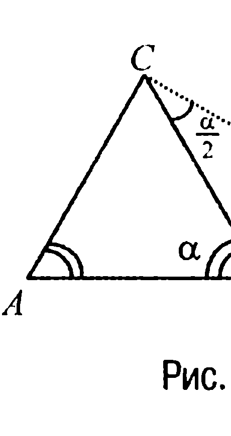

Соединив точки $C$ и $D$ отрезком, получим вспомогательный треугольник $ADC$, в котором $AD = m$, $\angle DAC = \alpha$, а $\angle CDA = \angle BCD = \alpha/2$ (так как внешний угол $ABC$ равнобедренного треугольника $CBD$ равен $\alpha$).

Таким образом, построив треугольник $ADC$, остается найти точку $B$, в которой надо согнуть отрезок $AD$, чтобы получить искомый треугольник $ABC$. Но поскольку $BC = BD$, то точка $B$ лежит на пересечении отрезка $AD$ с серединным перпендикуляром к отрезку $CD$.

**Построение** треугольника $ABC$ (на основе анализа) не представляет трудностей.

**25.5.** *Построить треугольник по стороне, прилежащему к ней углу и сумме двух других сторон.*

**Решение. Анализ.** Допустим, что задача решена, т. е. построен треугольник $ABC$ с данной стороной $AB = c$, $\angle CAB = \alpha$ и суммой двух сторон $AC + CB = d$ (рис. 25.5).

---
**стр. 345**
---

Если продолжить сторону $AC$ на отрезок $CD = CB$, то получим новый треугольник $ABD$ со стороной $AB = c$, $\angle DAB = \alpha$ и стороной $AD = d$. Вместе с треугольником $ABD$ получим и равнобедренный треугольник $DCB$. Полученной информации достаточно для решения сформулированной задачи.

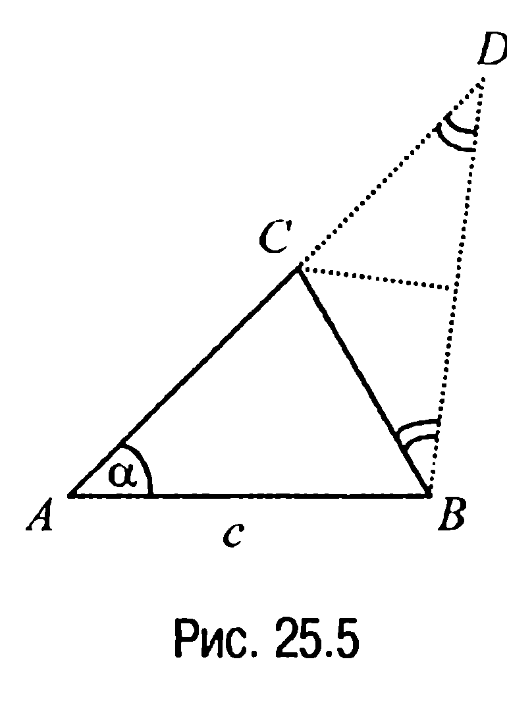

**Построение.** Сначала строим треугольник $ABD$ с $\angle DAB = \alpha$ и сторонами $AB = c$, $AD = d$. Далее находим на $AD$ такую точку $C$, что $CD = CB$ (ее можно найти, если провести, например, серединный перпендикуляр к отрезку $BD$). Полученная точка $C$ и будет третьей вершиной искомого треугольника $ABC$.

**Исследование.** Так как сумма двух сторон треугольника больше его третьей стороны, то должно выполняться неравенство $d > c$. В этом случае $AD > AB$ и поэтому $\angle BDA < \angle ABD$. А тогда треугольник $DCB$ можно построить и, значит, при построении угла $DBC$, равного углу $BDC$, точка $C$ будет лежать на отрезке $AD$. Последнее означает, что при $d > c$ решение задачи всегда существует, и оно единственное.

**25.6.** *Построить треугольник по стороне $c$, углу $\gamma$, противолежащему этой стороне, и сумме двух других сторон $d$.*

**Решение. Анализ.** Предположим, что задача решена, т. е. построен треугольник $ABC$ с условиями: $AB = c$, $\angle BCA = \gamma$, $AC + CB = d$ (рис. 25.6).

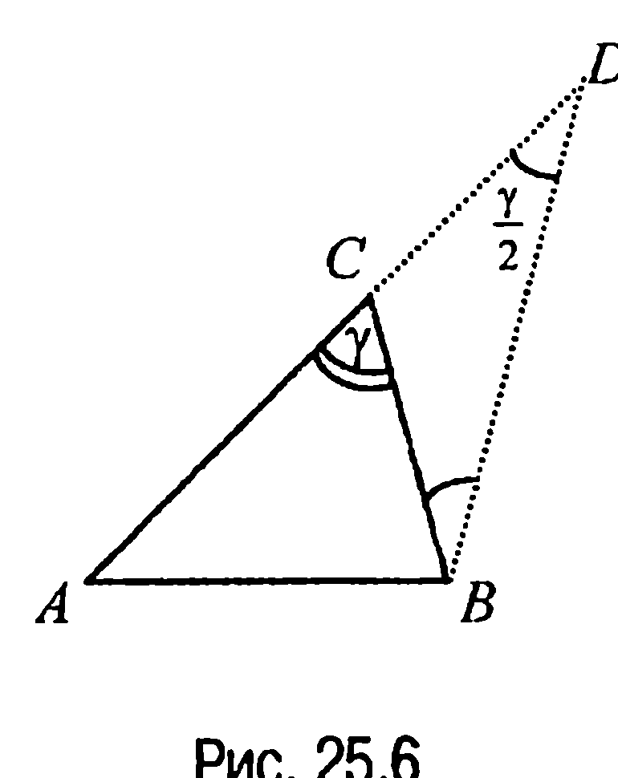

Если теперь продолжить сторону $AC$ на отрезок $CD = CB$, то получим новый треугольник $ABD$ со сторонами $AB = c$, $AD = d$ и углом $BDA$, равным $\frac{\gamma}{2}$ (поскольку $\angle BCA$ является внешним по отношению к равнобедренному треугольнику $DCB$).

Отсюда приходим к следующему плану построения искомого треугольника.

---
**стр. 346**
---

**Построение.** Сначала строим треугольник по данным сторонам $AB = c$, $AD = d$ и $\angle ADB = \frac{\gamma}{2}$. Затем строим равнобедр<!-- вероятная опечатка оригинала: «равнобедрснный» -->снный треугольник $DCB$ с вершиной $C$ на отрезке $AD$ (это делается так же, как и в предыдущей задаче). А тогда треугольник с вершинами $A$, $B$ и $C$ и будет искомым треугольником.

**Доказательство.** То, что построенный треугольник является искомым, следует из того, что $AB = c$, $AC + CB = AC + CD = d$, поскольку по построению $CB = CD$, а $\angle BCA = \gamma$ как внешний угол равнобедренного треугольника $DCB$, у которого $\angle CBD = \angle BDC = \frac{\gamma}{2}$.

**Исследование.** Чтобы задача имела решение, должно выполняться неравенство $d > c$ (сумма двух сторон треугольника больше его третьей стороны), поэтому в треугольнике $ABD$ сторона $AD$ должна быть больше стороны $AB$. Кроме того, если $AE = p$ — перпендикуляр, опущенный из точки $A$ на прямую $BD$ (рис. 25.7), то должно выполняться неравенство $AB \ge AE$ или $c \ge p$.

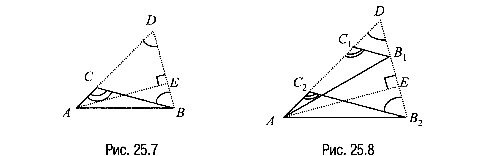

Далее, данный по условию $\angle BCA = \gamma$ меньше развернутого и, следовательно, $\angle BDA = \frac{\gamma}{2}$ — угол острый. Поэтому основание перпендикуляра $p$ лежит на луче $DB$, а из прямоугольного треугольника $AED$ следует, что $AE = AD \cdot \sin \angle EDA$ или $p = d \cdot \sin \frac{\gamma}{2}$. Таким образом, если $c < d \cdot \sin \frac{\gamma}{2}$ ($c < p$), то задача решений не имеет.

---
**стр. 347**
---

Если $c = d \cdot \sin \frac{\gamma}{2}$, то задача имеет единственное решение (в этом случае точки $B$ и $E$ совпадают).

Наконец, если $d > c > d \cdot \sin \frac{\gamma}{2}$, то задача имеет два решения (рис. 25.8) — треугольники $AB_1C_1$ и $AB_2C_2$.

Отметим также, что в случае $c = d \cdot \sin \frac{\gamma}{2}$ искомый треугольник является равнобедренным. В этом случае треугольники $AB_1C_1$ и $AB_2C_2$ равны, они отличаются лишь расположением сторон.

**25.3. Метод центральной симметрии**

*Методом центральной симметрии* решаются задачи, в условии которых в той или иной форме указана точка, являющаяся центром симметрии искомой или некоторой вспомогательной фигуры.

**25.7.** *В данный четырехугольник вписать параллелограмм при условии, что две его вершины фиксированны и принадлежат противоположным сторонам четырехугольника.*

**Решение. Анализ.** Пусть $KLMN$ — данный четырехугольник, $A$ и $C$ — фиксированные точки, лежащие на сторонах $KL$ и $MN$ соответственно, $ABCD$ — параллелограмм (рис. 25.9). Тогда середина отрезка $AC$ — точка $O$, является центром симметрии параллелограмма $ABCD$. Этот факт и дает способ построения третьей вершины (а значит, и четвертой) искомого параллелограмма.

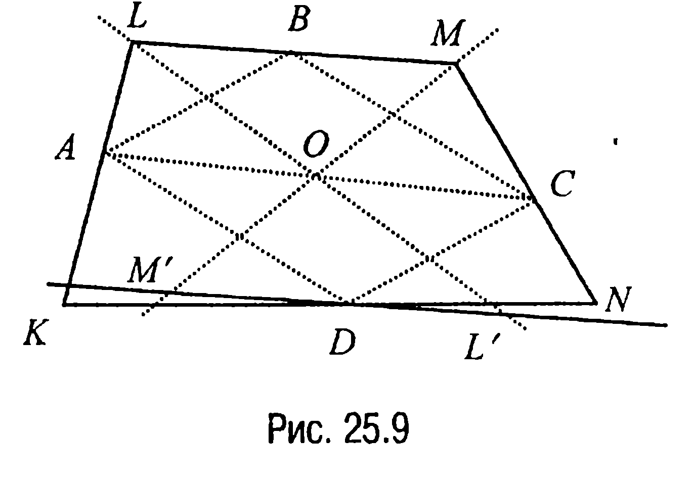

---
**стр. 348**
---

**Построение.** Сначала строим точку $O$ — середину отрезка $AC$, а затем — прямую $M'L'$, симметричную прямой $LM$ относительно точки $O$. Тогда третья вершина $D$ искомого параллелограмма строится как точка пересечения прямой $KN$ с прямой $ML'$. Что же касается четвертой вершины $B$, то она является точкой пересечения прямых $LM$ и $OD$.

**Доказательство.** То, что построенный четырехугольник $ABCD$ — искомый параллелограмм, следует из того, что $AO = OC$, а $BO =$
$= OD$.

**Исследование.** Если предположить, что вершины $B$ и $D$ могут лежать как на сторонах $LM$ и $KN$ четырехугольника $KLMN$ соответственно, так и на их продолжениях, то очевидно, что задача имеет единственное решение, если прямые $KN$ и $LM$ пересекаются. Если же $KLMN$ — трапеция с основаниями $KN$ и $LM$, то легко убедиться, что если середина $O$ отрезка $AC$ равноудалена от оснований трапеции, то задача имеет бесконечно много решений, если же точка $O$ не равноудалена от оснований трапеции, то задача решений не имеет.

**Замечание 25.1.** Мстодом центральной симметрии решена, в частности, и приведенная выше задача 24.6. <!-- вероятная опечатка оригинала: «Мстодом» вместо «Методом» -->

**25.4. Метод осевой симметрии**

**Метод осевой симметрии**, нередко используемый для спрямления ломаных линий, может быть применен при решении задач, в условии которых дается сумма или разность некоторых звеньев ломаной линии.

Этот метод используется также и при решении задач, в условии которых указывается прямая, являющаяся осью симметрии некоторых элементов фигуры, или прямая, по одну сторону от которой располагаются одни элементы фигуры, а по другую — остальные ее элементы.

---
**стр. 349**
---

§ 25. Некоторые методы решения задач на построение

**25.8.** Даны две точки $A$ и $B$, расположенные по одну сторону от данной прямой $l$. Найти на прямой $l$ точку, сумма расстояний от которой до двух заданных точек минимальна.

**Решение. Анализ.** Пусть $A_1$ — точка, симметричная данной точке $A$ относительно данной прямой $l$ (рис. 25.10), и пусть точка $C$ — произвольная точка прямой $l$.

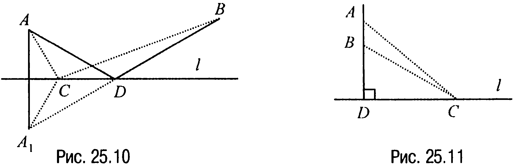

Тогда так как $AC = A_1C$, то $AC + CB = A_1C + CB$ и, значит, сумма $AC + CB$ будет минимальной, когда минимальной будет сумма $A_1C + CB$. Но последняя сумма будет, очевидно, минимальной, когда точка $C$ будет лежать на прямой $A_1B$.

Теперь построение становится очевидным.

**Построение.** Сначала строим точку, симметричную одной из заданных точек относительно заданной прямой $l$. Затем через построенную точку и другую заданную точку проводим прямую. Точка $D$ пересечения построенной прямой с прямой $l$ и будет искомой точкой.

**Доказательство** очевидно.

**Исследование.** Из построения следует, что задача имеет единственное решение.

В частном случае, когда точки $A$ и $B$ лежат на одном и том же перпендикуляре к прямой $l$, построение очевидно (рис. 25.11). В данном случае, если точки $C$ и $D$ не совпадают, то $AC + CB > AD + BD$.

**25.9.** Построить ромб по углу и диагонали, которая выходит из вершины данного угла.

**Решение. Анализ.** Пусть искомый ромб $ABCD$ с данным $\angle DAB = \angle BCD = \alpha$ и данной диагональю построен (рис. 25.12).

---
**стр. 350**
---

Тогда так как диагональ ромба $AC$ делит угол $\alpha$ пополам, то отсюда и следует план построения искомого ромба.

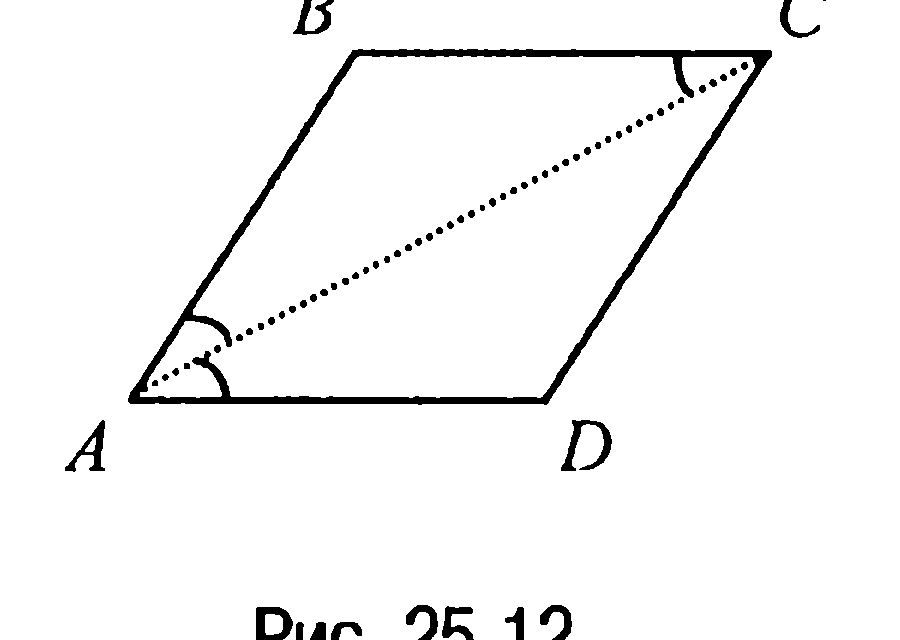

**Построение.** Сначала строим угол $\frac{\alpha}{2}$. Затем по стороне (диагонали ромба) и прилежащим к ней углам $\frac{\alpha}{2}$ строим треугольник $ABC$. Четвертая вершина $D$ искомого ромба будет тогда точкой, симметричной точке $B$ относительно прямой $AC$.

**Доказательство.** Построенный ромб действительно является искомым, поскольку по построению диагональ $AC$ равна данному отрезку, а $\angle DAB$ равен данному углу $\alpha$, т. е. ромб удовлетворяет всем условиям задачи.

**Исследование.** Из построения следует, что задача имеет единственное решение.

**25.5. Метод поворота**

*Метод поворота* тесно связан с методом осевой симметрии, поскольку композиция двух осевых симметрий с осями, пересекающимися в некоторой точке $O$, есть поворот около точки $O$ на удвоенный угол между осями (рис. 25.13).

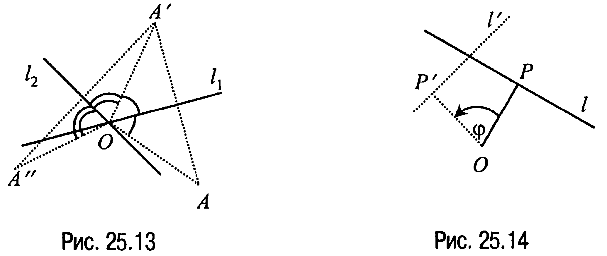

И обратно, всякий поворот около точки можно представить в виде композиции двух осевых симметрий, оси которых пересекаются в центре поворота.

---
**стр. 351**
---

Чтобы построить образ прямой $l$ при повороте около точки $O$ на угол $\phi$ ($0^\circ < \phi < 180^\circ$), можно поступить так: сначала провести к прямой $l$ перпендикуляр $OP$, затем повернуть точку $P$ на угол $\phi$ и через полученную точку $P'$ провести прямую $l'$, перпендикулярную $OP'$ (рис. 25.14).

Легко убедиться, что угол между прямой $l$ и ее образом $l'$ равен $\phi$ или $180^\circ - \phi$.
Угол же между лучом и его образом всегда равен углу поворота.

**25.10.** *Построить равносторонний треугольник, вершины которого находятся на трех данных параллельных прямых.*

**Решение. Анализ.** Пусть $ABC$ — искомый треугольник, вершины которого находятся на трех данных параллельных прямых $l_1$, $l_2$ и $l_3$ (рис. 25.15).

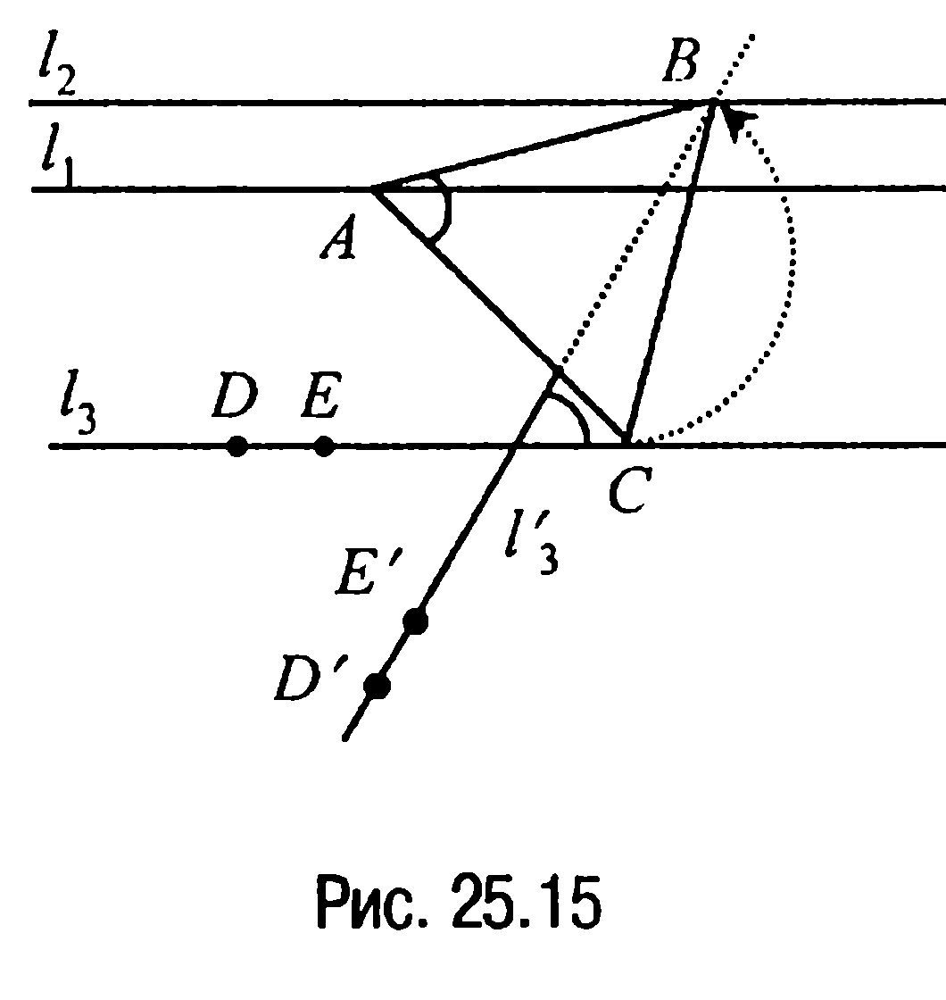

При повороте отрезка $AC$ около точки $A$ на $60^\circ$ в положительном направлении точка $C$ перейдет в точку $B$, прямая же $l_3$ перейдет в прямую $l'_3$, которая пересечет прямую $l_2$ в точке $B$. Последний факт и определяет план построения.

**Построение.** Сначала повернем в положительном направлении на $60^\circ$ прямую $l_3$. Для этого повернем на $60^\circ$ две произвольные точки $D$ и $E$ этой прямой.
Прямая $l'_3$, проходящая через точки $D'$ и $E'$ — образы точек $D$ и $E$ соответственно, будет образом прямой $l_3$. Затем находим точку пересечения прямой $l'_3$ с прямой $l_2$ (точку $B$).
Построив точку $B$, проведем окружность с центром в точке $A$, радиус которой равен отрезку $AB$. Точка $C$ — одна из точек пересечения проведенной окружности с прямой $l_3$ и будет третьей вершиной искомого треугольника.

---
**стр. 352**
---

**Доказательство.** То, что построенный треугольник действительно является искомым, следует из того, что поскольку точка $B$ является образом точки $C$ при повороте на $60^\circ$, то $\angle CAB = 60^\circ$ и, значит, треугольник $ABC$ — равносторонний, так как $AB = AC$.

**25.11.** *Построить равносторонний треугольник, одна из вершин которого совпадает с данной точкой $A$, а две другие вершины находятся на разных прямых $l_1$ и $l_2$ соответственно.*

**Решение.** Сначала осуществляем поворот прямой $l_1$ относительно точки $A$. Тогда образ прямой $l_1$ — прямая $l'_1$ пересечет прямую $l_2$ в некоторой точке $C$ (рис. 25.16).

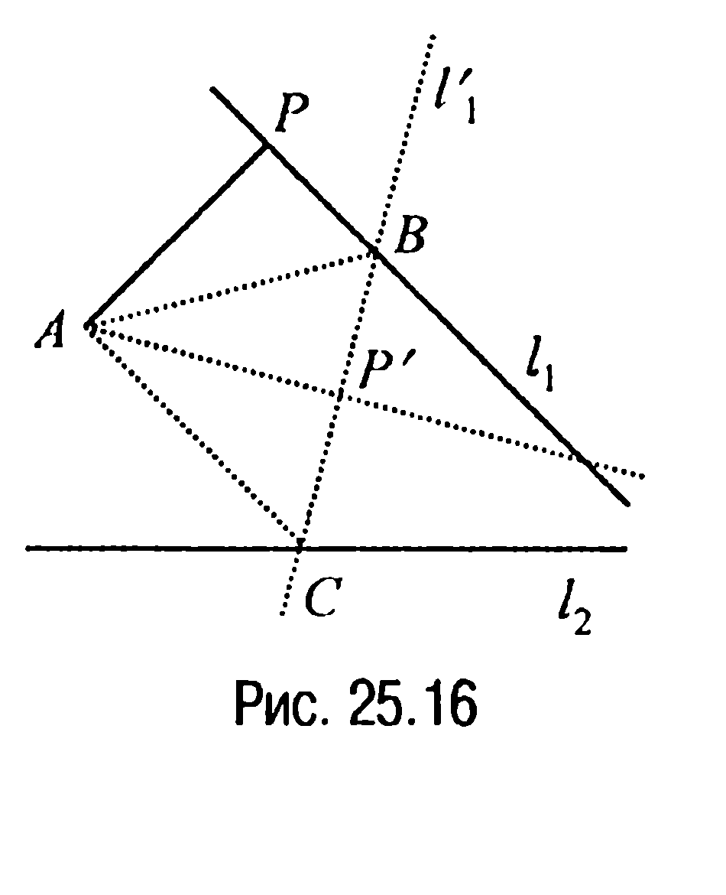

Теперь проводим окружность с центром в точке $A$, радиус которой равен отрезку $AC$. Точка $B$ — одна из точек пересечения этой окружности с прямой $l_1$, и будет третьей вершиной искомого треугольника.

**25.6. Метод параллельного переноса**

При решении задач на построение *методом параллельного переноса* часто используется тот факт, что композиция двух осевых симметрий с параллельными осями $l_1$ и $l_2$ есть параллельный перенос на удвоенное расстояние между осями $l_1$ и $l_2$.

И обратно, всякий параллельный перенос можно представить в виде композиции двух осевых симметрий с параллельными осями, перпендикулярными направлению переноса.

Методом параллельного переноса решаются такие задачи, условия которых позволяют параллельным переносом получить некоторую вспомогательную фигуру, по которой уже легко строится искомая фигура.

Часто этот метод используется при решении задач на построение четырехугольников. При этом обычно переносят один или не-

---
**стр. 353**
---

сколько отрезков таким образом, чтобы получился треугольник, с которого можно начинать требуемое построение.

**25.12.** *Построить трапецию по основаниям и боковым сторонам.*

**Решение.** Пусть четырехугольник $ABCD$ — искомая трапеция (рис. 25.17)

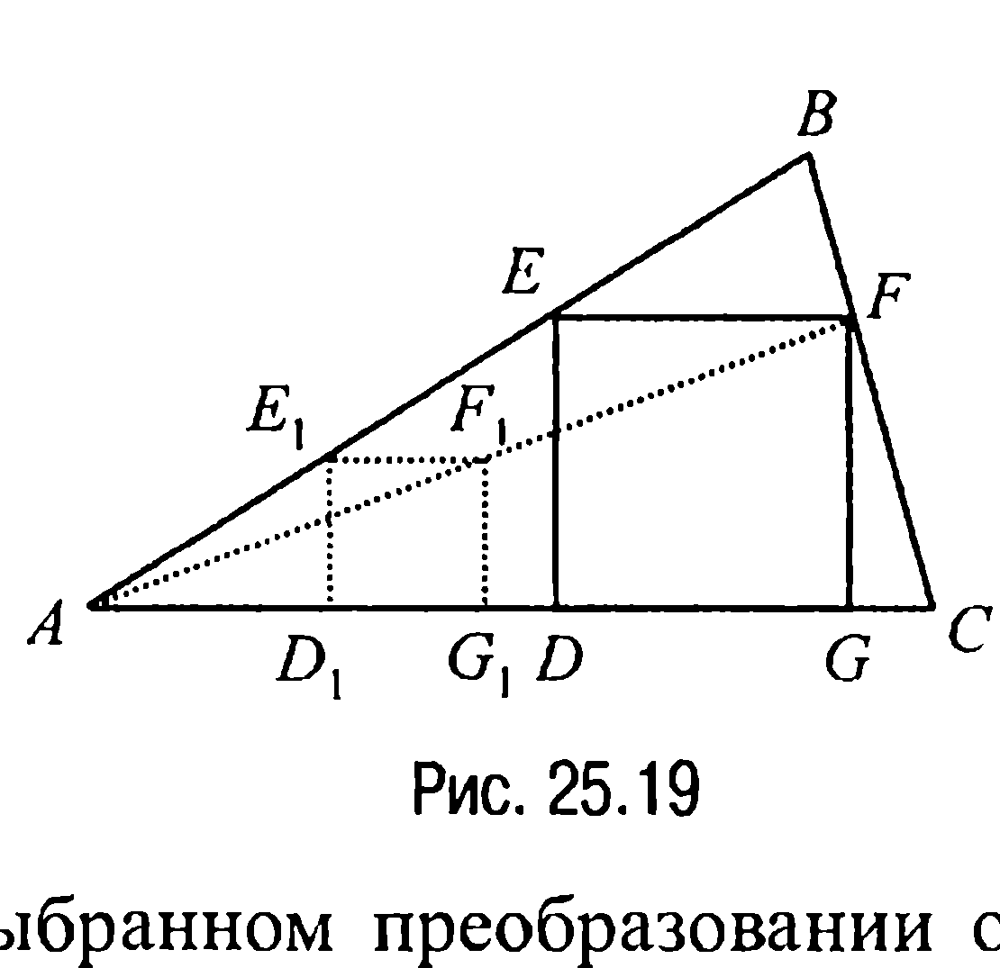

и пусть точка $E$ — точка пересечения прямой $AD$ с прямой, проходящей через точку $C$ параллельно прямой $AB$.

Тогда план построения следующий. Сначала строим треугольник $ECD$ с основанием $ED$, равным разности данных оснований трапеции, и боковыми сторонами $EC$ и $CD$, равными боковым сторонам трапеции. Затем на продолжении отрезка $DE$ за точку $E$ откладываем отрезок $EA$, равный меньшему основанию трапеции. Далее, через точку $C$ проводим прямую, параллельную прямой $AD$, и на ней откладываем отрезок $CB$, равный отрезку $EA$. Четырехугольник $ABCD$ и будет, очевидно, искомой трапецией.

**25.13.** *Построить трапецию по основаниям и диагоналям.*

**Решение.** Пусть четырехугольник $ABCD$ — искомая трапеция (рис. 25.18)

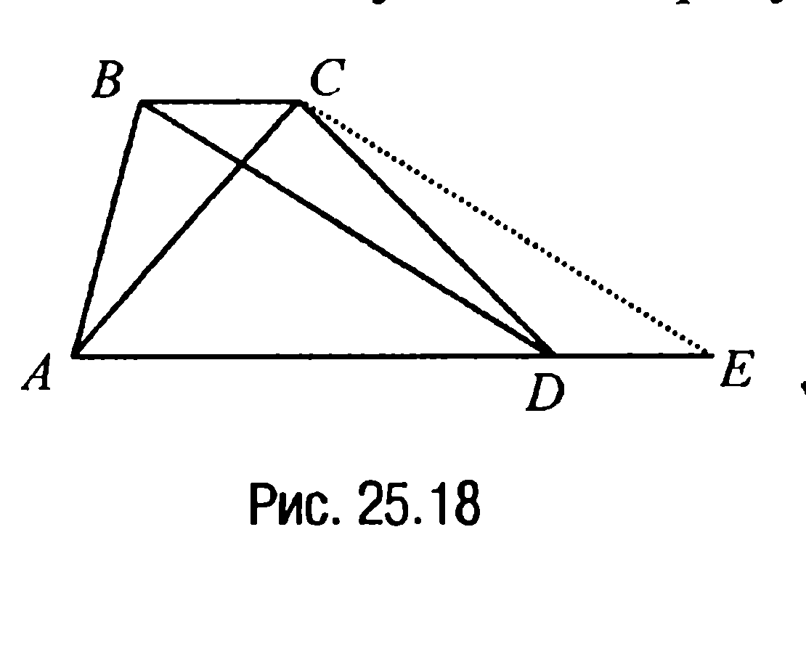

и пусть точка $E$ — точка пересечения прямой $AD$ с прямой, проходящей через точку $C$ параллельно прямой $BD$. Отсюда следует план построения. Именно, сначала строим треугольник $ACE$ с основанием $AE$, равным сумме данных оснований трапеции, и боковыми сторонами $AC$ и $CE$, равными боковым сторонам трапеции. <!-- вероятная опечатка оригинала: в условии задачи — диагонали, а не боковые стороны --> Полученный треугольник и позволяет очевидным образом построить искомую трапецию.

---
**стр. 354**
---

**25.7. Метод подобия**

При решении задач на построение *метод подобия* применяется в том случае, когда данные условия задачи можно разбить на две группы: одна из них определяет форму фигуры с точностью до подобия, а другая — размеры фигуры.

Метод подобия часто используется при решении задач, в которых требуется вписать одну фигуру в другую.

**25.14.** *В данный треугольник вписать квадрат таким образом, чтобы две его вершины лежали на основании треугольника, а две другие вершины — на боковых сторонах треугольника.*

**Решение. Анализ.** Пусть $DEFG$ — искомый квадрат (рис. 25.19).

Тогда очевидно, что преобразование подобия с центром в точке $A$ переводит вершины $D$, $E$ и $G$ квадрата $DEFG$ в соответствующие вершины $D_1$, $E_1$ и $G_1$ подобного ему квадрата $D_1E_1F_1G_1$, которые лежат на сторонах треугольника $ABC$. Что же касается точки $F$, то при выбранном преобразовании она переходит в точку $F_1$, не лежащую на стороне треугольника $ABC$.

Но именно это обстоятельство и позволяет составить план решения задачи,<!-- вероятная опечатка оригинала: «задачи, Так» --> Так, внутри угла $CAB$ сначала строим квадрат $D_1E_1F_1G_1$ такой, что три его вершины лежат на сторонах указанного угла.

Затем преобразованием подобия увеличиваем (уменьшаем) размеры квадрата таким образом, чтобы четвертая вершина оказалась лежащей на стороне треугольника (для этого достаточно провести прямую $AF_1$, точка $F$ пересечения которой с прямой $BC$ и будет искомой точкой).

Заметим, что коэффициент требуемого преобразования — это число $k = AF / AF_1$.

**Построение.** Из произвольной точки $E_1$ стороны $AB$ треугольника

---
**стр. 355**
---

$ABC$ опустим перпендикуляр $E_1D_1$ на сторону $AC$ и затем построим квадрат $D_1E_1F_1G_1$. Далее, через точки $A$ и $F_1$ проводим прямую, которая пересекает отрезок $BC$ в точке $F$.

Из точки $F$ опускаем перпендикуляр $FG$ на отрезок $AC$, а затем из той же точки проводим прямую, параллельную прямой $AC$, которая пересекает отрезок $AB$ в точке $E$.

Если теперь из точки $E$ опустить перпендикуляр $ED$ на отрезок $AC$, то четырехугольник $DEFG$ и будет искомым квадратом.

**Доказательство.** Из подобия треугольников $AEF$ и $AE_1F_1$, а также подобия треугольников $AFG$ и $AF_1G_1$ следует, что $\frac{EF}{E_1F_1} = \frac{AF}{AF_1}$,

$$\frac{FG}{F_1G_1} = \frac{AF}{AF_1} \text{ и, значит, } \frac{EF}{E_1F_1} = \frac{FG}{F_1G_1} .$$

Но в таком случае $\frac{EF}{FG} = \frac{E_1F_1}{F_1G_1} = 1$, откуда и следует, что четырехугольник $DEFG$ — действительно квадрат.

**Исследование.** Очевидно, что задача имеет единственное решение.

**25.15.** *Построить прямую, проходящую через данную точку и отсекающую на сторонах данного угла равные отрезки.*

**Решение. Анализ.** Предположим, что искомая прямая (прямая $BC$, проходящая через данную точку $M$) построена (рис. 25.20). Тогда отрезки $AB$ и $AC$ данного угла с вершиной $A$ равны и, значит, треугольник $ABC$ — равнобедренный.

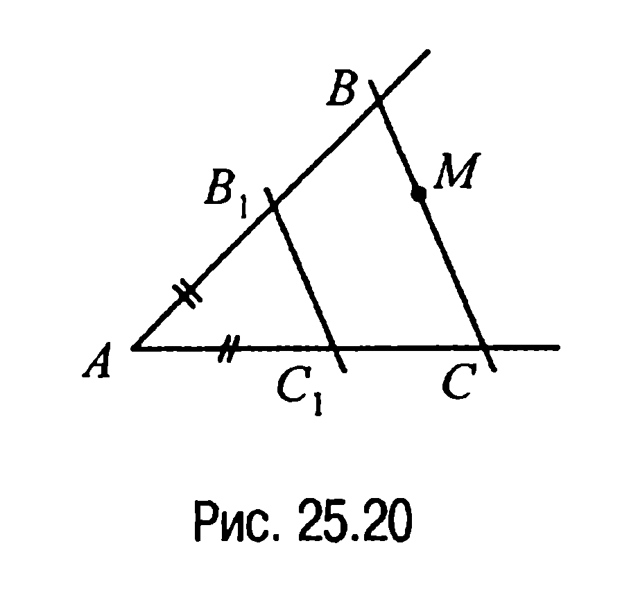

А тогда план решения задачи может быть таким: сначала строим некоторый равнобедренный треугольник $AB_1C_1$, а затем строим прямую, проходящую через точку $M$ параллельно прямой $B_1C_1$.

**Построение.** На сторонах данного угла с вершиной $A$ откладываем равные отрезки $AB_1$ и $AC_1$ и затем через данную точку $M$ проводим прямую, параллельную прямой $B_1C_1$. Точки $B$ и $C$ пересе-

---
**стр. 356**
---

чения построенной прямой со сторонами данного угла и определяют равные отрезки $AB$ и $AC$.

**Доказательство** следует из подобия треугольников $AB_1C_1$ и $ABC$.

**Исследование.** Задача всегда имеет единственное решение, если точка $M$ расположена на плоскости таким образом, что прямая $BC$, параллельная прямой $B_1C_1$, пересекает обе стороны угла. В противном случае задача решений не имеет.

**25.16.** *Построить на стороне $CD$ прямоугольника $ABCD$ точку $M$ таким образом, чтобы треугольники $ABM$, $BCM$ и $ADM$ были подобны.*

**Решение. Анализ.** Пусть точка $M$, лежащая на стороне $CD$ прямоугольника $ABCD$ (рис. 25.21), — искомая точка и пусть $MN$ — высота треугольника $ABM$.

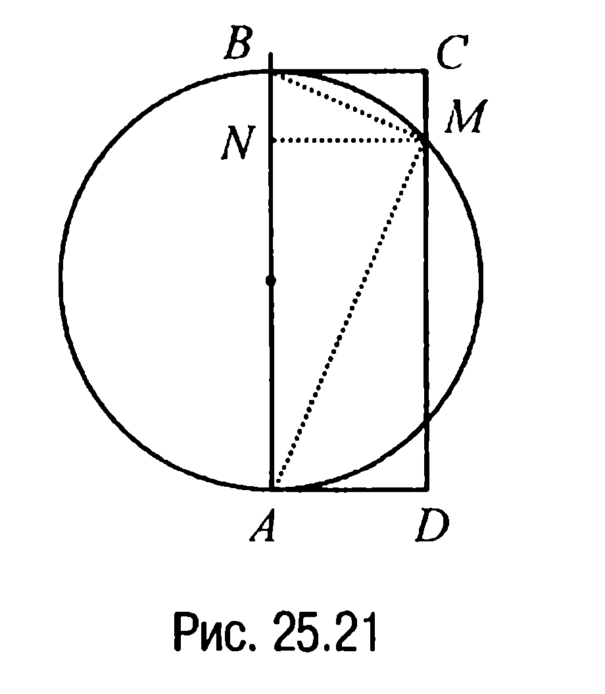

Тогда поскольку треугольник $BCM$ равен треугольнику $MNB$, а треугольник $ADM$ равен треугольнику $MNA$, то треугольники $BMN$, $MAN$ и $ABM$ подобны между собой и, значит, $\angle BMA = 90^\circ$.

Но в таком случае точка $M$ должна лежать на окружности, построенной на отрезке $AB$ как на диаметре. Этот факт позволяет решить задачу самым простым способом.

**Построение.** Строим окружность с диаметром, равным стороне $AB$ прямоугольника $ABCD$.

Точка пересечения этой окружности с отрезком $CD$ и будет искомой точкой.

**Доказательство** очевидно.

**Исследование.** Если окружность пересекает сторону $CD$ в двух точках, то задача имеет два решения.

Если окружность касается стороны $CD$, то задача имеет единственное решение, если же окружность не имеет общих точек с отрезком $CD$, то задача решений не имеет.

---
**стр. 357**
---

**25.8. Метод гомотетии**

Так как гомотетия — частный случай подобия, то все выше сказанное относительно *метода подобия* относится и к *методу гомотетии*.

К этому добавим еще, что при решении задач на построение *методом подобия* и, следовательно, *методом гомотетии* возникает одна особенность, связанная с отношением отрезков. Так если, например, задано отношение двух отрезков $a : b = m : n$, где $m$ и $n$ — натуральные числа, то при выполнении построения отрезков, пропорциональных искомым отрезкам $a$ и $b$, можно общую меру выбирать произвольным образом.

Следует, однако, учитывать, что при одном выборе отрезков можно построить вспомогательную фигуру, а при другом — этого сделать нельзя.

**25.17.** *Построить окружность, касающуюся сторон данного угла и проходящую через данную внутри него точку.*

**Решение. Анализ.** Предположим, что искомая окружность с центром в точке $O$ построена (рис. 25.22).

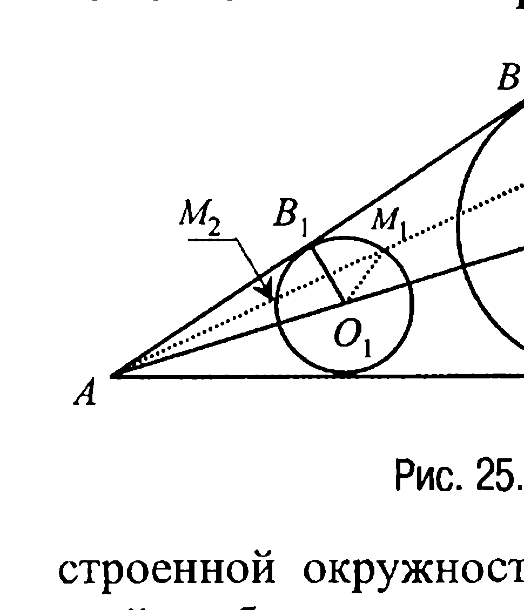

Точка $M$ на рисунке — данная точка, лежащая внутри данного угла с вершиной $A$, а $B$ — точка касания построенной окружности с одной из сторон угла.

Очевидно, что центр $O$ построенной окружности лежит на биссектрисе данного угла. На этой же биссектрисе лежит центр и любой другой окружности, касающейся сторон угла, но не проходящей через точку $M$.

Пусть одна из таких окружностей имеет центр $O_1$. Очевидно, что эта окружность гомотетична построенной окружности с центром $O$ и, значит, гомотетия с центром в точке $A$ и коэффициентом $k = \frac{OM_1}{OM}$ переводит точку $M$ окружности с центром $O$ в точку $M_1$ окружности с центром в точке $O_1$. Отсюда и следует план решения задачи.

---
**стр. 358**
---

**Построение.** Сначала строим биссектрису данного угла с вершиной $A$, а затем из произвольной точки $O_1$ биссектрисы опускаем перпендикуляр $O_1B_1$ на сторону угла. После этого строим окружность с центром в точке $O_1$ и радиусом $O_1B_1$. Далее проводим луч $AM$.

Пусть $M_1$ и $M_2$ — точки пересечения этого луча с построенной окружностью с центром $O_1$. Тогда если через точку $M$ провести прямую, параллельную, например, прямой $M_1O_1$, то точка $O$ пересечения этой прямой с биссектрисой данного угла и будет центром искомой окружности радиуса $OM$.

**Доказательство.** Покажем, что окружность с центром в точке $O$ и радиусом $OM$ касается сторон данного угла.

Действительно, точки $M$ и $M_1$, $O$ и $O_1$, $B$ и $B_1$ гомотетичны. А по одному из свойств гомотетии равные отрезки переходят при гомотетии в равные отрезки. Поэтому из равенства $O_1M_1 = O_1B_1$ следует равенство $OM = OB$, что и доказывает требуемое.

**Исследование.** Задача имеет два решения. Центр второй окружности — это точка пересечения прямой, проходящей через точку $M$ параллельно прямой $O_1M_2$, с биссектрисой данного угла.

**25.18.** *Построить на стороне $OB$ острого угла $AOB$ точку $M$, равноудаленную от стороны $OA$ и заданной точки $C$, лежащей внутри угла $AOB$.*

**Решение. Анализ.** Пусть $M$ — искомая точка (рис. 25.23). Тогда очевидно, что точка $M$ является центром окружности, проходящей через точку $C$ и касающейся стороны $OA$ данного угла в точке $D$. Но в таком случае план решения задачи аналогичен плану решения предыдущей задачи.

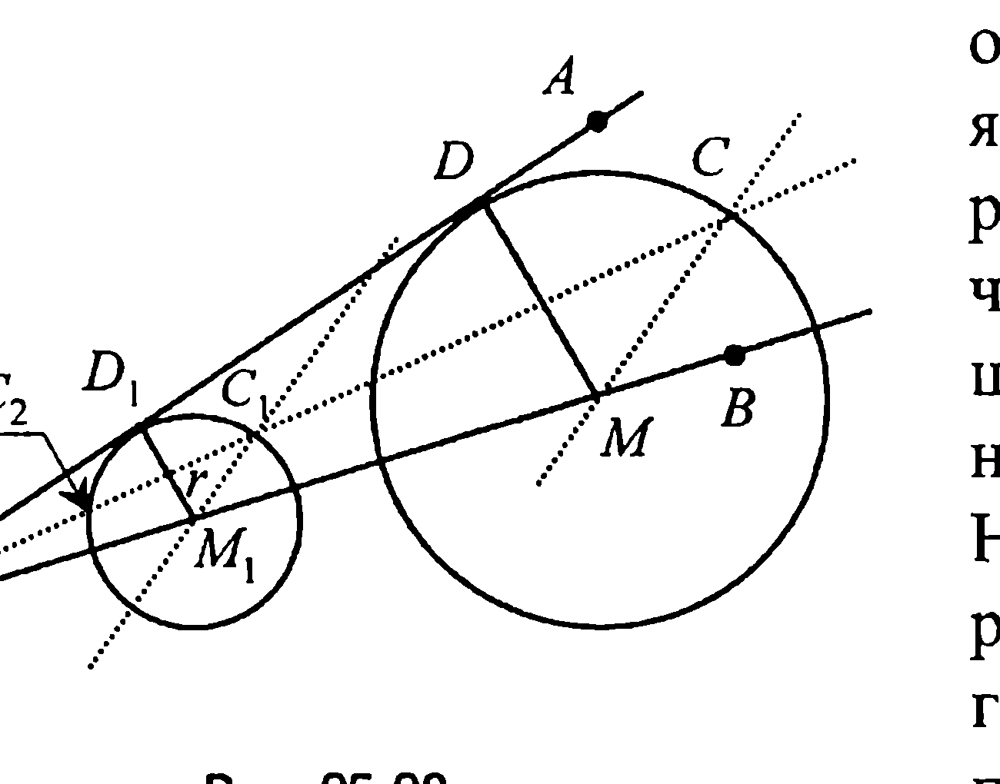

**Построение.** Из произвольной точки $M_1$, лежащей на стороне $OB$, опустим перпендикуляр $M_1D_1 = r$ на сторону $OA$ данного угла и затем проведем ок-

---
**стр. 359**
---

ружность с центром в точке $M_1$ и радиусом $r$. Далее проводим луч $OC$. Пусть $C_1$ и $C_2$ — точки пересечения этого луча с построенной окружностью радиуса $r$. Но тогда если провести через точку $C$ прямую, параллельную прямой $M_1C_1$, то точка $M$ пересечения этой прямой со стороной $OB$ данного угла и будет искомой точкой.

**Доказательство.** При гомотетии с центром $O$ и коэффициентом $k = \frac{OC}{OC_1}$ прямая $C_1M_1$ перейдет в параллельную ей прямую $CM$ и, значит, окружность с центром $M$ и радиусом $MC$ будет гомотетична окружности с центром $M_1$ и радиусом $r$. Следовательно, точка касания $D_1$ последней окружности со стороной $OA$ данного угла перейдет при гомотетии в точку $D$ касания окружности радиуса $MC$ с той же стороной $OA$ данного угла и поэтому $MD = MC$, а это и доказывает требуемое.

**Исследование.** Задача имеет два решения. Для нахождения второго решения следует провести через точку $C$ прямую, параллельную прямой $C_2M_1$, и рассмотреть гомотетию с центром в точке $O$ и коэффициентом $k = \frac{OC}{OC_2}$.

**25.9. Алгебраический метод**

При решении задач на построение *алгебраическим методом* необходимо уметь строить отрезки по формулам, выражающим длины отрезков через длины данных отрезков. Одними из наиболее простых задач здесь являются задачи на построение отрезков, заданных формулами $x = \frac{b \cdot c}{a}$ и $x = \sqrt{ab}$.

▼ **25.19 (построение четвертого пропорционального отрезка).** *Построить отрезок $x = \frac{b \cdot c}{a}$, где $a, b$ и $c$ — данные отрезки.*

**Решение.** На одной из сторон произвольного неразвернутого угла с вершиной $O$ откладываем отрезки $OA = a$, $AB = b$, а на другой стороне угла — отрезок $OC = c$ (рис. 25.24). Затем через точку $B$ проводим прямую, параллельную прямой $AC$.

---
**стр. 360**
---

Пусть $D$ — точка пересечения этой прямой с лучом $OC$. Тогда отрезок $CD = x$ и будет искомым отрезком, поскольку по обобщенной теореме Фалеса $\frac{OA}{AB} = \frac{OC}{CD}$ и, значит, $CD = \frac{AB \cdot OC}{OA} = \frac{b \cdot c}{a}$.

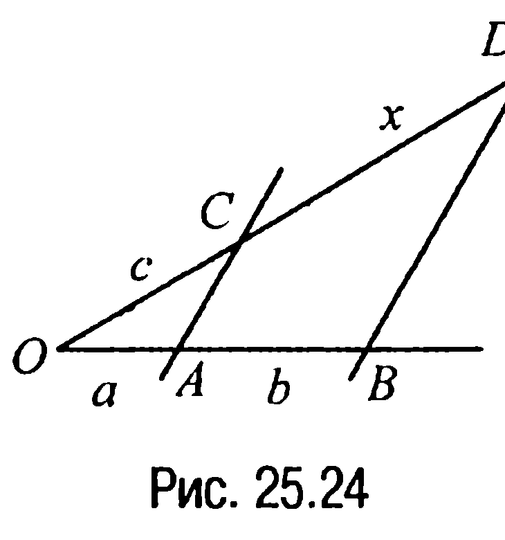

▼ **25.20 (построение среднего геометрического).** Построить отрезок $x = \sqrt{a \cdot b}$, где $a$ и $b$ — данные отрезки.

**Решение.** На произвольной прямой последовательно откладываем два отрезка $AB = a$ и $BC = b$ (рис. 25.25). Затем на отрезке $AC$ как на диаметре строим окружность радиуса $\frac{a+b}{2}$ и из точки $B$ восстанавливаем к прямой $AC$ перпендикуляр.

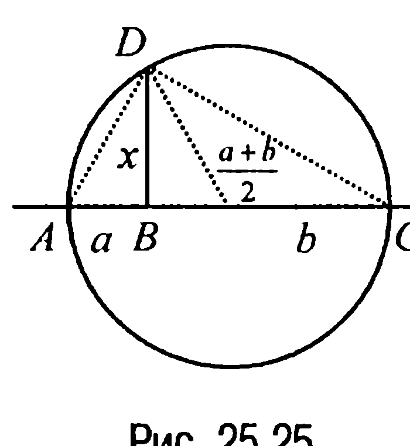

Пусть $D$ — точка пересечения этого перпендикуляра с построенной окружностью. Тогда отрезок $BD = x$ и будет искомым отрезком, так как по свойству высоты прямоугольного треугольника $ADC$, проведенной из вершины прямого угла $D$, отрезок $BD = \sqrt{AB \cdot BC} = \sqrt{a \cdot b}$.

**25.21.** В данную окружность вписать прямоугольник, равновеликий данному квадрату.

**Решение. Анализ.** Пусть четырехугольник $ABCD$ — вписанный в данную окружность прямоугольник, равновеликий данному квадрату со стороной $AF = a$ (рис. 25.26). Диагональ $AC$ прямоугольника можно построить — она является диаметром данной окружности. А тогда замечая, что треугольники $ABC$ и $ADC$ равны, приходим к выводу, что задача будет решена, если будет пост-

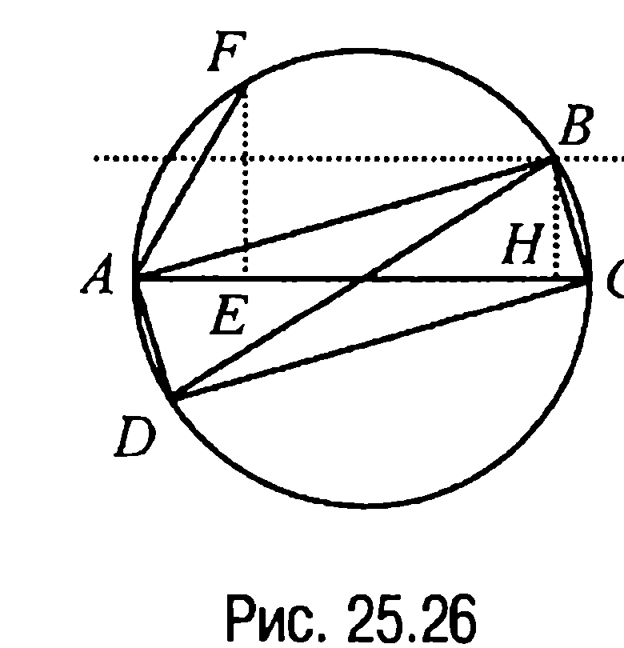

---
**стр. 361**
---

роена точка $B$. Но для построения этой точки, очевидно, достаточно найти высоту $BH$. Найдем ее. Пусть $BH = x$, $AC = b$. Тогда с учетом условия имеем $b \cdot x = a^2$, откуда $x = a^2 / b$.

**Построение.** Сначала, пользуясь полученной формулой $x = a^2 / b$, строим отрезок $BH$. Для этого проведем диаметр $AC$ данной окружности и на ней построим точку $F$ такую, что $AF = a$. Затем проводим перпендикуляр $FE$ к диаметру $AC$, тогда $AE = BH = a^2 / b$.

После этого на расстоянии $x$ от прямой $AC$ проводим параллельную ей прямую. Пусть точка $B$ — точка пересечения последней прямой с окружностью. Тогда точка $D$, симметричная точке $B$ относительно центра окружности, будет четвертой вершиной искомого прямоугольника.

**Доказательство.** Так как $AC$ и $BD$ — диаметры окружности, то $ABCD$ — прямоугольник. Площадь же $S$ этого прямоугольника равна площади квадрата со стороной $a$, поскольку $S = AC \cdot BH = b a^2 / b = a^2$.

**Исследование.** Задача имеет решение тогда и только тогда, когда $x \leq b/2$, что равносильно условию $b \geq a\sqrt{2}$ (диаметр окружности не меньше диагонали данного квадрата).

**25.22.** *На координатной оси построить точку $A (\sqrt{7})$.*

**Решение.** При решении этой задачи воспользуемся методом построения среднего геометрического двух отрезков $a$ и $b$. Именно, из начала $O$ координатной оси $Ox$ с заданной единицей измерения восстанавливаем перпендикуляр к оси $Ox$ и на этом перпендикуляре откладываем отрезки $OC = 1$ и $OB = 7$ (рис. 25.27). Затем на отрезке $CB$ как на диаметре

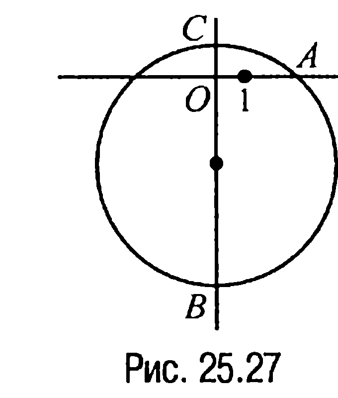

строим окружность, которая пересекает положительную полуось $Ox$ в искомой точке $A$, поскольку $OA = \sqrt{1 \cdot 7} = \sqrt{7}$.

---
**стр. 362**
---

**25.23.** Построить острый угол $x$, если $\cos x = a / 2b$, где $a$ и $b$ — данные отрезки.

**Решение.** Основываясь на том факте, что в равнобедренном треугольнике $ABC$ с основанием $AC = a$ и боковой стороной $AB = b$ (рис. 25.28) угол при основании является искомым, становится очевидным и план решения задачи. Именно, для решения задачи следует построить равнобедренный треугольник с основанием $AC = a$ и боковой стороной $AB = BC = b$. А то, что угол при основании треугольника действительно является искомым, вытекает из следующих соображений. Пусть $BD$ — высота треугольника $ABC$, а значит, и его медиана. Но тогда $AD = DC = a / 2$ и из прямоугольного треугольника $ADB$ находим, что $\cos x = \frac{AD}{AB} = \frac{a}{2} : b = \frac{a}{2b}$.

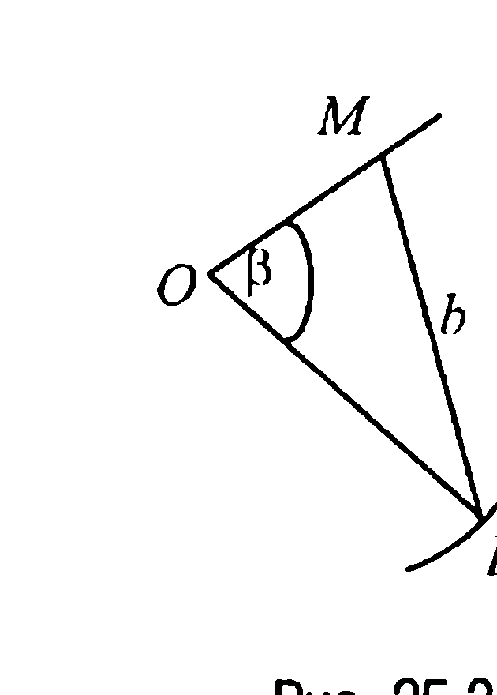

Приведем еще одну задачу, которая нередко является вспомогательным инструментом при решении задач на построение различными методами.

▼ **25.24.** Построить геометрическое место точек, из которых данный отрезок $AC = b$ виден под заданным углом $\beta$.

**Решение. Анализ.** Рассмотрим треугольник $ABC$, у которого сторона $AC = b$, а $\angle ABC = \beta$ (рис. 25.29). Тогда если около данного треугольника описать окружность, то для любой точки $M$ дуги $ABC$ (за исключением точек $A$ и $C$) углы $AMC$ и $ABC$ равны как вписанные углы, опирающиеся на одну и ту же дугу.

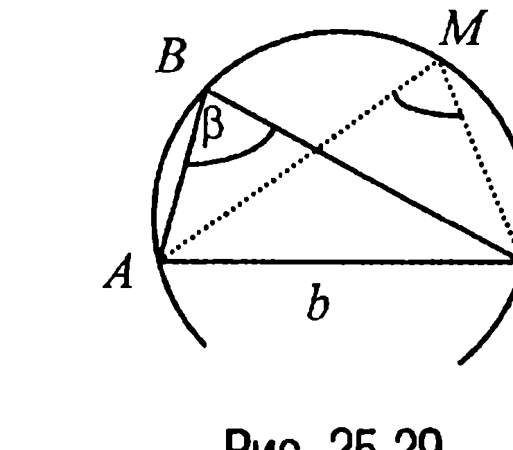

Ясно, что таким же свойством обладают и точки дуги $AB'C$, симметричной дуге $ABC$ относительно прямой $AC$.

Отмеченное свойство позволяет без затруднений построить требуемое геометрическое место точек.

---
**стр. 363**
---

**Построение.** Пусть данный нам угол $\beta$ образован лучами с вершиной в точке $O$. На одной из сторон этого угла отмечаем точку $M$ таким образом, чтобы выполнялось неравенство $OM < b$, и затем проводим дугу окружности с центром в точке $M$ и радиуса $b$ до пересечения ее с другой стороной угла в точке $K$ (рис. 25.30).

После этого строим треугольник $ABC$, равный построенному треугольнику, с данными нам основанием $AC = b$ и $\angle ABC = \beta$.

Если теперь описать около треугольника $ABC$ окружность, то дуга $ABC$ и симметричная ей относительно прямой $AC$ дуга $AB'C$ (за исключением точек $A$ и $C$) и образуют искомое геометрическое место.

Заметим, что по расширенной теореме синусов радиус окружностей, на которых лежат дуги $ABC$ и $AB'C$, — это $R = b/2\sin\beta$.

Доказательство и исследование следуют из построения.

**Ответ:** Искомое геометрическое место точек — две дуги двух окружностей радиуса $R = b/2\sin\beta$, опирающиеся на рассматриваемый отрезок $b$, за исключением точек $A$ и $C$.

**ЗАДАЧИ ДЛЯ САМОСТОЯТЕЛЬНОГО РЕШЕНИЯ**

**25.1С.** *Построить окружность, касающуюся внешним образом данной окружности и данной прямой в заданной на этой прямой точке (данные окружность и прямая не пересекаются).*

**25.2С.** *На заданной окружности с отмеченными на ней точками $M$ и $N$ построить точку $P$ таким образом, чтобы $MP - NP = a$, где $a$ — данный отрезок.*

**25.3С.** *Через данную внутри угла точку провести прямую, пересекающую стороны угла таким образом, чтобы отрезок, заключенный между ними, разделился этой точкой пополам.*

---
**стр. 364**
---

**25.4С.** *Стороны угла $ABC$ пересекаются прямой $DE$. Построить отрезок с концами на сторонах этого угла, который был бы перпендикулярен прямой $DE$ и делился ею пополам.*

**25.5С.** *Через точку $A$ пересечения окружностей $s$ и $s_1$ с центрами $O$ и $O_1$ соответственно провести секущую $BAC$ таким образом, чтобы разность хорд $BA - AC$ равнялась $2a$, где $a$ — данный отрезок.*

**25.6С.** *Построить выпуклый четырехугольник $ABCD$ по трем углам и двум противолежащим сторонам $AD$ и $BC$.*

**25.7С.** *Построить ромб по сумме диагоналей и углу между стороной и одной из диагоналей.*

**25.8С.** *Построить треугольник, гомотетичный данному, с коэффициентом гомотетии $\frac{1}{2}$ и центром гомотетии в точке пересечения биссектрис.*

**25.9С.** *Построить отрезок $x = \sqrt{a^2 - ab + b^2}$, если даны отрезки $a$ и $b$.*

**25.10С.** *Построить треугольник по основанию, противолежащему ему углу при вершине и высоте.*
