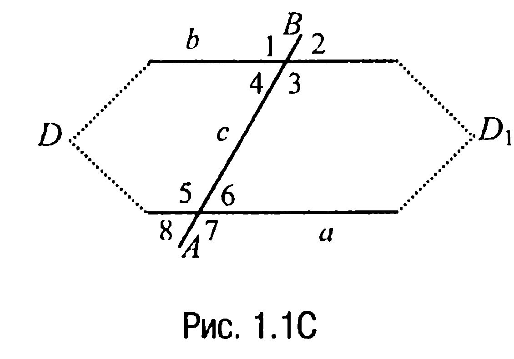
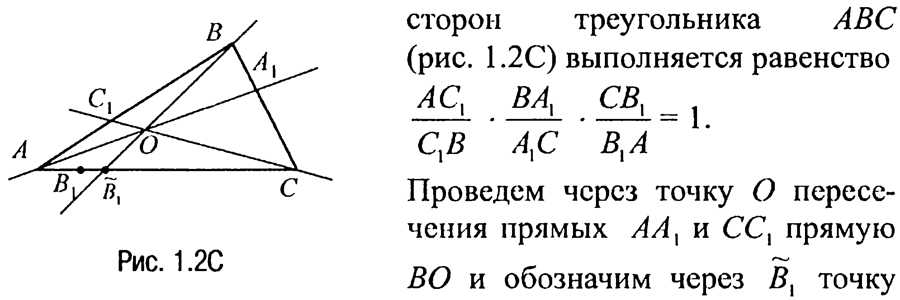
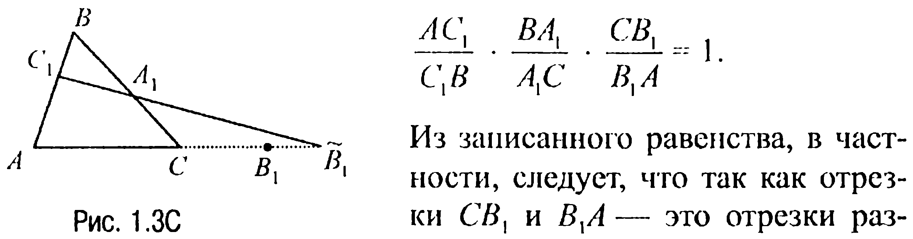

## 9.1. Углы, треугольники

---
**стр. 383**
---

# ГЛАВА 9

## РЕШЕНИЯ ЗАДАЧ ГРУППЫ С

### § 1. Углы, треугольники

**1.1С.** С учетом свойств 1.3 и 1.4Х и характеристичности последнего считаем, что равными являются внутренние накрест лежащие $\angle 3$ и $\angle 5$, $\angle 4$ и $\angle 6$ (рис. 1.1С).

Предположим теперь, что прямые $a$ и $b$, которые пересекаются прямой $c$ в точках $A$ и $B$ соответственно, не параллельны. Значит, они пересекаются в некоторой точке $D$ слева от прямой $c$ (если предположить, что прямые $a$ и $b$ пересекаются в точке справа от прямой $c$, то рассуждения аналогичны рассуждениям, приведенным ниже, поскольку $\angle 3 = \angle 5$, а $\angle 4 = \angle 6$).

Прямая $c$ разбивает плоскость на две полуплоскости (аксиома 1.2), в одной из которых лежит точка $D$. Построим треугольник, равный треугольнику $ADB$, с вершиной $D_1$ в другой полуплоскости (аксиома 1.6).

В равных треугольниках $ADB$ и $AD_1B$ соответствующие углы $BAD$ и $ABD_1$, $DBA$ и $D_1AB$ с вершинами в точках $A$ и $B$ равны, а так как они совпадают с соответствующими накрест лежащими углами при прямых $a$, $b$ и секущей $c$, то прямая $AD_1$ совпадает с прямой $a$, а прямая $BD_1$ совпадает с прямой $b$.

Но в таком случае через две точки $D$ и $D_1$ должны проходить две различные прямые, что противоречит аксиоме 1.1. Поэтому предположение о непараллельности прямых $a$ и $b$ неверно, т. е. $a$ и $b$ параллельны, что и требовалось доказать.

---
**стр. 384**
---

**1.2С (Обратная теорема Чевы).** Предположим, что для отрезков сторон треугольника $ABC$ (рис. 1.2С) выполняется равенство

$$\frac{AC_1}{C_1B} \cdot \frac{BA_1}{A_1C} \cdot \frac{CB_1}{B_1A} = 1.$$

Проведем через точку $O$ пересечения прямых $AA_1$ и $CC_1$ прямую $BO$ и обозначим через $\widetilde{B}_1$ точку пересечения этой прямой со стороной $AC$.

По свойству 1.13Х имеем $\frac{AC_1}{C_1B} \cdot \frac{BA_1}{A_1C} \cdot \frac{C\widetilde{B}_1}{\widetilde{B}_1A} = 1$ и поэтому с учетом условия задачи справедливы равенства $\frac{C\widetilde{B}_1}{\widetilde{B}_1A} = \frac{CB_1}{B_1A} = k$. Отсюда $C\widetilde{B}_1 = k \cdot \widetilde{B}_1A$, $CB_1 = k \cdot B_1A$.

Но $C\widetilde{B}_1 + \widetilde{B}_1A = AC$ и, следовательно, $(k + 1) \cdot \widetilde{B}_1A = AC$.

С другой стороны, по условию $CB_1 + B_1A = AC$, откуда, с учетом равенства $CB_1 = k \cdot B_1A$, приходим к выводу, что $(k + 1) \cdot B_1A = AC$.

Таким образом, $\widetilde{B}_1A = B_1A$ и так как точки $\widetilde{B}_1$ и $B_1$ лежат на отрезке $AC$, то они совпадают и, значит, прямая $BB_1$ проходит через точку $O$, что и требовалось доказать.

**1.3С.** Так как углы с параллельными сторонами или равны, или в сумме составляют $180^\circ$ (свойство 1.6), то если предположить, что каждая пара соответственных углов обоих треугольников в сумме составляет $180^\circ$, то сумма шести углов таких треугольников окажется равной $540^\circ$, чего быть не может (свойство 1.8).

Если предположить, что треугольники имеют только по одному равному углу, а каждая пара остальных соответственных углов треугольников в сумме составляет $180^\circ$, то сумма шести углов обоих трсугольников окажется больше $360^\circ$, чего снова быть не может. <!-- вероятная опечатка оригинала: трсугольников -->

Таким образом, остается допустить, что два угла одного треугольника равны двум углам другого треугольника. Но в таком случае треугольники уже подобны, что и требовалось доказать.

---
**стр. 385**
---

**1.4С (Обратная теорема Менелая).** Обратимся к рис. 1.3С, где точки $A_1$, $B_1$, $C_1$ таковы, что

$$\frac{AC_1}{C_1B} \cdot \frac{BA_1}{A_1C} \cdot \frac{CB_1}{B_1A} = 1.$$

Из записанного равенства, в частности, следует, что так как отрезки $CB_1$ и $B_1A$ — это отрезки разной длины и, значит, $CB_1 / B_1A \neq 1$,

то и $\frac{AC_1}{C_1B} \neq \frac{A_1C}{BA_1}$ или $\frac{AC_1}{A_1C} \neq \frac{C_1B}{BA_1}$, откуда приходим к выводу, что прямая $C_1A_1$ пересекает продолжение стороны $AC$ в некоторой точке $\widetilde{B}_1$. Но в таком случае по теореме Менелая

$$\frac{AC_1}{C_1B} \cdot \frac{BA_1}{A_1C} \cdot \frac{C\widetilde{B}_1}{\widetilde{B}_1A} = 1$$

и, таким образом, с учетом условия задачи получаем, что

$$\frac{C\widetilde{B}_1}{\widetilde{B}_1A} = \frac{C_1B}{AC_1} \cdot \frac{A_1C}{BA_1} = \frac{CB_1}{B_1A} = k.$$

Из этого равенства вытекает, что точки $B_1$ и $\widetilde{B}_1$ лежат на продолжении отрезка $AC$ за одну и ту же точку и что $C\widetilde{B}_1 = k \cdot \widetilde{B}_1A$, $CB_1 = k \cdot B_1A$. Но $C\widetilde{B}_1 = \widetilde{B}_1A - AC$ и, значит, $AC = (k + 1) \cdot \widetilde{B}_1A$.

С другой стороны, по условию $CB_1 = B_1A - AC$ и, следовательно, $AC = (k + 1) \cdot B_1A$. Отсюда вывод: $\widetilde{B}_1A = B_1A$, и так как точки $B_1$ и $\widetilde{B}_1$ лежат на продолжении отрезка $AC$ за одну и ту же точку, то они совпадают, а это и доказывает требуемое.

**1.5С.** Обозначим катеты прямоугольного треугольника через $a$ и $b$ ($a > b$). Тогда если $r$ — это радиус вписанной в данный треугольник окружности, то по условию $2r = a - b$. В соответствии же с замечанием 1.2 имеет место такое равенство: $2r = a + b - c$, где гипотенуза треугольника $c = \sqrt{a^2 + b^2}$, или равенство $2r = a + b - \sqrt{a^2 + b^2}$.

Но в таком случае $a - b = a + b - \sqrt{a^2 + b^2}$ или $2b = \sqrt{a^2 + b^2}$, или

Проверяю именование ассетов по конвенции проекта:
