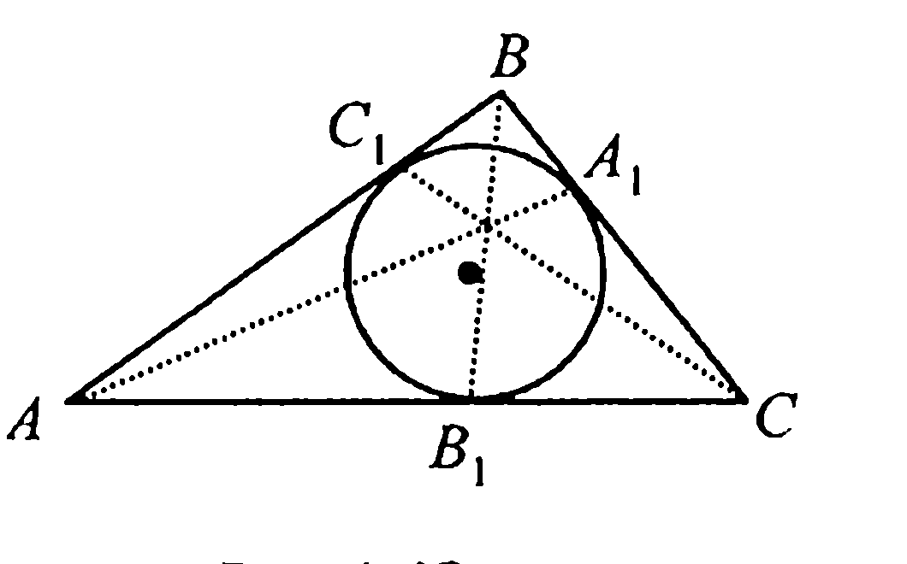
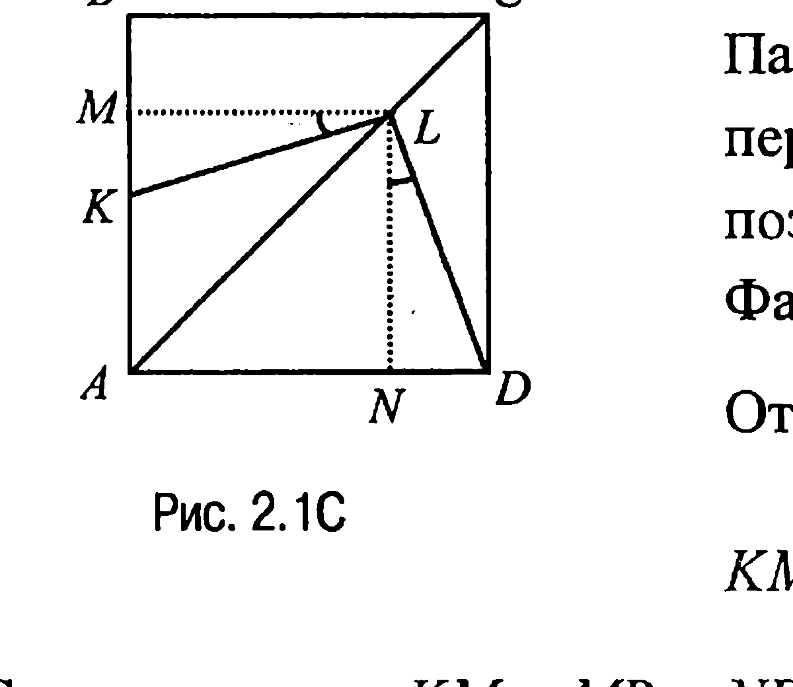
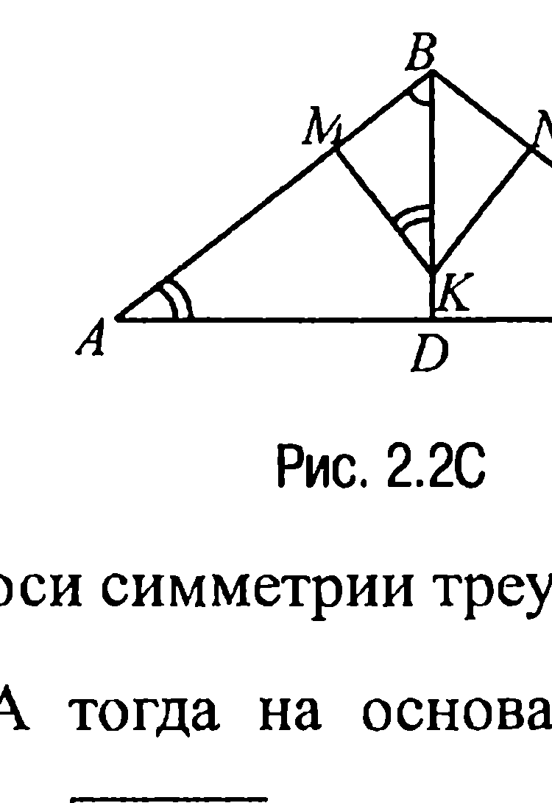
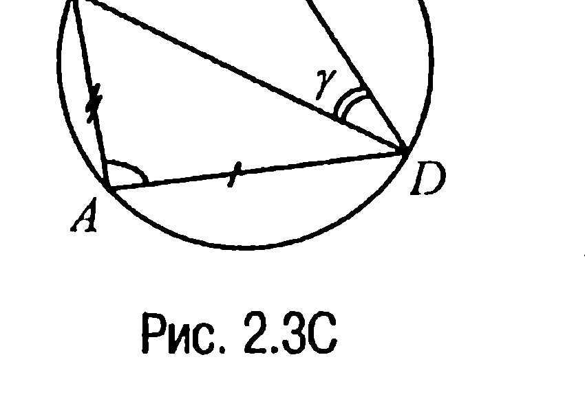
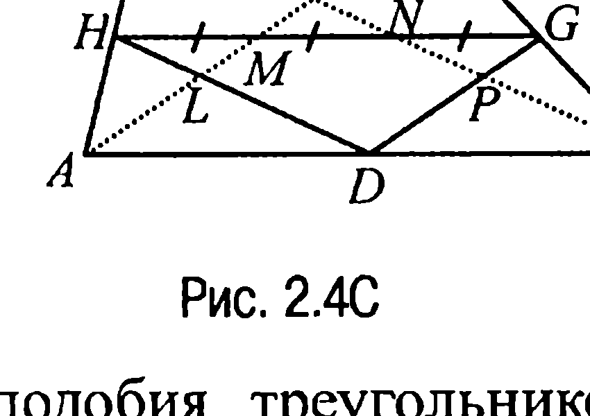
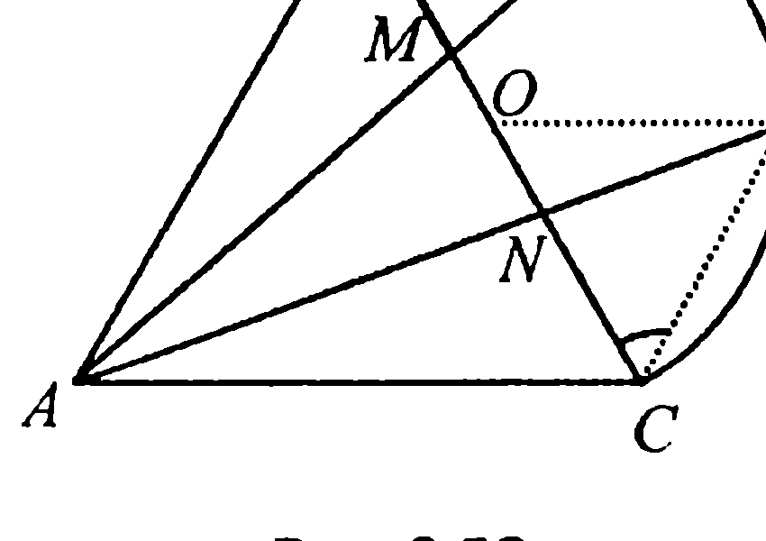
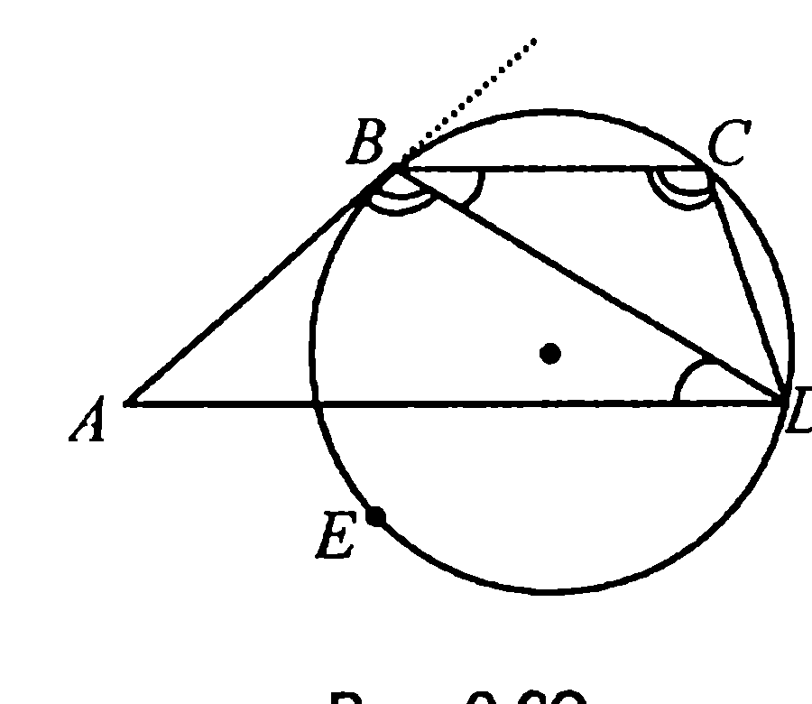
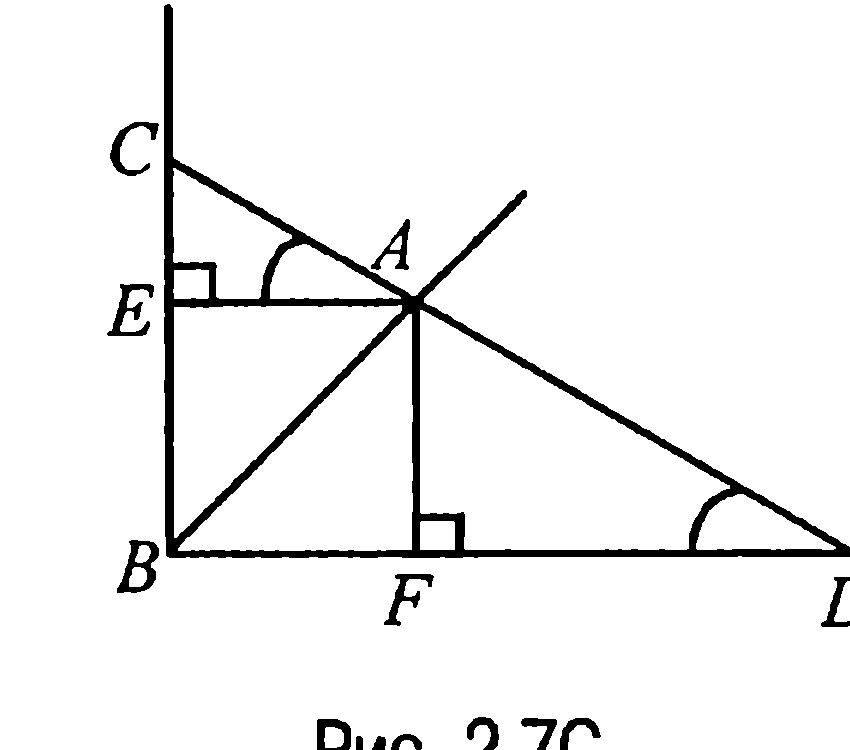

## 9.2. Равенство и подобие треугольников

---
**стр. 386**
---

$\frac{a^2}{b^2} = 3$. Таким образом, $\frac{a}{b} = \sqrt{3}$.

**Ответ:** $\sqrt{3}$.

▼ **1.6С.** Рассмотрим рис. 1.4С. На этом рисунке $AB_1 = AC_1$, $BC_1 = BA_1$, а $CA_1 = CB_1$, что следует, например, из свойства 5.2.

Поэтому

$$\frac{AB_1}{B_1C} \cdot \frac{CA_1}{A_1B} \cdot \frac{BC_1}{C_1A} = 1$$

и тогда ссылка на обратную теорему Чевы и доказывает требуемое.

**§ 2. Равенство и подобие треугольников**

**2.1С.** Опустим из точки $L$ перпендикуляры $LM$ и $LN$ на стороны $AB$ и $AD$ соответственно (рис. 2.1С). Параллельные прямые $BC$ и $ML$ пересекают стороны угла $BAC$, поэтому по обобщенной теореме Фалеса $MB : AM = LC : AL = 1 : 3$.

Отсюда $MB = \frac{1}{3} AM = \frac{1}{4} AB$ и, значит,

$KM = AM - AK = \frac{3}{4} AB - \frac{1}{2} AB = \frac{1}{4} AB$.

Следовательно, $KM = MB = ND$. А так как $LM = LN$ (четырехугольник $AMLN$ — квадрат), то прямоугольные треугольники $KML$ и $DNL$ равны (по двум катетам) и, таким образом, $\angle MLK = \angle NLD$.

А тогда $\angle KLD = \angle KLN + \angle NLD = \angle KLN + \angle MLK = \angle MLN = 90^\circ$, что и требовалось доказать.

---
**стр. 387**
---

§ 2. Задачи группы C

**2.2C.** Пусть в равнобедренном треугольнике $ABC$ основание $AC = 8$, а боковые стороны $AB = BC = 5$ (рис. 2.2C). Очевидно, что точка $K$, из которой проведены перпендикуляры $KD$, $KM$ и $KN$ к сторонам $AC$, $AB$ и $BC$ треугольника $ABC$ соответственно, лежит на оси симметрии треугольника $ABC$, проходящей через вершину $B$.

А тогда на основании теоремы Пифагора $BD = \sqrt{BC^2 - DC^2} = \sqrt{25 - 16} = 3$ и, значит, $S_{\triangle ABC} = \frac{1}{2} AC \cdot BD = \frac{1}{2} \cdot 8 \cdot 3 = 12$.

Но в таком случае $S_{\triangle KMB} = S_{\triangle KNB} = \frac{1}{2} S_{KMBN} = \frac{1}{2} \cdot \frac{1}{3} S_{\triangle ABC} = \frac{1}{6} \cdot 12 = 2$ (прямоугольные треугольники $KMB$ и $KNB$ равны, поскольку у них общая гипотенуза и равные катеты $KM$ и $KN$).

Пусть $BM = x$, $KM = y$. При таких обозначениях $2S_{\triangle KMB} = x \cdot y = 4$. С другой стороны, из подобия прямоугольных треугольников $KMB$ и $BDA$ (у них общий острый угол) следует, что

$$\frac{x}{BD} = \frac{y}{AD} \quad \text{или} \quad \frac{x}{y} = \frac{BD}{AD} = \frac{3}{4}$$

и мы приходим к системе $\begin{cases} x \cdot y = 4, \\ \frac{x}{y} = \frac{3}{4}, \end{cases}$ решая которую, находим, что

$$x = \sqrt{3}, \quad y = \frac{4\sqrt{3}}{3}.$$

Полученные значения $x$ и $y$ позволяют найти $BK$:

$$BK = \sqrt{x^2 + y^2} = \frac{5\sqrt{3}}{3}.$$

А тогда $KD = BD - BK = 3 - \frac{5\sqrt{3}}{3} = \frac{9 - 5\sqrt{3}}{3}$.

**Ответ:** $\frac{4\sqrt{3}}{3}$; $\frac{4\sqrt{3}}{3}$; $\frac{9 - 5\sqrt{3}}{3}$.

---
**стр. 388**
---

Глава 9. Решения задач группы С

**2.3C.** На продолжении стороны $DC$ за точку $C$ вписанного в окружность четырехугольника $ABCD$ отложим отрезок $CE = AD$ (рис. 2.3C). Тогда треугольники $DAB$ и $ECB$ равны по двум сторонам и углу между ними ($\angle ECB = 180^\circ - \angle BCD = \angle DAB$).

Но в таком случае четырехугольник $ABCD$ и равнобедренный треугольник $DBE$ ($BE = BD$) равновелики и, значит, задача свелась к вычислению площади $S$ треугольника $DBE$.

Пусть $BF$ — высота этого треугольника. Тогда, учитывая, что $DF = FE$, имеем

$$S = \frac{1}{2} DE \cdot BF = a \cdot \cos\gamma \cdot a \cdot \sin\gamma = \frac{1}{2} a^2 \cdot \sin 2\gamma.$$

**Ответ:** $\frac{1}{2} a^2 \cdot \sin 2\gamma$.

**2.4C.** Пусть $K$ — точка пересечения медиан, $L$ и $M$ — точки пересечения медианы $AE$ с отрезками $HD$ и $HG$ соответственно, а $P$ и $N$ — точки пересечения медианы $CF$ с отрезками $DG$ и $HG$ (рис. 2.4C).

Теперь так как треугольники $AHL$ и $AFK$ подобны, то $HL : FK = AL : AK$. Из подобия же треугольников $ALD$ и $AKC$ следует, что $LD : KC = AL : AK$ и, таким образом, $HL : LD = FK : KC = 1 : 2$.

Из последней цепочки равенств и подобия треугольников $HML$ и $HGD$ находим, что $HL : HD = HM : HG = FK : FC = 1 : 3$, откуда $HM = \frac{1}{3} HG$.

Если рассмотреть теперь подобные треугольники $PGC$ и $KEC$, $DPC$ и $AKC$, $NGP$ и $HGD$, то аналогичным образом можно показать, что $NG = \frac{1}{3} HG$, а это и доказывает требуемое.

---
**стр. 389**
---

§ 2. Задачи группы C

**2.5C.** Пусть $M$ и $N$ — точки пересечения прямых $AD$ и $AE$ со стороной $BC$ ($BM < BN$), а $O$ — середина $BC$ (рис. 2.5C). Поскольку точки $D$ и $E$ делят полуокружность на равные дуги, то треугольник $OEC$ — равносторонний и, значит, $CE \parallel AB$ ($\angle ABC = \angle ECB$). Но тогда на основании цепочки равенств $EC = OC = \frac{1}{2} BC = \frac{1}{2} AB$ из подобия треугольников $ABN$ и $ECN$ (задача 2.1) следует, что $\frac{BN}{NC} = \frac{AB}{EC} = 2$. Следовательно, $BC = BN + NC = 3NC$. Аналогично доказывается, что $BC = 3BM$. Но в таком случае $BM = NC$, что с учётом равенства $BN = 2NC$ и доказывает требуемое.

**2.6C.** Рассмотрим рис. 2.6C. Поскольку $\angle BDA = \angle DBC$, а $\angle ABD = \angle BCD = \frac{1}{2} \cup BED$, то треугольники $ABD$ и $BCD$ подобны. Следовательно, $\frac{BD}{AD} = \frac{BC}{BD}$, откуда находим, что $BD = \sqrt{AD \cdot BC} = \sqrt{a \cdot b}$.

**Ответ:** $BD = \sqrt{a \cdot b}$.

**2.7C.** Рассмотрим рис. 2.7C, где $AE \perp BC$, $AF \perp BD$. Из подобия прямоугольных треугольников $AEC$ и $DFA$ ($\angle CAE = \angle ADF$) следует, что $\frac{CE}{EA} = \frac{AF}{FD}$. А тогда, замечая, что четырёхугольник $BEAF$ — квадрат и полагая, что $EA = AF = c$, предыдущую пропорцию можно переписать в виде

