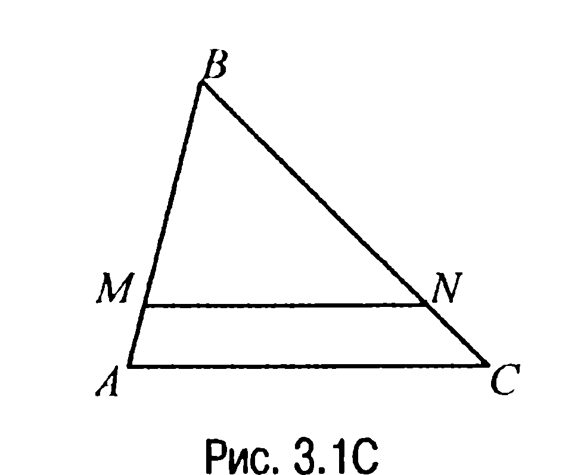
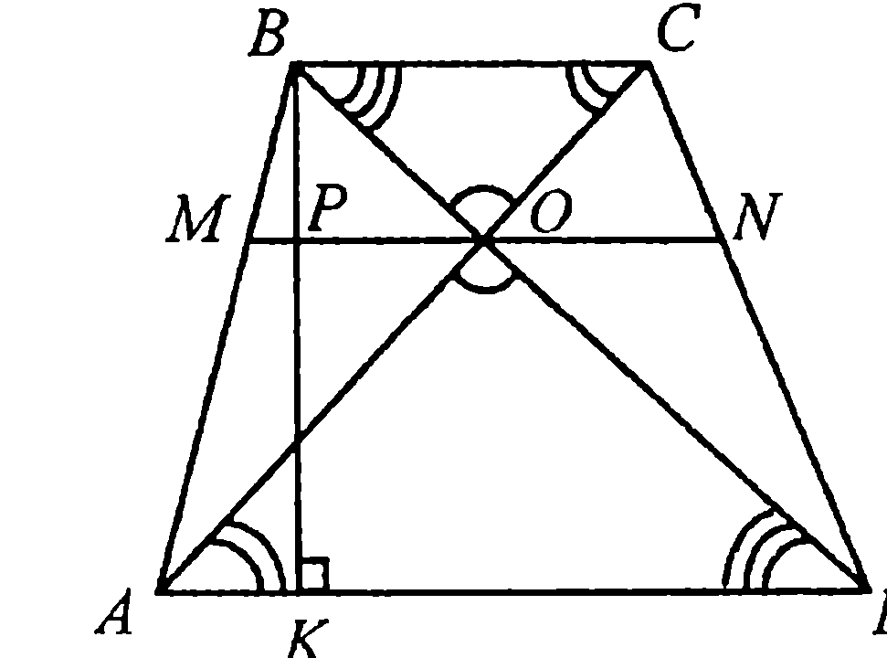
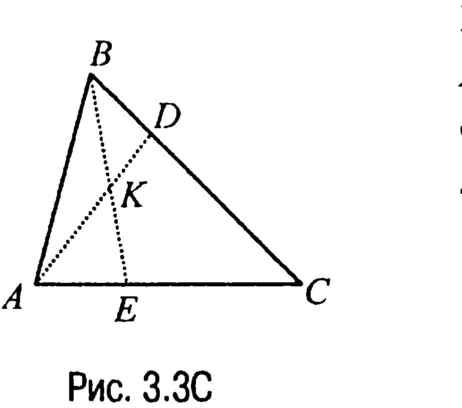

## 9.3. Пропорциональные отрезки

---
**стр. 390**
---

$\frac{a-c}{c} = \frac{c}{b-c}$, откуда находим, что $a \cdot b = (a + b) \cdot c$ или $\frac{1}{a} + \frac{1}{b} = \frac{1}{c}$.

А это и доказывает требуемое.

**§ 3. Пропорциональные отрезки**

**3.1С.** Рассмотрим треугольник $ABC$ (рис. 3.1С), в котором $M$ и $N$ — точки пересечения прямой, параллельной основанию треугольника $AC$, со сторонами $AB$ и $BC$ соответственно.

Обозначим площади треугольника $MBN$ и трапеции $AMNC$ через $S_{\triangle MBN}$ и $S_{AMNC}$ и будем считать (в соответствии с условием), что $S_{\triangle MBN} : S_{AMNC} = 2 : 1$. Тогда $S_{\triangle MBN} : S_{\triangle ABC} = 2 : 3$ и, значит, $BM : BA = \sqrt{2} : \sqrt{3}$. Но в таком случае $\frac{BM}{MA} = \frac{BM}{BA - BM} = \frac{\sqrt{2}}{\sqrt{3} - \sqrt{2}} = \frac{\sqrt{6} + 2}{1}$ и по обобщенной теореме Фалеса находим, что $\frac{BN}{NC} = \frac{BM}{MA} = \frac{\sqrt{6} + 2}{1}$.

**Ответ:** $\sqrt{6} + 2 \left( \frac{1}{\sqrt{6} + 2} \right).$

**3.2С.** Пусть в трапеции $ABCD$ (рис. 3.2С) основание $AD = 2BC$, $O$ — точка пересечения диагоналей трапеции, через которую проходит прямая $MN \parallel AD$, $BK$ — высота трапеции, $P$ — точка пересечения $MN$ с $BK$.

Тогда так как треугольники $COB$ и $AOD$ подобны (по первому признаку подобия треугольников), то $\frac{BO}{OD} =$

---
**стр. 391**
---

$\frac{BC}{AD} = \frac{1}{2}$ и, значит, по обобщенной теореме Фалеса $\frac{BP}{PK} = \frac{BO}{OD} = \frac{1}{2}$. Но в таком случае $\frac{BP}{BK} = \frac{1}{3}$, а $\frac{PK}{BK} = \frac{2}{3}$.

**Ответ:** $\frac{1}{3}; \frac{2}{3}$.

**3.3С.** Пусть $K$ — точка пересечения отрезков $AD$ и $BE$ (рис. 3.3С). Тогда так как $3AE = AC$, то $AE : EC = 1 : 2$ и, значит, в соответствии со свойством 3.4Х имеем $p = 1$, $q = 2$, $m = 2$, $n = 5$. Но в таком случае

$$\frac{BK}{KE} = \frac{m}{n}\left(1 + \frac{q}{p}\right) = \frac{2}{5}\left(1 + \frac{2}{1}\right) = \frac{6}{5},$$

а

$$\frac{AK}{KD} = \frac{p}{q}\left(1 + \frac{n}{m}\right) = \frac{1}{2}\left(1 + \frac{5}{2}\right) = \frac{7}{4}.$$

**Ответ:** $6 : 5; 7 : 4$.

**3.4С.** По свойству 3.5 (рис. 3.3С)

$$\frac{AK}{KD} = \lambda = \frac{3}{2}, \quad \frac{BK}{KE} = \mu = \frac{4}{5},$$

где $\lambda \cdot \mu = \frac{6}{5} > 1$.

А тогда

$$\frac{AE}{EC} = \frac{\lambda\mu - 1}{1 + \mu} = \frac{\frac{6}{5} - 1}{1 + \frac{4}{5}} = \frac{1}{9}, \quad \frac{BD}{DC} = \frac{\lambda\mu - 1}{1 + \lambda} = \frac{\frac{6}{5} - 1}{1 + \frac{3}{2}} = \frac{2}{25}.$$

**Ответ:** $1 : 9; 2 : 25$.

**3.5С.** Пусть $a_c$ и $b_c$ — проекции на гипотенузу $c$ катетов прямоугольного треугольника $a$ и $b$ соответственно, $r$ — радиус вписанной в треугольник окружности.

Очевидно, что $c = a_c + b_c = 25$. А так как по свойству 3.9 $a = \sqrt{c \cdot a_c} = \sqrt{25 \cdot 9} = 15$, $b = \sqrt{c \cdot b_c} = \sqrt{25 \cdot 16} = 20$, то в соответствии с замечанием 1.2 имеем $r = \frac{1}{2}(a + b - c) = \frac{1}{2}(15 + 20 - 25) = 5$.

**Ответ:** $5$.

**3.6С.** Если мы докажем, что для треугольника со сторонами $h$,
