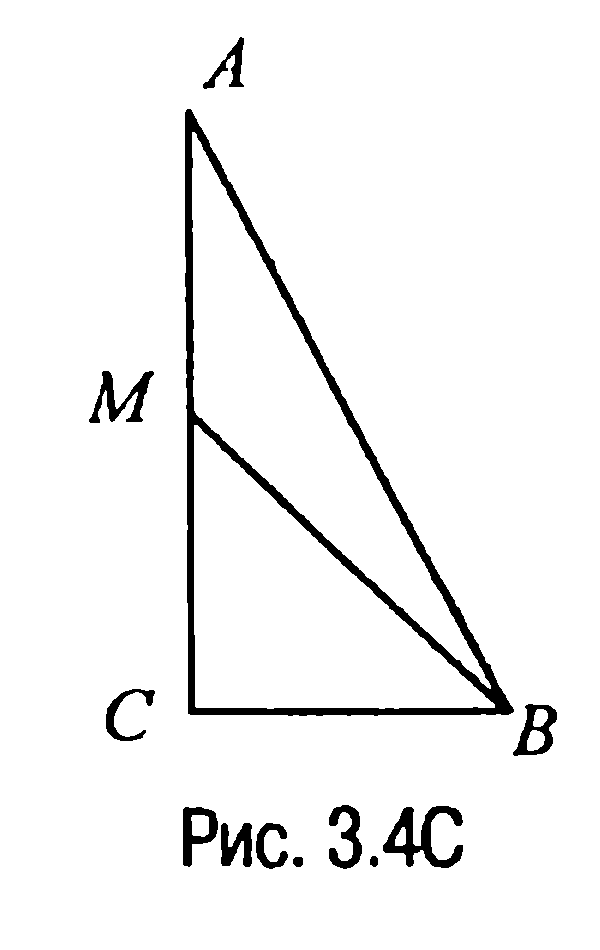
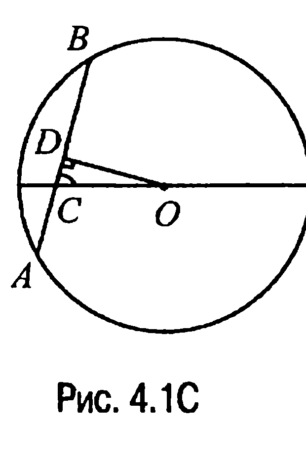
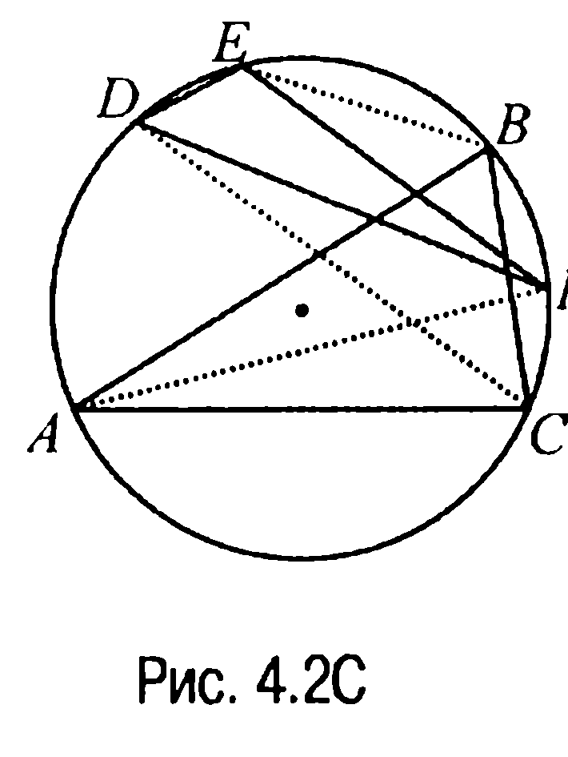
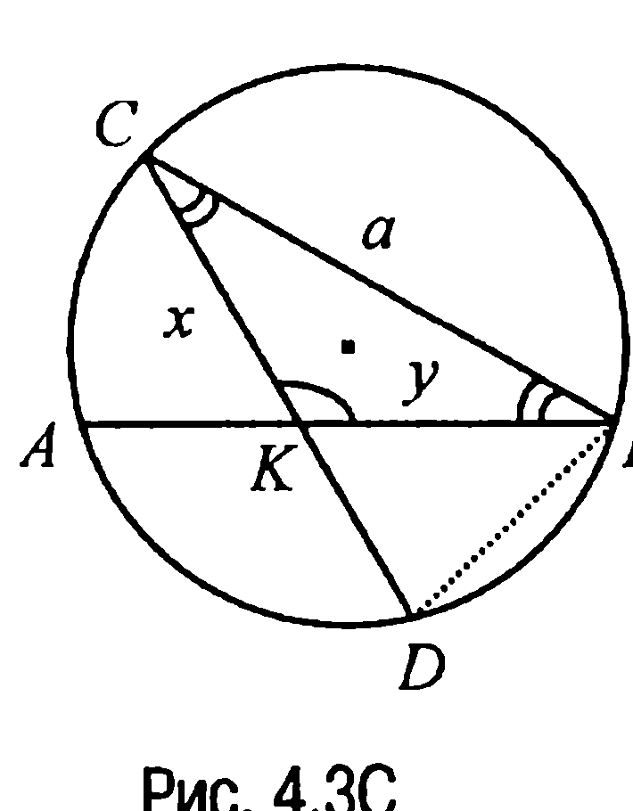
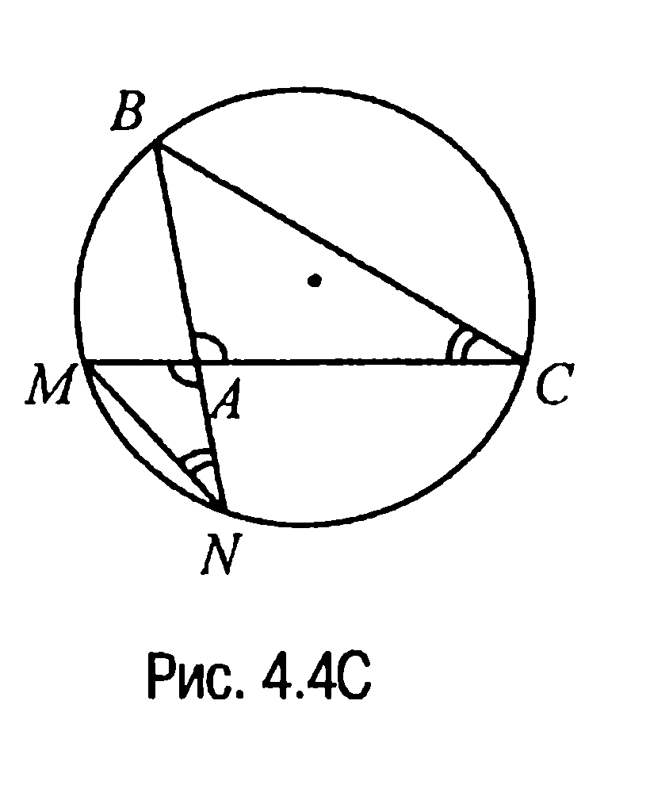
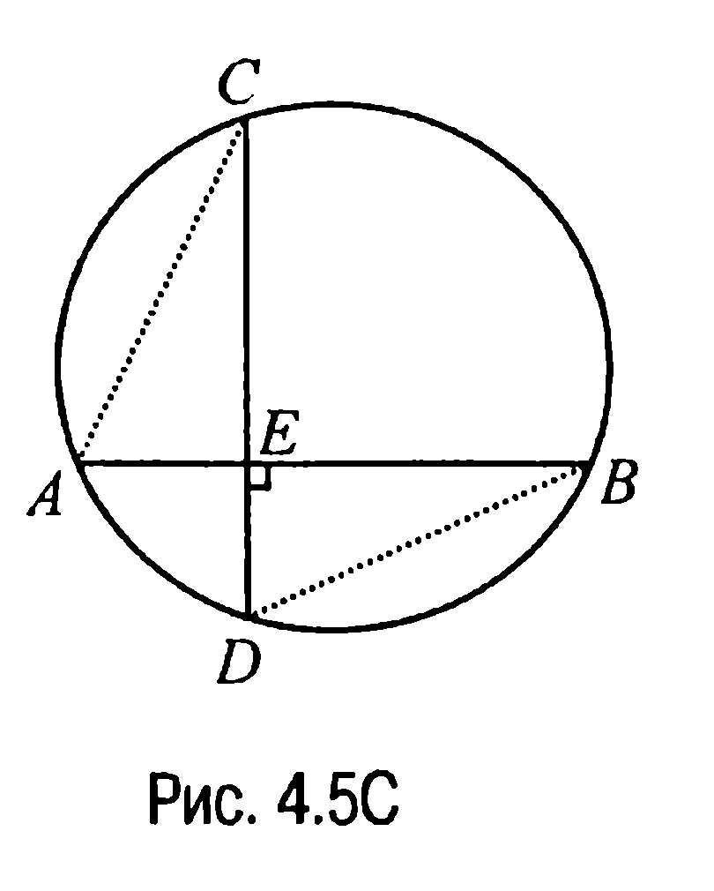
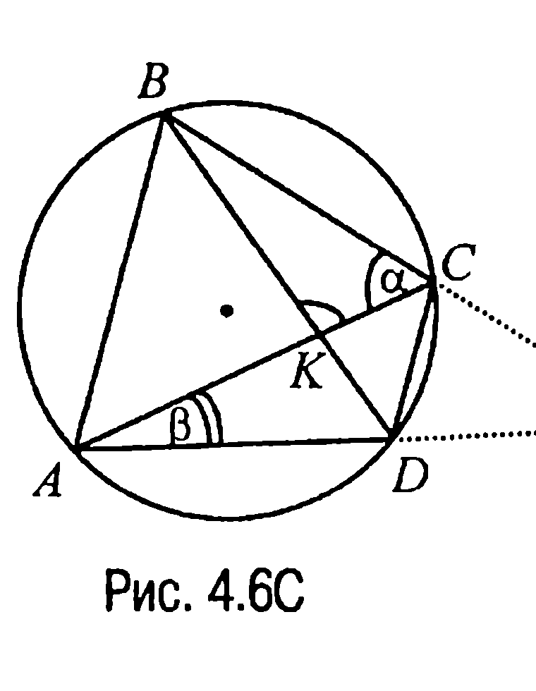

## 9.4. Окружность, круг, дуга, хорда, диаметр. Углы

---
**стр. 392**
---

$c + h$, $a + b$ справедливо равенство $(a + b)^2 + h^2 = (c + h)^2$, то в силу характеристичности свойства 3.11X (обратная теорема Пифагора) это равенство и будет означать, что треугольник является прямоугольным.

Но записанное выше равенство действительно справедливо, поскольку оно равносильно равенству $ab = ch$, всегда имеющему место в прямоугольном треугольнике (свойство 3.10X), каковым и является данный треугольник.

**3.7С.** Пусть $ABC$ — прямоугольный треугольник с прямым углом $BCA$ и медианой $BM$ (рис. 3.4С). Тогда так как $AC = 6$ и, значит, $MC = 3$, то из прямоугольного треугольника $BCM$ по теореме Пифагора находим, что $BC = \sqrt{MB^2 - MC^2} = \sqrt{25 - 9} = 4$.

Но в таком случае из треугольника $BCA$ снова по теореме Пифагора имеем

$$AB = \sqrt{AC^2 + BC^2} = \sqrt{36 + 16} = 2\sqrt{13}.$$

**Ответ:** $2\sqrt{13}$.

**§ 4. Окружность, круг, дуга, хорда, диаметр. Углы**

**4.1С.** Проведем $OD \perp AB$ (рис. 4.1С). Тогда поскольку отрезок $OD$ является частью диаметра, то по свойству 4.1X имеем $AD = DB = \frac{1}{2}AB = 7$ и, значит, $CD = AD - AC = 3$.

Но в таком случае из прямоугольного треугольника $CDO$ получим, что

$$OC = \frac{CD}{\cos 60^\circ} = \frac{3}{1/2} = 6.$$

**Ответ:** $OC = 6$.

---
**стр. 393**
---

4.2С. Прежде всего отметим (рис. 4.2С), что $\angle BCA = 76^\circ$. Далее,

так как равные хорды окружности стягивают равные дуги, то $\cup FA = \cup AB = 152^\circ$, $\cup EB = \cup BC = 64^\circ$, $\cup DC = \cup CA = 144^\circ$. С учетом этого $\cup DE = \cup DC - \cup EC = = \cup DC - 2\cup BC = 144^\circ - 128^\circ = 16^\circ$ и, таким образом, $\angle EFD = \frac{1}{2}\cup DE = 8^\circ$.

Аналогично, $\cup EF = \cup EB + \cup BF = \cup BC + \cup BC - \cup FC = 2\cup BC - \cup FC = 2\cup BC - (\cup FA - \cup CA) = 2\cup BC - \cup AB + \cup CA = 128^\circ - 152^\circ + 144^\circ = 120^\circ$ и, значит, $\angle FDE = \frac{1}{2}\cup EF = 60^\circ$. А тогда $\angle DEF = 180^\circ - 8^\circ - 60^\circ = 112^\circ$.

**Ответ:** $8^\circ$; $60^\circ$; $112^\circ$.

4.3С. Пусть $CK = x$, $KB = y$ (рис. 4.3С). Тогда в принятых обозначениях $AK = a - y$, $KD = a - x$. По свойству же пересекающихся хорд $CK \cdot KD = AK \cdot KB$ или $x(a - x) = (a - y)y$, или $(x - y)(a - x - y) = 0$, откуда следует, что $x = y$ ($a < x + y$!). Таким образом, треугольник $BKC$ является равнобедренным и, значит, $\angle KCB =$

$= \angle CBK = 30^\circ$. Но в таком случае из рассмотрения треугольника $DCB$ находим, что радиус описанной около этого треугольника окружности

$$R = \frac{DB}{2\sin \angle DCB} = \frac{DB}{2\sin 30^\circ} = DB.$$

По теореме же косинусов из треугольника $DCB$ имеем $DB =$

$= \sqrt{a^2 + a^2 - 2a^2 \cos 30^\circ} = a \cdot \sqrt{2 - \sqrt{3}}$.

**Ответ:** $a \cdot \sqrt{2 - \sqrt{3}}$.

---
**стр. 394**
---

4.4С. Так как $\Delta ABC \sim \Delta AMN$ ($\angle CAB = \angle MAN$, $\angle BCA = \angle ANM$) (рис. 4.4С), то $\frac{MN}{BC} = \frac{MA}{BA}$ или $\frac{MN}{4} = \frac{1}{2}$, откуда находим, что $MN = 2$.

С другой стороны, $\frac{AN}{AC} = \frac{MA}{BA}$ или $\frac{AN}{3} = \frac{1}{2}$ и, значит, $AN = \frac{3}{2}$.

**Ответ:** $MN = 2$, $AN = \frac{3}{2}$.

4.5С. Пусть хорды $AB$ и $CD$ взаимно перпендикулярны, $E$ — точка их пересечения такая, что $\frac{CE}{ED} = \frac{3}{2}$, $\frac{AE}{EB} = \frac{3}{8}$ (рис. 4.5С). Поэтому $CE = 3\lambda$, $ED = 2\lambda$, $AE = 3\omega$, $EB = 8\omega$, где $\lambda$ и $\omega$ — некоторые действительные числа. Тогда по свойству пересекающихся хорд (свойство 4.5X) имеем $CE \cdot ED = AE \cdot EB$ или $3\lambda \cdot 2\lambda = 3\omega \cdot 8\omega$, откуда $\lambda = 2\omega$. Далее, так как $AC^2 + DB^2 = 4R^2$ (задача 4.4) или $(AE^2 + CE^2) + (ED^2 + EB^2) = 9\omega^2 + 9\lambda^2 + 4\lambda^2 + 64\omega^2 = 13\lambda^2 + 73\omega^2 = 13 \cdot 4\omega^2 + 73\omega^2 = 125\omega^2 = 4 \cdot \frac{125}{4}$, то $\omega = 1$. Таким образом, $AB = 11\omega = 11$, а $CD = 5\lambda = 10$.

**Ответ:** 10 и 11.

4.6С. Обозначим через $E$ точку пересечения прямых $AD$ и $BC$ (рис. 4.6С). Тогда поскольку $\alpha = \frac{1}{2}\cup AB$, $\beta = \frac{1}{2}\cup CD$, то $\angle BKA = \frac{1}{2}(\cup AB + \cup CD) = \alpha + \beta$ и, значит, $\angle CKB = \pi - \alpha - \beta$.

Далее, так как угол между прямыми $AD$ и $BC$ — это угол $BEA$, то
