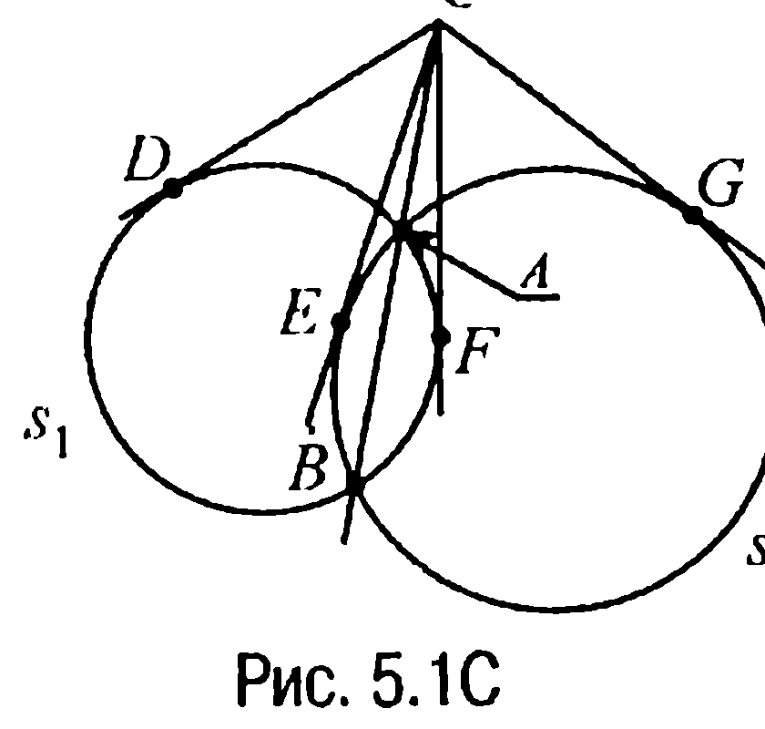
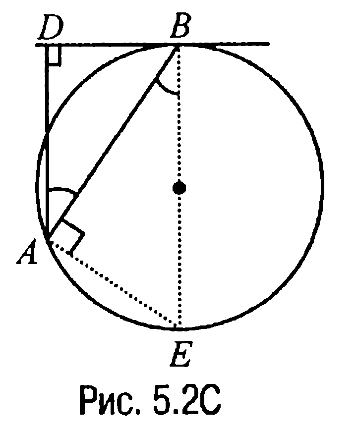
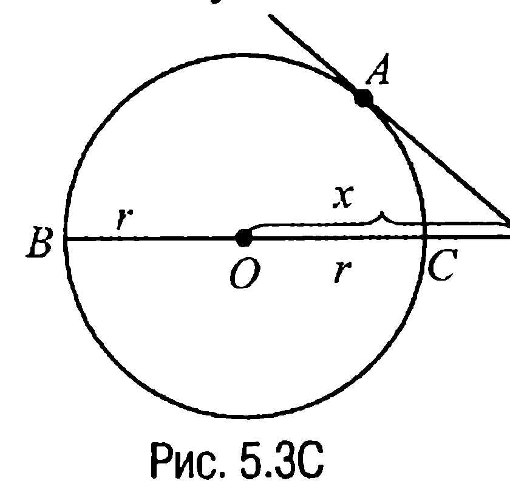
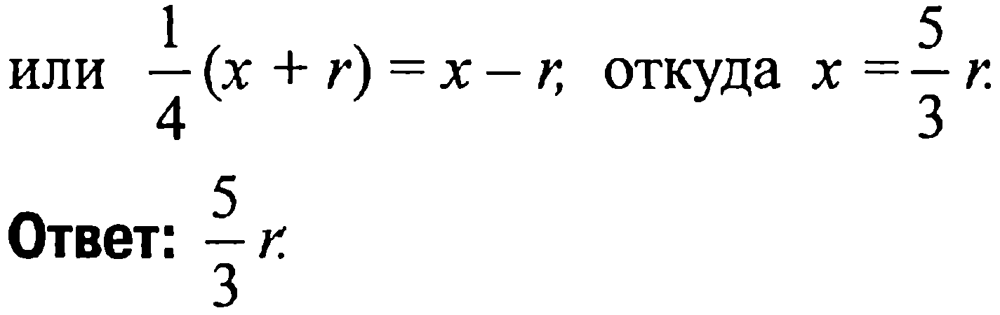
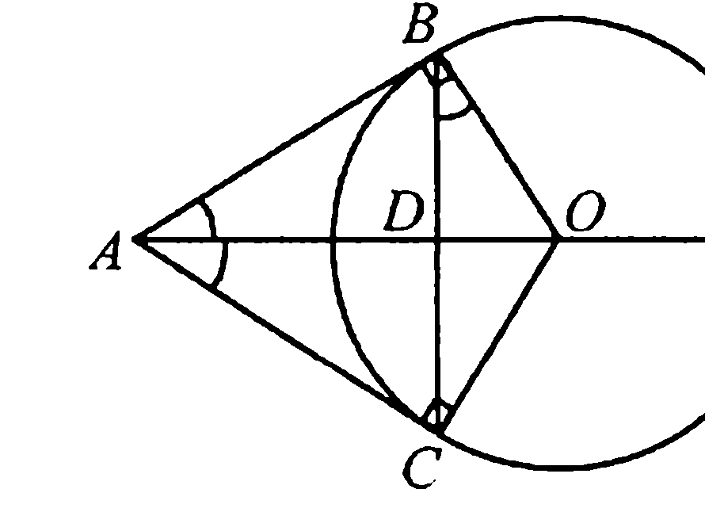
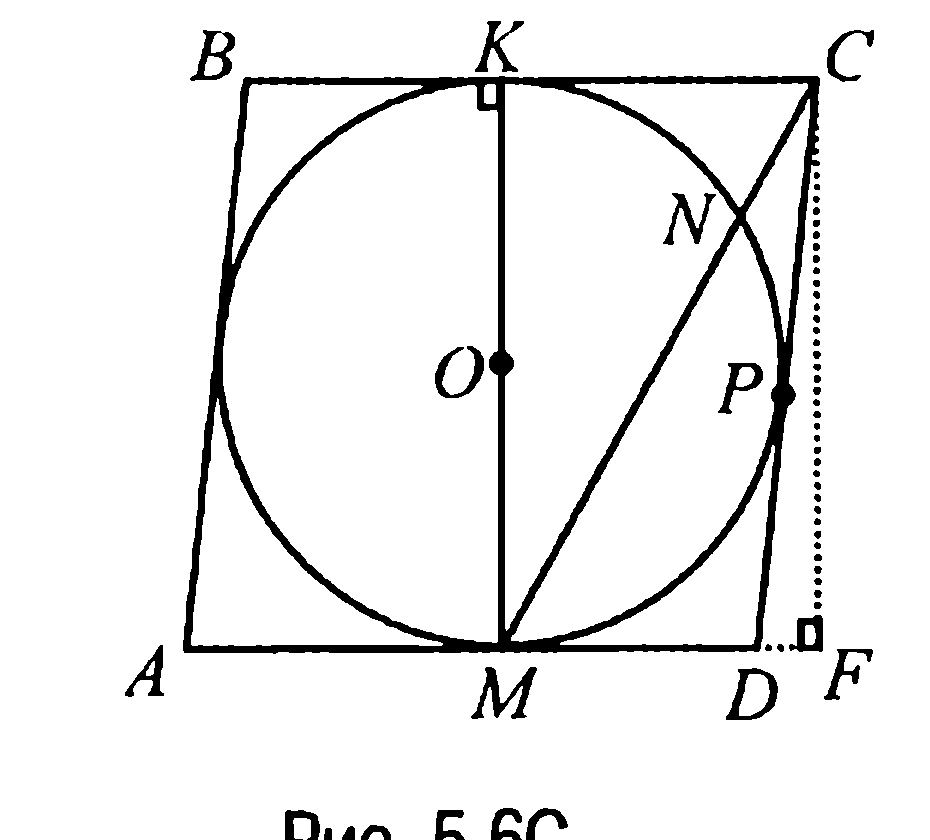
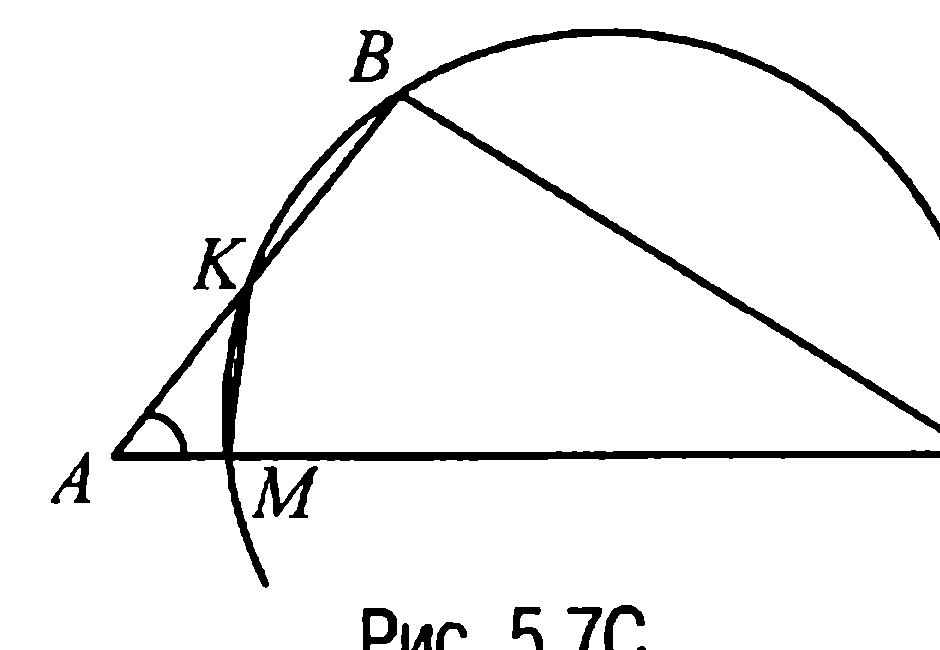

## 9.5. Окружность. Касательная, касательные и хорды, касательные и секущие

---
**стр. 395**
---

имеем $\angle BEA = \frac{1}{2}(\cup AB - \cup CD) = \alpha - \beta$.

**Ответ:** $\angle CKB = \pi - \alpha - \beta$; $\alpha - \beta$.

**§ 5. Окружность. Касательная, касательные и хорды, касательные и секущие**

▼ 5.1С. Пусть касательные касаются окружностей $s_1$ и $s_2$ в точках $D$, $F$ и $E$, $G$ соответственно (рис. 5.1С). Тогда по свойству 5.2 $CD = CF$, $CE = CG$, а по свойству касательной и секущей

$CD = CF = \sqrt{CB \cdot CA} = CE = CG$,

что и доказывает требуемое.

5.2С. Пусть $BE$ — диаметр окружности (рис. 5.2С). Тогда $\triangle BDA \sim \triangle EAB$ ($\angle BDA = \angle EAB = 90^\circ$, $\angle DAB = \angle ABE$) и, значит,

$\frac{AB}{BE} = \frac{AD}{AB}$ или $\frac{AB^2}{AD} = 2R$,

что и доказывает требуемое.

5.3С. Пусть $MO = x$ (рис. 5.3С). Тогда $MB = x + r$, $MC = x - r$ и по условию $MA = \frac{MB}{2} = \frac{x + r}{2}$. По свойству же касательной и секущей

$\frac{1}{4}(x + r)^2 = (x + r)(x - r)$

---
**стр. 396**
---

или $\frac{1}{4}(x + r) = x - r$, откуда $x = \frac{5}{3}r$.

**Ответ:** $\frac{5}{3}r$.

**5.4C.** Пусть $O$ — центр окружности радиуса $R$, а $D$ — вторая точка пересечения стороны $AC$ треугольника с окружностью (рис. 5.4C).

По свойству касательной и секущей $BC^2 = AC \cdot DC$, поэтому $36 = 9 \cdot DC$ или $DC = 4$. Но тогда $AD = AC - DC = 9 - 4 = 5$ и, значит, $R = 2,5$.

Теперь так как площадь $S$ треугольника $ABC$ можно найти по формуле

$$S = \frac{1}{2} AC \cdot BC \cdot \sin \angle BCA,$$

то остается найти $\sin \angle BCA$. Но синус указанного угла легко находится, поскольку $OB \perp BC$ (свойство 5.1X). Именно из прямоугольного треугольника $OBC$ следует, что

$$\sin \angle BCA = \frac{OB}{OC} = \frac{R}{R + DC} = \frac{5}{13}.$$

Но в таком случае

$$S = \frac{1}{2} \cdot 9 \cdot 6 \cdot \frac{5}{13} = \frac{135}{13}.$$

**Ответ:** $\frac{135}{13}$.

**5.5C.** Так как $B$ и $C$ — точки касания прямых, проходящих через точку $A$, с окружностью (с центром в точке $O$) (рис. 5.5C), то $OB \perp AB$, $OC \perp AC$, а так как $OB = OC$, а $AB = AC$, то $\triangle ABO = \triangle ACO$ и, значит, $\angle BAO = \angle CAO$. В равнобедренном треугольнике $CAB$ биссектриса $AD$ ($D$ — точка пересечения $AO$ и $BC$) является также и ме-

---
**стр. 397**
---

дианой, поэтому $BD = DC = 7,2$. Замечая теперь, что $\angle DBO = \angle DAB$ (это углы со взаимно перпендикулярными сторонами), из прямоугольного треугольника $BDO$ находим, что $\cos \angle DBO = \frac{BD}{BO} = \frac{7,2}{9} = 0,8$. А тогда $\sin \angle DBO = \sqrt{1 - (0,8)^2} = 0,6$ и, таким образом, из прямоугольного треугольника $ABO$ имеем $AB = BO \cdot \text{ctg} \angle OAB = BO \cdot \text{ctg} \angle DBO = \frac{9 \cdot 0,8}{0,6} = 12$.

**Ответ:** $AB = 12$.

**5.6C.** Пусть $O$ — центр окружности, $K$ — точка касания $BC$ с окружностью (рис. 5.6C). Тогда $OM \perp AD$, $OK \perp BC$ и из параллельности $AD$ и $BC$ следует, что $OK \parallel OM$. Поэтому точки $M, O$ и $K$ лежат на одной прямой. По свойству же касательной и секущей $KC^2 = MC \cdot NC = 4$, откуда $KC = 2$ и, таким образом,

$$KM = \sqrt{MC^2 - KC^2} = 2\sqrt{3}.$$

Теперь так как $CP = KC, DM = DP$, а четырехугольник $ABCD$ — ромб, то $AM = KC$. Пусть, далее, сторона ромба равна $x$. Проведем $CF \perp AD$. Тогда $MD = x - 2, CF = KM = 2\sqrt{3}$, а $DF = MF - MD = 4 - x$. Но в таком случае из прямоугольного треугольника $CDF$ по теореме Пифагора $CD^2 = CF^2 + DF^2$ или $x^2 = 12 + (x - 4)^2$, откуда $x = \frac{7}{2}$.

**Ответ:** $\frac{7}{2}$.

**5.7C.** Из свойства о касательной и секущей следует, что $AK \cdot AB = AM \cdot AC$ (рис. 5.7C), откуда $AM = \frac{AK \cdot AB}{AC} = \frac{1 \cdot 2}{5} = \frac{2}{5}$, а $\frac{AK}{AC} = \frac{AM}{AB} = \frac{1}{5}$. А тогда замечая, что у треугольников $MAK$ и $CAB$ угол с вершиной $A$ — общий, приходим к выводу, что эти треугольники подобны (второй признак подобия

