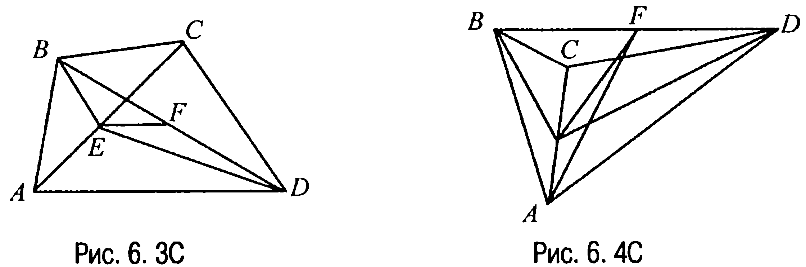
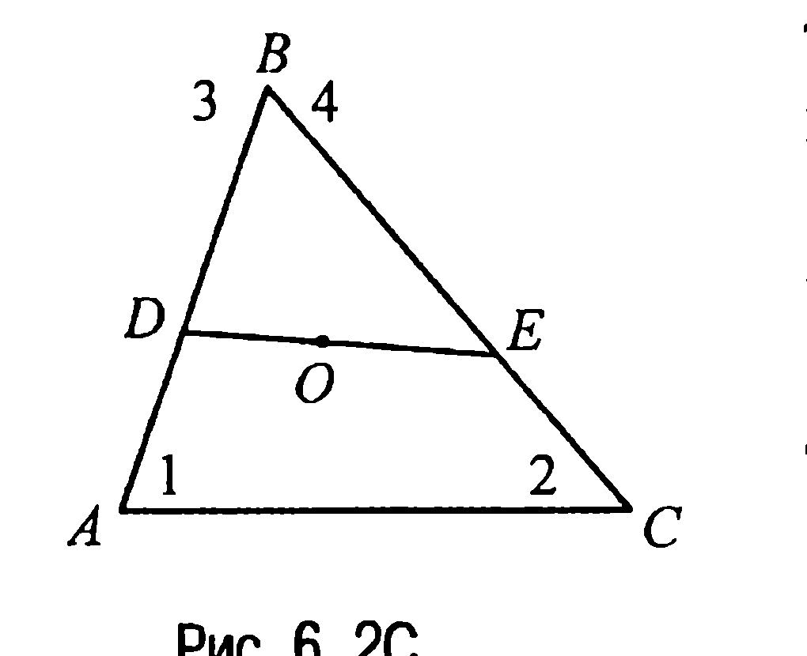
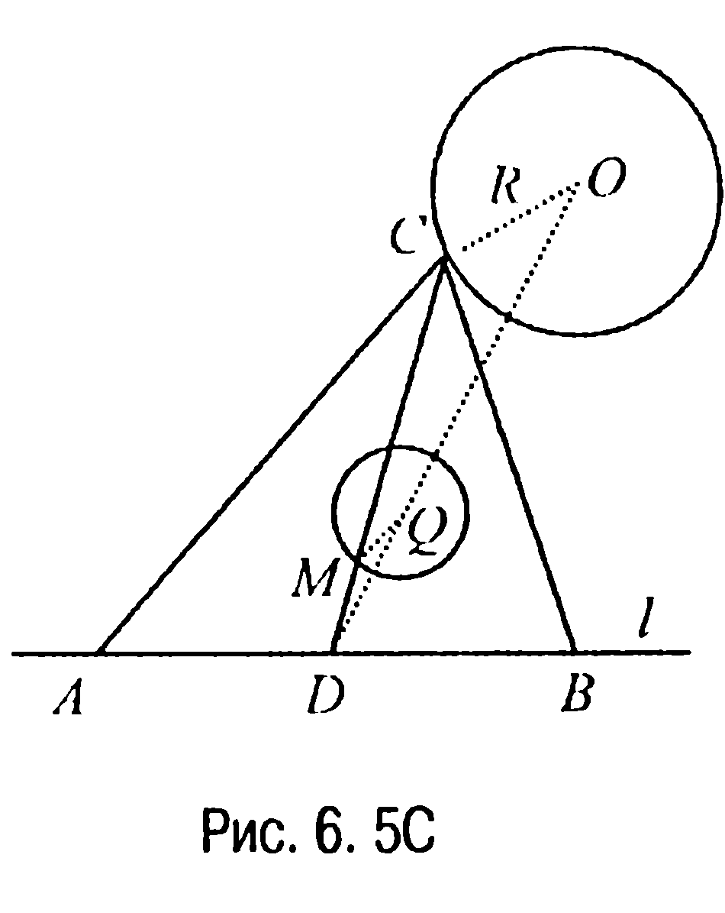
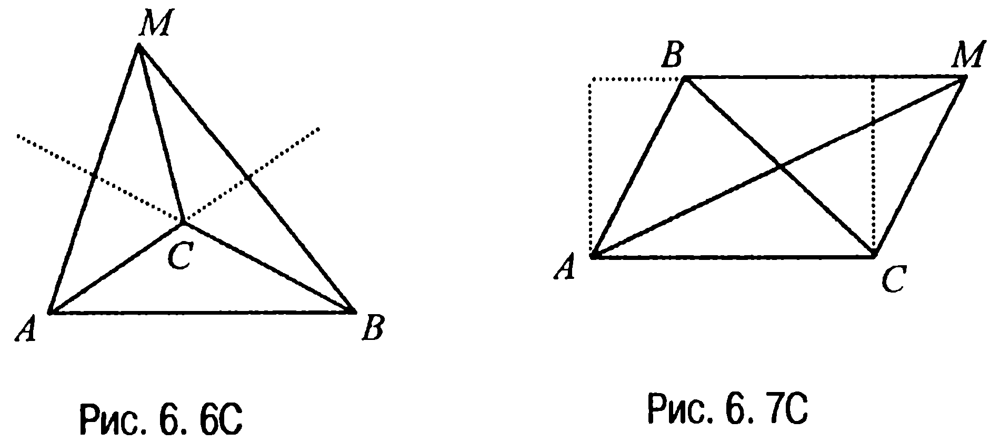
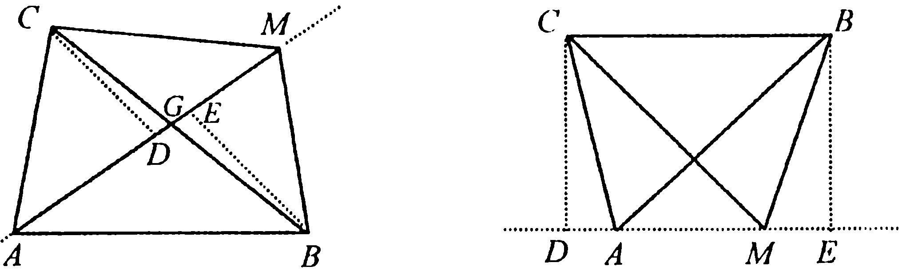

## 9.6. Медианы

---
**стр. 398**
---

треугольников), а значит, $\frac{MK}{BC} = \frac{1}{5}$. Но в таком случае $MK = \frac{4}{5}$, а $AM = \frac{2}{5}$.

**Ответ:** $MK = \frac{4}{5}$; $AM = \frac{2}{5}$.

**§ 6. Медианы**

**6.1C.** Пусть $O$ — точка пересечения медиан $AA_1$, $BB_1$, $CC_1$ треугольника $ABC$ (рис. 6.1C). Тогда так как треугольники $AOB$, $BOC$ и $AOC$ равновелики (задача 6.1), а медианы $OC_1$, $OA_1$ и $OB_1$ этих треугольников делят каждый из них на два равновеликих треугольника (свойство 6.2X), то и приходим к требуемому.

**6.2C.** Решим эту задачу методом, который иногда называют «методом масс». Именно, поместим в вершинах $A$ и $C$ треугольника $ABC$ грузы единичной массы и обозначим их как грузы 1 и 2. В вершину $B$ поместим два груза: груз 3 массой $\frac{AD}{DB}$ и груз 4 массой $\frac{CE}{EB}$ (рис. 6.2C). Тогда так как по условию $AD : DB + CE : EB = 1$, то во всех трех вершинах треугольника $ABC$ расположены грузы массой 1 и, следовательно, их центр тяжести находится в точке $O$ пересечения медиан треугольника (задача 6.3). С другой стороны, поскольку $1 \cdot AD = \frac{AD}{DB} \cdot DB$, а $1 \cdot CE = \frac{CE}{EB} \cdot EB$, то центры масс грузов 1, 3 и 2, 4 расположены в точках $D$ и $E$ соответственно. Но это означает, что центр масс всех четырех грузов находится на отрезке

---
**стр. 399**
---

$DE$, который на основании предыдущего вывода относительно расположения центра тяжести четырех масс обязан проходить через точку $O$ пересечения медиан треугольника $ABC$.

**6.3С.** Если обозначить $BE = x$, $ED = y$ (рис. 6.3С, 6.4С), то $EF$,

$BE$ и $ED$ являются медианами треугольников $DEB$, $ABC$ и $ACD$ соответственно. А тогда из этих треугольников находим (задача 6.4), что $l^2 = \frac{1}{4}(2x^2 + 2y^2 - n^2)$, $x^2 = \frac{1}{4}(2a^2 + 2b^2 - m^2)$, $y^2 = \frac{1}{4}(2c^2 + 2d^2 - m^2)$. Подставляя теперь найденные значения для $x^2$ и $y^2$ в выражение для $l^2$, приходим к требуемому.

**6.4С.** Пусть $a, b, c, d$ — стороны четырехугольника, $m$ и $n$ — его диагонали, $l$ — расстояние между серединами диагоналей. Тогда (задача 6.3С) $l^2 = \frac{1}{4}(a^2 + b^2 + c^2 + d^2 - m^2 - n^2)$ или $a^2 + b^2 + c^2 + d^2 = 4 l^2 + m^2 + n^2 \ge m^2 + n^2$.

Если четырехугольник оказывается параллелограммом, то в этом случае $l = 0$, и, значит, $a^2 + b^2 + c^2 + d^2 = m^2 + n^2$.

**6.5С.** Обратимся к рис. 6.5С, где $D$ — середина отрезка $AB$ прямой $l$, $C$ — произвольная точка окружности радиуса $R$ с центром в точке $O$, $M$ — точка пересечения медиан треугольника $ABC$.

Ясно, что $DM = \frac{1}{3} DC$ (свойство 6.5). Зафиксируем на отрезке $DO$ точку $Q$ такую, что $DQ = \frac{1}{3} DO$.

---
**стр. 400**
---

Очевидно, что в этом случае $\Delta DMQ \sim \Delta DCO$ и, значит, $MQ = \frac{1}{3} CO = R/3$. Но тогда приходим к выводу, что искомое геометрическое место точек — это окружность радиуса $R/3$ с центром в точке $Q$.

**Ответ:** окружность радиуса $R/3$ с центром в такой точке $Q$ отрезка $DO$, что $DQ = \frac{1}{3} DO$.

**6.6С.** Очевидно, что точка $M$ не может лежать как ни на одной

из прямых $AB$, $BC$ и $AC$, так и внутри угла, образованного продолжениями двух сторон треугольника $ABC$ за их общую вершину (рис. 6.6С).

Если же $M$ — внутренняя точка треугольника $ABC$, то она является точкой пересечения медиан треугольника $ABC$ (задача 6.2).

Итак, остается рассмотреть случай, когда точка $M$ лежит вне треугольника $ABC$ внутри угла, образованного продолжениями двух сторон треугольника $ABC$ за третью сторону. Пусть это будет, например, угол $BAC$ (рис. 6.7С).

Тогда поскольку треугольники $AMB$ и $BMC$ равновелики и имеют общее основание $BM$, то расстояния от точек $A$ и $C$ до прямой $BM$ равны и поэтому $AC \parallel BM$.

Рассматривая аналогичным образом треугольники $AMC$ и $BMC$, приходим к выводу, что $AB \parallel CM$.

Но в таком случае четырехугольник $ABMC$ — это параллелограмм и, значит, искомое множество состоит из четырех точек:

---
**стр. 401**
---

точки пересечения медиан треугольника $ABC$ и трех точек, каждая из которых является вершиной достроенного из треугольника $ABC$ параллелограмма.

**Ответ:** множество $\mathfrak{M}$ — это четыре точки: точка пересечения медиан треугольника $ABC$ и три точки, каждая из которых является вершиной достроенного из треугольника $ABC$ параллелограмма.

**6.7С.** Очевидно, что ни одна точка из $\mathfrak{M}$ не лежит ни на одной из прямых $AB$ и $AC$. Рассмотрим случай, когда точки $B$ и $C$ лежат

по разные стороны от прямой $AM$ (рис. 6.8С).

Пусть $G$ — точка пересечения прямой $AM$ со стороной $BC$ треугольника $ABC$.

Тогда поскольку треугольники $AMB$ и $AMC$ равновелики и имеют общее основание $AM$, то их высоты $BE$ и $CD$ равны. Но в таком случае равны прямоугольные треугольники $BEG$ и $CDG$ и, следовательно, $G$ — середина стороны $BC$.

Обратно, если $G$ — середина стороны $BC$, а точка $M$, не совпадающая с точкой $A$, лежит на прямой $AG$, то из равенства прямоугольных треугольников $BEG$ и $CDG$ следует равновеликость треугольников $AMB$ и $AMC$.

Предположим теперь, что точки $B$ и $C$ лежат по одну сторону от прямой $AM$ (рис. 6.9С). Как и в предыдущем случае, из равновеликости треугольников $AMB$ и $AMC$ следует равенство высот $BE$ и $CD$ и, значит, параллельность прямой $AM$ и стороны $BC$.

Обратно, если точка $M$ не совпадает с точкой $A$ и лежит на прямой, проходящей через точку $A$ параллельно отрезку $BC$, то очевидно, что треугольники $AMB$ и $AMC$ равновелики.

Таким образом, искомое геометрическое место состоит из двух прямых без точки $A$, которые проходят через $A$: первая проходит
