## 9.7. Высоты

---
**стр. 402**
---

через середину стороны $BC$, а вторая — параллельно стороне $BC$.

**Ответ:** геометрическое место $\mathfrak{M}$ — это две прямые без точки $A$, которые проходят через $A$: первая проходит через середину стороны $BC$, а вторая — параллельно стороне $BC$.

**6.8С.** Пусть дан пятиугольник $ABCDE$, медианы которого, проведенные из вершин $A, B, C$ и $D$, пересекаются в точке $O$ (рис. 6.10С).

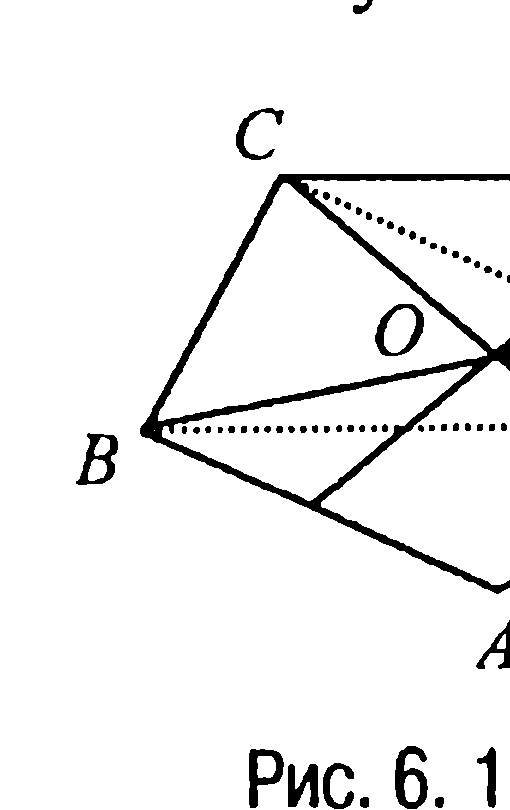

Рассматривая тогда последовательно треугольники $EBD$, $ADB$, $CAD$ и $ACE$, на основании утверждения, приведенного в замечании 6.3, имеем равенства: $S_{\triangle EOB} = S_{\triangle DOB}$, $S_{\triangle DOB} = S_{\triangle DOA}$, $S_{\triangle DOA} = S_{\triangle COA}$, $S_{\triangle COA} = S_{\triangle COE}$.

Эти равенства означают, в частности, что $S_{\triangle EOB} = S_{\triangle COE}$, а значит (замечание 6.4), точка $O$ лежит на медиане треугольника $BEC$, откуда и следует требуемое.

**§ 7. Высоты**

**7.1С.** Пусть $h_a = 3$, $h_b = 4$ и $h_c = 10$ — высоты треугольника $ABC$, опущенные соответственно на стороны $BC = a$, $AC = b$ и $AB = c$, $S$ — площадь треугольника. Тогда $S = \frac{1}{2} a \cdot h_a = \frac{1}{2} b \cdot h_b = \frac{1}{2} c \cdot h_c = \frac{3}{2} a = \frac{4}{2} b = \frac{10}{2} c$, т. е. $b = \frac{3}{4} a$, $c = \frac{3}{10} a$ и, значит, $a$ является наибольшей стороной треугольника (то, что такой треугольник существует, следует из неравенства $b + c = \frac{21}{20} a > a$).

Но в треугольнике против большей стороны лежит больший угол, поэтому по теореме косинусов получаем, что

$$a^2 = b^2 + c^2 - 2b \cdot c \cdot \cos \alpha = \frac{9}{16} \cdot a^2 + \frac{9}{100} \cdot a^2 - \frac{9}{20} a^2 \cdot \cos \alpha$$

или $\cos \alpha = - \frac{139}{180}$, откуда $\alpha = \arccos \left( - \frac{139}{180} \right) = \pi - \arccos \frac{139}{180}$.

---
**стр. 403**
---

**Ответ:** $\alpha = \pi - \arccos \frac{139}{180}$.

**7.2С.** Пусть $AH$ и $BF$ — высоты треугольника $ABC$ (рис. 7.1С), каждая из которых больше 10. Тогда так как треугольник $AHC$ прямоугольный, то $AC \ge AH > 10$ и, значит, площадь треугольника $ABC$

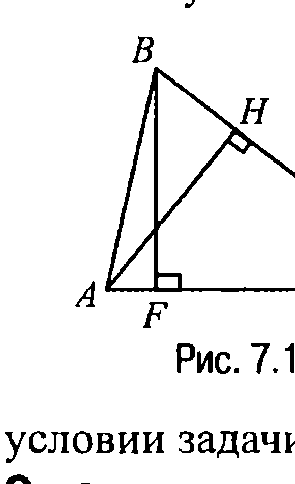

$$S = \frac{1}{2} AC \cdot BF > \frac{1}{2} \cdot 10 \cdot 10 = 50.$$

А это означает, что при заданных в условии задачи высотах площадь $S$ не может быть меньше 10.

**Ответ:** не существует.

**7.3С.** Ответ на поставленный вопрос положительный. Действительно, рассмотрим равнобедренный треугольник $ABC$, у которого $AB = BC$, $AC = 1000$, а высота $BB_1 = \frac{1}{2}$ (рис. 7.2С). Площадь треугольника $ABC$

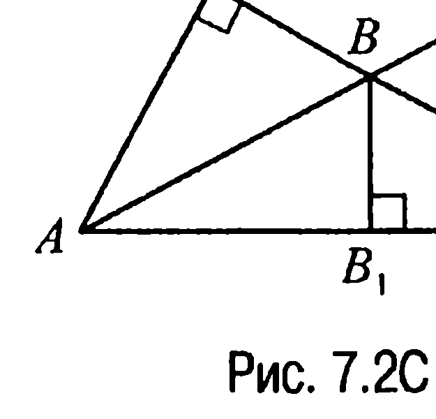

$$S = \frac{1}{2} \cdot 1000 \cdot \frac{1}{2} = 250.$$

Покажем, что у такого треугольника две другие высоты $AA_1$ и $CC_1$ также меньше 1. В самом деле, прямоугольные треугольники $AA_1C$ и $BB_1C$ подобны, так как угол $ACA_1$ у них общий, поэтому

$$\frac{BC}{AC} = \frac{BB_1}{AA_1} \quad \text{или} \quad AA_1 = \frac{AC \cdot BB_1}{BC}.$$

Но $BC = \sqrt{BB_1^2 + B_1C^2} = \sqrt{\frac{1}{4} + (500)^2}$ и, таким образом,

$$AA_1 = \frac{1000 \cdot \frac{1}{2}}{\sqrt{\frac{1}{4} + (500)^2}} < \frac{500}{\sqrt{(500)^2}} = 1.$$

Аналогично доказывается, что и $CC_1 < 1$.

**Ответ:** может.

**7.4С.** Пусть $h_a, h_b$ и $h_c$ — высоты, опущенные соответственно на стороны треугольника $a, b$ и $c$ или на их продолжения, $S$ — площадь данного треугольника и пусть для определенности $h_a = 12,$

---
**стр. 404**
---

$h_b = 20$. Тогда так как для сторон треугольника справедливо неравенство $a + c > b$ или неравенство $c > |b - a|$ и так как

$$a = \frac{2S}{h_a}, \quad b = \frac{2S}{h_b}, \quad c = \frac{2S}{h_c}, \quad \text{то} \quad \frac{2S}{h_c} > \left| \frac{2S}{h_b} - \frac{2S}{h_a} \right| \quad \text{или} \quad \frac{1}{h_c} > \frac{|h_a - h_b|}{h_a \cdot h_b},$$

или $h_c < \frac{h_a h_b}{|h_a - h_b|}$. Подставляя в последнее неравенство числовые значения, имеем $h_c < \frac{12 \cdot 20}{8} = 30$, что и требовалось доказать.

**7.5С.** Пусть $A_1, B_1, C_1$ — основания высот треугольника $ABC$,

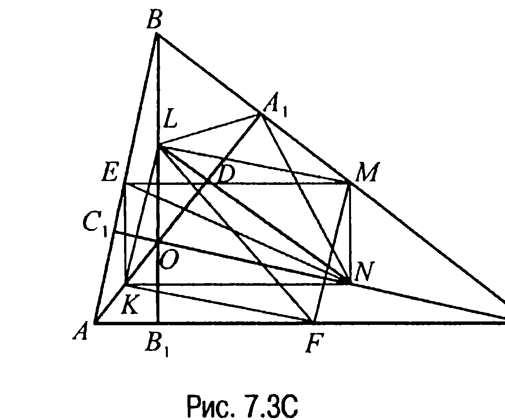

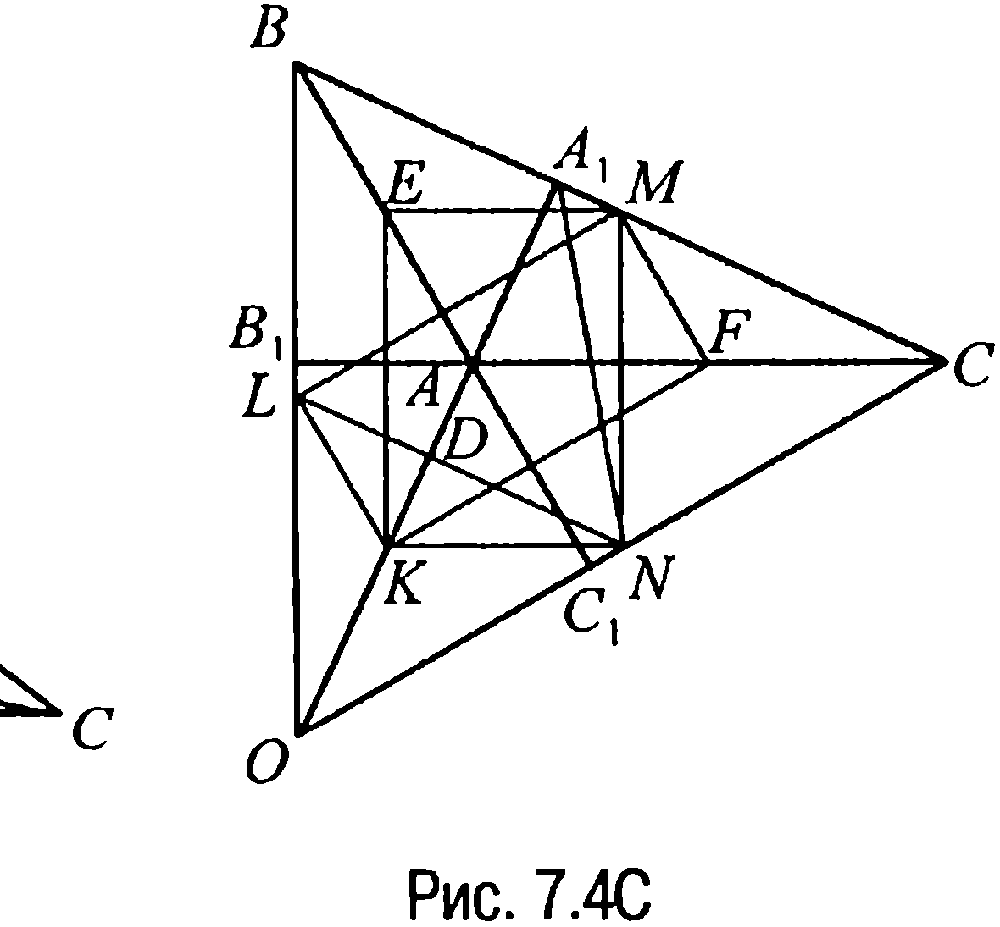

точки $E, M, F$ — середины его сторон, $K, L, N$ — середины отрезков $AO, BO$ и $CO$ соответственно, $D$ — точка пересечения луча $AO$ с отрезком $LN$ (рис. 7.3С, 7.4С).

Теперь поскольку $LN$ — средняя линия $\Delta OBC$, то $LN \parallel BC$ и по теореме Фалеса $OD = DA_1$. А так как $OA_1 \perp LN$, то $\Delta OLD = \Delta DLA_1$, $\Delta ODN = \Delta DA_1N$. Тогда $ON = NA_1$, $OL = LA_1$ и, следовательно, $\Delta LA_1N = \Delta OLN$, а значит, $\angle LA_1N = \angle NOL$.

Далее (задача 7.6), $\angle LA_1N = \angle NOL = 180^\circ - \angle NKL$, т. е. четырехугольник $KLA_1N$ — вписанный (свойство 15.1X). Таким образом, точки $K, L, A_1, N$ лежат на одной окружности. Замечая же, что $LM$ и $NM$ — средние линии $\Delta OBC$, приходим к выводу, что четырехугольник $OLMN$ — параллелограмм. Поэтому $\Delta OLN = \Delta LMN$ и, следовательно, $\angle LMN = \angle NOL$, т. е. $\angle LMN + \angle NKL = 180^\circ$. Отсюда следует, что четырехугольник $KLMN$ также является впи-

---
**стр. 405**
---

санным и, значит, точка $M$ лежит на окружности, проходящей через точки $K$, $L$, $A_1$, $N$.

Что же касается точек $E$, $F$, $C_1$, $B_1$, то здесь можно рассуждать, например, следующим образом. Четырехугольники $KEMN$ и $LMFK$, как легко видеть, являются прямоугольниками, и поэтому они вписаны в уже построенную нами окружность. А это означает, что точки $E$, $F$ лежат вместе с точками $K$, $L$, $A_1$, $M$, $N$ на одной окружности. Принадлежность же точек $B_1$ и $C_1$, как и указанных выше семи точек, одной окружности следует из рассмотрения треугольников $FB_1L$ и $NC_1E$ соответственно. У этих треугольников прямые углы $FB_1L$ и $NC_1E$ опираются на отрезки $LF$ и $EN$ соответственно, являющиеся, очевидно, диаметрами построенной выше окружности. А это и доказывает требуемое.

**7.6С.** В случае прямоугольного треугольника доказательство оче-

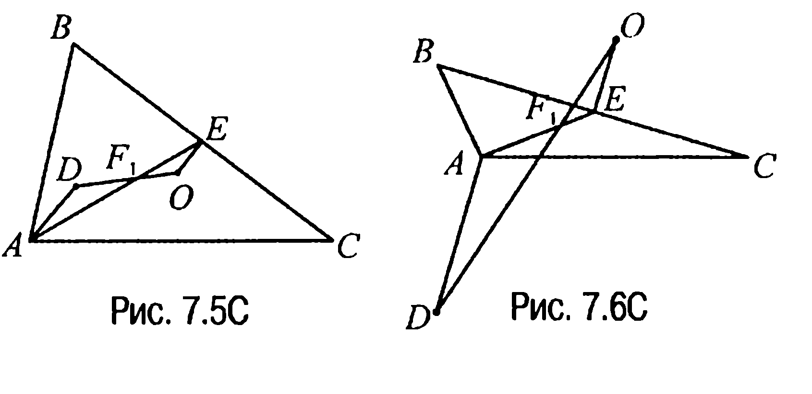

видно. Рассмотрим случаи остроугольного и тупоугольного треугольников. Итак, если $\triangle ABC$ — равнобедренный ($AB = BC$), то точки $D$, $O$, $F$ лежат на одной прямой — оси симметрии этого треугольника.

Пусть $AB \neq BC$. В этом случае проведем медиану $AE$ и обозначим через $F_1$ точку пересечения отрезков $DO$ и $AE$ (рис. 7.5С, 7.6С). Прямая $OE$ проходит через центр описанной около треугольника $ABC$ окружности и середину стороны $BC$, поэтому $OE \perp BC$. А так как и $AD \perp BC$, то $AD \parallel OE$. Следовательно, треугольники $DAF_1$ и $F_1OE$ подобны. Но $AD = 2OE$ (задача 7.9), тогда $AF_1 : F_1E = 2 : 1$, а это означает, что $F_1$ — точка пересечения медиан треугольника $ABC$, т. е. точки $F_1$ и $F$ совпадают.

Таким образом, точка $F$ лежит на отрезке $OD$, что и требовалось доказать.

---
**стр. 406**
---

**7.7С.** Пусть $E$ — середина отрезка $BC$, $F$ — середина отрезка

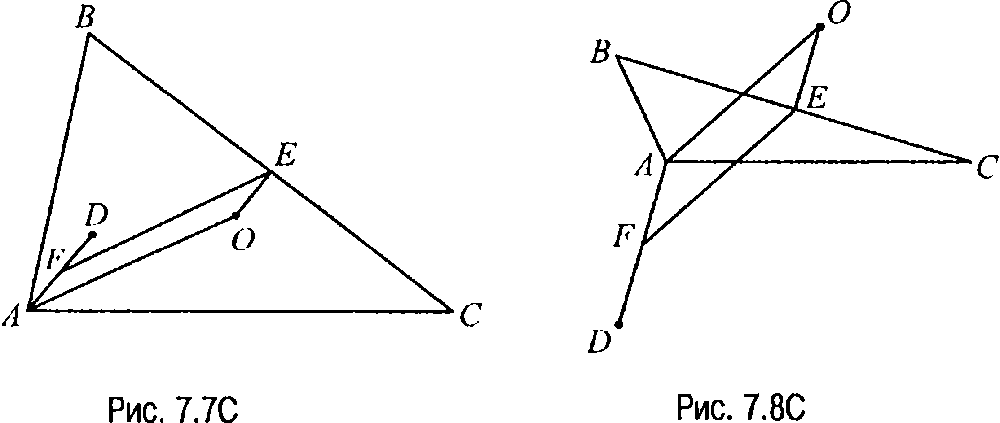

$AD$, $O$ — центр окружности, описанной около треугольника $ABC$ (рис. 7.7С, 7.8С). Тогда так как $BE = EC$ и центр описанной окружности лежит на перпендикуляре, проведенном через середину $BC$, то $OE \perp BC$. Но поскольку $AF = OE$ (задача 7.9) и $AD \perp BC$, то четырехугольник $AFEO$ — параллелограмм и, следовательно, $FE = AO$, что и требовалось доказать.

**7.8С.** В случае прямоугольного треугольника речь идет о пяти

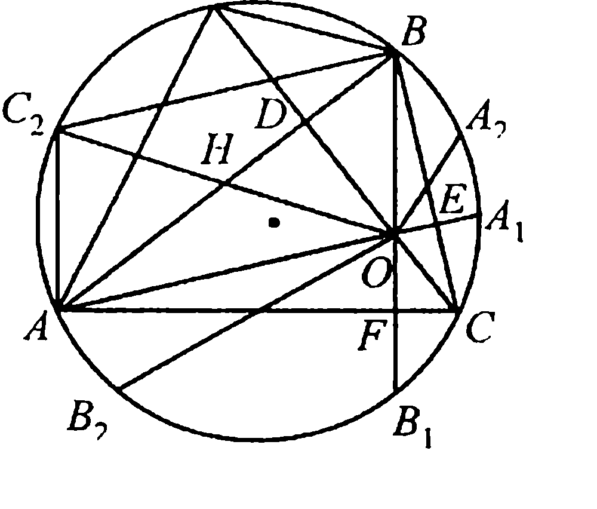

точках: это вершины треугольника и точки, симметричные вершине прямого угла относительно гипотенузы и ее середины. Вершины треугольника и точка, симметричная вершине прямого угла относительно середины гипотенузы, являются вершинами прямоугольника, около которого всегда можно описать окружность. Оставшаяся же точка также будет лежать на построенной окружности как точка, симметричная вершине прямого угла относительно диаметра окружности.

Рассмотрим теперь случай остроугольного треугольника. Пусть $AE$, $BF$, $CD$ — высоты треугольника $ABC$, $O$ — точка их пересечения; $A_1$, $B_1$, $C_1$ — точки, симметричные точке $O$ относительно сторон $BC$, $AC$, $AB$ соответственно, а $A_2$, $B_2$, $C_2$ — точки, симметричные точке $O$ относительно середин сторон треугольника (рис. 7.9С).

---
**стр. 407**
---

Покажем, что точка $C_1$ лежит на окружности, описанной около треугольника $ABC$. Действительно, $\angle AOC = \angle EOD = 180^\circ - \angle ABC$ (задача 7.6). Далее, поскольку треугольник $AC_1O$ равнобедренный ($AD \perp C_1O$, $C_1D = DO$), то $\angle AC_1C = \angle C_1OA = 180^\circ - \angle AOC = \angle ABC$, а это уже и означает, что точка $C_1$ лежит на окружности, описанной около треугольника $ABC$. Аналогично доказывается, что точки $A_1$, $B_1$ также лежат на окружности, описанной около треугольника $ABC$.

Рассмотрим теперь симметрию относительно середин сторон треугольника. Пусть $H$ — середина отрезка $AB$, а точка $C_2$ симметрична точке $O$ относительно $H$. Тогда четырехугольник $AC_2BO$ — параллелограмм и, таким образом, $\angle AC_2B = \angle BOA = \angle FOE = 180^\circ - \angle BCA$, т. е. $\angle AC_2B + \angle BCA = 180^\circ$. Отсюда следует, что около четырехугольника $AC_2BC$ можно описать окружность и, значит, точка $C_2$ лежит на окружности, описанной около треугольника $ABC$.

Подобным образом доказывается, что и точки $A_2$, $B_2$ также лежат на окружности, описанной около треугольника $ABC$.

**7.9С.** Пусть $AE$, $BF$, $CD$ — высоты треугольника $ABC$, $O$ — точка пересечения их продолжений, $A_1$, $B_1$ и $C_1$ — точки, симметричные точке $O$ относительно стороны $BC$ и продолжения сторон $AC$, $AB$ соответственно, а $A_2$, $B_2$, $C_2$ — точки, симметричные точке $O$ относительно середин сторон треугольника (рис. 7.10С).

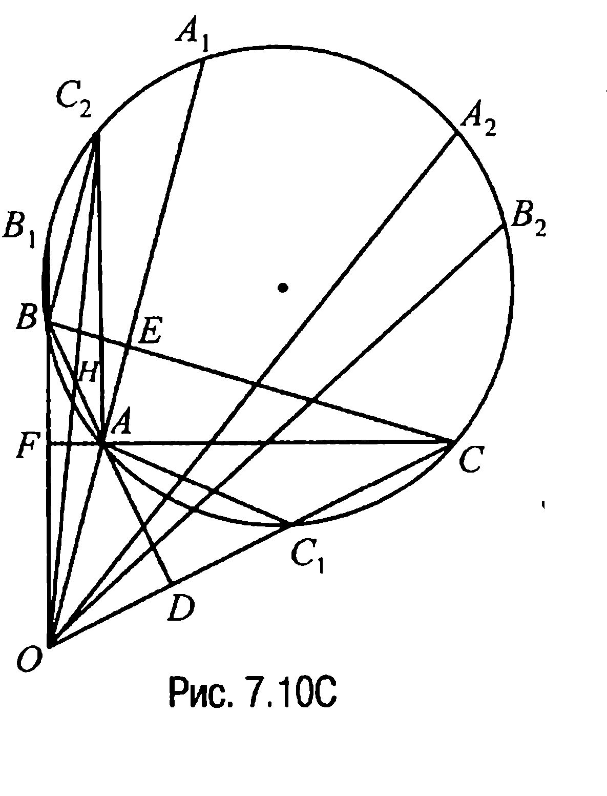

Покажем, что точка $C_1$ лежит на окружности, описанной около треугольника $ABC$. Действительно, поскольку треугольник $OAC_1$ равнобедренный ($AD \perp OC_1$, $OD = DC_1$), то $\angle C_1OA = \angle AC_1O = 180^\circ - \angle AC_1C$ или $\angle AC_1C + \angle C_1OA = 180^\circ$. Но $\angle C_1OA = \angle ABC$, так как это углы с соответственно перпендикулярными

---
**стр. 408**
---

сторонами и поэтому $\angle AC_1C + \angle ABC = 180^\circ$, что уже и означает, что точка $C_1$ лежит на окружности, описанной около треугольника $ABC$.

Аналогично доказывается, что точки $A_1$, $B_1$ также лежат на окружности, описанной около треугольника $ABC$.

Рассмотрим теперь симметрию относительно середин сторон треугольника. Пусть $H$ — середина отрезка $AB$, а точка $C_2$ симметрична точке $O$ относительно $H$. Тогда четырехугольник $AC_2BO$ — параллелограмм и, таким образом, $\angle BC_2A = \angle AOB$. Но $\angle AOB = \angle BCA$, так как это углы с соответственно перпендикулярными сторонами, и поэтому $\angle BC_2A = \angle BCA$. Но эти два равных угла, из которых $\angle BCA$ является вписанным, опираются на одну и ту же хорду $BA$, что и означает, что точка $C_2$ лежит на окружности, описанной около треугольника $ABC$.

Подобным образом доказывается, что и точки $A_2$, $B_2$ также лежат на окружности, описанной около треугольника $ABC$.

**7.10C.** Пусть $AA_1$, $BB_1$, $CC_1$ — высоты треугольника $ABC$ (рис. 7.11C). Рассмотрим треугольник $AOC$ и покажем, что продолжения его высот пересекаются в точке $B$.

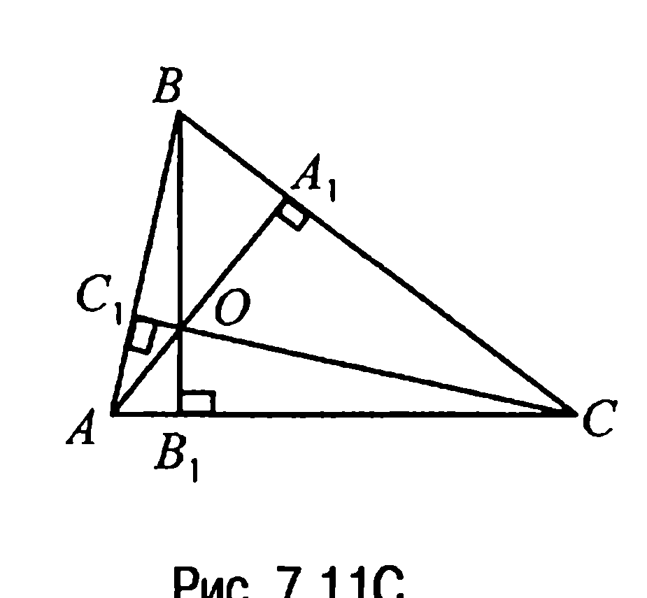

Действительно, по условию $AC_1 \perp CC_1$, $CA_1 \perp AA_1$, причем прямые $AC_1$ и $CA_1$ пересекаются в точке $B$, через которую проходит прямая $BB_1$, являющаяся продолжением высоты $OB_1$ треугольника $AOC$.

Таким образом, первая часть задачи решена, так как рассмотрение случаев треугольников $AOB$ и $OBC$ аналогично уже рассмотренному случаю.

Перейдем ко второй части задачи. Покажем, например, что равны радиусы окружностей, описанных около треугольников $ABC$ и $AOC$. Итак, пусть $\angle ABC = \beta$. Тогда $\angle AOC = 180^\circ - \beta$ (задача 7.6) и радиусы $R_1$ и $R_2$ окружностей, описанных около треугольников $ABC$ и $AOC$ соответственно, вычисляются по формулам

---
**стр. 409**
---

$$R_1 = \frac{AC}{2 \sin \beta}, \quad R_2 = \frac{AC}{2 \sin(180^\circ - \beta)} = \frac{AC}{2 \sin \beta}, \quad \text{откуда и следует, что}$$
$$R_1 = R_2 = R.$$

Аналогично доказывается, что радиусы окружностей, описанных около треугольников $ABO$ и $OBC$, также равны $R$.

**7.11C.** Пусть $AA_1$, $BB_1$, $CC_1$ — высоты треугольника $ABC$ (рис. 7.12C). Рассмотрим треугольник $AOC$ и покажем, что продолжения его высот пересекаются в точке $B$.

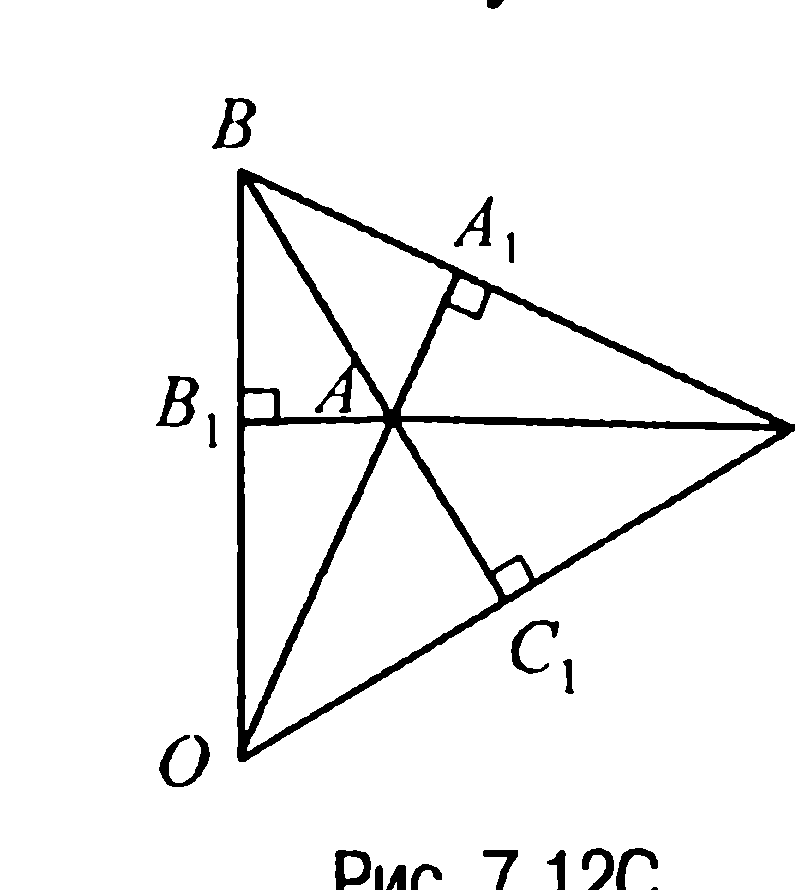

Действительно, по условию $AC_1 \perp CC_1$, $CA_1 \perp AA_1$, причем прямые $AC_1$ и $CA_1$ пересекаются в точке $B$, через которую проходит прямая $BB_1$, являющаяся продолжением высоты $OB_1$ треугольника $OAC$.

Таким образом, первая часть задачи решена, так как рассмотрение случаев треугольников $AOB$ и $OBC$ аналогично уже рассмотренному случаю.

Перейдем ко второй части задачи. Покажем сначала, что равны радиусы окружностей, описанных около треугольников $ABC$ и $AOC$.

Итак, пусть $\angle ABC = \beta$. Тогда из перпендикулярности соответствующих сторон углов $ABC$ и $COA$ следует, что $\angle COA = \angle ABC = \beta$ и радиусы $R_1$ и $R_2$ окружностей, описанных около треугольников $ABC$ и $AOC$ соответственно, вычисляются по формулам

$$R_1 = \frac{AC}{2 \sin \beta}, \quad R_2 = \frac{AC}{2 \sin \beta}, \quad \text{откуда и следует, что } R_1 = R_2 = R.$$

Аналогично доказывается, что радиус окружности, описанной около треугольника $AOB$, также равен $R$.

Что же касается треугольника $OBC$, то, полагая, что $\angle CAB = \alpha$, находим, что $\angle COB = 180^\circ - \alpha$ и, значит, радиусы $R$ и $R_3$ окружностей, описанных около треугольников $ABC$ и $OBC$ соответственно, вычисляются по формулам

$$R = \frac{BC}{2 \sin \alpha}, \quad R_3 = \frac{BC}{2 \sin(180^\circ - \alpha)} = \frac{BC}{2 \sin \alpha}, \quad \text{т. е. } R = R_3,$$

что и требовалось доказать.

---
**стр. 410**
---

**7.12C.** Рассмотрим сначала случай, когда треугольник $ABC$ остроугольный. Пусть $AA_1$ и $BB_1$ — высоты треугольника (рис. 7.13C).

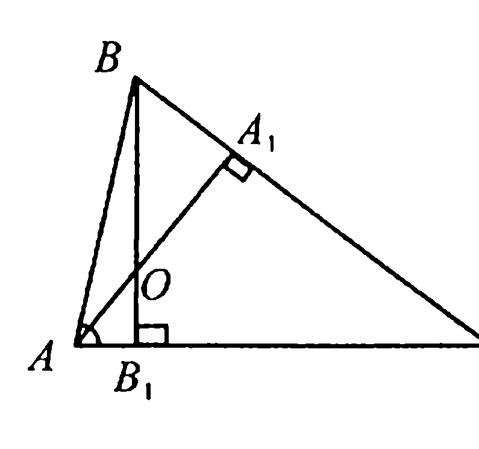

Тогда у прямоугольных треугольников $AA_1C$ и $AOB_1$ угол $CAA_1$ общий и, значит, $\angle AOB_1 = \angle A_1CA$. Далее, из треугольника $AOB_1$ находим, что

$$AO = \frac{AB_1}{\sin \angle AOB_1} = \frac{AB_1}{\sin \angle A_1CA}$$

Но $AB_1 = AB \cos \alpha$ и поэтому $AO = \dfrac{AB \cos \alpha}{\sin \angle A_1CA}$. По теореме синусов из треугольника $ABC$ имеем

$$\frac{AB}{\sin \angle BCA} = \frac{AB}{\sin \angle A_1CA} = \frac{BC}{\sin \alpha}$$

Таким образом, $AO = \dfrac{BC \cos \alpha}{\sin \alpha} = a \cdot \operatorname{ctg} \alpha$.

Предположим теперь, что $\angle CAB > 90^\circ$ (рис. 7.14C). Тогда $\angle COB =$

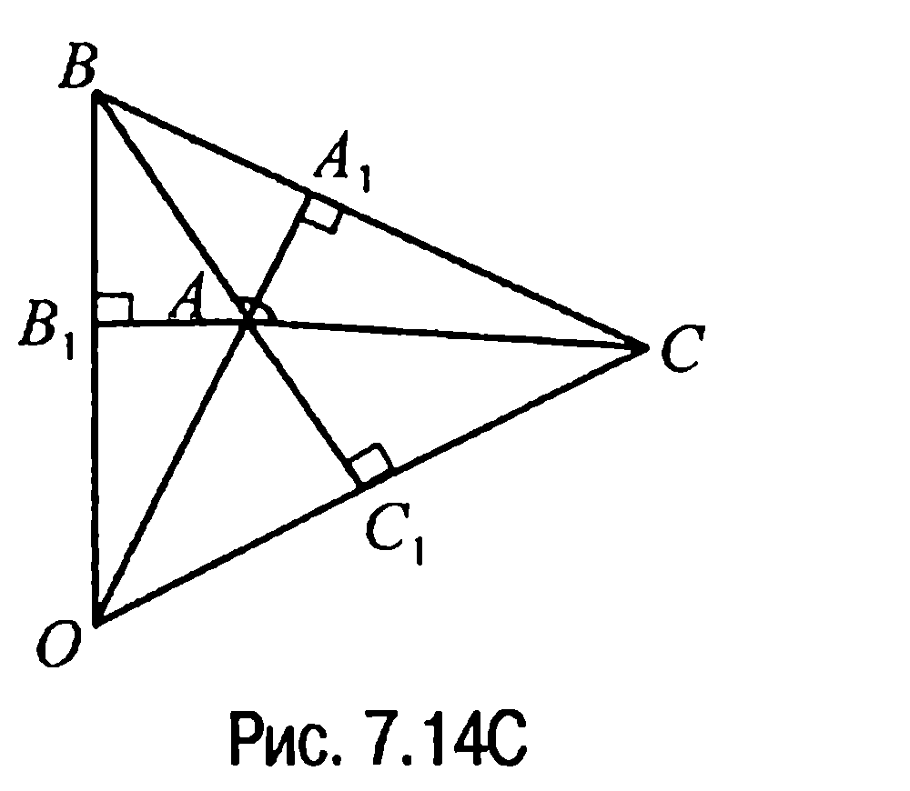
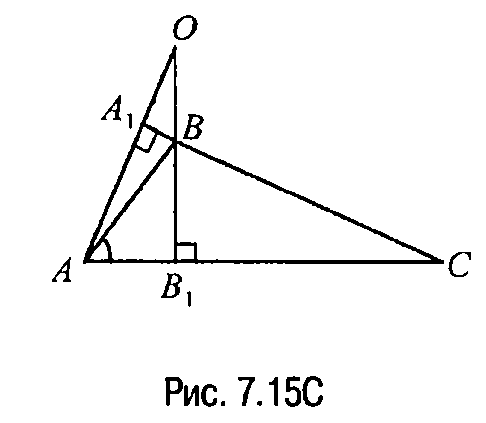

$= \angle C_1OB_1 = 180^\circ - \alpha$, т. е. $\angle COB < 90^\circ$. Но случай остроугольного треугольника рассмотрен выше и поэтому для вычисления $AO$ можно воспользоваться уже полученной выше формулой, имея в виду, что в данном случае роль $\alpha$ играет угол $180^\circ - \alpha$, т. е. $AO = a \cdot \operatorname{ctg}(180^\circ - \alpha) = -a \cdot \operatorname{ctg} \alpha$.

Рассмотрим случай, когда $\angle ABC > 90^\circ$ (рис. 7.15C). Здесь у прямоугольных треугольников $AOB_1$ и $AA_1C$ угол $B_1AA_1$ общий и поэтому $\angle A_1CA = \angle AOB_1$. Из треугольника $AOB_1$ находим, что $AO =$

---
**стр. 411**
---

$= \frac{AB_1}{\sin \angle AOB_1} = \frac{AB_1}{\sin \angle A_1CA}.$ Но $AB_1 = AB \cdot \cos \alpha$ и, значит, $AO =$
$= \frac{AB \cos \alpha}{\sin \angle BCA}.$ Из треугольника же $ABC$ по теореме синусов $\frac{AB}{\sin \angle BCA} = \frac{BC}{\sin \alpha}$ и, таким образом, $AO = \frac{BC \cos \alpha}{\sin \alpha} = a \cdot \operatorname{ctg} \alpha.$

Что же касается случая $\angle BCA > 90^\circ$, то его рассмотрение аналогично только что рассмотренному случаю. Если $\alpha = 90^\circ$, то точки $A$ и $O$ совпадают и поэтому $AO = a \cdot \operatorname{ctg} 90^\circ = 0.$

Пусть $\angle ABC = 90^\circ$. Тогда совпадают точки $O$ и $B$ и из прямоугольного треугольника $ABC$ находим, что $AO = BC \cdot \operatorname{ctg} \alpha = a \cdot \operatorname{ctg} \alpha.$

Наконец, если $\angle BCA = 90^\circ$, то совпадают точки $O$ и $C$, и мы снова приходим к уже полученной формуле для вычисления $AO$. Итак, объединяя полученные результаты, записываем

**Ответ:** $AO = a \cdot |\operatorname{ctg} \alpha|.$

**7.13С.** Рассмотрим сначала случай, когда треугольник $ABC$ ост-

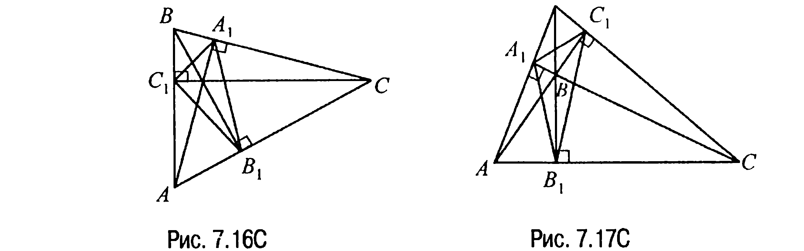

роугольный (рис. 7.16С). В этом случае, обозначая через $S_2, S_3$ и $S_4$ площади треугольников $B_1AC_1, C_1BA_1$ и $A_1CB_1$ соответственно, имеем $S - S_1 = S_2 + S_3 + S_4$. Далее, из прямоугольных треугольников $ABB_1$ и $ACC_1$ находим, что $AB_1 = AB \cdot \cos \alpha, AC_1 = AC \cdot \cos \alpha$.

Поэтому $S_2 = \frac{1}{2} AB_1 \cdot AC_1 \cdot \sin \alpha = \frac{1}{2} AB \cdot AC \cdot \sin \alpha \cdot \cos^2 \alpha$. Но поскольку $\frac{1}{2} AB \cdot AC \cdot \sin \alpha = S$, то последнюю формулу можно переписать в виде $S_2 = S \cdot \cos^2 \alpha$. Аналогично $S_3 = S \cdot \cos^2 \beta$, $S_4 = S \cdot \cos^2 \gamma$.

А тогда, подставляя полученные значения для $S_2, S_3$ и $S_4$ в выра-

---
**стр. 412**
---

жение для разности $S - S_1$, после преобразований находим, что

$$\frac{S_1}{S} = 1 - \cos^2 \alpha - \cos^2 \beta - \cos^2 \gamma.$$

Пусть треугольник $ABC$ является тупоугольным (рис. 7.17С). Тогда $S + S_1 = S_2 + S_3 + S_4$. Подставляя теперь в это равенство полученные выше значения для $S_2, S_3$ и $S_4$, приходим к выводу, что

$$\frac{S_1}{S} = \cos^2 \alpha + \cos^2 \beta + \cos^2 \gamma - 1.$$

**Ответ:** в случае остроугольного треугольника $\frac{S_1}{S} = 1 - \cos^2 \alpha - \cos^2 \beta - \cos^2 \gamma$; в случае тупоугольного треугольника $\frac{S_1}{S} = \cos^2 \alpha + \cos^2 \beta + \cos^2 \gamma - 1$.

**7.14С.** Пусть $A_1, B_1, C_1$ — основания высот треугольника $ABC$, опущенных из вершин $A, B, C$ соответственно, $O$ — центр описанной около данного треугольника окружности, $H$ — точка пересечения прямой $BO$ с отрезком $C_1A_1$ (рис. 7.18С).

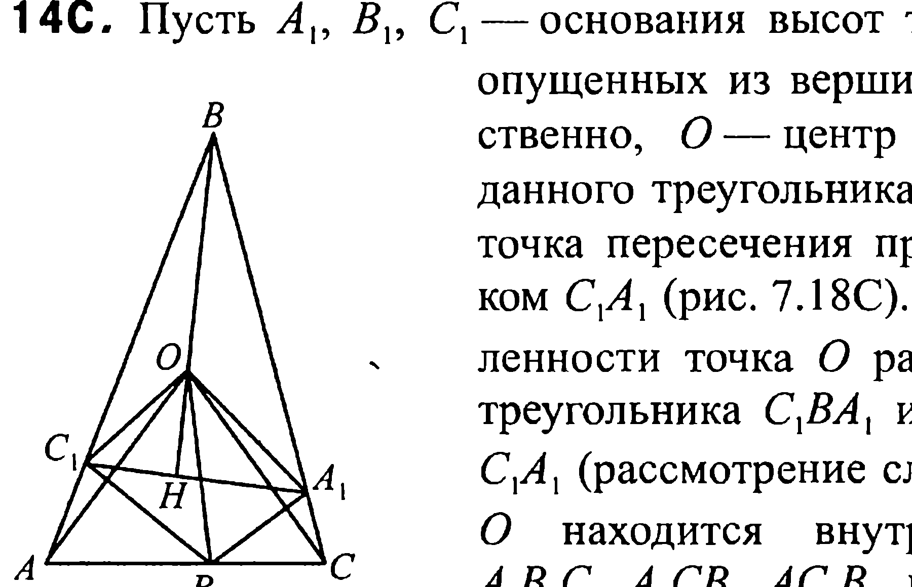

Пусть для определенности точка $O$ расположена внутри треугольника $C_1BA_1$ или на его стороне $C_1A_1$ (рассмотрение случаев, когда точка $O$ находится внутри треугольников $A_1B_1C_1$, $A_1CB_1$, $AC_1B_1$ или на их сторонах $A_1B_1$, $B_1C_1$, аналогично разбираемому случаю).

Пусть $S, S_1, S_2, S_3, S_4, S_5$ и $S_6$ — соответственно площади треугольника $ABC$, четырехугольника $C_1BA_1O$, пятиугольника $AC_1OA_1C$ (если точка $O$ лежит на отрезке $A_1C_1$, то $OH = 0$ и пятиугольник вырождается в четырехугольник), треугольника $C_1BA_1$, треугольника $C_1OA_1$, четырехугольника $AC_1OB_1$ и четырехугольника $B_1OA_1C$. Тогда $S = S_1 + S_2$, где $S_1 = S_3 - S_4$ или

$$S_1 = \frac{1}{2} C_1A_1 \cdot (R + OH) - \frac{1}{2} C_1A_1 \cdot OH = \frac{1}{2} C_1A_1 \cdot R,$$

а $S_2 = S_5 + S_6$ или

---
**стр. 413**
---

$$S_2 = \frac{1}{2} B_1C_1 \cdot R \cdot \sin 90^\circ + \frac{1}{2} A_1B_1 \cdot R \cdot \sin 90^\circ = \frac{1}{2} R \cdot (A_1B_1 + B_1C_1)$$

(здесь мы воспользовались формулой для вычисления площади четырехугольника по известным его диагоналям и углу между ними и тем фактом (задача 7.4), что $AO \perp B_1C_1$, $BO \perp A_1C_1$, $CO \perp A_1B_1$), т. е.

$$S = S_1 + S_2 = \frac{1}{2} R \cdot (A_1B_1 + B_1C_1 + C_1A_1) = p \cdot R.$$

**Ответ:** $p \cdot R$.

**7.15С.** В случаях, когда или $\angle BCA$, или $\angle ABC$ равен $90^\circ$, или же $\angle ABC = \angle BCA$, решение задачи очевидно. Пусть $\angle BCA < \angle ABC < 90^\circ$ (рис. 7.19С).

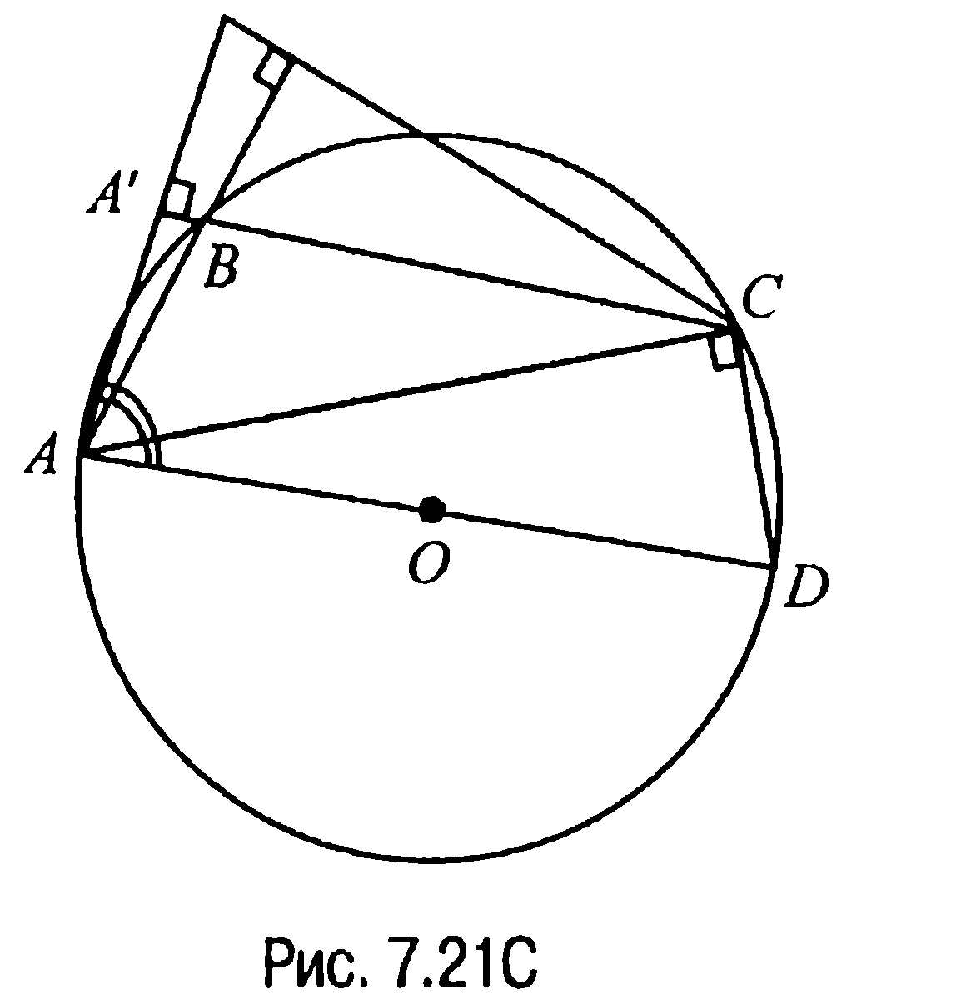

Обозначим через $D$ точку пересечения окружности с прямой $AO$, а через $A'$ — основание высоты треугольника $ABC$, опущенной из вершины $A$ на сторону $BC$. Тогда поскольку $AD$ — диаметр окружности, то $\angle DCA = 90^\circ$.

Рассмотрим прямоугольные треугольники $AA'C$ и $DCA$. Имеем $\angle CAA' = 90^\circ - \angle A'CA$, а $\angle ADC$, как угол, опирающийся на хорду $AC$, равен $\angle ABC$ и поэтому $\angle CAD = 90^\circ - \angle ADC = 90^\circ - \angle ABC$.

Отсюда $\angle OAH = \angle OAA' = \angle CAA' - \angle CAD = (90^\circ - \angle A'CA) - (90^\circ - \angle ABC) = \angle ABC - \angle A'CA = \angle ABC - \angle BCA$.

Пусть теперь $\angle ABC < \angle BCA < 90^\circ$ (рис. 7.20С). Воспользовавшись обозначениями, принятыми при рассмотрении предыдущего случая, из прямоугольных треугольников $AA'C$ и $DCA$ имеем:

$$\angle CAA' = 90^\circ - \angle A'CA, \quad \angle CAD = 90^\circ - \angle ADC = 90^\circ - \angle ABC.$$

---
**стр. 414**
---

Поэтому $\angle OAH = \angle OAA' = \angle DAC - \angle A'AC = \angle CAD - \angle CAA' =$
$(90^\circ - \angle ABC) - (90^\circ - \angle A'CA) = \angle A'CA - \angle ABC = \angle BCA - \angle ABC.$

Рассмотрим случай, когда $\angle ABC > 90^\circ$. Здесь (рис. 7.21C) $\angle CAA' =$

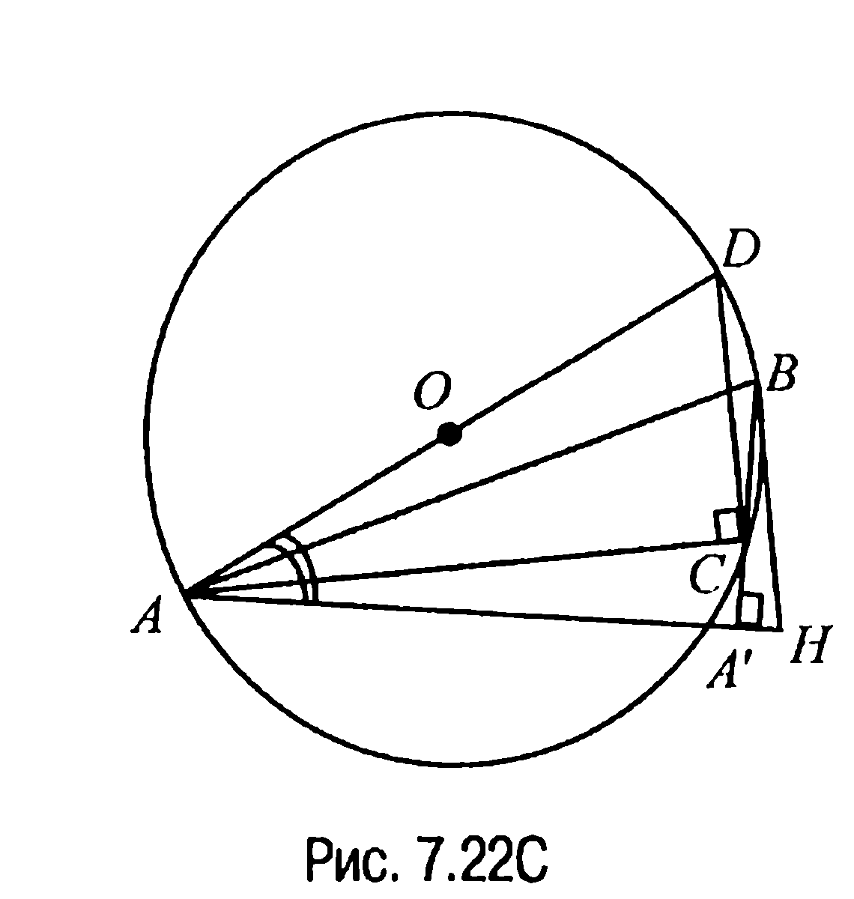

$= 90^\circ - \angle A'CA$, где $A'$ — основание высоты треугольника $ABC$,
опущенной из вершины $A$ на продолжение стороны $BC$, $\angle CDA =$
$= 180^\circ - \angle ABC$ (так как четырехугольник $ABCD$ вписан в окруж-
ность).

А тогда из треугольника $CDA$ находим, что $\angle DAC = 90^\circ - (180^\circ -$
$- \angle ABC) = \angle ABC - 90^\circ$. Таким образом, $\angle OAH = \angle OAA' =$
$= \angle CAA' + \angle DAC = (90^\circ - \angle A'CA) + (\angle ABC - 90^\circ) = \angle ABC -$
$- \angle A'CA = \angle ABC - \angle BCA$.

Обратимся теперь к случаю, когда $\angle BCA > 90^\circ$ (рис. 7.22C). Из
прямоугольных треугольников $CA'A$ и $DCA$ имеем
$\angle A'AC = 90^\circ - \angle ACA' = 90^\circ - (180^\circ - \angle BCA) = \angle BCA - 90^\circ$,
$\angle CAD = 90^\circ - \angle ADC = 90^\circ - \angle ABC$. Таким образом, $\angle OAH =$
$= \angle OAA' = \angle OAC + \angle CAH = \angle DAC + \angle CAA' = \angle CAD + \angle A'AC =$
$= (90^\circ - \angle ABC) + (\angle BCA - 90^\circ) = \angle BCA - \angle ABC$.

Объединяя полученные результаты, приходим к выводу, что
$\angle OAH = |\angle BCA - \angle ABC|$.
