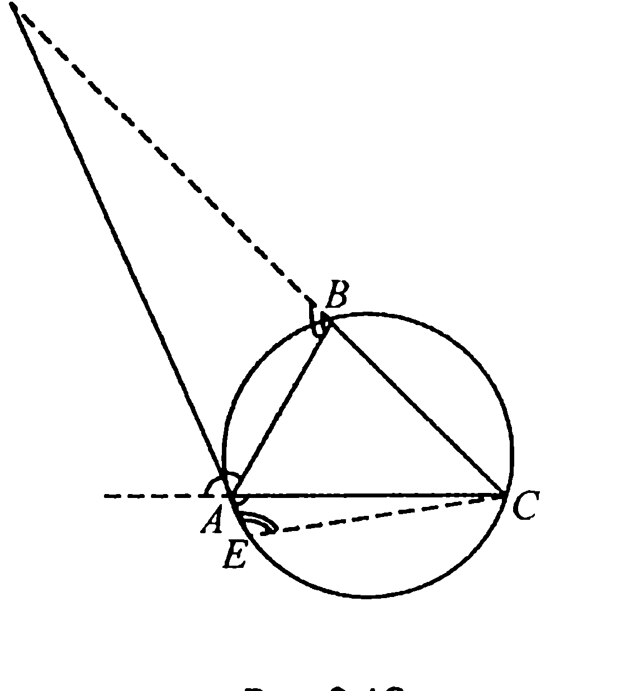
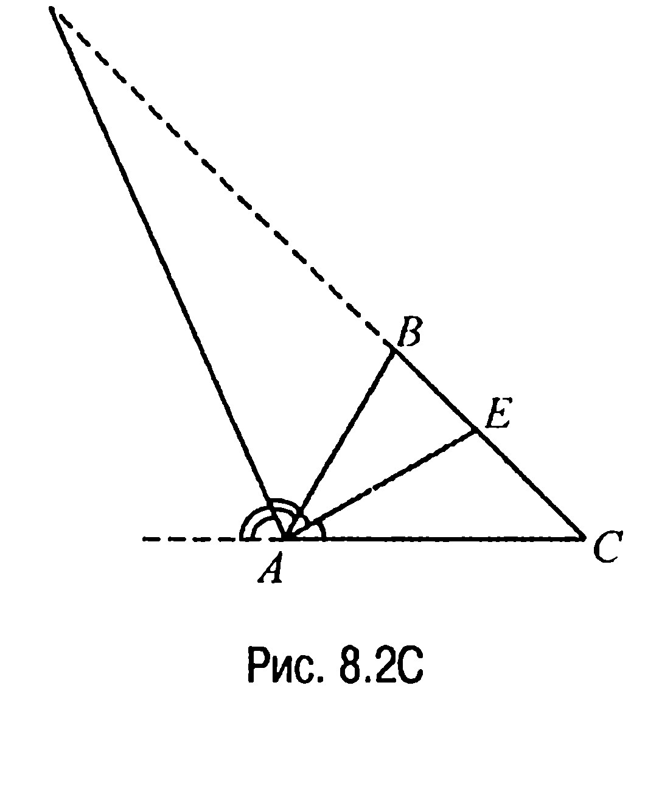
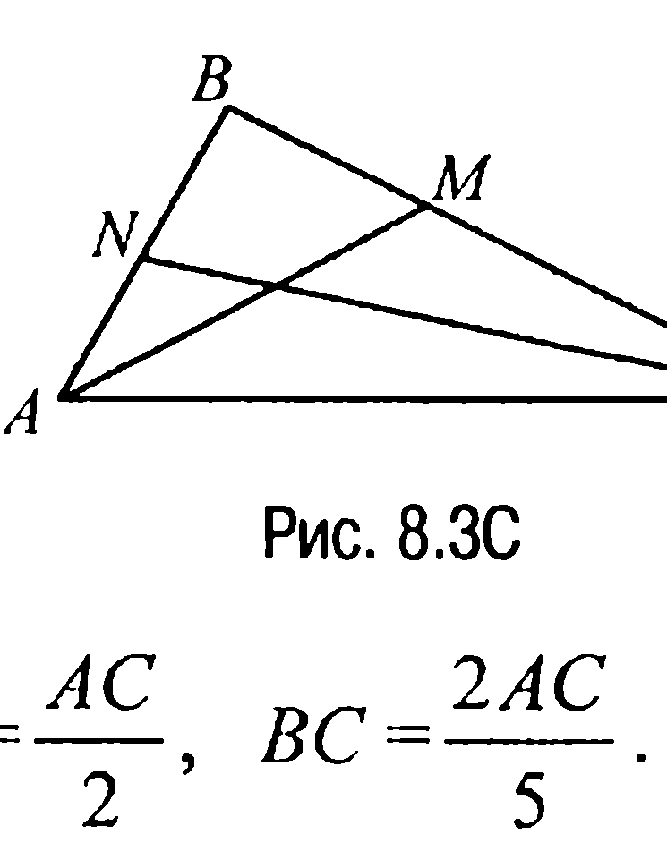
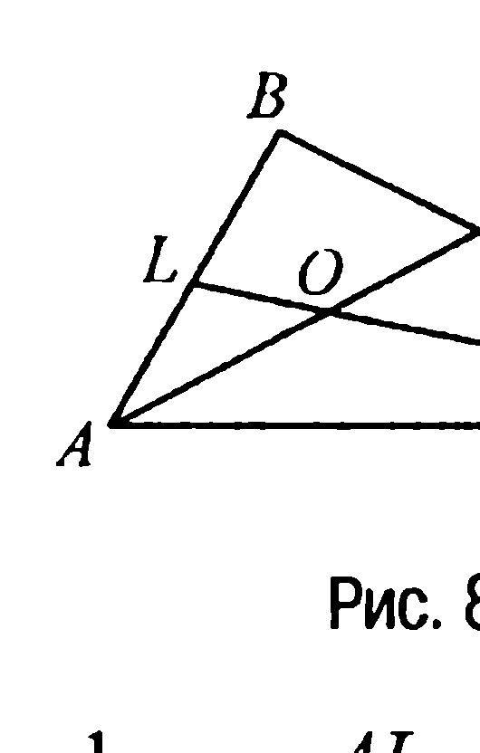
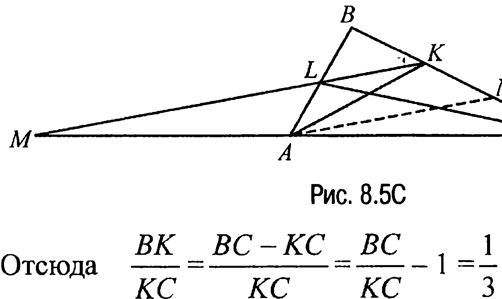
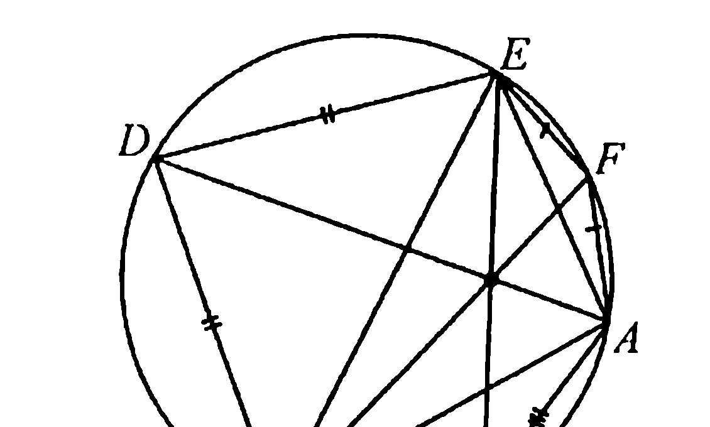
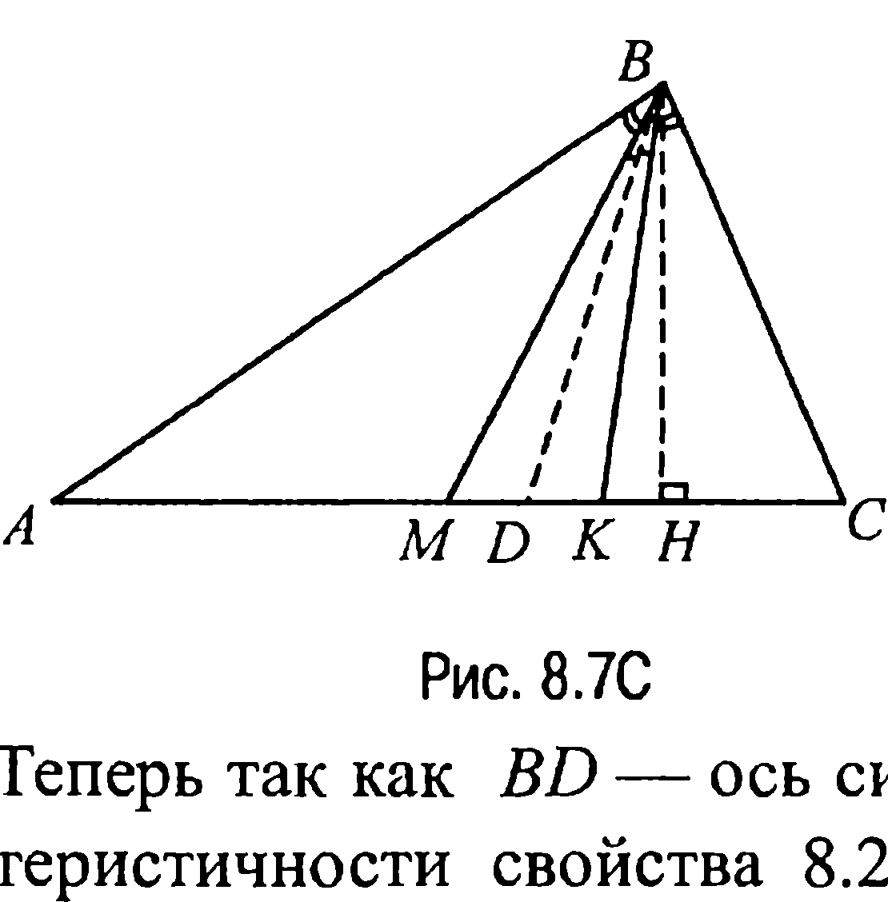
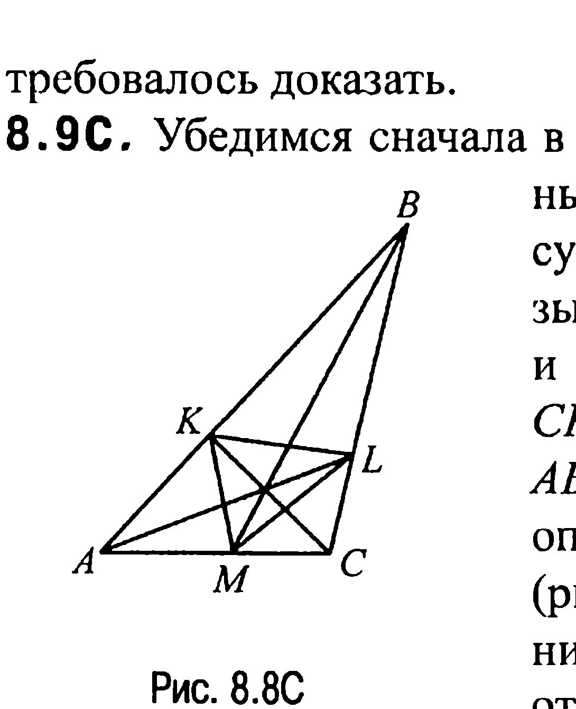
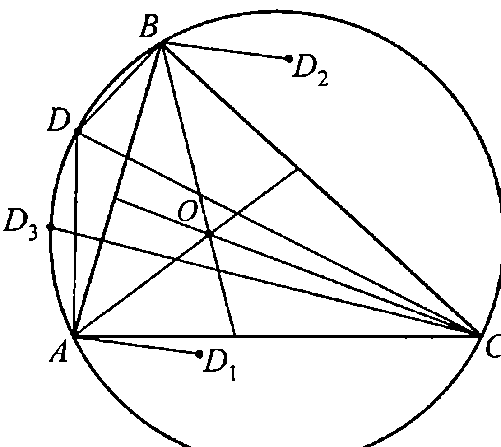
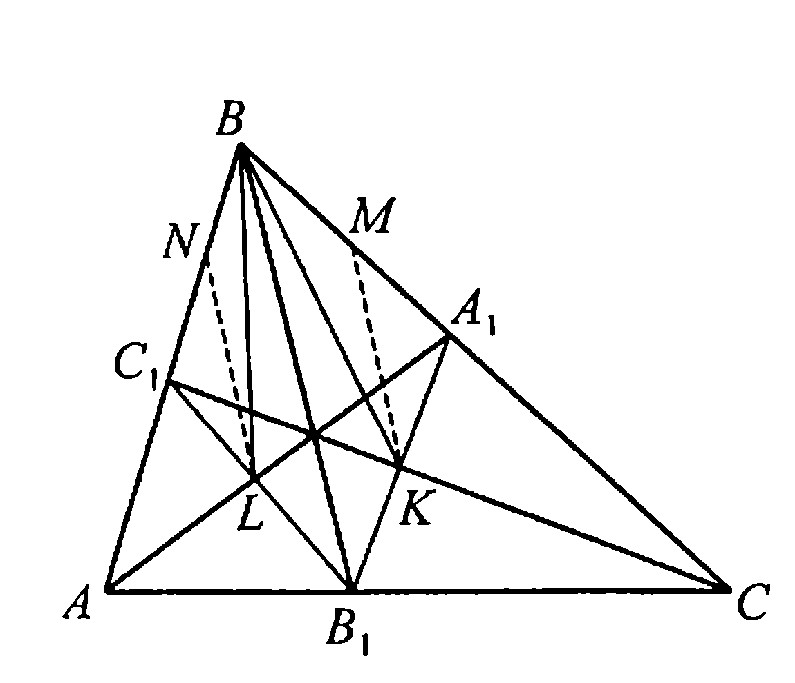

## 9.8. Биссектрисы

---
**стр. 415**
---

**§ 8. Биссектрисы**

**8.1C.** Пусть $AD = \mathcal{L}_a$ — внешняя биссектриса треугольника $ABC$, $AB = c$, $AC = b$, а $DC = b'$, $DB = c'$ (рис. 8.1C).

Опишем около треугольника $ABC$ окружность и продолжим биссектрису $AD$ до пересечения с окружностью в точке $E$. Тогда так как четырехугольник $ABCE$ вписан в окружность, то $\angle AEC = 180^\circ - \angle ABC$.

С другой стороны, $\angle ABD = 180^\circ - \angle ABC$ и, значит, $\angle AEC = \angle ABD$. Далее, поскольку $AD$ — биссектриса внешнего угла треугольника с вершиной $A$, то $\angle DAB = \angle CAE$ и, таким образом, треугольники $ADB$ и $ACE$ подобны. Поэтому $\mathcal{L}_a/b = c/AE$ или $\mathcal{L}_a \cdot AE = b \cdot c$.

Теперь поскольку из свойства 5.5 следует, что произведение каждой секущей на ее внешнюю часть есть число постоянное для всех секущих, то $DE \cdot DA = DC \cdot DB$ или $(\mathcal{L}_a + AE) \cdot \mathcal{L}_a = b' \cdot c'$, т. е. $\mathcal{L}_a^2 + \mathcal{L}_a \cdot AE = \mathcal{L}_a^2 + b \cdot c = b' \cdot c'$, откуда $\mathcal{L}_a^2 = b' \cdot c' - b \cdot c$, что и требовалось доказать.

**8.2C.** Докажем, например, справедливость первой из трех приведенных формул, в остальных двух случаях рассуждения аналогичны.

Именно, при решении задачи 8.1C было доказано, что $\mathcal{L}_a^2 = b' \cdot c' - b \cdot c$ (см. обозначения, используемые при решении задачи 8.1C). Но по свойству 8.8X имеем

$$\frac{b'}{b} = \frac{c'}{c} = k,$$

где $k$ — коэффициент пропорциональности.

Отсюда $b' = k \cdot b$, $c' = k \cdot c$ и, таким образом, $b' - c' = k \cdot (b - c)$.

---
**стр. 416**
---

Но $b' - c' = a$ и поэтому $k = a/(b - c)$. Итак, $b' \cdot c' = k \cdot b \cdot c =$ <!-- вероятная опечатка оригинала: при $b' = kb$, $c' = kc$ должно быть $k^2 \cdot b \cdot c$ -->
$= \frac{a^2 bc}{(b-c)^2}$, а значит, $\mathcal{L}_a^2 = b' \cdot c' - b \cdot c = b \cdot c \left( \frac{a^2}{(b-c)^2} - 1 \right)$.

**8.3С.** Пусть $AD = \mathcal{L}$ — внешняя биссектриса треугольника $ABC$, $AB = a$, $AC = b$, $\angle CAB = \varphi$ (рис. 8.2C). Тогда так как площадь $S$ треугольника $ADC$ равна сумме площадей $S_1$ и $S_2$ треугольников $ADB$ и $ABC$ соответственно, то, учитывая,

что $S = \frac{1}{2} b \cdot \mathcal{L} \cdot \sin\left(90^\circ + \frac{\varphi}{2}\right)$, $S_1 = \frac{1}{2} a \cdot \mathcal{L} \cdot \sin\left(90^\circ - \frac{\varphi}{2}\right)$ ($AE$ — биссектриса треугольника $ABC$), $S_2 = \frac{1}{2} a \cdot b \cdot \sin\varphi$, имеем

$$b \cdot \mathcal{L} \cdot \sin\left(90^\circ + \frac{\varphi}{2}\right) = a \cdot \mathcal{L} \cdot \sin\left(90^\circ - \frac{\varphi}{2}\right) + a \cdot b \cdot \sin\varphi \text{ или } b \cdot \mathcal{L} \cdot \cos\frac{\varphi}{2} =$$

$$= a \cdot \mathcal{L} \cdot \cos\frac{\varphi}{2} + 2a \cdot b \cdot \sin\frac{\varphi}{2} \cdot \cos\frac{\varphi}{2}, \text{ или } \mathcal{L} \cdot (b - a) = 2a \cdot b \cdot \sin\frac{\varphi}{2}.$$

Теперь если $b > a$, то $\mathcal{L} = \frac{2ab \sin\frac{\varphi}{2}}{b - a}$; если же $b < a$, то $\mathcal{L} =$
$= \frac{2ab \sin\frac{\varphi}{2}}{-(b-a)}$. Объединяя две последние формулы, получаем, что $\mathcal{L} = 2a \cdot b \cdot \frac{\sin\frac{\varphi}{2}}{|b - a|}$. А это и требовалось доказать.

**8.4C.** Предположим, что $BM = BC/3$, а $BN = 2AB/7$ (рис. 8.3C). Тогда поскольку $BM = BC/3 = (BM + MC)/3$, то $\frac{2BM}{3} = \frac{MC}{3}$ и,

---
**стр. 417**
---

значит, $\frac{BM}{MC} = \frac{1}{2}$. Аналогично находим, что $\frac{BN}{AN} = \frac{2}{5}$.

По свойству 8.7X $\frac{BM}{MC} = \frac{AB}{AC}$, $\frac{BN}{AN} = \frac{BC}{AC}$, поэтому $AB = = \frac{AC}{2}$, $BC = \frac{2AC}{5}$. Отсюда $AB + BC = \left(\frac{1}{2} + \frac{2}{5}\right) AC = \frac{9}{10} AC < AC$, т. е. $AB + BC < AC$, что противоречит неравенству треугольника и, значит, сделанное выше предположение неверно.

**Ответ:** не может.

**8.5С.** Предположим, что $BK : KC = 1 : 2$, а $LO : OC = 2 : 3$. Поскольку $AK$ и $CL$ — биссектрисы треугольников $ABC$ и $ALC$ (рис. 8.4С) соответственно, то по свойству 8.7X $\frac{AB}{AC} = \frac{BK}{KC}$, а $\frac{AL}{AC} = \frac{LO}{OC}$. Учитывая предположение, получаем, что $\frac{AB}{AC} = \frac{1}{2}$, а $\frac{AL}{AC} = \frac{2}{3}$. Отсюда $AB = \frac{AC}{2}$, а $AL = \frac{2AC}{3}$ и, таким образом, $AL > AB$. Но это противоречит тому, что биссектриса $CL$ пересекает отрезок $AB$ и, следовательно, сделанное предположение не верно.

**Ответ:** не может.

**8.6С.** Отрезки $AK$ и $CL$ — биссектрисы треугольника $ABC$ (рис. 8.5С), поэтому по свойству 8.7X $\frac{BK}{KC} = \frac{AB}{AC} = \frac{1}{3}$, $\frac{BL}{LA} = \frac{BC}{AC} = \frac{5}{6}$. Отсюда $\frac{BK}{KC} = \frac{BC - KC}{KC} = \frac{BC}{KC} - 1 = \frac{1}{3}$ и, значит, $KC = 3BC/4 = 15/4$, $BK = BC - KC = 5/4$.

---
**стр. 418**
---

Пусть $AN \parallel MK$, тогда $\frac{BK}{KN} = \frac{BL}{LA} = \frac{5}{6}$, откуда $KN = 6BK/5 = 3/2$ и, следовательно, $NC = KC - KN = 9/4$. Рассматривая теперь параллельные прямые $AN$ и $MK$ как прямые, пересекающие стороны угла $BCA$, имеем пропорцию $\frac{MA}{KN} = \frac{AC}{NC}$, откуда $MA = \frac{KN \cdot AC}{NC} = 4$.

**Ответ:** $AM = 4$.

**8.7С.** Рассмотрим треугольник $ACE$ (рис. 8.6С). Биссектриса этого треугольника, проведенная из вершины $A$, лежит на отрезке $AD$, так как $CD = DE$ и, значит, $\cup CD = \cup DE$. Аналогично $EB$ и $CF$ — отрезки, на которых лежат биссектрисы того же треугольника $ACE$, проведенные из вершин $E$ и $C$ соответственно.

Но биссектрисы треугольника пересекаются в одной точке (свойство 8.3X), поэтому диагонали $AD$, $EB$ и $CF$ также пересекаются в одной точке, что и требовалось доказать.

**8.8С.** Пусть $BH \perp AC$, где $BH = h$, $AB = c$, $BC = a$, $BM = m$, $BK = n$, $AK = y$, $KC = x$ (рис. 8.7С), и пусть $S_1$ и $S_2$ — площади треугольников $KBC$ и $ABM$ соответственно. Тогда

$$S_1 = \frac{1}{2} x \cdot h = \frac{1}{2} a \cdot n \cdot \sin \angle KBC,$$

$$S_2 = \frac{1}{2} \cdot \frac{x+y}{2} \cdot h = \frac{1}{2} c \cdot m \cdot \sin \angle ABM.$$

Теперь так как $BD$ — ось симметрии угла $MBK$, то в силу характеристичности свойства 8.2X имеем равенство $\angle MBD = \angle DBK$. Отсюда получаем, что $\angle ABM = \angle ABD - \angle MBD = \angle DBC - \angle DBK = \angle KBC$ и, значит, $\sin \angle KBC = \sin \angle ABM$. С учетом этого находим, что

---
**стр. 419**
---

$$\frac{S_1}{S_2} = \frac{2x}{x+y} = \frac{an}{mc} \quad \text{или} \quad x = \frac{x+y}{2} \cdot \frac{an}{mc}$$

Аналогичным образом, заметив, что $S_3 = \frac{1}{2}y \cdot h = \frac{1}{2}n \cdot c \cdot \sin \angle ABK,$

$$S_4 = \frac{1}{2} \cdot \frac{x+y}{2} h = \frac{1}{2} m \cdot a \cdot \sin \angle MBC,$$

где $S_3$ и $S_4$ — площади треугольников $ABK$ и $MBC$ соответственно, и что $\angle ABK = \angle ABD + \angle DBK = \angle DBC + \angle MBD = \angle MBC,$ приходим к выводу, что

$$y = \frac{x+y}{2} \cdot \frac{nc}{ma}.$$

Но в таком случае $\frac{y}{x} = \frac{\frac{x+y}{2} \cdot \frac{nc}{ma}}{\frac{x+y}{2} \cdot \frac{an}{mc}} = \frac{c^2}{a^2},$ а это и требовалось доказать.

**8.9С.** Убедимся сначала в существовании треугольника с указанным в задаче соотношением сторон. На существование такого треугольника указывают неравенства: $3 + 4 > 6$, $4 + 6 > 3$ и $3 + 6 > 4$. Пусть теперь $AL$, $BM$ и $CK$ — биссектрисы треугольника $ABC$, $AB = c$, $BC = a$, $AC = b$, где считаем для определенности, что $a : b : c = 3 : 4 : 6$ (рис. 8.8С). Если сторона $BC$ треугольника $ABC$ разделена биссектрисой $AL$ на отрезки $BL = a_1$ и $LC = a_2$, то с учетом свойства 8.7X получаем систему

$$\begin{cases} a_1 + a_2 = a, \\ \frac{c}{b} = \frac{a_1}{a_2}, \end{cases}$$

решая которую, находим, что $a_1 = \frac{ac}{b + c}$, $a_2 = \frac{ab}{b + c}.$

Подобным образом находятся отрезки $CM = b_1$, $MA = b_2$, $AK = c_1$, $KB = c_2$, на которые делятся стороны $AC$ и $AB$ треугольника $ABC$ биссектрисами $BM$ и $CK$:

$$b_1 = \frac{ab}{a + c}, \quad b_2 = \frac{bc}{a + c}, \quad c_1 = \frac{bc}{a + b}, \quad c_2 = \frac{ac}{a + b}.$$

Далее, поскольку $S_{\triangle ABC} = \frac{1}{2} \cdot b \cdot c \cdot \sin \angle CAB = \frac{1}{2} \cdot a \cdot c \cdot \sin \angle ABC =$

---
**стр. 420**
---

$= \frac{1}{2} a \cdot b \cdot \sin \angle BCA, S_{\Delta AKM} = \frac{1}{2} b_2 \cdot c_1 \cdot \sin \angle CAB, S_{\Delta BLK} =$
$= \frac{1}{2} a_1 \cdot c_2 \cdot \sin \angle ABC, S_{\Delta LCM} = \frac{1}{2} a_2 \cdot b_1 \cdot \sin \angle BCA$, то $\frac{S_{\Delta AKM}}{S_{\Delta ABC}} = \frac{b_2 c_1}{bc} =$
$= \frac{bc}{(a+b) \cdot (a+c)}, \frac{S_{\Delta BLK}}{S_{\Delta ABC}} = \frac{ac}{(a+b) \cdot (a+b)}, \frac{S_{\Delta LCM}}{S_{\Delta ABC}} = \frac{ab}{(a+c) \cdot (b+c)}$.

Найдем теперь искомое отношение. Имеем

$$\frac{S_{\Delta KLM}}{S_{\Delta ABC}} = \frac{S_{\Delta ABC} - S_{\Delta AKM} - S_{\Delta BLK} - S_{\Delta LCM}}{S_{\Delta ABC}} = 1 - \left( \frac{bc}{(a+b) \cdot (a+c)} + \right.$$
$$+ \frac{ac}{(a+b) \cdot (b+c)} + \frac{ab}{(a+c) \cdot (a+c)} \right) = \frac{2abc}{(a+b) \cdot (a+c) \cdot (b+c)} =$$
$$= \frac{2 \cdot 3 \cdot 4 \cdot 6}{(3+4) \cdot (3+6) \cdot (4+6)} = \frac{8}{35}, \text{ т. е. } \frac{S_{\Delta ABC}}{S_{\Delta KLM}} = \frac{35}{8}.$$

**Ответ:** $\frac{35}{8}$.

**8.10С.** Пусть $\angle CAB = \alpha$, $\angle ABC = \beta$, $\angle BCA = \gamma$, $\angle BAD = \varphi$, $O$ — точка пересечения биссектрис треугольника $ABC$, $D_1$, $D_2$ и $D_3$ — точки, симметричные точке $D$ относительно биссектрис углов $CAB$, $ABC$ и $BCA$ соответственно (рис. 8.9С).

Так как отрезки $AD$ и $AD_1$, $BD$ и $BD_2$, $CD$ и $CD_3$ симметричны относительно прямых $AO$, $BO$ и $CO$ соответственно, то эти прямые являются осями симметрии углов $DAD_1$, $DBD_2$ и $DCD_3$, а значит, в силу характеристичности свойства 8.2X, и биссектрисами этих углов.

Таким образом, $\angle DAO = \angle D_1AO$, $\angle DBO = \angle D_2BO$, а $\angle DCO = \angle D_3CO$. Поэтому $\angle D_1AB = \angle D_1AO + \angle BAO = \angle DAO + \angle BAO = (\varphi + \alpha/2) + \alpha/2 = \varphi + \alpha$. Далее, поскольку четырехугольник $ADBC$ — вписанный, то $\angle ADB + \angle BCA = 180^\circ$ или $\angle ADB =$

---
**стр. 421**
---

$= 180^\circ - \gamma$. А так как $\angle BAD + \angle ADB + \angle DBA = 180^\circ$, то $\angle DBA =$
$= 180^\circ - \varphi - \angle ADB = 180^\circ - \varphi - (180^\circ - \gamma) = \gamma - \varphi$. Следовательно,
$\angle D_2BO = \angle DBO = \angle DBA + \angle ABO = \gamma - \varphi + \beta/2$, откуда $\angle ABD_2 =$
$= \angle ABO + \angle D_2BO = \beta/2 + (\gamma - \varphi + \beta/2) = \beta + \gamma - \varphi$.
С учетом же того, что $\angle D_1AB = \varphi + \alpha$, получаем, что $\angle ABD_2 +$ $+ \angle D_1AB = (\beta + \gamma - \varphi) + \varphi + \alpha = \alpha + \beta + \gamma = 180^\circ$ и, следовательно, $AD_1 \parallel BD_2$.

Докажем теперь параллельность отрезков $AD_1$ и $CD_3$, для чего покажем, что $\angle D_1AC = \angle D_3CA$. Имеем $\angle D_3CA = \angle ACB - \angle D_3CB =$ $= \gamma - \angle D_3CO - \angle DCO - \angle DCB$. А тогда, учитывая, что $\angle DCB =$ $= \angle BAD = \varphi = \frac{1}{2}\cup BD$, получаем $\angle D_3CO = \angle DCO = \angle OCB -$ $- \angle DCB = \gamma/2 - \varphi$. Но в таком случае $\angle D_3CA = \gamma - 2(\gamma/2 - \varphi) -$ $- \varphi = \varphi$, т. е. $\angle D_1CA = \angle D_3CA = \varphi$ и, следовательно, $AD_1 \parallel CD_3$.

Таким образом, отрезки $AD_1$, $CD_3$ и $BD_2$ параллельны, а это и требовалось доказать.

**8.11С.** Проведем через точки $L$ и $K$ прямые, параллельные биссектрисе $BB_1$, до пересечения их со сторонами $AB$ и $BC$ в точках $N$ и $M$ соответственно (рис. 8.10С). Докажем, что $\Delta LMB \sim \Delta BMK$.

Действительно, так как $\angle KMA_1 =$ $= \angle B_1BC = \angle ABB_1 = \angle C_1ML$, то $\angle BMK = \angle BNL$, поэтому для доказательства подобия указанных выше треугольников достаточно показать, что $\frac{BM}{MK} = \frac{BN}{NL}$.

По построению $MK \parallel BB_1$, поэтому $\Delta MA_1K \sim \Delta BA_1B_1$. Следовательно, $\frac{MA_1}{BA_1} = \frac{KA_1}{B_1A_1}$ или $\frac{BA_1 - BM}{BA_1} = \frac{B_1A_1 - B_1K}{B_1A_1}$. Отсюда $\frac{BM}{BA_1} =$
