## 9.9. Треугольник. Вписанные, описанные и вневписанные окружности

---
**стр. 422**
---

$= \frac{B_1K}{B_1A_1}$, т. е. $BM = \frac{BA_1 \cdot B_1K}{B_1A_1}$. Далее, из рассмотрения тех же треугольников $MA_1K$ и $BA_1B_1$ следует, что $\frac{MK}{BB_1} = \frac{KA_1}{B_1A_1}$ или $MK =$ $= \frac{BB_1 \cdot KA_1}{B_1A_1}$. Но в таком случае $\frac{BM}{MK} = \frac{B_1K}{KA_1} \cdot \frac{BA_1}{BB_1}$.

Пусть $AB = c$, $BC = a$, $AC = b$. Тогда из треугольников $A_1CB_1$ и $ABC$ по свойству 8.7X получаем следующие пропорции: $\frac{B_1K}{KA_1} =$ $= \frac{CB_1}{CA_1}$, $\frac{A_1B}{CA_1} = \frac{c}{b}$, $\frac{CB_1}{a} = \frac{b - CB_1}{c}$. Из последнего соотношения находим, что $CB_1 = \frac{ab}{a + c}$. Поэтому $\frac{BM}{MK} = \frac{B_1K}{KA_1} \cdot \frac{BA_1}{BB_1} = \frac{CB_1}{CA_1} \cdot \frac{BA_1}{BB_1} =$ $= \frac{BA_1}{CA_1} \cdot \frac{CB_1}{BB_1} = \frac{ac}{(a + c)BB_1}$.

Аналогично доказывается, что и $\frac{BN}{NL} = \frac{ac}{(a + c)BB_1}$. Итак, $\Delta LNB \sim$ $\sim \Delta BMK$, поэтому $\angle NBL = \angle KBM$ и, значит, $\angle LBB_1 = \angle KBB_1$, откуда и следует требуемое.

**§ 9. Треугольник. Вписанные, описанные и вневписанные окружности**

**9.1С.** В соответствии с условием (рис. 9.1С) $BD = p - b$ (задача 9.2), а отрезок $OD$ как радиус вписанной в треугольник $ABC$ окружности равен $(p - b) \cdot \tg \frac{\beta}{2}$ (задача 9.3).

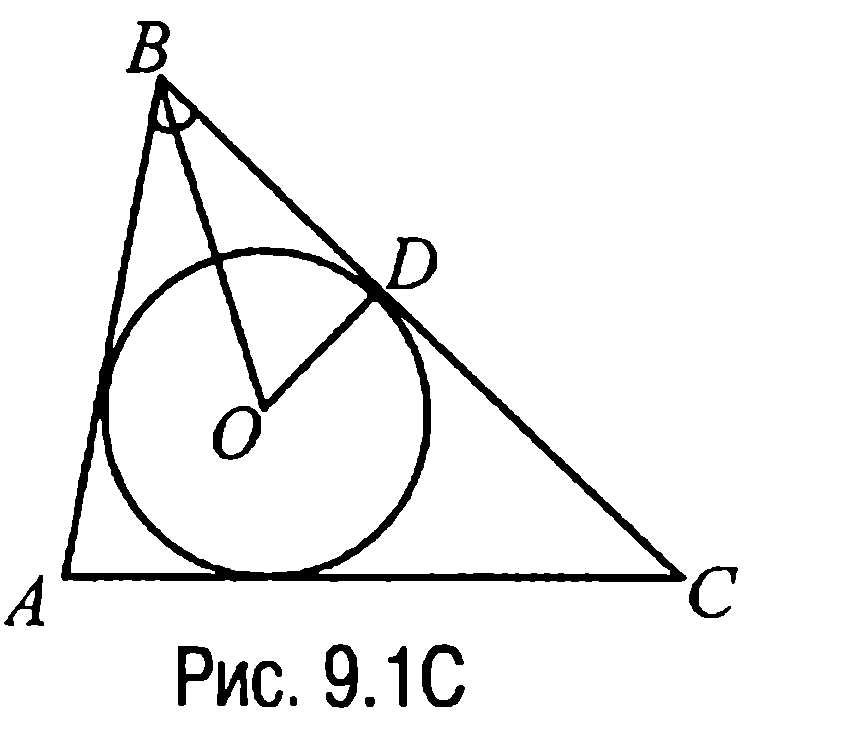

Таким образом, площадь прямоугольного треугольника $BDO$ — это

---
**стр. 423**
---

$S = \frac{1}{2} BD \cdot OD = \frac{1}{2} (p - b)^2 \cdot \tg \frac{\beta}{2}.$

Ответ: $S = \frac{1}{2} (p - b)^2 \cdot \tg \frac{\beta}{2}.$

**9.2С.** Пусть точка $O$ — центр вписанной в треугольник $ABC$ окружности, которая касается сторон $BC = a$, $AC = b$ и $AB = c$ в точках $E$, $F$ и $D$ соответственно (рис. 9.2С).

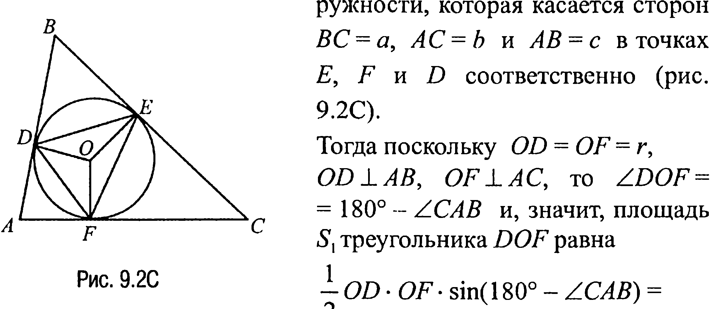

Тогда поскольку $OD = OF = r$, $OD \perp AB$, $OF \perp AC$, то $\angle DOF = 180^\circ - \angle CAB$ и, значит, площадь $S_1$ треугольника $DOF$ равна $\frac{1}{2} OD \cdot OF \cdot \sin(180^\circ - \angle CAB) =$

$= \frac{1}{2} r^2 \cdot \sin \angle CAB$ (теорема 17.4). Аналогично находим, что площадь $S_2$ треугольника $FOE$ равна $\frac{1}{2} r^2 \cdot \sin \angle BCA$, а площадь $S_3$ треугольника $EOD$ вычисляется по формуле $\frac{1}{2} r^2 \cdot \sin \angle ABC$.

Таким образом, площадь $S_0$ треугольника $DEF$ определяется как сумма $S_1 + S_2 + S_3 = \frac{1}{2} r^2 \cdot (\sin \angle CAB + \sin \angle BCA + \sin \angle ABC)$. Но (задача 9.4) $\sin \angle CAB = \frac{a}{2R}$, $\sin \angle BCA = \frac{c}{2R}$, $\sin \angle ABC = \frac{b}{2R}$ и, следовательно, $S_0 = \frac{r^2}{4R} \cdot (a + b + c)$. Учитывая же, что площадь $S$ треугольника $ABC$ равна $\frac{1}{2}(a + b + c)r$ (задача 9.1), приходим к выводу, что $\frac{S_0}{S} = \frac{r^2(a+b+c)}{4R} : \frac{r(a+b+c)}{2} = \frac{r}{2R}$. А это и требовалось доказать.

---
**стр. 424**
---

**9.3С.** Пусть $O$ — центр вписанной в треугольник $ABC$ окружности, $O_1$ — центр вневписанной окружности того же треугольника, касающейся стороны $BC$, а $D$ — точка пересечения биссектрисы угла $BAC$ с окружностью, описанной около треугольника $ABC$ (рис. 9.3С).

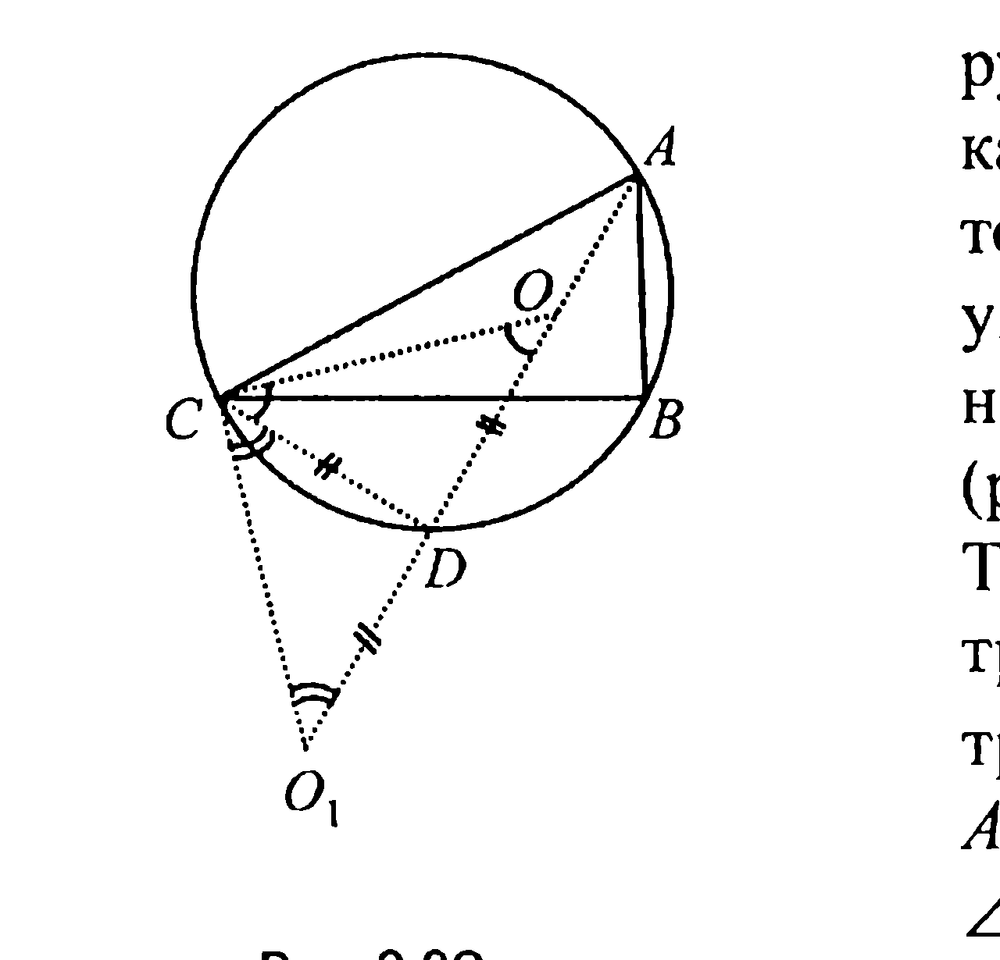

Тогда так как луч $CO$ — биссектриса угла $ACB$, а $CO_1$ — биссектриса внешнего угла треугольника $ABC$ при вершине $C$ (рис. 9.3С), то $\angle O_1CO = 90^\circ$. В соответствии же с задачей 9.11 отрезок $DC = DO$.

Пусть $\angle COD = \varphi$. Тогда в равнобедренном треугольнике $CDO$ угол $DCO$ также равен $\varphi$ и, таким образом, $\angle O_1CD = 90^\circ - \varphi$. С другой стороны, в прямоугольном треугольнике $OCO_1$ угол $CO_1O$ равен $180^\circ - 90^\circ - \varphi = 90^\circ - \varphi$ и, значит, $\angle O_1CD = \angle DO_1C$. Отсюда приходим к выводу, что $DC = DO_1$.

Но как было показано выше имеет место и равенство $DC = DO$. Последнее и означает, что $DO = DO_1$, а это и доказывает требуемое.

**9.4С.** Пусть $O$ — центр окружности, вписанной в треугольник $ABC$, а $D$ — точка пересечения прямой $BO$ с окружностью, описанной около треугольника $ABC$ (рис. 9.4С).

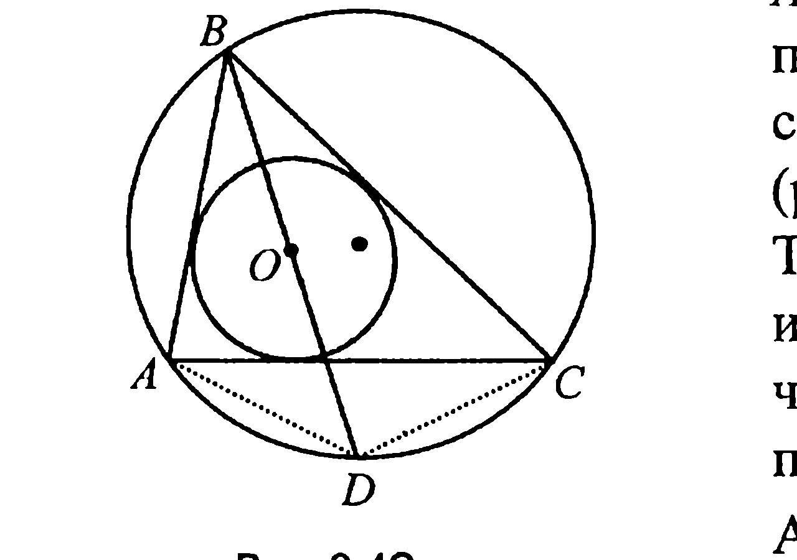

Тогда (задача 9.11) $DA = DO = DC$ и, значит, окружность, проходящая через точки $A$ и $C$, с центром $D$ проходит и через точку $O$.

Аналогично показывается, что через точку $O$ проходят и окружности с центрами в серединных точках дуг $AB$ и $BC$. А это и доказывает требуемое.

---
**стр. 425**
---

▼ **9.5С. а)** Пусть $F$ — точка касания со стороной $AB$ вписанной в треугольник $ABC$ окружности, $D$ и $E$ — диаметрально противоположные точки описанной около треугольника $ABC$ окружности $s$, $G$ — точка пересечения биссектрисы угла $ABC$ ($\angle ABC = 2\alpha$) с окружностью $s$ (рис. 9.5С).

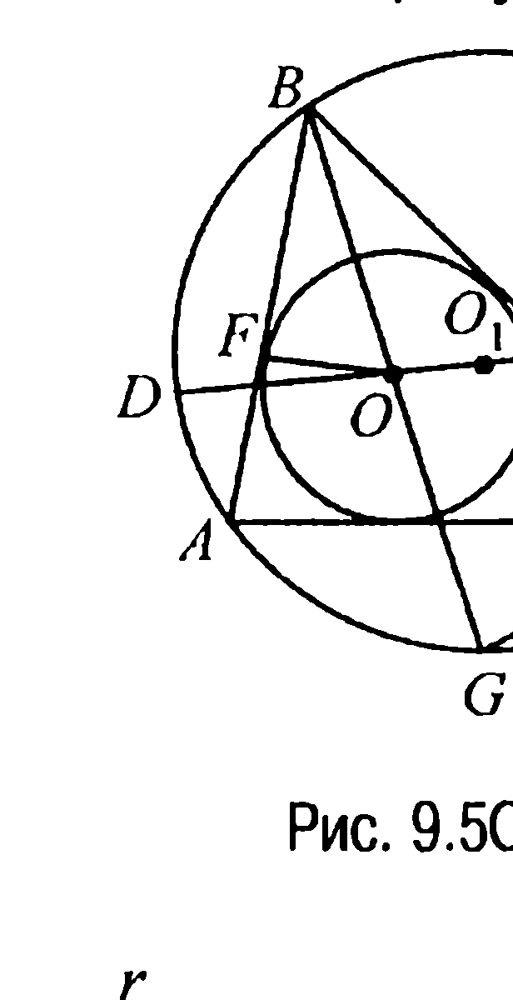

Тогда в прямоугольном треугольнике $OFB$ гипотенуза $BO = \frac{OF}{\sin \alpha} = \frac{r}{\sin \alpha}$, а из треугольника $BCG$ — что (задача 9.4) $\frac{GC}{\sin \alpha} = 2R$. Но $GC = OG$ (задача 9.4С) и поэтому $BO \cdot OG = \frac{r}{\sin \alpha} \cdot 2R \cdot \sin \alpha = 2r \cdot R$.

Далее, $DO = R - OO_1$, $OE = R + OO_1$ и, значит, так как $DO \cdot OE = BO \cdot OG$ (свойство 4.5X), $(R - OO_1) \cdot (R + OO_1) = 2r \cdot R$ или $OO_1^2 = R^2 - 2r \cdot R$.

**б)** На рис. 9.6С точки $F$ и $G$ — это такие же точки, что и на рис. 9.5С. Пусть, далее, $O_2B$ и $O_2L$ — секущие окружности $s$, где $K$ — точка пересечения $O_2L$ с $s$ (рис. 9.6С).

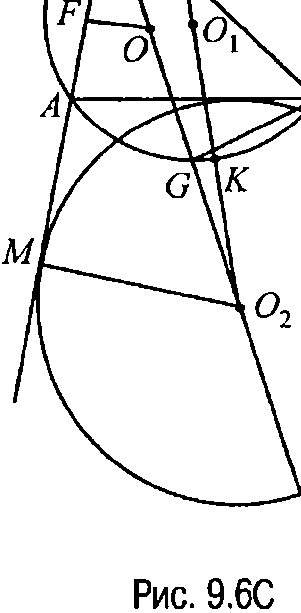

Тогда (свойство 5.5) $O_2B \cdot O_2G = O_2L \cdot O_2K$ и, значит, так как $O_2L = O_1O_2 + R$, $O_2K = O_1O_2 - R$, то получаем, что $O_2B \cdot O_2G = O_1O_2^2 - R^2$.

Но $GC = 2R \cdot \sin \alpha$ (см. пункт а)), в прямоугольном треугольнике $O_2MB$ гипотенуза $O_2B = \frac{MO_2}{\sin \alpha} = \frac{\rho}{\sin \alpha}$, а $O_2G = GC$, так как точки $O_2$ и $C$ лежат на одной окружности с центром в точке $G$ (задача 9.3С).

Таким обра-

---
**стр. 426**
---

Глава 9. Решения задач группы С

зом, $O_2B \cdot O_2G = \frac{\rho}{\sin \alpha} \cdot 2R \cdot \sin \alpha = 2\rho \cdot R$ и, следовательно, $2\rho \cdot R = O_1O_2^2 - R^2$ или $O_1O_2^2 = R^2 + 2\rho \cdot R$.

в) Поскольку, с одной стороны, $OO_2 = 2GC$, а, с другой, $OO_2 = O_2B - BO$, то $OO_2^2 = 2GC \cdot (O_2B - BO)$ (рис. 9.6C). Таким образом, учитывая, что $O_2B = \frac{\rho}{\sin \alpha}$ (пункт б)), а $BO = \frac{r}{\sin \alpha}$, $GC = 2R \cdot \sin \alpha$ (пункт а)), получаем, что $OO_2^2 = 4R \cdot \sin \alpha \cdot \frac{\rho - r}{\sin \alpha} = 4R \cdot (\rho - r)$, а это и требовалось доказать.

**9.6C.** Пусть некоторые окружности $s_1$ и $s_2$, касаясь друг друга в точке $C$, касаются прямой в точках $A$ и $B$ (рис. 9.7C). Тогда если через $D$ обозначить точку пересечения касательной к окружностям $s_1$ и $s_2$, проходящей через точку $C$, с прямой $AB$, то $DA = DC = DB$ (свойство 5.2). Но в таком случае точка $D$ будет центром окружности диаметра $AB$, описанной около треугольника $ACB$. Последнее означает, что требуемое множество — это множество точек окружности диаметра $AB$ без точек $A$ и $B$.

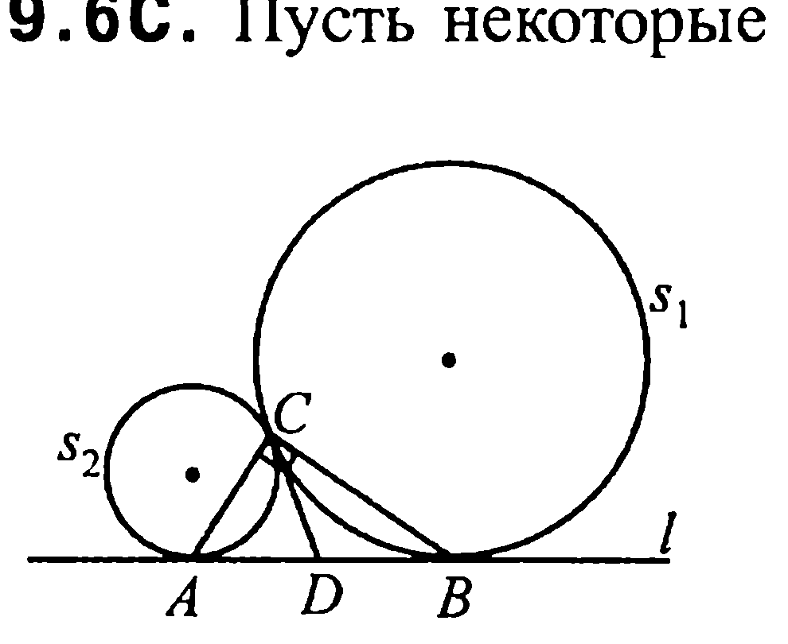

**Ответ:** множество точек окружности диаметра $AB$ без точек $A$ и $B$.

**Замечание 9.1.** Из решения задачи 9.6C следует, что $\angle ACB = 90^\circ$.

**9.7C.** Из задачи 9.2 следует, что (рис. 9.8C) $ED = \frac{1}{2}(a + AD + BD) - a$, $FD = \frac{1}{2}(b + CD + BD) - b$. А тогда так как $AD = CD$, то $EF = ED - FD = \frac{1}{2}|a - b|$. Знак абсолютной величины здесь ставить необходимо, поскольку возможен случай, когда $ED < FD$.

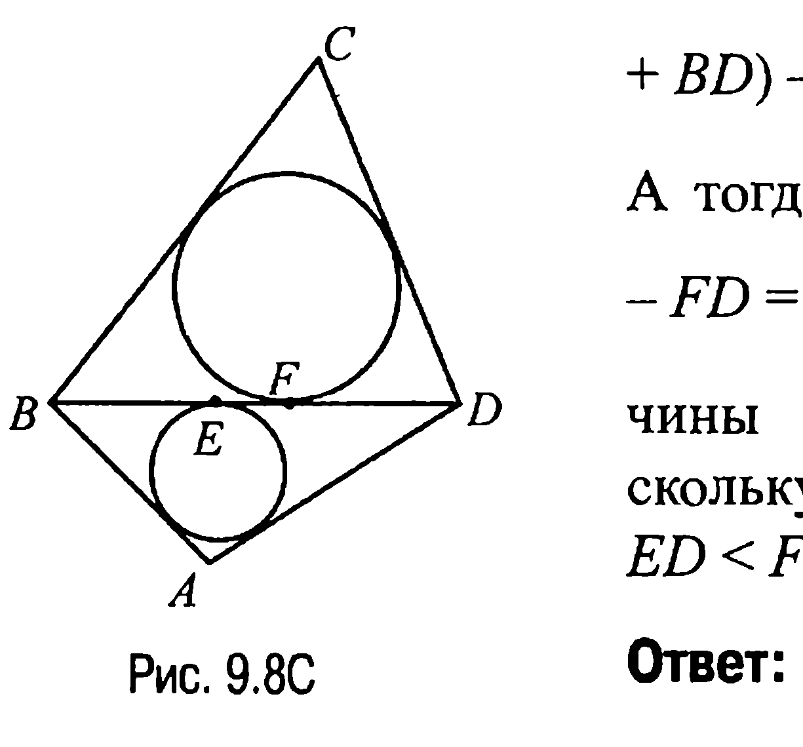

**Ответ:** $EF = \frac{1}{2}|a - b|$.

---
**стр. 427**
---

§ 9. Задачи группы C

**9.8C.** Пусть $BC = a$, $AC = b$, $AB = c$, $p$ — полупериметр треугольника $ABC$, $r$ — радиус вписанной в него окружности, $S$ — площадь треугольника $ABC$ (рис. 9.9C). Тогда (задача 9.2) $AD = AF = p - a$. Радиус же $r = S/p = \sqrt{\frac{(p-a)(p-b)(p-c)}{p}}$ (задача 9.1 и формула Герона).

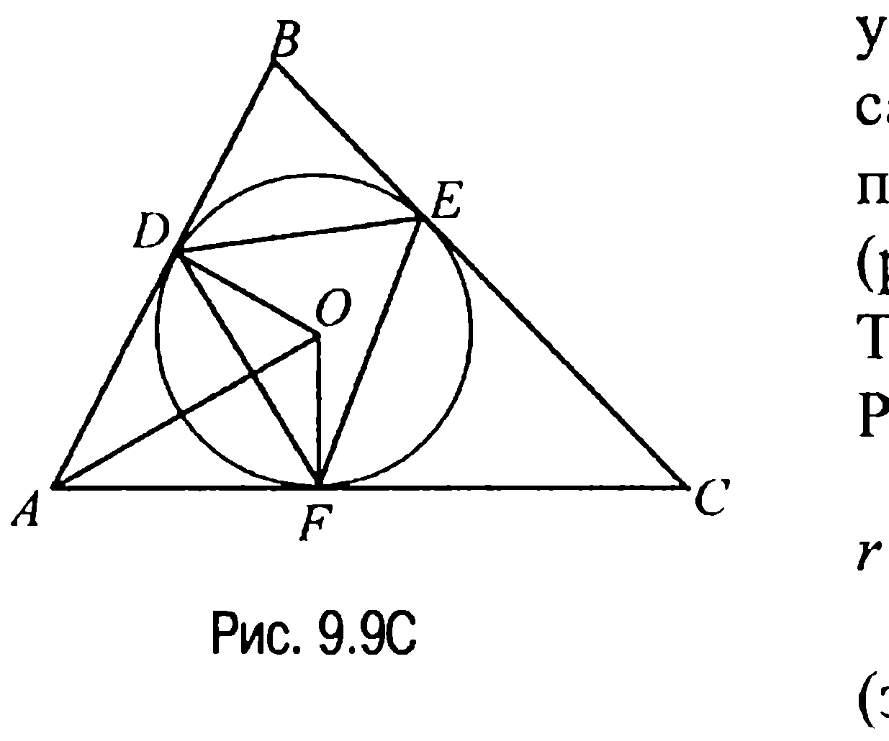

Замечая теперь, что $AO \perp DF, AF \perp OF, AD \perp DO$, приходим к выводу, что площадь $S^*$ четырехугольника $ADOF$ определяется по формуле $S^* = AF \cdot OF$ или по формуле $S^* = \frac{1}{2} AO \cdot DF$, отсюда

$$AF \cdot OF = \frac{1}{2} AO \cdot DF, \text{ т. е. } DF = \frac{2 AF \cdot OF}{AO} = \frac{2 AF \cdot OF}{\sqrt{AF^2 + OF^2}} =$$

$$= \frac{2(p-a) \sqrt{\frac{(p-a)(p-b)(p-c)}{p}}}{\sqrt{(p-a)^2 + \frac{(p-a)(p-b)(p-c)}{p}}} = 2(p-a) \sqrt{\frac{(p-b)(p-c)}{bc}}.$$

Из этой формулы круговой (циклической) перестановкой букв находим, что

$$DE = 2(p-b) \sqrt{\frac{(p-a)(p-c)}{ac}}, \quad EF = 2(p-c) \sqrt{\frac{(p-a)(p-b)}{ab}}.$$

**Ответ:** $2(p-a) \sqrt{\frac{(p-b)(p-c)}{bc}}; 2(p-b) \sqrt{\frac{(p-a)(p-c)}{ac}};$
$2(p-c) \sqrt{\frac{(p-a)(p-b)}{ab}}$.

**9.9C.** Обозначим радиус окружности, вписанной в треугольник $ABC$, через $r$, $AD = AF = x$, $DB = BE = y$, $EC = CF = z$ (рис. 9.10C). Тогда $y + z = a$, $yz = 4r^2$ (свойство 3.8). Пусть далее $p$ — полупериметр треугольника $ABC$. В рассматриваемой задаче $p = x + y + z = x + a$.

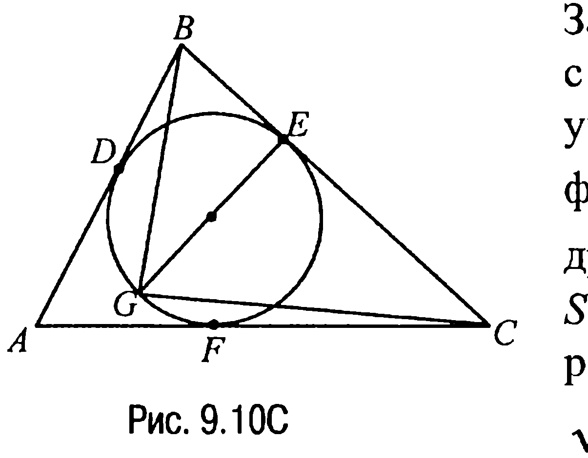

---
**стр. 428**
---

Глава 9. Решения задач группы С

Замечая теперь, что в соответствии с формулой Герона площадь $S$ треугольника $ABC$ вычисляется по формуле $S = \sqrt{(x + y + z)xyz}$, а, с другой стороны (задача 9.1), $S = (x + y + z) \cdot r$, приходим к равенству

$$\sqrt{(x + y + z)xyz} = (x + y + z) r$$

или к равенству $4r^2 \cdot x = (x + a) \cdot r^2$, откуда $x = a/3$.

**Ответ:** $AD = a/3$.

**9.10C.** Пусть $D$ — точка пересечения окружностей с центрами $O_1$, $O_2$ и $O_3$ (рис. 9.11C). Тогда радиус этих окружностей $r = DO_1 = DO_2 = DO_3$ есть и радиус окружности, описанной около треугольника $O_1O_2O_3$. Отмечая теперь тот очевидный факт, что центры вписанных в треугольники $ABC$ и $O_1O_2O_3$ окружностей совпадают (пусть это будет точка $O$), а также, что расстояние между сторонами треугольников $ABC$ и $O_1O_2O_3$ равно $r$, а сами треугольники подобны, поскольку $O_1O_2 \parallel AB$, $O_2O_3 \parallel BC$, $O_1O_3 \parallel AC$, приходим к равенству $\frac{\rho}{R} = \frac{\rho - r}{r}$, где $\rho - r$ — радиус окружности, вписанной в треугольник $O_1O_2O_3$. Отсюда находим, что $\rho = \frac{Rr}{R - r}$.

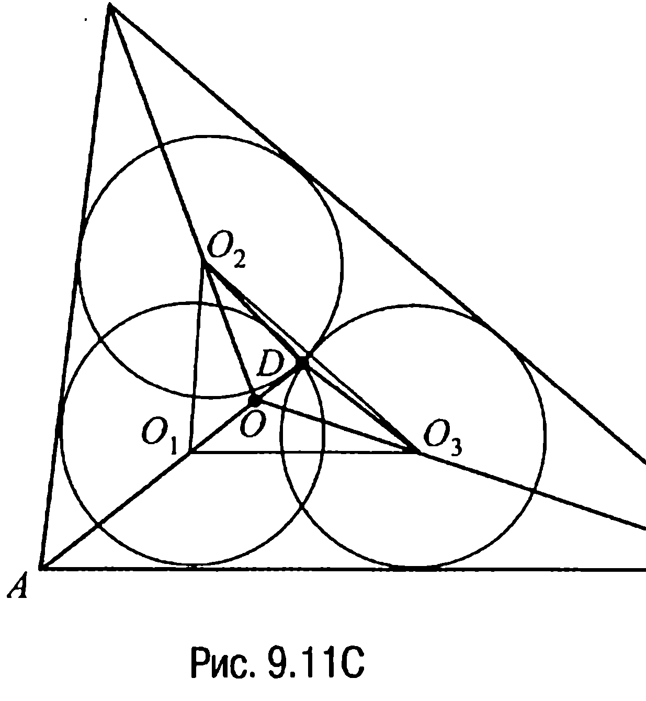

**Ответ:** $\rho = \frac{Rr}{R - r}$.
