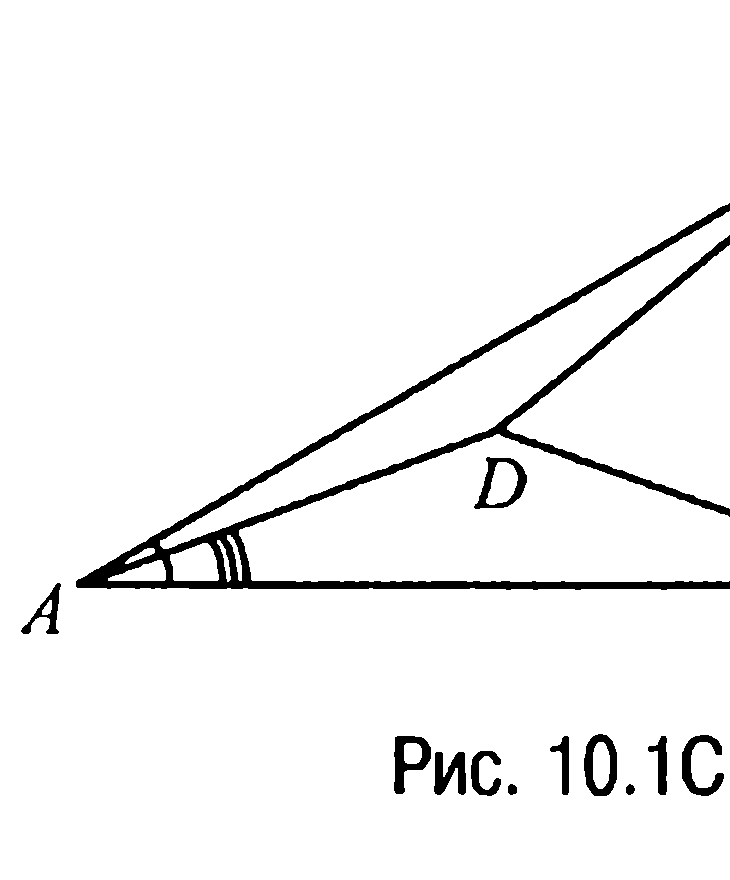
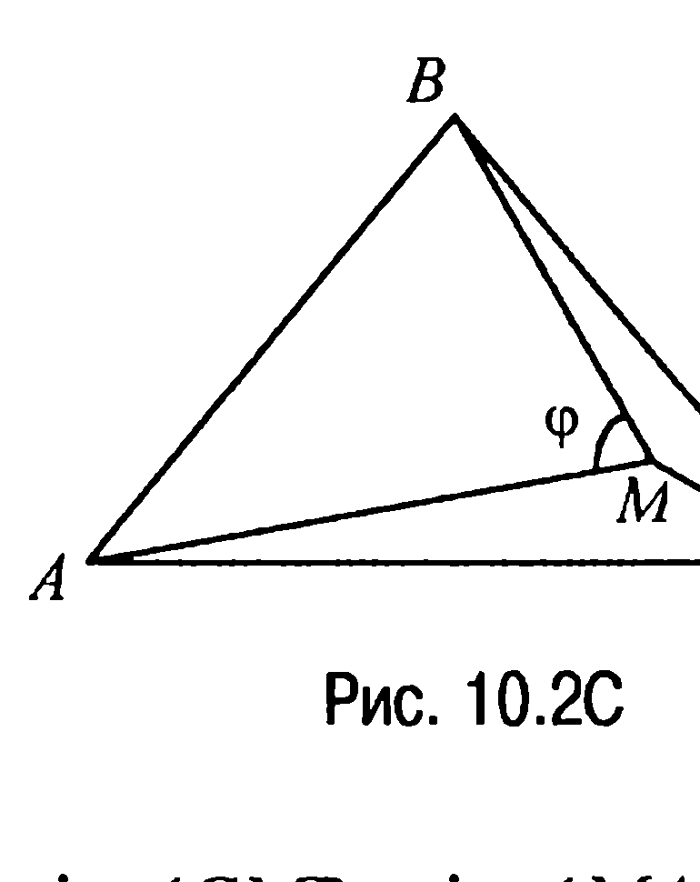
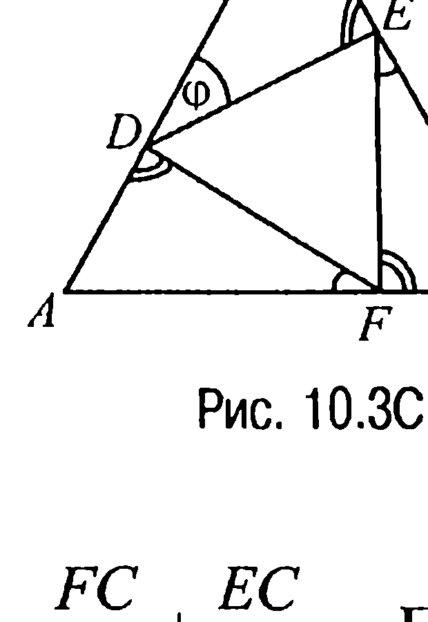
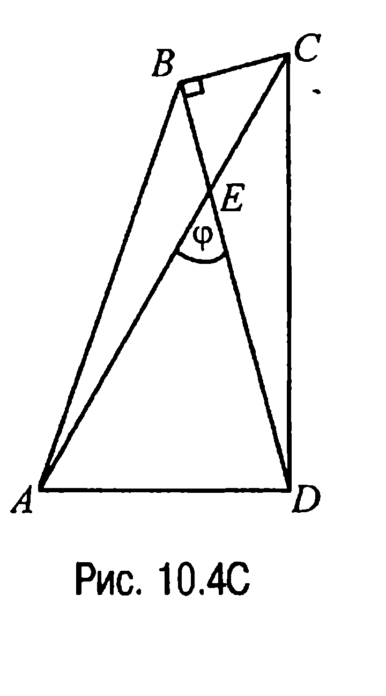
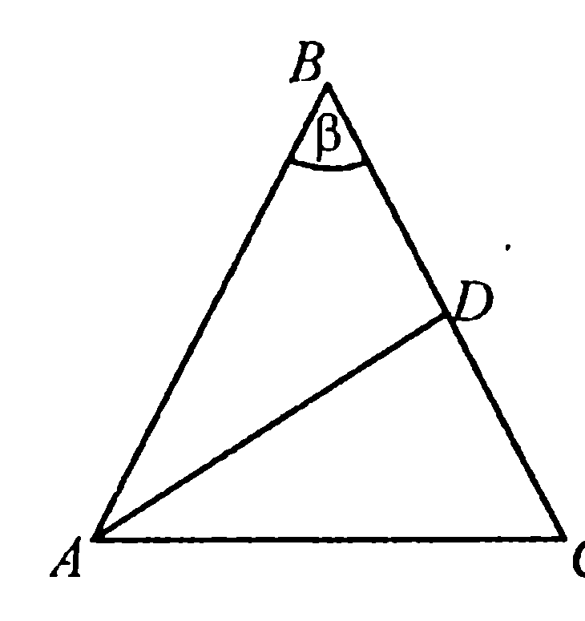
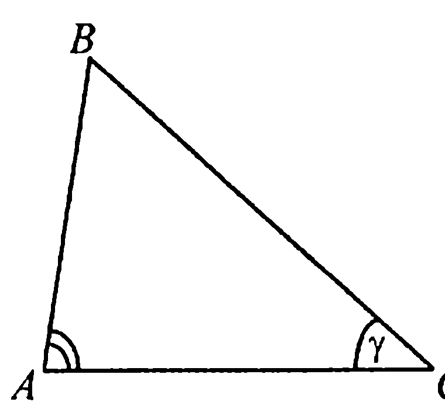

## 9.10. Теорема синусов

---
**стр. 429**
---

**§ 10. Теорема синусов**

**10.1C.** Из условия задачи следует, что точка $D$ (рис. 10.1C) —
центр описанной около треугольника $ABC$ окружности. Действительно, если $R$ — радиус указанной окружности, то $R = \frac{BC}{2\sin 30^\circ} = BC = CD =$
$= DB = AD$.

Отсюда, в частности, следует, что треугольник $ADC$ равнобедренный и, значит, $\angle CAD = \angle MCA$. Но $\angle BCA = 80^\circ$, а $\angle BCD = 60^\circ$, поэто-
му $\angle CAD = 80^\circ - 60^\circ = 20^\circ$.

**Ответ:** $\angle CAD = 20^\circ$.

**10.2C.** Обозначим угол $BMA$ через $\varphi$ (рис. 10.2C). Тогда из условия задачи следует, что $\angle BCM = 20^\circ$, $\angle MAB = 40^\circ$, $\angle AMC = 140^\circ$, $\angle CMB =$
$= 220^\circ - \varphi$. Из треугольников $BCM$ и $BMA$ по теореме синусов имеем $\frac{BC}{BM} = \frac{\sin\angle CMB}{\sin\angle BCM}$, $\frac{BM}{AB} = \frac{\sin\angle MAB}{\sin\angle BMA}$.

Теперь так как $\frac{BC}{BM}\cdot\frac{BM}{AB} = \frac{BC}{AB} = 1$, то
$\frac{\sin\angle CMB}{\sin\angle BCM}\cdot\frac{\sin\angle MAB}{\sin\angle BMA} = \frac{\sin(220^\circ - \varphi)\cdot\sin 40^\circ}{\sin 20^\circ\cdot\sin\varphi} = \frac{2\sin(\varphi - 40^\circ)\cos 20^\circ}{\sin\varphi} =$
$= \frac{\sin(\varphi - 20^\circ) + \sin(\varphi - 60^\circ)}{\sin\varphi} = 1$ и, таким образом, $\sin\varphi - \sin(\varphi - 60^\circ) = \sin(\varphi - 20^\circ)$ или $2\sin 30^\circ\cdot\cos(\varphi - 30^\circ) = \sin(\varphi - 20^\circ)$, или $\cos(\varphi - 30^\circ) = \cos(110^\circ - \varphi)$. Решая полученное уравнение, нахо-
дим, что $\varphi = 70^\circ$.

**Ответ:** $\angle BMA = 70^\circ$.

**10.3C.** Пусть $\angle EDB = \varphi$ (рис. 10.3C). Тогда $\angle BED = 180^\circ - \angle EDB - \angle DBE = 120^\circ - \varphi$, $\angle FEC = 180^\circ - \angle BED - \angle DEF = \varphi$, $\angle CFE = 180^\circ - \angle ECF - \angle FEC = 120^\circ - \varphi$. Аналогично показывается, что $\angle DFA = \varphi$, а $\angle ADF = 120^\circ - \varphi$.

---
**стр. 430**
---

Таким образом, учитывая, что $DE = EF =$
$= FD$, приходим к выводу, что треугольники $DBE$, $ECF$ и $FAD$ равны и, значит, в частности, $BE = FC$. Теперь поскольку треугольники $ABC$ и $DEF$ подобны, то их площади $S$ и $S_1$ относятся как квадраты сходственных сторон и, следовательно,

$\sqrt{3} = \sqrt{\frac{S}{S_1}} = \frac{BC}{EF} = \frac{BE + EC}{EF} = \frac{FC + EC}{EF} =$
$= \frac{FC}{EF} + \frac{EC}{EF}$. По теореме синусов из треугольника $ECF$ имеем
$\frac{FC}{\sin\angle FEC} = \frac{EF}{\sin\angle ECF}$, $\frac{EC}{\sin\angle CFE} = \frac{EF}{\sin\angle ECF}$. Но тогда
$\sqrt{3} = \frac{\sin\angle FEC}{\sin\angle ECF} + \frac{\sin\angle CFE}{\sin\angle ECF} = \frac{\sin\varphi}{\sin 60^\circ} + \frac{\sin(120^\circ - \varphi)}{\sin 60^\circ} = 2\cos(60^\circ - \varphi)$
и, значит, $\cos(60^\circ - \varphi) = \sqrt{3}/2$, где $0 < \varphi < 180^\circ$. Решая это урав-
нение, находим, что или $\varphi = 30^\circ$, и тогда $EF \perp AC$, $FD \perp AB$,
$DE \perp BC$, или $\varphi = 90^\circ$, и тогда $EF \perp BC$, $FD \perp AC$, $DE \perp AB$, что
и требовалось доказать.

**10.4C.** Обозначим угол $AED$ через $\varphi$ (рис. 10.4C). Тогда $\angle ABE =$
$= \varphi - 15^\circ$, $\angle BCE = 90^\circ - \varphi$, $\angle CDE = \varphi - 30^\circ$, $\angle DAE = 105^\circ - \varphi$ и по теореме синусов из треугольников $ABE$, $BCE$, $CDE$, $DAE$ соответственно имеем $\frac{AE}{BE} = \frac{\sin(\varphi - 15^\circ)}{\sin 15^\circ}$, $\frac{BE}{CE} = \frac{\sin(90^\circ - \varphi)}{\sin 90^\circ}$, $\frac{CE}{DE} = \frac{\sin(\varphi - 30^\circ)}{\sin 30^\circ}$, $\frac{DE}{AE} = \frac{\sin(105^\circ - \varphi)}{\sin 75^\circ}$.

Отсюда $\frac{AE}{BE}\cdot\frac{BE}{CE}\cdot\frac{CE}{DE}\cdot\frac{DE}{AE} =$
$= \frac{\sin(\varphi - 15^\circ)\sin(90^\circ - \varphi)\sin(\varphi - 30^\circ)\sin(105^\circ - \varphi)}{\sin 15^\circ \cdot \sin 90^\circ \cdot \sin 30^\circ \cdot \sin 75^\circ} = 1$ или

---
**стр. 431**
---

$\sin(\varphi - 15^\circ) \cdot \sin(90^\circ - \varphi) \cdot \sin(\varphi - 30^\circ) \cdot \sin(105^\circ - \varphi) =$
$= \sin 15^\circ \cdot \sin 90^\circ \cdot \sin 30^\circ \cdot \sin 75^\circ$, или $(2\sin(\varphi - 15^\circ)\cdot\sin(105^\circ - \varphi)) \times$
$\times (2\sin(\varphi - 30^\circ)\cdot\sin(90^\circ - \varphi)) = 2\sin 15^\circ \cdot \cos 15^\circ$, или
$(\cos(2\varphi - 120^\circ) - \cos 90^\circ) \cdot (\cos(2\varphi - 120^\circ) - \cos 60^\circ) = \frac{1}{2}$, или, нако-
нец, $2\cos^2(2\varphi - 120^\circ) - \cos(2\varphi - 120^\circ) - 1 = 0$. Решая это уравне-
ние, находим, что $\varphi = 60^\circ$.

**Ответ:** $\angle AED = 60^\circ$.

**10.5C.** Рассмотрим треугольник $ABD$ (рис. 10.5C), в котором $AB = 2BD$ и из которого по теореме синусов следует, что $\frac{AB}{BD} = \frac{\sin\angle BDA}{\sin\angle DAB} = \frac{\sin(180^\circ - \beta - \angle DAB)}{\sin\angle DAB} = \frac{\sin(\beta + \angle DAB)}{\sin\angle DAB} =$
$= \frac{\sin\beta\cos\angle DAB + \cos\beta\sin\angle DAB}{\sin\angle DAB} = \sin\beta\cdot\text{ctg}\angle DAB + \cos\beta = 2$.

Отсюда $\text{ctg}\angle DAB = \frac{2 - \cos\beta}{\sin\beta}$ и, значит, $\angle DAB = \text{arcctg}\frac{2 - \cos\beta}{\sin\beta}$.

**Ответ:** $\angle DAB = \text{arcctg}\frac{2 - \cos\beta}{\sin\beta}$.

**10.6C.** Пусть $ABC$ — данный треугольник и пусть $\angle BCA = \gamma$, $AB = x$, $\angle CAB = 2\gamma$, $BC = x + 2$ и $AC = 5$ (рис. 10.6C). Тогда $\angle ABC = 180^\circ - 3\gamma$ и по теореме синусов
$\frac{x}{\sin\gamma} = \frac{5}{\sin(180^\circ - 3\gamma)} = \frac{x + 2}{\sin 2\gamma}$.

Отсюда, имея в виду тот факт, что $\sin 3\gamma = 3\sin\gamma - 4\sin^3\gamma$, находим, что
$x = \frac{5\sin\gamma}{\sin 3\gamma} = \frac{5}{3 - 4\sin^2\gamma}$, а $x + 2 = \frac{5\sin 2\gamma}{\sin 3\gamma} =$
$= \frac{10\cos\gamma}{3 - 4\sin^2\gamma}$. Следствием последних двух соотношений является
