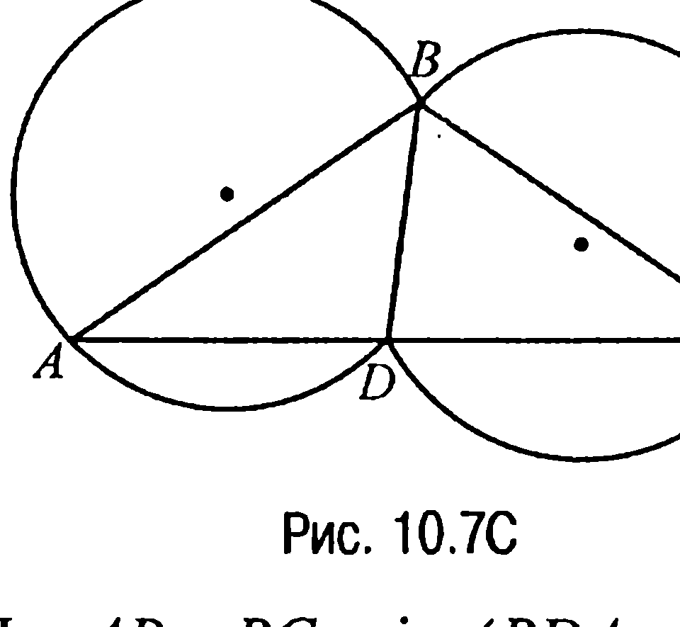
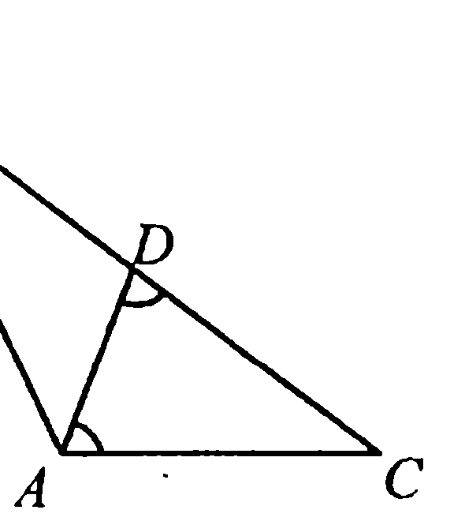
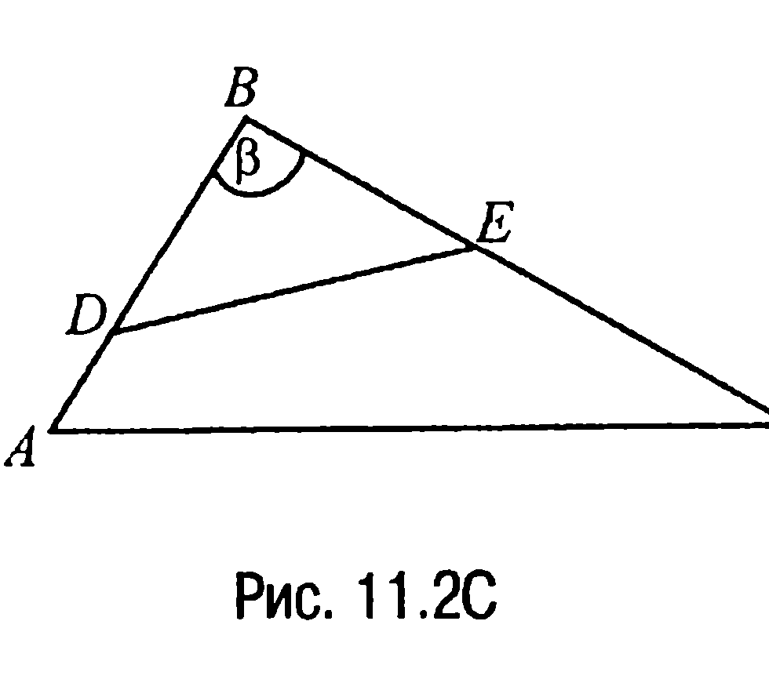
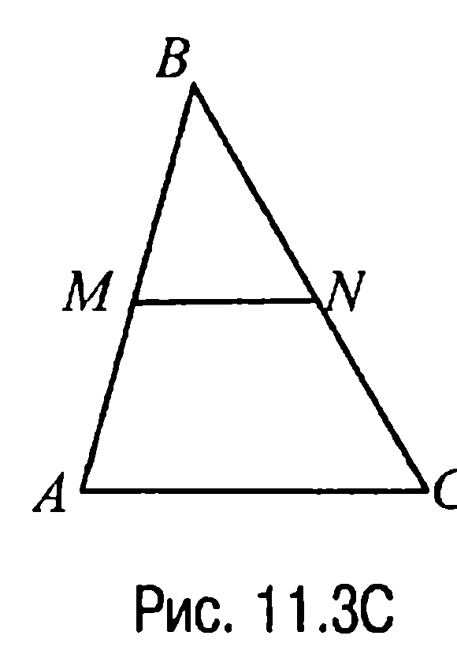
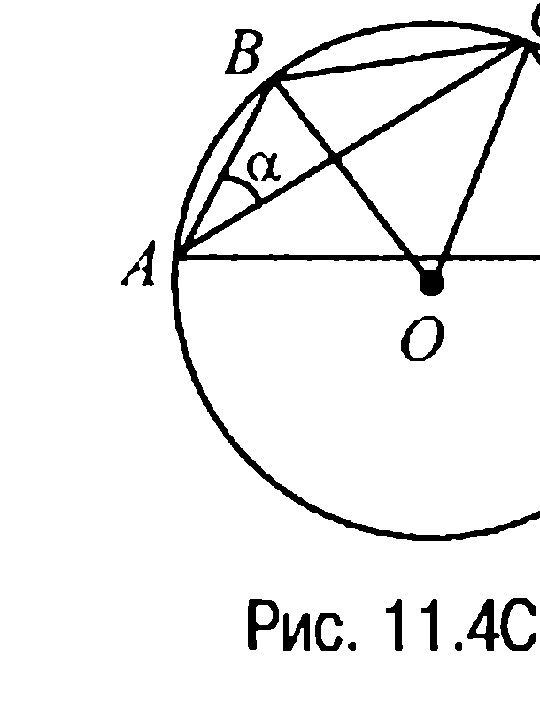
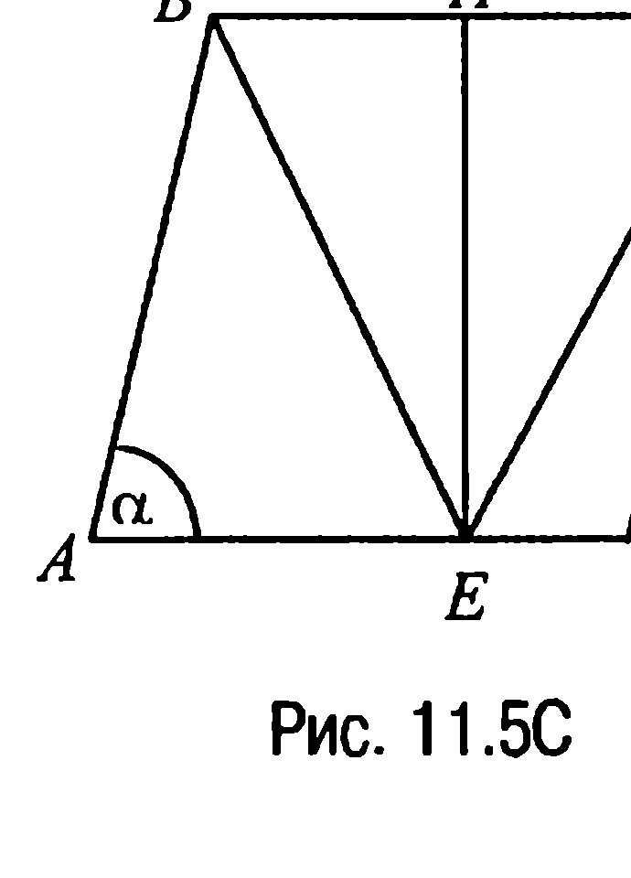
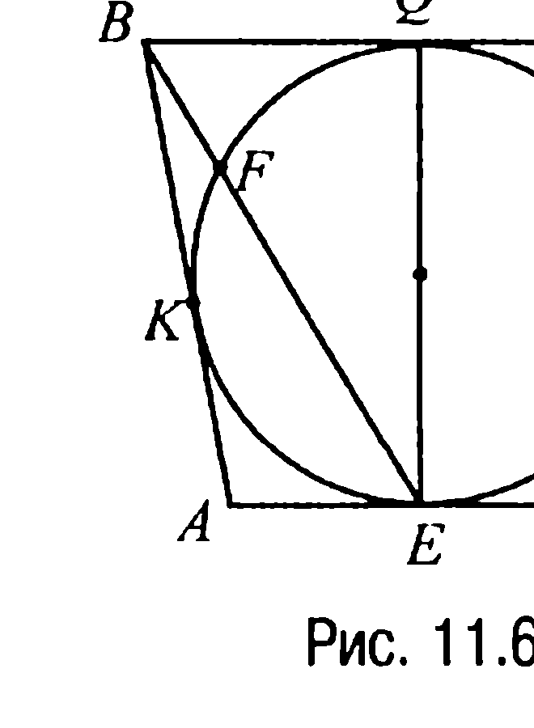

## 9.11. Теорема косинусов

---
**стр. 432**
---

уравнение $\dfrac{10\cos\gamma}{3 - 4\sin^2\gamma} - \dfrac{5}{3 - 4\sin^2\gamma} = 2$, которое равносильно уравнению $8\cos^2\gamma - 10\cos\gamma + 3 = 0$, имеющему относительно $\cos\gamma$ корни $\dfrac{1}{2}$ и $\dfrac{3}{4}$. А поскольку $\angle BCA + \angle CAB = 3\gamma < 180^\circ$, т. е. $\gamma < 60^\circ$, то $\cos\gamma > \dfrac{1}{2}$. Поэтому из найденных значений косинуса подходит только $\cos\gamma = \dfrac{3}{4}$. Но тогда $\sin\gamma = \sqrt{1 - \cos^2\gamma} = \dfrac{\sqrt{7}}{4}$ и, таким образом, $x = 4$, т. е. $AB = 4$ и, значит, $BC = x + 2 = 6$.

**Ответ:** 4; 6.

**10.7С.** Пусть $R_1$ и $R_2$ — радиусы окружностей, описанных соответственно около треугольников $ABD$ и $BCD$ (рис. 10.7С).

Тогда по расширенной теореме синусов имеем

$$2R_1 = \frac{AB}{\sin \angle BDA},$$

$$2R_2 = \frac{BC}{\sin \angle BDC}.$$

Но $AB = BC$, $\sin \angle BDA = \sin(180^\circ - \angle BDC) = \sin \angle BDC$ и поэтому $R_1 = R_2$, что и требовалось доказать.

**§ 11. Теорема косинусов**

**11.1С.** а) $9^2 < 6^2 + 7^2$ и поэтому (задача 11.1) треугольник остроугольный. По теореме косинусов $9^2 = 6^2 + 7^2 - 2 \cdot 6 \cdot 7 \cos\gamma$, откуда следует, что $\cos\gamma = -\dfrac{81 - 85}{84} = \dfrac{1}{21}$.

б) $25^2 = 7^2 + 24^2$ и, значит, треугольник прямоугольный, а $\cos\gamma = 0$.

в) $34^2 > 25^2 + 23^2$ и, таким образом, треугольник тупоугольный. По теореме косинусов $34^2 = 25^2 + 23^2 - 2 \cdot 23 \cdot 25 \cdot \cos\gamma$.

---
**стр. 433**
---

Отсюда $\cos\gamma = -\dfrac{1156 - 1154}{2 \cdot 23 \cdot 25} = -\dfrac{1}{575}$.

**Ответ:** а) остроугольный, $\dfrac{1}{21}$; б) прямоугольный, 0; в) тупоугольный, $-\dfrac{1}{575}$.

**11.2С.** Так как отрезок, соединяющий середины сторон $AB$ и $BC$ — это средняя линия треугольника $ABC$, то сторона $AC = 6$. Но тогда по теореме косинусов $7^2 = 6^2 + BC^2 - 2 \cdot 6 \cdot BC \cdot \cos 60^\circ$ или $BC^2 - 6 \cdot BC - 13 = 0$. Решая полученное уравнение относительно $BC$, находим, что $BC = 3 + \sqrt{22}$.

**Ответ:** $BC = 3 + \sqrt{22}$.

**11.3С.** Пусть для определенности в треугольнике $ABC$ сторона $AC = 3$, $AB = 4$, $BC = 6$, $D$ — середина стороны $BC$ (рис. 11.1С). Пусть $\angle CAD = \phi$. Тогда $\angle DCA = 180^\circ - 2\phi$.

По теореме же косинусов $4^2 = 6^2 + 3^2 - 2 \cdot 3 \cdot 6 \cdot \cos(180^\circ - 2\phi)$. Отсюда следует, что $\cos 2\phi = -\dfrac{29}{36}$, поскольку $\cos(180^\circ - 2\phi) = -\cos 2\phi$. Замечая теперь, что $\cos^2 \alpha = \dfrac{1 + \cos 2\alpha}{2}$, получаем $\cos^2 \phi = \dfrac{7}{72} = \dfrac{14}{144}$, откуда $\cos \phi = \dfrac{\sqrt{14}}{12}$.

**Ответ:** $\dfrac{\sqrt{14}}{12}$.

**11.4С.** Отметим, что из условия задачи следует (рис. 11.2С), что $DB = BE = 2$.

Далее, по теореме косинусов из треугольника $ABC$ имеем $6^2 = 5^2 + 3^2 - 2 \cdot 5 \cdot 3 \cdot \cos \beta$ или $\cos \beta = -\dfrac{1}{15}$. Но тогда по той же теореме косинусов из треугольника $DBE$ следует, что $DE^2 = 2^2 + 2^2 - 2 \cdot 2 \cdot 2 \cdot \cos \beta = 8 + \dfrac{8}{15} =$

---
**стр. 434**
---

$\dfrac{128}{15}$. Отсюда $DE = \sqrt{\dfrac{128}{15}} = 8\sqrt{\dfrac{2}{15}}$.

**Ответ:** $DE = 8\sqrt{\dfrac{2}{15}}$.

**11.5С.** Пусть $x$ — средняя по величине сторона заданного треугольника. Тогда, исходя из условия задачи, две другие стороны равны $x - 1$ и $x + 1$ и, значит, периметр треугольника $P = x - 1 + x + x + 1 = 3x$. Из условия задачи также следует, что противолежащим к стороне $x$ будет угол, косинус которого равен $\dfrac{2}{3}$. А тогда по теореме косинусов $x^2 = (x - 1)^2 + (x + 1)^2 - 2(x - 1)(x + 1) \cdot \dfrac{2}{3}$ или $x^2 = 10$. Отсюда $x = \sqrt{10}$ и, значит, $P = 3\sqrt{10}$.

**Ответ:** $3\sqrt{10}$.

**11.6С.** Рассмотрим треугольник $ABC$ со сторонами $BC = a = 3$, $AC = b = 6$, $AB = c$. По теореме косинусов $c^2 = a^2 + b^2 - 2a \cdot b \cdot \cos \angle BCA$, т. е. $c^2 = 45 - 36 \cos \angle BCA$. По условию $\angle BCA$ тупой, поэтому $-1 < \cos \angle BCA < 0$ и, значит, $45 < c^2 < 81$. Но сторона $c$ должна выражаться целым числом, а это, с учетом последних неравенств, приводит к выводу, что либо $c = 7$, либо $c = 8$.

**Ответ:** либо $AB = 7$, либо $AB = 8$.

**11.7С.** Пусть $MN$ — средняя линия треугольника $ABC$ (рис. 11.3С). Тогда $MN = 3$ и, следовательно, $AC = 6$. По теореме косинусов имеем $AB^2 = AC^2 + CB^2 - 2 AC \cdot CB \cdot \cos 60^\circ$, откуда, обозначив $CB = y$, получаем уравнение $y^2 - 6y - 13 = 0$, решая которое, находим, что $y_1 = 3 - \sqrt{22}$, $y_2 = 3 + \sqrt{22}$. Но поскольку $3 - \sqrt{22} < 0$, то $CB = 3 + \sqrt{22}$.

**Ответ:** $3 + \sqrt{22}$.

**11.8С.** Пусть $O$ — центр окружности, описанной около четырехугольника $ABCD$, а $\angle CAB = \alpha$ (рис. 11.4С). Тогда так как $OB = OC = OD$, а $BC = CD$, то треугольники $OBC$ и $OCD$ равны и, следовательно, равны углы $COB$ и $DOC$. Равны также и вписанные углы $CAB$ и $DAC$ как углы, опирающиеся на равные дуги.

---
**стр. 435**
---

§ 11. Задачи группы С

По теореме косинусов из треугольников $CAB$ и $DAC$ находим, что

$BC^2 = AB^2 + AC^2 - 2AB \cdot AC \cdot \cos\alpha,$

$CD^2 = AC^2 + AD^2 - 2AC \cdot AD \cdot \cos\alpha$

Но левые части этих соотношений равны, поэтому $AB^2 + AC^2 - 2AB \cdot AC \cdot \cos\alpha =$

$= AC^2 + AD^2 - 2AC \cdot AD \cdot \cos\alpha$. Отсюда находим, что $\cos\alpha = 7/8$. Подставляя полученное значение косинуса, а также значения $AB$ и $AC$ в равенство для определения $BC^2$, получим, что $BC = \sqrt{6}$. А тогда искомый радиус $R = \frac{BC}{2\sin\alpha} = \frac{BC}{2\sqrt{1-\cos^2\alpha}} = 4\sqrt{\frac{2}{5}}$.

**Ответ:** $4\sqrt{\frac{2}{5}}$.

**11.9С.** Пусть $AD = a$ (рис. 11.5С). Тогда по условию $ED = \frac{3}{10}a$

и, значит, $AE = \frac{7}{10}a$. Если обозначить $\angle DAB = \alpha$, то $\angle CDE = 180^\circ - \alpha$ и по теореме косинусов из треугольников $ABE$ и $ECD$ получаем, что

$BE^2 = a^2 + \left(\frac{7}{10}a\right)^2 - 2a \cdot \frac{7}{10}a \cdot \cos\alpha,$

$EC^2 = a^2 + \left(\frac{3}{10}a\right)^2 - 2a \cdot \frac{3}{10}a \cdot \cos(180^\circ - \alpha) =$

$= a^2 + \left(\frac{3}{10}a\right)^2 + 2a \cdot \frac{3}{10}a \cdot \cos\alpha$. Но из условия задачи следует, что

$BE^2 = EC^2$, поэтому $a^2 + \left(\frac{7}{10}a\right)^2 - 2a \cdot \frac{7}{10}a \cdot \cos\alpha = a^2 + \left(\frac{3}{10}a\right)^2 +$

$+ 2a \cdot \frac{3}{10}a \cdot \cos\alpha$, откуда $\cos\alpha = \frac{1}{5}$. Подставляя найденное значение косинуса и значение $BE = 11$ в соотношение для нахождения $BE^2$, получаем, что $a = 10$. Таким образом, площадь равнобед-

---
**стр. 436**
---

Глава 9. Решения задач группы С

ренного треугольника $BCE$ с основанием $BC = a = 10$ и высотой

$EH = \sqrt{BE^2 - BH^2} = \sqrt{BE^2 - \frac{1}{4}BC^2} = 4\sqrt{6}$ — это $S = \frac{1}{2}BC \cdot EH =$

$= 20\sqrt{6} .$

**Ответ:** $20\sqrt{6} .$

**11.10С.** Так как окружность, вписанная в равнобочную трапецию, касается оснований в их серединных точках, то $AE = \frac{1}{2}AD$, $BQ = \frac{1}{2}BC$ (рис. 11.6С). Обозначим $BF = l$, $AE = m$. Тогда по условию $FE = 3l$, а по свойству касательной и секущей $BK = BQ = \sqrt{BF \cdot BE} = \sqrt{l \cdot 4l} = 2l$.

Теперь если рассмотреть прямоугольный треугольник $BQE$, в котором катет $BQ$ в два раза меньше гипотенузы $BE$, то приходим к выводу, что $\angle QEB = 30^\circ$ и, значит, $\angle BEA = 60^\circ$. Но тогда по теореме косинусов из треугольника $ABE$ имеем $AB^2 = BE^2 + AE^2 - 2BE \cdot AE \cdot \cos 60^\circ$ или $(2l + m)^2 = 16l^2 + m^2 - 4l \cdot m$, или $m = \frac{3}{2}l$. Итак, $AD = 2m = 3l$, $BC = 2BQ = 4l$. Из прямоугольного же треугольника $BQE$ получаем, что $QE^2 = BE^2 - BQ^2$, т. е. $4r^2 = 16l^2 - 4l^2 = 12l^2$, откуда $l = \frac{r\sqrt{3}}{3}$. Таким образом, площадь трапеции $S = \frac{1}{2}(AD + BC) \cdot QE = \frac{1}{2} 7l \cdot 2r = \frac{7\sqrt{3}}{3} r^2$.

**Ответ:** $\frac{7\sqrt{3}}{3} r^2$.

**11.11С.** Обозначим $\angle BAC = \alpha$ (рис. 11.7С). Тогда из условия задачи следует, что $\frac{1}{2} AC \cdot AB \cdot \sin \alpha = CD \cdot BD \cdot \sin \angle BDC = CD \cdot BD \cdot \sin \alpha$ (вписанные углы $BAC$ and $BDC$ опираются на одну и ту же дугу $CB$), откуда $CD = \frac{AC \cdot AB}{2BD} = \frac{4R}{\sqrt{5}}$. Далее, из прямо-
