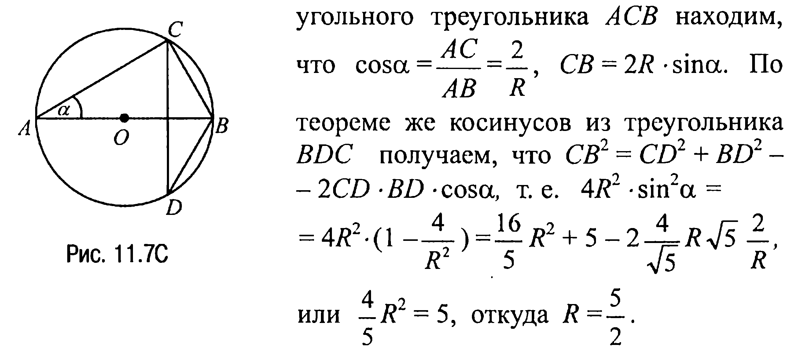
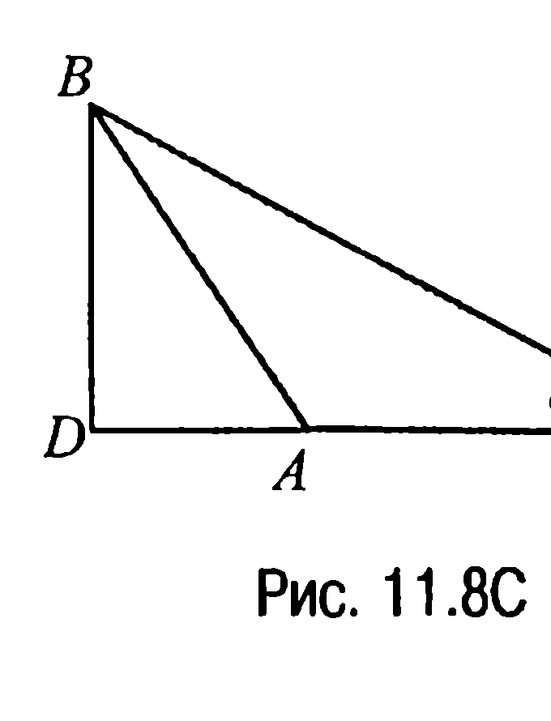

## 9.12. Решение треугольников

---
**стр. 437**
---

угольного треугольника $ACB$ находим, что $\cos\alpha = \frac{AC}{AB} = \frac{2}{\sqrt{5}}$, $CB = 2R \cdot \sin\alpha$. По теореме же косинусов из треугольника $BDC$ получаем, что $CB^2 = CD^2 + BD^2 - 2CD \cdot BD \cdot \cos\alpha$, т. е. $4R^2 \cdot \sin^2\alpha =$

$= 4R^2 \cdot (1 - \frac{4}{5}) = \frac{16}{5}R^2 + 5 - 2 \cdot \frac{4}{\sqrt{5}} \cdot R \cdot \sqrt{5} \cdot \frac{2}{R}$, или $\frac{4}{5}R^2 = 5$, откуда $R = \frac{5}{2}$.

**Ответ:** $R = \frac{5}{2}$.

**11.12С.** Вначале выясним вид заданного треугольника, для чего вычислим косинус угла, лежащего против большей стороны, т. е. $\cos\angle CAB$. По теореме косинусов

$\cos\angle CAB = \frac{AC^2 + AB^2 - BC^2}{2AC \cdot AB} = -\frac{1}{4}$

и так как $\cos\angle CAB < 0$, то треугольник является тупоугольным (рис. 11.8С).

Обозначим $\angle ACB$ через $\alpha$. Тогда по теореме косинусов $\cos\alpha = \frac{BC^2 + AC^2 - AB^2}{2BC \cdot AC} = \frac{11}{16}$. Теперь из прямоугольного треугольника $BCD$ находим $DC = BC \cdot \cos\alpha = 4 \cdot \frac{11}{16} = \frac{11}{4}$.

**Ответ:** $CD = \frac{11}{4}$.

**§ 12. Решение треугольников**

**12.1С.** Площадь треугольника $S = p \cdot r = \sqrt{p(p-a)(p-b)(p-c)}$. Отсюда следует, что $p \cdot r^2 = (p-a) \cdot (p-b) \cdot (p-c)$ или $4(a + b +$

$+ c) \cdot r^2 = (b + c - a) \cdot (a + c - b) \cdot (a + b - c)$.

**Ответ:** $4(a + b + c) \cdot r^2 = (b + c - a) \cdot (a + c - b) \cdot (a + b - c)$.

---
**стр. 438**
---

Из расширенной теоремы синусов следует, что $\sin \alpha = \frac{a}{2R}$, $\sin \beta = \frac{b}{2R}$. Таким образом, если $a > 2R$ или $b > 2R$, то требуемый треугольник не существует.

Если $a = 2R$ или $b = 2R$, то синус соответствующего угла равен единице и третья сторона $AB$ находится по теореме Пифагора.

Если $a < 2R$ и $b < 2R$, то по расширенной теореме синусов $c = 2R \cdot \sin \gamma = 2R \cdot \sin(\pi - \alpha - \beta) = 2R \cdot \sin(\alpha + \beta) = 2R \cdot \sin \alpha \cdot \cos \beta + 2R \cdot \sin \beta \cdot \cos \alpha$.

Теперь если $a = b$, то оба угла $\alpha$ и $\beta$ — острые и поэтому косинусы определяются однозначно: $\cos \alpha = \sqrt{1 - \sin^2 \alpha} = \frac{\sqrt{4R^2 - a^2}}{2R}$, $\cos \beta = \sqrt{1 - \sin^2 \beta} = \frac{\sqrt{4R^2 - b^2}}{2R}$. Но тогда $c = \frac{a \sqrt{4R^2 - a^2}}{R}$.

Если же $a \neq b$, то один из углов $\alpha$ или $\beta$ может оказаться тупым и тогда надо выбрать знак минус перед радикалом, определяющим соответствующий косинус. Итак, в этом случае

либо $c = \frac{1}{R} \left( a \sqrt{4R^2 - b^2} - b \sqrt{4R^2 - a^2} \right)$,

либо $c = \frac{1}{R} \left( -a \sqrt{4R^2 - b^2} + b \sqrt{4R^2 - a^2} \right)$.

**Ответ:** если $a > 2R$ или $b > 2R$, или $a = b = 2R$, то требуемый треугольник не существует;

если $a = 2R$, $b < 2R$ ($b = 2R$, $a < 2R$), то $c = \sqrt{4R^2 - b^2}$ ($c = \sqrt{4R^2 - a^2}$);

если $a = b < 2R$, то $c = \frac{a \sqrt{4R^2 - a^2}}{R}$;

если $a < 2R$, $b < 2R$, $a \neq b$, то $c = \frac{1}{R} \left| a \sqrt{4R^2 - b^2} \pm b \sqrt{4R^2 - a^2} \right|$.

**12.3C.** Так как $2S = a \cdot h_a = a \cdot b \cdot \sin \gamma$, то $\sin \gamma = \frac{h_a}{b}$. А тогда если $b < h_a$, то требуемый треугольник не существует. Если $b = h_a$,

---
**стр. 439**
---

то $\gamma = \frac{\pi}{2}$ и $c = \sqrt{a^2 + b^2}$. Если $b > h_a$, то либо $\gamma = \arcsin \frac{h_a}{b}$, либо $\gamma = \pi - \arcsin \frac{h_a}{b}$.

**Ответ:** если $b < h_a$, то требуемый треугольник не существует;

если $b = h_a$, то $c = \sqrt{a^2 + b^2}$;

если $b > h_a$, то $c = \sqrt{a^2 + b^2 \pm 2ab\sqrt{1 - \frac{h_a^2}{b^2}}}$.

**12.4C.** Так как $2S = a \cdot h_a = c \cdot h_c = a \cdot c \cdot \sin \beta = b \cdot c \cdot \sin \alpha$, то $\sin \alpha = \frac{h_c}{b}$, $\sin \beta = \frac{h_c}{a}$. Таким образом, если $a < h_c$ или $b < h_c$, или $a = b = h_c$, то требуемый треугольник не существует. Если $a = h_c$, $b > h_c$, то $\beta = \frac{\pi}{2}$ и $c = \sqrt{b^2 - a^2}$. Если $b = h_c$, $a > h_c$, то $\alpha = \frac{\pi}{2}$ и $c = \sqrt{a^2 - b^2}$. Если $a = b > h_c$, то $c = 2\sqrt{a^2 - h_c^2}$. Если $b > a > h_c$ и $\beta < \frac{\pi}{2}$, то $c = \sqrt{a^2 - h_c^2} + \sqrt{b^2 - h_c^2}$. Если $b > a > h_c$ и $\beta > \frac{\pi}{2}$, то $c = -\sqrt{a^2 - h_c^2} + \sqrt{b^2 - h_c^2}$.

**Ответ:** если $a < h_c$ или $b < h_c$, или $a = b = h_c$, то требуемый треугольник не существует;

если $b > a = h_c$, то $c = \sqrt{b^2 - a^2}$;

если $a = b > h_c$, то $c = 2\sqrt{a^2 - h_c^2}$;

если $b > a > h_c$, то $c = \pm\sqrt{a^2 - h_c^2} + \sqrt{b^2 - h_c^2}$.

**12.5C.** Пусть $AB = c$, тогда из пункта 3 задачи 12.1 следует, что $\cos \frac{\alpha}{2} = \frac{l_a(b+c)}{2bc}$. С другой стороны, по теореме косинусов $b^2 + c^2 - 2b \cdot c \cdot \cos \alpha = a^2$ или $b^2 + c^2 - 2b \cdot c \left(2\cos^2 \frac{\alpha}{2} - 1\right) = a^2$, или $4b \cdot c \cdot \cos^2 \frac{\alpha}{2} = (b+c)^2 - a^2$. Подставляя в это равенство найденное выше значение $\cos \frac{\alpha}{2}$,
