## 9.13. Параллелограмм, прямоугольник, ромб, квадрат

---
**стр. 440**
---

находим, что $l_a = \frac{\sqrt{bc(b+c+a)(b+c-a)}}{b+c}$ или $l_a^2 \cdot (b+c)^2 = b \cdot c \cdot (b+c+a) \cdot (b+c-a)$.

**Ответ:** $l_a^2 \cdot (b+c)^2 = b \cdot c \cdot (b+c+a) \cdot (b+c-a)$.

**12.6C.** По аналогии с решением предыдущей задачи легко найти, что $l_c = \frac{\sqrt{ab(a+b+c)(a+b-c)}}{a+b}$ или $c^2 = (a+b)^2 \cdot \left(1 - \frac{l_c^2}{ab}\right)$, или $c = (a+b) \cdot \sqrt{1 - \frac{l_c^2}{ab}}$, где $c = AB$. Чтобы выяснить, при каких значениях $a$, $b$, $l_c$ задача имеет решение, воспользуемся формулой $l_c = \frac{2ab \cos \frac{\gamma}{2}}{a+b}$ или формулой $\cos \frac{\gamma}{2} = \frac{(a+b)l_c}{2ab}$.

Отсюда следует, что требуемый треугольник существует тогда и только тогда, когда $\frac{(a+b)l_c}{2ab} < 1$.

**Ответ:** задача имеет решение тогда и только тогда, когда $l_c < \frac{2ab}{a+b}$. В этом случае $c = (a+b) \sqrt{1 - \frac{l_c^2}{ab}}$.

**§13. Параллелограмм, прямоугольник, ромб, квадрат**

**13.1C.** Пусть $E$, $F$, $K$ и $L$ — середины сторон $AB$, $BC$, $CD$ и $DA$ прямоугольника $ABCD$ соответственно (рис. 13.1C).

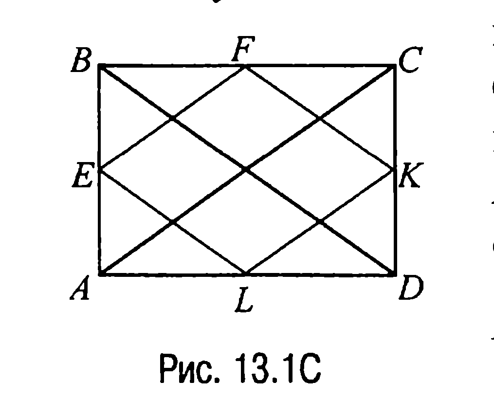

Четырехугольник $EFKL$ — параллелограмм (задача 13.1). Стороны $EF$ и $FK$ этого параллелограмма как средние линии треугольников $ABC$ и $DCB$ равны $\frac{1}{2} AC$ и $\frac{1}{2} BD$ соответственно. Но поскольку диагонали $AC$ и $BD$

---
**стр. 441**
---

прямоугольника равны, то это и означает, что $EFKL$ — ромб.

**13.2C.** Пусть $E$, $F$, $K$ и $L$ — середины сторон $AB$, $BC$, $CD$ и $DA$ ромба $ABCD$ соответственно (рис. 13.2C).

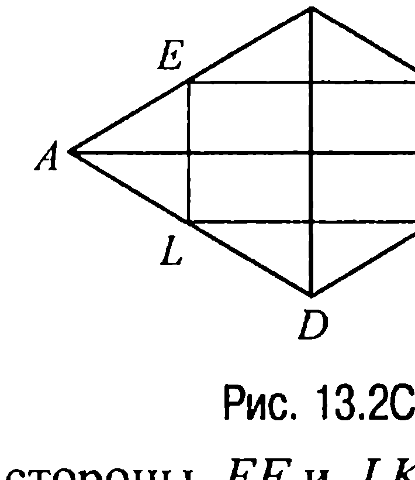

Четырехугольник $EFKL$ — параллелограмм (задача 13.1). Стороны $EL$ и $FK$ этого параллелограмма как средние линии равных треугольников $DAB$ и $BCD$ с общей стороной $BD$ параллельны этой стороне. Аналогично

стороны $EF$ и $LK$ параллельны отрезку $AC$. Отсюда уже и следует, что $EFKL$ — прямоугольник, поскольку $AC \perp BD$ (свойство 13.9X).

**13.3C.** Рассмотрим рис. 13.3C. Пусть для некоторой точки $P$ диагонали $AC$ четырехугольника $ABCD$ выполняются два первых равенства из условия задачи. Тогда $S_{\Delta ABP} = S_{\Delta ADP}$, $S_{\Delta CBP} = S_{\Delta CDP}$ и, следовательно, $S_{\Delta ABC} = S_{\Delta ADC}$, т. е. диагональ $AC$ делит четырехугольник $ABCD$ на два равновеликих треугольника. Исходя из условия задачи, аналогично показывается, что $S_{\Delta DAB} = S_{\Delta BCD}$.

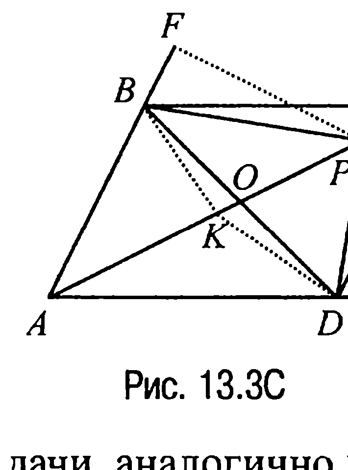

Обозначим через $O$ точку пересечения диагоналей $AC$ и $BD$ и предположим, что точка $K$, отличная от точки $O$, — середина диагонали $AC$. Тогда если $S$ — площадь четырехугольника $ABCD$, то

$$S_{\Delta ABK} = S_{\Delta KBC} = \frac{S}{4}, \quad S_{\Delta ADK} = S_{\Delta KDC} = \frac{S}{4}, \quad \text{а значит,} \quad S_{\Delta ABK} + S_{\Delta ADK} = \frac{S}{2},$$

что противоречит тому, что $S_{\Delta DAB} = S_{\Delta BCD} = \frac{S}{2}$. Отсюда вывод: середина диагонали $AC$ совпадает с точкой $O$.

Аналогично доказывается, что и середина диагонали $BD$ совпадает с точкой $O$.

Таким образом, в точке пересечения $O$ диагонали четырехугольника $ABCD$ делятся пополам. Но в таком случае из характери-

---
**стр. 442**
---

стичности свойства 13.4X следует, что четырехугольник $ABCD$ — параллелограмм, что и требовалось доказать.

**13.4C.** Пусть $E$ — точка пересечения диагоналей $AC$ и $BD$ параллелограмма $ABCD$ (рис. 13.4C).

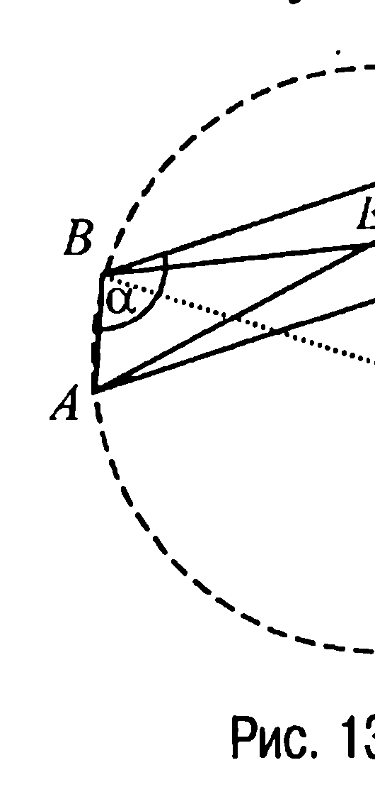

Тогда поскольку точка $E$ — центр симметрии параллелограмма, то обе окружности имеют один и тот же радиус $R$. Таким образом, если $O$ — центр одной из окружностей, то искомое расстояние равно $2OE$.

Далее рассуждаем следующим образом. Так как по условию $\angle ABC = \alpha$, то $\angle DAB = 180^\circ - \alpha$ и по теореме косинусов из треугольника $ABD$ имеем

$BD^2 = a^2 + b^2 - 2a \cdot b \cdot \cos\angle DAB = a^2 + b^2 + 2a \cdot b \cdot \cos\alpha$. Теперь, замечая, что $S_{\Delta ABD} = \frac{1}{2} a \cdot b \cdot \sin\angle DAB = \frac{1}{2} a \cdot b \cdot \sin\alpha$, находим (задача 9.5) $R = \frac{ab \cdot BD}{4S_{\Delta ABD}} = \frac{\sqrt{a^2 + b^2 + 2ab\cos\alpha}}{2\sin\alpha}$. Зная же $BD$ и $R$, из прямоугольного треугольника $BEO$ определяем катет

$$EO = \sqrt{R^2 - \frac{BD^2}{4}} = \frac{1}{2} |\operatorname{ctg}\alpha| \sqrt{a^2 + b^2 + 2ab\cos\alpha}.$$

**Ответ:** $|\operatorname{ctg}\alpha| \sqrt{a^2 + b^2 + 2ab\cos\alpha}$.

**13.5C.** Пусть $P$ — проекция точки $M$ на сторону $AB$ (рис. 13.5C), а $O$ — центр полуокружности.

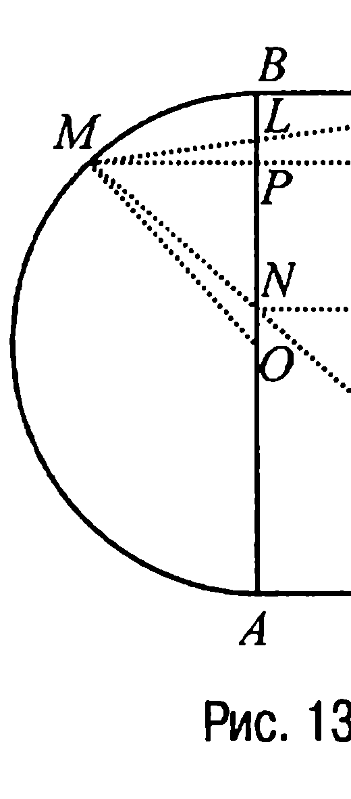

Обозначим $OP = x$, $MP = y$. Тогда $AP = a + x$, $PB = a - x$ и из прямоугольного треугольника $MPO$ находим, что $y = \sqrt{a^2 - x^2}$. Но в таком случае если $E$ — точка пересечения прямой $MP$ с $CD$, а $NF \perp CD$, то из подобия треугольников $MED$ и $NFD$ следует, что $AN = \frac{(a + x)a\sqrt{2}}{a\sqrt{2} + y}$ и, зна-

---
**стр. 443**
---

чит, $NB = AB - AN = 2a - \frac{(a+x)a\sqrt{2}}{a\sqrt{2}+y} = \frac{a\sqrt{2}(a-x+y\sqrt{2})}{a\sqrt{2}+y}$.

Аналогично из подобия прямоугольных треугольников $CEM$ и $LPM$ находим $PL = \frac{y(a-x)}{a\sqrt{2}+y}$ и тогда $AL = AP + PL = a + x +$
$+ \frac{y(a-x)}{a\sqrt{2}+y} = \frac{a\sqrt{2}(a+x+y\sqrt{2})}{a\sqrt{2}+y}$. Таким образом,

$$AL^2 + BN^2 = \frac{2a^2}{(a\sqrt{2}+y)^2} ((a+x+y\sqrt{2})^2 + (a-x+y\sqrt{2})^2) =$$
$$= \frac{4a^2}{(a\sqrt{2}+y)^2} (a^2 + x^2 + 2y^2 + 2a\sqrt{2}\,y) = \frac{4a^2}{(a\sqrt{2}+y)^2} ((a\sqrt{2}+y)^2 + x^2 +$$
$$+ y^2 - a^2) = \frac{4a^2}{(a\sqrt{2}+y)^2} (a\sqrt{2}+y)^2 = 4a^2.$$

**Ответ:** $AL^2 + BN^2 = 4a^2$.

**13.6C.** Пусть $NK$, $KL$, $ML$, $NM$ — биссектрисы внешних углов параллелограмма $ABCD$ (рис. 13.6C) и пусть $E$, $F$ — точки прямых $AB$ и $DC$ соответственно.

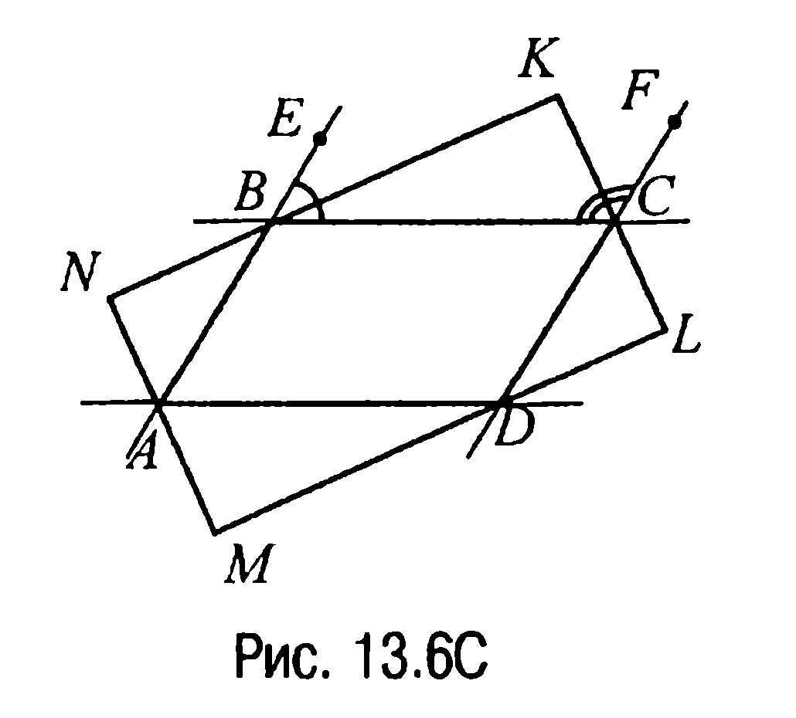

Тогда так как $\angle CBE + \angle FCB = 180^\circ$ (свойство 1.5X), то $\angle CBK + \angle KCB = \frac{1}{2} \angle CBE + \frac{1}{2} \angle FCB = 90^\circ$ и, значит, $\angle BKC = 90^\circ$.

Аналогично доказывается, что и остальные три угла четырехугольника $KLMN$ — прямые, т. е. четырехугольник $KLMN$ — действительно прямоугольник.

**13.7C.** Пусть $E$ — точка пересечения диагоналей прямоугольника $ABCD$ (рис. 13.7C), $EF = 5$, $FK = 4$. Тогда из прямоугольного треугольника $EKF$ находим $EK = \sqrt{EF^2 - FK^2} = 3$. Далее, так как прямоугольные треугольники $BAD$ и $EKF$ подобны ($\angle DBA = \angle KEF$), то $AB : EK = AD : FK$ и, значит, $AD = \frac{AB \cdot FK}{EK}$.

---
**стр. 444**
---

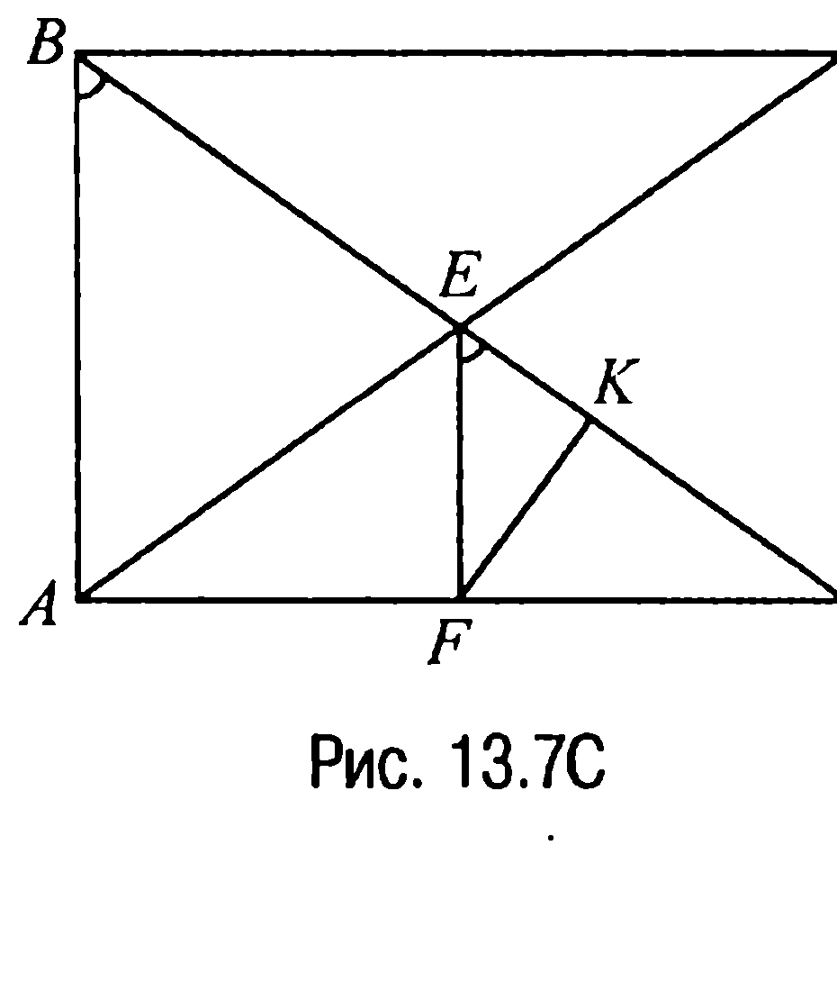

Но поскольку $EF$ — средняя линия треугольников $DAB$ и $ADC$, то $AB = CD = 10$ и, следовательно, $AD = \frac{10 \cdot 4}{3} = \frac{40}{3}$. Таким образом, площадь прямоугольника $ABCD$ — это $S_{ABCD} = AD \cdot AB = \frac{40}{3} \cdot 10 = \frac{400}{3}$.

**Ответ:** $\frac{400}{3}$.

**13.8C.** Пусть $K$ — точка пересечения диагоналей прямоугольника $ABCD$ (рис. 13.8С), $O$ — центр окружности, касающейся трех его сторон и проходящей через точку $K$, $O_1$ — центр окружности, вписанной в получившийся криволинейный треугольник. Пусть, далее, $OE \perp AD$ и $O_1F \perp AD$. Обозначим $OE = R$, $O_1F = x$.

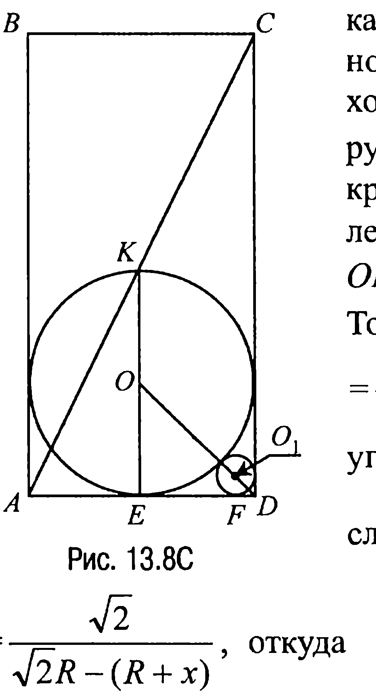

Тогда так как $\angle ODE = 45^\circ$, то $OD = \frac{OE}{\sin 45^\circ} = \sqrt{2} R$. Из подобия же прямоугольных треугольников $OED$ и $O_1FD$ следует, что $\frac{R}{x} = \frac{\sqrt{2}R}{O_1D}$ или $\frac{1}{x} = \frac{\sqrt{2}}{\sqrt{2}R - (R + x)}$, откуда $x = R \frac{\sqrt{2}-1}{\sqrt{2}+1}$. Теперь поскольку $ED = AE = OE = R$, а из прямоугольного треугольника $KEA$ имеем $KE^2 + AE^2 = AK^2$, т. е. $(2R)^2 + R^2 = \left(\frac{d}{2}\right)^2$, то $R = \frac{d}{2\sqrt{5}}$. Таким образом, $x = \frac{d(\sqrt{2}-1)}{2\sqrt{5}(\sqrt{2}+1)} = \frac{d\sqrt{5}}{10}(3 - 2\sqrt{2})$.

**Ответ:** $\frac{d\sqrt{5}}{10}(3 - 2\sqrt{2})$.

---
**стр. 445**
---

**13.9C.** Предположим для определенности, что в прямоугольнике $ABCD$ сторона $AB = a$, $BC = b$, $a < b$ (рис. 13.9С). Пусть $E, F, K, L$ — точки пересечения биссектрис. Тогда четырехугольник $KEFL$ — прямоугольник (задача 13.8). Более того, так как $KE = KF$, что очевидно, то приходим к выводу, что четырехугольник $KEFL$ — квадрат.

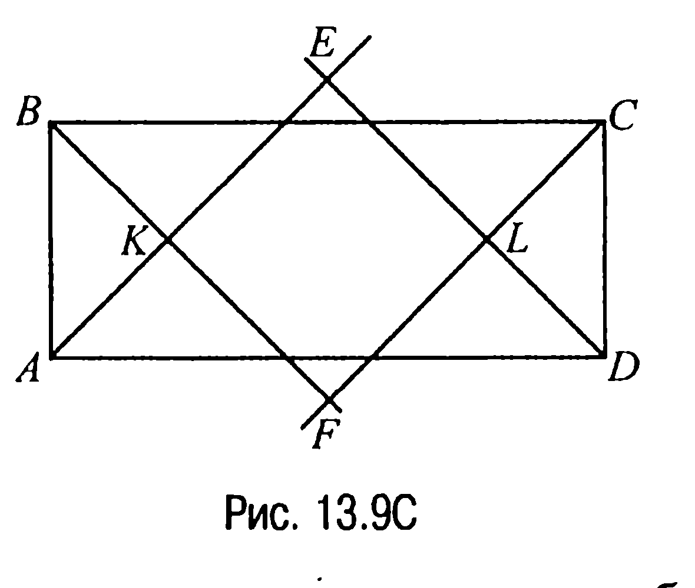

Замечая теперь, что в равнобедренном прямоугольном треугольнике $CFB$ имеет место равенство $BC^2 = 2BF^2$, находим $BF = \frac{b}{\sqrt{2}}$.

Аналогично из равнобедренного прямоугольного треугольника $BKA$ следует, что $BK = \frac{a}{\sqrt{2}}$. Но тогда $KF = BF - BK = \frac{b - a}{\sqrt{2}}$ и, таким образом, периметр четырехугольника $KEFL$ — это $P_{KEFL} = 4 \cdot KF = 2\sqrt{2}(b - a)$.

Учитывая же возможность $a > b$, получаем

**Ответ:** $2\sqrt{2}|b - a|$.

**13.10C.** Пусть $AC$ и $BD$ — диагонали четырехугольника $ABCD$, которые разбивают углы при вершинах $A$, $B$, $C$ и $D$ на углы $\alpha_i$, $i = \overline{1, 8}$, так как это указано на рис. 13.10С.

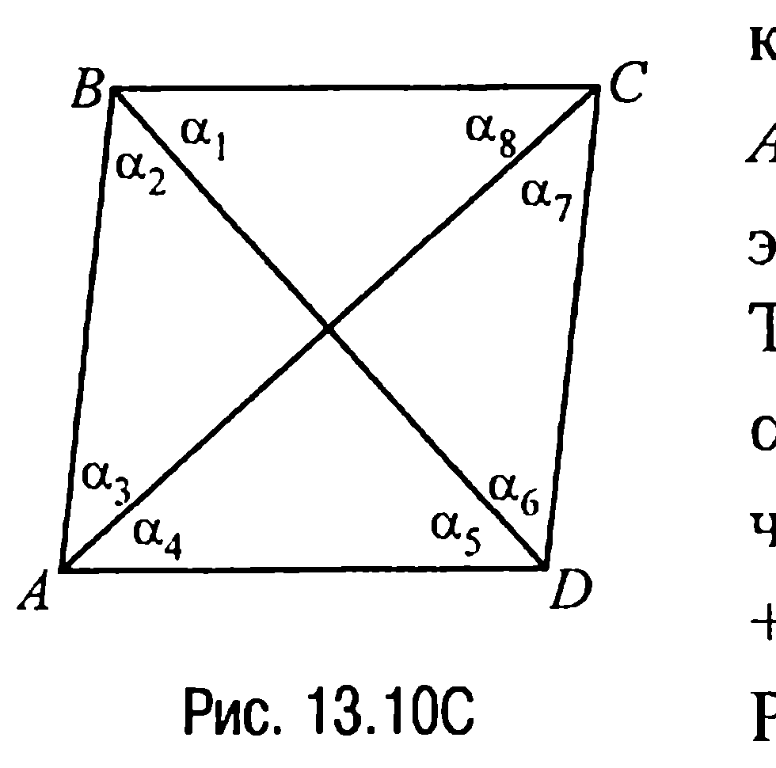

Тогда по условию $\alpha_1 = \alpha_2$, $\alpha_3 = \alpha_4$, $\alpha_5 = \alpha_6$, $\alpha_7 = \alpha_8$. По свойству же внутренних углов четырехугольника $\alpha_1 + \alpha_2 + \alpha_3 + \alpha_4 + \alpha_5 + \alpha_6 + \alpha_7 + \alpha_8 = 360^\circ$.

Рассмотрим треугольник $ABC$. В этом треугольнике, как и в любом другом, сумма внутренних углов равна $180^\circ$, поэтому $\alpha_1 + \alpha_2 + \alpha_3 + \alpha_8 = 2\alpha_2 + \alpha_3 + \alpha_8 = 180^\circ$.

Но тогда и $\alpha_4 + \alpha_5 + \alpha_6 + \alpha_7 = \alpha_3 + 2\alpha_5 + \alpha_8 = 180^\circ$, откуда следует, что $\alpha_2 = \alpha_5$ и, значит, $AB = AD$.

С другой стороны, $\alpha_1 + \alpha_2 + \alpha_3 + \alpha_8 = 2\alpha_1 + \alpha_3 + \alpha_8 =$

---
**стр. 446**
---

$= 180^\circ$, а $\alpha_4 + \alpha_5 + \alpha_6 + \alpha_7 = \alpha_3 + 2\alpha_6 + \alpha_8 = 180^\circ$ и, таким образом, $\alpha_1 = \alpha_6$.

Но в таком случае $BC = DC$, откуда (с учетом равенства сторон $AB$ и $AD$) приходим к выводу, что треугольники $ABC$ и $ADC$ равны, а следовательно, $\angle ABC = \angle ADC$. Следствием же этого факта является равенство $\alpha_1 = \alpha_5$, поскольку $BD$ — биссектриса углов $ABC$ и $ADC$, а значит, и параллельность сторон $BC$ и $AD$. Аналогично из равенства $\alpha_2 = \alpha_6$ вытекает параллельность сторон $AB$ и $DC$.

Вывод: четырехугольник $ABCD$ — параллелограмм. Но в этом параллелограмме $AB = AD$, а $BC = DC$, что и означает, что четырехугольник $ABCD$ — действительно ромб.

**13.11C.** Обозначим сторону ромба $BFDE$ (рис. 13.11С) через $x$.

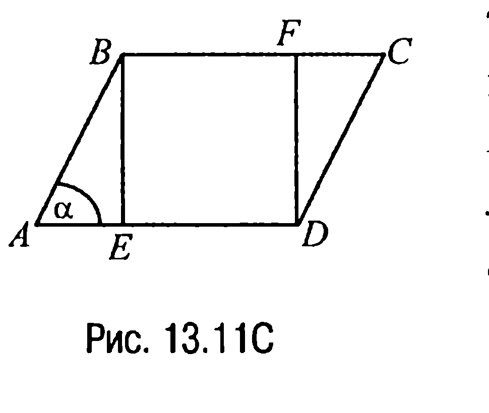

Тогда $AE = b - x$. По теореме же косинусов из треугольника $ABE$ следует, что $BE^2 = AB^2 + AE^2 - 2AB \cdot AE \cdot \cos \alpha$ или $x^2 = a^2 + (b - x)^2 - 2a \cdot (b - x) \cdot \cos \alpha$, или $a^2 + b^2 - 2a \cdot b \cdot \cos \alpha = 2(b - a \cdot \cos \alpha) \cdot x$.

Отсюда $x = \frac{a^2 + b^2 - 2ab \cos \alpha}{2(b - a \cos \alpha)}$.

**Ответ:** $\frac{a^2 + b^2 - 2ab \cos \alpha}{2(b - a \cos \alpha)}$.

**13.12C.** Пусть в ромбе $ABCD$ со стороной $a$ (рис. 13.12С) $\angle BAD = \alpha$, а $R$ — радиус вписанной в ромб окружности.

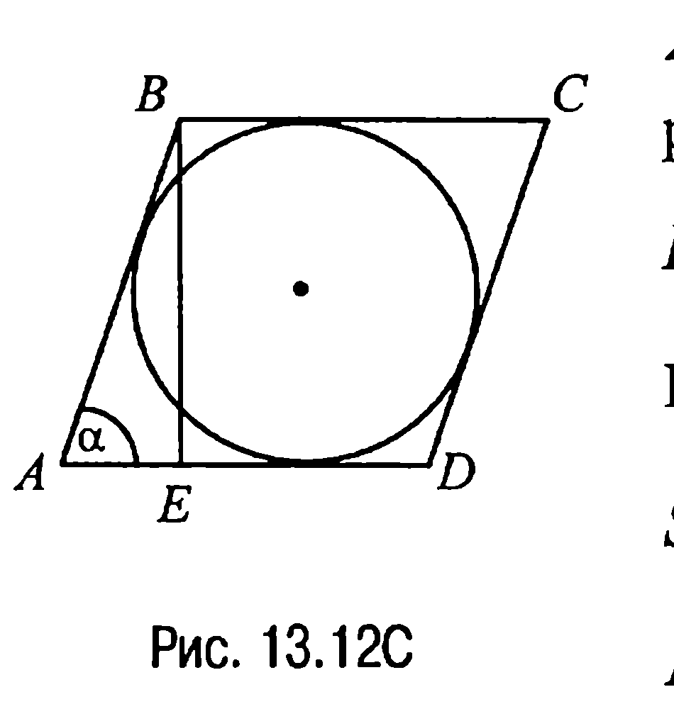

Тогда высота ромба $BE = 2R = a \cdot \sin \alpha$ и, значит, $R = \frac{a}{2} \cdot \sin \alpha$.

Но в таком случае площадь круга $S = \pi R^2 = \frac{\pi a^2}{4} \cdot \sin^2 \alpha$.

А поскольку площадь ромба $S_{ABCD} = a^2 \cdot \sin \alpha$, то в соответствии с ус-

---
**стр. 447**
---

ловием задачи $\frac{2\pi a^2}{4} \cdot \sin^2 \alpha = a^2 \cdot \sin \alpha$ или $\sin \alpha = \frac{2}{\pi}$. Таким образом, $\alpha = \arcsin \frac{2}{\pi}$, а $\angle ABC = \pi - \arcsin \frac{2}{\pi}$.

**Ответ:** $\arcsin \frac{2}{\pi}$; $\pi - \arcsin \frac{2}{\pi}$.

**13.13С.** Пусть диагонали ромба равны $d_1$ и $d_2$. Тогда по условию $d_1 \cdot d_2 = 2S$, $d_1 + d_2 = m$, откуда следует, что $d_1^2 + d_2^2 = m^2 - 4S$. С другой стороны, если сторону ромба обозначить через $a$, то по свойству 13.5X имеем равенство $d_1^2 + d_2^2 = 4a^2$. Таким образом, $4a^2 = m^2 - 4S$ и, значит, $a = \frac{1}{2} \sqrt{m^2 - 4S}$.

**Ответ:** $\frac{1}{2} \sqrt{m^2 - 4S}$.

**13.14С.** Пусть для определенности квадрат $A_1BC_1D_1$ получен из квадрата $ABCD$ поворотом вокруг вершины $B$ на угол $45^\circ$ (рис. 13.13С).

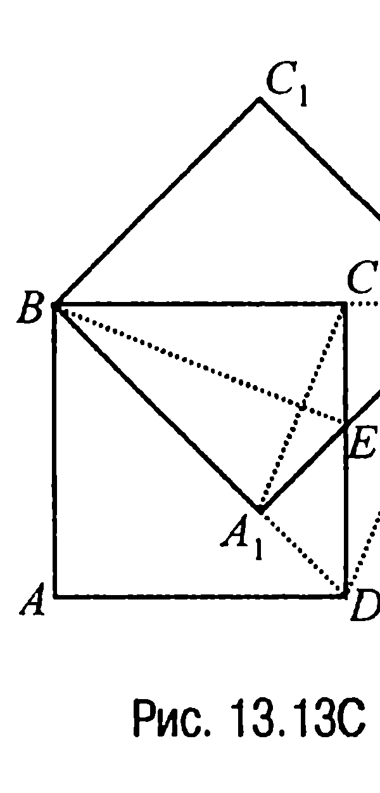

Обозначим через $E$ точку пересечения сторон $A_1D_1$ и $DC$. Тогда очевидно, что $BE \perp A_1C$ и, значит, площадь общей части двух квадратов — четырехугольника $EA_1BC$ — это $S_{EA_1BC} = \frac{1}{2} BE \cdot A_1C$.

Найдем $BE$ и $A_1C$. Прежде всего заметим, что $A_1D = A_1E = EC = CD_1 = a\sqrt{2} - a = a(\sqrt{2} - 1)$, и поэтому из прямоугольного треугольника $EA_1B$ имеем $BE = \sqrt{a^2 + a^2(\sqrt{2} - 1)^2} = a\sqrt{4 - 2\sqrt{2}}$. Теперь поскольку $\Delta EA_1B = \Delta DA_1D_1$, то $BE = D_1D$. А тогда из подобия треугольников $A_1BC$ и $DB_1D_1$ следует, что $\frac{DD_1}{A_1C} = \frac{BD}{BA_1}$ или $\frac{a\sqrt{4 - 2\sqrt{2}}}{A_1C} = \frac{a\sqrt{2}}{a}$, откуда $A_1C = \frac{a\sqrt{4 - 2\sqrt{2}}}{\sqrt{2}} = a\sqrt{2 - \sqrt{2}}$.
