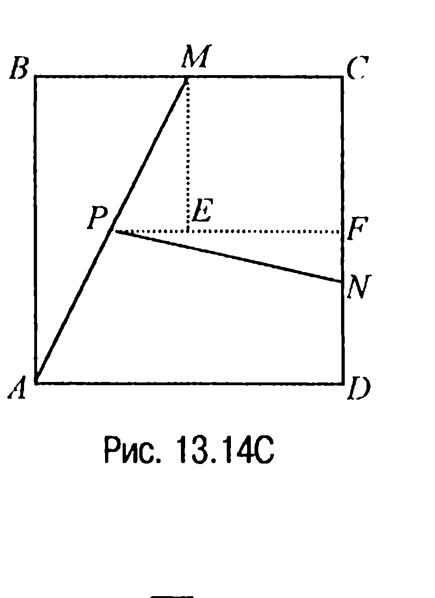
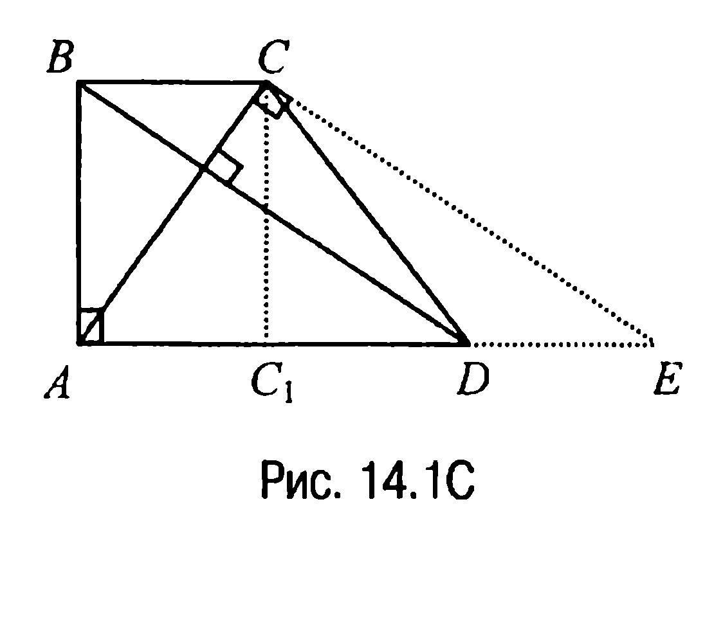
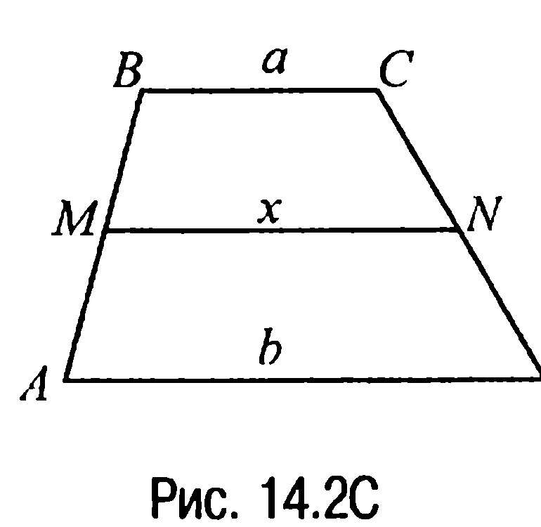
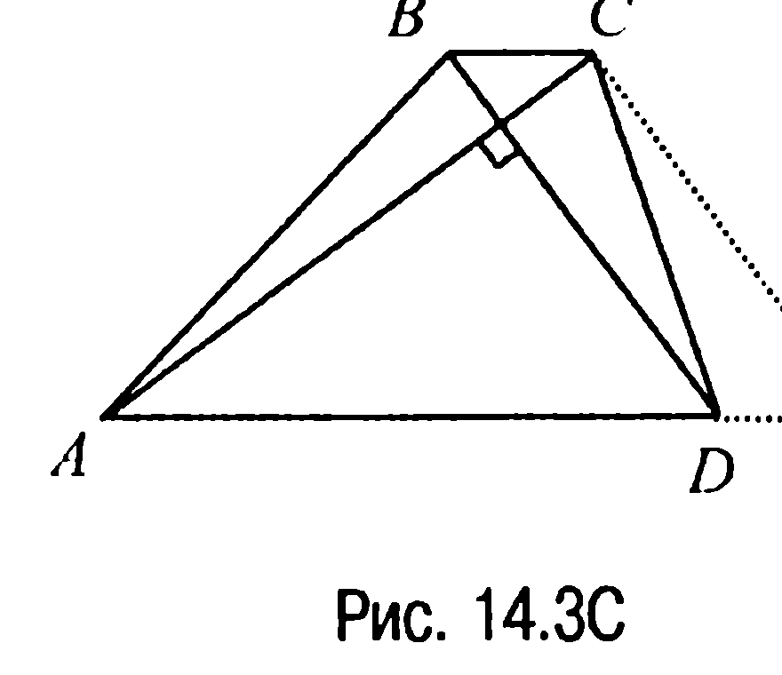
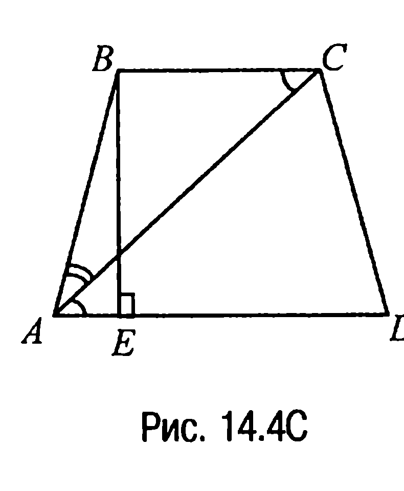
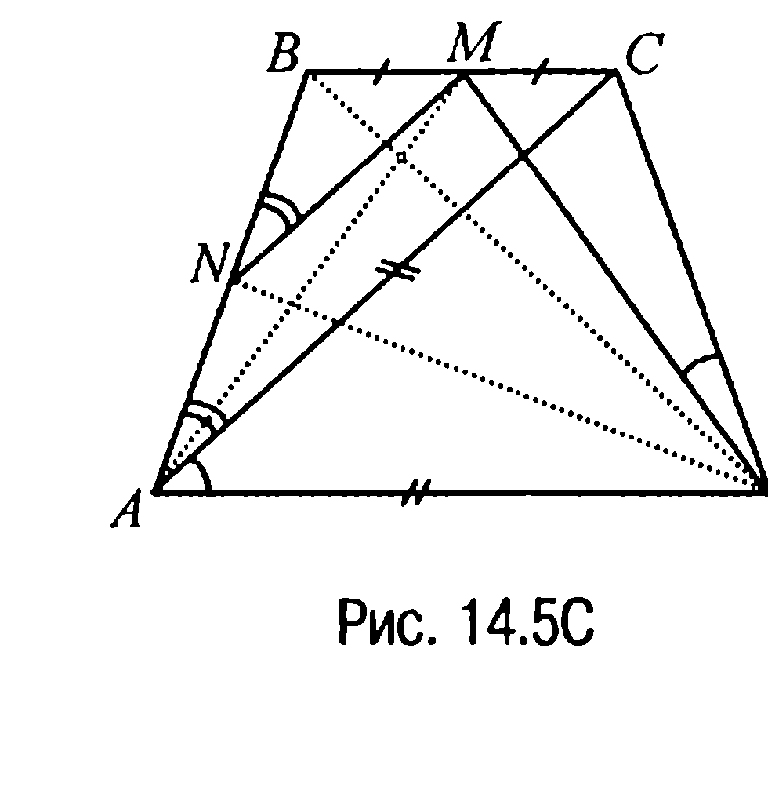
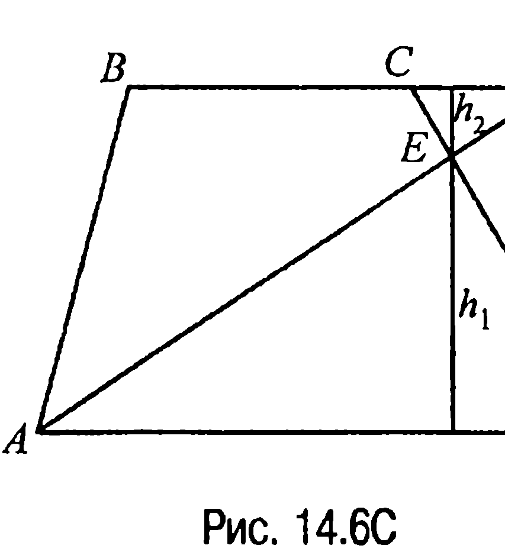
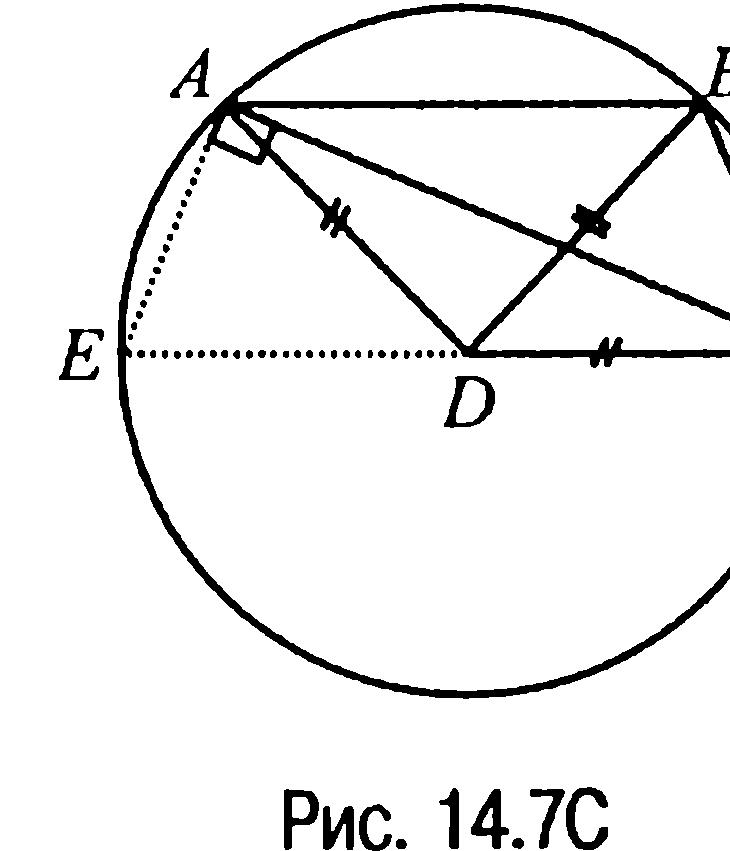
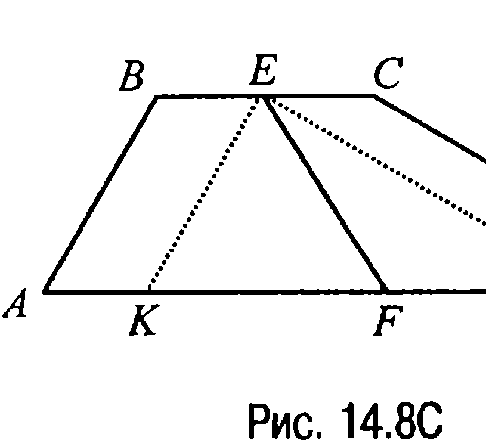
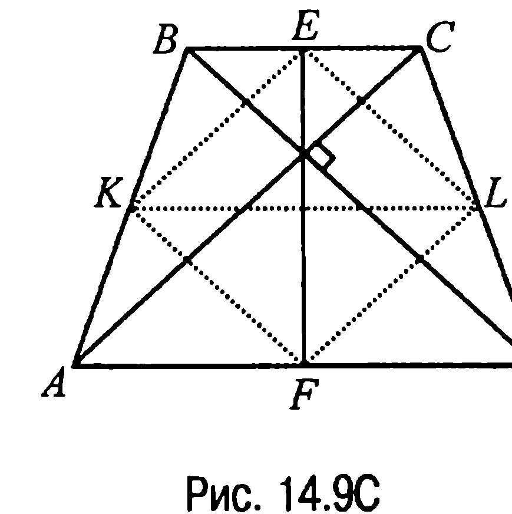

## 9.14. Трапеция

---
**стр. 448**
---

Таким образом, $S_{EA_1BC} = \frac{1}{2} BE \cdot A_1C = \frac{1}{2} a^2 \cdot \sqrt{4 - 2\sqrt{2}} \cdot \sqrt{2 - \sqrt{2}} =$

$= a^2(\sqrt{2} - 1)$.

**Ответ:** $a^2(\sqrt{2} - 1)$.

**13.15С.** Пусть $E$ — точка пересечения диагоналей квадрата $ABCD$, $F$ — середина стороны $CD$, $P$ — середина отрезка $AM$ (рис. 13.14С).

Тогда из условия задачи следует, что $PE = FN = \frac{a}{4}$ и, значит, $PF = PE + EF = \frac{a}{4} + \frac{a}{2} = \frac{3a}{4}$. Но тогда $PN^2 = PF^2 + FN^2 = \frac{9a^2}{16} + \frac{a^2}{16} = \frac{10a^2}{16}$, откуда $PN = \frac{a\sqrt{10}}{4}$.

**Ответ:** $\frac{a\sqrt{10}}{4}$.

**§14. Трапеция**

**14.1С.** Пусть в прямоугольной трапеции $ABCD$ (рис. 14.1С) $\angle DAB = \angle ABC = 90^\circ$, $AC \perp BD$, $BC =$

$= a$, $AD = b$. Тогда если $E$ — точка пересечения прямой $AD$ с прямой, проходящей через точку $C$ параллельно прямой $BD$, то $\angle ACE = 90^\circ$. Пусть $CC_1$ — высота прямоугольного треугольника $ACE$. В таком случае

$\frac{AC_1}{CC_1} = \frac{CC_1}{C_1E}$ или $CC_1^2 = AC_1 \cdot C_1E =$

$= a \cdot b$, откуда следует, что $CC_1 = \sqrt{ab}$.

**Ответ:** $\sqrt{ab}$.

---
**стр. 449**
---

**14.2С.** Пусть в трапеции $ABCD$ основание $BC = a$, $MN = x$ и $AD = b$ (рис. 14.2С).

Тогда из условия задачи следует, что $\frac{a}{x} = \frac{x}{b}$, откуда $x^2 = ab$ или $x = \sqrt{ab}$.

**Ответ:** $MN = \sqrt{ab}$.

**14.3С.** Рассмотрим трапецию $ABCD$ с диагоналями $AC = 8$ и $BD = 6$ (рис. 14.3С).

Проведем через вершину $C$ прямую, параллельную диагонали $BD$, и пусть $E$ — точка пересечения этой прямой с прямой $AD$. Тогда так как средняя линия трапеции равна 5, то $AE = AD + DE = AD + BC = 10$ и, значит, треугольник $ACE$ — прямоугольный с прямым углом $ACE$ ($AC^2 + CE^2 = AE^2 (= 100)$). А поскольку треугольник $ACE$ и трапеция $ABCD$ равновелики, то площадь трапеции $S = \frac{1}{2} \cdot 6 \cdot 8 = 24$.

**Ответ:** 24.

**14.4С.** Пусть точка $E$ — основание высоты трапеции $ABCD$ (рис. 14.4С).

Тогда очевидно, что $AE = \frac{1}{2}(AD - BC) = \frac{1}{2}(12 - 6) = 3$. Но в таком случае $AB = \sqrt{AE^2 + BE^2} = \sqrt{3^2 + 4^2} = 5$. Итак, $AB < BC$ и поскольку в треугольнике против большей стороны лежит больший угол, то $\angle BAC > \angle BCA = \angle CAD$, т. е. $\angle BAC > \angle CAD$.

**Ответ:** $\angle BAC > \angle CAD$.

---
**стр. 450**
---

**14.5С.** Пусть точка $N$ — середина боковой стороны $AB$ трапеции $ABCD$, а $\angle DAC = \angle CDM = \alpha$ (рис. 14.5С).

Из условия задачи следует, что $\angle DAB = \angle CDA = \angle ACD = 90^\circ - \frac{\alpha}{2}$. Поэтому $\angle MNB = \angle CAB = (90^\circ - \frac{\alpha}{2}) - \alpha = 90^\circ - \frac{3}{2}\alpha$. Значит, $\angle ANM = 180^\circ - (90^\circ - \frac{3}{2}\alpha) = 90^\circ + \frac{3}{2}\alpha$, $\angle MDA = \angle CDA - \angle CDM = 90^\circ - \frac{\alpha}{2} - \alpha = 90^\circ - \frac{3}{2}\alpha$, откуда следует, что четырехугольник $ANMD$ — вписанный ($\angle ANM + \angle MDA = 180^\circ$).

Далее, так как $BD = AC = AD$, то треугольник $ABD$ — равнобедренный, а поскольку $N$ — середина стороны $AB$, то $DN \perp AB$ и, следовательно, $\angle AND = \angle AMD = 90^\circ$ (эти вписанные углы опираются на одну и ту же хорду) и, значит, $\angle MAD = \angle MDA = 45^\circ$. Таким образом, $\angle CDA = 90^\circ - \frac{\alpha}{2} = 45^\circ + \alpha$, т. е. $\alpha = 30^\circ$ и поэтому $\angle CDA = \angle DAB = 75^\circ$, а $\angle BCD = \angle ABC = 180^\circ - 75^\circ = 105^\circ$.

**Ответ:** $75^\circ$; $105^\circ$.

**14.6С.** Введем обозначения: $CF = x$, $h_1$ и $h_2$ — высоты треугольников $AED$ и $FEC$ соответственно (рис. 14.6С).

Тогда $\frac{1}{2} a \cdot h_1 = \frac{1}{2} \frac{a+b}{2} (h_1 + h_2)$, откуда получаем, что $\frac{h_2}{h_1} = \frac{a-b}{a+b}$. С другой стороны, из подобия треугольников $AED$ и $FEC$ следует,

---
**стр. 451**
---

что $\frac{h_2}{h_1} = \frac{x}{a}$ и, таким образом, $x = a \cdot \frac{h_2}{h_1} = a \cdot \frac{a - b}{a + b}$.

**Ответ:** $CF = \frac{a(a - b)}{a + b}$.

**14.7С.** Так как $CD = BD = AD = p$, то точки $A, B, C$ лежат на окружности радиуса $p$ с центром в точке $D$ (рис. 14.7С).

Обозначим через $E$ точку пересечения продолжения $DC$ с окружностью. Тогда $\angle EAC$ — прямой ($EC$ — диаметр окружности), а поскольку $AB \parallel EC$, то $AE = BC = q$ и, значит, $AC^2 = EC^2 - AE^2 = 4p^2 - q^2$.

**Ответ:** $AC = \sqrt{4p^2 - q^2}$.

**14.8С.** Пусть точки $E$ и $F$ — середины оснований $BC$ и $AD$ трапеции $ABCD$ (рис. 14.8С) и пусть $BC = a, AD = b$ ($b > a$). Тогда если $K$ и $L$ — точки пересечения прямой $AD$ с прямыми, проходящими через точку $E$ параллельно $AB$ и $CD$ соответственно, то треугольник $KEL$ будет прямоугольным ($\angle KEL = 90^\circ$).

Отрезок же $EF$ окажется тогда медианой этого треугольника и, значит, $EF = KF = FL = \frac{KL}{2} = \frac{b - a}{2}$, что и требовалось доказать.

**14.9С.** Пусть $KL$ — средняя линия трапеции (рис. 14.9С). Проведем высоту $EF$ этой трапеции через точку пересечения диагоналей. Тогда так как трапеция равнобочная, то точки $E$ и $F$ — середины оснований и, значит, $KE, EL, LF$ и $FK$ — средние линии треугольников $ABC, BCD, CDA$ и $DAB$ соответственно. Но

в таком случае
