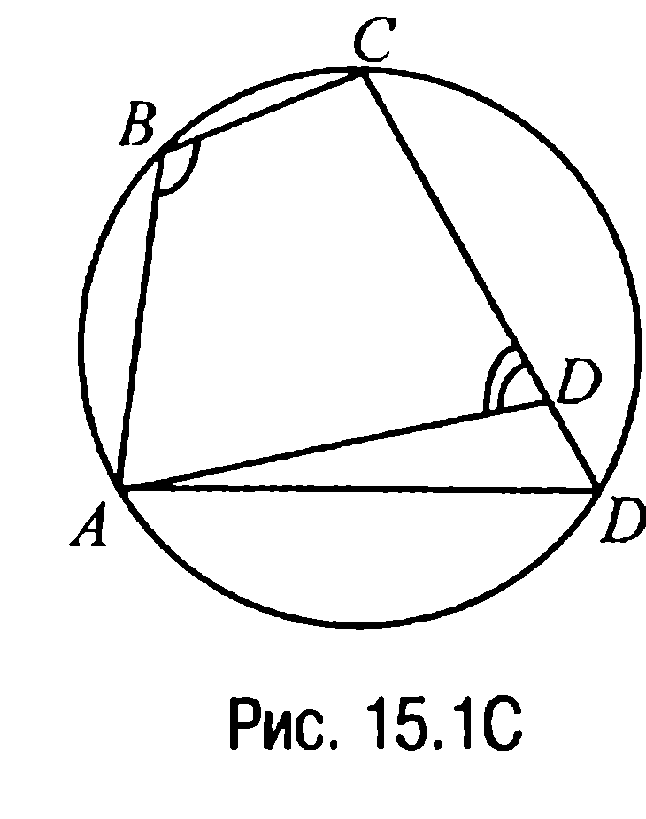
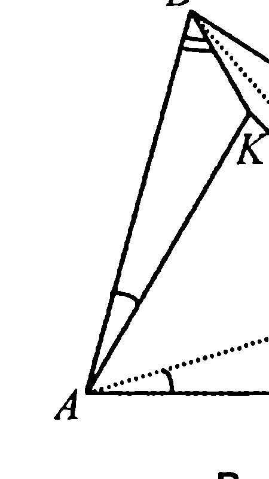
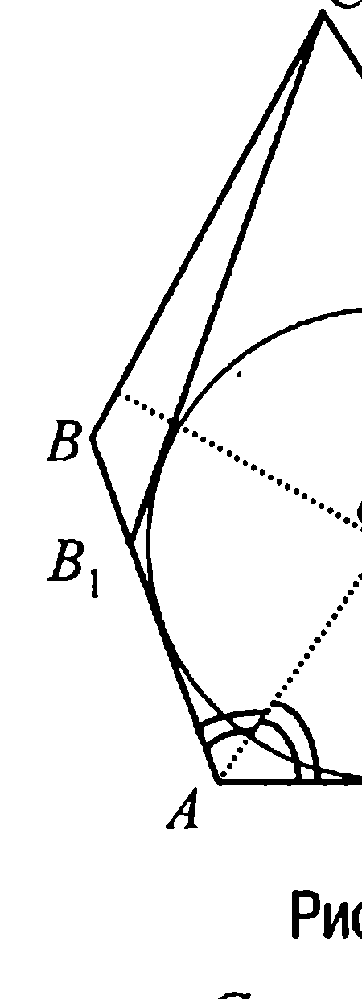
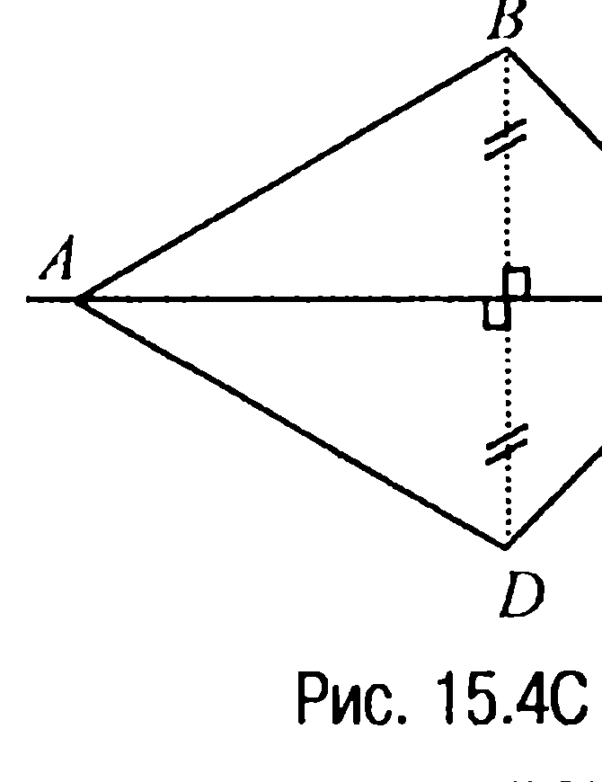
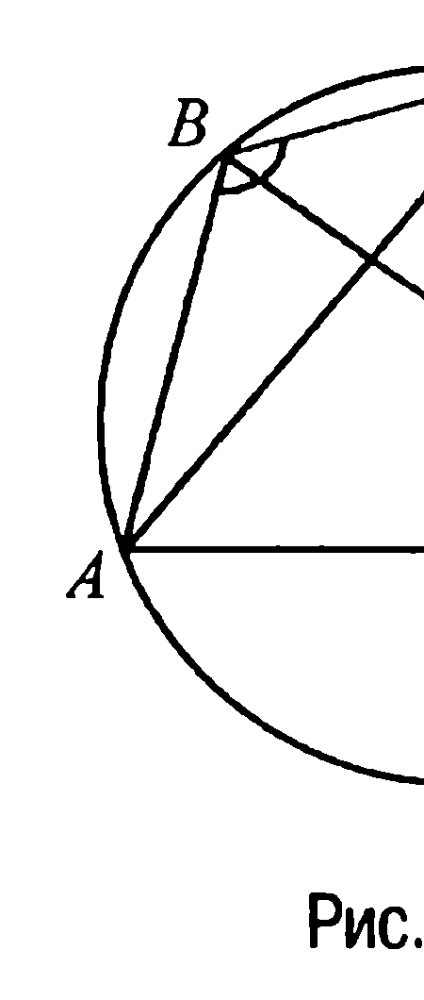
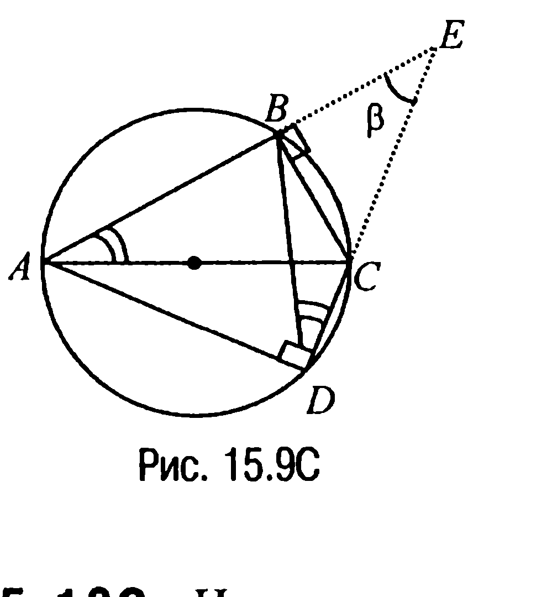
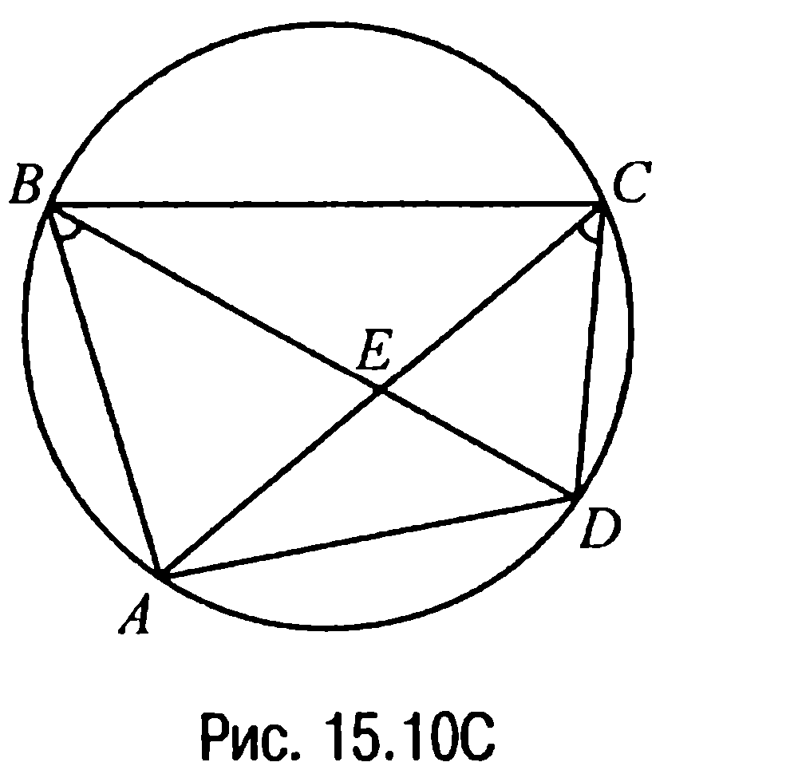
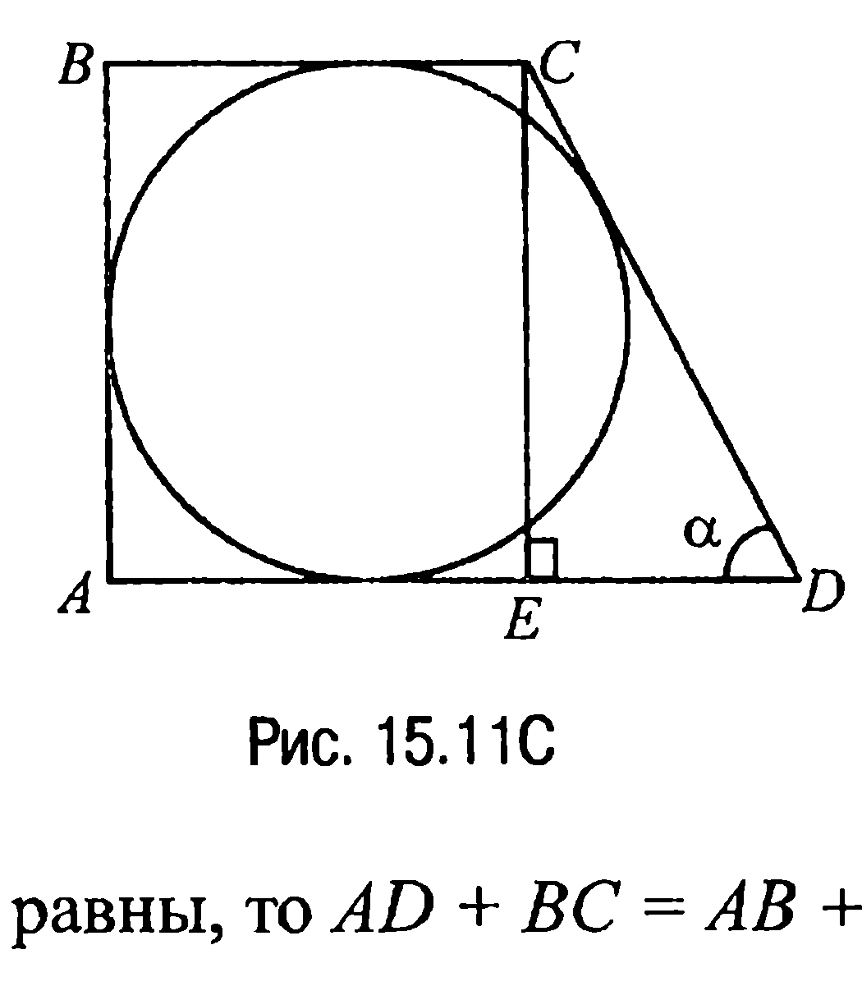

## 9.15. Вписанные и описанные четырехугольники

---
**стр. 452**
---

$KE = \frac{1}{2} AC, EL = \frac{1}{2} BD, LF = \frac{1}{2} AC, FK = \frac{1}{2} BD$.

Замечая же теперь, что в равнобочной трапеции диагонали равны, приходим к выводу, что $KE = EL = LF = FK$, откуда, с учетом условия перпендикулярности диагоналей, следует, что четырехугольник $KELF$ — квадрат и, таким образом, $EF = KL$.

**§15. Вписанные и описанные четырехугольники**

**15.1С.** Пусть в четырехугольнике $ABCD$ сумма углов $\angle ABC + \angle CDA = 180^\circ$, но при этом четырехугольник не является вписанным (рис. 15.1С). Тогда если провести через точки $A, B$ и $C$ окружность, то точка $D$ будет лежать либо внутри, либо вне круга, границей которого является проведенная окружность.

Предположим для определенности, что точка $D$ лежит внутри круга (в случае, если точка $D$ лежит вне круга, доказательство аналогично). Продолжим сторону $CD$ до пересечения с окружностью в точке $D_1$. Полученный четырехугольник $ABCD_1$ окажется вписанным и, следовательно, $\angle ABC + \angle CD_1A = 180^\circ$. А так как по условию $\angle ABC + \angle CDA = 180^\circ$, то $\angle CDA = \angle CD_1A$.

С другой стороны, угол $CDA$ — внешний угол треугольника $ADD_1$ и поэтому он должен быть больше угла $CD_1A$. Полученное противоречие и доказывает требуемое.

**15.2С.** Через точки $A$ и $B$ проведем прямые так, чтобы в получившемся треугольнике $ABK$ выполнялись равенства: $\angle BAK = \angle CAD$, $\angle KBA = \angle DCA$ (рис. 15.2С). Тогда по первому признаку подобия треугольников $\triangle ABK \sim \triangle ACD$ и, значит, $\frac{AB}{AC} = \frac{BK}{CD} = \frac{AK}{AD}$, откуда следует, что $AC \cdot BK = AB \cdot CD$.

---
**стр. 453**
---

Далее, так как $\angle BAC = \angle BAD - \angle CAD = \angle BAD - \angle BAK = \angle KAD$,

то по второму признаку подобия треугольников $\Delta AKD \sim \Delta ABC$ и,

таким образом, $\frac{KD}{BC} = \frac{AD}{AC}$, откуда $KD \cdot AC = BC \cdot AD$.

Но тогда $KD \cdot AC + AC \cdot BK = BC \cdot AD + AB \cdot CD$ или $AC \cdot (KD + BK) = BC \cdot AD + AB \cdot CD = AC \cdot BD$. Отсюда следует, что $KD + BK = BD$ и, значит, точка $K$ принадлежит отрезку $BD$, откуда вытекает равенство $\angle ABD = \angle ACD$.

Полученное равенство углов означает, что точки $A$, $B$, $C$ и $D$ лежат на одной окружности (отрезок $AD$ виден из точек $B$ и $C$ под одним углом), а это и требовалось доказать.

**15.3С.** Пусть $O$ — точка пересечения биссектрис углов $CDA$ и $DAB$ четырехугольника $ABCD$ (рис. 15.3С).

Тогда так как точка $O$ равноудалена от сторон $AB$ и $AD$, а также от сторон $AD$ и $CD$, то $O$ — центр окружности, касающейся сторон $AB$, $AD$ и $CD$. Предположим теперь, что при равенстве сумм противолежащих сторон четырехугольника $ABCD$ построенная окружность не касается стороны $BC$. В таком случае проведем через точку $C$ касательную к окружности, отличную от касательной $CD$, и обозначим через $B_1$ точку пересечения этой касательной с прямой $AB$.

Полученный четырехугольник $AB_1CD$ является описанным и, следовательно, $AB_1 + CD = AD + B_1C$. А так как по условию $AB + CD = AD + BC$, то, вычитая одно из этих равенств из другого, имеем $BB_1 = |BC - B_1C|$. Полученное равенство означает, что в треугольнике $CBB_1$ разность двух сторон равна третьей стороне.

---
**стр. 454**
---

Глава 9. Решения задач группы С

Но этого быть не может и потому построенная окружность должна касаться стороны $BC$.

**15.4С.** Если ось симметрии не проходит ни через одну вершину четырехугольника, он представляет собой равнобочную трапецию или прямоугольник и является вписанным. Рассмотрим тот случай, когда ось симметрии выпуклого четырехугольника, например, $ABCD$ проходит через его вершину, скажем, $A$.

Тогда очевидно, что эта ось будет проходить и через противолежащую вершине $A$ вершину $C$. Но в таком случае вершина $B$ будет симметрична вершине $D$ и, значит, сторона $AB$ окажется симметричной стороне $AD$, а сторона $BC$ будет симметрична стороне $CD$. Поэтому $AB = AD$, $BC = CD$ и, таким образом, $AB + CD = AD + BC$. Полученное равенство означает, что четырехугольник $ABCD$ является описанным около окружности и это есть или **дельтоид** (рис. 15.4С), или ромб.

**15.5С.** Пусть в четырехугольнике $ABCD$ сторона $AB = a$, $BC = b$, $CD = c$, $DA = d$ (рис. 15.5С) и пусть $AC = m$, $BD = n$, $\angle ABC = \phi$. Тогда по теореме косинусов из треугольников $ABC$ и $CDA$ имеем

$m^2 = a^2 + b^2 - 2a \cdot b \cdot \cos\phi$, $m^2 = c^2 + d^2 - 2c \cdot d \cdot \cos(180^\circ - \phi) = c^2 + d^2 + 2c \cdot d \cdot \cos\phi,$

откуда, с одной стороны, $\cos\phi = \frac{a^2 + b^2 - m^2}{2ab}$, а, с другой,

$\cos\phi = \frac{m^2 - c^2 - d^2}{2cd}$.

Таким образом, $\frac{a^2 + b^2 - m^2}{ab} = \frac{m^2 - c^2 - - d^2}{2cd}$ <!-- вероятная опечатка оригинала: в знаменателе первой дроби, видимо, должно быть $2ab$ --> или $m^2(ab + cd) = (ac + bd) \cdot (ad + bc)$ и, значит, $m^2 = \frac{(ac + bd)(ad + bc)}{ab + cd}$.

Аналогично, рассмотрев треугольники $DAB$ и $BCD$, получим, что

---
**стр. 455**
---

$n^2 = \frac{(ab + cd)(ac + bd)}{ad + bc}$. Но в таком случае $\frac{AC^2}{BD^2} = \frac{m^2}{n^2} = \frac{(ad + bc)^2}{(ab + cd)^2}$.

Отсюда $\frac{AC}{BD} = \frac{ad + bc}{ab + cd}$.

**Ответ:** $\frac{ad + bc}{ab + cd}\left(\frac{ab + cd}{ad + bc}\right)$.

**15.6С.** Пусть в прямоугольной трапеции $ABCD$ (рис. 15.6С) основания $BC$ и $AD$ равны соответственно $a$ и $b$ и пусть $CE \perp AD$, а $r$ — радиус окружности. Тогда так как $CE = 2r$, то $BC + AD = AB + DC = EC + DC = 2r + DC$, откуда следует, что $DC = a + b - 2r$. С другой стороны, поскольку $CD^2 = CE^2 + ED^2$, имеем $(a + b - 2r)^2 = 4r^2 + (b - a)^2$.

Отсюда после преобразований получаем, что $r = \frac{ab}{a + b}$.

**Ответ:** $\frac{ab}{a + b}$.

**15.7С.** Пусть $O$ — центр окружности, вписанной в трапецию $ABCD$, $E$ — точка касания этой окружности с боковой стороной $AB$ (рис. 15.7С). Тогда так как $\angle BOA = 90^\circ$ (задача 15.4), а радиус окружности $OE \perp AB$ (свойство 5.1X), то по свойству 3.8 имеем $OE^2 = BE \cdot EA$, что и требовалось доказать.

**15.8С.** Пусть $O$ — центр окружности, $E$ — точка касания касательной $l$ с окружностью (рис. 15.8С). Тогда так как $OE^2 = AE \cdot EB$, где $OE$ — радиус окружности (задача 15.7С), и так как $AC = AE$, а $BE = BD$, то $AC \cdot BD = AE \cdot EB = OE^2$, что и доказывает требуемое.

---
**стр. 456**
---

**15.9С.** Пусть $E$ — точка пересечения прямых $AB$ и $CD$ (рис. 15.9С).

Тогда так как $\angle BAC = \angle BDC$ (эти углы опираются на одну и ту же дугу $BC$), то $\Delta DEB \sim \Delta AEC$. Но в таком случае $\frac{BD}{AC} = \frac{BE}{EC} = \cos\beta$.

**Ответ:** $\frac{BD}{AC} = \cos\beta$.

**15.10С.** Из условия задачи следует, что $\angle ABD = \angle ACD$ (рис. 15.10С).

А тогда учитывая, что $180^\circ = \angle CEB + \angle EBC + \angle BCE = \angle CEB + \angle ABC - \angle ABD + \angle BCD - \angle ACD = 100^\circ + 78^\circ + 84^\circ - 2\angle ABD$, получаем

**Ответ:** $\angle ABD = 41^\circ$.

**15.11С.** Обозначим $\angle CDA = \alpha$ (рис. 15.11С).

Тогда из условия задачи следует, что $\sin\alpha = \frac{4}{5}$. Пусть $CE$ — высота трапеции. Очевидно, что $CE = 2r$. Из прямоугольного же треугольника $CED$ находим, что $CD = \frac{CE}{\sin\alpha} = 2r : \frac{4}{5} = \frac{5}{2}r$. А так как в описанном четырехугольнике суммы противолежащих сторон равны, то $AD + BC = AB + CD = 2r + \frac{5}{2}r = \frac{9}{2}r$. Воспользовавшись теперь формулой для вычисления площади $S$ трапеции, имеем
