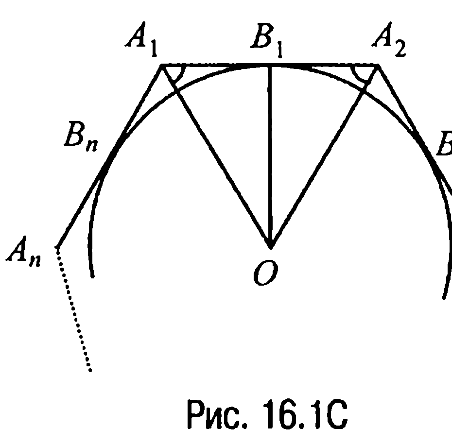
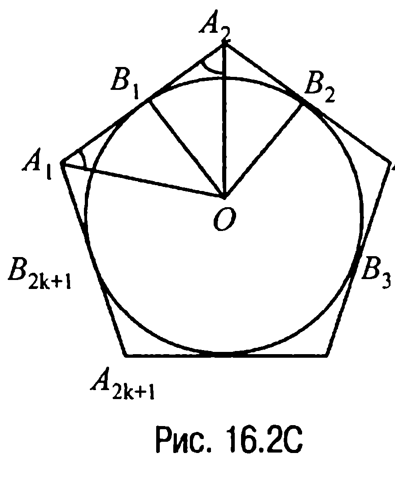
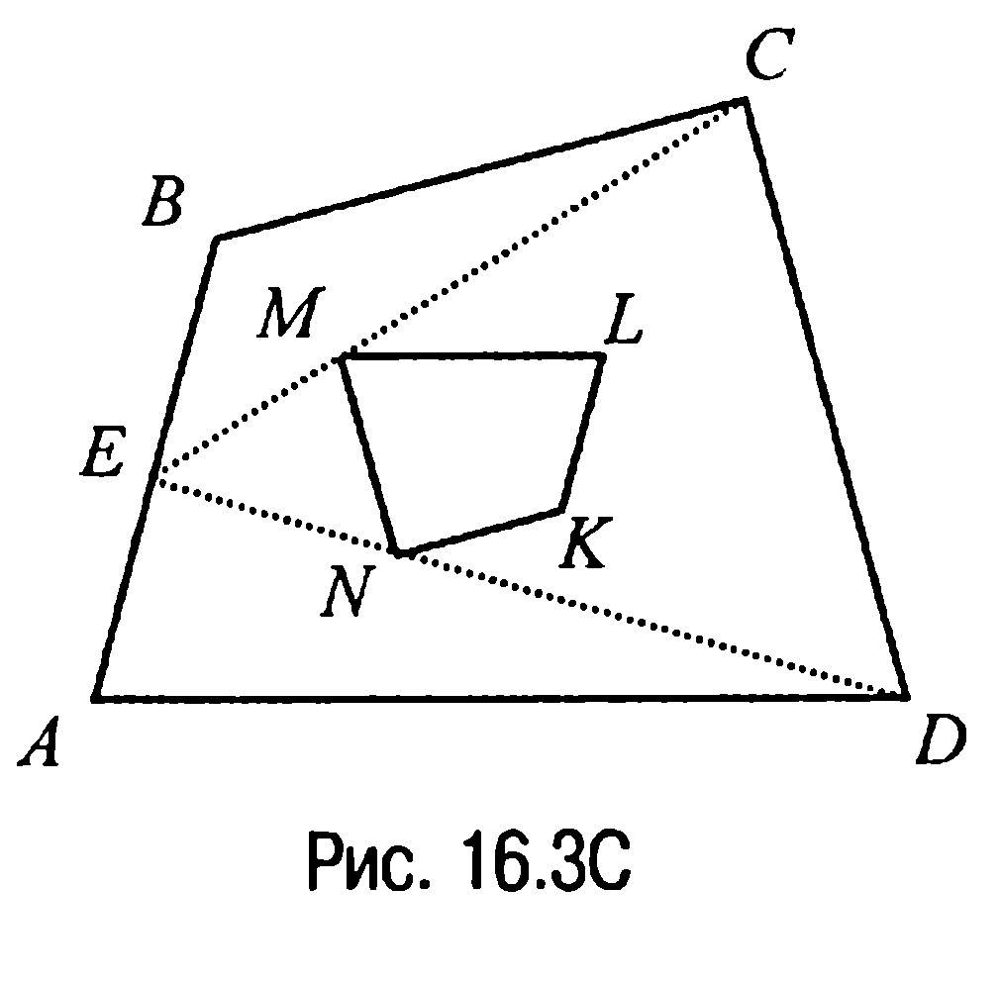
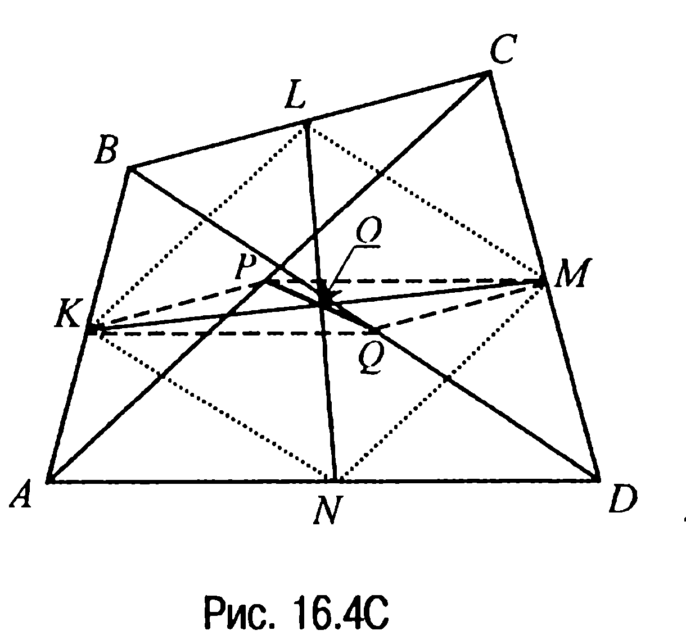
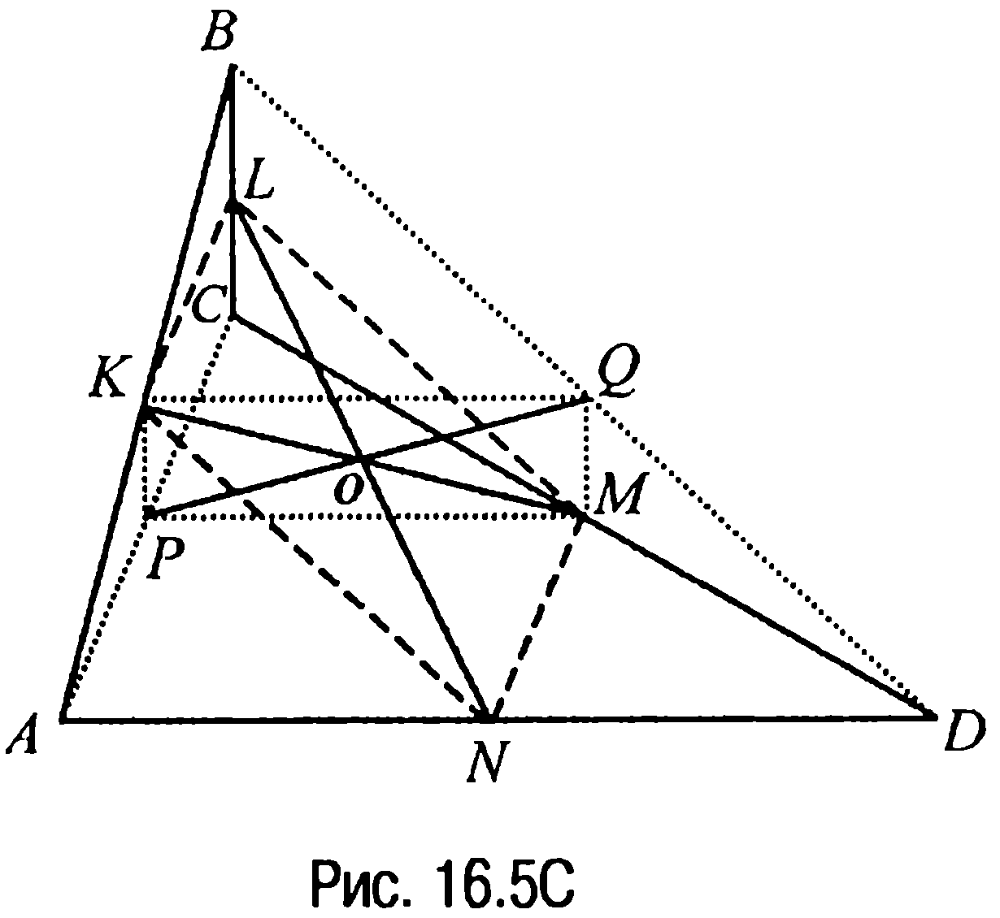
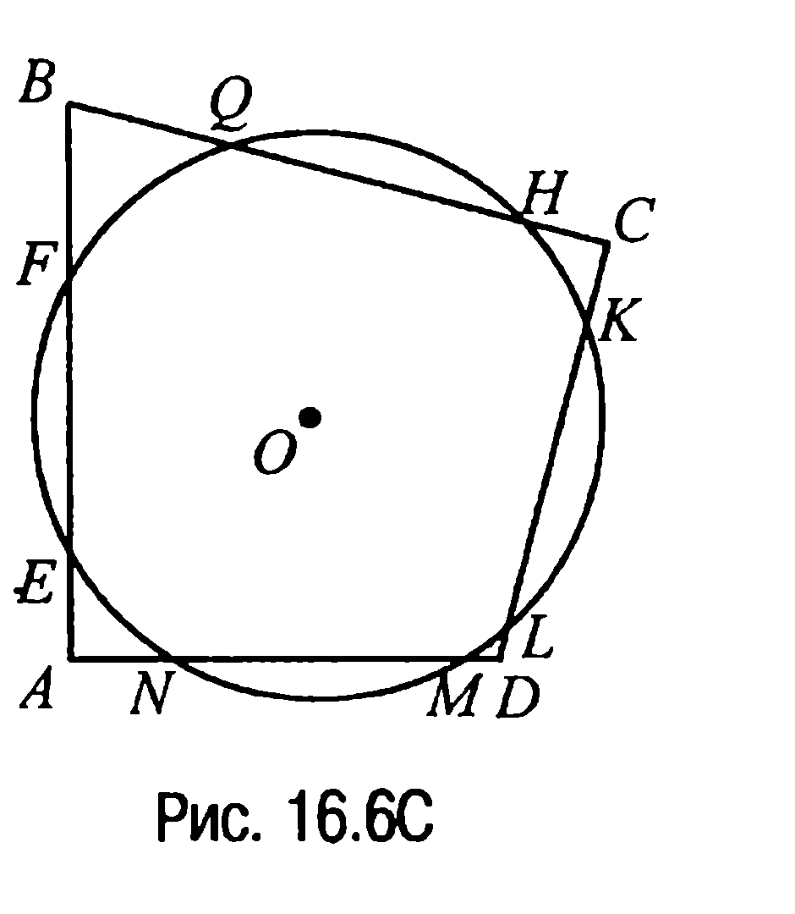

## 9.16. n-угольники (многоугольники), произвольные четырехугольники

---
**стр. 457**
---

$S = \frac{1}{2} AB \cdot (AD + BC) = \frac{1}{2} \cdot 2r \cdot \frac{9}{2} r = \frac{9}{2} r^2 = 8$. Отсюда $r = \frac{4}{3}$.

**Ответ:** $r = \frac{4}{3}$.

**15.12С.** Так как четырехугольник $ABCD$ является вписанным, то $AC \cdot BD = a \cdot c + b \cdot d$ (свойство 15.2X), а $\frac{AC}{BD} = \frac{ad + bc}{ab + cd}$ (задача 15.5С) или $AC = \frac{ad + bc}{ab + cd} \cdot BD$. Но в таком случае $BD^2 \cdot \frac{ad + bc}{ab + cd} = a \cdot c + b \cdot d$ и, значит,

$BD = \sqrt{\frac{(ac + bd)(ab + cd)}{ad + bc}}$, а

$AC = \frac{ad + bc}{ab + cd} \sqrt{\frac{(ac + bd)(ab + cd)}{ad + bc}} = \sqrt{\frac{(ac + bd)(ad + bc)}{ab + cd}}$.

**Ответ:** $AC = \sqrt{\frac{(ac + bd)(ad + bc)}{ab + cd}}$; $BD = \sqrt{\frac{(ac + bd)(ab + cd)}{ad + bc}}$.

**§16. $n$-угольники (многоугольники), произвольные четырехугольники**

**16.1С.** Пусть $a$ — сторона равностороннего $n$-угольника. Опустим на каждую сторону (или ее продолжение) этого $n$-угольника перпендикуляр $h_i$, $i = \overline{1, n}$, и соединим отрезками все вершины $n$-угольника с точкой $O$. В результате получим $n$ треугольников, площадь каждого из которых $S_i = \frac{1}{2} a \cdot h_i$, $i = \overline{1, n}$. Но в таком случае площадь данного $n$-угольника — это $S = \frac{1}{2} a(h_1 + h_2 + \dots + h_n)$, откуда следует, что $h_1 + h_2 + \dots + h_n = \frac{2S}{a}$, где $\frac{2S}{a}$ — величина постоянная. А это и доказывает требуемое.

---
**стр. 458**
---

**16.2С.** Пусть $A_1, A_2, A_3, \dots, A_n$ — вершины описанного около окружности с центром $O$ $n$-угольника, у которого $\angle A_n A_1 A_2 = \angle A_1 A_2 A_3 = \dots = \angle A_{n-1} A_n A_1$, и пусть $B_1, B_2, \dots, B_n$ — точки касания сторон $A_1 A_2, A_2 A_3, \dots, A_n A_1$ с окружностью соответственно (рис. 16.1С).

Тогда поскольку $A_1 O$ и $A_2 O$ — биссектрисы равных углов $A_n A_1 A_2$ и $A_1 A_2 A_3$, то $\angle OA_1 B_1 = \angle OA_2 B_1$ и, значит, прямоугольные треугольники $OB_1 A_1$ и $OB_1 A_2$ с общей стороной $OB_1$ равны. Но в таком случае $A_1 B_1 = B_1 A_2$. По свойству же касательных $B_1 A_2 = A_2 B_2$, а рассуждения, аналогичные проведенным выше, приводят к равенству $A_2 B_2 = B_2 A_3$. Таким образом, ясно, что $A_1 B_1 = B_1 A_2 = A_2 B_2 = B_2 A_3 = \dots = A_n B_n = B_n A_1$. Полученная цепочка равенств и означает, что данный $n$-угольник является правильным.

**16.3С.** Пусть $A_1, A_2, A_3, \dots, A_{2k+1}$ — вершины описанного около окружности с центром $O$ равностороннего $n$-угольника с нечетным числом сторон, равным $n = 2k + 1$, а $B_1, B_2, B_3, \dots, B_{2k+1}$ — точки касания сторон этого $n$-угольника с окружностью (рис. 16.2С).

Очевидно, что $A_2 B_1 = A_2 B_2$. А тогда, учитывая равенство сторон $n$-угольника, получаем, что $A_1 B_1 = A_3 B_2 = A_1 B_{2k+1} = A_3 B_3$, т. е. отрезки двух смежных сторон $n$-угольника, сходящихся в вершине $A_1$, считая от вершины до точек касания, равны таким же отрезкам сторон, сходящихся в вершине $A_3$. Аналогично показывается, что указанные отрезки равны отрезкам сторон, сходящихся в вершинах $A_5, A_7, \dots, A_{2k+1}$. Таким образом, отрезки сторон, примыкающих к вершинам $A_1$ и $A_{2k+1}$, равны, т. е. $A_1 B_{2k+1} = A_{2k+1} B_{2k+1}$ и, следовательно, сторона $A_1 A_{2k+1}$

---
**стр. 459**
---

делится точкой касания пополам. Очевидно, что таким же свойством обладают и все остальные стороны данного $n$-угольника. Но в таком случае, замечая, что $\Delta OA_1B_1 = \Delta OA_2B_1$ и, значит, что $\angle OA_1A_2 = \angle OA_2B_1$, приходим к выводу, что поскольку $A_1O$ и $A_2O$ — биссектрисы углов $A_{2k+1}A_1A_2$ и $A_1A_2A_3$ соответственно, то $\angle A_{2k+1}A_1A_2 = \angle A_1A_2A_3$.

Из предыдущих же рассуждений вытекает, что полученное равенство выстраивается в цепочку равенств, связывающих все углы равностороннего $n$-угольника, что и доказывает требуемое.

Пусть $n$ — число четное. При $n = 4$ примером описанного равностороннего неправильного четырехугольника является ромб. А тогда, заметив, что точки касания окружности делят стороны ромба на равные отрезки, можно, опираясь на этот факт, построить искомый пример в общем случае.

**16.4С.** Так как углы вписанного в окружность равностороннего $n$-угольника опираются на равные дуги, то все углы равны и, значит, вписанный равносторонний $n$-угольник является правильным.

**16.5С.** Пусть точка $E$ — середина стороны $AB$ выпуклого четырехугольника $ABCD$, точки $M, N, K$ и $L$ — точки пересечения медиан треугольников $ABC, ABD, ACD$ и $BCD$ соответственно (рис. 16.3С).

Тогда если рассмотреть угол $DEC$, то по свойству 6.5 медиан треугольника $EM = \frac{1}{3} EC$, а $EN = \frac{1}{3} ED$. Но в таком случае, исходя из характеристичности свойства 3.2, приходим к выводу, что сторона $MN$ четырехугольника $MNKL$ параллельна стороне $CD$ четырехугольника $ABCD$. Аналогично доказывается, что $NK \parallel BC$, $KL \parallel AB$ и $ML \parallel AD$, откуда и следует подобие искомых четырехугольников.

**16.6С.** Пусть точки $K, L, M$ и $N$ четырехугольника $ABCD$ — середины сторон $AB, BC, CD$ и $AD$ соответственно, точки $P$ и $Q$ — середины диагоналей $AC$ и $BD$ (рис. 16.4С, 16.5С).

---
**стр. 460**
---

Глава 9. Решения задач группы С

Тогда в треугольниках $ABC, BCD$ и $ABD, ACD$ соответственно $KP \parallel BC$, $QM \parallel BC$ и $KQ \parallel AD$, $PM \parallel AD$. Таким образом, четырехугольник $KPMQ$ — параллелограмм. Параллелограммом является и четырехугольник $KLMN$ (задача 13.1).

Обозначим через $O$ середину отрезка $KM$, являющегося диагональю параллелограммов $KPMQ$ и $KLMN$. В таком случае через точку $O$ будут проходить и отрезки $LN$ и $PQ$ как вторые диагонали параллелограммов $KPMQ$ и $KLMN$ соответственно. А это и доказывает требуемое.

**16.7С.** Пусть при пересечении сторон четырехугольника $ABCD$ (рис. 16.7С) <!-- вероятная опечатка оригинала: в тексте 16.7С, подпись рисунка — 16.6С --> с окружностью с центром $O$ образуются четыре равные хорды $EF, QH, KL$ и $MN$. Тогда поскольку равные хорды окружности находятся на равном расстоянии от центра $O$ окружности, то в исходный четырехугольник можно вписать окружность с тем же центром $O$. А отсюда на основании свойства 15.3X и следует, что суммы противолежащих сторон четырехугольника $ABCD$ равны.

**16.8С.** Противолежащие стороны нового четырехугольника (задача 13.1) являются средними линиями в треугольниках, на которые соответствующая диагональ разбивает исходный четырехугольник.

Ромбом полученный параллелограмм будет в случае, когда диагонали исходного четырехугольника равны, прямоугольником — ес-
