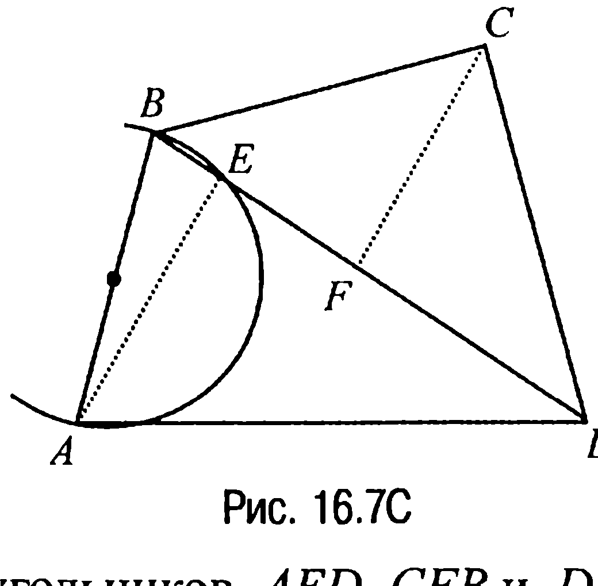
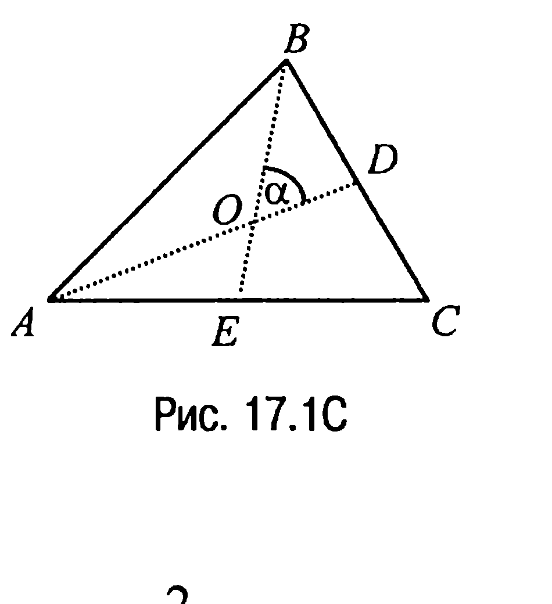
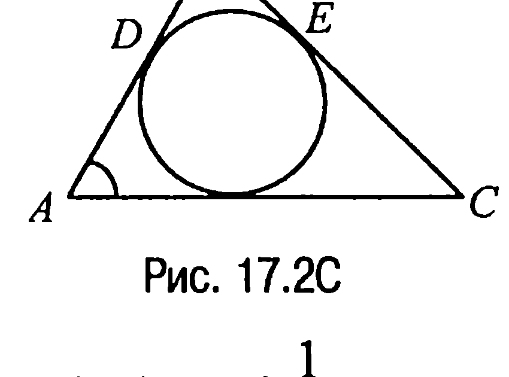
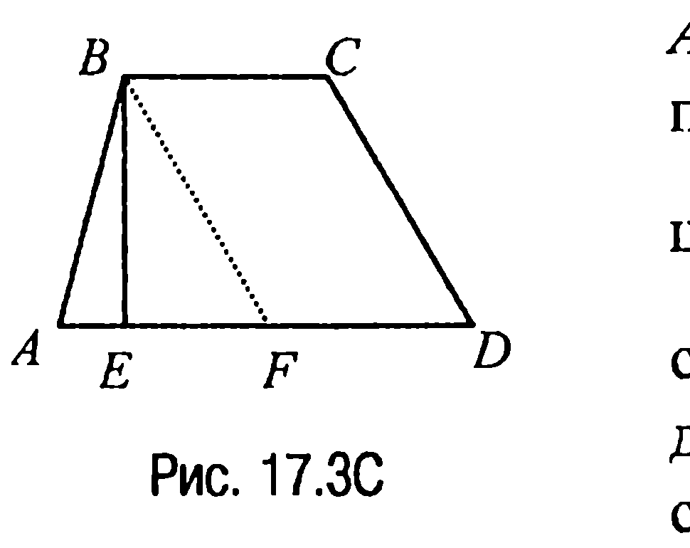
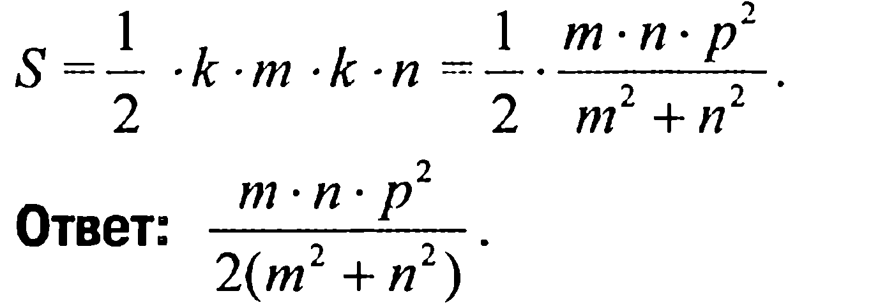
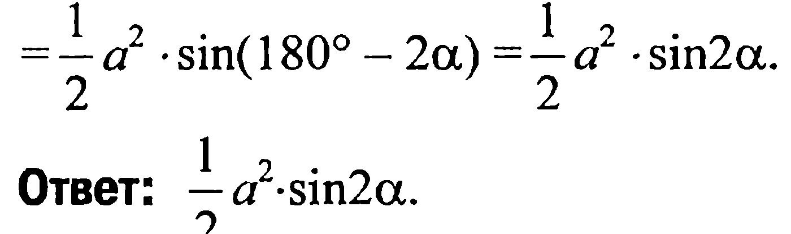

## 9.17. Площадь n-угольников

---
**стр. 461**
---

ли диагонали перпендикулярны, квадратом — если они равны и перпендикулярны.

**16.9С.** Пусть $ABCD$ — выпуклый четырехугольник (рис. 16.7С) и пусть $AE \perp BD$, $CF \perp BD$. Тогда если рассмотреть, например, прямоугольный треугольник $BEA$, то вся часть плоскости, ограниченная этим треугольником, будет лежать внутри круга, построенного на стороне $AB$ как на диаметре. Аналогичный факт имеет место и относительно прямоугольных треугольников $AED$, $CFB$ и $DFC$, что и доказывает требуемое.

**§17. Площадь $n$-угольников**

**17.1С.** Площадь треугольника $S = \frac{1}{2} a \cdot l_c \cdot \sin\frac{\gamma}{2} + \frac{1}{2} b \cdot l_c \cdot \sin\frac{\gamma}{2} =$

$= \frac{l_c(a + b)}{2} \cdot \sin\frac{\gamma}{2}$. Но как было показано при решении задачи 12.1

биссектриса $l_c = \frac{2ab}{a + b} \cdot \cos\frac{\gamma}{2}$ и, следовательно, $\cos\frac{\gamma}{2} = \frac{l_c(a + b)}{2ab}$.

Но в таком случае $\sin\frac{\gamma}{2} = \frac{\sqrt{4a^2b^2 - l_c^2(a + b)^2}}{2ab}$ и, таким образом,

$S = \frac{l_c(a + b)}{4ab} \cdot \sqrt{4a^2b^2 - l_c^2(a + b)^2}$.

**Ответ:** $\frac{l_c(a + b)}{4ab} \cdot \sqrt{4a^2b^2 - l_c^2(a + b)^2}$.

**17.2С.** Пусть $O$ — точка пересечения медиан треугольника $ABC$, $\angle DOB = \alpha$ (рис. 17.1С).

Тогда поскольку $S_{\Delta ABC} = 3S_{\Delta BOA}$ (задача 6.1), $AO = \frac{2}{3} AD$, $BO =$

---
**стр. 462**
---

$=\frac{2}{3}BE$ (свойство 6.5), а $S_{\Delta BOA} = \frac{1}{2}AO \times$

$\times BO \cdot \sin(\pi - \alpha) = \frac{1}{2} \cdot \frac{2}{3}m_a \cdot \frac{2}{3}m_b \cdot \sin\alpha =$

$= \frac{2}{9}m_a \cdot m_b \cdot \sin\alpha$, то $S_{\Delta ABC} = 3S_{\Delta BOA} =$

$= \frac{2}{3}m_a \cdot m_b \cdot \sin\alpha$.

**Ответ:** $\frac{2}{3}m_a \cdot m_b \cdot \sin\alpha$.

**17.3С.** Пусть вписанная в треугольник $ABC$ окружность касается сторон $AB$ и $BC$ в точках $D$ и $E$ соответственно (рис. 17.2С) и пусть $BE = m$, $EC = n$, $\angle CAB = 60^\circ$.

Обозначим $AD = x$. Тогда $AB = x + m$, $AC = x + n$. По теореме косинусов $BC^2 = AB^2 + AC^2 - 2AB \cdot AC \cdot \cos\angle CAB$ или $(m + n)^2 = (x + m)^2 + (x + n)^2 - 2(x +$

$+ m) \cdot (x + n) \frac{1}{2}$, откуда приходим к уравнению

$x^2 + (m + n)x - 3mn = 0$, решая которое, находим, что

$x = AD = \frac{-(m + n) + \sqrt{(m + n)^2 + 12mn}}{2}$.

Но в таком случае $AB = \frac{(m - n) + \sqrt{(m + n)^2 + 12mn}}{2}$,

$AC = \frac{(n - m) + \sqrt{(m + n)^2 + 12mn}}{2}$.

Подставляя теперь значения $AB$, $AC$ и $\sin\angle CAB$ в формулу $S = \frac{1}{2}AB \cdot AC \cdot \sin\angle CAB$ для вычисления площади треугольника $ABC$, находим, что $S = mn\sqrt{3}$.

**Ответ:** $mn\sqrt{3}$.

---
**стр. 463**
---

**17.4С.** Так как $\rho = p \cdot \operatorname{tg}\left(\frac{1}{2} \cdot \frac{\pi}{2}\right)$ (задача 9.8), где $p$ — полупериметр треугольника и, значит, $\rho = p$, то по теореме 17.8 площадь треугольника $S = p \cdot r = \rho \cdot r$.

**Ответ:** $\rho \cdot r$.

**17.5С.** Пусть в трапеции $ABCD$ основание $AD = a$, $BC = b$, $AB = c$, $CD = d$, а $BE = h$ — высота трапеции (рис. 17.3С). Тогда так как площадь трапеции $S = \frac{a+b}{2} \cdot h$, то задача сводится к нахождению высоты $h$. Найдем ее. Обозначим через $F$ точку пересечения прямой $AD$ с прямой, проходящей через точку $B$ параллельно $CD$. Тогда $h = \frac{2S_{\Delta ABF}}{AF}$ и, значит,

$S = \frac{a+b}{a-b}S_{\Delta ABF}$. Отсюда, вычисляя площадь $S_{\Delta ABF}$ треугольника $ABF$ со сторонами $a-b$, $c$, $d$ по формуле Герона, находим, что

$S = \frac{a+b}{4(a-b)}\sqrt{(a-b+c+d)(b-a+c+d)(a-b-c+d)(a-b-d+c)}$.

**Ответ:** $\frac{a+b}{4(a-b)}\sqrt{(a-b+c+d)(b-a+c+d)(a-b-c+d)(a-b-d+c)}$.

**17.6С.** В соответствии с условием задачи средняя линия трапеции равна ее высоте (задача 14.10С). А тогда так как средняя линия трапеции равна полусумме ее оснований (свойство 14.5X), то площадь трапеции $S = a \cdot a = a^2$.

**Ответ:** $a^2$.

**17.7С.** В соответствии с условием задачи диагонали ромба равны $k \cdot m$ и $k \cdot n$, где $k > 0$ — некоторое число. А тогда если $a$ — сторона ромба, то $4a^2 = k^2 \cdot m^2 + k^2 \cdot n^2$ (свойство 13.5X), откуда $a = \frac{k\sqrt{m^2 + n^2}}{2}$. Но в таком случае $2p = 4a = 2k\sqrt{m^2 + n^2}$ и, зна-

---
**стр. 464**
---

чит, $k = \frac{p}{\sqrt{m^2 + n^2}}$. Таким образом, площадь ромба

$$S = \frac{1}{2} \cdot k \cdot m \cdot k \cdot n = \frac{1}{2} \cdot \frac{m \cdot n \cdot p^2}{m^2 + n^2}.$$

**Ответ:** $\frac{m \cdot n \cdot p^2}{2(m^2 + n^2)}$.

**17.8С.** Отложим на продолжении отрезка $AB$ за точку $B$ отрезок $BM = AD$ (рис. 17.4С).

Тогда так как $BC = CD$, $\angle ABC + \angle ADC = 180^\circ$, то $\angle MBC = 180^\circ - \angle ABC = 180^\circ - (180^\circ - \angle ADC) = \angle ADC$, и, значит, треугольники $MBC$ и $ADC$ равны. Но в таком случае $AC = CM = a$ и, следовательно, треугольник $ACM$ является равнобедренным, причем таким, что $\angle CAM = \angle CMA = \angle CAD = \alpha$. Отсюда следует, что $S_{ABCD} = S_{\Delta ACM} =$

$$= \frac{1}{2} a^2 \cdot \sin(180^\circ - 2\alpha) = \frac{1}{2} a^2 \cdot \sin 2\alpha.$$

**Ответ:** $\frac{1}{2} a^2 \cdot \sin 2\alpha$.

**17.9С.** Продолжим боковые стороны трапеции $ABCD$ до пересечения в точке $E$ (рис. 17.5С).

Тогда площадь трапеции $ABCD$ — это $S_{ABCD} = S_{\Delta AED} - S_{\Delta BEC}$. Найдем $S_{\Delta AED}$ и $S_{\Delta BEC}$, заметив, что

$$S_{\Delta AED} = \frac{1}{2} \cdot AE \cdot DE \cdot \sin(\alpha + \beta),$$

$$S_{\Delta BEC} = \frac{1}{2} \cdot BE \cdot CE \cdot \sin(\alpha + \beta),$$

где $AE$, $DE$, $BE$ и $CE$ находятся на основании теоремы синусов из соотношений $\frac{AE}{\sin \beta} = \frac{DE}{\sin \alpha} = \frac{a}{\sin(\alpha + \beta)}$, $\frac{BE}{\sin \beta} = \frac{CE}{\sin \alpha} = \frac{b}{\sin(\alpha + \beta)}$. Отсюда получаем, что $AE = \frac{a \cdot \sin \beta}{\sin(\alpha + \beta)}$,
