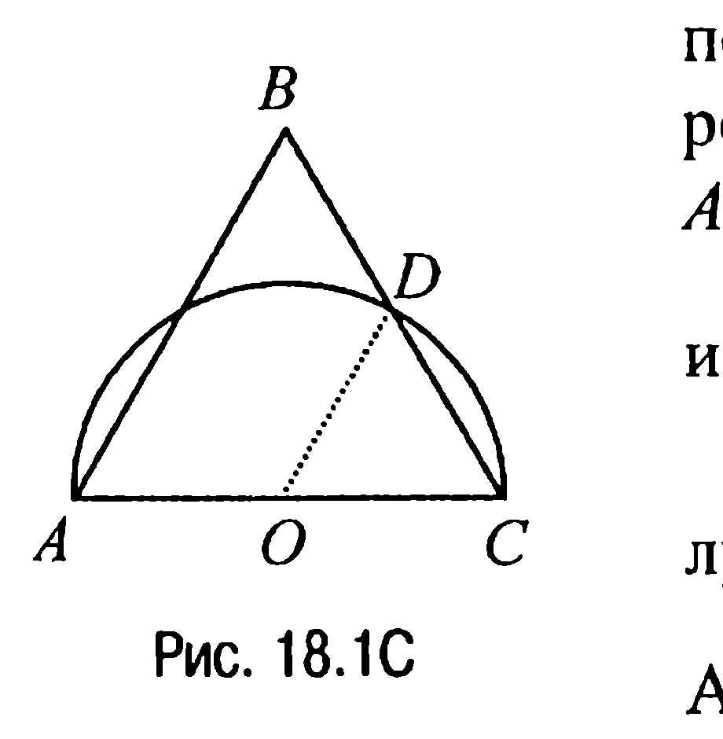
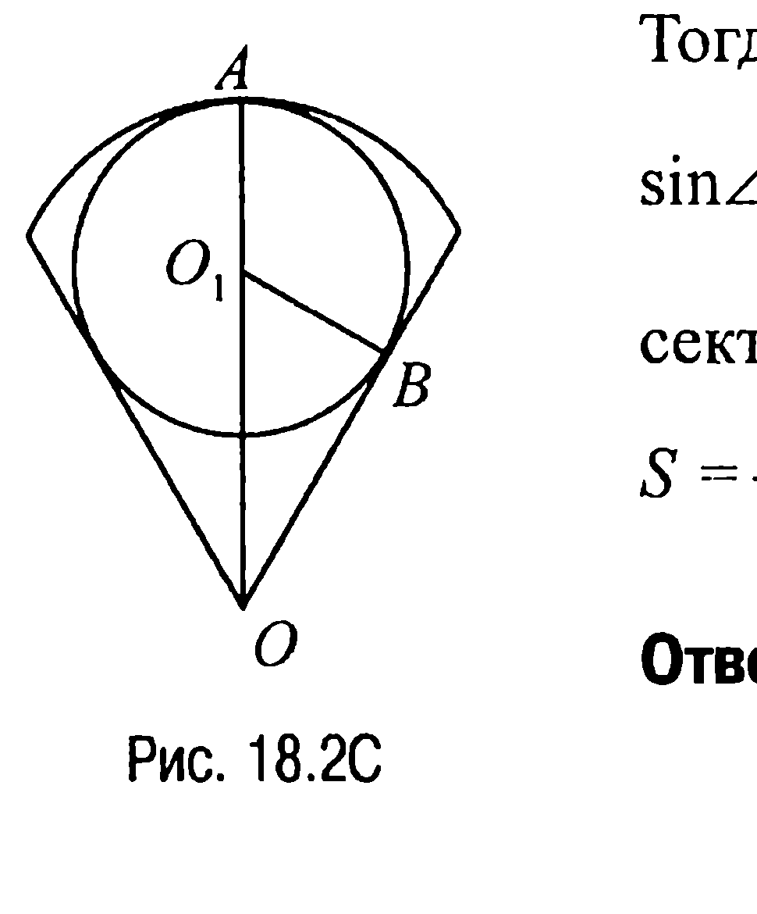
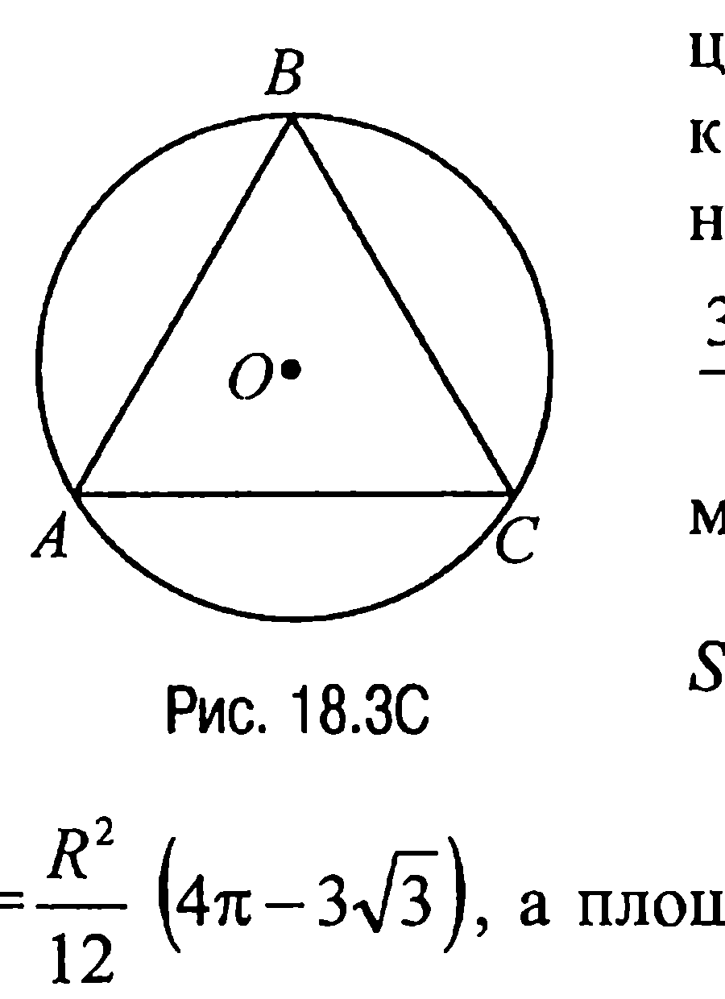

## 9.18. Площадь круга и его частей

---
**стр. 465**
---

$DE = \frac{a \cdot \sin \alpha}{\sin(\alpha + \beta)}$, $BE = \frac{b \cdot \sin \beta}{\sin(\alpha + \beta)}$ и $CE = \frac{b \cdot \sin \alpha}{\sin(\alpha + \beta)}$ и, таким образом,

$S_{ABCD} = \frac{1}{2} \cdot \frac{a \cdot \sin \beta}{\sin(\alpha + \beta)} \cdot \frac{a \cdot \sin \alpha}{\sin(\alpha + \beta)} \cdot \sin(\alpha + \beta) -$

$- \frac{1}{2} \cdot \frac{b \cdot \sin \beta}{\sin(\alpha + \beta)} \cdot \frac{b \cdot \sin \alpha}{\sin(\alpha + \beta)} \cdot \sin(\alpha + \beta) = \frac{1}{2}(a^2 - b^2) \frac{\sin \alpha \cdot \sin \beta}{\sin(\alpha + \beta)}$.

Ответ: $\frac{1}{2}(a^2 - b^2) \frac{\sin \alpha \cdot \sin \beta}{\sin(\alpha + \beta)}$.

**§18. Площадь круга и его частей**

**18.1C.** Пусть $O$ — центр данной полуокружности, а $D$ — точка пересечения этой полуокружности со стороной $BC$ равностороннего треугольника $ABC$ (рис. 18.1C). Площадь последнего, как известно, $S_1 = \frac{AC^2 \sqrt{3}}{4} = R^2 \sqrt{3}$. Площадь полукруга $S_2 = \frac{\pi R^2}{2}$.

А поскольку треугольник $COD$ — равносторонний, то площадь сегмента, соответствующего дуге $CD$,

$S_3 = \frac{\pi}{6} R^2 - \frac{\sqrt{3}}{4} R^2 = \frac{R^2}{4} \left( \frac{\pi}{3} - \frac{\sqrt{3}}{2} \right)$ <!-- вероятная опечатка оригинала: при данных слагаемых слева в скобках должно быть $\frac{2\pi}{3} - \sqrt{3}$ -->

и, значит, искомая площадь

$S = S_1 + 2S_3 - S_2 = R^2 \sqrt{3} + R^2 \left( \frac{\pi}{3} - \frac{\sqrt{3}}{2} \right) - \frac{\pi R^2}{2} = \frac{R^2}{6} (3\sqrt{3} - \pi)$.

Ответ: $\frac{R^2}{6} (3\sqrt{3} - \pi)$.

**18.2C.** Пусть $A$ и $B$ — точки касания окружности радиуса $r$ с центром в точке $O_1$, вписанной в сектор радиуса $R$, дуга которого является дугой окружности с центром в точке $O$ (рис. 18.2C).

---
**стр. 466**
---

Тогда очевидно, что $O_1O = OA - O_1A = R - r$,

$\sin \angle BOO_1 = \frac{O_1B}{O_1O} = \frac{r}{R - r}$ и, значит, площадь сектора

$S = \frac{1}{2} R^2 \cdot 2\arcsin \frac{r}{R - r} = R^2 \cdot \arcsin \frac{r}{R - r}$.

Ответ: $R^2 \cdot \arcsin \frac{r}{R - r}$.

**18.3C.** Пусть $AC$ — искомая хорда, а $R$ — радиус окружности с

центром $O$, являющейся границей данного круга (рис. 18.3C). Тогда площадь правильного вписанного треугольника $ABC$ равна $\frac{3R^2\sqrt{3}}{4}$, а площадь круга $S = \pi \cdot R^2$. Поэтому площадь меньшего сегмента

$S_1 = \frac{1}{3}(S - S_{\triangle ABC}) = \frac{1}{3}\left(\pi R^2 - \frac{3\sqrt{3}}{4} R^2\right) =$

$= \frac{R^2}{12}(4\pi - 3\sqrt{3})$, а площадь большего сегмента $S_2 = S - S_1 = \pi R^2 -$

$- \frac{R^2}{12}(4\pi - 3\sqrt{3}) = \frac{R^2}{12}(8\pi + 3\sqrt{3})$.

Таким образом, $S_1 : S_2 = (4\pi - 3\sqrt{3}) : (8\pi + 3\sqrt{3})$.

Ответ: $\frac{4\pi - 3\sqrt{3}}{8\pi + 3\sqrt{3}} \left(\frac{8\pi + 3\sqrt{3}}{4\pi - 3\sqrt{3}}\right)$.

**18.4C.** Пусть $M$ — точка пересечения диагоналей четырехугольника $ABCD$ (рис. 18.4C). Тогда угол $DMC$ как угол, вершина которого лежит внутри круга, равен полусумме дуг $AB$ и $CD$. По условию этот же угол равен $\frac{\pi}{2}$ и, значит, $\frac{1}{2}(\cup AB + \cup CD) = \frac{\pi}{2}$ или $\cup AB + \cup CD = \pi$.
