## 9.19. Отношение площадей

---
**стр. 467**
---

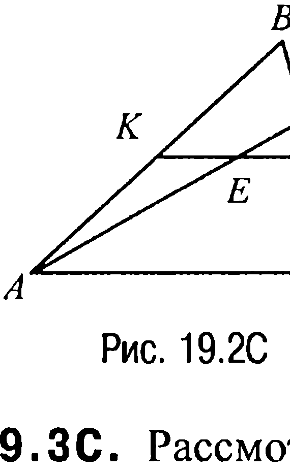

С другой стороны, по условию $\angle AOB = 3\angle COD$. Следовательно, $3\cup CD + \cup CD = \pi$ и, таким образом, $\cup CD = \frac{\pi}{4}$.

Далее, поскольку $\angle DAC = \frac{1}{2}\angle DOC = \frac{\pi}{8}$, то по теореме синусов из треугольника $DAC$ можно найти радиус $R$ окружности $s$.

Именно, $R = \frac{CD}{2\sin\angle DAC} = \frac{10}{2\sin\frac{\pi}{8}} = \frac{5}{\sin\frac{\pi}{8}} = \frac{5}{\sqrt{\frac{1-\cos(\pi/4)}{2}}} = 5\sqrt{4+2\sqrt{2}}$.

Но в таком случае искомая площадь круга равна $\pi \cdot R^2 = \pi \cdot 25(4+2\sqrt{2}) = 50(2+\sqrt{2})\cdot\pi$.

Ответ: $50(2+\sqrt{2})\cdot\pi$.

**§ 19. Отношение площадей**

**19.1C.** Так как треугольники $AFE$ и $BCF$ подобны (рис. 19.1C), то $AE : BC = 1 : 5$.

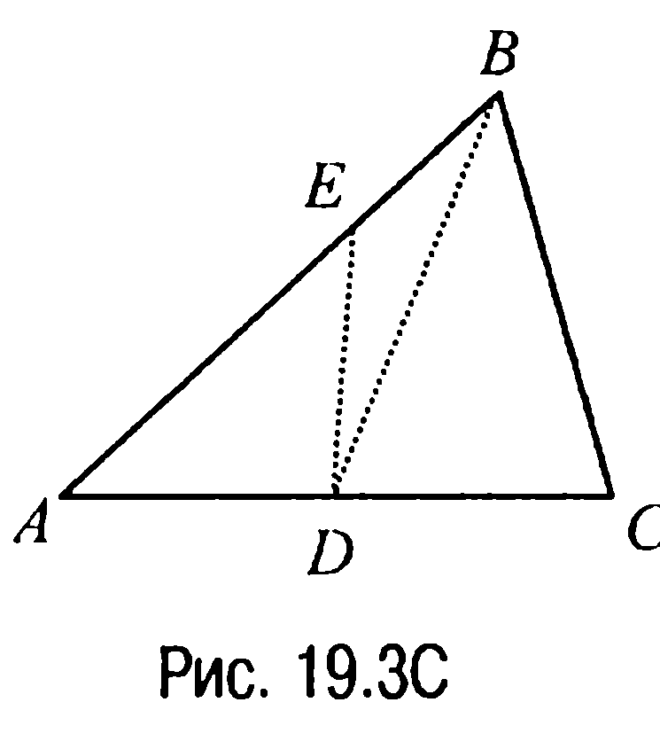

Но в таком случае $\frac{S_{\triangle AFE}}{S_{\triangle BCF}} = \left(\frac{AE}{BC}\right)^2 = \frac{1}{25}$.

Ответ: $\frac{1}{25}$.

**19.2C.** По свойству 1.12 имеем $\frac{S_{\triangle ABD}}{S_{\triangle ADC}} = \frac{BD}{DC}$. Найдем отношение $\frac{BD}{DC}$.

Итак, пусть точка $E$ — середина отрезка $KL$ (рис. 19.2C).

Тогда $EL = \frac{1}{2}KL = \frac{1}{4}AC$. Из подобия же треугольников $EDL$ и $ADC$ следует, что $\frac{EL}{AC} = \frac{DL}{DC} = \frac{1}{4}$ и, значит, $DC = 4\cdot DL$.

---
**стр. 468**
---

А тогда, замечая, что $DL = \frac{1}{3} LC = \frac{1}{2} BD$, т. е. что $BD = 2 \cdot DL$, находим отношение $\frac{BD}{DC} = \frac{2DL}{4DL} = \frac{1}{2}$.

Ответ: $1 : 2$.

**19.3C.** Рассмотрим треугольник $ABC$, где $BD$ — его медиана, а $EB = \frac{1}{3} AB$ (рис. 19.3C). Тогда имеем следующую цепочку равенств:

$S_{\triangle BDE} = \frac{1}{3} S_{\triangle BDA} = \frac{1}{3} \cdot \frac{1}{2} \cdot S_{\triangle ABC}$.

Таким образом, $S_{\triangle BDE} : S_{\triangle ABC} = 1 : 6$.

Ответ: $1 : 6$.

**19.4C.** Пусть $N$ и $K$ — точки медианы $BM$ такие, что $BN = \frac{1}{4} \cdot BM$, $BK = \frac{1}{2} \cdot BM$ (рис. 19.4C). Тогда так как треугольники $ABE$ и $AEC$ имеют общую вершину $A$, то искомое отношение равно отношению $BE / EC$. Найдем это отношение. Для этого проведем через точки $N$, $K$ и $M$ прямые, параллельные $DE$. По теореме Фалеса на стороне $BC$ получим четыре равных отрезка $BP$, $PQ$, $QE$ и $EF$. Но отрезок $FC = EF$, так как $MF$ — средняя линия треугольника $AEC$, поэтому $BE : EC = 3 : 2$.

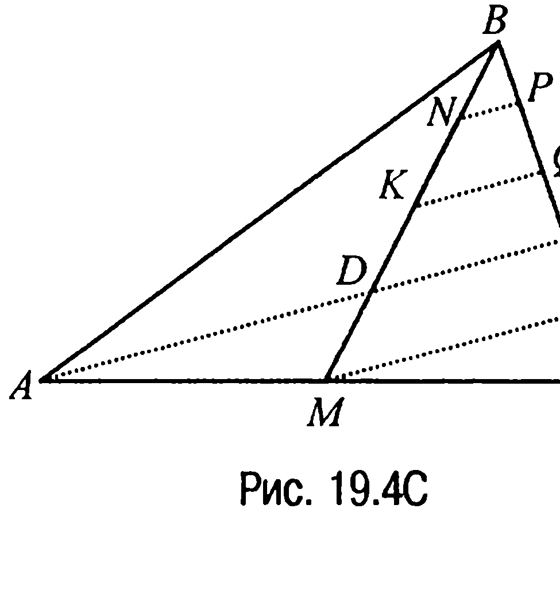

Ответ: $3 : 2$.

**19.5C.** Пусть $O$ — точка пересечения медиан треугольника $ABC$, а $A'$, $B'$ и $C'$ — точки, которые делят соответствующие медианы в отношении $1 : 3$, считая от вершин, $P$ — точка пересечения ме-

---
**стр. 469**
---

дианы $AK$ с отрезком $B'C'$ (рис. 19.5C). Обозначим $AA' = x$, тогда

$AK = 4x$, $AO = \frac{2}{3} AK = \frac{8}{3} x$, $A'O = AO - AA' = \frac{8}{3} x - x = \frac{5}{3} x$,

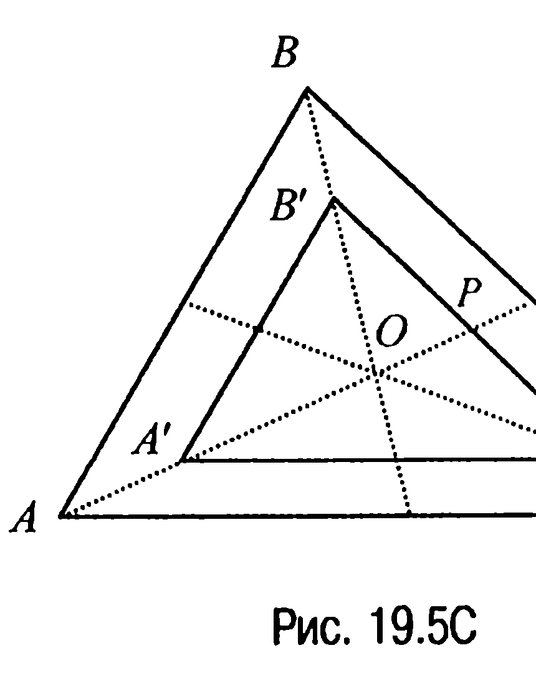

$OP = \frac{1}{2} A'O = \frac{5}{6} x$ (поскольку $A'P$ — медиана треугольника $A'B'C'$, подобного треугольнику $ABC$). Но в таком случае поскольку $A'P = A'O + OP = \frac{5}{3} x + \frac{5}{6} x =$

$= \frac{5}{2} x$, а площади подобных треугольников относятся как квадраты сходственных линейных элементов, то $\frac{S_{\triangle ABC}}{S_{\triangle A'B'C'}} = \frac{AK^2}{A'P^2} = \frac{16x^2}{\frac{25}{4}x^2} = \frac{64}{25} = 2{,}56$.

Ответ: в 2,56 раза.

**19.6C.** Пусть $O$ — точка пересечения медиан треугольника $ABC$ (рис. 19.6C). Эта точка делит каждую медиану в отношении $2 : 1$, считая от вершины, и поэтому точки $P$, $Q$ и $R$ лежат соответственно на отрезках $OA$, $OB$ и $OC$, причем

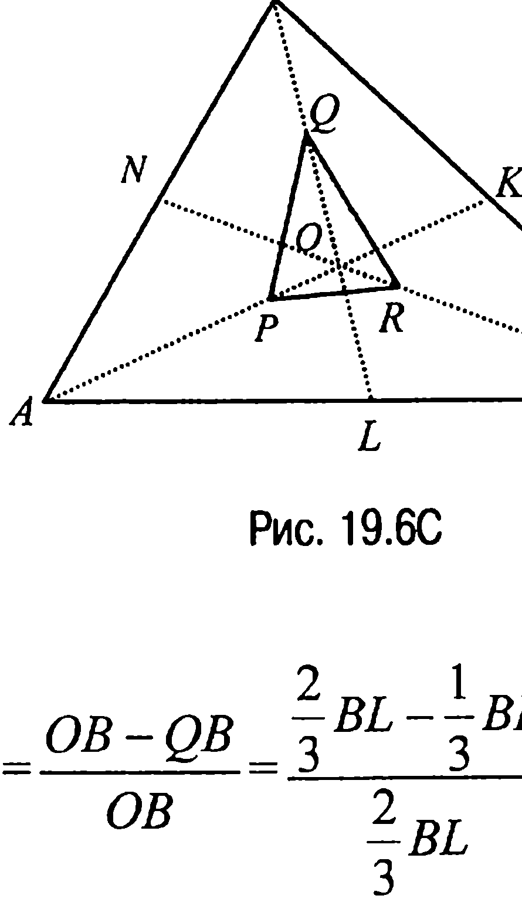

$\frac{OP}{OA} = \frac{OA - PA}{OA} = \frac{\frac{2}{3} AK - \frac{1}{2} AK}{\frac{2}{3} AK} = \frac{1}{4}$, $\frac{OQ}{OB} =$

$= \frac{OB - QB}{OB} = \frac{\frac{2}{3} BL - \frac{1}{3} BL}{\frac{2}{3} BL} = \frac{1}{2}$, а $\frac{OR}{OC} = \frac{OC - RC}{OC} = \frac{\frac{2}{3} CN - \frac{5}{9} CN}{\frac{2}{3} CN} = \frac{1}{6}$.

Теперь поскольку площадь каждого из треугольников $OAB$, $OBC$ и

---
**стр. 470**
---

$OCA$ равна $\frac{2}{3}$ (задача 6.1), то в соответствии со свойством 19.2

$S_{\triangle OPQ} = \frac{OP \cdot OQ}{AO \cdot OB} \cdot S_{\triangle OAB} = \frac{1}{4} \cdot \frac{1}{2} \cdot \frac{2}{3} = \frac{1}{12}$,

$S_{\triangle OQR} = \frac{OQ \cdot OR}{OB \cdot OC} \cdot S_{\triangle OBC} = \frac{1}{2} \cdot \frac{1}{6} \cdot \frac{2}{3} = \frac{1}{18}$,

$S_{\triangle OPR} = \frac{OR \cdot OP}{OC \cdot OA} \cdot S_{\triangle OCA} = \frac{1}{6} \cdot \frac{1}{4} \cdot \frac{2}{3} = \frac{1}{36}$.

Таким образом, $S_{\triangle PQR} = \frac{1}{12} + \frac{1}{18} + \frac{1}{36} = \frac{1}{6}$.

Ответ: $\frac{1}{6}$.

**19.7C.** Пусть прямая $FD$, где $F$ — точка отрезка $AB$, параллельна прямой $BC$ (рис. 19.7C). Тогда четырехугольник $BEDF$ — параллелограмм и, значит, $\triangle BED = \triangle BDF$.

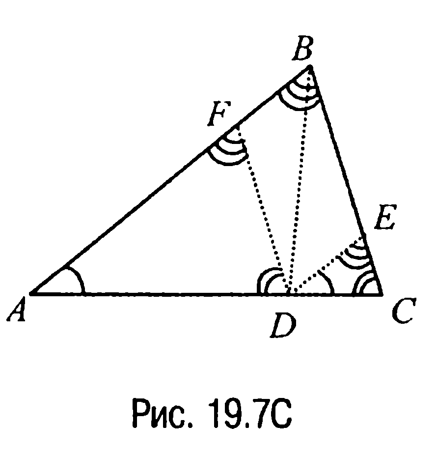

Но в таком случае

$S_{\triangle AFD} + S_{\triangle DEC} = S_{\triangle ABC} - 2 \cdot S_{\triangle BED} =$

$= \left(1 - \frac{2 \cdot 3}{16}\right) S_{\triangle ABC} = \frac{5}{8} S_{\triangle ABC}$.

Обозначим искомое отношение $\frac{BE}{EC} = x$.

По обобщенной теореме Фалеса $\frac{BE}{EC} = \frac{AD}{DC} = x$.

Учитывая же, что треугольники $AFD$ и $DEC$ подобны треугольнику $ABC$, имеем

$\frac{BC}{FD} = \frac{AC}{AD} = \frac{AD + DC}{AD} = 1 + \frac{DC}{AD} = 1 + \frac{1}{x} = \frac{x + 1}{x}$,

$\frac{AB}{DE} = \frac{AC}{DC} = \frac{AD + DC}{DC} = \frac{AD}{DC} + 1 = \frac{x + 1}{1}$.

Теперь поскольку площади подобных треугольников относятся как квадраты сходственных сторон, то

---
**стр. 471**
---

$\frac{S_{\Delta DEC}}{S_{\Delta ABC}} = \frac{1}{(x+1)^2}$, $\frac{S_{\Delta AFD}}{S_{\Delta ABC}} = \frac{x^2}{(x+1)^2}$ и, значит, $S_{\Delta AFD} + S_{\Delta DEC} =$

$= \frac{x^2+1}{(x+1)^2} \cdot S_{\Delta ABC}$. Таким образом, $\frac{x^2+1}{(x+1)^2} = \frac{5}{8}$ и, как легко вычис-

лить, $x_1 = \frac{1}{3}$, $x_2 = 3$.

**Ответ:** $\frac{BE}{EC} = \frac{1}{3}$ (3).

**19.8С.** Пусть в трапеции $ABCD$ точки $E$ и $F$ — серединные точки оснований $BC$ и $AD$ соответственно, а $\varphi$ — угол между диагональю $AC$ и отрезком $EF$ (рис. 19.8С). Тогда площадь четырехугольника $AECF$ вычисляется по формуле

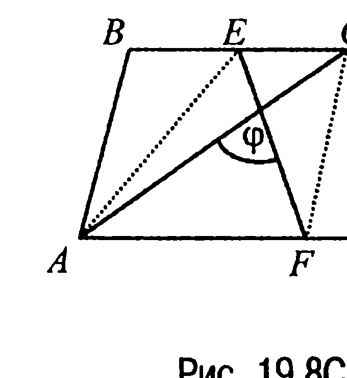

$S_{AECF} = \frac{1}{2} AC \cdot EF \cdot \sin \varphi$.

Но, с другой стороны, $S_{AECF} = \frac{1}{2} S_{ABCD}$ (высоты у трапеций $ABCD$ и $AECF$ равны, $EC = \frac{1}{2} BC$, $AF = \frac{1}{2} AD$), откуда и следует требуемое.

**19.9С.** Из условия задачи следует (рис. 19.9С), что $S_{\Delta ABO} = a - c$, $S_{\Delta CDO} = b - c$. Но тогда (задача 16.13)

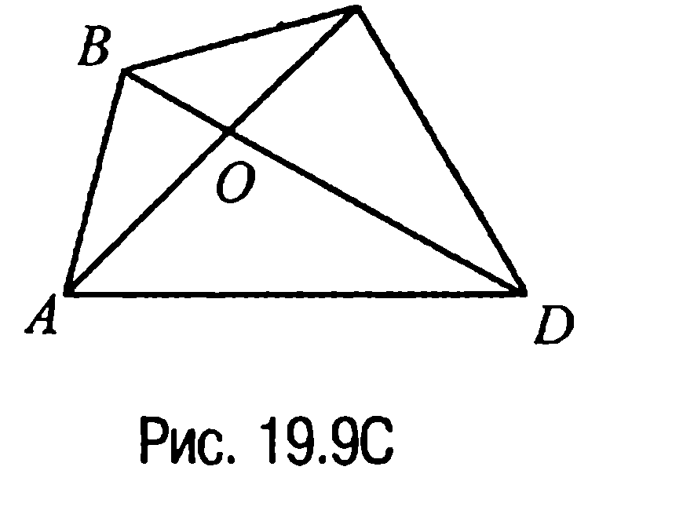

$S_{\Delta BCO} = \frac{S_{\Delta ABO} \cdot S_{\Delta CDO}}{S_{\Delta AOD}} = \frac{(a-c)(b-c)}{c}$

и, таким образом,

$S_{ABCD} = S_{\Delta BCO} + S_{\Delta ABD} + S_{\Delta ACD} -$

$- S_{\Delta AOD} = \frac{(a-c)(b-c)}{c} + a + b - c = \frac{ab}{c}$.

**Ответ:** $\frac{ab}{c}$.

---
**стр. 472**
---

**19.10С.** Пусть $\angle BAD = \alpha$ (рис. 19.10С). Тогда $\angle BCD = 180^\circ - \alpha$ и, значит,

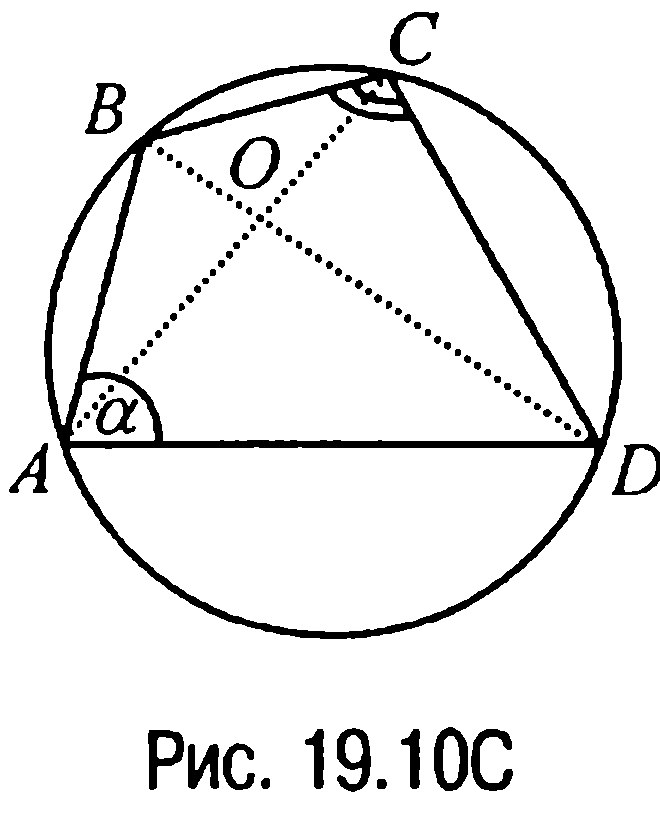

$\frac{AO}{OC} = \frac{S_{\Delta DAB}}{S_{\Delta BCD}} = \frac{\frac{1}{2} AD \cdot AB \cdot \sin \alpha}{\frac{1}{2} CD \cdot CB \cdot \sin(180^\circ - \alpha)} =$

$= \frac{AD \cdot AB}{CD \cdot CB}$, что и требовалось доказать.

**19.11С.** Пусть точка $F$ — середина диагонали $BD$ четырехуголь-

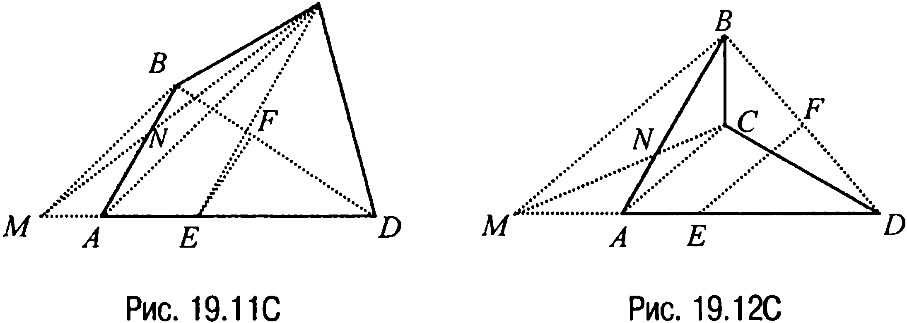

ника $ABCD$, $M$ — точка пересечения прямой $AD$ с прямой, про-

ходящей через точку $B$ параллельно прямой $AC$, а $N$ — точка

пересечения отрезков $AB$ и $MC$ (рис. 19.11С, 19.12С).

Тогда поскольку отрезок $FE$ — средняя линия треугольника $MBD$,

то точка $E$ — середина отрезка $MD$ и, значит, $CE$ — медиана тре-

угольника $MCD$. Но в таком случае $S_{\Delta ECD} = S_{\Delta ECM}$, а $S_{\Delta ECM} = S_{ABCE}$,

так как площади треугольников $AMN$ и $CBN$ равны как площади

треугольников, прилегающих к боковым сторонам трапеции

$AMBC$ с диагоналями $AB$ и $CM$. Таким образом,

$S_{ABCE} : S_{\Delta ECD} = 1 : 1$.

**Ответ:** 1.

**19.12С.** Рассмотрим рис. 19.13С. В соответствии со свойст-

вом 19.1 имеем $\frac{S_{\Delta AKL}}{S_{\Delta ABC}} = \frac{KL}{BC} = \frac{1}{4}$, откуда следует, что $S_{\Delta AKL} =$

$= \frac{1}{4} S_{\Delta ABC}$. Согласно же свойству 19.2 справедливы равенства

---
**стр. 473**
---

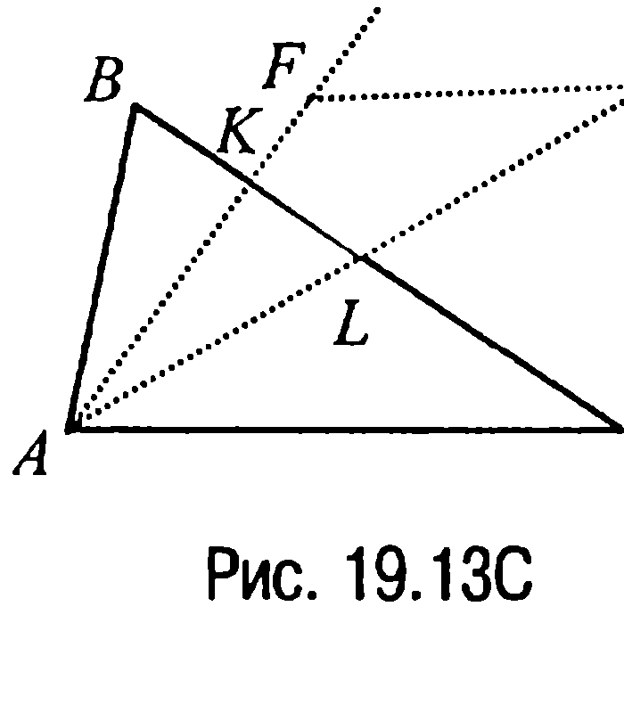

$\frac{S_{\Delta AFD}}{S_{\Delta AKL}} = \frac{AF \cdot AD}{AK \cdot AL} = \frac{AF}{AK} \cdot \frac{AD}{AL} = \frac{4}{3} \cdot 2 = \frac{8}{3}$,

откуда

$S_{\Delta AFD} = \frac{8}{3} S_{\Delta AKL} = \frac{8}{3} \cdot \frac{1}{4} \cdot S_{\Delta ABC} = \frac{2}{3} S_{\Delta ABC}$.

Отсюда находим, что $S_{KLDF} = S_{\Delta AFD} - S_{\Delta AKL} = \left(\frac{2}{3} - \frac{1}{4}\right) S_{\Delta ABC} = \frac{5}{12} S_{\Delta ABC}$. Но в таком случае $\frac{S_{\Delta ABC}}{S_{KLDF}} = \frac{12}{5}$.

**Ответ:** $\frac{12}{5}$.

**19.13С.** Так как $LK \perp AB$, $LM \perp AC$, то $\angle AKL + \angle LMA = 180^\circ$

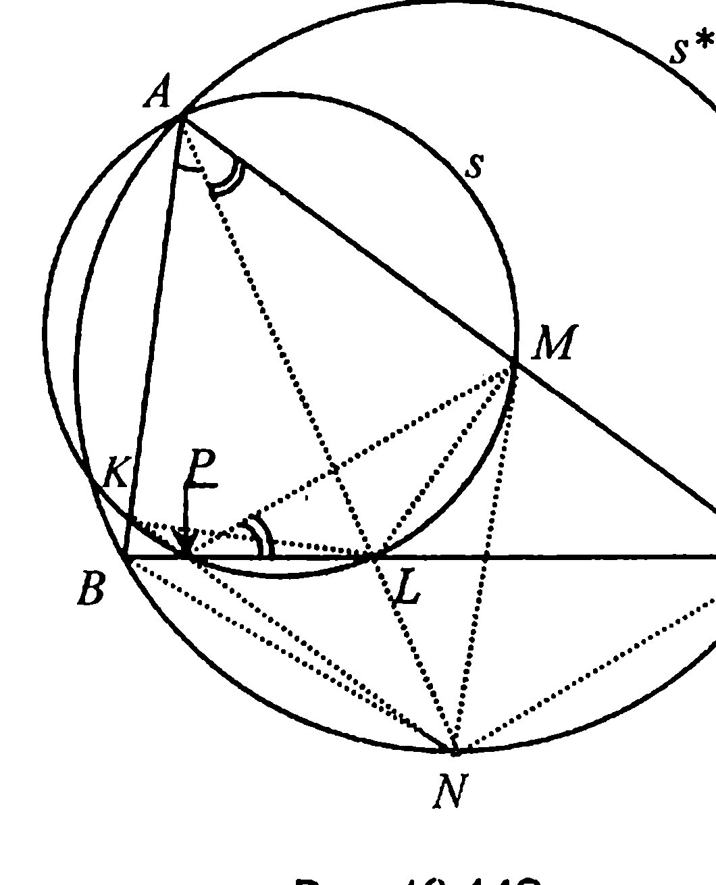

и, значит, около четырехугольника $AKLN$ можно описать окружность $s$, которая пересекает отрезок $BC$, кроме точки $L$ еще и в некоторой точке $P$ (которая совпадает с $L$, если $AB = AC$) (рис. 19.14С).

А тогда если обозначить через $s^*$ окружность, которая описана около треугольника $ABC$, и заметить, что углы $BAN$ и $BCN$ равны (они опираются на одну и ту же дугу $NB$ окружности $s^*$), и что равными являются углы $LAM$ и $LPM$ (они опираются на одну и ту же дугу $ML$ окружности $s$), то из условия ($AL$ — биссектриса треугольника $ABC$) следует, что $\angle LPM = \angle BCN$. Последнее же означает, что прямые $PM$ и $NC$ оказываются параллельными.

Аналогично доказывается, что параллельными являются и прямые $KP$ и $BN$.

Но в таком случае поскольку в трапециях $BKPN$ и $NPMC$ диагонали образуют с боковыми сторонами соответственно равновеликие треугольники (свойство 14.3), то ссылка на этот факт и доказывает требуемое.
