## 9.20. Векторы на плоскости

---
**стр. 474**
---

**19.14С.** Пусть $a$ — сторона равностороннего треугольника, квадрата и правильного шестиугольника и пусть $S_1, S_2$ и $S_3$ — их площади соответственно. Тогда поскольку

$$S_1 = \frac{a^2\sqrt{3}}{4}, \quad S_2 = a^2, \quad S_3 = \frac{3\sqrt{3} \cdot a^2}{2}, \text{ то}$$

$$S_1 : S_2 : S_3 = \frac{a^2\sqrt{3}}{4} : a^2 : \frac{3\sqrt{3} \cdot a^2}{2} = \sqrt{3} : 4 : 6\sqrt{3}.$$

**Ответ:** $\sqrt{3} : 4 : 6\sqrt{3}$.

**§ 20. Векторы на плоскости**

**20.1С.** Так как точка $D$ принадлежит отрезку $BC$ (рис. 20.1С), то $\overline{CD} = \lambda \overline{CB}$, где $\lambda$ — некоторое число. С другой стороны, $\overline{CD} = \overline{CA} + \mu \overline{AO}$, где $\mu$ — некоторое число, поэтому $\lambda \overline{CB} = \overline{CA} + \mu \overline{AO}$.

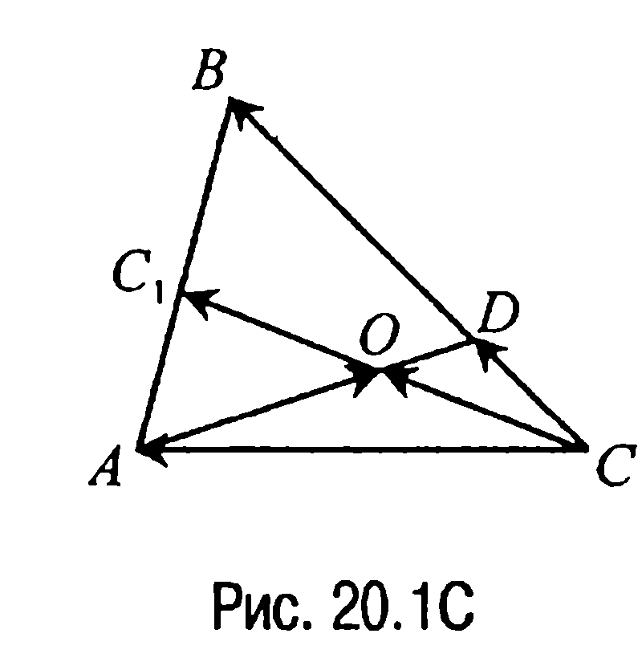

Но $\overline{AO} = \overline{CO} - \overline{CA} = \frac{1}{2} \overline{CC_1} - \overline{CA} = \frac{1}{4}(\overline{CA} + \overline{CB}) - \overline{CA} = \frac{1}{4} \overline{CB} - \frac{3}{4} \overline{CA}$ и, следовательно, $\lambda \overline{CB} = \overline{CA} + \mu \left( \frac{1}{4} \overline{CB} - \frac{3}{4} \overline{CA} \right)$ или $\left( \lambda - \frac{1}{4} \mu \right) \overline{CB} = \left( 1 - \frac{3}{4} \mu \right) \overline{CA}$. Замечая здесь, что векторы $\overline{CA}$ и $\overline{CB}$ неколлинеарны, приходим к выводу, что

$$\begin{cases} \lambda - \frac{1}{4} \mu = 0, \\ 1 - \frac{3}{4} \mu = 0. \end{cases}$$

Решая эту систему, находим, что $\lambda = \frac{1}{3}$, $\mu = \frac{4}{3}$. Но в таком случае $\overline{CD} = \frac{1}{3} \overline{CB}$, откуда $CB = 3 CD$ и, значит, $DB = CB - CD = 3 CD - CD = 2 CD$. Таким образом, $\frac{CD}{DB} = \frac{CD}{2CD} = \frac{1}{2}$.

---
**стр. 475**
---

**20.2С.** Рассмотрим рис. 20.2С. Имеем

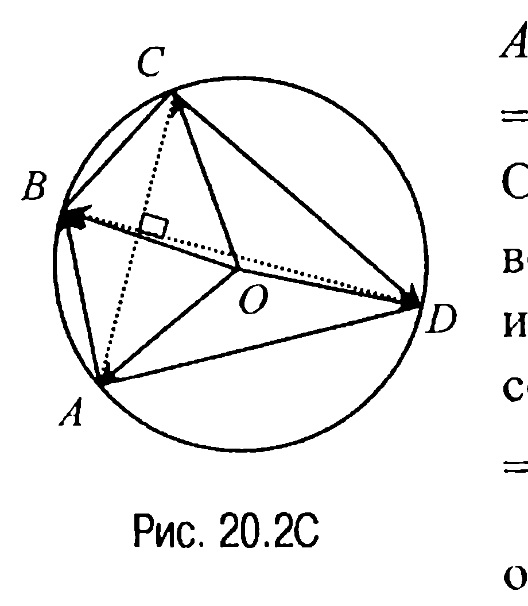

$$AB^2 + CD^2 = (\overline{OB} - \overline{OA})^2 + (\overline{OD} - \overline{OC})^2 =$$

$$= 4R^2 - 2(\overline{OA} \cdot \overline{OB} + \overline{OC} \cdot \overline{OD}).$$

Отсюда с учетом условия приходим к равенству $\overline{OA} \cdot \overline{OB} + \overline{OC} \cdot \overline{OD} = 0$ или к равенству

$$\cos \angle AOB + \cos \angle COD =$$

$$= 2 \cos \frac{\angle AOB + \angle COD}{2} \cdot \cos \frac{\angle AOB - \angle COD}{2} = 0,$$

откуда следует, что $\angle AOB + \angle COD = 180^\circ$ и, значит, $\angle BOC + \angle DOA = 180^\circ$. Но в таком случае $\overline{OB} \cdot \overline{OC} + \overline{OD} \cdot \overline{OA} = 0$, что с учетом предыдущего приводит к цепочке равенств

$$\overline{OA} \cdot \overline{OB} + \overline{OC} \cdot \overline{OD} - (\overline{OB} \cdot \overline{OC} + \overline{OD} \cdot \overline{OA}) = \overline{OB} \cdot (\overline{OA} - \overline{OC}) -$$

$$- \overline{OD} \cdot (\overline{OA} - \overline{OC}) = (\overline{OA} - \overline{OC}) \cdot (\overline{OB} - \overline{OD}) = \overline{CA} \cdot \overline{DB} = 0.$$

Последнее в этой цепочке равенство и означает, что диагонали четырехугольника $ABCD$ перпендикулярны.

**20.3С.** Введем обозначения $\overline{AB} = \vec{a}$, $\overline{AC} = \vec{b}$. Тогда так как

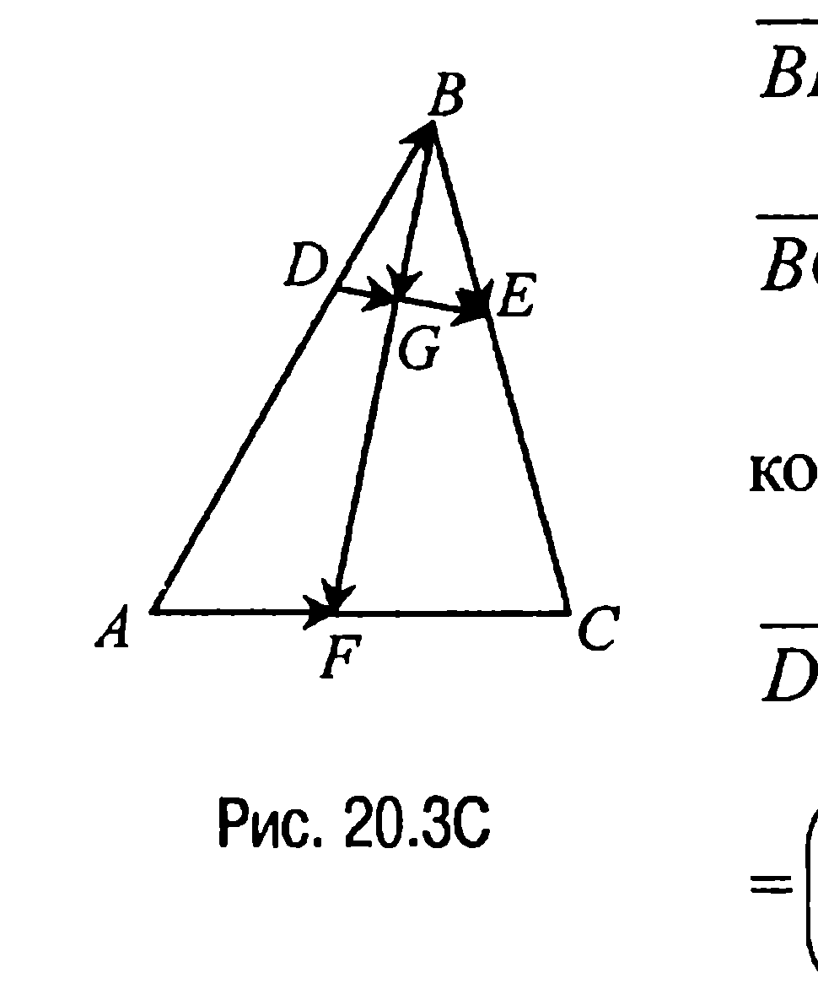

$$\overline{BF} = \overline{AF} - \overline{AB} = \frac{4}{9} \vec{b} - \vec{a} \text{ (рис. 20.3С), то}$$

$$\overline{BG} = \lambda \overline{BF} = \frac{4\lambda}{9} \vec{b} - \lambda \vec{a}, \text{ где } \lambda \text{ — некоторая}$$

константа. Далее, поскольку $\overline{DB} = \frac{1}{3} \vec{a}$, то

$$\overline{DG} = \overline{DB} + \overline{BG} = \frac{1}{3} \vec{a} + \frac{4\lambda}{9} \vec{b} - \lambda \vec{a} =$$

$$= \left( \frac{1}{3} - \lambda \right) \vec{a} + \frac{4\lambda}{9} \vec{b}.$$

Имеем также следующую цепочку равенств:

$$\overline{GE} = \overline{GB} + \overline{BE} = -\overline{BG} + \overline{BE} = \lambda \vec{a} - \frac{4\lambda}{9} \vec{b} + \frac{2}{5}(\vec{b} - \vec{a}) =$$

$$= \left( \lambda - \frac{2}{5} \right) \vec{a} + \left( \frac{2}{5} - \frac{4\lambda}{9} \right) \vec{b}. \text{ Замечая теперь, что}$$

---
**стр. 476**
---

$\overline{DG}$ и $\overline{GE}$ коллинеарны, т. е. $\overline{DG} = \rho \overline{GE}$, где $\rho = |\overline{DG}| / |\overline{GE}|$, имеем $\left( \frac{1}{3} - \lambda \right) \vec{a} + \frac{4\lambda}{9} \vec{b} =$

$$= \rho \left( \lambda - \frac{2}{5} \right) \vec{a} + \rho \left( \frac{2}{5} - \frac{4\lambda}{9} \right) \vec{b}. \text{ Отсюда}$$

$$\begin{cases} \frac{1}{3} - \lambda = \rho \left( \lambda - \frac{2}{5} \right) \\ \frac{4\lambda}{9} = \rho \left( \frac{2}{5} - \frac{4\lambda}{9} \right) \end{cases} \quad \text{или} \quad \begin{cases} 5 - 15\lambda = 15\rho\lambda - 6\rho \\ 20\lambda = -20\rho\lambda + 18\rho \end{cases}$$

и, таким образом, $\rho = \frac{2}{3}$.

**Ответ:** $\frac{DG}{GE} = \frac{2}{3}$.

**20.4С.** Пусть $\overline{AB} = \vec{a}$, $\overline{AD} = \vec{b}$ (рис. 20.4С). Тогда $\overline{AF} = \frac{1}{3} \vec{b}$,

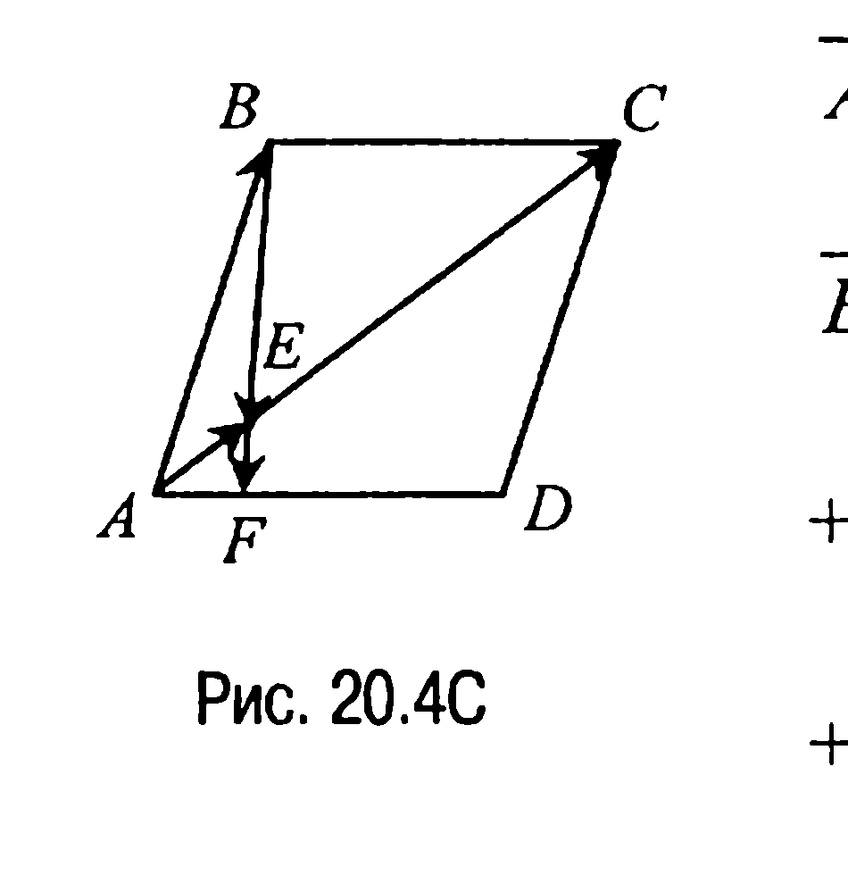

$$\overline{AE} = \frac{1}{4} \overline{AC} = \frac{1}{4}(\vec{a} + \vec{b}) \text{ и, таким образом,}$$

$$\overline{BE} = \overline{AE} - \overline{AB} = \frac{1}{4}(\vec{a} + \vec{b}) - \vec{a} = -\frac{3}{4} \vec{a} + \frac{1}{4} \vec{b},$$

а $\overline{BF} = \overline{AF} - \overline{AB} = \frac{1}{3} \vec{b} - \vec{a} = -\vec{a} + \frac{1}{3} \vec{b} = \frac{4}{3} \left( -\frac{3}{4} \vec{a} + \frac{1}{4} \vec{b} \right)$, т. е. $\overline{BF} = \frac{4}{3} \overline{BE}$,

откуда и следует, что точки $B$, $E$ и $F$ лежат на одной прямой.

**20.5С.** Пусть в треугольнике $ABC$ угол $CAB$ равен $120^\circ$, $AD$ — биссектриса угла $CAB$, $AC : AB = 4$ (рис. 20.5С). Введем обозначения:

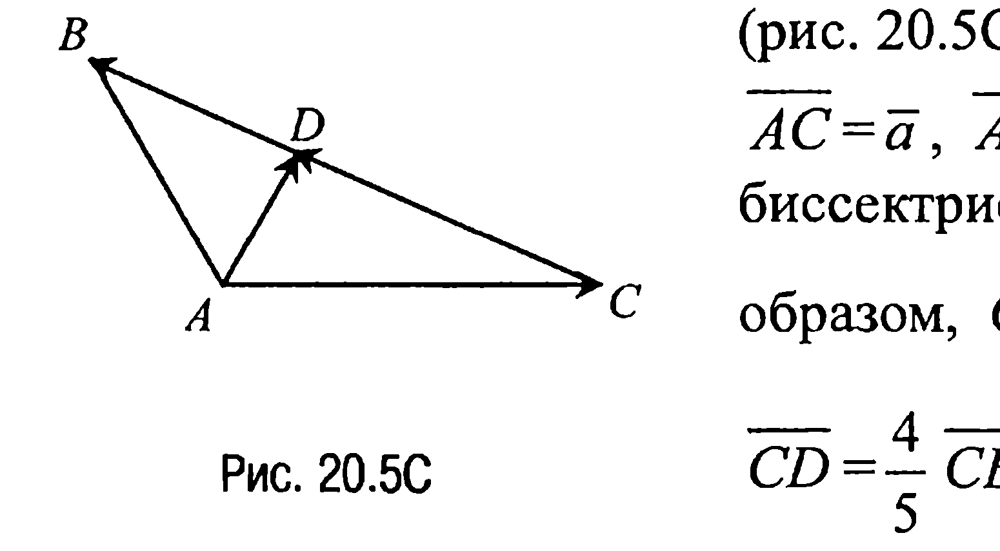

$\overline{AC} = \vec{a}$, $\overline{AB} = \vec{b}$. Тогда так как $AD$ — биссектриса, то $CD : DB = 4$ и, таким образом, $CD = \frac{4}{5} CB$. Отсюда

$$\overline{CD} = \frac{4}{5} \overline{CB} = \frac{4}{5}(\vec{b} - \vec{a}). \text{ Далее,}$$

---
**стр. 477**
---

$\overline{AD} = \overline{AC} + \overline{CD} = \bar{a} + \frac{4}{5}(\bar{b} - \bar{a}) = \frac{1}{5}\bar{a} + \frac{4}{5}\bar{b},$

$\overline{AD}^2 = \frac{1}{25}(\bar{a}^2 + 8\bar{a} \cdot \bar{b} + 16\bar{b}^2) = \frac{1}{25}(|\bar{a}|^2 + 8|\bar{a}| \cdot |\bar{b}| \cdot \cos 120^\circ +$

$+ 16|\bar{b}|^2)$ и тогда $\frac{AD^2}{AC^2} = \frac{|\overline{AD}|^2}{|\bar{a}|^2} = \frac{1}{25} \left( 1 - 4 \frac{|\bar{b}|}{|\bar{a}|} + 16 \frac{|\bar{b}|^2}{|\bar{a}|^2} \right) =$

$= \frac{1}{25} \left( 1 - 4 \cdot \frac{1}{4} + 16 \left( \frac{1}{4} \right)^2 \right) = \frac{1}{25}$, откуда $\frac{AD}{AC} = \frac{1}{5}$.

**Ответ:** $1 : 5$.

**20.6С.** Обозначим $\overline{BA} = \bar{a}$, $\overline{BC} = \bar{b}$, $\angle ABC = \alpha$ (рис. 20.6С).

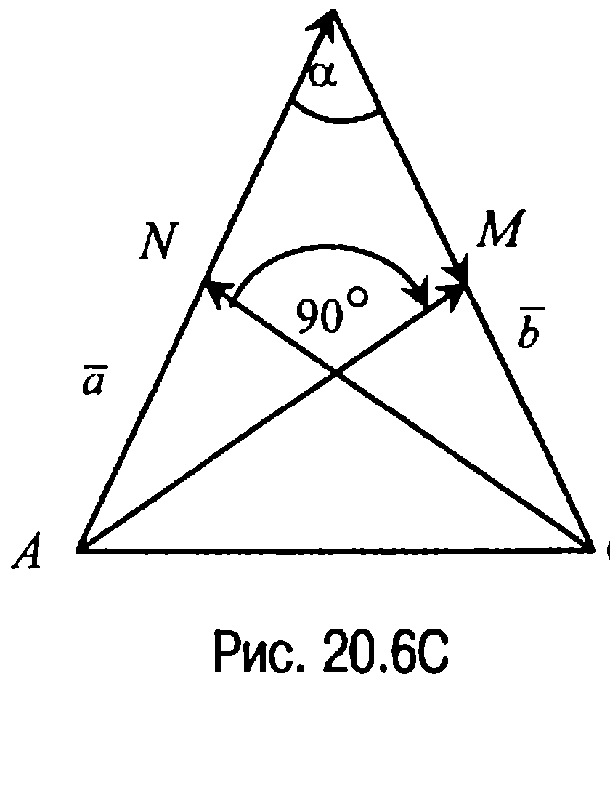

Тогда по условию $|\bar{a}| = |\bar{b}|$ и $\overline{AM} = \overline{AB} + \overline{BM} = -\bar{a} + \frac{\bar{b}}{2}$, $\overline{CN} = -\bar{b} + \frac{\bar{a}}{2}$, где $AM$ и $CN$ — медианы боковых сторон. Теперь так как $\overline{AM} \perp \overline{CN}$, то $\overline{AM} \cdot \overline{CN} = 0$, а значит, $\left( -\bar{a} + \frac{\bar{b}}{2} \right) \left( -\bar{b} + \frac{\bar{a}}{2} \right) = 0$, откуда следует, что $5\bar{a} \cdot \bar{b} - 2\bar{a}^2 - 2\bar{b}^2 = 0$, т. е. что $5|\bar{a}|^2 \cdot \cos \alpha - 4|\bar{a}|^2 = 0$.

Отсюда находим $\cos \alpha = \frac{4}{5}$ и, следовательно, $\alpha = \arccos \frac{4}{5}$, $\angle CAB = \angle BCA = \frac{\pi}{2} - \frac{1}{2} \arccos \frac{4}{5}$.

**Ответ:** $\arccos \frac{4}{5}$; $\frac{\pi}{2} - \frac{1}{2} \arccos \frac{4}{5}$; $\frac{\pi}{2} - \frac{1}{2} \arccos \frac{4}{5}$.

**20.7С.** Пусть $AD$ — биссектриса, а $AE$ — высота треугольника $ABC$ с прямым углом $CAB$ (рис. 20.7С). По свойству биссектрисы из условия задачи следует, что $\frac{CD}{DB} = \frac{AC}{AB} = \frac{7}{9}$. Пусть $\frac{CE}{EB} = \frac{m}{n}$.

Тогда, используя равенство $\overline{CB} = \overline{AB} - \overline{AC}$, находим, что

---
**стр. 478**
---

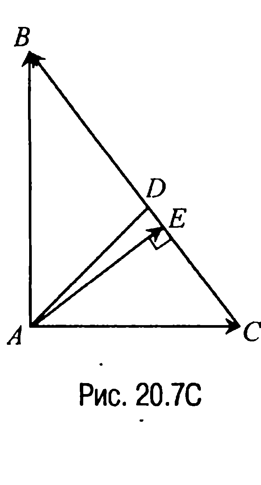

$\overline{CE} = \frac{m}{m+n} \overline{CB} = \frac{m}{m+n} (\overline{AB} - \overline{AC})$. Далее,

$\overline{AE} = \overline{AC} + \overline{CE} = \frac{n}{m+n} \overline{AC} + \frac{m}{m+n} \overline{AB}$.

Теперь так как вектор $\overline{AE}$ перпендикулярен вектору $\overline{CB}$, то $\overline{AE} \cdot \overline{CB} = 0$.

Отсюда $\frac{m}{m+n} \overline{AB}^2 - \frac{n}{m+n} \overline{AC}^2 = 0$, т. е.

$\frac{AC^2}{AB^2} = \frac{m}{n}$, откуда следует, что $\frac{m}{n} = \frac{49}{81}$.

**Ответ:** $49 : 81$.

**20.8С.** Пусть точка $G$ — середина отрезка $DE$, $\overline{AC} = \bar{a}$, $\overline{AB} = \bar{b}$ (рис. 20.8С). Разложим вектор $\overline{AF}$ по векторам $\bar{a}$ и $\bar{b}$.

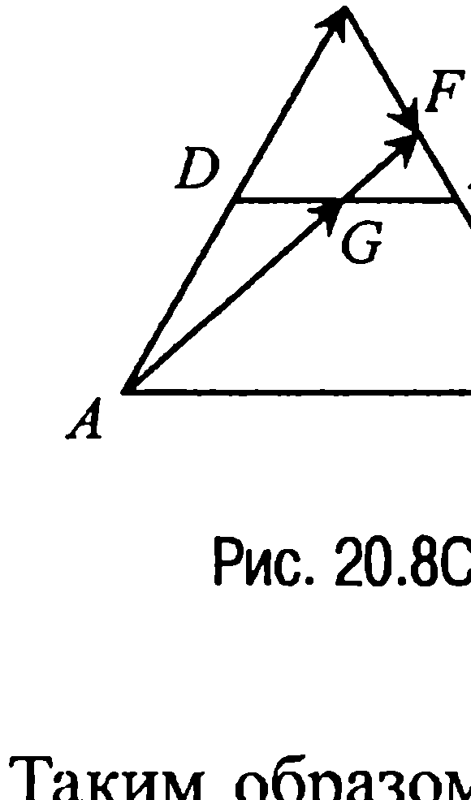

Имеем $\overline{AG} = \frac{1}{2}\bar{b} + \frac{1}{4}\bar{a}$. Тогда $\overline{AF} = \lambda \left( \frac{1}{4}\bar{a} + \frac{1}{2}\bar{b} \right)$, где $\lambda > 0$. С другой стороны, $\overline{AF} = \overline{AB} + \overline{BF} = \bar{b} + \mu \overline{BC} = \bar{b} + \mu (\bar{a} - \bar{b}) = \mu \bar{a} + (1 - \mu) \bar{b}$, где $\mu > 0$.

Таким образом, $\frac{\lambda}{4}\bar{a} + \frac{\lambda}{2}\bar{b} = \mu \bar{a} + (1 - \mu) \bar{b}$, откуда приходим к системе

$$\begin{cases} \frac{\lambda}{4} = \mu, \\ \frac{\lambda}{2} = 1 - \mu, \end{cases}$$

из которой находим $\lambda = 4/3$. Следовательно,

$\overline{AF}^2 = \frac{1}{9}(\bar{a} + 2\bar{b})^2 = \frac{1}{9}(\bar{a}^2 + 4\bar{a} \cdot \bar{b} + 4\bar{b}^2) = \frac{1}{9}(d^2 + 4d^2 \cdot \cos 60^\circ + 4d^2) = \frac{7d^2}{9}$.

Отсюда получаем, что $|\overline{AF}| = \frac{d\sqrt{7}}{3}$.

**Ответ:** $\frac{d\sqrt{7}}{3}$.

---
**стр. 479**
---

**20.9С.** На основании теоремы 20.1 относительно векторов $\overline{CC_1}$ и $\overline{A_1B_1}$ имеем следующие равенства (рис. 20.9):

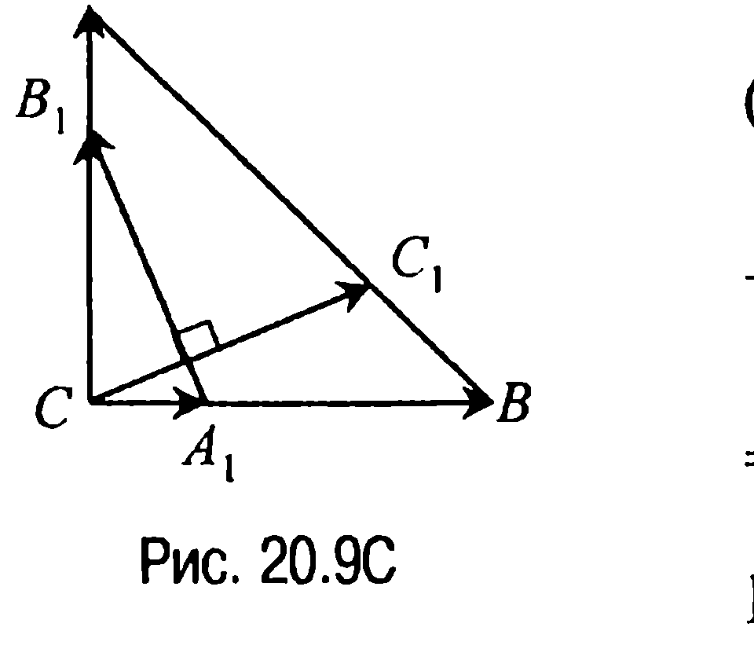

$\overline{CC_1} = \frac{n}{m+n} \overline{CA} + \frac{m}{m+n} \overline{CB}$, $\overline{A_1B_1} = \overline{CB_1} - \overline{CA_1} =$

$= \frac{m}{m+n} \overline{CA} + \frac{n}{m+n} \overline{BC}$.

Но тогда $\overline{CC_1} \cdot \overline{A_1B_1} = \frac{mn}{(m+n)^2} |\overline{CA}|^2 + \frac{mn}{(m+n)^2} |\overline{BC}|^2 = 0$ и, значит, векторы $\overline{CC_1}$ и $\overline{A_1B_1}$ действительно перпендикулярны. С другой стороны,

$$|\overline{CC_1}| = \sqrt{\frac{m^2 + n^2}{(m+n)^2} CA^2 + 2\frac{mn}{(m+n)^2} \overline{CA} \cdot \overline{CB}} = CA \cdot \frac{\sqrt{m^2 + n^2}}{m+n},$$

$$|\overline{A_1B_1}| = \sqrt{\frac{m^2 + n^2}{(m+n)^2} CA^2 + 2\frac{mn}{(m+n)^2} \overline{CA} \cdot \overline{BC}} = CA \cdot \frac{\sqrt{m^2 + n^2}}{m+n},$$

откуда и следует, что $CC_1 = A_1B_1$.

**20.10С.** Пусть $\angle MAN = \phi$ (рис. 20.10С). Тогда так как $\overline{AM} =$

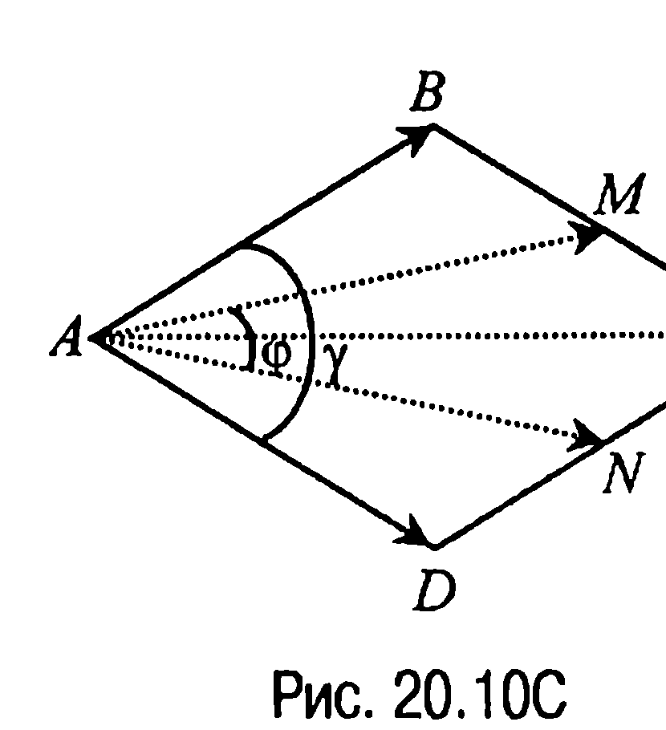

$= \frac{1}{2}(\overline{AB} + \overline{AC})$, $\overline{AN} = \frac{1}{2}(\overline{AD} + \overline{AC})$, $|\overline{AM}| = |\overline{AN}|$, то $\cos \phi = \frac{\overline{AM} \cdot \overline{AN}}{|\overline{AM}| \cdot |\overline{AN}|} =$

$= \frac{(\overline{AB} + \overline{AC})(\overline{AD} + \overline{AC})}{4AM^2}$.

По условию $AM$ — медиана треугольника $CAB$, поэтому

$$\cos \phi = \frac{(\overline{AB} + \overline{AC})(\overline{AD} + \overline{AC})}{4 \cdot \frac{1}{4}(2AB^2 + 2AC^2 - BC^2)} = \frac{\overline{AB} \cdot \overline{AD} + \overline{AB} \cdot \overline{AC} + \overline{AC} \cdot \overline{AD} + \overline{AC}^2}{2AB^2 + 2AC^2 - BC^2}.$$

Обозначим сторону заданного ромба через $a$ и пусть $\angle BAD = \gamma$ ($= 60^\circ$). В силу принятых обозначений $AC = 2a \cdot \cos \frac{\gamma}{2}$ и в таком

---
**стр. 480**
---

случае $\cos\varphi = \dfrac{a^2\left(\cos\gamma + 4\cos^2\dfrac{\gamma}{2} + 4\cos^2\dfrac{\gamma}{2}\right)}{a^2\left(1 + 8\cos^2\dfrac{\gamma}{2}\right)} = \dfrac{\cos\gamma + 8\cos^2\dfrac{\gamma}{2}}{1 + 8\cos^2\dfrac{\gamma}{2}} = \dfrac{13}{14}$, откуда $\varphi = \arccos\dfrac{13}{14}$.

**Ответ:** $\angle MAN = \arccos\dfrac{13}{14}$.

**20.11C.** Так как $\overline{MA} = \overline{MC} + \overline{CA}$, $\overline{MB} = \overline{MC} + \overline{CB}$ (рис. 20.11C),

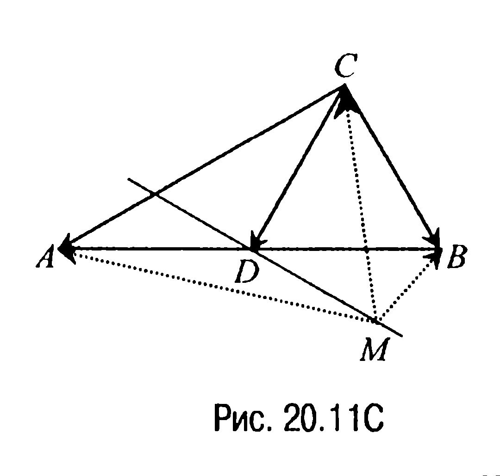

то $\overline{MA}^2 = (\overline{MC} + \overline{CA})^2$, $\overline{MB}^2 = (\overline{MC} + \overline{CB})^2$ и в соответствии с условием задачи должно выполняться равенство $\overline{MA}^2 + \overline{MB}^2 = 2\overline{MC}^2 = (\overline{MC} + \overline{CA})^2 + (\overline{MC} + \overline{CB})^2$ или равенство $2\overline{MC}(\overline{CA} + \overline{CB}) + \overline{CA}^2 + \overline{CB}^2 = 0$. Теперь если $D$ — серединная точка гипотенузы треугольника $ABC$, то $AB = 2CD$ и поэтому $\overline{CA}^2 + \overline{CB}^2 = 4\overline{CD}^2$. Но в таком случае $2\overline{MC}(\overline{CA} + \overline{CB}) + \overline{CA}^2 + \overline{CB}^2 = 2\overline{MC} \cdot 2\overline{CD} + 4\overline{CD}^2 = 4\overline{CD}(\overline{MC} + \overline{CD}) = 4\overline{CD} \cdot \overline{MD} = 0$ или $\overline{CD} \cdot \overline{MD} = 0$. Отсюда получаем

**Ответ:** множество $\mathfrak{M}$ — это прямая, проходящая через середину гипотенузы треугольника $ABC$ перпендикулярно медиане треугольника, проведенной из вершины прямого угла треугольника.

**20.12C.** Пусть точки $M(x_1; y_1)$, $N(x_2; y_2)$ — середины отрезков $AC$ и $BD$ соответственно. Тогда $x_1 = \dfrac{-1-6}{2} = -3,5$; $y_1 = \dfrac{-6-1}{2} = -3,5$; $x_2 = \dfrac{-4-3}{2} = -3,5$; $y_2 = \dfrac{-4-3}{2} = -3,5$ и, таким образом, диагонали четырехугольника $ABCD$ в их точке пересечения делятся пополам. С другой стороны, $\overline{AC} = \overline{AC}(5; -5)$, а $\overline{BD} = \overline{BD}(1; 1)$ и, следовательно, $\overline{AC} \cdot \overline{BD} = 5 \cdot 1 + (-5) \cdot 1 = 0$. Последнее означает, что $\overline{AC} \perp \overline{BD}$.

---
**стр. 481**
---

Итак, четырехугольник $ABCD$ — ромб. Замечая теперь, что

$|\overline{AC}| = \sqrt{5^2 + (-5)^2} = 5\sqrt{2}$ , $|\overline{BD}| = \sqrt{1^2 + 1^2} = \sqrt{2}$ ,

приходим к выводу, что площадь $S_{ABCD} = \dfrac{1}{2} \cdot 5\sqrt{2} \cdot \sqrt{2} = 5.$

**Ответ:** 5.

**20.13C.** Пусть $O$ и $O_1$ точки пересечения медиан треугольников

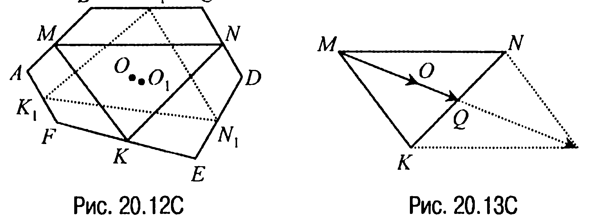

$MNK$ и $M_1N_1K_1$ соответственно (рис. 20.12C). Тогда если $MQ$ — медиана треугольника $MNK$ (рис. 20.13C) (на рис. 20.13C показан один из фрагментов рис. 20.12C), то

$\overline{MO} = \dfrac{2}{3}\overline{MQ} = \dfrac{2}{3} \cdot \dfrac{1}{2}(\overline{MN} + \overline{MK}) = \dfrac{1}{3}(\overline{MB} + \overline{BC} + \overline{CN} + \overline{MA} + \overline{AF} +$
$+ \overline{FK}) = \dfrac{1}{3}\left(\overline{BC} + \dfrac{1}{2}\overline{CD} - \overline{FA} - \dfrac{1}{2}\overline{EF}\right).$ Аналогично

$\overline{M_1O_1} = \dfrac{1}{3}(\overline{M_1N_1} + \overline{M_1K_1}) = \dfrac{1}{3}(\overline{M_1C} + \overline{CD} + \overline{DN_1} + \overline{M_1B} + \overline{BA} + \overline{AK_1}) =$
$= \dfrac{1}{3}\left(\overline{CD} + \dfrac{1}{2}\overline{DE} - \overline{AB} - \dfrac{1}{2}\overline{FA}\right).$ Таким образом, вектор

$\overline{MO_1} = \overline{MM_1} + \overline{M_1O_1} = \overline{MB} + \overline{BM_1} + \overline{M_1O_1} = \dfrac{1}{2}\overline{AB} + \dfrac{1}{2}\overline{BC} + \overline{M_1O_1} =$
$= \dfrac{1}{6}\overline{AB} + \dfrac{1}{2}\overline{BC} + \dfrac{1}{3}\overline{CD} + \dfrac{1}{6}\overline{DE} - \dfrac{1}{2}\overline{FA}.$

Покажем, что $\overline{MO_1} - \overline{MO} = \overline{0}$. Действительно,

$\overline{MO_1} - \overline{MO} = \dfrac{1}{6}\overline{AB} + \dfrac{1}{6}\overline{BC} + \dfrac{1}{6}\overline{CD} + \dfrac{1}{6}\overline{DE} + \dfrac{1}{6}\overline{EF} + \dfrac{1}{6}\overline{FA} = \overline{0}.$

Полученное же равенство и означает, что точки $O$ и $O_1$ совпадают.
