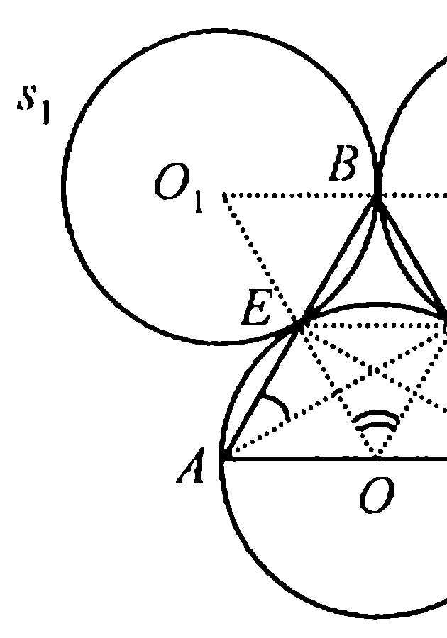
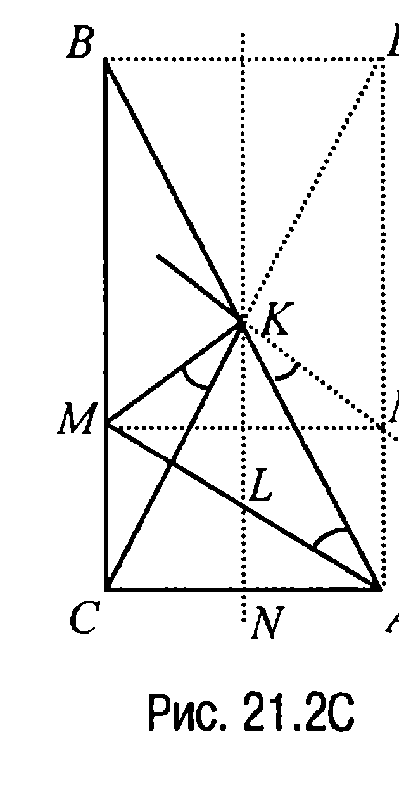
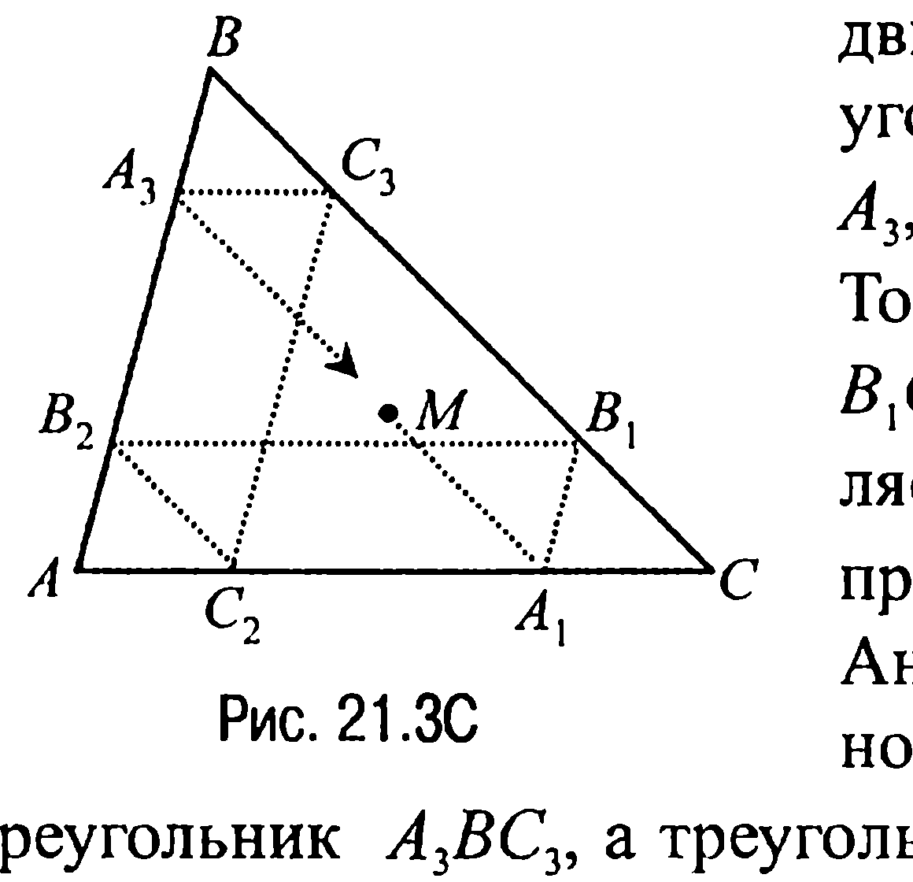
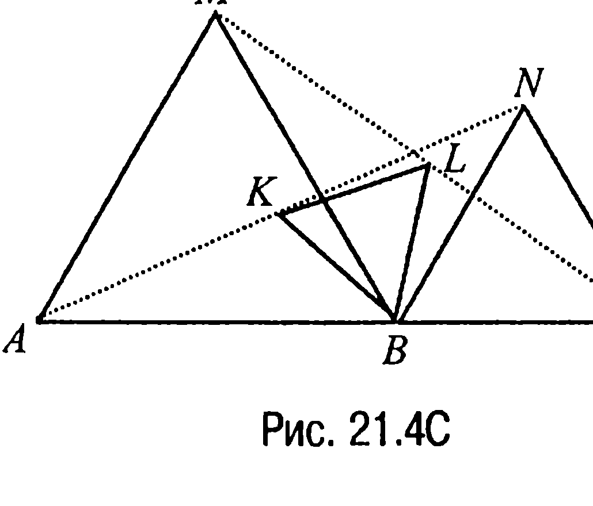
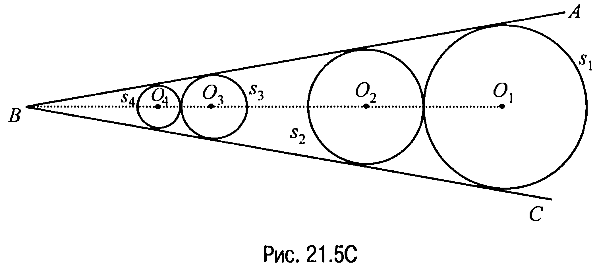
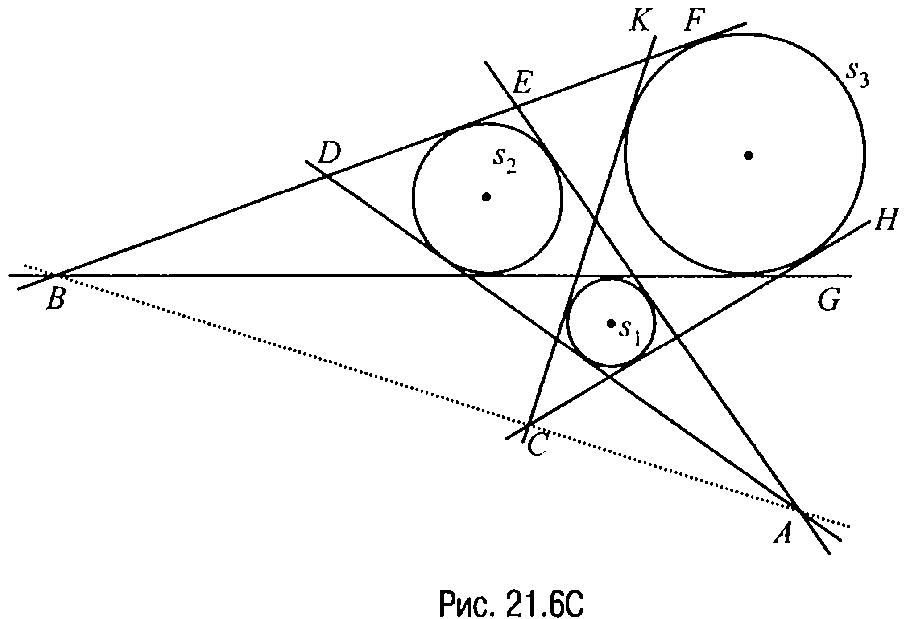
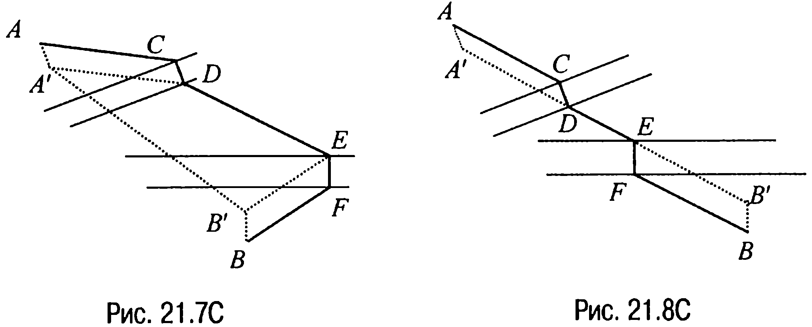

## 9.21. Движения, виды движений. Преобразование подобия, гомотетия

---
**стр. 482**
---

**§ 21. Движения, виды движений. Преобразование подобия, гомотетия**

**21.1C.** Так как $\angle EAF = \angle FCE\ (= 30^\circ)$, то около четырехугольника $AEFC$ можно описать окружность $s$ (задача 15.7) (рис. 21.1C). Пусть точка $O$ — центр этой окружности, тогда $\angle EOF = 60^\circ$ и, значит, треугольник $EOF$ — равносторонний. Далее, поскольку точка $B$ симметрична точке $A$ относительно точки $E$, то точка $B$ лежит на окружности $s_1$, симметричной окружности $s$ относительно точки $E$.

С другой стороны, точка $B$ лежит и на окружности $s_2$, симметричной окружности $s$ относительно точки $F$. Из того же факта, что треугольник $EOF$ — равносторонний, следует, что центры $O$, $O_1$ и $O_2$ окружностей $s$, $s_1$ и $s_2$ соответственно также образуют равносторонний треугольник (каждая из сторон которого равна $2R$, где $R$ — радиус указанных выше окружностей).

Отсюда вывод: окружности $s_1$ и $s_2$ имеют единственную общую точку $B$, которая является вершиной равностороннего треугольника $BEF$, а значит, треугольник $ABC$ — равносторонний, что и требовалось доказать.

**21.2C.** Рассмотрим рис. 21.2C, где четырехугольник $ADBC$ — прямоугольник. При симметрии относительно прямой, проходящей через точку $K$ перпендикулярно $CA$, точка $C$ перейдет в точку $A$ (треугольник $CKA$ — равнобедренный), точка $M$ — в точку $M'$ такую, что $\angle M'KA = \varphi$. А тогда замечая, что

$KL \parallel M'A$ и $KL = KN - LN = \dfrac{1}{2} BC - \dfrac{1}{2} MC =$
$= \dfrac{1}{2} \cdot \left(BC - \dfrac{1}{3} BC\right) = \dfrac{1}{3} BC = M'A,$

приходим к выводу: четырехугольник

---
**стр. 483**
---

$AM'KL$ — параллелограмм. Последнее означает, что $\angle BAM =$
$= \angle M'KA = \varphi$.

**Ответ:** $\angle BAM = \varphi$.

**21.3C.** Обозначим последовательные точки встречи траектории движения точки $M$ со сторонами треугольника $ABC$ через $A_1, B_1, B_2, C_2, C_3, A_3, A_4, B_4, B_5, C_5, C_6, \dots$ (рис. 21.3C).

Тогда так как $A_1B_1 \parallel AB_2$, $B_1B_2 \parallel CA_1$, $B_1C \parallel B_2C_2$, то треугольник $AB_2C_2$ является образом треугольника $A_1B_1C$ при параллельном переносе.

Аналогично при параллельном переносе треугольник $AB_2C_2$ переходит в треугольник $A_3BC_3$, а треугольник $A_3BC_3$ — в треугольник $A_4B_4C$.

Но треугольник $A_1B_1C$ — это треугольник, также полученный параллельным переносом треугольника $A_3BC_3$.

Таким образом, $A_1 = A_4$, т. е. после семи шагов траектория замкнется (она может замкнуться и раньше).

**21.4C.** При повороте по ходу часовой стрелки на угол $60^\circ$ около точки $B$ (рис. 21.4C) точка $A$ перейдет в точку $M$, точка $N$ — в точку $C$ и, следовательно, отрезок $AN$ перейдет в отрезок $MC$, а точка $K$ — в точку $L$. Но в таком случае отрезок $BK$ перейдет в отрезок $BL$, а поскольку $\angle KBL = 60^\circ$ (что очевидно), то это и будет означать, что тре-

угольник $KBL$ — равносторонний.

**21.5C.** Обозначим угол, в который вписаны окружности $s_1$, $s_2$, $s_3$ и $s_4$, через $ABC$, а центры окружностей — через $O_1$, $O_2$, $O_3$ и $O_4$ соответственно (рис. 21.5C). Гомотетия с центром в точке $B$ и коэффициентом $\frac{BO_3}{BO_1}$ переводит точку $O_1$ в точку $O_3$, а стороны угла эта гомотетия переводит в се-

---
**стр. 484**
---

бя. Окружность $s_1$ с центром $O_1$ переходит при этом в окружность $s'_1$ с центром $O_3$.

Далее, поскольку окружность $s_1$ имеет единственную общую точку

с прямой $BA$ и единственную общую точку с прямой $BC$, то окружность $s'_1$ также имеет с прямыми $BA$ и $BC$ (которые при гомотетии переходят в себя) по одной общей точке. Другими словами, окружность $s'_1$ касается сторон угла $ABC$. Но окружность с центром $O_3$, касающаяся сторон угла, существует только одна, следовательно, окружность $s'_1$ совпадает с окружностью $s_3$.

Далее, рассматриваемая гомотетия переводит окружность $s_2$ в некоторую окружность $s'_2$ касающуюся сторон угла $ABC$ (так как окружность $s'_2$ касается сторон угла) и касающуюся окружности $s_3$ (ибо окружность $s_2$ касается окружности $s_1$). Радиус $r'_2$ окружности $s'_2$ равен $k \cdot r_2$, где $k$ — коэффициент рассматриваемой гомотетии. С другой стороны, радиус $r_3$ окружности $s_3$ равен $k \cdot r_1$, а так как $r_1 > r_2$, то $r_3 > r'_2$. Отсюда следует, что окружность $s'_2$ совпадает с окружностью $s_4$. Но в таком случае из равенств $r_3 = k \cdot r_1$, $r_4 = k \cdot r_2$ и вытекает утверждение задачи.

**21.6C.** Рассмотрим рис. 21.6C, где точка $A$ является центром гомотетии, переводящей окружность $s_1$ в окружность $s_2$, а точка $B$ — центр гомотетии, переводящей окружность $s_2$ в окружность $s_3$. Композиция этих гомотетий переводит окружность $s_1$ в окружность $s_3$, причем центр этой гомотетии лежит на прямой $AB$ (задача 21.8).

---
**стр. 485**
---

С другой стороны, ясно, что центром гомотетии, переводящей окружность $s_1$ в окружность $s_3$, является точка $C$. Действительно, точке пересечения внешних касательных соответствует гомотетия с положительным коэффициентом, а композиция гомотетий с положительными коэффициентами является гомотетией с положительным коэффициентом. Проведенные рассуждения и завершают доказательство.

**21.7C.** Пусть $ACDEFB$ — некоторый путь из пункта $A$ в пункт $B$

(рис. 21.7C) и пусть $A'$ и $B'$ — это точки, в которые переходят при параллельном переносе соответственно на векторы $\overline{CD}$ и $\overline{FE}$ точки $A$ и $B$. Тогда четырехугольники $ACDA'$ и $BFEB'$ — параллелограммы и, значит,

$AC + CD + DE + EF + FB = AA' + A'D + DE + EB' + B'B$.

Но $AA' = CD$, $EF = B'B$, поэтому, чтобы путь $ACDEFB$ был крат-
