## 9.22. Задачи на доказательство и вычисление

---
**стр. 486**
---

чайшим, необходимо, чтобы была наименьшей сумма $A'D + DE +$

$+ EB'$. А это, очевидно, будет тогда, когда точки $D$ и $E$ лежат на прямой $A'B'$ (рис. 21.8С).

**Ответ:** переправы $CD$ и $EF$ следует строить так, чтобы точки $D$ и $E$ были точками пересечения прямой $A'B'$ с дальними берегами ближайших соответственно к пунктам $A$ и $B$ каналам, где $A'$ и $B'$ — точки, в которые переходят соответственно точки $A$ и $B$ при параллельном переносе на векторы $\vec{CD}$ и $\vec{FE}$.

**§ 22. Задачи на доказательство и вычисление**

**22.1С.** Рассмотрим треугольник $ABC$ (рис. 22.1С) с основанием $AC = b$ и боковыми сторонами $AB = c$ и $BC = a$. Обозначим $\angle CAB = \alpha$, $\angle ABC = \beta$, $\angle BCA = \gamma$, $a + b + c = P$.

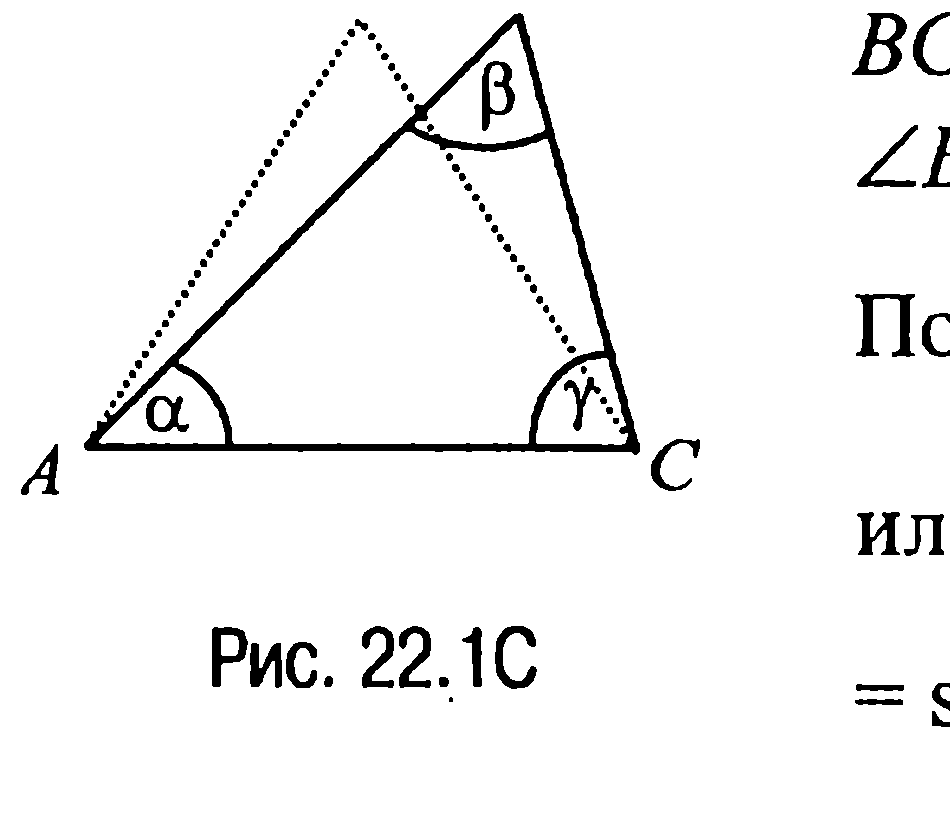

По теореме синусов $\frac{a}{\sin\alpha} = \frac{b}{\sin\beta} = \frac{c}{\sin\gamma}$ или, поскольку $\sin\gamma = \sin(\pi - (\alpha + \beta)) = \sin(\alpha + \beta)$, имеем $\frac{a}{\sin\alpha} = \frac{b}{\sin\beta} = \frac{c}{\sin(\alpha + \beta)}$.

Отсюда $a = b\frac{\sin\alpha}{\sin\beta}$, $c = b\frac{\sin(\alpha + \beta)}{\sin\beta}$ и, следовательно,

$$P = b + b\frac{\sin\alpha}{\sin\beta} + b\frac{\sin(\alpha + \beta)}{\sin\beta} = b + b\left(\frac{\sin\alpha}{\sin\beta} + \frac{\sin(\alpha + \beta)}{\sin\beta}\right) = b +$$

$$+ b\frac{2\sin\left(\alpha + \frac{\beta}{2}\right)\cos\frac{\beta}{2}}{2\sin\frac{\beta}{2}\cos\frac{\beta}{2}} = b + b\frac{\sin\left(\alpha + \frac{\beta}{2}\right)}{\sin\frac{\beta}{2}}.$$

Замечая теперь, что с изменением угла $\alpha$ основание $b$ треугольника и угол $\beta$ не меняются (и при этом $b > 0$, $\sin\frac{\beta}{2} > 0$), приходим к выводу, что периметр $P$ треугольника будет наибольшим в том

---
**стр. 487**
---

случае, когда $\sin\left(\alpha + \frac{\beta}{2}\right) = 1$, т. е. когда $\alpha + \frac{\beta}{2} = \frac{\pi}{2}$, а значит, когда и $\gamma + \frac{\beta}{2} = \frac{\pi}{2}$, т. е. когда $\alpha = \gamma$ или когда треугольник $ABC$ является равнобедренным, что и требовалось доказать.

**22.2С.** Рассмотрим треугольник $ABC$ (рис. 22.2С) и пусть $AC = b$, $BC = a$, $AB = c$, $\angle BCA = \gamma$, $a + b = q$. По теореме косинусов

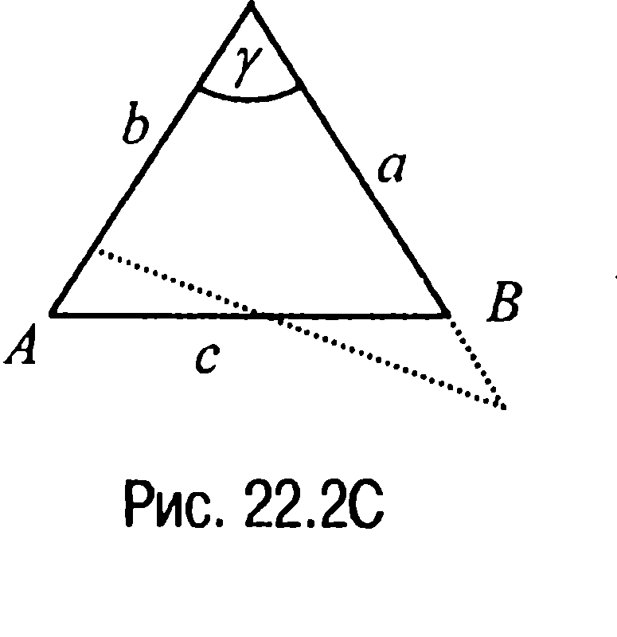

$$c^2 = a^2 + b^2 - 2ab\cdot\cos\gamma = a^2 + (q - a)^2 - 2a(q - a)\cos\gamma = q^2 + 2a^2(1 + \cos\gamma) - 2a\cdot q(1 + \cos\gamma) =$$

$$= q^2 + 2(1 + \cos\gamma)\cdot(a^2 - aq) = q^2 + 2(1 + \cos\gamma)\cdot\left(\left(a - \frac{q}{2}\right)^2 - \frac{q^2}{4}\right) = q^2 - \frac{q^2}{2}(1 + \cos\gamma) +$$

$$+ 2(1 + \cos\gamma)\cdot\left(a - \frac{q}{2}\right)^2 = q^2\frac{1 - \cos\gamma}{2} + 2(1 + \cos\gamma)\cdot\left(a - \frac{q}{2}\right)^2.$$

Замечая теперь, что величина $q$ и угол $\gamma$ постоянны, приходим к выводу, что наименьшим значение $c$ будет в том случае, когда $a - \frac{q}{2} = 0$ или когда $a = \frac{a+b}{2}$, т. е. когда $a = b$. А это и требовалось доказать.

**22.3С.** Рассмотрим треугольник $ABC$ (рис. 22.3С), у которого $\angle BCA = 90^\circ$, $BC > AC$, $CD = h$, $AM$ — медиана. Обозначим $\angle ABC = \beta$.

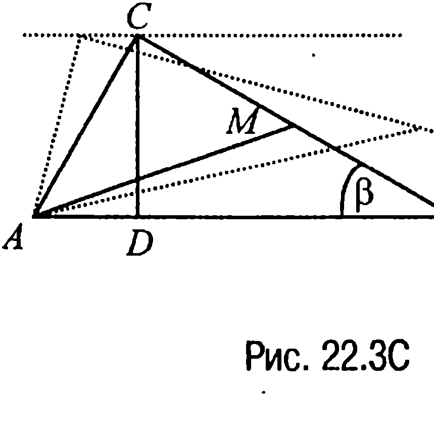

Тогда $BC = 2MC = \frac{h}{\sin\beta}$,

$$AC = \frac{h}{\sin\left(\frac{\pi}{2} - \beta\right)} = \frac{h}{\cos\beta}$$

и, значит, $AM^2 = AC^2 + MC^2 = \left(\frac{h}{\cos\beta}\right)^2 + \left(\frac{h}{2\sin\beta}\right)^2 = h^2\left(\frac{1}{\cos^2\beta} +$

---
**стр. 488**
---

$+ \frac{1}{4\sin^2\beta}\right) = h^2\frac{\cos^2\beta + 4\sin^2\beta}{\sin^2 2\beta} = h^2\frac{4 - 3\cos^2\beta}{1 - \cos^2 2\beta} = \frac{h^2}{2}\frac{5 - 3\cos 2\beta}{1 - \cos^2 2\beta}.$

Таким образом, поскольку величина $h$ постоянна, то задача, по существу, свелась к нахождению наименьшего на промежутке $-1 < x < 1$ значения функции $f(x) = \frac{5 - 3x}{1 - x^2}$.

Элементарное исследование показывает, что наименьшее значение функция $f$ принимает в точке $x = \frac{1}{3}$ и это значение равно $f\left(\frac{1}{3}\right) = \frac{9}{2}$.

Но в таком случае искомое значение $AM = \frac{h}{\sqrt{2}}\sqrt{\frac{9}{2}} = \frac{3h}{2} = 1,5h$.

**Ответ:** $1,5h$.

**22.4С.** Пусть отрезок $AM = x$, а $AN = y$ (рис. 22.4С). Тогда в соответствии с условием задачи $\frac{1}{2}\cdot x\cdot y\cdot\sin\alpha = \frac{1}{2}S$ и, значит, $y = \frac{S}{x\cdot\sin\alpha}$.

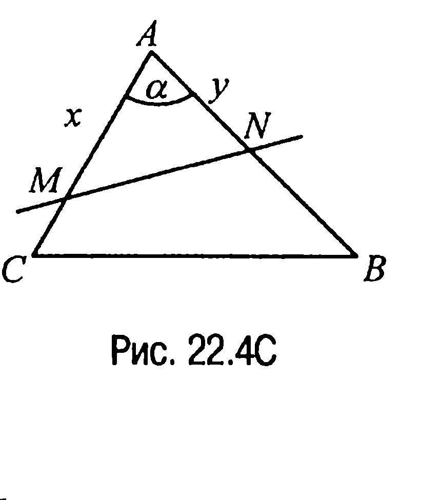

Но в таком случае по теореме косинусов

$$MN^2 = x^2 + y^2 - 2x\cdot y\cdot\cos\alpha = x^2 + \frac{S^2}{x^2\cdot\sin^2\alpha} - 2S\cdot\text{ctg}\alpha = \left(x - \frac{S}{x\cdot\sin\alpha}\right)^2 + \frac{2S}{\sin\alpha} - 2S\cdot\text{ctg}\alpha.$$

Из полученного выражения для $MN^2$ следует, что длина $MN$ будет наименьшей в том случае, когда $x - \frac{S}{x\cdot\sin\alpha} = 0$ ($S$ и $\alpha$ — величины постоянные) или когда $x^2 = \frac{S}{\sin\alpha}$, т. е. когда $x = \sqrt{\frac{S}{\sin\alpha}}$.

При таком значении $x$ значение $y = \frac{S}{x\cdot\sin\alpha} = \sqrt{\frac{S}{\sin\alpha}}$ и, следовательно, наименьшее значение

$$MN = \sqrt{\frac{2S}{\sin\alpha} - 2S\cdot\text{ctg}\alpha} = 2\sqrt{\frac{S}{\sin\alpha}}\cdot\sin\frac{\alpha}{2},$$

---
**стр. 489**
---

и искомый периметр $P = 2x + MN = 2\sqrt{\frac{S}{\sin\alpha}}\cdot\left(1 + \sin\frac{\alpha}{2}\right).$

**Ответ:** $2\sqrt{\frac{S}{\sin\alpha}}\cdot\left(1 + \sin\frac{\alpha}{2}\right).$

**22.5С.** На рис. 22.5C отрезок $DE = d$ определяет расстояние между вершинами $D$ и $E$ равносторонних треугольников $ACD$ и $CBE$, положенных на отрезке $AB$.

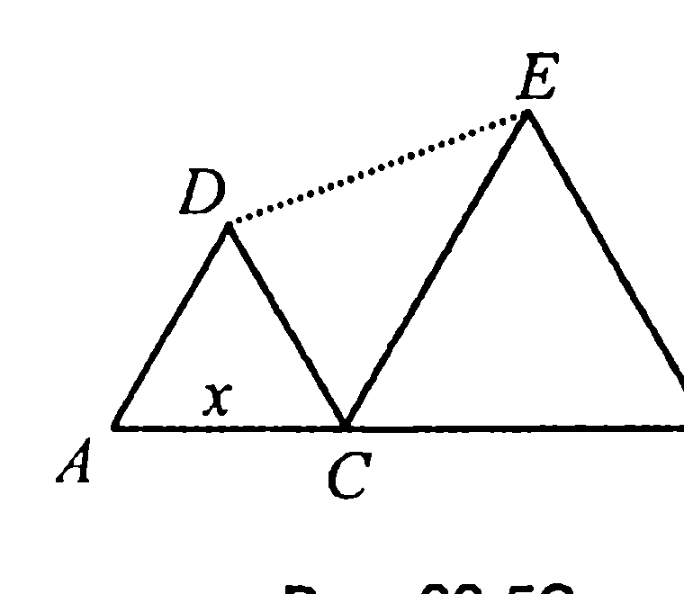

Пусть $AC = x$, тогда $CB = l - x$ и поскольку $\angle DCE = 60^\circ$, то по теореме косинусов из треугольника $CED$ имеем

$$d^2 = x^2 + (l - x)^2 - 2x(l - x)\cdot\cos 60^\circ = 3x^2 - 3l \cdot x + l^2.$$

Таким образом, задача свелась к нахождению $x$, при котором функция $f(x) = 3x^2 - 3lx + l^2$, определённая на промежутке $0 < x < l$, принимает наименьшее значение. Это значение (это абсцисса вершины параболы — графика функции $f(x)$) равно $-\left(-\frac{3l}{2\cdot 3}\right) = \frac{l}{2}$.

Итак, для того чтобы расстояние между вершинами $D$ и $E$ треугольников $ACD$ и $CBE$ было наименьшим, точку $C$ следует взять в середине отрезка $AB$.

**Ответ:** в середине отрезка $AB$.

**22.6С.** Пусть точка $O$ — точка пересечения диагоналей $AC$ и $BD$ трапеции $ABCD$ (рис. 22.6C), точки $E$ и $F$ — точки пересечения диагоналей $AC$ и $BD$ со средней линией трапеции, $BN = H$, $OL = h$ и $OM$ — высоты треугольников $ABD$, $AOD$ и $EOF$ соответственно.

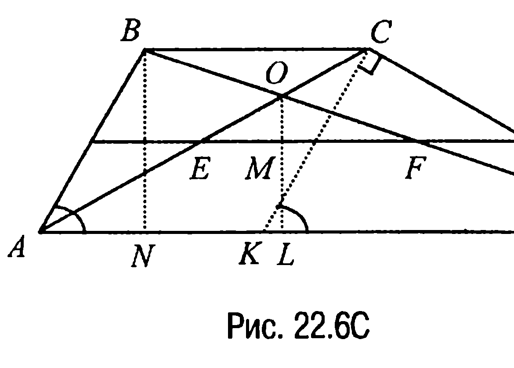

Пусть $\angle DAB = x$, тогда и $\angle DKC = x$ (рис. 22.6C) и, значит, из прямоугольного треугольника $KCD$ $KC = AB = (a - b)\cdot\cos x$.

Из треугольника же $ABN$ высота

$$BN = H = AB\cdot\sin x = (a - b)\cdot\sin x\cdot\cos x = \frac{1}{2}(a - b)\cdot\sin 2x.$$

---
**стр. 490**
---

Далее, поскольку треугольники $NBD$ и $LOD$ подобны (а также подобны треугольники $OBC$ и $AOD$), то

$$\frac{H}{h} = \frac{BD}{OD} = \frac{BO + OD}{OD} = \frac{BO}{OD} + 1 = \frac{BC}{AD} + 1 = \frac{b}{a} + 1 = \frac{a + b}{a}$$

и, значит, $\frac{H}{h} = \frac{a + b}{a}$ или $h = \frac{aH}{a + b}$. Теперь так как высота треугольника $EOF$ — это

$$OM = h - \frac{H}{2} = \frac{aH}{a + b} - \frac{H}{2} = H\cdot\frac{a - b}{2(a + b)} = \frac{(a - b)^2}{4(a + b)}\cdot\sin 2x,$$

а его основание $EF = \frac{1}{2}(a - b)$, то площадь треугольника $EOF$ вычисляется по формуле

$$S_{\Delta EOF} = \frac{1}{2}EF\cdot OM = \frac{1}{2}\cdot\frac{1}{2}(a - b)\cdot\frac{(a - b)^2}{4(a + b)}\cdot\sin 2x = \frac{(a - b)^3}{16(a + b)}\cdot\sin 2x.$$

Отсюда следует, что наибольшее значение площади треугольника $EOF$ — это $\frac{(a - b)^3}{16(a + b)}$ и оно достигается в том случае, когда углы при большем основании $AD$ равны $45^\circ$.

**Ответ:** $\frac{(a - b)^3}{16(a + b)}$.

**22.7С.** Наряду с четырехугольником $OMAN$, у которого сторона $AM = AN$ и $\angle MAN = \psi$, рассмотрим четырехугольник $OM_1AN_1$ (рис. 22.7C), у которого $\angle M_1AN_1 = \psi$.

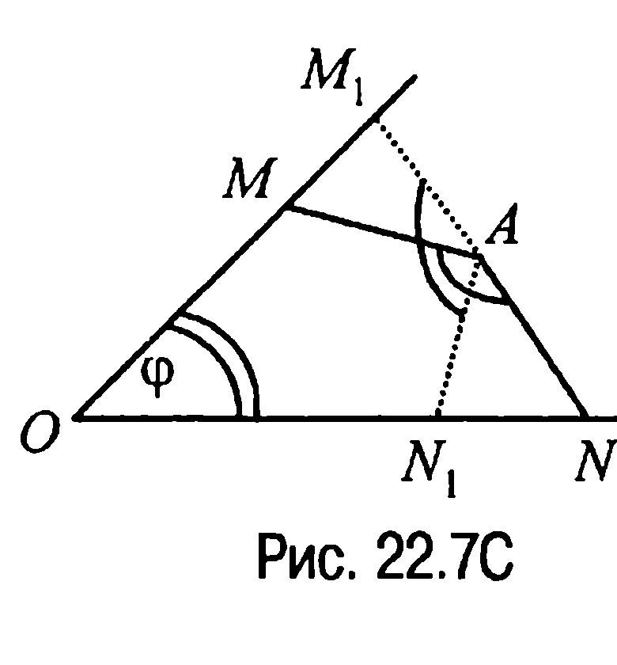

Тогда поскольку $\angle MM_1A = 360^\circ - \varphi - \psi - \angle AN_1O > 180^\circ - \angle AN_1O = \angle NN_1A$, то, учитывая, что $\angle M_1AM = \angle N_1AN$, получим неравенство $AM_1 < AN_1$, которое означает, что $S_{\Delta M_1AM} < S_{\Delta N_1AN}$. А отсюда и следует требуемое: $S_{OM_1AN_1} < S_{OMAN}$.

**22.8С.** Пусть стороны прямоугольника равны $x$ и $y$. Тогда его площадь $S = x\cdot y$, а периметр $P = 2x + 2y = 2x + 2\frac{S}{x} = 2\frac{x^2 + S}{x} =$

---
**стр. 491**
---

$= 2\frac{x^2 - 2x\sqrt{S} + S + 2x\sqrt{S}}{x} = 2\frac{(x - \sqrt{S})^2}{x} + 4\sqrt{S}.$

Отсюда следует, что наименьшее значение периметра $P$ будет при $x = \sqrt{S}$ и оно равно $4\sqrt{S}$. Но в таком случае и $y = \sqrt{S}$. Таким образом, искомым прямоугольником является квадрат со стороной $\sqrt{S}$.

**Ответ:** квадрат со стороной $\sqrt{S}$.

**22.9С.** Так как прямые $KM$ и $AC$ параллельны, то положение точки $K$ на стороне $AB$ однозначно определяется положением точки $M$ на стороне $BC$. Поэтому для ответа на вопрос пункта а) достаточно указать положение точки $M$ на стороне $BC$, при котором диагональ $AM$ параллелограмма будет наименьшей.

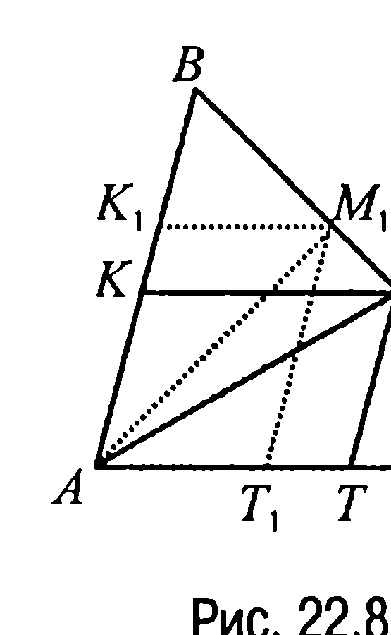

Дальнейшие рассуждения здесь такие. Пусть $M_1$ — основание перпендикуляра, опущенного из точки $A$ на прямую $BC$ (рис. 22.8C). По условию треугольник $ABC$ остроугольный, поэтому точка $M_1$ является внутренней точкой отрезка $BC$. А поскольку длина перпендикуляра, опущенного из данной точки на прямую, меньше любой наклонной, проведенной из той же точки к той же прямой, то получаем, что диагональ $AM$ является наименьшей, когда точка $M$ совпадает с точкой $M_1$, т. е. когда $AM$ — высота треугольника $ABC$.

Выясним теперь, при каком положении точки $K$ на стороне $AB$ наименьшей будет диагональ $KT$.

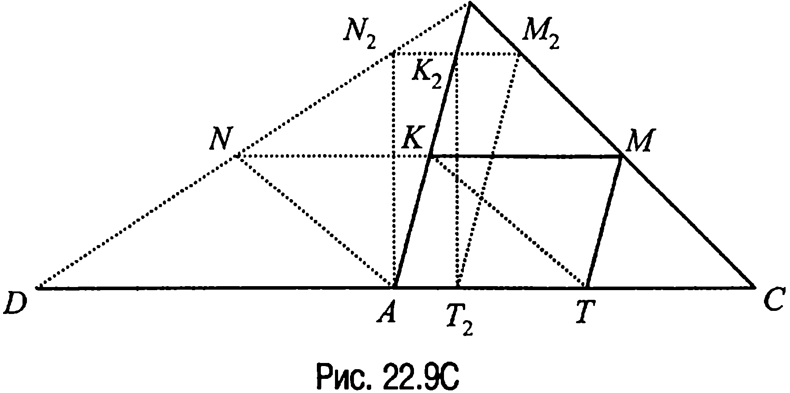

---
**стр. 492**
---

Для этого отметим на продолжении отрезка $AC$ за точку $A$ точку $D$ такую, что $DA = AC$ (рис. 22.9C). Тогда $BA$ — медиана треугольника $DBC$. Пусть $AKMT$ — параллелограмм, удовлетворяющий условиям задачи, и пусть $N$ — точка пересечения прямых $KM$ и $DB$.

Очевидно, что в таком случае $BK$ — медиана треугольника $NBM$ и, следовательно, $NK = KM = AT$. Но в таком случае четырёхугольник $ANKT$ — параллелограмм (стороны $NK$ и $AT$ равны и параллельны) и, значит, $KT = NA$, т. е. диагональ $KT$ будет наименьшей, если наименьшим будет отрезок $NA$.

Но среди всевозможных отрезков, у которых один конец совпадает с точкой $A$, а другой лежит на отрезке $DB$, наименьшим будет отрезок $N_2A$, где $N_2$ — основание перпендикуляра, опущенного из точки $A$ на прямую $DB$ (точка $N_2$ лежит на отрезке $DB$, поскольку угол $DAB$ — тупой).

Этот факт и дает ответ на вопрос пункта б), поскольку положение точки $K$ на отрезке $AB$ однозначно определяется положением точки $N$ на отрезке $DB$.

**Ответ:** а) точка $M$ — основание высоты треугольника $ABC$, опущенной из вершины $A$; б) прямая $KM$ проходит через основание перпендикуляра, опущенного из точки $A$ на прямую $DB$ такую, что точка $D$ лежит на продолжении отрезка $AC$ за точку $A$ и $DA = AC$.

**22.10C.** Пусть $AB$ — большее (верхнее) основание трапеции, а $CD$ — меньшее (нижнее) основание трапеции (рис. 22.10C). Обозначим через $\alpha$ угол между боковой стороной и большим основанием, и пусть $CE \perp AB$.

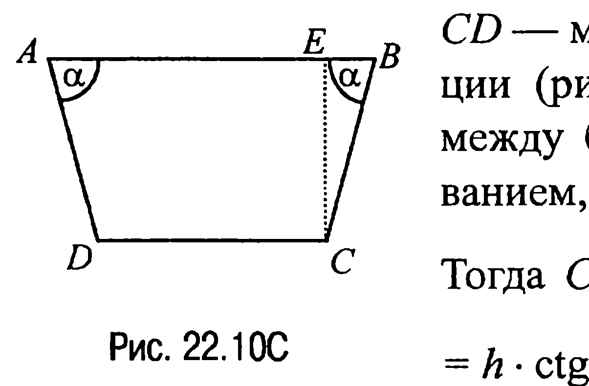

Тогда $CE = h$ и, значит, $BC = \frac{h}{\sin \alpha}$, $BE = h \cdot \text{ctg} \alpha$, $AB = CD + 2BE = CD + 2h \cdot \text{ctg} \alpha$.

Но поскольку площадь трапеции $S = \frac{AB + CD}{2} \cdot h = (CD + h \cdot \text{ctg} \alpha) \cdot h$, то $CD = \frac{S}{h} - h \cdot \text{ctg} \alpha$.

Таким образом, сумма нижнего основания и боковых сторон тра-

---
**стр. 493**
---

пеции $v(\alpha) = CD + 2BC = \frac{S}{h} - h \cdot \text{ctg} \alpha + 2\frac{h}{\sin \alpha}$. Итак, задача свелась к стандартной задаче нахождения того значения $\alpha$, при котором функция $v(\alpha)$ принимает наименьшее значение. Решая эту задачу, находим, что $\alpha = \frac{\pi}{3}$.

**Ответ:** $\frac{\pi}{3}$.

**22.11С.** Выразим периметр $P$ вписанного в полуокружность прямоугольника $ABCD$ (рис. 22.11С) через сторону прямоугольника $AD = x$.

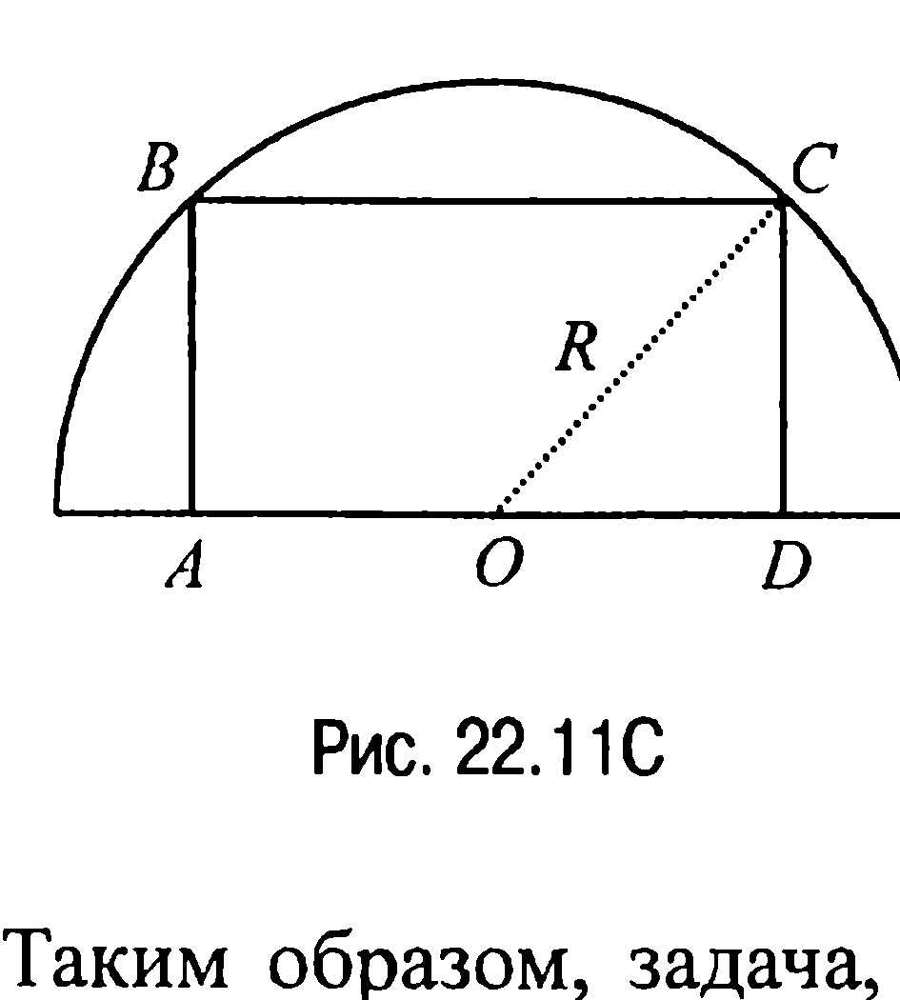

Именно так как другая сторона прямоугольника $CD = \sqrt{R^2 - \frac{x^2}{4}}$, то $P = 2x + 2\sqrt{R^2 - \frac{x^2}{4}} = 2x + \sqrt{4R^2 - x^2}$.

Таким образом, задача, по существу, свелась к нахождению того значения $x$, при котором функция $P(x) = 2x + \sqrt{4R^2 - x^2}$ имеет наибольшее значение, т. е. к стандартной задаче на нахождение максимума функции.

Элементарное исследование показывает, что критической точкой функции $P(x)$ является точка $x = \frac{4R\sqrt{5}}{5}$ и в этой точке функция $P(x)$ достигает своего максимума.

Искомым же прямоугольником будет тогда прямоугольник со сторонами $AD = \frac{4R\sqrt{5}}{5}$ и $CD = \frac{R\sqrt{5}}{5}$.

**Ответ:** $\frac{4R\sqrt{5}}{5}; \frac{R\sqrt{5}}{5}$.

**22.12С.** Если $d$ — диагональ прямоугольника, $\varphi$ — угол между диагоналями, то площадь прямоугольника

$$S = \frac{1}{2} d^2 \cdot \sin \varphi = \frac{1}{2}(2R)^2 \cdot \sin \varphi = 2R^2 \cdot \sin \varphi$$

---
**стр. 494**
---

и, таким образом, наибольшее значение площади — это значение $S = 2R^2$, которое достигается при $\varphi = 90^\circ$.

А отсюда следует, что искомым прямоугольником является квадрат со стороной, равной $R\sqrt{2}$.

**Ответ:** квадрат со стороной $R\sqrt{2}$.

**22.13С.** Пусть $AD$ — высота треугольника $ABC$, который вписан в окружность с центром $O$ (рис. 22.12C) и который очевидно является треугольником равнобедренным.

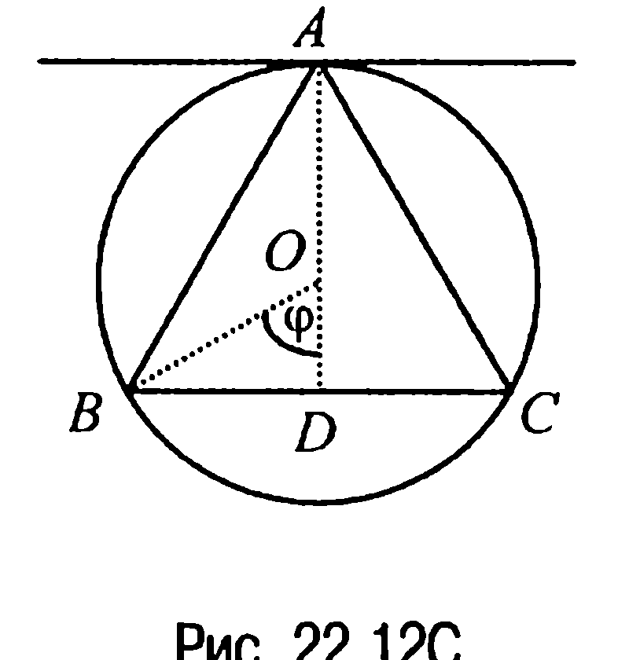

Обозначим $\angle BOD = \varphi$. Тогда из прямоугольного треугольника $ODB$ находим $OD = R \cdot \cos\varphi$, $BD = R \cdot \sin\varphi$. Отсюда $BC = 2R \cdot \sin\varphi$, $AD = AO + OD = R + R \cdot \cos\varphi = R \cdot (1 + \cos\varphi)$ и, значит, площадь треугольника $ABC$ — это

$$S_{\Delta ABC} = \frac{1}{2} BC \cdot AD = \frac{1}{2} \cdot 2R \cdot \sin\varphi \cdot R(1 + \cos\varphi) =$$

$$= R^2 \cdot (1 + \cos\varphi) \cdot \sqrt{1 - \cos^2\varphi}.$$

Таким образом, задача, по существу, свелась к нахождению того значения $x$, при котором функция $f(x) = (1 + x)\sqrt{1 - x^2}$, $-1 < x < 1$, достигает наибольшего значения. Задача эта стандартная и, как нетрудно проверить, искомым значением $x$ является $x = \frac{1}{2}$.

А в таком случае $AD = R\left(1 + \frac{1}{2}\right) = \frac{3R}{2}$.

**Ответ:** на расстоянии $\frac{3R}{2}$.

**22.14С.** Пусть $O$ — центр окружности, $\angle BMC = \varphi$, $\angle DOC = \psi$, (рис. 22.13C). Тогда $S_{ACBD} = \frac{1}{2} AB \cdot CD \cdot \sin\varphi = R \cdot CD \cdot \sin\varphi$, $S_{\Delta DOC} =$

$$= \frac{1}{2} OM \cdot MD \cdot \sin\varphi + \frac{1}{2} OM \cdot MC \cdot \sin\varphi = \frac{d}{2} \cdot CD \cdot \sin\varphi.$$

Следовательно, $\frac{S_{\Delta DOC}}{S_{ACBD}} = \frac{d}{2R}$, откуда $S_{ACBD} = \frac{2R \cdot S_{\Delta DOC}}{d}$ и, значит, площадь четырехугольника $ACBD$ будет наибольшей, когда наибольшей будет
