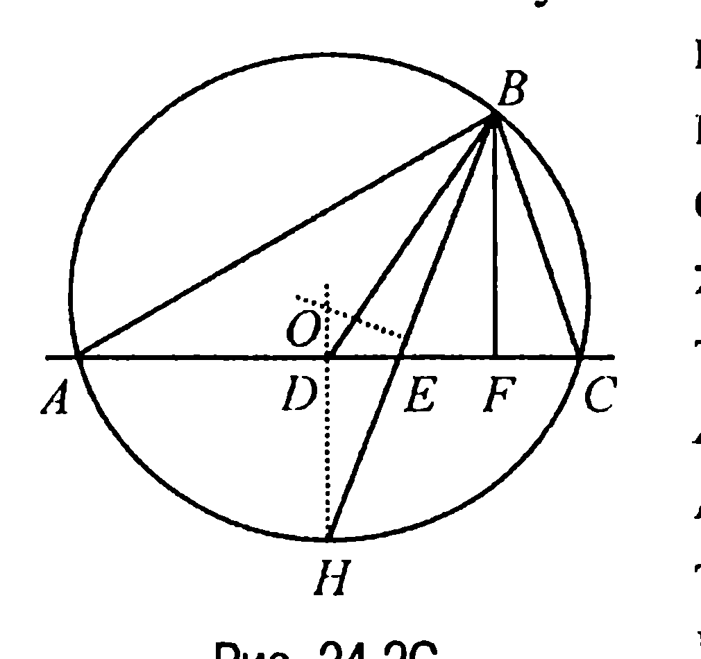
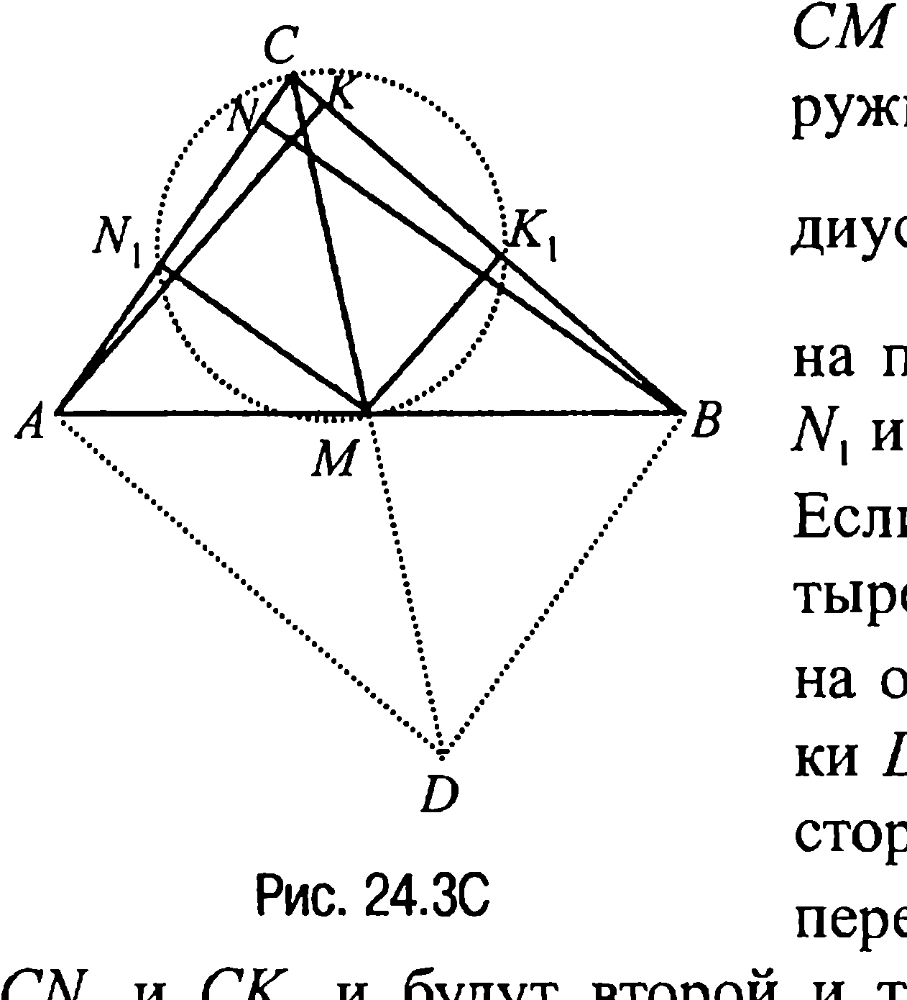
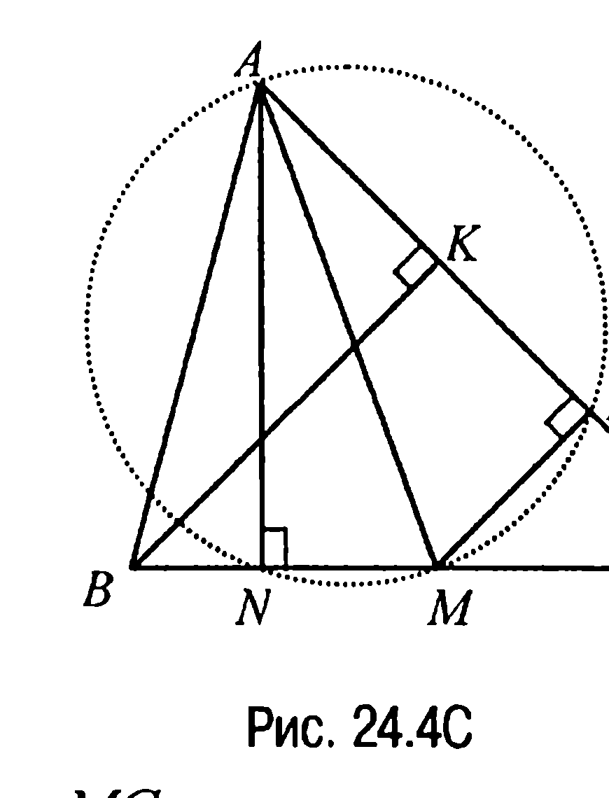
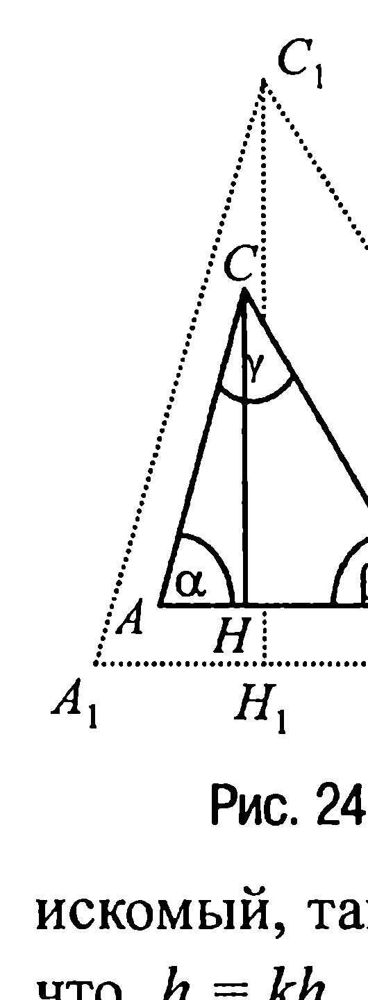
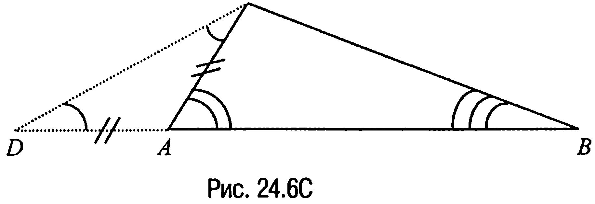
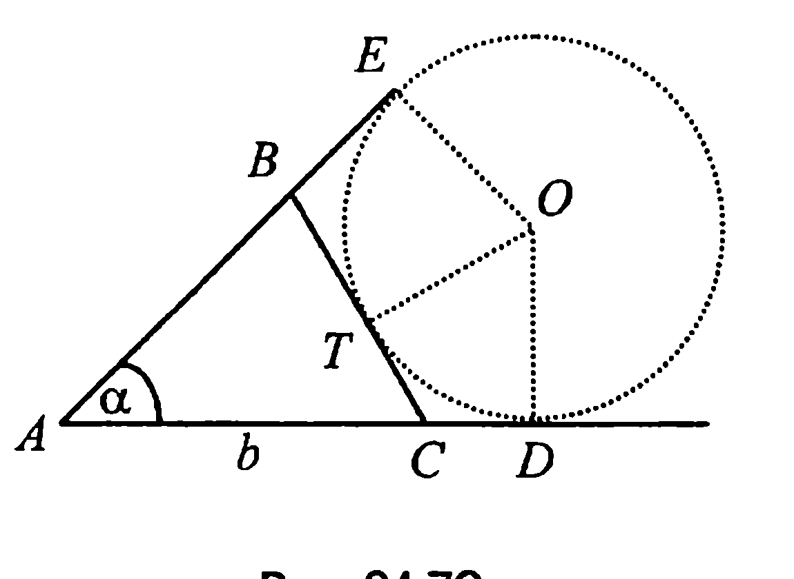

## 9.23. Построение треугольника по трем элементам

---
**стр. 498**
---

**Исследование.** Из предыдущих рассуждений следует, что задача имеет решение, причем единственное, тогда и только тогда, когда $m_a + m_b > m_c$, $m_b + m_c > m_a$, $m_c + m_a > m_b$.

**24.2С. Анализ.** Пусть $ABC$ — искомый треугольник (рис. 24.2С) и пусть $BD = m$, $BE = l$ и $BF = h$ — его медиана, биссектриса и высота соответственно. Тогда план решения задачи может быть составлен на основе того факта, что если в треугольнике $ABC$ стороны $AB$ и $BC$ не равны, то его биссектриса $BE$ лежит между медианой $BD$ и высотой $BF$ (задача 8.3).

**Построение.** Из произвольной точки $F$ некоторой прямой восстановим к ней перпендикуляр $FB = h$. Затем из точки $B$ как вершины искомого треугольника растворами циркуля $m$ и $l$ опишем дуги окружностей до пересечения их в точках $D$ и $E$ с выбранной прямой. Пусть отрезки $BD$ и $BE$ — медиана и биссектриса искомого треугольника соответственно. Если теперь в точке $D$ восстановить перпендикуляр к прямой $DF$ и обозначить через $H$ точку пересечения этого перпендикуляра с прямой $BE$, а после этого восстановить серединный перпендикуляр к отрезку $BH$, то точка $O$ пересечения этого перпендикуляра с перпендикуляром к прямой $DF$, проходящим через точку $D$, будет центром окружности, проходящей через точки $B$ и $H$. Точки же $A$ и $C$ пересечения этой окружности с прямой $DF$ и будут второй и третьей вершинами искомого треугольника.

**Доказательство.** В треугольнике $ABC$ отрезок $BF = h$ — высота по построению, $BD = m$ — медиана, поскольку точка $D$ — середина отрезка $AC$ по построению, наконец, отрезок $BE = l$ — биссектриса треугольника $ABC$, так как ее продолжение пересекает дугу $AC$ в серединной точке $H$ и, следовательно, $\angle ABE = \angle CBE$.

**Исследование.** Задача имеет единственное решение при условии, что $h < l < m$.

**24.3С. Анализ.** Пусть $ABC$ — искомый треугольник (рис. 24.3С) и пусть $AK = h_a$, $BN = h_b$ — его высоты, а $CM = m_a$<!-- вероятная опечатка оригинала: возможно, имелось в виду $m_c$ --> — медиана.

---
**стр. 499**
---

Проведем из основания $M$ медианы $CM$ отрезки $MK_1$ и $MN_1$, параллельные соответственно отрезкам $AK$ и $BN$. Тогда так как $MK_1$ и $MN_1$ — средние линии треугольников $AKB$ и $ANB$ соответственно, то $MK_1 = \frac{1}{2}h_a$, а $MN_1 = \frac{1}{2}h_b$. Далее, если рассмотреть прямоугольные треугольники $MN_1C$ и $MK_1C$, то очевидно, что $\angle ACB = \angle ACM + \angle MCB_1$. Но в таком случае, если достроить треугольник $ABC$ до параллелограмма $ABCD$, продолжив медиану $CM$ за точку $M$, то становится ясным и план решения задачи.

**Построение.** Делим отрезки $h_a$ и $h_b$ пополам. Затем на отрезке $CM = m_c$ как на диаметре строим окружность. После этого из точки $M$ радиусами $\frac{1}{2}h_b$ и $\frac{1}{2}h_a$ делаем засечки на построенной окружности в точках $N_1$ и $K_1$ соответственно. Если теперь продлить диагональ четырехугольника $N_1CK_1M$ за точку $M$ на отрезок $MD = CM$, а затем из точки $D$ провести прямые, параллельные сторонам угла $N_1CK_1$, то точки $A$ и $B$ пересечения этих прямых с прямыми $CN_1$ и $CK_1$ и будут второй и третьей вершинами искомого треугольника.

**Доказательство.** То, что построенный треугольник действительно является искомым, следует из того, что $h_a$ и $h_b$ — его высоты, отрезок $AM$ равен отрезку $MB$ по построению, отрезок $CM = m_c$ также по построению.

**Исследование.** Задача имеет решение при выполнении следующих двух неравенств: $\frac{1}{2}h_a < m_c$, $\frac{1}{2}h_b < m_c$.

**24.4С. Анализ.** Пусть искомый треугольник $ABC$ построен (рис. 24.4С) и пусть $AN = h_a$, $BK = h_b$ — его высоты, а $AM = m_a$ — медиана. Проведем из основания $M$ медианы $AM$ отрезок $MP$, параллельный отрезку $BK$. Тогда так как $MP$ — средняя линия тре-

---
**стр. 500**
---

угольника $BKC$, то $MP = \frac{1}{2}h_b$. Но в таком случае, замечая, что треугольники $MNA$ и $MPA$ являются прямоугольными, становится очевидным и план построения искомого треугольника.

**Построение.** Делим отрезок $h_b$ пополам. Затем на отрезке $AM = m_a$ как на диаметре строим окружность и из точек $M$ и $A$ радиусами $\frac{1}{2}h_b$ и $h_a$ делаем на этой окружности засечки в точках $P$ и $N$ соответственно. Тогда точка $C$ пересечения прямой $AP$ с прямой $NM$ будет второй вершиной строящегося треугольника. Наконец, отложив на луче $CM$ отрезок $MB = MC$, построим последнюю — третью вершину $B$ искомого треугольника.

**Доказательство.** Построенный треугольник $ABC$ является искомым, поскольку отрезок $BK$, параллельный отрезку $MP = \frac{1}{2}h_b$, равен $h_b$ и, значит, является высотой треугольника $ABC$, отрезок $AN$ является высотой треугольника по построению, отрезок же $MB$ равен отрезку $MC$ также по построению.

**Исследование.** Задача имеет решение при выполнении неравенств $h_a \le m_a$ и $\frac{1}{2}h_b < m_a$.

**24.5С. Анализ.** Пусть $\alpha$ и $\beta$ — данные углы, $\gamma = 180^\circ - \alpha - \beta$ — меньший из углов искомого треугольника $ABC$ (рис. 24.5C). Пусть, далее, сторона $AB$ равна $c$, высота $CH$, проведенная к стороне $AB$, равна $h$, а $c + h = m$. Тогда по углам $\alpha$ и $\beta$ можно построить треугольник, подобный искомому, и, значит, меньшая сторона этого треугольника и высота, проведенная к ней, по свойству подобных фигур пропорциональны меньшей стороне и высоте искомого треугольника. Но в таком случае сумма меньшей стороны и высоты, проведенной к ней, одного треугольника пропорциональна аналогичной

---
**стр. 501**
---

сумме другого треугольника. Отсюда следует и ход построения.

**Построение.** Сначала по произвольному отрезку $A_1B_1 = c_1$ и двум прилежащим углам $\alpha$ и $\beta$ строим треугольник $A_1B_1C_1$. Затем из точки $C_1$ проводим к стороне $A_1B_1$ перпендикуляр $C_1H_1 = h_1$ — высоту треугольника. Далее, на основании обобщенной теоремы Фалеса делим данный отрезок $m$ в отношении $\frac{c_1}{h_1}$, в результате чего находим отрезок $c$ ($h$). Зная же отрезок $c$ и углы $\alpha$ и $\beta$, строим искомый треугольник $ABC$.

**Доказательство.** Треугольник $ABC$ — искомый, так как из подобия треугольников $ABC$ и $A_1B_1C_1$ следует, что $h = kh_1$, $c = kc_1$, $h + c = k(h_1 + c_1) = km_1 = m$, где $k$ — коэффициент подобия.

**Исследование.** Задача имеет решение, если $\alpha + \beta < 180^\circ$.

**24.6C. Анализ.** Предположим, что искомый треугольник $ABC$ с данными углами $\angle CAB = \alpha$, $\angle ABC = \beta$ и суммой сторон $AC + AB = m$ построен (рис. 24.6C). Отложим на продолжении стороны $AB$ за точку $A$ отрезок $AD = AC$ и соединим точки $C$ и $D$. Полученный треугольник $ADC$ — равнобедренный и, значит, $\angle CDA = \angle DCA = \frac{1}{2} \angle CAB = \frac{1}{2} \alpha$.

В треугольнике же $DCB$ известны сторона $DB = m$ и два угла: $\angle CDB = \frac{1}{2}\alpha$ и $\angle DBC = \beta$. Очевидно, что выявленной информации достаточно для составления плана построения требуемого треугольника.

---
**стр. 502**
---

треугольника.

**Построение.** Сначала отложим отрезок $DB = m$, затем строим углы $\frac{1}{2}\alpha$ и $\beta$ с вершинами в точках $D$ и $B$, одной из сторон которых является отрезок $DB$. Тогда точка пересечения $C$ других сторон построенных углов будет второй вершиной искомого треугольника (первая — это вершина $B$). Если теперь от луча $CD$ с началом в точке $C$ отложить угол $\frac{1}{2}\alpha$, то точка пересечения $A$ второй стороны этого угла с отрезком $DB$ и будет третьей вершиной искомого треугольника.

**Доказательство.** Угол $ABC$ треугольника $ABC$ равен углу $\beta$ по построению, угол $CAB$ является внешним для треугольника $DAC$ и поэтому $\angle CAB = \angle CDA + \angle DCA = \frac{1}{2} \alpha + \frac{1}{2} \alpha = \alpha$. Далее, поскольку треугольник $DAC$ является равнобедренным, то $AC = AD$ и, следовательно, $AC + AB = DA + AB = m$, что и завершает доказательство.

**Исследование.** Задача имеет решение тогда и только тогда, когда сумма углов $\alpha + \beta < 180^\circ$. Решение задачи единственное.

**24.7C. Анализ.** Пусть треугольник $ABC$, у которого основание $AC = b$, $\angle CAB = \alpha$ и $AB + BC + CA = P$ (рис. 14.7C), построен. <!-- вероятная опечатка оригинала: в тексте «14.7C», подпись рисунка — «24.7C» --> Отметим на лучах $AC$ и $AB$ точки $D$ и $E$ соответственно так, чтобы $AD = AE = \frac{P}{2}$, и затем в точках $D$ и $E$ восстановим к указанным лучам перпендикуляры. Тогда очевидно, что точка $O$ пересечения этих перпендикуляров будет центром вневписанной окружности треугольника $ABC$ с радиусом $OD = OE$. Отсюда и вытекает план решения задачи.

**Построение.** На луче с началом в точке $A$ отложим отрезок $AC = b$, а затем построим угол $\alpha$ с вершиной в точке $A$. После
