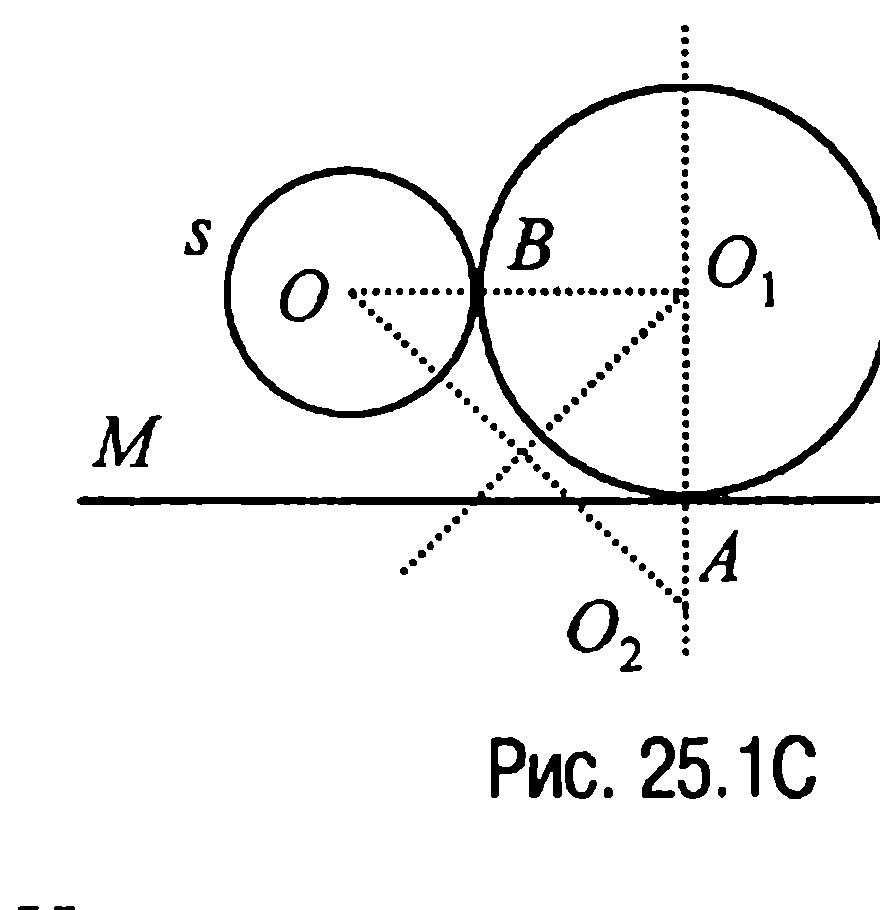
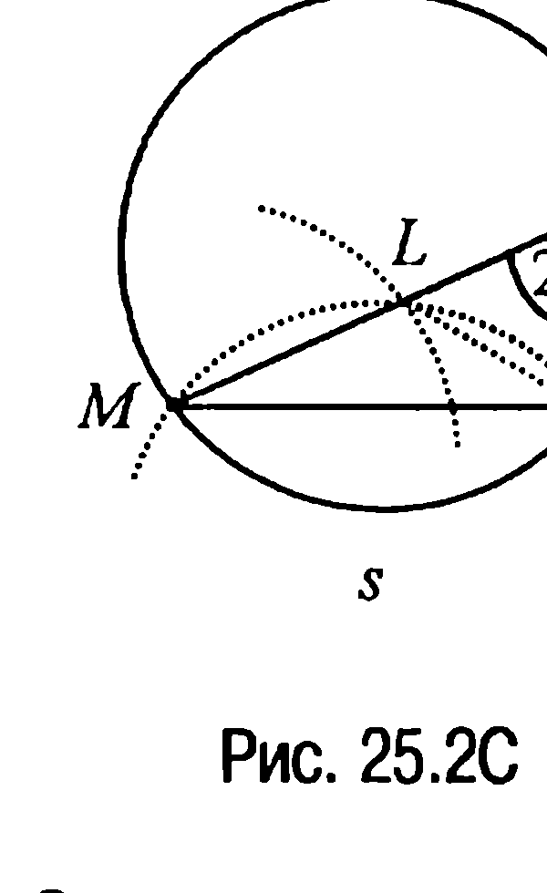
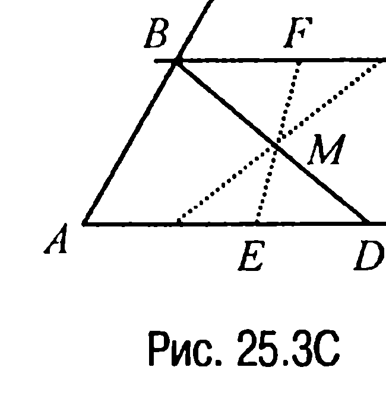
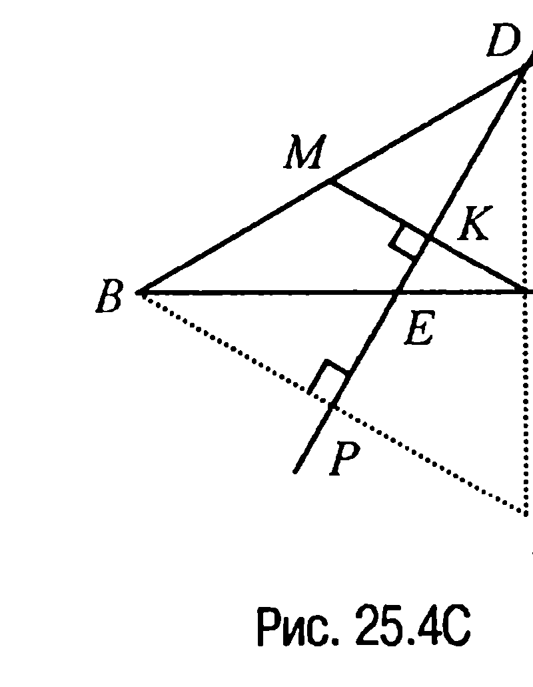
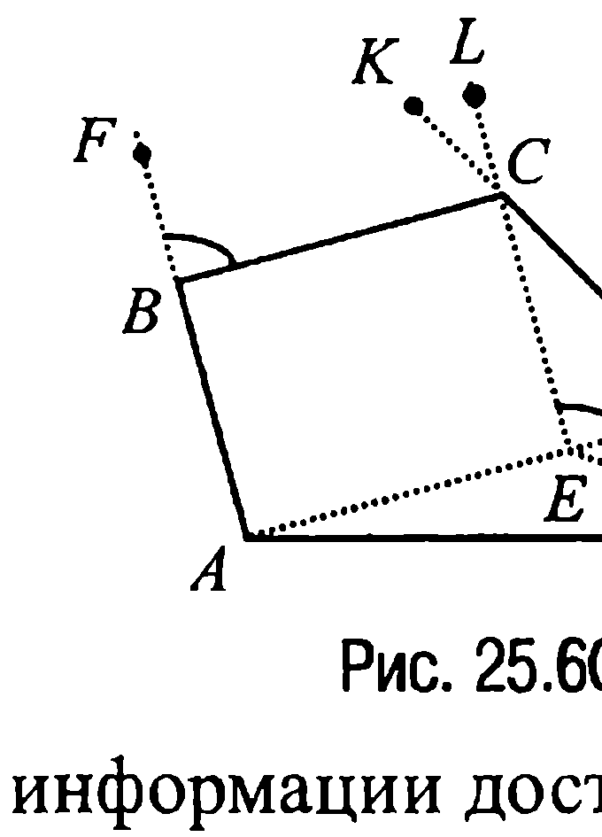
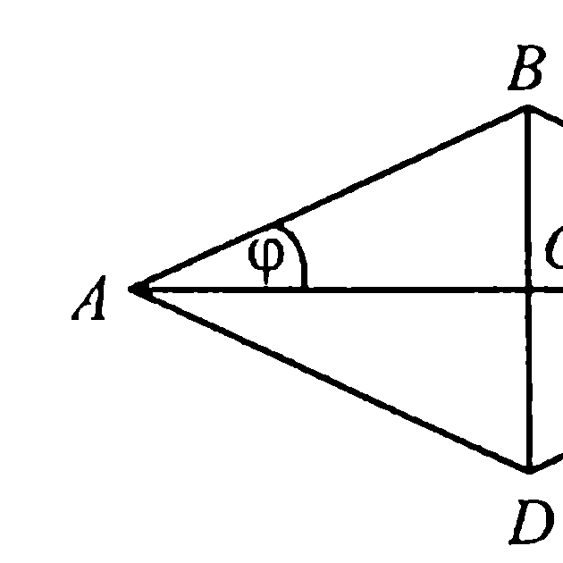
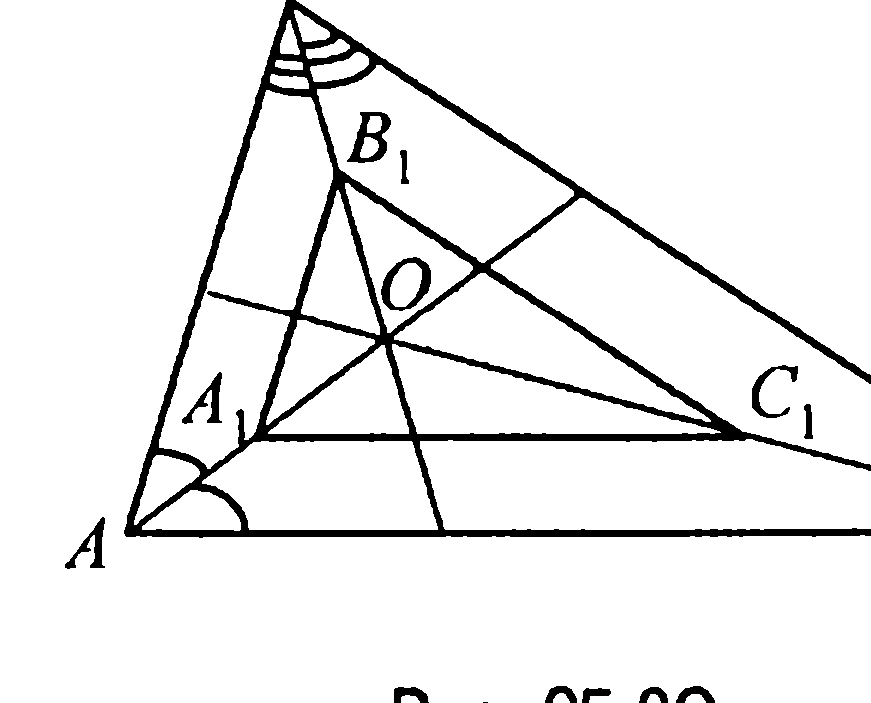
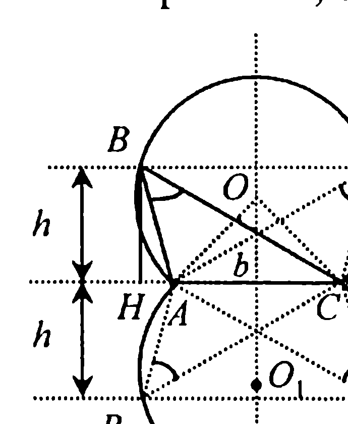

## 9.24. Некоторые методы решения задач на построение

---
**стр. 503**
---

этого на сторонах угла $\alpha$ откладываем отрезки $AD = AE = \frac{P}{2}$. Далее, строим точку $O$ как точку пересечения перпендикуляров, проведенных к сторонам угла в точках $D$ и $E$ соответственно. Тогда если через точку $C$ провести касательную $CT$ к окружности с центром в точке $O$ и радиусом $OD = OE = OT$, то точка $B$ пересечения этой касательной с лучом $AE$ и будет третьей вершиной искомого треугольника.

**Доказательство.** Отрезок $AC$ и $\angle CAB$ равны соответственно $b$ и $\alpha$ по построению. Пусть точка $T$ — точка касания стороны $BC$ с вневписанной к треугольнику $ABC$ окружностью с центром $O$. Тогда так как $BE = BT$, а $CT = CD$, то $AB + BC + CA = AB + CA + BE + CD = 2AD = 2\frac{P}{2} = P$, что и доказывает требуемое.

**Исследование.** Из построения очевидным образом следует, что задача имеет единственное решение.

**§ 25. Некоторые методы решения задач на построение**

**25.1C. Анализ.** Пусть $s$ — данная окружность с центром в

точке $O$, $MN$ — данная прямая с заданной на ней точкой $A$, а $s_1$ — искомая окружность с центром в точке $O_1$, касающаяся окружности $s$ в точке $B$ (рис. 25.1C). Тогда, так как точка $O_1$ должна быть равноудаленной от точек $A$ и $B$, то отрезок $O_1B = O_1A$.

Но в таком случае, если на продолжении отрезка $O_1A$ за точку $A$ отложить отрезок $AO_2 = OB$, то отрезки $O_1O$ и $O_1O_2$ окажутся равными между собой и, следовательно, точка $O_1$ будет равноудалена от точек $O$ и $O_2$.

После проведенного анализа решение задачи становится очевидным.

---
**стр. 504**
---

**Построение.** Сначала строим геометрическое место точек, равноудалённых от точек $O$ и $O_2$ (серединный перпендикуляр к отрезку $OO_2$), а затем — геометрическое место центров окружностей, касающихся данной прямой в заданной точке (перпендикуляр к прямой $MN$ в точке $A$). Точка $O_1$ пересечения построенных геометрических мест точек и будет центром искомой окружности.

**Доказательство.** По построению $O_1A \perp MN$, поэтому окружность с центром в точке $O_1$ и радиусом $O_1A$ касается прямой $MN$. С другой стороны, по построению $O_1O_2 = O_1O$ и, следовательно, $O_1B = O_1O - R = O_1O_2 - R = O_1A$, т. е. построенная окружность касается и данной окружности с центром $O$.

**Исследование.** Из анализа и построения очевидно, что задача всегда имеет решение, причём единственное.

**25.2C. Анализ.** Пусть $P$ — искомая точка (рис. 25.2C). Отложим на отрезке $PM$ отрезок $PL = NP$. Тогда так как $ML = a$, то точка $L$ лежит на окружности с центром в точке $M$ и радиусом, равным $a$. Далее замечаем, что поскольку угол $MPN$ известен (он опирается на известную дугу $MN$), то, обозначив его через $2\varphi$, находим, что $\angle LNP = \frac{180^\circ - 2\varphi}{2} = 90^\circ - \varphi$ и, значит, $\angle MLN = (90^\circ - \varphi) + 2\varphi = 90^\circ + \varphi$.

Отсюда следует, что точка $L$ — это точка пересечения двух окружностей: окружности с центром в точке $M$ и радиусом, равным $a$, и окружности с вписанным в неё углом $MLN$, равным $90^\circ + \varphi$ (под этим углом отрезок $MN$ виден из точки $L$).

**Построение.** Сначала строим окружность с центром в точке $M$ и радиусом, равным $a$, а затем — угол, равный $90^\circ + \varphi$, где $\varphi$ — это половина любого вписанного в окружность угла, опирающегося на дугу $MSN$. После этого строим геометрическое место точек, из которых отрезок $MN$ виден под углом $90^\circ + \varphi$.

А тогда точка $P$ пересечения заданной окружности с прямой, проходящей через точки $M$ и $L$, где $L$ — точка пересечения построенных двух геометрических мест точек, и будет искомой точкой.

**Доказательство.** По построению точка $L$ такова, что $PL = MP -$

---
**стр. 505**
---

$a$. А поскольку $\angle MLN + \angle NLP = 90^\circ + \varphi + \angle NLP = 180^\circ$, то $\angle NLP = 90^\circ - \varphi$. Учитывая же, что $\angle MPN = 2\varphi$, приходим к выводу: $\angle LNP = 180^\circ - \angle NLP - \angle LPN = 180^\circ - 90^\circ + \varphi - 2\varphi = 90^\circ - \varphi$. Таким образом, $\angle NLP = \angle LNP$, откуда следует, что треугольник $LPN$ — равнобедренный и, значит, $PL = NP = MP - a$ или $MP - NP = a$.

**Исследование.** Очевидно, что задача имеет решение, причём единственное, если $MN \ge a$.

**25.3C. Анализ.** Пусть даны угол с вершиной в точке $A$ и точка $M$ внутри угла. Предположим, что задача решена и $BD$ — искомый отрезок (рис. 25.3C). Тогда точки $B$ и $D$ симметричны относительно точки $M$. Отсюда и следует план построения.

**Построение.** Строим прямую $l$, симметричную одной из сторон угла относительно точки $M$. Тогда пересечение прямой $l$ с другой стороной угла определяет точку $B$. Если теперь провести прямую $BM$, то точка $D$ этой прямой, симметричная точке $B$ относительно точки $M$, будет лежать на стороне угла и, значит, отрезок $BD$ — искомый отрезок.

**Доказательство** очевидным образом следует из построения.

**Исследование.** Задача всегда имеет единственное решение, что также очевидно.

**25.4C. Анализ.** Пусть $MN$ — искомый отрезок (рис. 25.4C). Тогда точки $M$ и $N$ симметричны относительно прямой $DE$, а луч $DB$ симметричен лучу $DN$. Отсюда становится ясным план решения задачи.

**Построение.** Сначала строим перпендикуляр из точки $B$ к прямой $DE$, а затем откладываем на построенном перпендикуляре от точки $P$ его пересечения с прямой $DE$ отрезок $PB_1 = BP$. После этого проводим луч $DB_1$. Пусть этот луч пересекает луч $BC$ в точке $N$ и пусть точка $M$ — точка пересечения луча $DB$ с перпендикуляром к лучу $DE$, про-

---
**стр. 506**
---

ходящим через точку $N$. Тогда отрезок $MN$ и будет искомым.

**Доказательство.** Отрезок $MN$ перпендикулярен прямой $DE$ по построению. А так как также по построению лучи $DB$ и $DB_1$ симметричны относительно прямой $DE$, то симметричными относительно прямой $DE$ будут и точки $M$ и $N$. Последнее же означает, что $MK = KN$, где точка $K$ — точка пересечения прямой $DE$ и отрезка $MN$, следовательно, $MN$ — действительно искомый отрезок.

**Исследование.** Если данный угол $ABC$ тупой или прямой, то задача решений не имеет, так как в данном случае угол $BMN$ будет острым, а значит, острым будет и угол $MKD$, т. е. отрезки $DE$ и $MN$ не перпендикулярны.

Задача не будет иметь решений и в случае, когда прямая $DE$ перпендикулярна одной из сторон угла, поскольку отрезок, перпендикулярный $DE$, будет параллелен стороне угла.

В остальных случаях задача имеет единственное решение, причём если угол $BDE$ — тупой, то решение аналогично рассмотренному случаю острого угла $BDE$ с той лишь только разницей, что строим луч $BC_1$, симметричный лучу $BC$ относительно прямой $DE$.

**25.5C. Анализ.** Пусть задача решена и пусть $BAC$ — искомая секущая (рис. 25.5C). Повернём окружность $s_1$ около точки $A$ так, чтобы точка $C$ перешла в точку $D$ секущей $BAC$. Пусть далее $s_2$ — окружность с центром в точке $O_2$, в которую при выбранном повороте перешла точка $O_1$, и пусть точки $E$ и $F$ хорды $BA$ такие, что $OE \perp BA$, $O_2F \perp DA$. Тогда $EF = EA - FA = EA - AM =$

$= \frac{1}{2}BA - \frac{1}{2}AC = \frac{1}{2}(BA - AC) = a$. Проведём отрезок $O_2Q = EF$, который лежит на прямой, параллельной прямой $BA$. В результате прямоугольный треугольник $OQO_2$ будет определять направление прямой $OQ$.

---
**стр. 507**
---

**Построение.** На продолжении прямой $O_1A$ за точку $A$ откладываем отрезок $AO_2 = AO_1$ и на отрезке $OO_2$ как на диаметре строим окружность. Затем радиусом, равным $a$, проводим окружность с центром в точке $O_2$. Пусть $Q$ — одна из точек пересечения обеих построенных окружностей, тогда искомые хорды будут лежать на прямой, проходящей через точку $A$ перпендикулярно прямой $OQ$.

**Доказательство.** Так как $AF = AM$, то $AD = AC$. Таким образом, $BA - AC = 2(AE - AF) = 2EF = 2QO_2 = 2a$.

**Исследование.** Задача имеет решение, когда $O_2D \le O_2O$, т. е. когда $a \le 2O_2O$. Если $a = 2O_2O$, то хорды $BA$ и $AC$ параллельны прямой $O_2O$ и задача имеет единственное решение при условии, что угол $OO_2O_1$ — тупой. Если же $a = 2O_2O$, а угол $OO_2O_1$ — острый, то задача решений не имеет (в этом случае сумма хорд $BA$ и $AC$ равна $a$). Наконец, если $a = 2O_2O$, а угол $OO_2O_1$ — прямой, то хорда $AC$ вырождается в точку и задача имеет решение, если $O_2O^2 = R^2 - r^2$, где $R$ и $r$ — радиусы данных окружностей.

**25.6С. Анализ.** Предположим, что четырехугольник $ABCD$ построен (рис. 25.6С). Пусть $AE = BC$ — отрезок, лежащий на прямой, проходящей через точку $A$ параллельно прямой $BC$. Тогда в треугольнике $AED$ известны две стороны $AE$ и $AD$ и угол между ними $\angle DAE = \angle DAB - \angle CBF$, где $\angle CBF$ — угол, смежный с данным углом $ABC$. Полученной

информации достаточно, чтобы провести искомое построение.

**Построение.** Откладываем от данного луча (отрезка) $AD$ угол $DAQ$, равный разности данного угла с вершиной $A$ и угла, смежного с данным углом с вершиной $B$. Затем на стороне угла $AQ$ откладываем отрезок $AE = BC$. После этого от луча $EQ$ откладываем угол, смежный с данным углом с вершиной $B$, а от луча $DA$ откладываем данный угол с вершиной $D$. Точка $C$ пересечения лучей $EL$ и $DK$ будет третьей вершиной строящегося четырехугольника. Что же касается четвертой вершины, то это будет точка $B$ пересечения прямой, проходящей через точку $A$ параллельно прямой $EL$, с прямой, проходящей через точку $C$ параллельно прямой $AE$.

---
**стр. 508**
---

**Доказательство.** следует из анализа и построения.

**Исследование.** Из анализа и построения следует, что задача имеет единственное решение.

**25.7C. Анализ.** Пусть $AC = d_1$ и $BD = d_2$ — диагонали искомого ромба $ABCD$, а $\phi$ — угол между стороной и диагональю ромба $d_1$ (рис. 25.7C). Тогда поскольку у ромба все стороны равны, то ромбы с равными острыми углами подобны. Построим ромб $A_1B_1C_1D_1$, подобный искомому по данному углу $\phi$, а затем разделим на основании обобщенной теоремы Фалеса отрезок $d = d_1 + d_2$ в отношении, равном отношению $m : n$ диагоналей $A_1C_1 = m$ и $B_1D_1 = n$ построенного ромба. В результате получим диагонали искомого ромба. Отсюда и следует план решения задачи.

**Построение.** Сначала строим прямоугольный треугольник $A_1O_1B$ по произвольному катету $A_1O_1$ и прилежащему острому углу $\angle B_1A_1C_1 = \phi$ и затем дополняем построенный треугольник до ромба, у которого $A_1C_1 = m, B_1D_1 = n$. После этого делим отрезок $d = d_1 + d_2$ в отношении $m : n$. Получив таким образом диагонали $d_1$ и $d_2$, делим их пополам. Наконец, строим две взаимно перпендикулярные прямые и откладываем от точки $O$ их пересечения отрезки $AO = OC = \frac{1}{2}d_1$ и $BO = OD = \frac{1}{2}d_2$. В результате получим искомый ромб $ABCD$.

**Доказательство.** Сумма диагоналей ромба $ABCD$ равна по построению $d$, угол же $CAB$ равен $\phi$, так как $\frac{d_2}{d_1} = \frac{n}{m} = \tg\phi$.

**Исследование.** Задача имеет решение при любом отрезке $d$ и угле $\phi < 90^\circ$.

**25.8C. Анализ.** Пусть $O$ — точка пересечения биссектрис данного треугольника $ABC$ (рис. 25.8C). Тогда по определению гомотетии вершина $A_1$ искомого треугольника $A_1B_1C_1$ лежит на луче

---
**стр. 509**
---

$OA$, причем $OA_1 = \frac{1}{2} OA$, т. е. точка $A_1$ — середина отрезка $OA$.

Аналогично, точки $B_1$ и $C_1$ являются серединами отрезков $OB$ и $OC$ соответственно. Отсюда становится ясным и план решения задачи.

**Построение.** Сначала находим центр гомотетии, разделив углы данного треугольника пополам и

построив точку пересечения биссектрис треугольника — точку $O$. Затем, разделив отрезки $OA$, $OB$ и $OC$ пополам, найдем точки $A_1$, $B_1$ и $C_1$ соответственно, являющиеся вершинами искомого треугольника.

**Доказательство.** Построенный треугольник $A_1B_1C_1$ является искомым по определению гомотетии.

**Исследование.** Задача имеет единственное решение.

**25.9С. Анализ.** Поскольку $x = \sqrt{a^2 - ab + b^2} = \sqrt{a^2 + b^2 - 2ab \cdot \frac{1}{2}} =$
$= \sqrt{a^2 + b^2 - 2ab \cos 60^\circ}$, то отсюда следует, что $x$ — это сторона треугольника с двумя другими сторонами $a$ и $b$ и углом в $60^\circ$ между ними. Отсюда построение становится очевидным.

**Построение.** Сначала строим угол в $60^\circ$ (угол любого равностороннего треугольника). Затем на сторонах угла равностороннего треугольника откладываем от его вершины отрезки $a$ и $b$ соответственно. Концы построенных отрезков и будут концами искомого отрезка.

**Доказательство** следует из того факта, что по теореме косинусов сторона, лежащая против угла в $60^\circ$, равна именно $x$.

**Исследование.** Задача всегда имеет единственное решение, так как две стороны и угол между ними всегда задают единственный треугольник.

**25.10C. Анализ.** Пусть искомый треугольник $ABC$, у которого основание $AC = b$, $\angle ABC = \beta$ и высота $BH = h$, опущенная из вершины $B$, построен (рис. 25.9С). Тогда из вершины $B$ треуголь-

---
**стр. 510**
---

ника $ABC$ отрезок $AC$ виден под углом $\beta$ и, таким образом, точка $B$ принадлежит дуге окружности радиуса $R = \frac{b}{2\sin\beta}$, опирающейся на отрезок $b$, за исключением точек $A$ и $C$ (задача 25.24).

С другой стороны, так как расстояние от вершины $B$ до основания треугольника равно $h$, то точка $B$ должна принадлежать и другому геометрическому месту точек: прямой, параллельной прямой $AC$ и проведенной от последней на расстоянии, равном $h$. Итак, вершина $B$ принадлежит двум указанным геометрическим местам точек. Это свойство точки $B$ и определяет план решения задачи.

**Построение.** Сначала строим геометрическое место точек, из которых данный отрезок $AC = b$ виден под заданным углом $\beta$ (задача 25.24), а затем на расстоянии $h$ от прямой $AC$ проводим две параллельные прямые. Точки пересечения $B, B_1, B_2$ и $B_3$ двух построенных геометрических мест и определяют возможное положение третьей вершины искомого треугольника.

**Доказательство.** Любой из треугольников $ABC, AB_1C, AB_2C$ и $AB_3C$ будет искомым. Действительно, основание и высота каждого из указанных треугольников равны $b$ и $h$ соответственно по построению.

Покажем, что угол при каждой вершине $B, B_1, B_2$ и $B_3$ равен $\beta$. Именно, поскольку центральный угол $AOC$ равен $2\beta$, что очевидным образом следует из рис. 25.9C, то любой вписанный в окружность угол, как, например, угол $ABC, AB_1C, AB_2C$ и $AB_3C$, опирающийся на хорду $AC$, равен половине центрального угла и, значит, равен $\beta$.

**Исследование.** Как следует из построения задача имеет четыре решения. При этом решение существует только в том случае, когда высота $h \le R + R \cdot \cos\beta$, где $R$ — радиус окружности с центром $O$, или когда $h \le b(1 + \cos\beta)/2\sin\beta$.
