## 9.25. Треугольники и окружности

---
**стр. 511**
---

**§ 26. Треугольники и окружности**

**26.1С.** Пусть $ABC$ — прямоугольный треугольник, у которого $\angle BCA = 90^\circ$, $BL = \frac{d\sqrt{3}}{3}$ — биссектриса, $AB = d$, $\angle ABC = 2\beta$ (рис. 26.1С). Тогда из треугольника $ABC$ следует, что $BC = d \cdot \cos 2\beta$. С другой стороны, из прямоугольного треугольника $BCL$ катет $BC = \frac{d\sqrt{3}}{3} \cdot \cos \beta$.

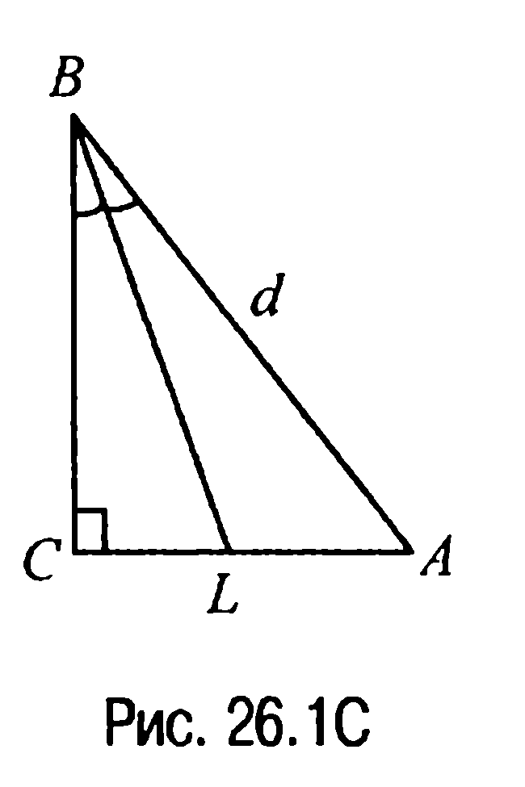

Но в таком случае $\frac{d\sqrt{3}}{3} \cos \beta = d \cdot \cos 2\beta$ или $\sqrt{3} \cos 2\beta = \cos \beta$, или $2\sqrt{3} \cos^2 \beta - \cos \beta - \sqrt{3} = 0$, откуда $\cos \beta = \frac{\sqrt{3}}{2}$ и, значит, $\beta = \frac{\pi}{6}$. Таким образом, $BC = d \cdot \cos 2\beta = d \cdot \cos \frac{\pi}{3} = \frac{d}{2}$, а $CA = d \cdot \sin 2\beta = d \cdot \sin \frac{\pi}{3} = \frac{\sqrt{3}}{2} d$.

**Ответ:** $\frac{d}{2}; \frac{d\sqrt{3}}{2}$.

**26.2С.** Пусть $\angle ABC = \beta$ (рис. 26.2С). Тогда $\angle ACD = \beta$, $\angle ECD = \frac{\beta}{2}$ и, значит, $\angle ECB = \angle ECD + \angle DCB = \frac{\beta}{2} + (90^\circ - \beta) = 90^\circ - \frac{\beta}{2}$.

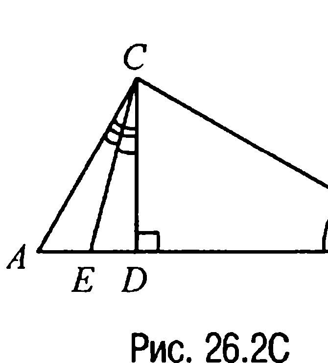

С другой стороны, поскольку $\angle EDC = 90^\circ$, то $\angle CED = 90^\circ - \frac{\beta}{2}$. Таким образом, $\angle ECB = \angle CEB$ и, следовательно, треугольник $BEC$ — равнобедренный. Отсюда и вытекает, что $CB = BE$.

**26.3С.** Обозначим $BC = a, AB = c, AC = b$. Пусть $K$ — точка катета $BC$ такая, что $EK \parallel AD$ (рис. 26.3С). Тогда так как параллельные прямые $EK$ и $AD$ пересекают стороны угла $CBE$, то

---
**стр. 512**
---

$\frac{DK}{BD} = \frac{ME}{BM}$ и, значит, $DK = \frac{5}{8} BD$ или $DK = \frac{5}{16} a$.

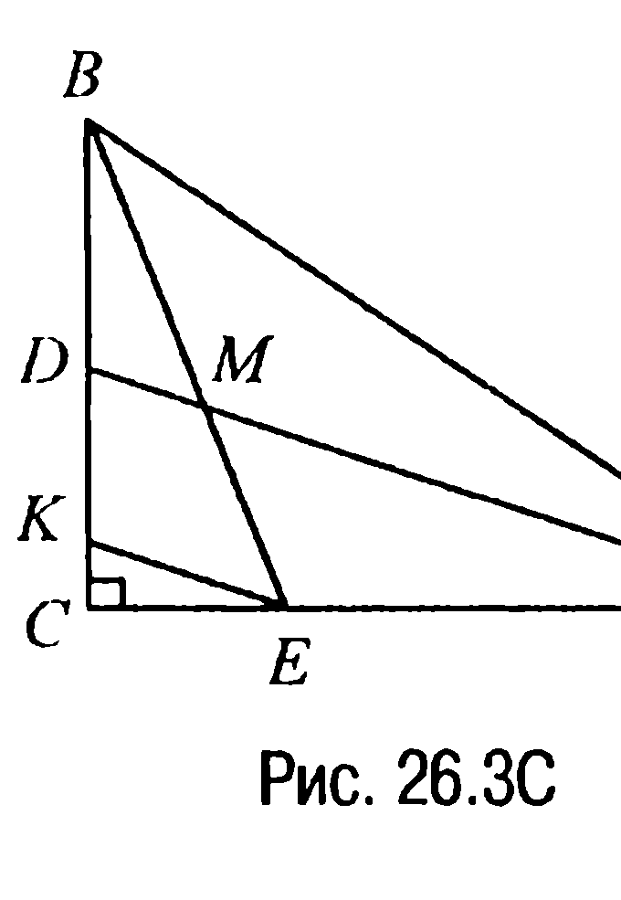

Далее, поскольку $DC = \frac{a}{2}$, то $KC = \frac{a}{2} - \frac{5}{16} a = \frac{3a}{16}$, а так как параллельные прямые $EK$ и $DA$ пересекают стороны угла $ACB$, то $\frac{CE}{EA} = \frac{CK}{DK}$ и, следовательно, $\frac{CE}{EA} = \frac{3a}{16} : \frac{5a}{16} = \frac{3}{5}$.

Замечая теперь, что $BE$ — биссектриса треугольника $ABC$, то по одному из ее свойств $\frac{CE}{EA} = \frac{BC}{AB}$, откуда находим, что $\frac{BC}{AB} = \frac{3}{5}$ или $c = \frac{5a}{3}$, а $b = \sqrt{c^2 - a^2} = \frac{4a}{3}$.

С другой стороны, поскольку $\frac{EA}{CE} = \frac{5}{3}$ и, значит, $\frac{EA + CE}{CE} = \frac{8}{3}$, то $CE = \frac{3}{8} AC = \frac{3}{8} \cdot \frac{4a}{3} = \frac{a}{2}$. Наконец, по теореме Пифагора из прямоугольного треугольника $BCE$ получаем, что $a^2 + \left(\frac{a}{2}\right)^2 = 13^2$, откуда $a = \frac{26\sqrt{5}}{5}$ и, таким образом, $b = \frac{4a}{3} = \frac{104\sqrt{5}}{15}$.

**Ответ:** $\frac{26\sqrt{5}}{5}; \frac{104\sqrt{5}}{15}$.

**26.4С.** Пусть в прямоугольном треугольнике $ABC$ с прямым углом $BCA$ катет $AC = b$, $BC = a$, $CD$ — высота, $S_{\triangle CDB} = S_1$, $S_{\triangle ADC} = S_2$ (рис. 26.4С). Тогда $S_{\triangle ABC} = S_1 + S_2$ или $\frac{1}{2} a \cdot b = S_1 + S_2$, или $a \cdot b = 2(S_1 + S_2)$.

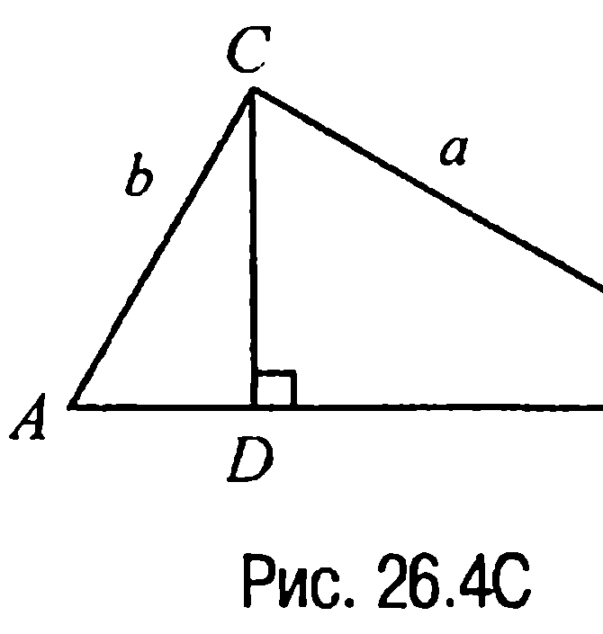

Далее, поскольку треугольники $ADC$

---
**стр. 513**
---

и $CDB$ подобны, то $\frac{S_1}{S_2} = \frac{a^2}{b^2}$. Итак имеем систему

$$\begin{cases} ab = 2(S_1 + S_2), \\ \frac{a^2}{b^2} = \frac{S_1}{S_2} \end{cases} \quad \text{или систему} \quad \begin{cases} a^2b^2 = 4(S_1 + S_2)^2, \\ \frac{a^2}{b^2} = \frac{S_1}{S_2}. \end{cases}$$

Если теперь перемножить левые и правые части уравнений системы, то получим уравнение-следствие $a^4 = \frac{4S_1(S_1 + S_2)^2}{S_2}$, откуда находим, что $a = \sqrt{2(S_1 + S_2)\sqrt{\frac{S_1}{S_2}}}$. Если же первое уравнение системы разделить на второе уравнение, то уравнение-следствие примет вид $b^4 = \frac{4S_2(S_1 + S_2)^2}{S_1}$ и, значит, $b = \sqrt{2(S_1 + S_2)\sqrt{\frac{S_2}{S_1}}}$.

**Ответ:** $\sqrt{2(S_1 + S_2)\sqrt{\frac{S_1}{S_2}}}; \sqrt{2(S_1 + S_2)\sqrt{\frac{S_2}{S_1}}}$.

**26.5C.** Пусть $O$ — центр вписанной в треугольник $ABC$ окружности, $\angle ACB = 90^\circ$, точки $M$, $N$ и $P$ — точки касания окружности со сторонами треугольника (рис. 26.5C).

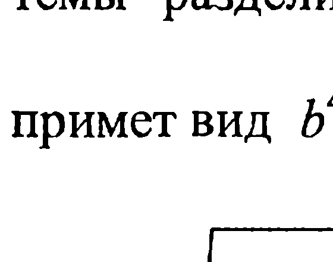

Тогда так как $\angle OAB + \angle OBA = 45^\circ$, а $\angle AOB = 180^\circ - 45^\circ = 135^\circ$, то по теореме косинусов из треугольника $AOB$ находим, что $AB^2 = OA^2 + OB^2 - 2OA \cdot OB \cdot \cos\angle AOB = 5 + 10 - 2\sqrt{5} \cdot \sqrt{10} \cdot \cos 135^\circ = 15 + 10\sqrt{2} \cdot \frac{\sqrt{2}}{2} = 25$, откуда $AB = 5$.

Таким образом, $OM = ON = OP = \frac{2}{5} S_{\triangle AOB}$. Вычисляя теперь по формуле Герона площадь $S_{\triangle AOB}$ треугольника $AOB$ со сторонами $\sqrt{5}$, $\sqrt{10}$ и 5, находим, что $S_{\triangle AOB} = \frac{5}{2}$ и, значит, $OM = ON = 1$.

---
**стр. 514**
---

Но в таком случае $AM = \sqrt{5-1} = 2$ и, следовательно, $AC = 3$, а $BN = \sqrt{10-1} = 3$, откуда $BC = 4$.

**Ответ:** 3; 4.

▼ **26.6C.** Пусть $CD$ — биссектриса треугольника $ACB$, где $C$ — вершина прямого угла, $CB = a$, $AC = b$, точка $E$ — основание высоты треугольника $CDB$ (рис. 26.6C).

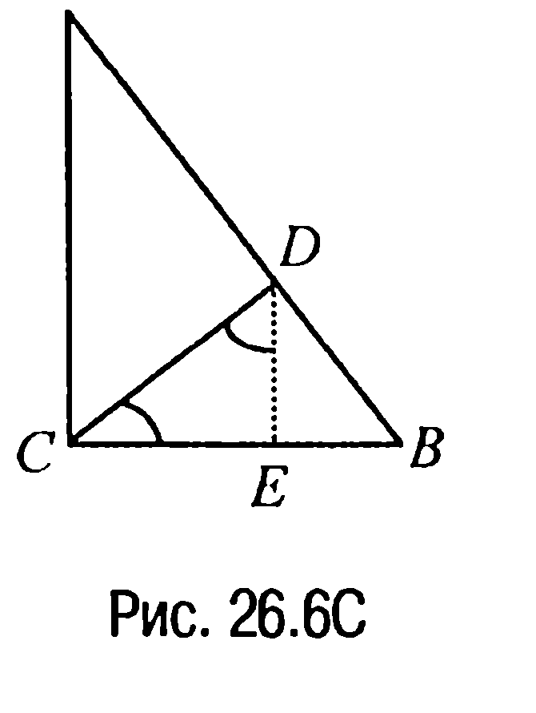

Тогда $\angle DCE = \angle CDE = 45^\circ$ и, значит, $DE = CE$. Далее, поскольку треугольники $BDE$ и $BAC$ подобны, то $\frac{DE}{AC} = \frac{BE}{BC}$ или $\frac{DE}{b} = \frac{a - DE}{a}$ и, следовательно, $DE = \frac{ab}{a + b}$. Но в таком случае из прямоугольного треугольника $CED$ находим, что $CD = \frac{ab\sqrt{2}}{a + b}$.

**Ответ:** $\frac{ab\sqrt{2}}{a + b}$.

**26.7C.** Пусть в произвольном прямоугольном треугольнике гипотенуза равна $c$, а катеты, соответственно, равны $a$ и $b$. Тогда по теореме Пифагора $a^2 + b^2 = c^2$, откуда $c^3 = c \cdot a^2 + c \cdot b^2$. Но поскольку $a < c$, $b < c$, то $c^3 > a \cdot a^2 + b \cdot b^2 = a^3 + b^3$, что и требовалось доказать.

▼ **26.8C.** Пусть $AK = x$, $BK = y$, $BN = z$, $AB = c$, $BC = a$, $AC = b$ (рис. 26.7C).

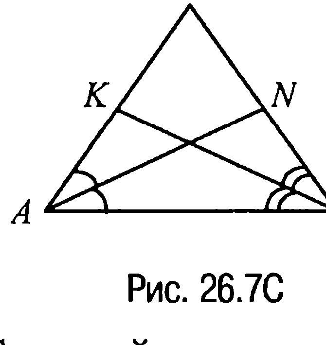

Тогда по свойству биссектрисы $\frac{x}{b} = \frac{y}{a}$, $\frac{x}{b} = \frac{z}{c}$ и, значит, $\frac{y}{a} = \frac{z}{c}$ или $\frac{y}{z} = \frac{a}{c}$. Предположим теперь, что $y < z$. В этом случае из последнего равенства следует неравенство $a < c$. С другой стороны, $a = x + z > x + y = c$ и мы приходим к противоречию. Аналогично приходим к противоречию и в предположении, что $y > z$. Таким образом, $y = z$ и, следовательно, $AB = BC$.

---
**стр. 515**
---

**26.9C.** Пусть $BD = h$ — высота, а $BK$ — медиана треугольника $ABC$, у которого $\angle ABD = \angle DBK = \angle KBC = \varphi$ (рис. 26.8C).

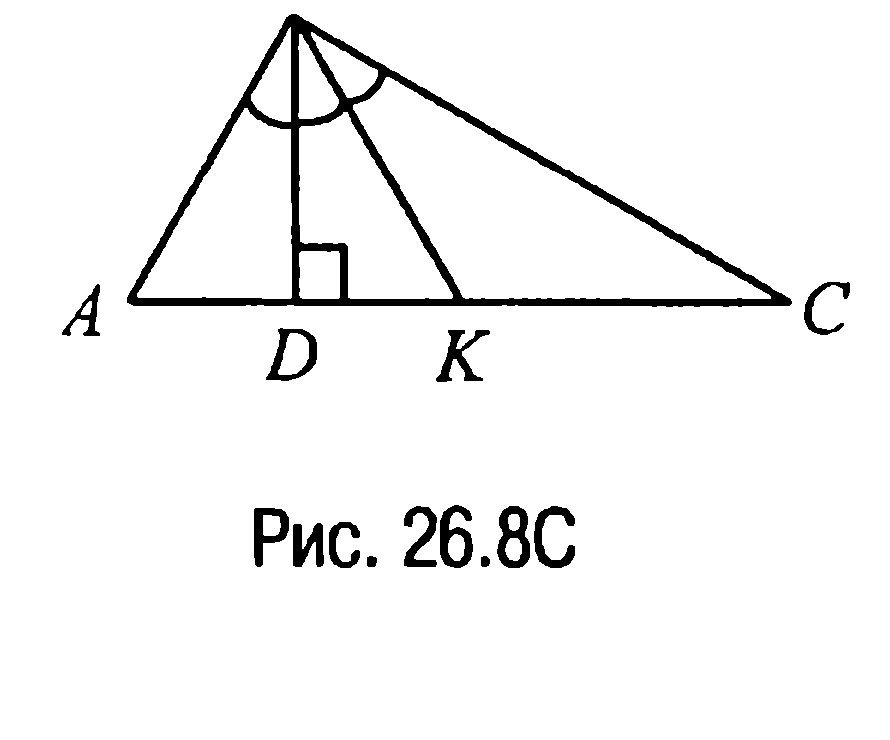

Обозначим $AD = x$. Тогда так как треугольник $ABK$ — равнобедренный, то $DK = AD = x$, $KC = 2x$. Но в таком случае $\frac{x}{h} = \operatorname{tg}\varphi$, а $\frac{3x}{h} = \operatorname{tg}2\varphi$ и, следовательно, $3\operatorname{tg}\varphi = \operatorname{tg}2\varphi$ или $3\operatorname{tg}\varphi = \frac{2\operatorname{tg}\varphi}{1 - \operatorname{tg}^2\varphi}$.

Теперь поскольку $\operatorname{tg}\varphi \neq 0$, то приходим к уравнению $3\operatorname{tg}^2\varphi = 1$, решая которое, находим, что $\varphi = \frac{\pi}{6}$ и, таким образом, $\angle CAB = \frac{\pi}{2} - \frac{\pi}{6} = \frac{\pi}{3}$, $\angle ABC = 3 \cdot \frac{\pi}{6} = \frac{\pi}{2}$, $\angle BCA = \pi - \frac{\pi}{3} - \frac{\pi}{2} = \frac{\pi}{6}$.

**Ответ:** $30^\circ$; $60^\circ$; $90^\circ$.

**26.10C.** Пусть $\angle ACB = \varphi$ (рис. 26.9C), тогда по теореме косинусов из треугольника $ABC$ находим, что

$$\cos \varphi = \frac{3^2 + 5^2 - 7^2}{2 \cdot 3 \cdot 5} = -\frac{1}{2}$$

и, значит, $\varphi = 120^\circ$.

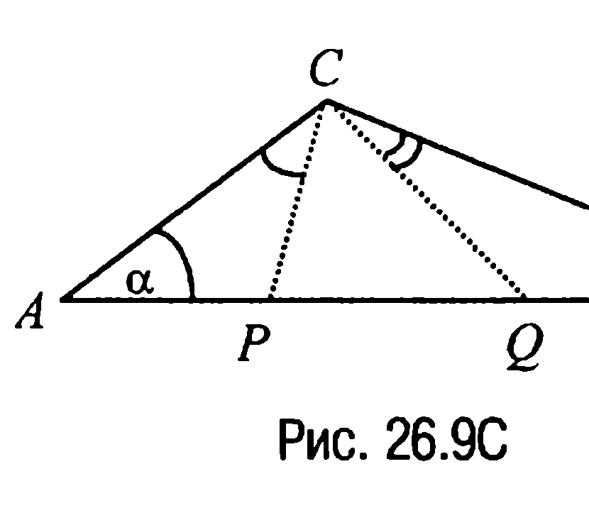

Далее, из условия задачи следует, что треугольники $APC$ и $CQB$ являются равнобедренными. Пусть $\angle CAP = \alpha$, $\angle QBC = \beta$. Тогда внешний угол $CPQ$ треугольника $APC$ равен $2\alpha$, а внешний угол $CQP$ треугольника $CQB$ равен $2\beta$.

Но в таком случае, замечая, что $\alpha + \beta + 120^\circ = 180^\circ$, а значит, $\alpha + \beta = 60^\circ$, из треугольника $PCQ$ находим, что $\angle PCQ = 180^\circ - 2\alpha - 2\beta = 180^\circ - 120^\circ = 60^\circ$.

**Ответ:** $\angle PCQ = 60^\circ$.

---
**стр. 516**
---

**26.11С.** Рассмотрим треугольник $ABC$ (рис. 26.10С).

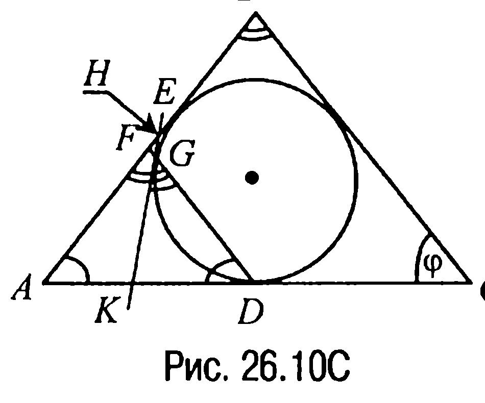

Пусть $K$ — точка пересечения прямой $HG$ с прямой $AC$. По условию $FH : HE = 2 : 3$, поэтому $FH = 2p$, $HE = HG = 3p$, где $p$ — некоторое положительное число. Теперь если $\angle BCA = \varphi$, то $\angle AFD = \angle ABC = 180^\circ - 2\varphi$, поскольку $FD \parallel BC$ как средняя линия треугольника $CAB$. Но в таком случае $\angle HFG = 180^\circ - \angle GFA = 180^\circ - 180^\circ + 2\varphi = 2\varphi$, а $\angle FGH = \varphi$, так как треугольник $DKG$ является равнобедренным. А тогда по теореме синусов из треугольника $HFG$ имеем

$$\frac{\sin \varphi}{FH} = \frac{\sin 2\varphi}{HG} = \frac{\sin 2\varphi}{HE} = \frac{2 \sin \varphi \cos \varphi}{HE}$$

Отсюда $\frac{HE}{FH} = \frac{3p}{2p} = 2 \cos \varphi$ или $\cos \varphi = \frac{3}{4}$ и, значит, $\varphi = \arccos \frac{3}{4}$.

**Ответ:** $\angle BCA = \arccos \frac{3}{4}$.

**26.12С.** Замечая, что $AE$ и $BD$ — высоты треугольника $ACB$ (рис. 26.11С), приходим к выводу, что треугольники $DCE$ и $ACB$ подобны.

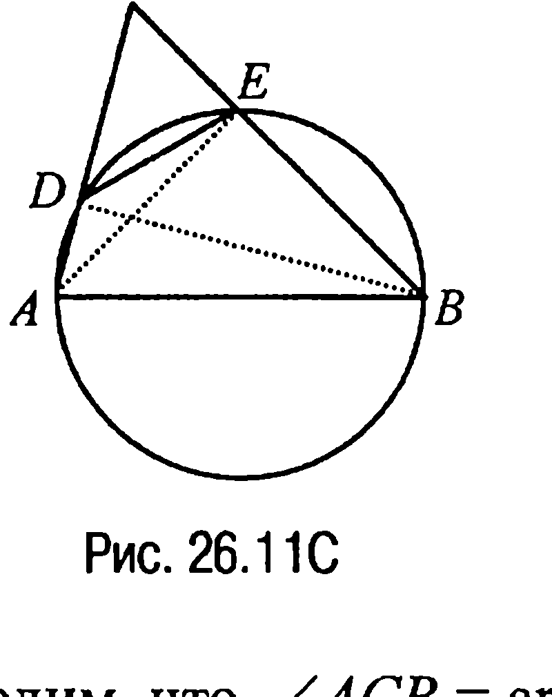

Но поскольку $\frac{DE}{AB} = \cos \angle ACB$, то

$$\cos^2 \angle ACB = \left(\frac{DE}{AB}\right)^2 = \frac{S_{\triangle DCE}}{S_{\triangle ACB}} = \frac{1}{9}$$

и, следовательно, $\cos \angle ACB = \frac{1}{3}$, откуда находим, что $\angle ACB = \arccos \frac{1}{3}$.

**Ответ:** $\angle ACB = \arccos \frac{1}{3}$.

---
**стр. 517**
---

**§ 26. Задачи группы С**

**26.13С.** Продолжим медиану $BM$ за точку $M$ и отметим на продолжении точку $D$ такую, что $MD = BM$ (рис. 26.12С). Тогда четырехугольник $ABCD$ — параллелограмм и, значит, искомые углы — это углы при вершинах $B$ и $D$ треугольника $ABD$, который, как легко проверить, является прямоугольным ($BD^2 = AB^2 + AD^2$).

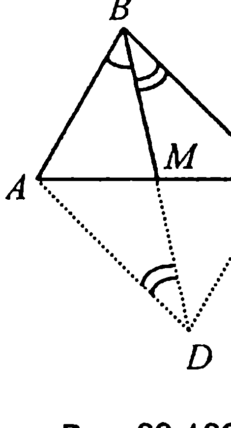

Отсюда $\cos \angle ABD = \frac{AB}{BD} = \frac{6}{10} = 0,6$, а $\cos \angle BDA = \frac{AD}{BD} = \frac{8}{10} = 0,8$ и, таким образом, $\angle ABD = \arccos 0,6$; $\angle DBC = \angle BDA = \arccos 0,8$.

**Ответ:** $\arccos 0,6$; $\arccos 0,8$.

**26.14С.** Предположим для определенности, что в прямоугольном треугольнике $ABC$ с гипотенузой $AB$ угол $CAB$ меньше угла $ABC$. Далее, пусть $R$ — радиус описанной около треугольника окружности, а $r$ — радиус окружности, вписанной в треугольник, $D$ — точка касания гипотенузы с вписанной окружностью, $O$ — центр этой окружности (рис. 26.13С). Тогда по свойству 1.22 гипотенуза $AB = 2R$. С другой стороны, так как лучи $AO$ и $BO$ — биссектрисы углов $CAB$ и $ABC$ соответственно, то

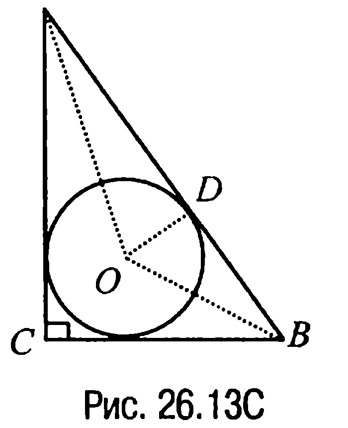

$AB = AD + DB = r \cdot \left(\operatorname{ctg} \frac{\angle CAB}{2} + \operatorname{ctg} \frac{\angle ABC}{2}\right)$. Таким образом,

$$2R = r\left(\operatorname{ctg} \frac{\angle CAB}{2} + \operatorname{ctg} \frac{\angle ABC}{2}\right), \text{ откуда } \operatorname{ctg} \frac{\angle CAB}{2} + \operatorname{ctg} \frac{\angle ABC}{2} = \frac{2R}{r} = 2 \cdot \frac{5}{2} = 5. \text{ Теперь поскольку } \angle CAB + \angle ABC = 90^\circ, \text{ то }$$

$$\frac{\angle CAB}{2} + \frac{\angle ABC}{2} = 45^\circ \text{ и } \operatorname{ctg}\left(\frac{\angle CAB}{2} + \frac{\angle ABC}{2}\right) = \frac{\operatorname{ctg} \frac{\angle CAB}{2} \cdot \operatorname{ctg} \frac{\angle ABC}{2} - 1}{\operatorname{ctg} \frac{\angle CAB}{2} + \operatorname{ctg} \frac{\angle ABC}{2}} = 1, \text{ откуда } \operatorname{ctg} \frac{\angle CAB}{2} \cdot \operatorname{ctg} \frac{\angle ABC}{2} = 6. \text{ Итак,}$$

---
**стр. 518**
---

задача свелась к решению системы

$$\begin{cases} \operatorname{ctg} \frac{\angle CAB}{2} + \operatorname{ctg} \frac{\angle ABC}{2} = 5, \\ \operatorname{ctg} \frac{\angle CAB}{2} \cdot \operatorname{ctg} \frac{\angle ABC}{2} = 6. \end{cases}$$

Решая ее, находим, что $\operatorname{ctg} \frac{\angle CAB}{2} = 3$, $\operatorname{ctg} \frac{\angle ABC}{2} = 2$ и, значит, $\angle CAB = 2\operatorname{arcctg} 3$, $\angle ABC = 2\operatorname{arcctg} 2$.

**Ответ:** $2\operatorname{arcctg} 3$; $2\operatorname{arcctg} 2$.

**26.15С.** Пусть $a, b, c$ ($a < b < c$) — стороны прямоугольного треугольника, $\phi$ — угол между катетом $a$ и гипотенузой (рис. 26.14С).

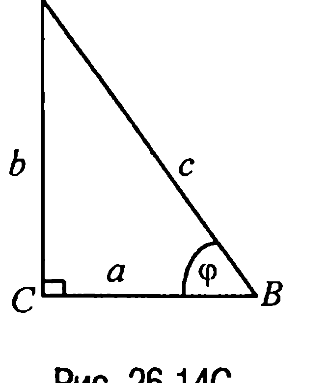

Тогда поскольку стороны треугольника составляют арифметическую прогрессию, то $c - b = b - a$ или $c - c\sin\phi = c\sin\phi - c\cos\phi$, или $1 + \cos\phi = 2\sin\phi$, или $2\cos^2\frac{\phi}{2} = 4\sin\frac{\phi}{2} \cdot \cos\frac{\phi}{2}$, откуда $\operatorname{tg}\frac{\phi}{2} = \frac{1}{2}$ и, значит, $\phi = 2\operatorname{arctg}\frac{1}{2}$. Второй острый угол равен $\frac{\pi}{2} - 2\operatorname{arctg}\frac{1}{2}$.

**Ответ:** $2\operatorname{arctg}\frac{1}{2}$; $\frac{\pi}{2} - 2\operatorname{arctg}\frac{1}{2}$.

**26.16С.** В соответствии с условием задачи (рис. 26.15С)

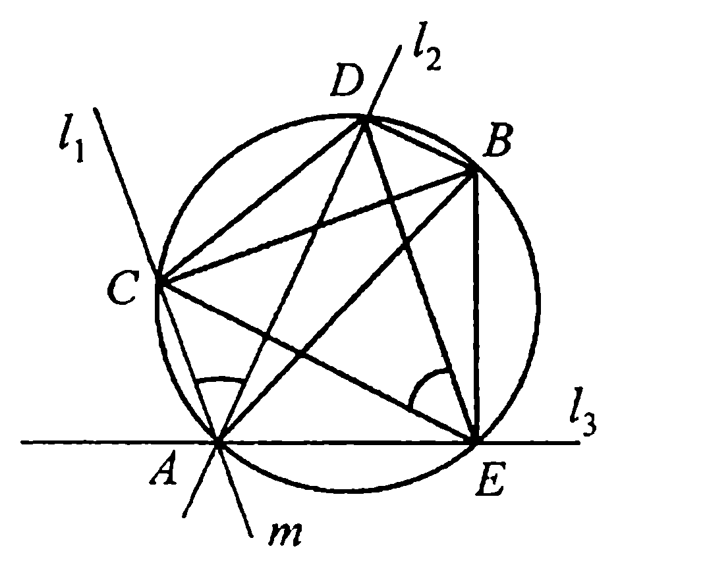

$\angle l_2 Al_1 = 45^\circ$, $\angle l_3 Al_2 = 65^\circ$, $\angle mAl_3 = 70^\circ$, а $BC \perp l_1$, $BD \perp l_2$, $BE \perp l_3$. При этом точки $A, C, D, B, E$ лежат (как это легко видеть) на одной окружности с диаметром $AB$. А тогда $\angle DEC = \angle l_2 Al_1 = 45^\circ$, $\angle ECD = \angle l_3 Al_2 = 65^\circ$ (как углы,

---
**стр. 519**
---

опирающиеся на одни и те же дуги) и, таким образом,

$$\angle CDE = 180^\circ - \angle DEC - \angle ECD = 180^\circ - 45^\circ - 65^\circ = 70^\circ.$$

**Ответ:** $45^\circ$; $65^\circ$; $70^\circ$.

**26.17С.** Пусть $BL$, $AM$, $CK$ — биссектрисы треугольника $ABC$, а

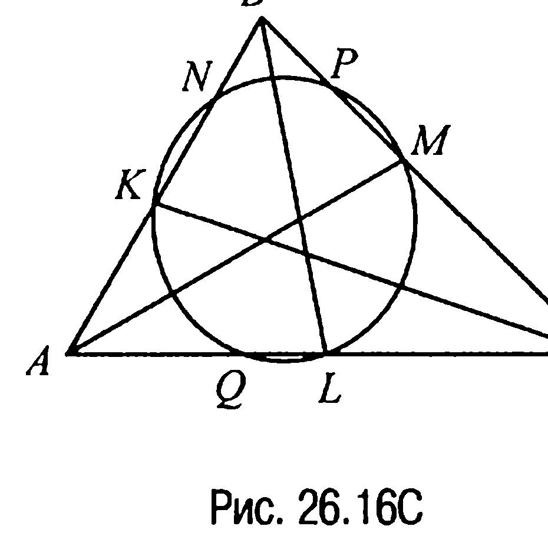

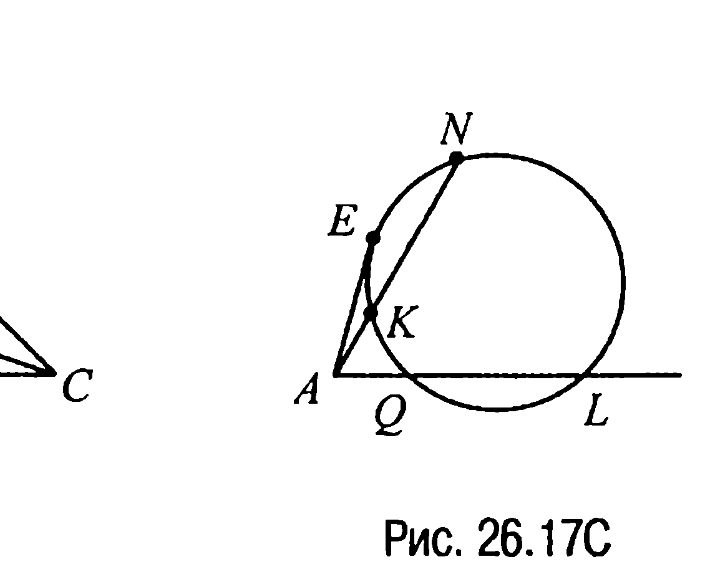

$KN$, $PM$, $LQ$ — хорды, образованные при пересечении сторон этого треугольника с окружностью, проходящей через точки $K$, $L$, $M$ (рис. 26.16С). Обозначим $BC = a$, $AC = b$, $AB = c$ и будем считать для определенности, что $c \le a \le b$.

Тогда $AL + LC = b$, а по свойству 8.7X имеет место равенство $\frac{AL}{c} = \frac{LC}{a}$. Из последних двух равенств находим, что

$$AL = \frac{bc}{a+c}, \quad LC = \frac{ab}{a+c}.$$

Рассуждая аналогично, имеем:

$$AK = \frac{bc}{a+b}, \quad KB = \frac{ac}{a+b}, \quad BM = \frac{ac}{b+c}, \quad MC = \frac{ab}{b+c}.$$

Рассматривая теперь прямые $AB$ и $AC$ как секущие для данной окружности, по свойству 5.5 имеем

$$AK \cdot AN = AQ \cdot AL = AE^2,$$

где $AE$ — отрезок касательной к проведенной окружности (рис. 26.17С).

Аналогично находим, что

$$BN \cdot BK = BP \cdot BM, \quad CL \cdot CQ = CM \cdot CP.$$

А тогда, обозначая $KN = x$, $LQ = y$, $PM = z$, приходим к линейной неоднородной относительно $x$, $y$, $z$ системе уравнений

---
**стр. 520**
---

$$
\begin{cases}
\frac{bc}{a+b}\left(\frac{bc}{a+b} + x\right) = \left(\frac{bc}{a+c} - y\right)\frac{bc}{a+c}, \\
\left(\frac{ac}{a+b} - x\right)\frac{ac}{a+b} = \left(\frac{ac}{b+c} - z\right)\frac{ac}{b+c}, \\
\frac{ab}{a+c}\left(\frac{ab}{a+c} + y\right) = \frac{ab}{b+c}\left(\frac{ab}{b+c} + z\right),
\end{cases}
$$

решая которую, получаем, что

$$x = \frac{1}{2(a+b)(a+c)^2(b+c)^2}(a \cdot c \cdot (a+c)^2 \cdot (c-a) \cdot (a+2b+c) +$$
$$+ a \cdot b \cdot (a+b)^2 \cdot (b-a) \cdot (a+b+2c) +$$
$$+ b \cdot c \cdot (b+c)^2 \cdot (b-c) \cdot (2a+b+c)),$$

$$y = \frac{1}{2(a+b)^2(a+c)(b+c)^2}(a \cdot c \cdot (a+c)^2 \cdot (a-c) \cdot (a+2b+c) +$$
$$+ a \cdot b \cdot (a+b)^2 \cdot (a-b) \cdot (a+b+2c) +$$
$$+ b \cdot c \cdot (b+c)^2 \cdot (b-c) \cdot (2a+b+c)),$$

$$z = \frac{1}{2(a+b)^2(a+c)^2(b+c)}(a \cdot c \cdot (a+c)^2 \cdot (a-c) \cdot (a+2b+c) +$$
$$+ a \cdot b \cdot (a+b)^2 \cdot (b-a) \cdot (a+b+2c) +$$
$$+ b \cdot c \cdot (b+c)^2 \cdot (b-c) \cdot (2a+b+c)).$$

Непосредственная проверка показывает, что $x > 0$, $z > 0$ и $z = x + y$. В случае, когда точка $Q$ лежит на отрезке $LC$, получаем, что $y < 0$, но тогда $LQ = |y|$ и $x = z + |y|$.

**26.18С.** Пусть $\angle ABC = \beta$ (рис. 26.18С). Из условия задачи следует, что треугольники $ABC$ и $QBP$ подобны, причем $\frac{QP}{AC} = \cos \beta$.

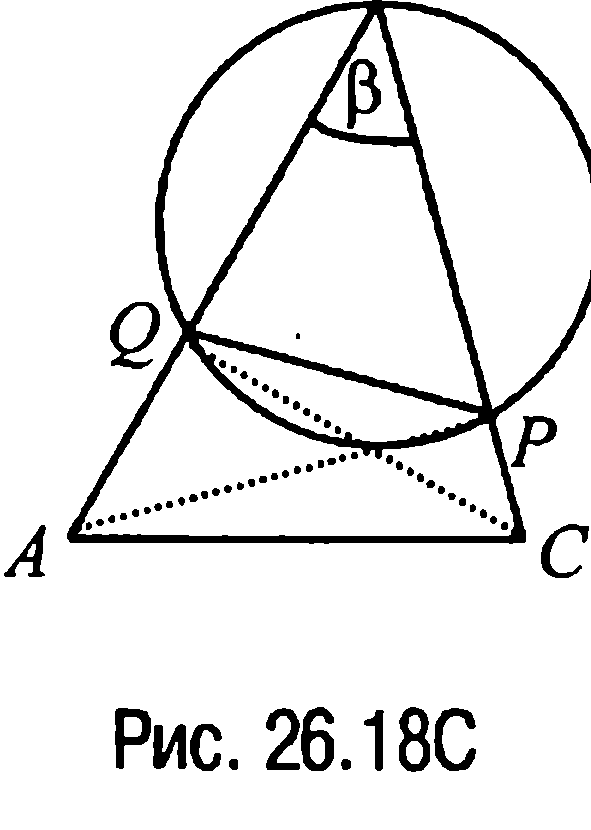

А тогда если $P_{\triangle ABC}$ и $P_{\triangle QBP}$ — периметры треугольников $ABC$ и $QBP$ соответственно, то $\frac{P_{\triangle QBP}}{P_{\triangle ABC}} = \frac{9}{15} = \frac{3}{5} = \cos \beta$. Но в таком случае

---
**стр. 521**
---

$$\sin \beta = \sqrt{1 - \cos^2 \beta} = \sqrt{1 - \frac{9}{25}} = \frac{4}{5}.$$

А поскольку $\frac{QP}{\sin \beta} = 2R$, где $R$ — радиус описанной около треугольника $QBP$ окружности, то $QP = 2 \cdot \frac{9}{5} \cdot \frac{4}{5} = \frac{72}{25}$ и, значит, $AC = \frac{QP}{\cos \beta} = \frac{72/25}{3/5} = \frac{24}{5}$.

**Ответ:** $AC = \frac{24}{5}$.

**26.19С.** Пусть $O$ — центр описанной около треугольника $ABP$ окружности (рис. 26.19С), $R$ — ее радиус,

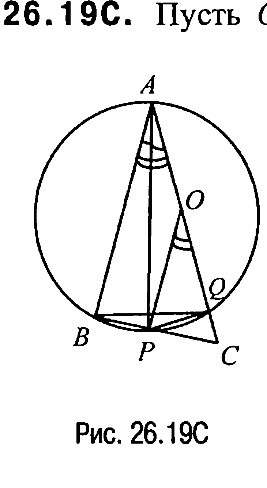

$Q$ — точка пересечения окружности с отрезком $OC$, $\angle BAP = \varphi$, $QC = x$. Тогда так как центральный угол $POQ$ и вписанный угол $PAQ$ опираются на одну и ту же дугу окружности, то $\angle POQ = 2\angle PAQ = 2\varphi$ и, значит, $OP \parallel AB$. Но в таком случае по обобщенной теореме Фалеса $\frac{BP}{PC} = \frac{AO}{OC} = \frac{R}{R+x} = \frac{4}{5}$, откуда находим, что $R = 4x$.

Далее, из свойства касательной и секущей имеем $CP \cdot CB = CQ \cdot CA$ или $CP \cdot (CP + PB) = x \cdot (x + 2R)$, или $20(20 + 16) = x^2 + 8x^2$, или $x^2 = 80$, т. е. $x = 4\sqrt{5}$.

По расширенной же теореме синусов из треугольника $ABP$ следует, что $\frac{BP}{\sin \angle BAP} = 2R$ или $\frac{16}{\sin \varphi} = 32\sqrt{5}$, или $\sin \varphi = \frac{\sqrt{5}}{10}$.

А поскольку $\cos \varphi = \sqrt{1 - \sin^2 \varphi} = \sqrt{1 - \frac{5}{100}} = \frac{\sqrt{95}}{10}$, то, рассматривая прямоугольный треугольник $ABQ$, находим, что

$$AB = AQ \cdot \cos \angle BAQ = 2R \cdot \cos 2\varphi = 32\sqrt{5}(\cos^2 \varphi - \sin^2 \varphi) =$$
$$= 32\sqrt{5}\left(\frac{95}{100} - \frac{5}{100}\right) = \frac{144\sqrt{5}}{5}.$$

**Ответ:** $AB = \frac{144\sqrt{5}}{5}$.

---
**стр. 522**
---

26.20C. Пусть $\angle BAC = \alpha$, $\angle ABC = \beta$ (рис. 26.20C). Тогда по

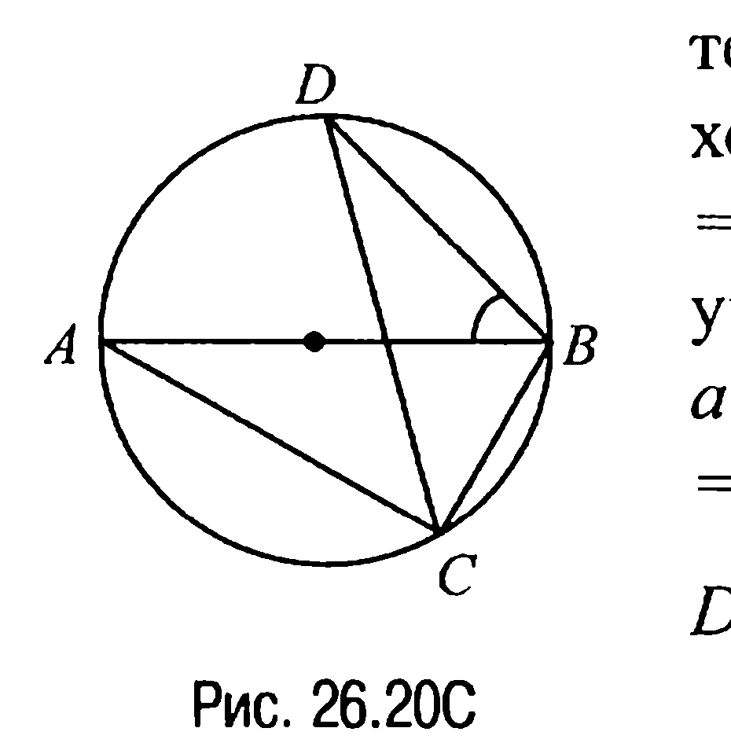

теореме синусов из треугольника $CBD$ находим, что $DC = AB \cdot \sin(\varphi + \beta) = AB \cdot (\sin\varphi \cdot \cos\beta + \cos\varphi \cdot \sin\beta)$. Из прямоугольного же треугольника $ACB$ имеем: $a = AB \cdot \sin\alpha$, $b = AB \cdot \sin\beta$ и, значит, $\sin\beta = b/AB$, $\cos\beta = \sin\alpha = a/AB$. Таким образом, $DC = AB \left( \frac{a \sin\varphi}{AB} + \frac{b \cos\varphi}{AB} \right) = a \cdot \sin\varphi + b \cdot \cos\varphi$.

**Ответ:** $CD = a \cdot \sin\varphi + b \cdot \cos\varphi$.

26.21C. Пусть $O_1$ и $O_2$ — центры первой и второй окружностей

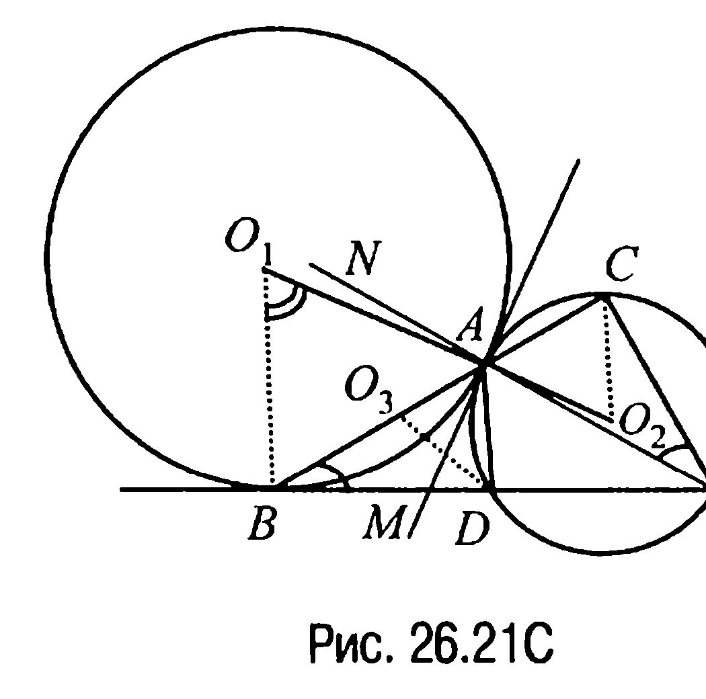

соответственно, а $\angle AO_1B = \varphi$ (рис. 26.21C). Тогда $\angle ABD = \frac{1}{2} \cup AB = \varphi / 2$, $\angle O_1AB = \angle CAO_2 = 90^\circ - \varphi / 2$ и, значит, $\angle CO_2A = \varphi = \cup AC$, а $\angle CEA = \varphi / 2$. Отсюда следует, что треугольники $BCE$ и $ECA$ подобны (у них общий угол с вершиной $C$ и $\angle CBE = \angle CEA = \varphi / 2$) и, таким образом, $\frac{CE}{CB} = \frac{CA}{CE}$ или $CE^2 = CB \cdot CA = 9 \cdot 4 = 36$, откуда $CE = 6$.

Далее, пусть $AM$ — общая касательная окружностей с центрами $O_1$ и $O_2$. Тогда $\angle BAD = \angle BAM + \angle MAD = \frac{1}{2} \cup AB + \frac{1}{2} \cup AD = \frac{\varphi}{2} + \frac{1}{2} \cup AD$, а $\angle CBE = \frac{1}{2} \cup CE - \frac{1}{2} \cup AD$ или $\frac{\varphi}{2} = \frac{1}{2} \cup CE - \frac{1}{2} \cup AD$.

Отсюда находим, что $\angle BAD = \frac{1}{2} \cup CE - \frac{1}{2} \cup AD + \frac{1}{2} \cup AD = \frac{1}{2} \cup CE = \angle CAE = \angle NAB$.

Последнее означает, что $AB$ — биссектриса угла $NAD$.

---
**стр. 523**
---

Но в таком случае центр $O_3$ окружности, касающейся отрезка $AD$ и продолжений отрезков $ED$ и $EA$ за точки $D$ и $A$ соответственно, — это точка пересечения отрезка $AB$ и биссектрисы угла $ADB$.

По свойству биссектрисы $\frac{BO_3}{O_3A} = \frac{BD}{AD}$, из подобия же треугольников $BAD$ и $BEC$ вытекает, что $\frac{BD}{AD} = \frac{BC}{CE} = \frac{9}{6} = \frac{3}{2}$, а значит, и $\frac{BO_3}{O_3A} = \frac{3}{2}$. Отсюда $BO_3 + O_3A = 5$ и, таким образом, $O_3A = 2$.

**Ответ:** $CE = 6; 2$.

**26.22C.** Пусть $O$ и $Q$ — центры первой и второй окружностей

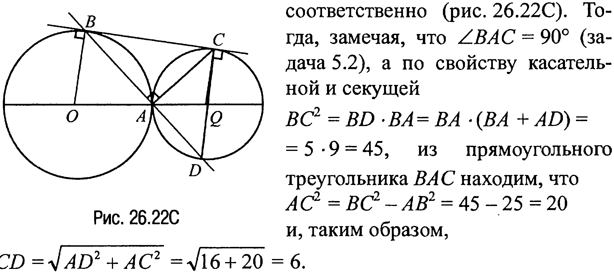

соответственно (рис. 26.22C). Тогда, замечая, что $\angle BAC = 90^\circ$ (задача 5.2), а по свойству касательной и секущей $BC^2 = BD \cdot BA = BA \cdot (BA + AD) = 5 \cdot 9 = 45$, из прямоугольного треугольника $BAC$ находим, что $AC^2 = BC^2 - AB^2 = 45 - 25 = 20$ и, таким образом, $CD = \sqrt{AD^2 + AC^2} = \sqrt{16 + 20} = 6$.

**Ответ:** 6.

**26.23C.** Так как треугольники $ABC$ и $NBM$ (рис. 26.23C) подобны с коэффициентом подобия $\cos\beta$, то $\frac{MN}{AC} = \cos\beta$, откуда $MN = AC \cdot \cos\beta$.

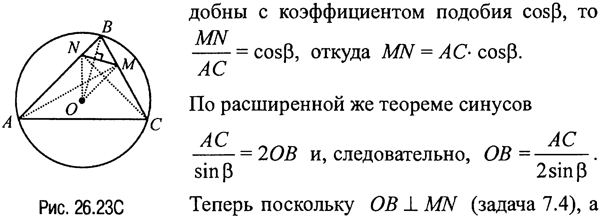

По расширенной же теореме синусов $\frac{AC}{\sin\beta} = 2OB$ и, следовательно, $OB = \frac{AC}{2\sin\beta}$. Теперь поскольку $OB \perp MN$ (задача 7.4), а значит,

---
**стр. 524**
---

$S = \frac{1}{2} OB \cdot MN = \frac{1}{2} \frac{AC}{2 \sin \beta} \cdot AC \cdot \cos \beta = \frac{AC^2}{4 \tg \beta}$, то $AC = 2\sqrt{S \cdot \tg \beta}$.

**Ответ:** $AC = 2\sqrt{S \cdot \tg \beta}$.

▼ 26.24C. Прямая $OC$ является серединным перпендикуляром для хорды $AB$ и поэтому делит дугу $AB$ пополам (рис. 26.24C). Пусть $Q$ и $N$ — точки пересечения отрезка $OC$ и окружностью и хордой $AB$ соответственно.<!-- вероятная опечатка оригинала: окружности --> Опустим перпендикуляры $QP$ и $QH$ на прямые $CB$ и $CA$ соответственно. Тогда поскольку $\angle NBQ = \angle QBP$, то $\Delta BNQ = \Delta BPQ$ и, значит, $QN = QP$. Аналогично показывается, что $QN = QH$. Но в таком случае точка $Q$ — центр окружности, вписанной в треугольник $ACB$ и, следовательно, искомое расстояние равно $R$.

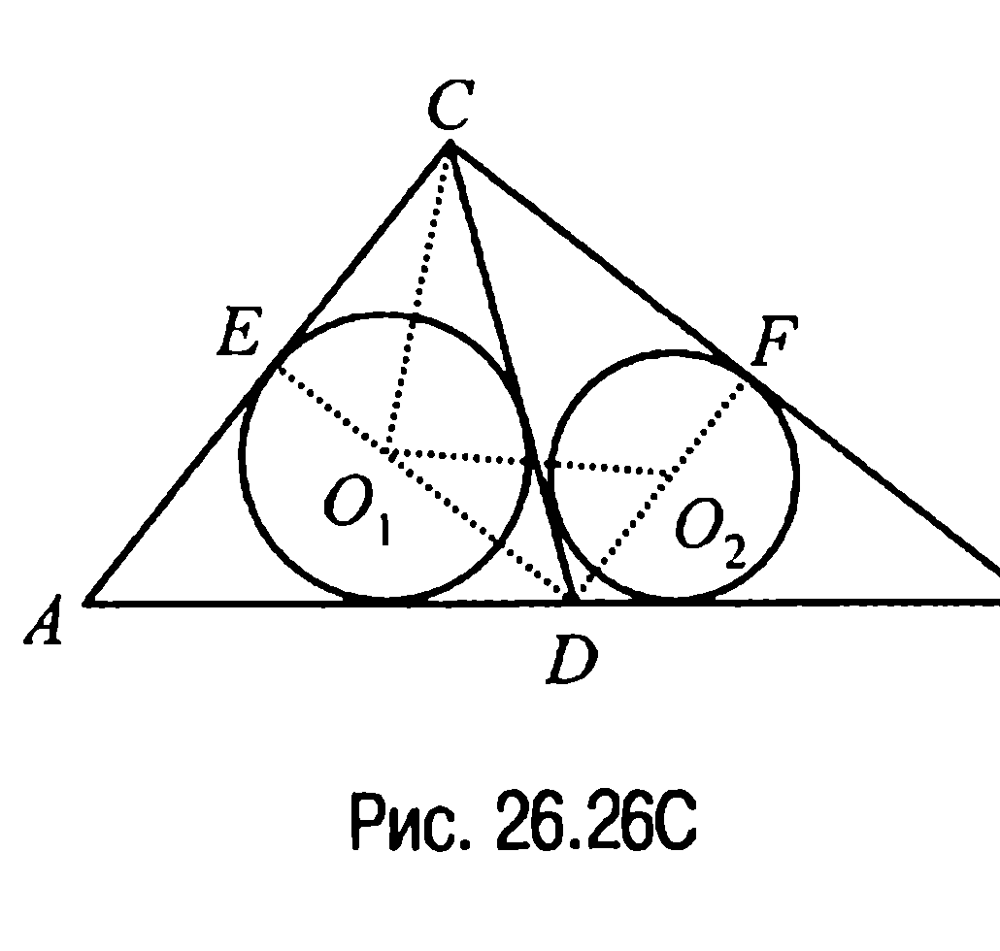

**Ответ:** $R$.

26.25C. По известным свойствам углов $\angle CAB = \angle ECB$, $\angle ACD = \angle ABC$ (рис. 26.25C). Рассматривая же прямоугольные треугольники $CFB$ и $AFC$, замечаем, что $\angle BCF = \angle BCE$, а $\angle ACF = \angle ACD$, откуда следует равенство треугольников $CFB$ и $BEC$, означающее, в частности, что $FB = BE = b$. Равными оказываются и треугольники $AFC$ и $ADC$. Но тогда $AF = AD = a$, а значит, в треугольнике $ACB$ высота $CF = \sqrt{AF \cdot FB} = \sqrt{ab}$.

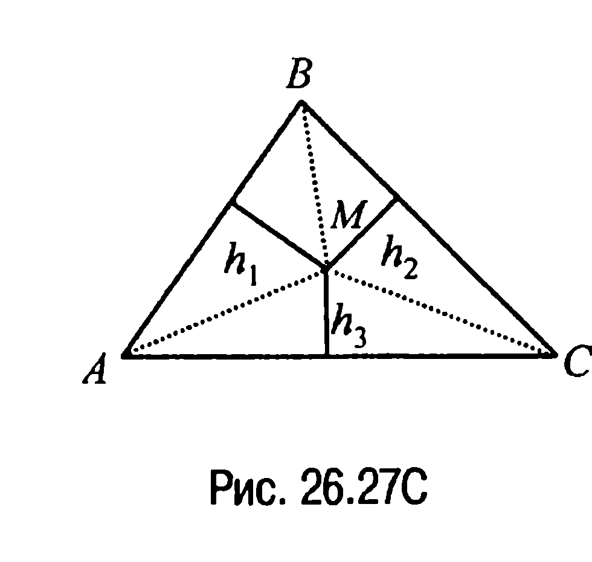

**Ответ:** $CF = \sqrt{ab}$.

26.26C. Точка $D$ — центр описанной около треугольника $ABC$ окружности, поэтому $AD = CD = BD$. Следовательно, треугольники $ACD$ и $BCD$ — равнобедренные (рис. 26.26C). Центры $O_1$ и $O_2$ окружностей, вписанных в треугольники $ACD$ и $BCD$ соот-

---
**стр. 525**
---

ветственно, лежат на биссектрисах углов $ADC$ и $BDC$, а так как в равнобедренных треугольниках биссектрисы являются также и высотами (свойство 1.18X), то $ECFD$ — прямоугольник, а $O_1DO_2$ — прямоугольный треугольник.

Предположим теперь для определенности, что $AC = 3$, $BC = 4$. Тогда по теореме Пифагора находим, что $AB = 5$, а значит, $CD = 2,5$. Далее, поскольку $ED \parallel BC$, $DF \parallel AC$, а $D$ — середина $AB$, то $CE = \frac{1}{2} AC = 1,5$; $DE = \frac{1}{2} CB = 2$.<!-- вероятная опечатка оригинала: $DE$ вместо $DF$ -->

По свойству же биссектрисы $\frac{EO_1}{O_1D} = \frac{CE}{CD} = \frac{1,5}{2,5}$ и, таким образом, $O_1D = \frac{5}{4}$. Аналогично находим, что $O_2D = \frac{5}{6}$. Но в таком случае $O_1O_2 = \sqrt{O_1D^2 + O_2D^2} = \sqrt{\frac{25}{16} + \frac{25}{36}} = \frac{5\sqrt{13}}{12}$.

**Ответ:** $\frac{5\sqrt{13}}{12}$.

**26.27С.** Пусть в треугольнике $ABC$ (рис. 26.27С) $M$ — точка пересечения медиан, $AB = 5$, $BC = 6$, $AC = 7$; $h_1$, $h_2$ и $h_3$ — перпендикуляры, опущенные из точки $M$ на стороны $AB$, $BC$ и $AC$ соответственно (эти перпендикуляры и определяют искомые расстояния). Тогда если $S$ — площадь треугольника $ABC$, то

$S_{\triangle AMB} = S_{\triangle BMC} = S_{\triangle AMC} = \frac{1}{3} S =$

$= \frac{1}{3} \cdot \sqrt{p(p-a)(p-b)(p-c)} = \frac{1}{3} \cdot \sqrt{9(9-5)(9-6)(9-7)} = 2\sqrt{6}$ (задача 6.1 и формула Герона).

---
**стр. 526**
---

Но, с другой стороны,

$S_{\triangle AMB} = \frac{1}{2} AB \cdot h_1 = \frac{5}{2} h_1 = 2\sqrt{6}$ и поэтому $h_1 = \frac{4\sqrt{6}}{5};$

$S_{\triangle BMC} = \frac{1}{2} BC \cdot h_2 = 3h_2 = 2\sqrt{6}$ и поэтому $h_2 = \frac{2\sqrt{6}}{3};$

$S_{\triangle AMC} = \frac{1}{2} AC \cdot h_3 = \frac{7}{2} h_3 = 2\sqrt{6}$ и поэтому $h_3 = \frac{4\sqrt{6}}{7}.$

**Ответ:** $\frac{4\sqrt{6}}{5}; \frac{2\sqrt{6}}{3}; \frac{4\sqrt{6}}{7}.$

**26.28С.** Пусть в треугольнике $ABC$ сторона $AB = 5, BC = 6, AC = 7, AD$ — медиана, проведенная к стороне $BC, E$ — точка пересечения продолжения медианы $AD$ с описанной около треугольника $ABC$ окружностью (рис. 26.28С).

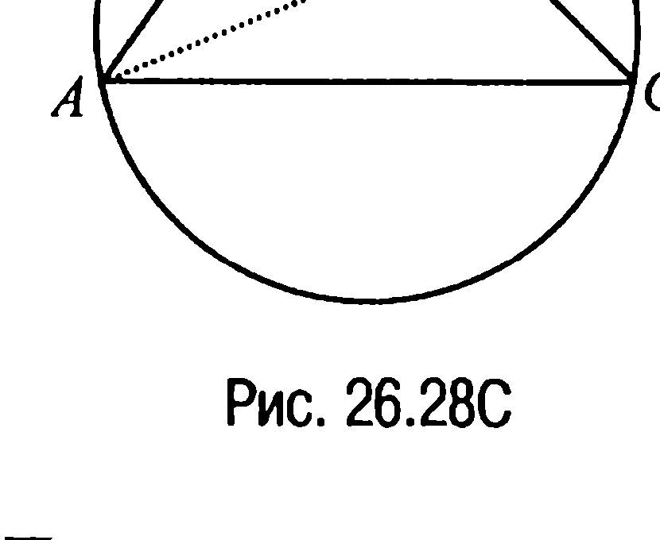

Тогда поскольку $AD^2 = \frac{1}{4}(2AB^2 + 2AC^2 - BC^2) = 28$ (задача 12.1), то с учетом значений $AB, AC$ и $BC$ находим, что $AD = 2\sqrt{7}$.

По теореме же о пересекающихся хордах имеем $AD \cdot DE = BD \cdot DC$ или $2\sqrt{7} \cdot DE = 3 \cdot 3$, откуда $DE = \frac{9\sqrt{7}}{14}$. Таким образом, $AE = AD + DE = 2\sqrt{7} + \frac{9\sqrt{7}}{14} = \frac{37\sqrt{7}}{14}$.

**Ответ:** $\frac{37\sqrt{7}}{14}.$

**26.29С.** Пусть $K$ — точка касания окружностей, имеющих радиусы $r$ и $\rho, L$ и $N$ — основания перпендикуляров, опущенных из центра $O_3$ третьей окружности соответственно на отрезок $O_1O_2$ и общую касательную к окружностям радиусов $r$ и $\rho$ (рис. 26.29С). Пусть, далее, $KL = x$. В таком случае $O_3N = x$ и из треугольника

---
**стр. 527**
---

$NBO_3$ находим, что $BN = NA = \sqrt{R^2 - x^2}$.

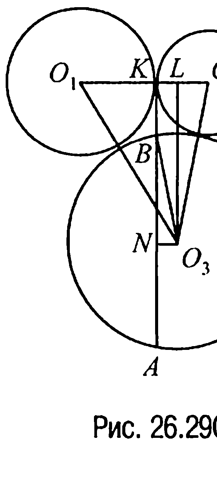

А тогда $AB = 2 \sqrt{R^2 - x^2}$. Замечая теперь, что $O_3O_1^2 - O_1L^2 = O_3O_2^2 - LO_2^2$ или $(r + R)^2 - (r + x)^2 = (R + \rho)^2 - (\rho - x)^2$, находим $x = \frac{r - \rho}{r + \rho} \cdot R$. Таким образом, $AB = 2 \sqrt{R^2 - x^2} = \frac{4\sqrt{r\rho}}{r + \rho} \cdot R$.

**Ответ:** $\frac{4\sqrt{r\rho}}{r + \rho} \cdot R$.

**26.30С.** Пусть $O_1$ и $O_2$ — центры окружностей радиусов $R_1$ и $R_2$ соответственно, $D$ — точка пересечения хорды $AB$ с окружностью радиуса $R_2$ и пусть точки $M$ и $N$ — основания перпендикуляров, опущенных на $AB$ из точек $O_2$ и $O_1$ соответственно (рис. 26.30С).

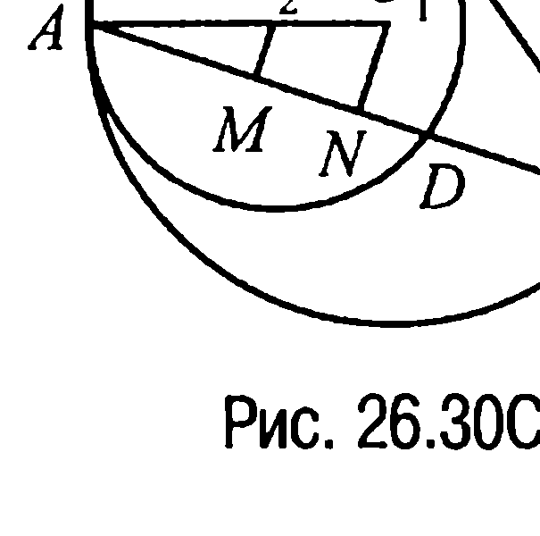

Тогда так как радиус окружности, перпендикулярный хорде, делит хорду пополам, то $AN = \frac{1}{2}AB$, а $AM = \frac{1}{2}AD$.

Далее, поскольку треугольники $AO_2M$ и $AO_1N$ подобны, то $\frac{AN}{AM} = \frac{AO_1}{AO_2}$ или $\frac{AB}{AD} = \frac{R_1}{R_2}$. По теореме же о касательной и секущей $BC^2 = AB \cdot DB = AB \cdot (AB - AD) = AB^2 \cdot \left(1 - \frac{AD}{AB}\right)$ или $a^2 = AB^2 \left(1 - \frac{R_2}{R_1}\right)$, откуда находим, что $AB = a \sqrt{\frac{R_1}{R_1 - R_2}}$.

**Ответ:** $AB = a \sqrt{\frac{R_1}{R_1 - R_2}}$.

**26.31С.** Обозначим через $F$ точку пересечения прямых $AB$ и $ED$ (рис. 26.31С). Так как $\angle EDO = \angle OCE = 90^\circ$, $\angle ABO = \angle ACO = 90^\circ$ и $\angle ODF = \angle OBF$, то четырехугольники $EDOC, ABOC$ и

---
**стр. 528**
---

$ODBF$ — вписанные (на рис. 26.31С соответствующие окружности, чтобы не загромождать чертеж, не изображены).

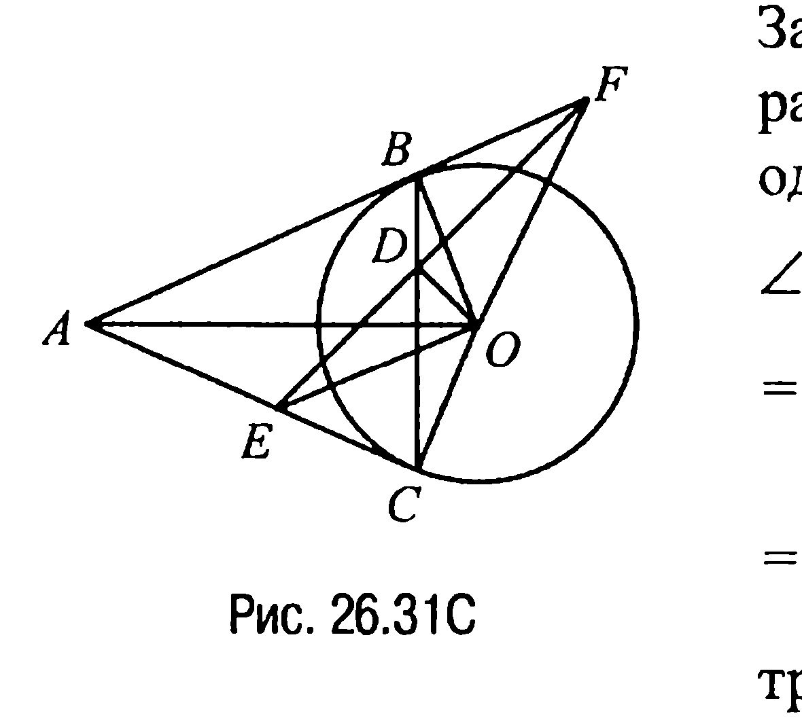

Запишем теперь следующие цепочки равенств для углов, опирающихся на одинаковые дуги, $\angle DEO = \angle DCO = \angle BCO = \angle BAO = \frac{\varphi}{2}$, $\angle DFO = \angle DBO = \angle CBO =$ $= \angle CAO = \frac{\varphi}{2}$. А отсюда следует, что треугольник $OEF$ равнобедренный и, значит, $DE = DF = OD \cdot \text{ctg}\,\frac{\varphi}{2}$. Из треугольника же $DBO$ по теореме косинусов находим, что $OD = \sqrt{R^2 + a^2 - 2Ra \cos \frac{\varphi}{2}}$ и, таким образом, $DE = \text{ctg}\,\frac{\varphi}{2} \sqrt{R^2 + a^2 - 2Ra \cos \frac{\varphi}{2}}$.

**Ответ:** $DE = \text{ctg}\,\frac{\varphi}{2} \sqrt{R^2 + a^2 - 2Ra \cos \frac{\varphi}{2}}$.

**26.32С.** Пусть $O_1$ и $O_2$ — центры описанных около треугольников $ABD$ и $ADC$ окружностей, $R$ и $r$ — их соответствующие радиусы, $E$ — точка пересечения отрезков $O_1O_2$ и $AD$ (рис. 26.32С).

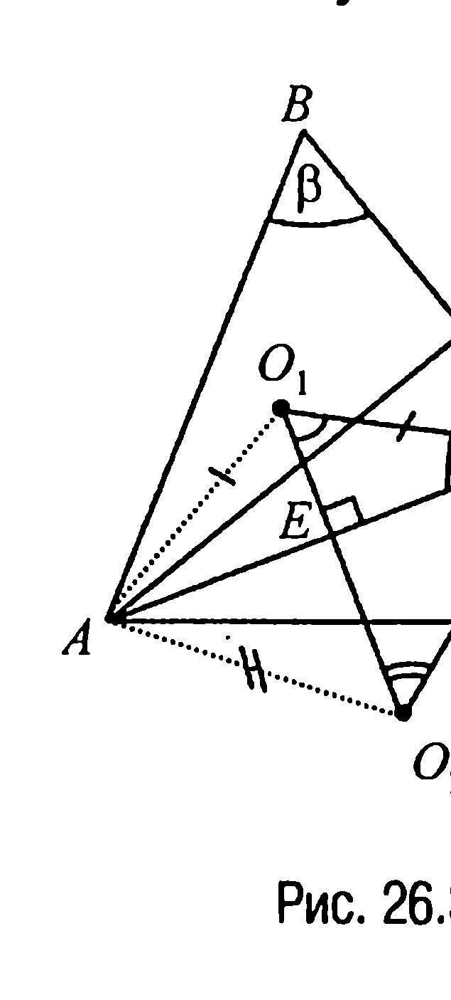

Обозначим $\angle ABC = \beta$, $\angle BCA = \gamma$, $\angle BDA = \alpha$, $AB = c$, $AC = b$. Тогда так как треугольники $AO_1D$ и $DO_2A$ равнобедренные, то по свойству 4.6 имеем: $\angle EO_1D = \beta$, $\angle DO_2E = \gamma$, причем отрезки $O_1O_2$ и $AD$ перпендикулярны. Из прямоугольных треугольников $O_1DE$ и $EDO_2$ находим, что $O_1E = R \cdot \cos \beta$, $EO_2 = r \cdot \cos \gamma$, и, таким образом, $O_1O_2 = O_1E +$

---
**стр. 529**
---

$+ EO_2 = R \cdot \cos \beta + r \cdot \cos \gamma$. Но $R = \frac{c}{2 \sin \alpha}$, $r = \frac{b}{2 \sin(180^\circ - \alpha)}$, поэтому $O_1O_2 = \frac{1}{2 \sin \alpha} (c \cdot \cos \beta + b \cdot \cos \gamma)$. Если теперь опустить высоту $AF$, то из прямоугольных треугольников $ABF$ и $AFC$ получаем $BF = c \cdot \cos \beta$, $FC = b \cdot \cos \gamma$, т. е. $O_1O_2 = \frac{1}{2 \sin \alpha} (BF + FC) = \frac{a}{2 \sin \alpha}$.

**Ответ:** $\frac{a}{2 \sin \alpha}$.

**26.33С.** Пусть $O$ — центр вписанной окружности, точки $D, E,$

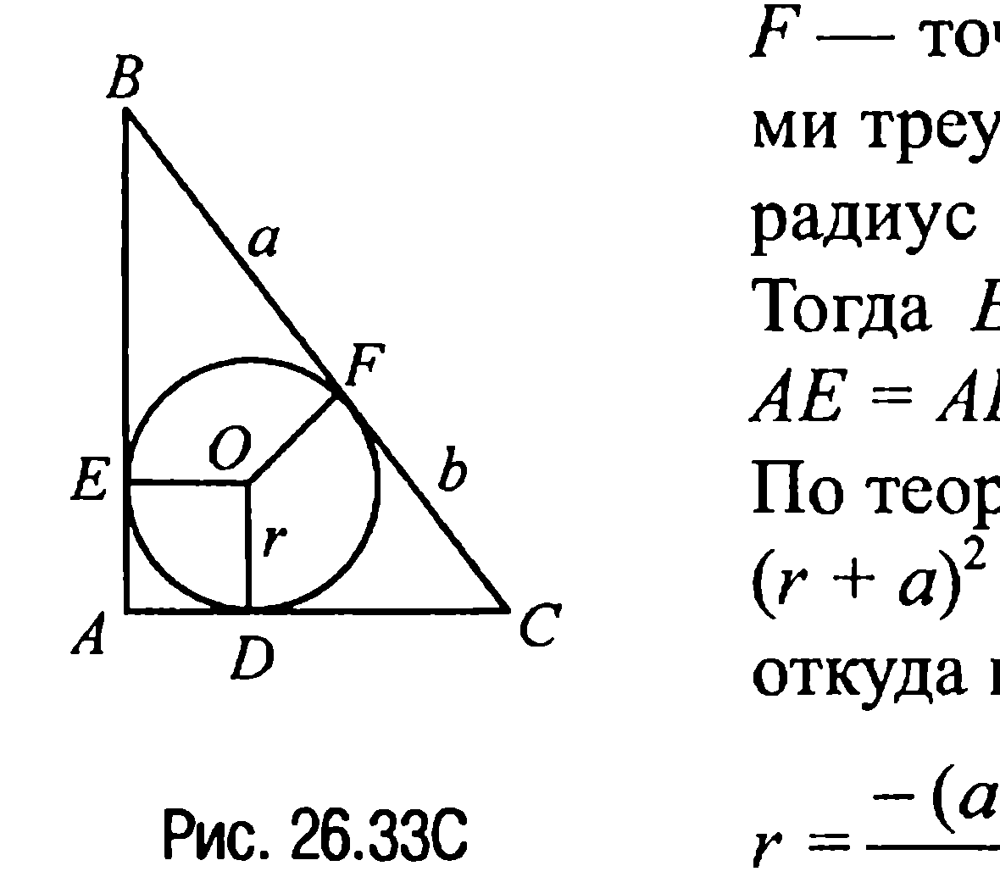

$F$ — точки касания окружности со сторонами треугольника $ABC$, $BF = a, FC = b, r$ — радиус окружности (рис. 26.33С). Тогда $EB = BF = a, FC = DC = b,$ $AE = AD = OD = r, AB = r + a, AC = r + b.$ По теореме же Пифагора $(r + a)^2 + (r + b)^2 = (a + b)^2,$ откуда находим, что $r = \frac{-(a+b) + \sqrt{a^2 + 6ab + b^2}}{2}$.

**Ответ:** $\frac{-(a+b) + \sqrt{a^2 + 6ab + b^2}}{2}$.

**26.34С.** Рассмотрим случай, когда точка пересечения окружностей, отличная от точки $A$, лежит внутри треугольника $ABC$. При другом расположении указанных точек решение задачи аналогично.

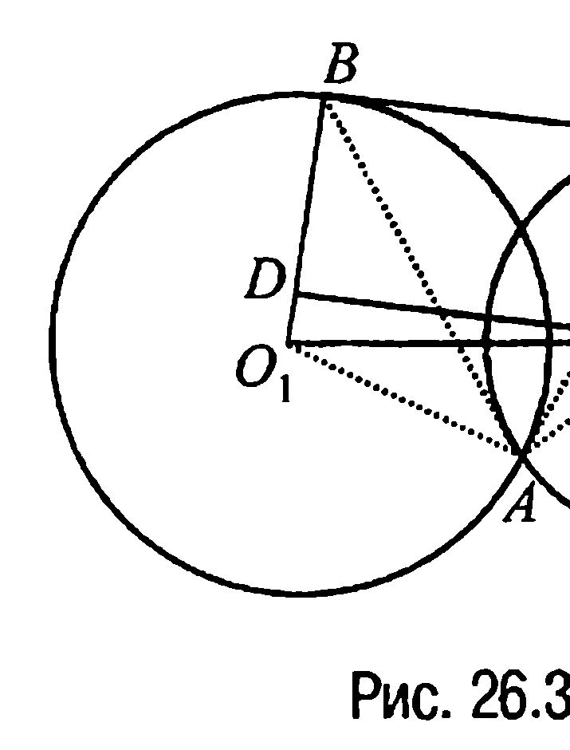

Итак, пусть $O_1$ и $O_2$ — центры окружностей радиусов $R$ и $r$ соответственно, $\angle O_1AO_2 = \varphi$, $O_1O_2 = a$, $D$ — точка пересечения радиуса $O_1B = R$ с прямой, проходящей через точку $O_2$ параллельно

---
**стр. 530**
---

касательной $BC$ (рис. 26.34С). Тогда $\angle CAB = 180^\circ - \angle ABC - \angle BCA = 180^\circ - (90^\circ - \angle O_1BA) - (90^\circ - \angle ACO_2) = \angle O_1BA + \angle ACO_2 = \angle BAO_1 + \angle O_2AC = \angle O_1AO_2 - \angle CAB = \phi - \angle CAB$, т. е. $\angle CAB = \frac{\phi}{2}$. По теореме же косинусов из треугольника $O_1AO_2$ находим, что $\cos \phi = \frac{R^2 + r^2 - a^2}{2Rr}$. Но в таком случае, замечая, что $BC = DO_2 = \sqrt{O_1O_2^2 - O_1D^2} = \sqrt{a^2 - (R - r)^2}$, находим радиус окружности, описанной около треугольника $ABC$. Он определяется по формуле $\rho = \frac{BC}{2 \sin \frac{\phi}{2}} = \frac{\sqrt{a^2 - (R - r)^2}}{2 \sqrt{\frac{1 - \cos \phi}{2}}} = \frac{\sqrt{a^2 - (R - r)^2}}{\sqrt{2} \sqrt{1 - \frac{R^2 + r^2 - a^2}{2Rr}}} = \sqrt{R \cdot r}$.

**Ответ:** $\sqrt{R \cdot r}$.

**26.35С.** Пусть $D$ — точка пересечения линии центров $O$ и $O_1$ заданных окружностей с перпендикулярной к ней прямой, а $B$ и $C$ — точки пересечения указанной прямой с окружностями радиусов $R$ и $r$ соответственно. Обозначим далее через $EA$ и $FA$ диаметры рассматриваемых окружностей (рис. 26.35С) (в случае, когда точка $C$ лежит внутри треугольника $ABF$, решение задачи аналогично рассматриваемому случаю).

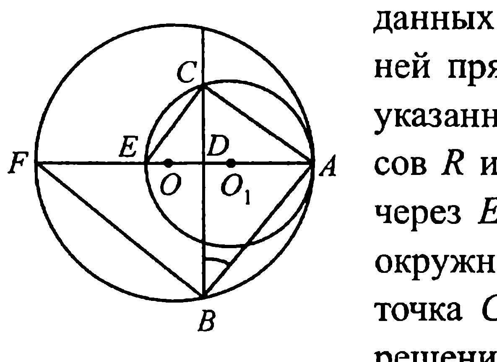

Тогда из подобия треугольников $ECA$ и $ADC$ следует, что $CA^2 = 2rx$, где $x = DA$. Из подобия же треугольников $BFA$ и $DAB$ находим, что $BA^2 = 2Rx$. Теперь если $\rho$ — радиус окружности, описанной около треугольника $ABC$, то, обозначая $\angle ABC = \alpha$ и замечая, что $\sin \alpha = x / BA$, находим $\rho = \frac{CA}{2 \sin \alpha} = \frac{CA \cdot BA}{2x} = \frac{\sqrt{2rx} \cdot \sqrt{2Rx}}{2x} = \sqrt{R \cdot r}$.

**Ответ:** $\sqrt{R \cdot r}$.

---
**стр. 531**
---

**26.36С.** Обозначим через $O_1$ центр окружности $s_1$, вписанной в равнобедренный с основанием $AC$ треугольник $ABC$ и пусть $O_2$ — центр второй окружности $s_2$ радиуса $r$, $K$ и $L$ — точки касания со стороной $AB$ окружностей с центрами $O_1$ и $O_2$ соответственно, $BH$ — высота треугольника (рис. 26.36С).

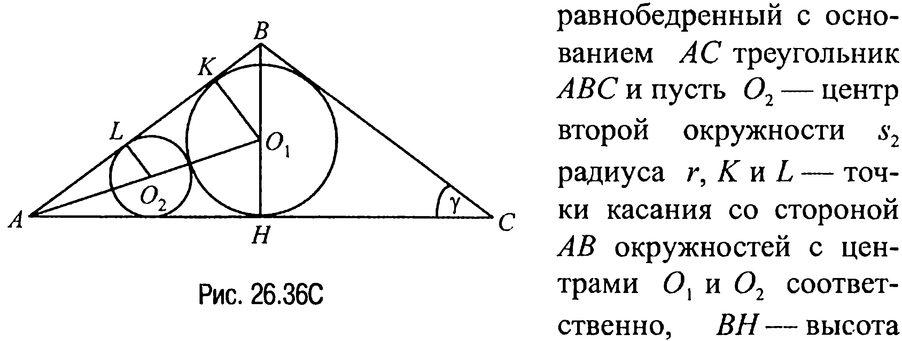

Тогда так как центр вписанной в угол окружности лежит на биссектрисе этого угла, а радиус окружности, проведенный в точку касания окружности с касательной, перпендикулярен касательной, то $O_1H = AH \cdot \operatorname{tg} \angle HAO_1 = \frac{a}{2} \cdot \operatorname{tg} \frac{\gamma}{2}$. Далее, $AO_1 = \frac{AH}{\cos \angle HAO_1} =$

$$= \frac{a}{2 \cos \frac{\gamma}{2}}, \quad AO_2 = AO_1 - O_2O_1 = AO_1 - KO_1 - LO_2 = \frac{a}{2 \cos \frac{\gamma}{2}} -$$

$$-\frac{a}{2} \cdot \operatorname{tg} \frac{\gamma}{2} - r.$$

Теперь поскольку $AK \perp KO_1$, а $AL \perp LO_2$, то треугольники $AKO_1$ и $ALO_2$ подобны и, значит, $\frac{LO_2}{KO_1} = \frac{LO_2}{O_1H} = \frac{AO_2}{AO_1}$ или $\frac{r}{\frac{a}{2} \operatorname{tg} \frac{\gamma}{2}} =$

$$= \frac{\frac{a}{2 \cos \frac{\gamma}{2}} - \frac{a}{2} \cdot \operatorname{tg} \frac{\gamma}{2} - r}{\frac{a}{2 \cos \frac{\gamma}{2}}}.$$

А отсюда находим, что $r = \frac{a}{2} \cdot \operatorname{tg} \frac{\gamma}{2} \cdot \frac{1 - \sin \frac{\gamma}{2}}{1 + \sin \frac{\gamma}{2}}$.

**Ответ:** $\frac{a}{2} \cdot \operatorname{tg} \frac{\gamma}{2} \cdot \frac{1 - \sin \frac{\gamma}{2}}{1 + \sin \frac{\gamma}{2}}$.

---
**стр. 532**
---

**26.37С.** Опишем около заданного треугольника $ABC$ окружность и обозначим через $O$ ортоцентр, через $E$ — точку пересечения высоты, опущенной из вершины $B$ треугольника, со стороной $AC$, через $D$ — точку пересечения продолжения указанной высоты с окружностью и через $F$ — точку пересечения высоты, опущенной из вершины $A$ треугольника, со стороной $BC$ (рис. 26.37С).

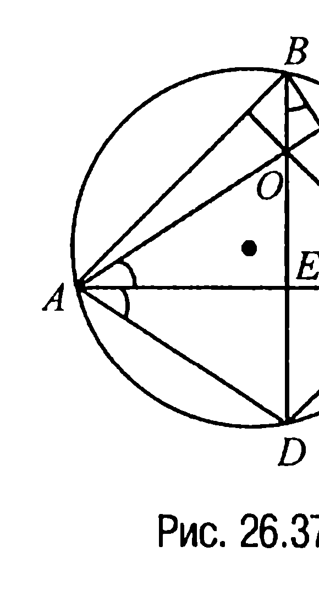

Тогда $\angle DAC = \angle DBC$, поскольку оба эти угла вписанные и они опираются на одну и ту же дугу $DC$. Далее, равны и углы $DBC$ и $CAF$ как углы с соответственно перпендикулярными сторонами. Следовательно, $\angle DAC = \angle CAF$ и поэтому прямоугольные треугольники $DAE$ и $AOE$ равны. Отсюда вытекает, что равными будут и треугольники $AOC$ и $ADC$, а значит, радиусы описанных около этих треугольников окружностей равны. Но окружность, описанная около треугольника $ABC$, является окружностью, описанной и около треугольника $ADC$, что и доказывает требуемое.

**26.38С.** Пусть $R$ — радиус описанной около треугольника $ABC$ окружности, $E$ — точка пересечения биссектрисы, опущенной из вершины $C$, с отрезком $HO$, $OD$ — радиус описанной около треугольника $ABC$ окружности, перпендикулярный стороне $AB$, $G$ — точка пересечения отрезков $OD$ и $AB$ (рис. 26.38С).

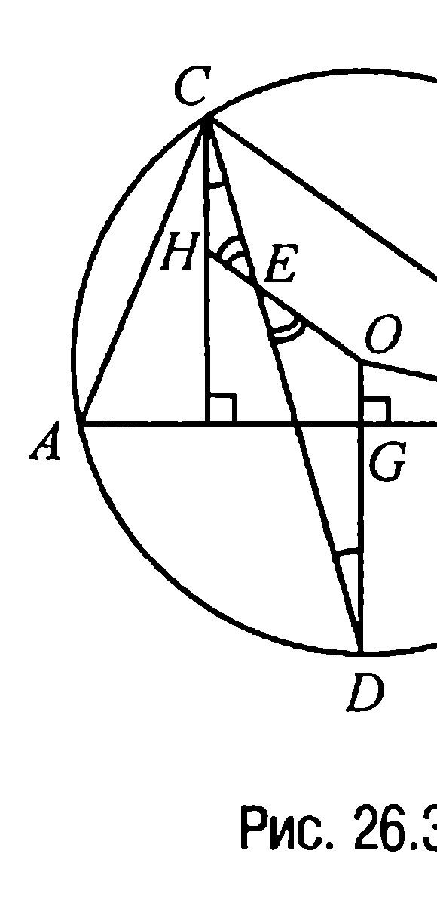

Тогда так как $AG = GB = c/2$ и точка $D$ делит дугу $AB$ пополам, то продолжение биссектрисы за сторону $AB$ проходит через точку $D$.

Рассмотрим треугольники $EHC$ и $EOD$. В этих треугольниках $CH \parallel OD$, $\angle HCE = \angle EDO$. Кроме того, $\angle HEC = \angle DEO$. Таким образом, треугольники $EHC$ и $EOD$ подоб-

---
**стр. 533**
---

ны и, значит, $\frac{CH}{OD} = \frac{HE}{EO}$ или $\frac{CH}{R} = \frac{p}{q}$, откуда $CH = \frac{pR}{q}$. Далее, поскольку $CH = 2OG$ (задача 7.9), а $OG^2 + GB^2 = OB^2$, то с учетом значений $GB$ и $CH$ последнее равенство можно переписать в виде

$$\frac{p^2 R^2}{4q^2} + \frac{c^2}{4} = R^2 \quad \text{или в виде} \quad R^2 \left(1 - \frac{p^2}{4q^2}\right) = \frac{c^2}{4},$$

откуда находим, что $R = \frac{cq}{\sqrt{4q^2 - p^2}} = \frac{c}{\sqrt{4 - \left(\frac{p}{q}\right)^2}}$.

**Ответ:** $\frac{c}{\sqrt{4 - \left(\frac{p}{q}\right)^2}}$.

**26.39С.** Обозначим $BC = a$, $AC = b$, $AB = c$, $\angle CAB = \alpha$, $\angle ABC = \beta$, $\angle BCA = \gamma$, $\angle CKB = \delta$ и пусть $OP = x$, $OQ = y$ — перпендикуляры, опущенные на стороны $AC$ и $AB$ треугольника соответственно. Рассмотрим два случая: 1) отрезок $BK$ содержит биссектрису треугольника $ABC$; 2) отрезок $BK$ расположен вне треугольника.

Обратимся сначала к первому случаю. Пусть $M$ — точка пересечения отрезка $BK$ с окружностью (рис. 26.39С).

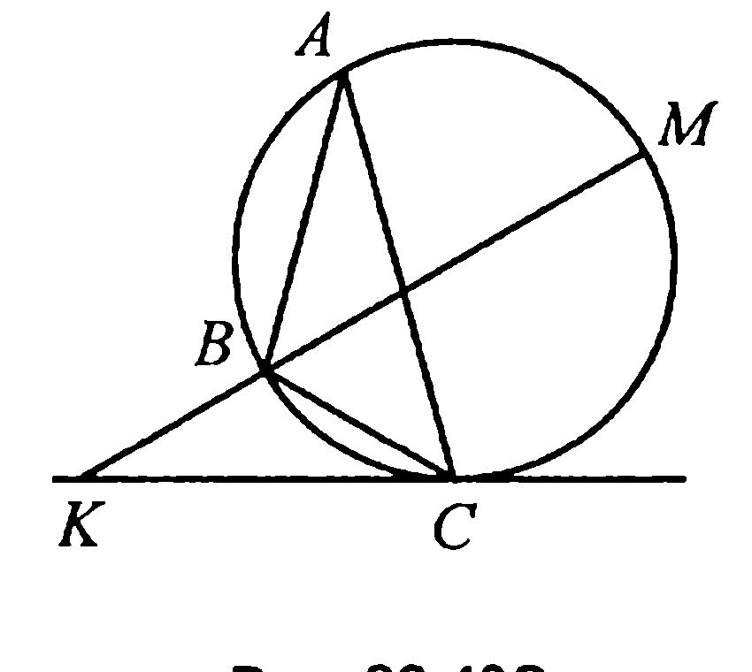

Тогда, с одной стороны, $\angle CKB = \frac{1}{2}(\cup BC - \cup MC) = \alpha - \frac{\beta}{2}$, а, с другой, $\angle CKB = \frac{3\alpha - \gamma}{2}$ (в соответствии с условием). Но в таком случае $2\alpha - \beta = 3\alpha - \gamma$ или $\gamma = \alpha + \beta = (\alpha + \beta + \gamma) - \gamma = 180^\circ - \gamma$ и, значит, $\gamma = 90^\circ$. Последнее означает, что $AB$ — диаметр окружности,

---
**стр. 534**
---

а поэтому $y = 0$, $x = 2$, $a = 2x = 4$ ($OP$ — средняя линия треугольника $BCA$). Теперь так как по теореме Пифагора $a^2 + b^2 = c^2$, то, подставляя в это равенство $a = 4$, $c = 2 + \sqrt{3} - b$, получим, что

$$b = -\frac{9 - 4\sqrt{3}}{2(2 + \sqrt{3})} < 0, \text{ а этого быть не может.}$$

Вывод: первый случай расположения отрезка $BK$ невозможен.

Рассмотрим второй случай. Обозначим через $M$ точку пересечения продолжения отрезка $KB$ за точку $B$ с окружностью, описанной около треугольника $ABC$ (рис. 26.40С).

В данном случае, с одной стороны, $\angle CKB = \frac{1}{2}(\cup MC - \cup BC) = \frac{\beta}{2} - \alpha$, а, с другой, —

$$\angle CKB = \frac{3\alpha - \gamma}{2} \text{ (по условию).}$$

Но тогда $\beta - 2\alpha = 3\alpha - \gamma$ или $5\alpha = \beta + \gamma = (\alpha + \beta + \gamma) - \alpha = 180^\circ - \alpha$ и, таким образом, $\alpha = 30^\circ$. С учетом этого факта для нахождения радиуса $R$ описанной около треугольника $ABC$ окружности воспользуемся расширенной теоремой синусов: $R = \frac{a}{2\sin\alpha} = \frac{a}{2\sin 30^\circ} = a$. Итак, задача свелась к нахождению стороны $a$ треугольника $ABC$.

Рассмотрим три возможности: $\beta < 90^\circ$, $\beta = 90^\circ$, $\beta > 90^\circ$.

Предположим сначала, что $\beta < 90^\circ$. По условию $3\alpha - \gamma = 2\delta$ и, значит, $\gamma = 3\alpha - 2\delta < 90^\circ$ (поскольку $\alpha = 30^\circ$). Следовательно, треугольник $ABC$ — остроугольный и точка $O$ лежит внутри треугольника (рис. 26.41С).

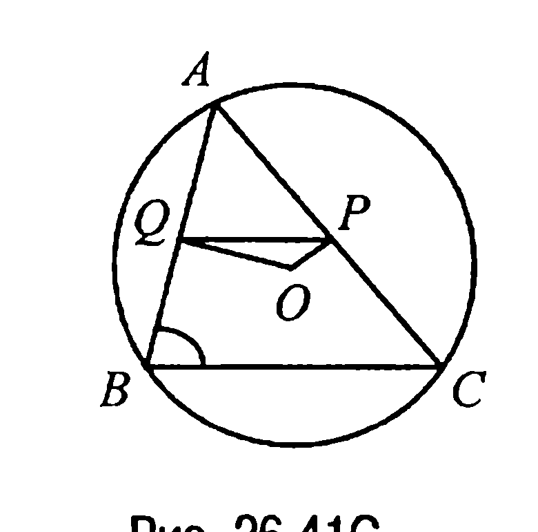

Отрезок $QP$ — средняя линия треугольника $ABC$ и, значит, $QP = a/2$. Но тогда по теореме косинусов из треугольника $QOP$ находим, что $QP^2 = \frac{a^2}{4} = x^2 + y^2 - 2x \cdot y \cdot \cos 150^\circ = x^2 + (2 -$

---
**стр. 535**
---

$-x)^2 + x \cdot (2 - x) \cdot \sqrt{3} = (2 - \sqrt{3}) \cdot x^2 - 2(2 - \sqrt{3}) \cdot x + 4$

или $\frac{a^2}{4} = (2 - \sqrt{3}) \cdot x^2 - 2(2 - \sqrt{3}) \cdot x + 4$.

Вычисляя теперь минимальное значение полученного квадратного трехчлена (оно равно $2 + \sqrt{3}$), приходим к выводу, что $a^2 \ge 4(2 + \sqrt{3}) > (2 + \sqrt{3})^2$.

С другой стороны, поскольку в произвольном треугольнике любая сторона меньше суммы двух других сторон, то в треугольнике $ABC$ сторона $a < b + c = 2 + \sqrt{3}$ и, таким образом, $a^2 < (2 + \sqrt{3})^2$, что противоречит полученной выше оценке. Это противоречие означает, что угол $\beta$ не может быть меньше $90^\circ$.

Предположим, что $\beta = 90^\circ$. В этом случае точка $O$ лежит на стороне $AC$ — диаметре окружности (рис. 26.42С) и поэтому $x = 0$, $y = 2$ и, следовательно, $a = 2y = 4$ ($OQ$ — средняя линия треугольника $ABC$). Но, тогда $b + c > a = 4 > 2 + \sqrt{3}$, что противоречит условию задачи, согласно которому $b + c = 2 + \sqrt{3}$. Полученное противоречие означает, что угол $\beta$ не может быть равен и $90^\circ$.

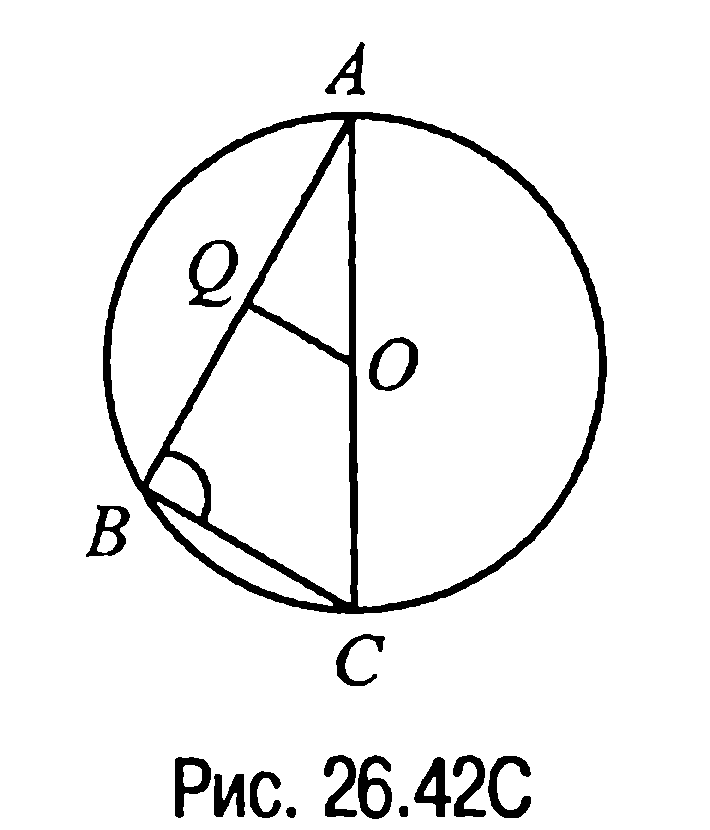

Рассмотрим, наконец, третью — последнюю возможность — случай, когда $\beta > 90^\circ$. Очевидно, что в этом случае точки $B$ и $O$ лежат по разные стороны от прямой $AC$ (рис. 26.43С). А тогда $\angle QOP = \angle BAC = \alpha = 30^\circ$ (поскольку это углы с соответственно перпендикулярными сторонами) и, значит, $OT = \frac{x}{\cos 30^\circ} = \frac{2x}{\sqrt{3}}$, $PT = x \cdot \operatorname{tg} 30^\circ = \frac{x}{\sqrt{3}}$, $QT = 2 - (x + OT) = 2 - \frac{x(2 + \sqrt{3})}{\sqrt{3}}$, $c = 2AQ = 2QT \cdot \operatorname{ctg} 30^\circ = 4\sqrt{3} - 2x \cdot (2 + \sqrt{3})$, $b = 2(PT + TA) = 2\left(\frac{x}{\sqrt{3}} + \frac{QT}{\sin 30^\circ}\right) = 8 - 2x \cdot (2 + \sqrt{3})$. По условию $b + c = 2 + \sqrt{3}$,

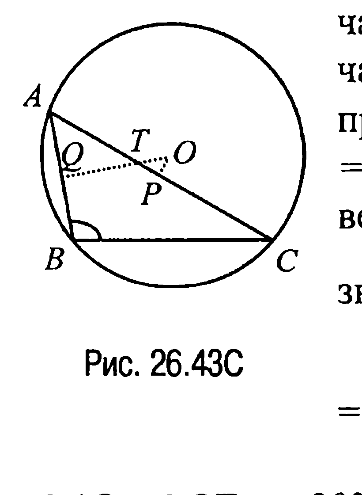

---
**стр. 536**
---

поэтому $8 - 2x \cdot (2 + \sqrt{3}) + 4\sqrt{3} - 2x \cdot (2 + \sqrt{3}) = 2 + \sqrt{3}$, откуда находим, что $x = \frac{3}{4}$. Но в таком случае $b = 5 - \frac{3\sqrt{3}}{2}$, $c = \frac{5\sqrt{3}}{2} - 3$, а так как $a^2 = b^2 + c^2 - 2b \cdot c \cdot \cos 30^\circ = \left(5 - \frac{3\sqrt{3}}{2}\right)^2 + \left(\frac{5\sqrt{3}}{2} - 3\right)^2 - \left(5 - \frac{3\sqrt{3}}{2}\right)\left(\frac{5\sqrt{3}}{2} - 3\right) = \frac{34 - 15\sqrt{3}}{4}$, то $a = R = \sqrt{\frac{34 - 15\sqrt{3}}{4}}$.

**Ответ:** $\frac{1}{2}\sqrt{34 - 15\sqrt{3}}$.

**▼ 26.40С.** Пусть $K$ — вторая точка пересечения прямой $CO$ с первой окружностью, а $M$ — точка пересечения прямой $CO$ с прямой $DE$ (рис. 26.44С).

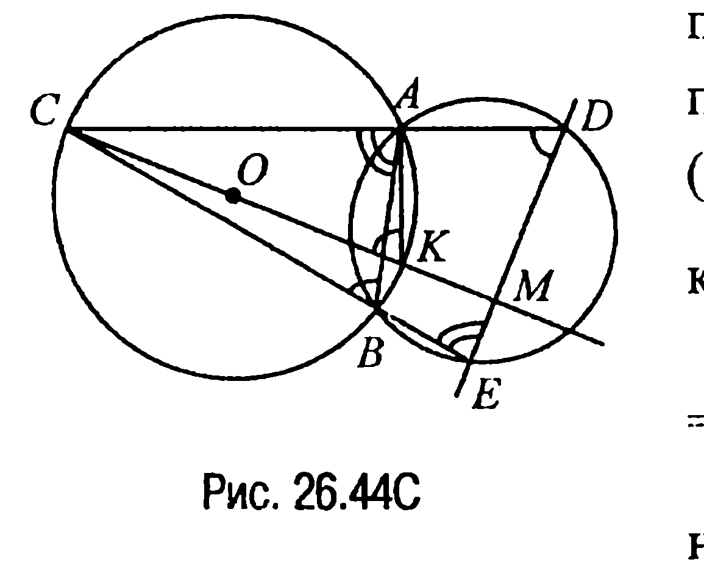

Тогда по свойству секущей $CA \cdot CD = CB \cdot CE$ или $\frac{CA}{CE} = \frac{CB}{CD}$, откуда следует, что треугольники $ABC$ и $DEC$ подобны. Следовательно, $\angle CDE = \angle CBA$, а $\angle CED = \angle CAB$. Далее, поскольку $\angle CBA = \angle CKA$, то треугольники $CAK$ и $CMD$ подобны и, таким образом, $\angle CMD = \angle CAK = 90^\circ$, что и требовалось доказать.

**26.41С.** Пусть первые две окружности (радиусов $r_1$ и $r_2$), касаясь друг друга в точке $A$, касаются третьей окружности радиуса $R$ в точках $B$ и $C$ соответственно (рис. 26.45С) и пусть $O_1, O_2$ и $Q$ — центры окружностей радиусов $r_1, r_2$ и $R$ соответственно. Тогда так как точки $A, B$ и $C$ лежат соответственно на прямых $O_1O_2, O_1Q$ и $O_2Q$, то $O_1O_2 = r_1 + r_2$, $O_1Q = R - r_1$ и $O_2Q = R - r_2$. А поскольку $R - r_1 \neq R - r_2$, то боковыми сторонами треугольника $O_1QO_2$ могут быть либо отрезки $O_1O_2$ и $O_1Q$ (и тогда $O_2Q$ — основание), либо отрезки $O_1O_2$ и $O_2Q$ (и тогда $O_1Q$ — основание).

---
**стр. 537**
---

Но по условию угол между боковыми сторонами равнобедренного треугольника $O_1QO_2$ больше $\pi/3$, поэтому основание треугольника является его большей стороной и, значит, ввиду того, что $O_2Q = R - r_2 < R - r_1 = O_1Q$, основанием треугольника является отрезок $O_1Q = R - r_1$.

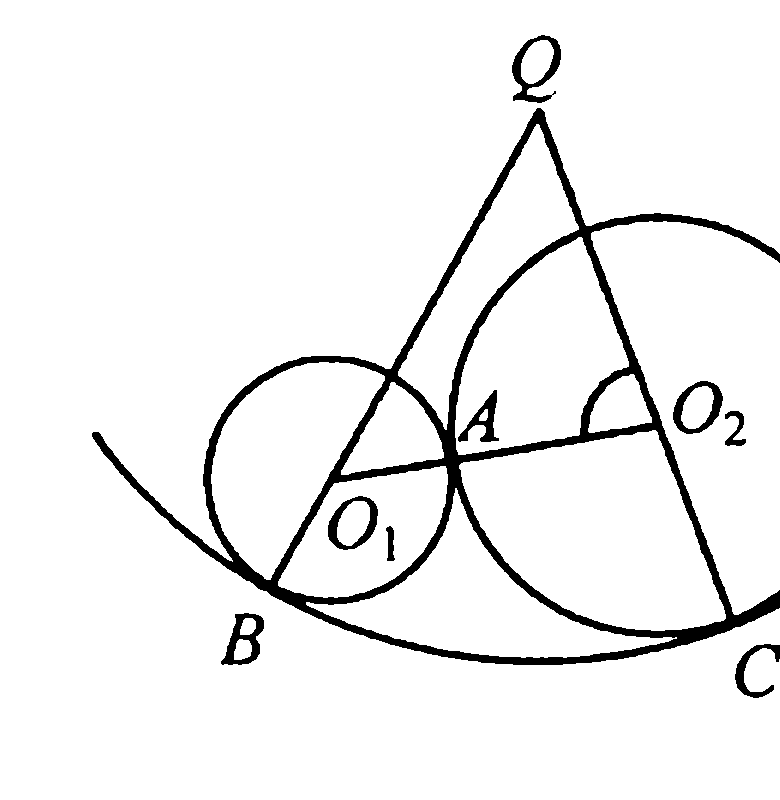

В таком случае из равенства боковых сторон $O_1O_2$ и $QO_2$ треугольника, т. е. из равенства $r_1 + r_2 = R - r_2$ находим, что $R = r_1 + 2r_2$, и, таким образом, основание $O_1Q = 2r_2$, а боковая сторона $O_1O_2 = r_1 + r_2$.

Ответ: $2r_2$; $r_1 + r_2$.

**26.42С.** Предположим сначала, что треугольник остроугольный.

Пусть $BH = h_b$ и $BL = l_b$ — соответственно высота и биссектриса $\Delta ABC$ (рис. 26.46С) и пусть для определенности угол $BAC$ — наибольший из углов треугольника.

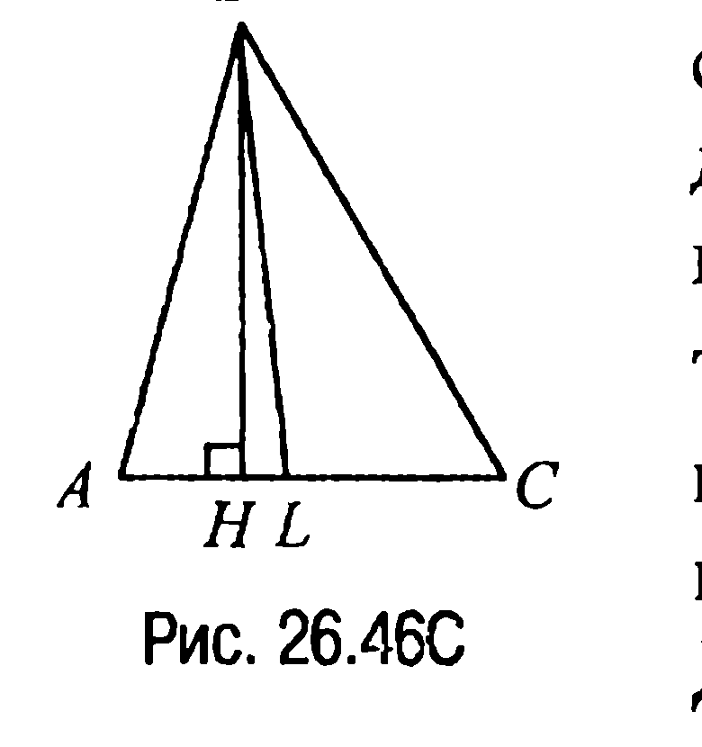

Тогда $60^\circ \le \angle BAC < 90^\circ$, $h_b \le l_b < 1$ и $h_c \le l_c < 1$, где $h_c$ и $l_c$ — высота и биссектриса, проведенные из вершины $C$.

Для площади $S$ треугольника $ABC$ справедливы следующие соотношения:

$$S = \frac{1}{2} AB \cdot h_c = \frac{1}{2} h_c \cdot \frac{BH}{\sin \angle BAH} = \frac{h_c h_b}{2 \sin \angle BAH} = \frac{1 \cdot 1}{2 \sin \angle BAH}.$$

А так как $\sin \angle BAH \ge \sin 60^\circ = \frac{\sqrt{3}}{2}$, то $S < \frac{1}{2 \sin \angle BAH} \le \frac{\sqrt{3}}{3}$.

Пусть теперь $\angle BAC \ge 90^\circ$ (рис. 26.47С). Тогда поскольку в треугольнике против большего угла лежит большая сторона, то $AC < l_c$, $AB < l_b$ и, следовательно, $AC < l_c < 1$ и $AB < l_b < 1$.

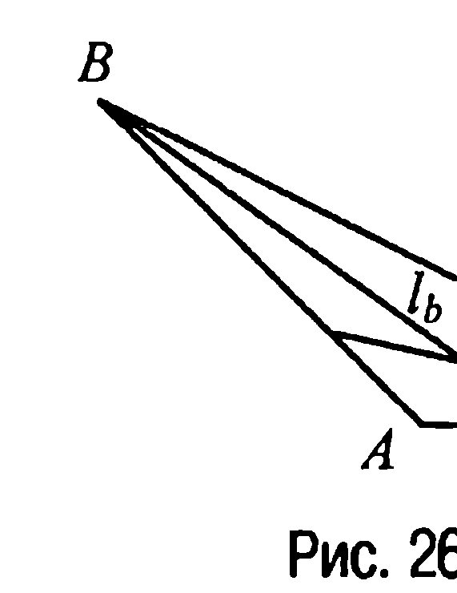

---
**стр. 538**
---

Поэтому $S = \frac{1}{2} AB \cdot AC \cdot \sin \angle BAC \le \frac{1}{2} AB \cdot AC < \frac{1}{2} < \frac{\sqrt{3}}{3}$, что и требовалось доказать.

**26.43С.** Пусть $a$, $b$ и $c$ — стороны треугольника, площадь $S$ которого равна $1$, и пусть для определенности $a \le b \le c$. Обозначим через $\gamma$ угол между сторонами $a$ и $b$. Тогда

$$S = 1 = \frac{1}{2} a \cdot b \cdot \sin \gamma \le \frac{1}{2} a \cdot b \le \frac{b^2}{2}.$$

Отсюда следует, что $b^2 \ge 2$ или $b \ge \sqrt{2}$. Но $c \ge b$, поэтому и $c \ge \sqrt{2}$, а это и требовалось доказать.

**26.44С.** Так как треугольники $MBN$ и $PNC$ (рис. 26.48С) подобны, то $\frac{S_1}{S_2} = \left(\frac{BN}{NC}\right)^2$. Но $\frac{S_1}{S_2} = 9$, поэтому $\frac{BN}{NC} = 3$ и, значит, $BN = \frac{3}{4} BC$, $NC = \frac{1}{4} BC$. Пусть $S$ — площадь треугольника $ABC$.

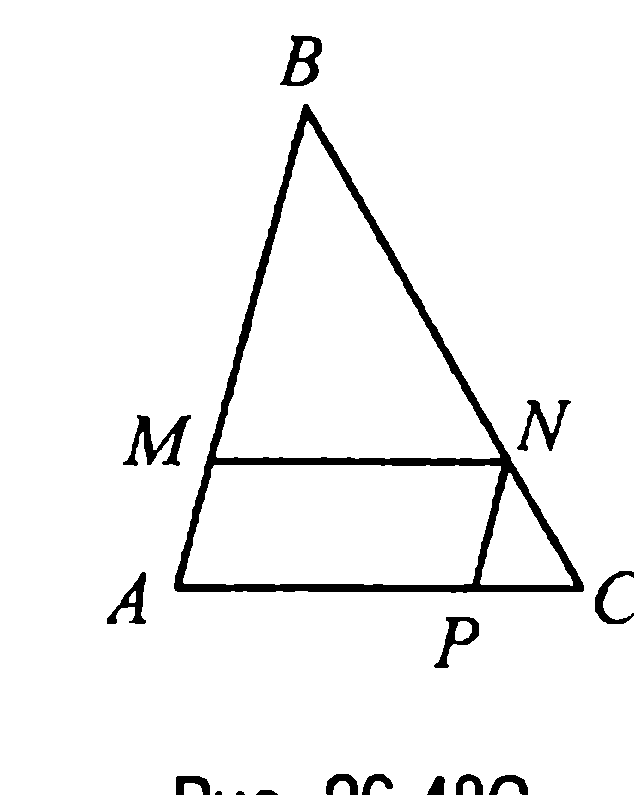

Тогда поскольку треугольники $MBN$ и $ABC$ подобны, то $\frac{S_1}{S} = \left(\frac{BN}{BC}\right)^2$ или $\frac{9}{S} = \left(\frac{3}{4}\right)^2$, откуда $S = 16$. Таким образом, площадь четырехугольника $AMNP$ (параллелограмма) $S_3 = S - S_1 - S_2 = 16 - 9 - 1 = 6$.

Ответ: не возможны.

**26.45С.** Пусть в треугольнике $ABC$ отрезок $BM = m$ — медиана, $BL$ — биссектриса, $BK = n$ — симедиана и пусть $AB = c$, $BC = a$, $KC = x$, $AK = y$ (рис. 26.49С). Тогда если $h_b$ — высота треугольника $ABC$, опущенная из вершины $B$ на основание $AC$, то

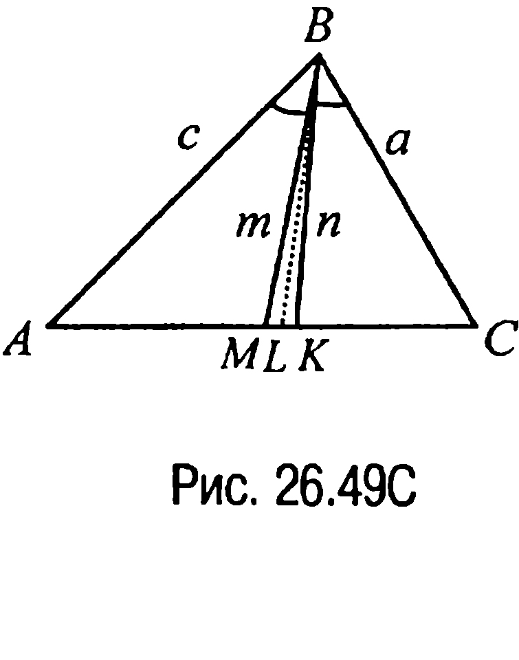

$$S_{\triangle KBC} = \frac{1}{2} x \cdot h_b = \frac{1}{2} a \cdot n \cdot \sin \angle KBC,$$

$$S_{\triangle ABM} = \frac{1}{2} \cdot \frac{x+y}{2} \cdot h_b = \frac{1}{2} c \cdot m \cdot \sin \angle ABM.$$

---
**стр. 539**
---

Замечая теперь, что $BL$ — ось симметрии угла $MBK$, т. е. что $BL$ — биссектриса угла $MBK$, приходим к выводу, что $\angle MBL = \angle LBK$. Но в таком случае $\angle ABM = \angle ABL - \angle MBL = \angle LBC - \angle LBK = \angle KBC$ и, значит, $\frac{2x}{x+y} = \frac{an}{cm}$ или $x = \frac{x+y}{2} \cdot \frac{an}{cm}$.

Далее, поскольку $S_{\triangle ABK} = \frac{1}{2} y \cdot h_b = \frac{1}{2} c \cdot n \cdot \sin \angle ABK$, $S_{\triangle MBC} = \frac{1}{2} \cdot \frac{x+y}{2} \cdot h_b = \frac{1}{2} a \cdot m \cdot \sin \angle MBC$, а $\angle ABK = \angle ABL + \angle LBK = \angle LBC + \angle MBL = \angle MBC$, то $\frac{2y}{x+y} = \frac{cn}{am}$ или $y = \frac{x+y}{2} \cdot \frac{cn}{am}$.

Таким образом, $\frac{x}{y} = \frac{\frac{x+y}{2} \cdot \frac{an}{cm}}{\frac{x+y}{2} \cdot \frac{cn}{am}} = \frac{a^2}{c^2}$, что и требовалось доказать.

**26.46С.** Введем обозначения: $\angle MCK = \angle 1$, $\angle KCB = \angle 2$, $\angle ABK = \angle 3$, $\angle BAK = \angle 4$, $\angle KLM = \angle 5$, $\angle KML = \angle 6$ (рис. 26.50С). Тогда так как $LM$ — средняя линия треугольника $ABC$, то $LM \parallel BA$ и, значит, $\angle 4 = \angle 5$, $\angle 6 = \angle 3$ (как внутренние накрест лежащие при параллельных прямых). Но $\angle 2 = \angle 6$ (эти углы опираются на одну и ту же дугу $LK$), а $\angle 6 = \angle 3$ и поэтому $\angle 2 = \angle 3$. Далее, $\angle 1 = \angle 5$, а $\angle 5 = \angle 4$, следовательно, $\angle 1 = \angle 4$, что и требовалось доказать.

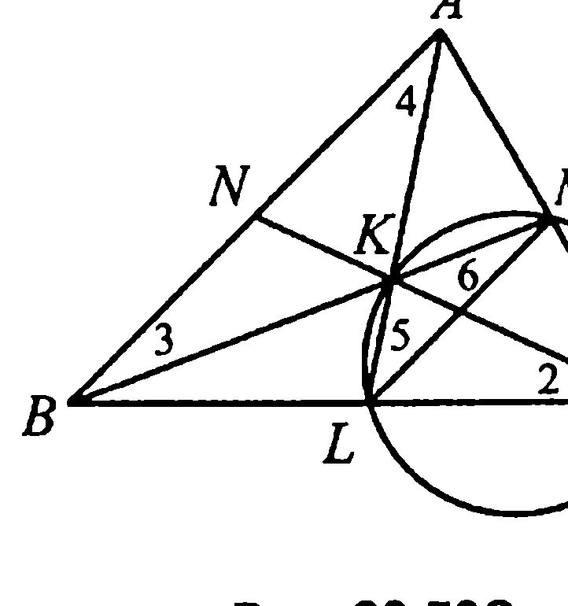

**26.47С.** Пусть $\angle CAB = \alpha$, $AB = a$, $AD = c$, $AC = b$ (рис. 26.51С). Тогда $BD^2 = a^2 + c^2 - 2a \cdot c \cdot \cos\frac{\alpha}{2}$, $DC^2 = b^2 + c^2 - 2b \cdot c \cdot \cos\frac{\alpha}{2}$. Но $BD = DC$, поэтому $a^2 + c^2 - 2a \cdot c \cdot \cos\frac{\alpha}{2} = b^2 + c^2 - 2b \cdot c \cdot \cos\frac{\alpha}{2}$.

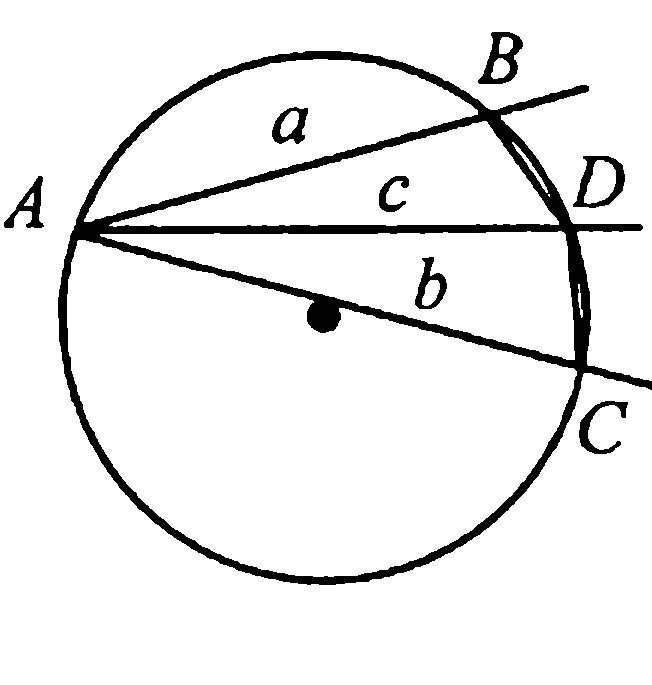

---
**стр. 540**
---

$-2b \cdot c \cdot \cos \frac{\alpha}{2}$ или $a^2 - b^2 = 2c \cdot (a - b) \cdot \cos \frac{\alpha}{2}$, откуда следует, что $\frac{a + b}{c} = 2\cos \frac{\alpha}{2}$, т. е. отношение $(a + b)/c$ действительно от радиуса окружности не зависит.

**26.48С.** Докажем, что $AA_1 \perp C_1B_1$. Доказательство того, что $BB_1 \perp C_1A_1$ и $CC_1 \perp A_1B_1$, проводится аналогично. Итак, обозначим через $D$ точку пересечения отрезков $AA_1$ и $C_1B_1$ (рис. 26.52С).

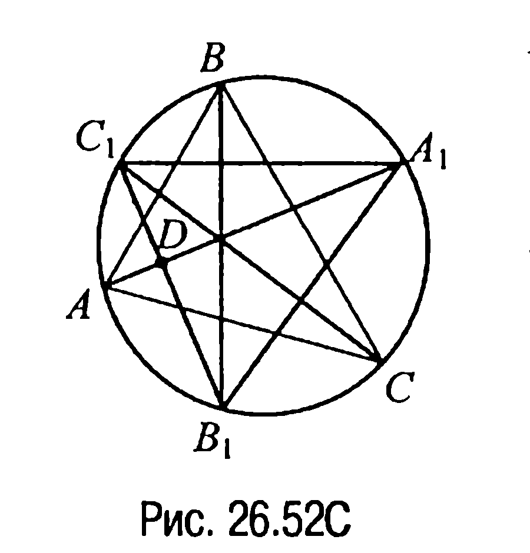

Тогда $\angle ADB_1 = \frac{1}{2}(\cup AB_1 + \cup C_1B + \cup BA_1) =$
$= \angle ABB_1 + \angle BCC_1 + \angle A_1AB = \frac{1}{2}(\angle ABC +$
$+ \angle BCA + \angle CAB) = 90^\circ$.
А это и доказывает требуемое.

**26.49С.** Пусть $\alpha$, $\beta$ и $\gamma$ — углы некоторого треугольника, для которого в соответствии с пунктом а) задачи 10.10 имеет место равенство $\frac{r}{4R} = \sin \frac{\alpha}{2} \cdot \sin \frac{\beta}{2} \cdot \sin \frac{\gamma}{2}$, относительно правой части которого (учитывая формулу преобразования произведения двух синусов в сумму и одну из формул приведения) имеем следующую оценку:
$\sin \frac{\alpha}{2} \cdot \sin \frac{\beta}{2} \cdot \sin \frac{\gamma}{2} = \frac{1}{2}\left(\cos \frac{\alpha - \beta}{2} - \cos \frac{\alpha + \beta}{2}\right) \cdot \sin \frac{\gamma}{2} =$
$= \frac{1}{2}\left(\cos \frac{\alpha - \beta}{2} - \sin \frac{\gamma}{2}\right) \cdot \sin \frac{\gamma}{2} \le \frac{1}{2}\left(1 - \sin \frac{\gamma}{2}\right) \cdot \sin \frac{\gamma}{2}$.

Вычислим наибольшее на интервале $(0; \pi)$ значение функции $f$, заданной равенством $f(\gamma) = \left(1 - \sin \frac{\gamma}{2}\right) \cdot \sin \frac{\gamma}{2}$.
Для этого найдем сначала производную функции. Она, как нетрудно убедиться, имеет вид $f'(\gamma) = \frac{1}{2}\left(1 - 2\sin \frac{\gamma}{2}\right) \cdot \cos \frac{\gamma}{2}$.
Далее, на основании стандартных рассуждений находим критические точки функции $f$. Они определяются из уравнения

---
**стр. 541**
---

$\left(1 - 2\sin \frac{\gamma}{2}\right) \cdot \cos \frac{\gamma}{2} = 0$ или равносильной ему совокупности

$$\begin{cases} \cos \frac{\gamma}{2} = 0, \\ 1 - 2\sin \frac{\gamma}{2} = 0, \end{cases} \quad \text{или совокупности} \quad \begin{cases} \cos \frac{\gamma}{2} = 0, \\ \sin \frac{\gamma}{2} = \frac{1}{2}, \end{cases}$$

решая которую на интервале $(0; \pi)$, находим, что единственной критической точкой является точка $\gamma = \pi/3$.
При таком значении $\gamma$ функция $f$ принимает значение, равное $1/4$, которое, как легко проверить, оказывается наибольшим значением $f$. Но в таком случае $\frac{r}{4R} \le \frac{1}{8}$, что и доказывает первое утверждение задачи.
Что же касается второго утверждения, то рассуждения здесь следующие.

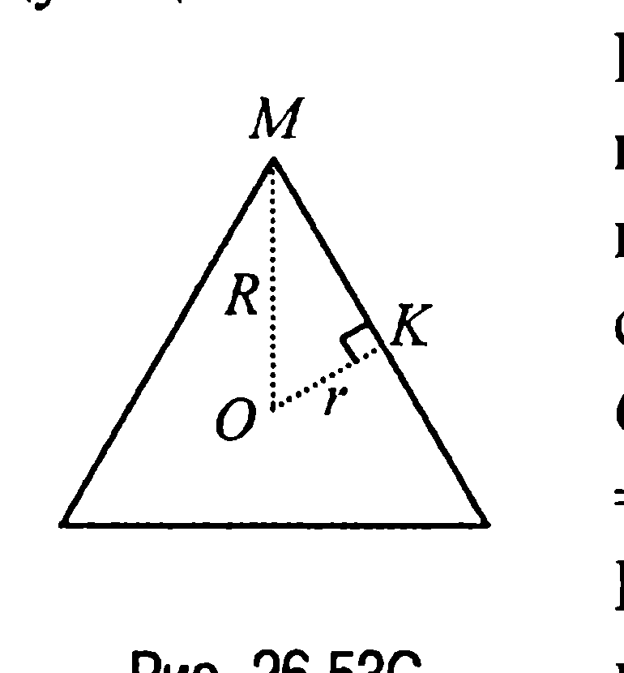

Если треугольник является равносторонним, то центр описанной около него окружности совпадает с центром вписанной в него окружности и поэтому из прямоугольного треугольника $OKM$ (рис. 26.53С) следует, что $OK = r = OM \cdot \sin \angle OMK = R \cdot \sin 30^\circ = R/2$ или $R = 2r$.
Пусть теперь наоборот $R = 2r$. Тогда если предположить, что треугольник не является равносторонним, то, полагая для определенности, что $\alpha \ne \beta$, имеем

$$\frac{r}{4R} = \frac{1}{2}\left(\cos \frac{\alpha - \beta}{2} - \sin \frac{\gamma}{2}\right) \cdot \sin \frac{\gamma}{2} <$$
$$< \frac{1}{2}\left(1 - \sin \frac{\gamma}{2}\right) \cdot \sin \frac{\gamma}{2} \le \frac{1}{8}, \text{ откуда следует, что } \frac{r}{4R} \le \frac{1}{8} \text{ и, значит,}$$
$$R > 2r. \text{ Полученное противоречие и завершает решение задачи.}$$

**26.50С.** Введем прямоугольную систему координат $xCy$ так, как это показано на рис. 26.54С. Тогда если $\angle ACB = \gamma$, то $CH = a \cdot \cos \gamma$, где $H$ — основание высоты треугольника $ABC$ и, значит, $M = M\left(\frac{a\cos\gamma}{2}; \frac{a\sin\gamma}{2}\right)$, $O = O(a \cdot \cos\gamma; a \cdot \operatorname{tg} \frac{\gamma}{2} \cdot \cos\gamma\right)$, $A = A(b; 0)$, а уравнение прямой, проходящей через две точки $A$ и $M$,

---
**стр. 542**
---

запишется в виде

$$\frac{x - b}{\frac{a\cos\gamma}{2} - b} = \frac{y}{\frac{a\sin\gamma}{2}},$$

где $x$, $y$ — координаты произвольной точки на прямой $AM$.
Положим $x = a \cdot \cos\gamma$, $y = a \cdot \operatorname{tg} \frac{\gamma}{2} \cos\gamma$, т. е. в качестве третьей точ-

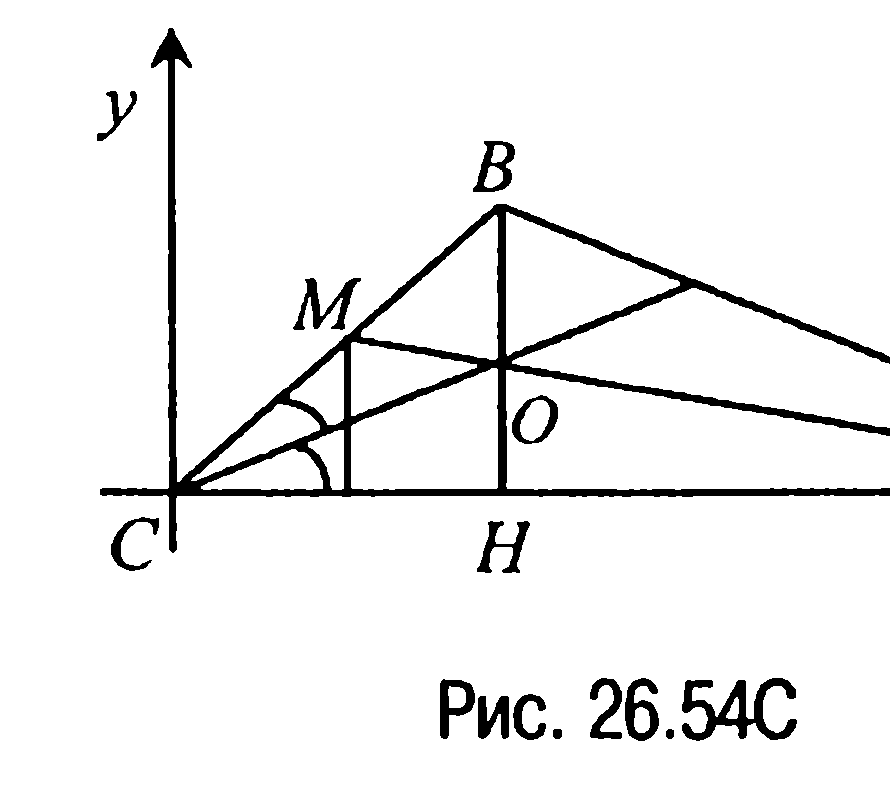

ки на прямой $AM$ выберем точку $O$. В результате последнее соотношение перепишется в виде

$$\frac{a \cdot \cos\gamma - b}{a \cdot \cos\gamma - 2b} = \frac{\operatorname{tg} \frac{\gamma}{2} \cdot \cos\gamma}{\sin\gamma}.$$

Замечая теперь, что

$$\cos\gamma = \frac{a^2 + b^2 - c^2}{2ab}, \quad \operatorname{tg} \frac{\gamma}{2} = \frac{\sin \frac{\gamma}{2}}{\cos \frac{\gamma}{2}} = \frac{2\sin^2 \frac{\gamma}{2}}{2\sin \frac{\gamma}{2} \cdot \cos \frac{\gamma}{2}} = \frac{1 - \cos\gamma}{\sin\gamma},$$

имеем

$$\frac{a^2 - b^2 - c^2}{a^2 - 3b^2 - c^2} = \frac{a^2 + b^2 - c^2}{a^2 + 2ab + b^2 - c^2}$$

или, упрощая, $a \cdot (a^2 - b^2 - c^2) = b \cdot (c^2 - a^2 - b^2)$.

**Ответ:** $a \cdot (a^2 - b^2 - c^2) = b \cdot (c^2 - a^2 - b^2)$ или $c^2 = a^2 + b^2 - \frac{2ab^2}{a + b}$.

**26.51С.** Пусть $L$ — середина отрезка $AM$, $N$ — точка пересече-

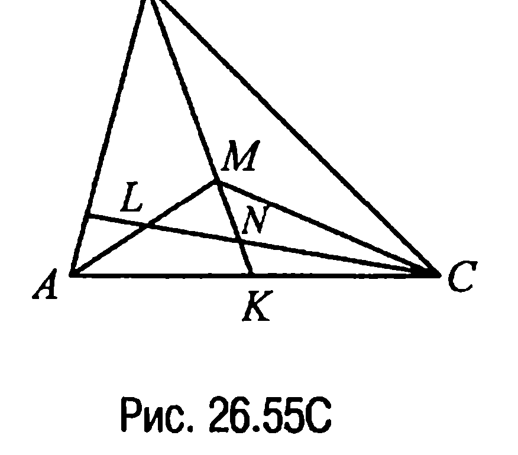

ния медианы $BK$ треугольника $ABC$ с прямой $CL$ (рис. 26.55С).
Рассмотрим треугольник $AMC$. В этом треугольнике отрезки $MK$ и $CL$ — медианы, а $N$ — точка их пересечения. Поэтому

$$\frac{KN}{NM} = \frac{1}{2}, \text{ а } \frac{KN}{KM} = \frac{1}{3}$$

Далее, так как по условию $M$ — точка пересечения медиан треугольника $ABC$, то

$$\frac{KM}{BM} = \frac{1}{2}, \text{ а } \frac{KM}{BK} = \frac{1}{3}.$$

Но в таком случае $\frac{KN}{BK} = \frac{KM}{BK} \cdot \frac{KN}{KM} =$

---
**стр. 543**
---

$=\frac{1}{3}\cdot\frac{1}{3}=\frac{1}{9}$ и, значит, $\frac{BK}{KN}=9$ или $\frac{BN+NK}{KN}=\frac{BN}{KN}+1=9$, откуда $\frac{KN}{NB}=\frac{1}{8}$.

**Ответ:** $1 : 8$ ($8 : 1$).

**26.52C.** Поскольку $\angle BCD=\angle BAD$, а $\angle CBA=\angle CDA$ (рис. 26.56C), то треугольники $CMB$ и $AMD$ подобны и, значит, $\frac{S_{\triangle CMB}}{S_{\triangle AMD}}=\left(\frac{MB}{MD}\right)^2=\frac{1}{9}$.

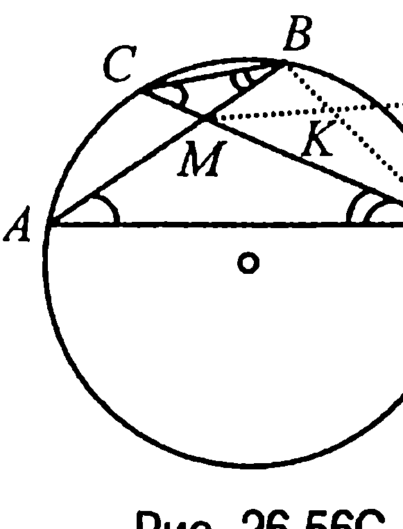

А тогда если $K$ — точка пересечения хорды $BD$ с биссектрисой угла $BMD$, то по свойству биссектрисы $\frac{BK}{KD}=\frac{MB}{MD}=\frac{1}{3}$.

**Ответ:** $1 : 3$ ($3 : 1$).

**26.53C.** Пусть $P$, $Q$ и $N$ — точки касания данной окружности со сторонами $AB$, $BC$ и $CA$ треугольника $ABC$ соответственно (рис. 26.57C), $F$ и $E$ — такие точки пересечения окружности с медианой $AM$, что $AF=FE=EM=x$ и $AB=a$.

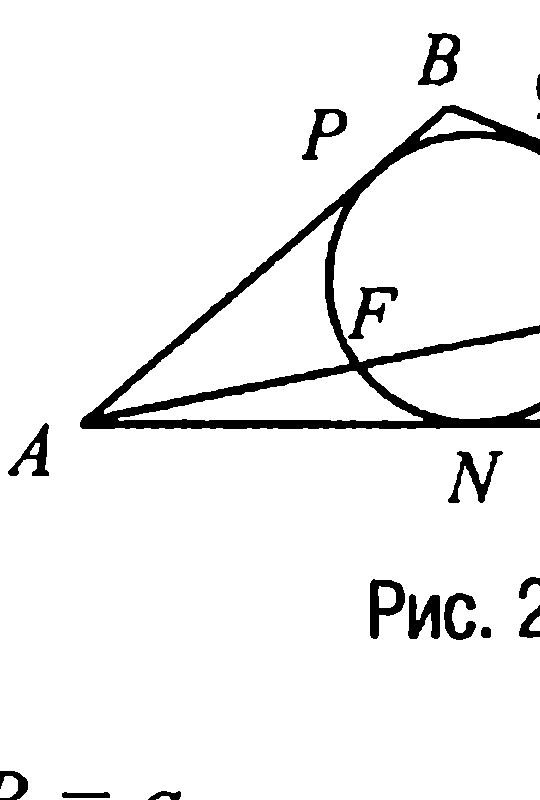

Из свойства касательной и секущей тогда следует, что $AP=AN=QM=x\sqrt{2}$. По свойству же касательных $BP=BQ$ и, следовательно, $BM=AB=a$. Замечая теперь, что $M$ — серединная точка отрезка $BC$, приходим к выводу, что $BC=2a$.

Выразим теперь сторону $AC$ через $x$ и $a$. Это легко сделать, если заметить, что $NC=QC=QM+MC=x\sqrt{2}+a$, поскольку $AC=AN+NC$ и, значит, $AC=x\sqrt{2}+x\sqrt{2}+a=2\sqrt{2}x+a$.

---
**стр. 544**
---

Выразим $x$ через $a$. Для этого достроим треугольник $ABC$ до параллелограмма $ABDC$ (рис. 26.58C) и воспользуемся тем фактом, что $AD^2+BC^2=2(AB^2+AC^2)$

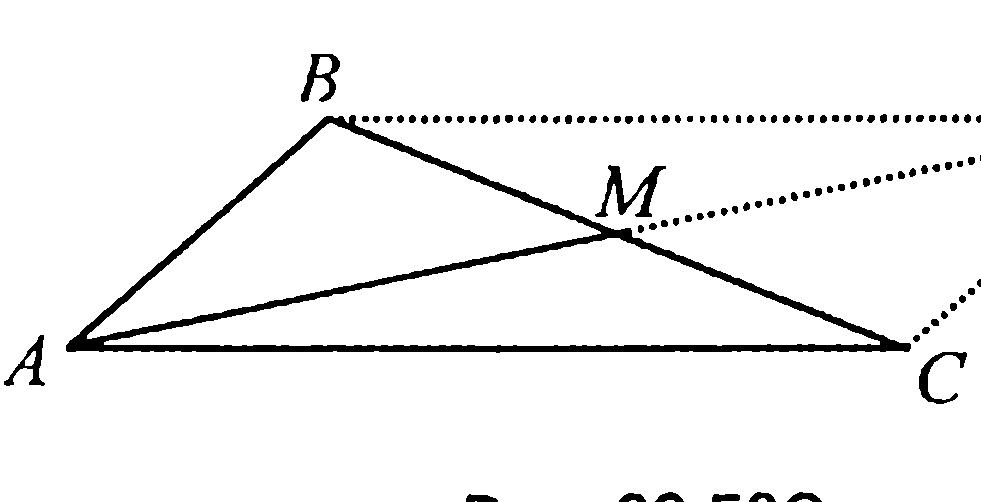

или $4AM^2+BC^2=2AB^2+2AC^2$, или $5x^2-2\sqrt{2}\cdot ax=0$. Решая полученное уравнение относительно $x$, находим, что $x=\frac{2\sqrt{2}\cdot a}{5}$. Но в таком случае $AC=\frac{13a}{5}$ и, таким образом, $AB:BC:AC=5:10:13$.

**Ответ:** $5 : 10 : 13$.

**26.54C.** Пусть $\angle ABC=\beta$, $R$ — радиус описанной около треугольника окружности, а $M$ — основание перпендикуляра, опущенного из точки $O$ на прямую $BC$ (рис. 26.59C). Тогда $\angle CAO=\angle HAB=90^\circ-\beta$, и, следовательно, биссектриса угла $CAB$ является и биссектрисой угла $OAH$. Отсюда следует, что отрезок $AL$ — биссектриса треугольника $OAH$.

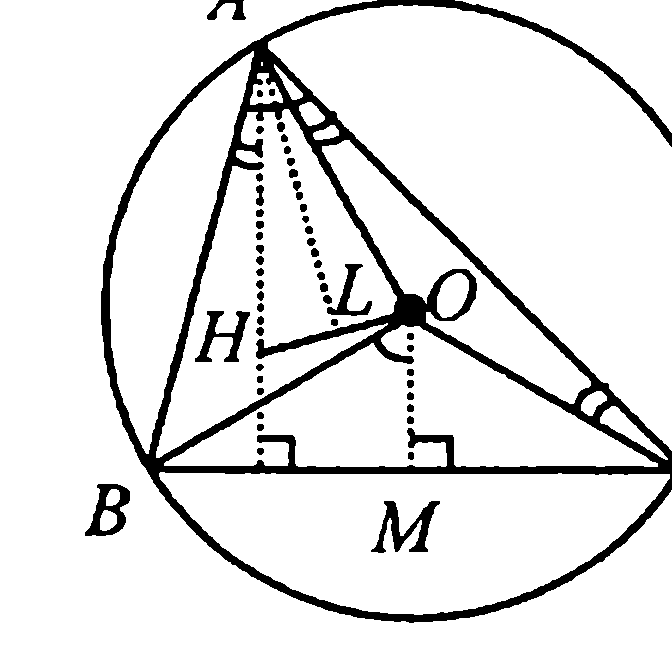

Далее, $AH=2OM$ (задача 7.9), по условию же $\angle CAB=60^\circ$, значит и $\angle MOB=60^\circ$. Но в таком случае $OM=R/2$ и, таким образом, $AH=R$. Замечая теперь, что $AO=R$, приходим к выводу, что треугольник $OAH$ — равнобедренный. Тогда его биссектриса $AL$ является и медианой, а поэтому $OL:LH=1:1$.

**Ответ:** $OL : LH = 1 : 1$.

**26.55C.** Пусть точка $Q$ — точка отрезка $AC$ такая, что $DQ\parallel BE$ (рис. 26.60C). Тогда $\frac{AL}{LD}=\frac{AE}{EQ}$. С другой стороны, $AE=\frac{p}{p+q}\cdot AC$, $EC=\frac{q}{p+q}\cdot AC$. Замечая теперь, что $EQ:QC=BD:DC=n:m$, находим $EQ=\frac{n}{n+m}\cdot EC=$

---
**стр. 545**
---

$=\frac{nq}{(n+m)(p+q)}\cdot AC$. Но в таком случае $\frac{S_{\triangle ALB}}{S_{\triangle BLD}}=\frac{AL}{LD}=\frac{p(n+m)}{nq}$.

**Ответ:** $\frac{S_{\triangle ALB}}{S_{\triangle BLD}}=\frac{p(n+m)}{nq}$.

**26.56C.** Из подобия треугольников $APK$ и $CBK$ (рис. 26.61C) следует, что $\frac{AP}{BC}=\frac{AK}{KC}=\frac{m}{n}$, откуда $AP=\frac{m}{n}\cdot BC$. Но тогда $AD=BC+2AP=BC\left(1+2\frac{m}{n}\right)=BC\cdot\frac{n+2m}{n}$ и, значит, $BC=\frac{n}{n+2m}\cdot AD$. Отсюда приходим к выводу, что $\frac{S_{\triangle ABC}}{S_{\triangle ACD}}=\frac{BC}{AD}=$

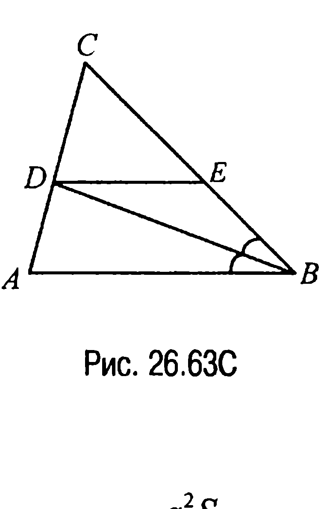

$=BC:\frac{n+2m}{n}\cdot BC=\frac{n}{n+2m}$.

**Ответ:** $\frac{n}{n+2m}$.

**26.57C.** Из подобия треугольников $DEC$ и $ABC$ (рис. 26.62C) следует, что $\frac{DC}{AC}=\frac{EC}{BC}$ или $DC\cdot BC=AC\cdot EC$. Но тогда

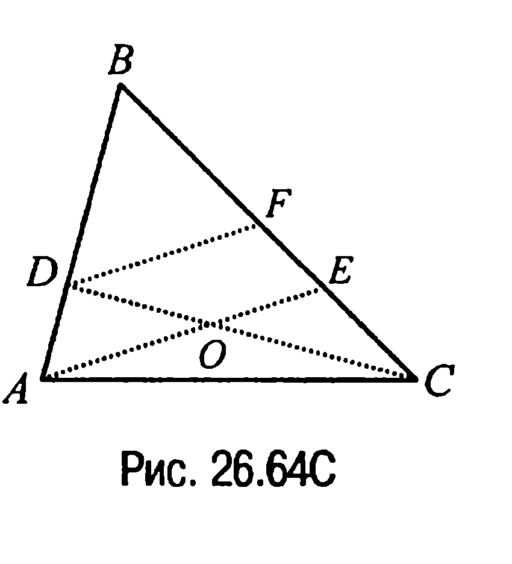

$S_{\triangle ABC}\cdot S_{\triangle DEC}=\left(\frac{1}{2}AC\cdot BC\cdot\sin\angle BCA\right)\times\left(\frac{1}{2}DC\cdot EC\cdot\sin\angle BCA\right)=$

$=\frac{1}{4}AC\cdot EC\cdot DC\cdot BC\cdot\sin^2\angle BCA=\left(\frac{1}{2}AC\cdot EC\cdot\sin\angle ECA\right)^2=S^2_{\triangle AEC}$ и, значит, $S_{\triangle AEC}=\sqrt{S_{\triangle ABC}\cdot S_{\triangle DEC}}$,

что и требовалось доказать.

---
**стр. 546**
---

**26.58C.** Так как $BD$ — биссектриса угла $ABC$ (рис. 26.63C), то $\dfrac{DC}{AD} = \dfrac{BC}{AB} = \dfrac{a}{c}$. С другой стороны, $\dfrac{S_{\triangle DBC}}{S_{\triangle ABD}} = \dfrac{DC}{AD} = \dfrac{a}{c}$ и, значит, $S_{\triangle DBC} = \dfrac{a}{c} \cdot S$. Рассматривая теперь треугольники $DEC$ и $DBE$, находим, что $\dfrac{S_{\triangle DEC}}{S_{\triangle DBE}} = \dfrac{EC}{BE} = \dfrac{DC}{AD} = \dfrac{a}{c}$ и, следовательно, $S_{\triangle DEC} = \dfrac{a}{a+c} \cdot S_{\triangle DBC} = \dfrac{a^2 S}{c(a+c)}$.

**Ответ:** $\dfrac{a^2 S}{c(a+c)}$.

**26.59C.** Пусть $S_0$, $S_1$ и $S_2$ — площади треугольников $ADO$, $ADC$ и $BCD$ соответственно (рис. 26.64C). Тогда учитывая, что $S_2 = S - S_1$, а $\dfrac{S_1}{S_2} = \dfrac{AD}{DB} = m$, находим, что $S_1 = \dfrac{mS}{m+1}$. Определим теперь отношение $\dfrac{DO}{OC}$. Для этого проведем через точку $D$ прямую, параллельную прямой $AE$, и обозначим через $F$ точку пересечения этой прямой с отрезком $BC$. По обобщенной теореме Фалеса $\dfrac{DO}{OC} = \dfrac{FE}{EC}$. А так как $\dfrac{EF}{FB} = \dfrac{AD}{DB} = m$ и, значит, $FB = \dfrac{EF}{m}$, а $BE = BF + FE = \dfrac{m+1}{m} \cdot FE$, то $\dfrac{BE}{EC} = \dfrac{(m+1) \cdot FE}{m \cdot EC} = n$. Отсюда следует, что $\dfrac{DO}{OC} = \dfrac{FE}{EC} = \dfrac{m \cdot n}{m+1}$. Но в таком случае искомая площадь $S_0$ находится из пропорции $\dfrac{S_0}{S_1 - S_0} = \dfrac{mn}{m+1}$, если учесть, что $S_1 = \dfrac{mS}{m+1}$. Решая эту пропор-

---
**стр. 547**
---

цию относительно $S_0$, получаем, что $S_0 = \dfrac{n \cdot m^2 \cdot S}{(m + 1) \cdot (mn + n + 1)}$.

**Ответ:** $\dfrac{n \cdot m^2 \cdot S}{(m + 1) \cdot (mn + n + 1)}$.

**26.60C.** На стороне $AB$ треугольника $ABC$ отметим точку $K$ такую, что $DK \parallel CF$ (рис. 26.65C). Тогда $\dfrac{AF}{FK} = \dfrac{AE}{ED} = \dfrac{1}{2}$, $\dfrac{FK}{KB} = \dfrac{CD}{DB} = \dfrac{1}{1}$ и, таким образом, $AF : FK : KB = 1 : 2 : 2$. Далее, поскольку $S_{\triangle ADB} = \dfrac{1}{2} S_{\triangle ABC} = 15$, $S_{\triangle ADK} = \dfrac{3}{5} S_{\triangle ADB} = 9$, то из подобия треугольников $AEF$ и $ADK$ следует, что $\dfrac{S_{\triangle AEF}}{S_{\triangle ADK}} = \left(\dfrac{AE}{AD}\right)^2 = \left(\dfrac{1}{3}\right)^2 = \dfrac{1}{9}$ и, значит, $S_{\triangle AEF} = \dfrac{1}{9} S_{\triangle ADK} = \dfrac{1}{9} \cdot 9 = 1$.

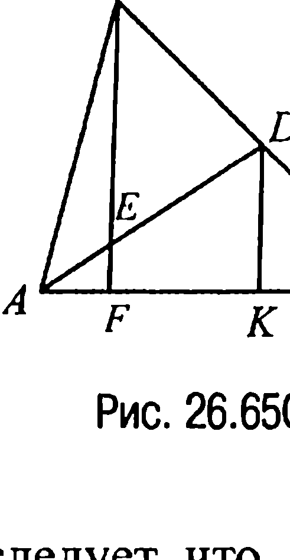

**Ответ:** $1$.

**26.61C.** Пусть в треугольнике $ABC$ (рис. 26.66C) угол $ACB$ равен $90^\circ$, $AC = b$, $BC = a$. Обозначим через $r$ радиус вписанной в треугольник $ABC$ окружности. Тогда по теореме 17.8 площадь треугольника $ABC$ — это $S_{\triangle ABC} = p \cdot r = \dfrac{1}{2}(a + b + 6) \cdot r = \dfrac{1}{2}(a + b + 6) \cdot 1 = \dfrac{1}{2}(a + b + 6)$. По свойству же 1.23 имеем $a + b = 2(r + R)$, где $R$ — радиус описанной около прямоугольного треугольника окружности, и, значит, в соответствии со свойством 1.22 находим, что $a + b = 2(1 + 3) = 8$. Таким образом, $S_{\triangle ABC} = \dfrac{1}{2}(8 + 6) = 7$.

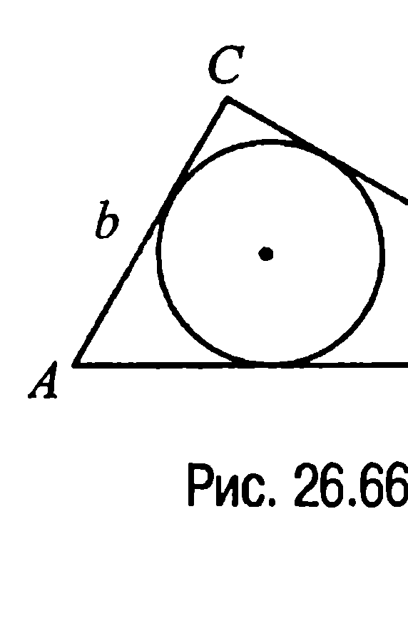

**Ответ:** $7$.

---
**стр. 548**
---

**26.62C.** Так как в треугольнике $CEM$ (рис. 26.67C) известны $\angle ECM = \dfrac{\pi}{4}$ и сторона $CM = \dfrac{3}{2}$, то решение задачи сводится, по существу, к нахождению стороны $CE$.

Дальнейшие рассуждения здесь следующие. В прямоугольном треугольнике $ABC$ сторона $AB = \sqrt{3^2 + 4^2} = 5$. По свойству же биссектрисы $\dfrac{AD}{DB} = \dfrac{AC}{BC} = \dfrac{4}{3}$ и поскольку $AD + DB = AB$, то $AD = 20/7$, $DB = 15/7$. Далее (задача 8.4), биссектриса $CD =$

$$= \frac{2 \cdot BC \cdot AC \cdot \cos\frac{\pi}{4}}{BC + AC} = \frac{2 \cdot 3 \cdot 4 \cdot \frac{\sqrt{2}}{2}}{3 + 4} = \frac{12\sqrt{2}}{7}.$$

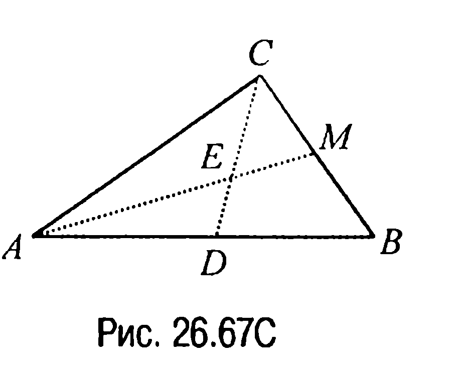

По теореме же Менелая, примененной к треугольнику $BCD$ и секущей $MA$, справедливо равенство $\dfrac{BM}{MC} \cdot \dfrac{CE}{ED} \cdot \dfrac{DA}{AB} = 1$ или равенство $\dfrac{1}{1} \cdot \dfrac{CE}{ED} \cdot \dfrac{20/7}{5} = 1$, откуда следует, что $\dfrac{CE}{ED} = \dfrac{7}{4}$. Замечая теперь, что $CE + ED = CD$, находим $CE = \dfrac{12\sqrt{2}}{11}$.

А в таком случае площадь треугольника $CEM$ вычисляется по формуле $S_{\triangle CEM} = \dfrac{1}{2} \cdot CE \cdot CM \cdot \sin\angle ECM = \dfrac{1}{2} \cdot \dfrac{12\sqrt{2}}{11} \cdot \dfrac{3}{2} \cdot \dfrac{\sqrt{2}}{2} = \dfrac{9}{11}$.

**Ответ:** $\dfrac{9}{11}$.

**26.63C.** Пусть в прямоугольном треугольнике $ABC$ с прямым углом $ACB$ (рис. 26.68C) гипотенуза $AB = c$, а катеты $AC = b$, $BC = a$. Тогда площади кругов, построенных на сторонах $a$, $b$ и $c$ треугольника, равны соответственно $\dfrac{\pi a^2}{4}$, $\dfrac{\pi b^2}{4}$ и $\dfrac{\pi c^2}{4}$, а сумма

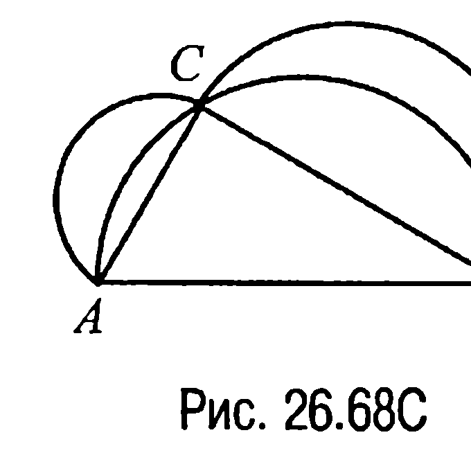

---
**стр. 549**
---

площадей двух заштрихованных луночек (рис. 26.68С)

$$S = \frac{\pi a^2}{8} + \frac{\pi b^2}{8} + S_{\triangle ABC} - \frac{\pi c^2}{8} = \frac{\pi}{8}(a^2 + b^2 - c^2) + S_{\triangle ABC}.$$

Но поскольку в прямоугольном треугольнике $a^2 + b^2 = c^2$, то приходим к выводу, что $S = S_{\triangle ABC}$, а это и требовалось доказать.

**26.64С.** Пусть окружности радиусов $R$ и $r$ с центрами в точках $O_1$ и $O_2$ соответственно пересекаются в точках $A$ и $B$, $\angle AO_1B = 2\varphi$, $\angle AO_2B = 2\psi$ (рис. 26.69С).

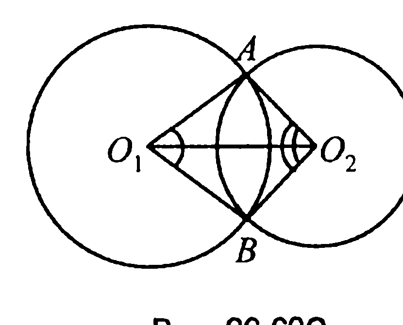

Тогда если $S$ — искомая площадь, $S_{AO_1B} = R^2 \cdot \varphi$ — площадь сектора, определяемого углом $2\varphi$, $S_{AO_2B} = r^2 \cdot \psi$ — площадь сектора, определяемого углом $2\psi$,

$$S_{O_1AO_2B} = 2S_{\triangle O_1AO_2} = 2 \cdot \frac{1}{2} \cdot R \cdot d \cdot \sin\varphi = R \cdot d \cdot \sin\varphi, \text{ то}$$

$$S = S_{AO_1B} + S_{AO_2B} - S_{O_1AO_2B} \text{ или } S = R^2 \cdot \varphi + r^2 \cdot \psi - R \cdot d \cdot \sin\varphi.$$

По теореме же косинусов из треугольников $O_1AO_2$ и $O_1BO_2$ соответственно находим, что

$$\cos\varphi = \frac{R^2 + d^2 - r^2}{2Rd}, \quad \cos\psi = \frac{d^2 + r^2 - R^2}{2rd}.$$

Следовательно, $S = R^2 \cdot \arccos \frac{R^2 + d^2 - r^2}{2Rd} + r^2 \cdot \arccos \frac{d^2 + r^2 - R^2}{2rd} -$

$$- R \cdot d \cdot \sqrt{1 - \left(\frac{d^2 + R^2 - r^2}{2Rd}\right)^2} = R^2 \cdot \arccos \frac{R^2 + d^2 - r^2}{2Rd} +$$

$$+ r^2 \cdot \arccos \frac{r^2 + d^2 - R^2}{2rd} - \frac{1}{2}\sqrt{4R^2d^2 - (R^2 + d^2 - r^2)^2}.$$

**Ответ:** $R^2 \cdot \arccos \frac{R^2 + d^2 - r^2}{2Rd} + r^2 \cdot \arccos \frac{r^2 + d^2 - R^2}{2rd} -$

$$- \frac{1}{2}\sqrt{4R^2d^2 - (R^2 + d^2 - r^2)^2}.$$

---
**стр. 550**
---

**Глава 9. Решения задач группы С**

**26.65С.** Пусть $\angle ABC = \beta$ (рис. 26.70С). Из условия задачи следует, что треугольник $DBE$ подобен треугольнику $ABC$, причем $\frac{DB}{BC} = \frac{BE}{AB} = \frac{DE}{AC} = \cos \beta$. Радиус описанной около треугольника $ABC$ окружности $R = AC/2\sin\beta$ и, значит, $\sin \beta = \frac{AC}{2R} = \frac{12}{2 \cdot \frac{9\sqrt{2}}{2}} = \frac{2\sqrt{2}}{3}$. Но тогда $\cos\beta = \sqrt{1 - \frac{8}{9}} = \frac{1}{3}$, откуда находим, что $\frac{S_{\triangle DBE}}{S_{\triangle ABC}} = \cos^2 \beta = \frac{1}{9}$. А в таком случае $S_{\triangle ABC} = 9 \cdot S_{\triangle DBE} = 9 \cdot 2 = 18$. Следовательно $S_{ADEC} = S_{\triangle ABC} - S_{\triangle DBE} = 18 - 2 = 16$.

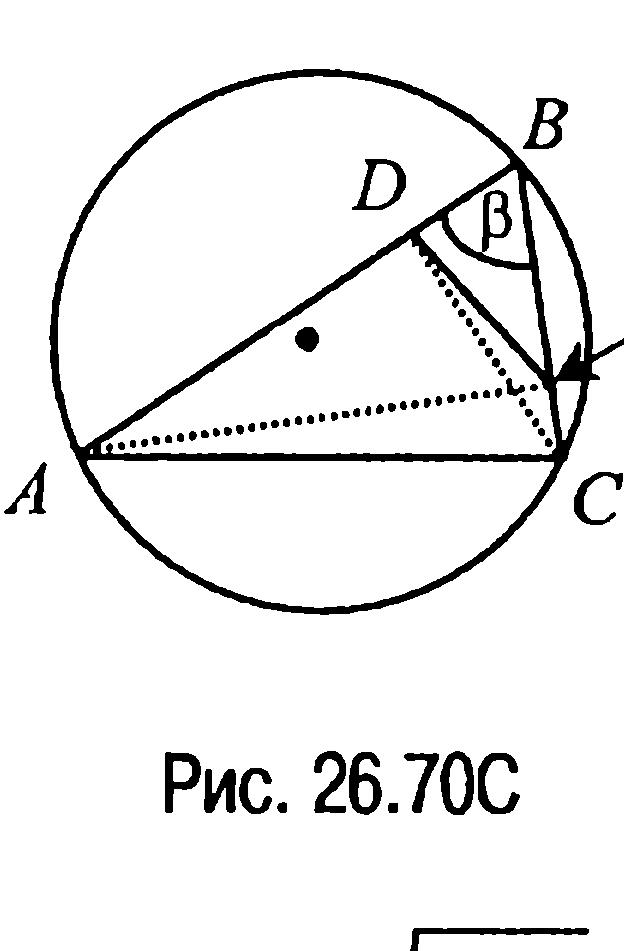

**Ответ:** $16$.

**26.66С.** Так как $AB$ и $BC$ — пересекающиеся прямые, которые касаются окружности в точках $D$ и $E$ соответственно, то $BD = BE$ (рис. 26.71С). При этом $\angle EDB = \angle BED$. По условию точки $A$, $C$, $E$ и $D$ лежат на одной окружности, поэтому $\angle DAC + \angle CED = \angle EDA + \angle ACE = 180^\circ$. Но тогда $\angle DAC = \angle ACE$ и, значит, $\angle EDA + \angle DAC = \angle CED + \angle ACE = 180^\circ$. Последнее означает, что четырехугольник $ACED$ — равнобочная трапеция, у которой $DA = CE$. Отсюда приходим к выводу, что $AB = BC = 13$. Воспользовавшись же формулой Герона, находим, что искомая площадь $S = \frac{15\sqrt{3}}{4}$.

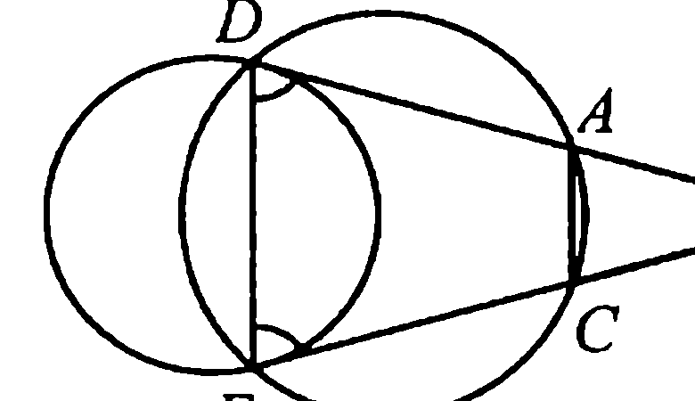

**Ответ:** $\frac{15\sqrt{3}}{4}$.

**26.67С.** Из условия задачи и свойства 19.1 следует, что $\frac{S_{\triangle ABN}}{S_{\triangle ABC}} = \frac{1}{3}$ и $\frac{S_{\triangle AMC}}{S_{\triangle ABC}} = \frac{1}{3}$ и, значит, $S_{\triangle ABN} = S_{\triangle AMC} = \frac{1}{3} S$.

---
**стр. 551**
---

Пусть, далее, $AK$ и $CL$ — высоты треугольников $ABD$ и $BDC$ соответственно (рис. 26.72С). Тогда так как отношение площадей треугольников с общим основанием равно отношению высот треугольников, опущенных на это основание или его продолжение, то $\frac{S_{\triangle ABD}}{S_{\triangle BDC}} = \frac{AK}{CL}$, а поскольку из подобия прямоугольных треугольников $AKN$ и $NLC$ и условия задачи вытекают равенства $\frac{AK}{CL} = \frac{AN}{NC} = \frac{1}{2}$, то приходим к выводу, что $S_{\triangle ABD} = \frac{1}{2} S_{\triangle BDC}$.

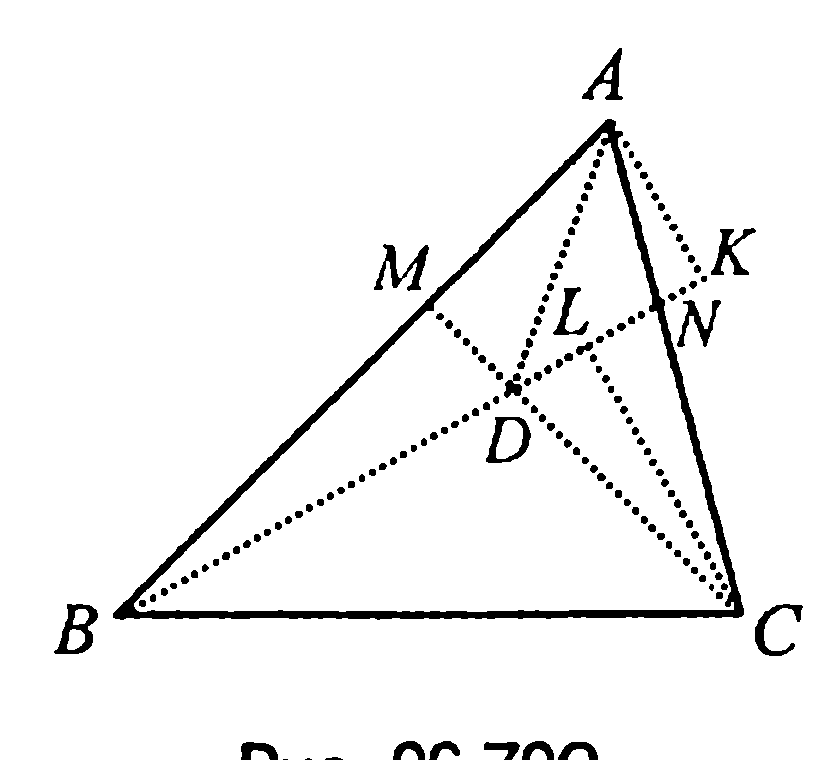

Аналогично получаем равенство $S_{\triangle ACD} = \frac{1}{2} S_{\triangle BDC}$. Теперь так как $S_{\triangle ABC} = S_{\triangle ABD} + S_{\triangle ACD} + S_{\triangle BDC}$ и, следовательно, $S_{\triangle BDC} = \frac{1}{2} S_{\triangle ABC} = \frac{1}{2} S$, то площадь четырехугольника $AMDN$ — это $S_{AMDN} = S_{\triangle ABN} + S_{\triangle BDC} + S_{\triangle AMC} - S_{\triangle ABC} = \left(\frac{1}{3} + \frac{1}{2} + \frac{1}{3} - 1\right) S = \frac{1}{6} S$.

**Ответ:** $\frac{1}{6} S$.

**26.68С.** Пусть $\angle CAB = \alpha$, $\angle ABC = \beta$, $\angle BCA = \gamma$. Тогда по теореме синусов $AB = BC \cdot \frac{\sin \gamma}{\sin \alpha}$, $AC = BC \cdot \frac{\sin \beta}{\sin \alpha}$. По свойству же медианы $AC^2 + AB^2 = \frac{BC^2}{2} + 2m^2$.

Отсюда с учетом предыдущих двух соотношений находим, что $BC^2 = \frac{4m^2 \sin^2 \alpha}{2 \sin^2 \beta + 2 \sin^2 \gamma - \sin^2 \alpha}$. А тогда искомая площадь

---
**стр. 552**
---

**Глава 9. Решения задач группы С**

$$S = \frac{1}{2} AC \cdot AB \cdot \sin \alpha = \frac{1}{2} BC^2 \cdot \frac{\sin \beta \sin \gamma}{\sin^2 \alpha} = \frac{2m^2 \sin \alpha \sin \beta \sin \gamma}{2 \sin^2 \beta + 2 \sin^2 \gamma - \sin^2 \alpha}.$$

**Ответ:** $\frac{2m^2 \sin \alpha \sin \beta \sin \gamma}{2 \sin^2 \beta + 2 \sin^2 \gamma - \sin^2 \alpha}$.

**26.69С.** Пусть $F$ — основание высоты треугольника $ABC$, опущенной из вершины $C$ (рис. 26.73С). Тогда так как треугольник $BKA$ прямоугольный, то $KF^2 = AF \cdot FB$. Из подобия же треугольников $AFO$ и $CFB$ следует, что $\frac{AF}{FO} = \frac{CF}{FB}$ или $AF \cdot FB = CF \cdot FO$. Отсюда находим, что $KF^2 = CF \cdot FO$ и, значит, $KF = \sqrt{CF \cdot FO}$.

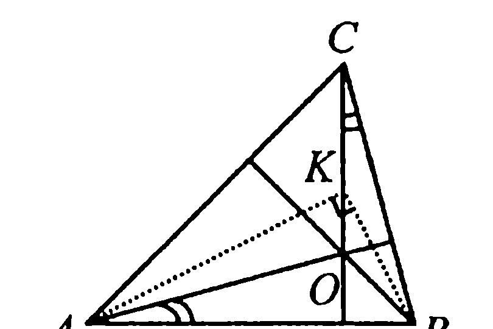

Но в таком случае $S_{\triangle BKA} = \frac{1}{2} AB \cdot KF = \frac{1}{2} AB \cdot \sqrt{CF \cdot FO} = \sqrt{\frac{1}{2} AB \cdot CF \cdot \frac{1}{2} AB \cdot FO} = \sqrt{S_1 \cdot S_2}$, что и требовалось доказать.

**26.70С.** Пусть прямые $KN$, $PQ$ и $EF$, проходящие через точку $M$ (рис. 26.74С), параллельны соответственно сторонам $BC$, $AB$ и $AC$ треугольника $ABC$. Пусть, далее, $S$, $S_1$, $S_2$ и $S_3$ — площади треугольников $ABC$, $EKM$, $MQF$ и $PMN$ соответственно.

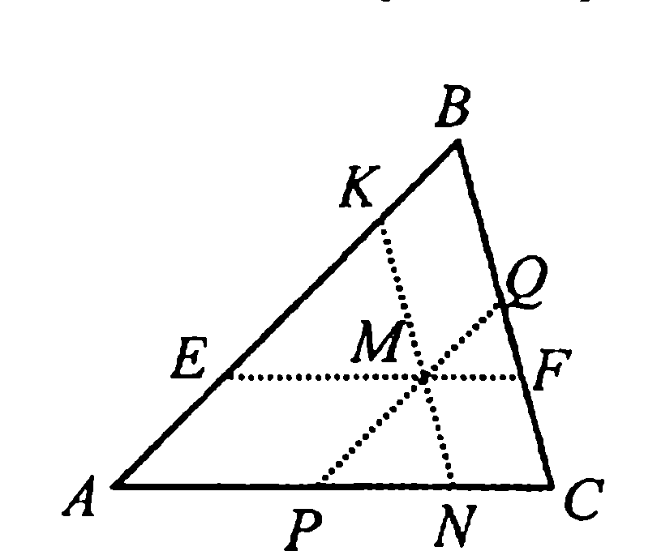

Тогда поскольку треугольники $EKM$, $MQF$ и $PMN$ подобны треугольнику $ABC$, то $\frac{S_1}{S} = \frac{EM^2}{AC^2}$, $\frac{S_2}{S} = \frac{MF^2}{AC^2}$, $\frac{S_3}{S} = \frac{PN^2}{AC^2}$. Отсюда находим $EM = \sqrt{\frac{S_1}{S}} \cdot AC$, $FM = \sqrt{\frac{S_2}{S}} \cdot AC$, $PN = \sqrt{\frac{S_3}{S}} \cdot AC$. Замечая теперь, что $EM = AP$, $MF = NC$, получаем, что $EM + PN + MF = AP + PN + NC = AC$ и, таким образом,
$$\left(\sqrt{\frac{S_1}{S}} + \sqrt{\frac{S_2}{S}} + \sqrt{\frac{S_3}{S}}\right) \cdot AC = AC \text{ или } \sqrt{\frac{S_1}{S}} + \sqrt{\frac{S_2}{S}} + \sqrt{\frac{S_3}{S}} = 1,$$

---
**стр. 553**
---

§ 26. Задачи группы С

или $\sqrt{S_1} + \sqrt{S_2} + \sqrt{S_3} = \sqrt{S}$, откуда $S = (\sqrt{S_1} + \sqrt{S_2} + \sqrt{S_3})^2$.

**Ответ:** $(\sqrt{S_1} + \sqrt{S_2} + \sqrt{S_3})^2$.

**26.71С.** Прежде всего выясним, какой из трех рисунков 26.75С,

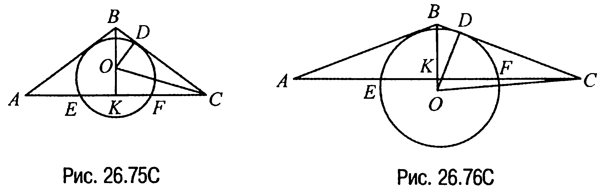

26.76С и 26.77С, где точка $O$ — центр вписанной в угол $ABC$ окружности, правильно иллюстрирует содержание задачи. Обозначим через $BK$ высоту треугольника $ABC$ (рис. 26.75С и рис. 26.76С) и рассмотрим треугольники $BDO$ и $BCK$. Эти прямоугольные треугольники имеют общий угол $KBC$ и, значит, они подобны.

Но тогда $\angle DOB = \angle BCK$ и, следовательно, $OD = OB \cdot \cos \angle DOB$. А так как $\angle DOB < \pi/2$, то значение косинуса угла $DOB$ положительно, причем $\cos \angle DOB = \frac{1}{\sqrt{1 + \operatorname{tg}^2 \angle DOB}}$.

Поэтому $OD = \frac{13}{24} \cdot \frac{1}{\sqrt{1 + \frac{25}{144}}} = \frac{1}{2}$ и $\operatorname{tg}\angle DCO = \frac{OD}{DC} = \frac{1}{2} : \frac{6}{5} = \frac{5}{12}$.

Но отсюда следует, что $\angle DCO = \angle DCK$. Таким образом, правильный рисунок — это рис. 26.77С.

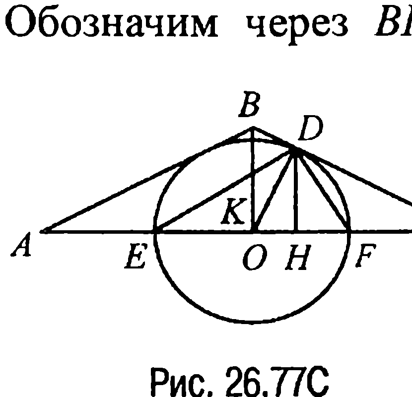

Пусть $DH$ — высота треугольника $EDF$. Тогда
$$DH = DC \cdot \sin \angle DCH = DC \cdot \frac{\operatorname{tg}\angle DCH}{\sqrt{1 + \operatorname{tg}^2 \angle DCH}} = \frac{6}{5} \cdot \frac{5}{12} \cdot \frac{1}{\sqrt{1 + \frac{25}{144}}} = \frac{6}{13}$$
и, следовательно, площадь треугольника $EDF$ — это

---
**стр. 554**
---

**Глава 9. Решения задач группы С**

$S = \frac{1}{2} EF \cdot DH = \frac{1}{2} 2OD \cdot DH = \frac{1}{2} \cdot \frac{6}{13} = \frac{3}{13}$.

**Ответ:** $\frac{3}{13}$.

**26.72С.** По свойству касательной и секущей $AD \cdot AB = AE \cdot AC$ (рис. 26.78С). Отсюда $AD = \frac{AE \cdot AC}{AB}$.

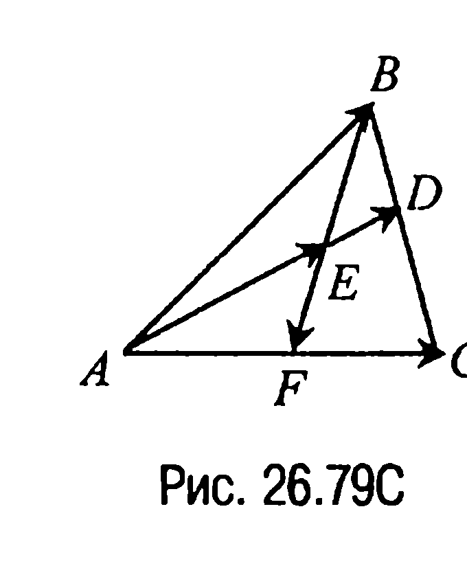

С другой стороны, $\frac{S_{\triangle ADE}}{S_{\triangle ABC}} = \frac{AD \cdot AE}{AB \cdot AC} = \frac{n}{m}$ или, с учетом предыдущего равенства, $\frac{AE^2}{AB^2} = \frac{n}{m}$.

Обозначим углы $ADC$ и $AEB$, опирающиеся на одну и ту же дугу $BC$, через $\phi$. Тогда $\operatorname{tg}\phi = \frac{AB}{AE} = \sqrt{\frac{m}{n}}$ и, значит, $\smile BC = 2\operatorname{arctg}\sqrt{\frac{m}{n}}$.

Далее, поскольку $\angle DAE = \frac{\pi}{2}$ и он измеряется полуразностью дуг $(2\pi - \smile DE)$ и $\smile BC$, т. е. $\frac{\pi}{2} = \frac{(2\pi - \smile DE) - \smile BC}{2}$ или $\frac{\pi}{2} = \frac{1}{2}(\smile DE + \smile BC)$, то $\smile DE = \pi - 2\operatorname{arctg}\sqrt{\frac{m}{n}} = 2\left(\frac{\pi}{2} - \operatorname{arctg}\sqrt{\frac{m}{n}}\right) = 2\operatorname{arcctg}\sqrt{\frac{m}{n}}$.

**Ответ:** $\smile BC = 2\operatorname{arctg}\sqrt{\frac{m}{n}}$, $\smile DE = 2\operatorname{arcctg}\sqrt{\frac{m}{n}}$.

**26.73С.** При решении воспользуемся понятием вектора. Итак, пусть $\overline{AB} = \overline{a}$, $\overline{AC} = \overline{b}$ (рис. 26.79С). Тогда $\overline{BC} = \overline{b} - \overline{a}$, $\overline{BD} = \frac{1}{3}(\overline{b} - \overline{a})$, $\overline{AD} = \overline{AB} + \overline{BD} = \overline{a} + \frac{1}{3}(\overline{b} - \overline{a}) = \frac{2}{3}\overline{a} + \frac{1}{3}\overline{b}$, $\overline{AE} = \frac{3}{4}\overline{AD} = \frac{1}{2}\overline{a} + \frac{1}{4}\overline{b}$, $\overline{BE} = \overline{AE} - \overline{AB} = -\frac{1}{2}\overline{a} + \frac{1}{4}\overline{b}$.

---
**стр. 555**
---

А так как $\overline{BF} \uparrow\uparrow \overline{BE}$, то $\overline{BF} = \lambda \overline{BE} = -\frac{\lambda}{2}\overline{a} + \frac{\lambda}{4}\overline{b}$, где $\lambda > 0$ — некоторая константа, и, значит, $\overline{AF} = \overline{BF} + \overline{AB} = \left(1 - \frac{\lambda}{2}\right)\overline{a} + \frac{\lambda}{4}\overline{b}$.

С другой стороны, поскольку $\overline{AF} \uparrow\uparrow \overline{AC}$, то $\overline{AF} = \mu \overline{AC}$, где $\mu > 0$ — некоторая константа, и, следовательно,

$$\left(1 - \frac{\lambda}{2}\right)\overline{a} + \frac{\lambda}{4}\overline{b} = \mu \overline{b}.$$

Но в таком случае задача сводится к системе

$$\begin{cases} 1 - \frac{\lambda}{2} = 0, \\ \frac{\lambda}{4} = \mu, \end{cases}$$

решая которую, находим, что $\lambda = 2$, а $\mu = \frac{1}{2}$ и, таким образом, $\overline{AF} = \frac{1}{2}\overline{AC}$, откуда следует, что $F$ — серединная точка отрезка $AC$ и поэтому $AF : FC = 1 : 1$.

**Ответ:** $AF : FC = 1 : 1$.

**26.74C.** Пусть в треугольнике $ABC$ стороны $BC = a$, $AC = b$, $AB = c$ и $a \le b \le c$. По условию $a = b - d$, $c = b + d$, где $d = b - a$. Тогда полупериметр треугольника $p = \frac{3b}{2}$, а его площадь $S = p \cdot r = \frac{3br}{2}$.

С другой стороны, $S = \frac{1}{2}b \cdot h_b$, где $h_b$ — высота треугольника, опущенная из вершины $B$. Но в таком случае $\frac{3br}{2} = \frac{bh_b}{2}$, откуда находим, что $h_b = 3r$.

**Ответ:** $3r$.

**26.75C.** Пусть в треугольнике $ABC$ сторона $BC = a$, $AC = b$, $AB = c$, $r$ — радиус вписанной в треугольник окружности, $h_b = 3r$ — высота, опущенная из вершины $B$.

---
**стр. 556**
---

Тогда поскольку, с одной стороны, площадь треугольника $S = \frac{1}{2}bh_b = \frac{3br}{2}$, а, с другой, $S = \frac{a+b+c}{2}r$, то $\frac{1}{2} \cdot 3br = \frac{1}{2}(a+b+c)r$, откуда находим, что $3b = a+b+c$ или $b = \frac{a+c}{2}$.

Последнее равенство и означает, что стороны треугольника образуют арифметическую прогрессию.

**26.76C.** Пусть $BP$ и $BK$ — высота и медиана треугольника $ABC$ соответственно (рис. 26.80C). Из точек $O$ и $M$ опустим на прямую $AC$ перпендикуляры $OQ$ и $ML$. Очевидно, что $OQ$ — радиус вписанной в треугольник $ABC$ окружности и $OQ = ML$. Из подобия треугольников $MKL$ и $BKP$ следует, что $\frac{BP}{ML} = \frac{BK}{MK} = 3$, откуда находим $BP = 3ML = 3OQ$.

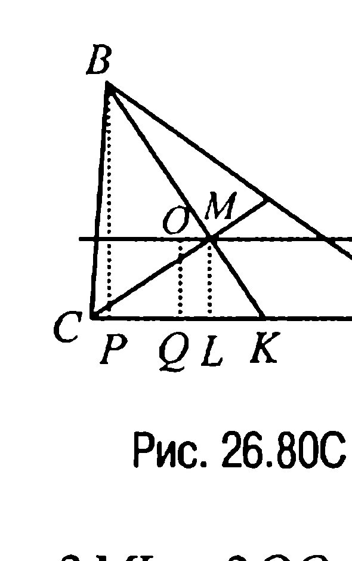

Но в таком случае стороны $BC$, $AC$ и $AB$ треугольника образуют арифметическую прогрессию (задача 26.75C), причем сторона $AC$ является средней по величине стороной треугольника. Значит, $AC = \frac{AB + BC}{2} = \frac{a+c}{2}$.

**Ответ:** $AC = \frac{a+c}{2}$.

**26.77C.** Пусть $BP$ и $BL$ — высота и биссектриса треугольника $ABC$ соответственно, $OQ$ — перпендикуляр, опущенный из точки $O$ на сторону $AC$ (рис. 26.81C). Очевидно, что $OQ$ — радиус вписанной в треугольник $ABC$ окружности. Из подобия треугольников $BPL$ и $OQL$ следует, что $\frac{BP}{OQ} = \frac{BL}{OL}$, откуда находим,

---
**стр. 557**
---

что $BP = \frac{BL}{OL} \cdot OQ = 3OQ$ (по условию $\frac{BO}{OL} = 2$ и, значит, $\frac{BL}{OL} = 3$).

Последнее равенство и означает (задачи 26.74C и 26.75C), что стороны треугольника образуют арифметическую прогрессию.

**26.78C** Пусть в треугольнике $ABC$ сторона $AC = b$, $CB = a$, $BA = c$ (рис. 26.82C), а $h_a$, $h_b$ и $h_c$ — высоты треугольника, опущенные из вершин $A$, $B$ и $C$ соответственно, и пусть $\angle CAB = \alpha$, $\angle ABC = \beta$, $\angle BCA = \gamma$. Тогда так как по расширенной теореме синусов $b = 2R\sin\beta$, то $h_a = b \cdot \sin\gamma = 2R \cdot \sin\beta \cdot \sin\gamma$.

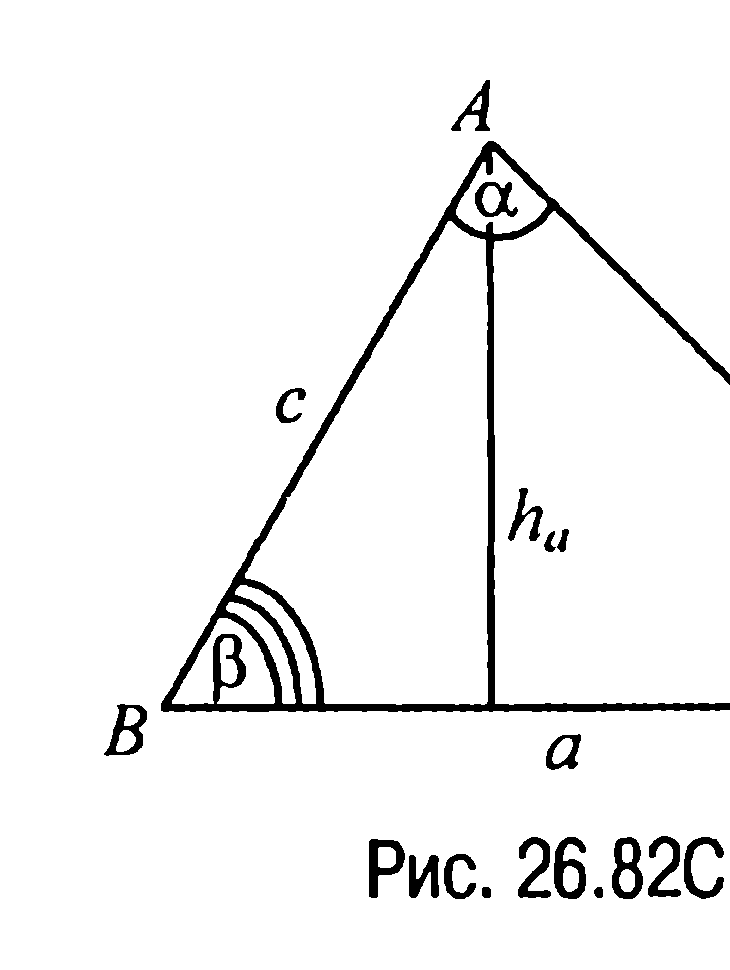

Аналогично, $h_b = 2R \cdot \sin\gamma \cdot \sin\alpha$, $h_c = 2R \cdot \sin\alpha \cdot \sin\beta$. Поэтому

$$\frac{1}{h_a} + \frac{1}{h_b} + \frac{1}{h_c} = \frac{1}{2R} \cdot \left(\frac{1}{\sin\beta \cdot \sin\gamma} + \frac{1}{\sin\gamma \cdot \sin\alpha} + \frac{1}{\sin\alpha \cdot \sin\beta}\right) =$$

$$= \frac{\sin\alpha + \sin\beta + \sin\gamma}{2R \cdot \sin\alpha \cdot \sin\beta \cdot \sin\gamma} = \frac{\sin\alpha + \sin\beta + \sin\gamma}{16R \cdot \sin\frac{\alpha}{2} \cdot \sin\frac{\beta}{2} \cdot \sin\frac{\gamma}{2} \cdot \cos\frac{\alpha}{2} \cdot \cos\frac{\beta}{2} \cdot \cos\frac{\gamma}{2}} =$$

$$= \frac{R(\sin\alpha + \sin\beta + \sin\gamma)}{S} = \frac{S}{r \cdot S} = \frac{1}{r}, \text{ что и требовалось доказать.}$$

**26.79C. Анализ.** Предположим, что искомый треугольник $ABC$ со сторонами $BC = a$, $AC = b$, $AB = c$ и высотами $h_a$, $h_b$, $h_c$, опущенными соответственно на стороны $a$, $b$, $c$, построен. Тогда его площадь $S_{\Delta ABC} = \frac{1}{2}a \cdot h_a = \frac{1}{2}b \cdot h_b = \frac{1}{2}c \cdot h_c$ и, значит, $\frac{b}{a} = \frac{h_a}{h_b}$, $\frac{c}{a} = \frac{h_a}{h_c}$. Другими словами, стороны треугольника $ABC$ обратно пропорциональны его высотам.

Отсюда следует, что можно построить три отрезка $a'$, $b'$, $c'$, которые будут пропорциональны соответственно сторонам треугольника $ABC$ и, таким образом, треугольник $A'B'C'$ со сторонами $a'$, $b'$, $c'$ будет подобен искомому треугольнику. Строятся же стороны

---
**стр. 558**
---

треугольника $A'B'C'$ при произвольно выбранной одной из них как четвертый пропорциональный отрезок (задача 25.19).

Итак, пусть треугольник $A'B'C'$ со сторонами $a', b', c'$ построен. Тогда определяются его высоты $h'_a, h'_b, h'_c$, а коэффициент $k$ его подобия искомому треугольнику — равенствами

$$k = \frac{h'_a}{h_a} = \frac{h'_b}{h_b} = \frac{h'_c}{h_c}$$

Но в таком случае треугольник $A'B'C'$ уже легко достроить до искомого треугольника.

**Построение.** Выберем произвольно отрезок $a'$ и затем по нему, высотам $h_a, h_b$ и $h_a, h_c$<!-- вероятная опечатка оригинала: повтор $h_a$ --> строим отрезки $b', c'$. Далее, по трем сторонам $a', b', c'$ строим треугольник $A'B'C'$. После этого из одной из его вершин, например, из вершины $B'$ (рис. 26.83C) опустим на основание $A'C'$ высоту $B'H$ и на луче, содержащем высоту $B'H$ отложим отрезок $HB = h_b$. Если теперь провести через точку $B$ прямые, параллельные боковым сторонам треугольника $A'B'C'$, то точки $A$ и $C$ пересечения этих прямых с прямой $A'C'$ окажутся второй и третьей вершинами искомого треугольника.

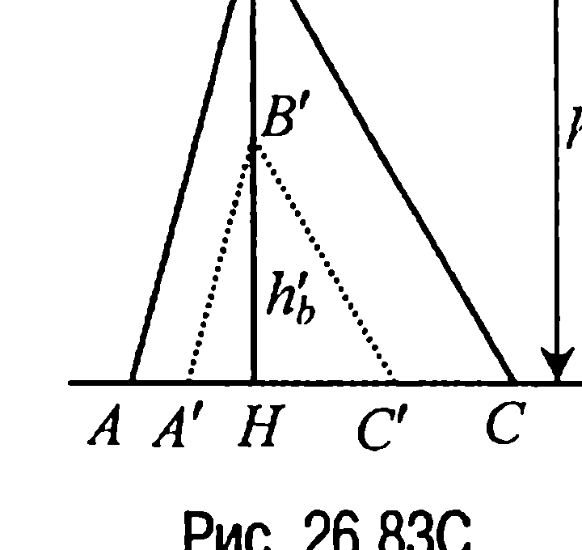

**Доказательство.** Очевидно, что, во-первых, построенный треугольник подобен иском<!-- вероятная опечатка оригинала: «искомуму» -->ому, поскольку он подобен треугольнику $A'B'C'$ (его стороны по построению параллельны сторонам треугольника $A'B'C'$), который, в свою очередь, подобен искомому треугольнику, так как их стороны соответственно пропорциональны.

Во-вторых, коэффициент подобия построенного и искомого треугольников равен 1 ввиду того, что высоты, опущенные из вершины $B$ в этих треугольниках, равны (по построению), а значит, указанные треугольники равны и поэтому построенный треугольник имеет данные высоты.

**Исследование.** Пусть для определенности $h_a \le h_b \le h_c$. Тогда поскольку $a = \frac{2S}{h_a}$, $b = \frac{2S}{h_b}$, $c = \frac{2S}{h_c}$, где $S$ — площадь треугольника

---
**стр. 559**
---

$ABC$, то $a \ge b \ge c$. Но в любом треугольнике $b + c > a$, поэтому задача имеет решение в том и только в том случае, когда

$$\frac{1}{h_b} + \frac{1}{h_c} > \frac{1}{h_a}.$$

**26.80C. Анализ.** Пусть искомый треугольник $ABC$ построен (рис. 26.84C), $CL = l$ — биссектриса, $BC = a$, $AC = b$ и пусть $BL = x$, $LA = y$, $\angle BCL = \phi$. Тогда, используя свойство биссектрисы и применяя теорему косинусов к треугольникам $BCL$ и $LCA$, получаем систему уравнений

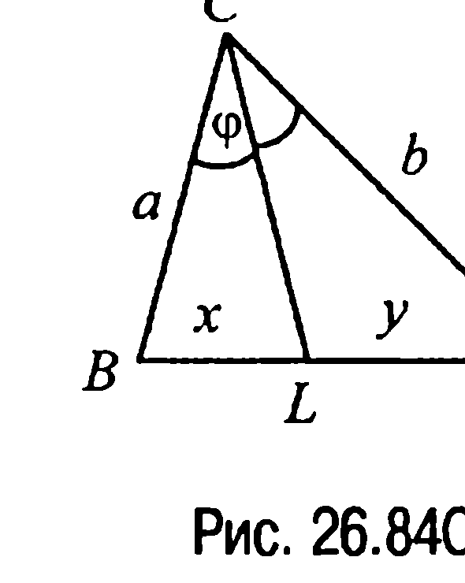

$$\begin{cases} \frac{x}{y} = \frac{a}{b}, \\ x^2 = a^2 + l^2 - 2al \cos \phi, \\ y^2 = b^2 + l^2 - 2bl \cos \phi. \end{cases}$$

После несложных вычислений находим, что

$$x = \sqrt{a^2 - \frac{al^2}{b}} = \sqrt{a^2 - \left( \frac{\sqrt{ab} \cdot l}{b} \right)^2}.$$

Пусть $\sqrt{ab} = p$, $\frac{p \cdot l}{b} = q$. Построив при таких обозначениях отрезок $p$ как среднее геометрическое и отрезок $q$ как четвертый пропорциональный отрезок, мы можем построить и отрезок $x = \sqrt{a^2 - q^2}$ как катет прямоугольного треугольника с данной гипотенузой $a$ и данным катетом $q$.

Но в таком случае построение искомого треугольника становится очевидным.

**Построение.** Сначала строим треугольник $BCL$ (по трем сторонам $a$, $l$ и $x$). Третья же вершина $A$ искомого треугольника строится как точка пересечения луча $BL$ с окружностью радиуса $b$ с центром в точке $C$.

**Доказательство** очевидно (оно вытекает из анализа и построения).

---
**стр. 560**
---

**Исследование.** Из выписанной выше системы следует, что

$$y = \sqrt{b^2 - \frac{bl^2}{a}}.$$

А тогда ясно, что задача имеет решение тогда и только тогда, когда выполняются условия

$$\begin{cases} a^2 - \frac{al^2}{b} > 0, \\ b^2 - \frac{bl^2}{a} > 0, \\ 0 < \cos \phi < 1. \end{cases}$$

Но поскольку $\cos \phi = \frac{a^2 + l^2 - x^2}{2al} = \frac{(a + b)l}{2ab}$, то приходим к системе

$$\begin{cases} l < \sqrt{ab}, \\ l < \frac{2ab}{a+b} \end{cases}$$

или, с учетом неравенства $\frac{2ab}{a+b} \le \sqrt{ab}$, к неравенству

$$l < \frac{2ab}{a+b},$$

которое и является единственным условием, при выполнении которого задача имеет решение.

**26.81С.** Решим задачу методом подобия. Именно, пусть $AK$ — произвольный отрезок стороны треугольника $ABC$ (рис. 26.85С). Отложим на стороне $BC$ отрезок $CL = AK$ и затем через точку $L$ проведем прямую, параллельную прямой $AC$. Пусть $P$ — точка пересечения построенной прямой и отрезка $AB$.

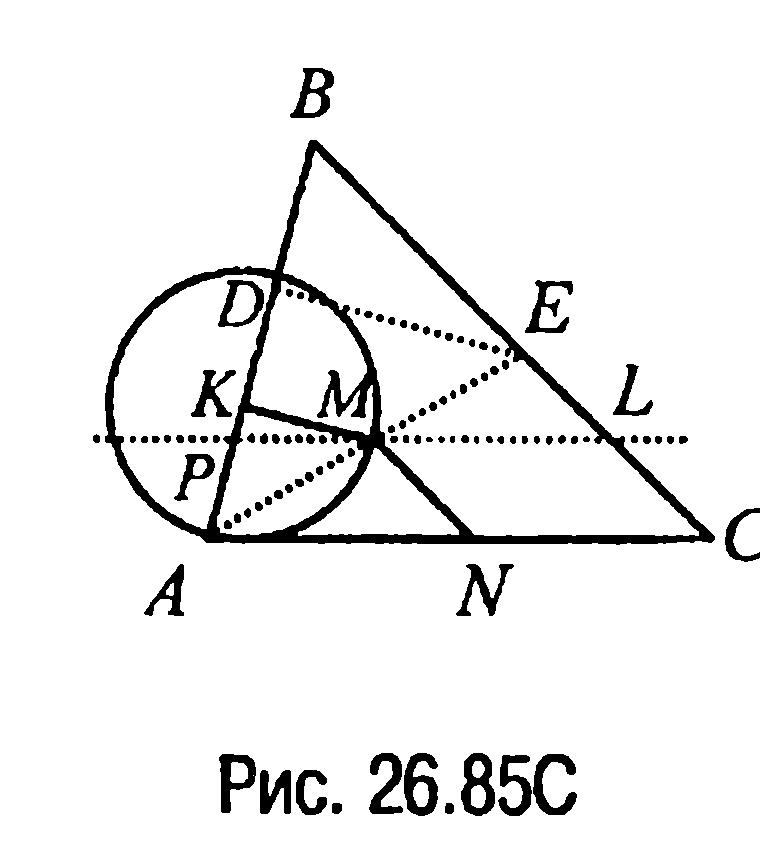

Далее, из точки $K$ как центра проведем окружность радиуса $KA$. Пусть $M$ — точка пересечения этой окружности с прямой $PL$. Соединим точки $M$ и $K$ и проведем через точку $M$ прямую, параллельную прямой $BC$. Пусть $N$ — точка пересечения этой прямой с прямой $AC$. Тогда $AK = KM = MN$, так как $MN = LC = AK$.

Продолжим теперь отрезок $AM$ до пересечения с отрезком $BC$ в точке $E$ и через точку $E$ проведем прямую, параллельную прямой $KM$ и пересекающую прямую $AB$ в точке $D$.

---
**стр. 561**
---

Очевидно, что четырехугольник $ADEC$ подобен четырехугольнику $AKMN$, а следовательно, $AD = DE = EC$ ($AK = KM = MN$).

**26.82C.** Предположим, что $C$ — искомая точка, $\angle BCN = \phi$ (рис. 26.86C). Тогда по условию $\angle ACM = 2\phi$. Если теперь построить точку $O$, симметричную точке $B$ относительно прямой $MN$, то на прямой $OC$ будет лежать биссектриса угла $ACM$ и, значит, точка $O$ окажется равноудаленной от прямых $MN$ и $AC$. Последнее означает, что прямая $AC$ является касательной к окружности с центром $O$, касающейся прямой $MN$.

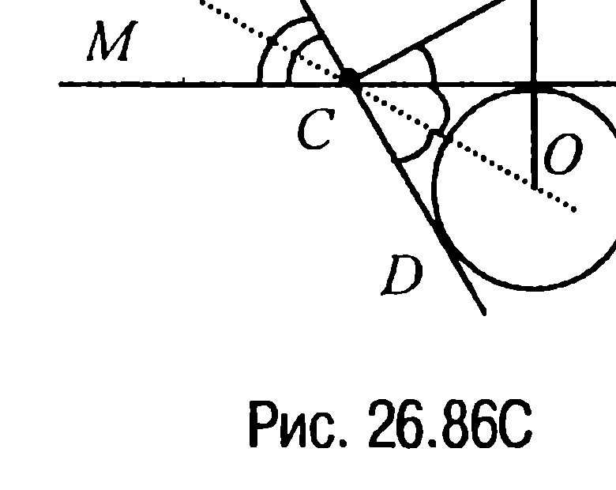

Таким образом, точка $C$ находится следующим образом. Сначала строим точку $O$, симметричную точке $B$ относительно прямой $MN$, затем проводим окружность радиуса $\frac{1}{2} BO$ с центром в точке $O$ и, наконец, строим касательную $AD$ к построенной окружности. Искомой точкой $C$ будет точка пересечения прямых $MN$ и $AD$.

**26.83C.** Пусть треугольник $ABC$ с основанием $AB = c$ и биссектрисой $CD = l$ (рис. 26.87C) — искомый треугольник.

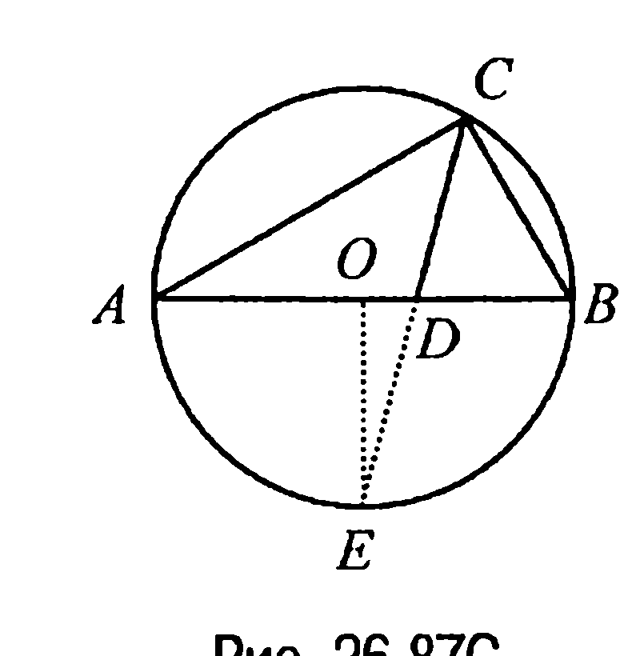

Опишем около данного треугольника окружность с центром $O$ и радиусом $R = c/2$ и затем продолжим биссектрису $l$ до пересечения с окружностью в точке $E$. Тогда очевидно, что отрезок $OE$ будет лежать на прямой, перпендикулярной отрезку $AB$. По свойству пересекающихся хорд $CD \cdot DE = AD \cdot DB$ или, поскольку $OD^2 = DE^2 - OE^2$,

$$l \cdot DE = \left(\frac{c}{2} + OD\right)\left(\frac{c}{2} - OD\right) = \frac{c^2}{4} - OD^2 = \frac{c^2}{2} - DE^2.$$ <!-- вероятная опечатка оригинала: последнее слагаемое, по смыслу, должно быть $\frac{c^2}{4} - OD^2$ -->

Отсюда приходим к уравнению относительно $DE$:

---
**стр. 562**
---

$$DE^2 + l \cdot DE - \frac{c^2}{2} = 0.$$

Решая это уравнение, находим, что $DE = \frac{-l + \sqrt{l^2 + 2c^2}}{2}$. Полученная формула позволяет построить отрезок $DE$, а следовательно, и треугольник $ABC$.

Именно, выберем на отрезке $AB = c$ серединную точку $O$ и проведем окружность радиуса $c/2$ с центром в точке $O$. Затем из точки $O$ восстановим к отрезку $AB$ перпендикуляр, пересекающий окружность в точке $E$. А тогда вершиной $C$ прямого угла треугольника будет точка $C$ окружности такая, что отрезок $EC$ равен сумме отрезков $l$ и $\frac{-l + \sqrt{l^2 + 2c^2}}{2}$.

Заметим, что при $l > \frac{c}{2}$ задача решений не имеет.

**26.84C.** Пусть $O_1(R_1)$ и $O_2(R_2)$ — центры (радиусы) первой и второй данных окружностей соответственно, а $T_1T_2$ — их общая касательная (рис. 26.88C).

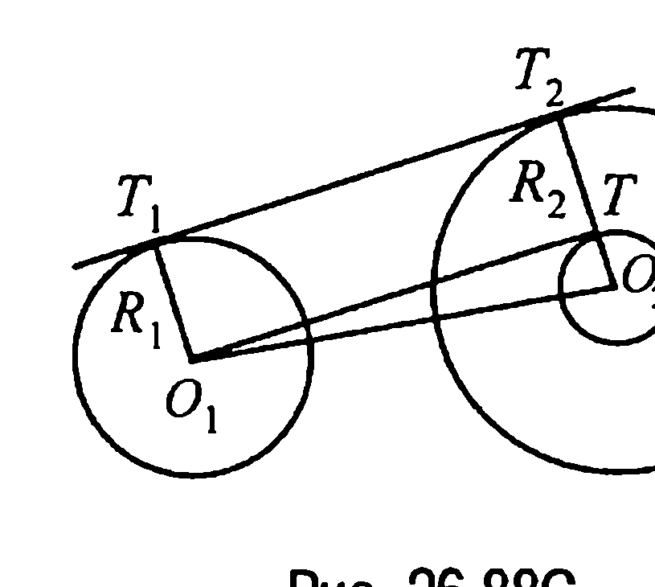

Тогда очевидно, что $O_1T_1 = R_1$ и $O_2T_2 = R_2$ перпендикулярны касательной $T_1T_2$. Проведем $O_1T$ параллельно прямой $T_1T_2$. В таком случае $O_1T \perp O_2T_2$, а $O_2T = O_2T_2 - TT_2 = O_2T_2 - O_1T_1 = R_2 - R_1$, т. е. $O_1T$ — касательная к окружности с центром $O_2$ и радиусом $R_2 - R_1$.

Из проведенного анализа следует и алгоритм построения искомой касательной. Именно, строим окружность радиуса $R_2 - R_1$ с центром $O_2$ и затем к этой окружности проводим из точки $O_1$ касательную $O_1T$. После этого продлеваем отрезок $O_2T$ до пересечения с окружностью в точке $T_2$.

А тогда если $T_1$ — точка пересечения первой окружности с прямой

---
**стр. 563**
---

мой, проходящей через точку $O_1$ параллельно прямой $O_2T_2$, то прямая $T_1T_2$ и будет искомой касательной.

**26.85C.** Пусть $ABC$ — искомый треугольник, у которого основание $BC = a$, $\angle BAC = \alpha$, медиана $BD = m$

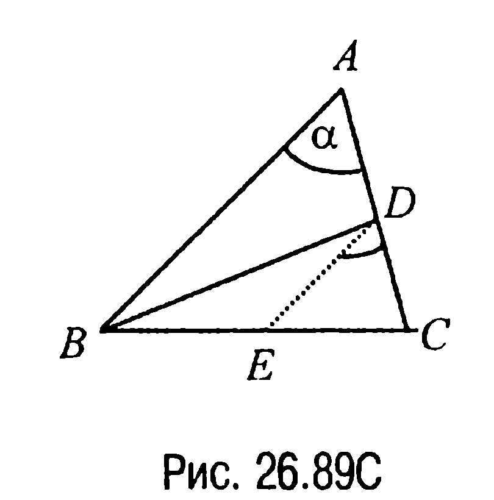

(рис. 26.89C). Проведем среднюю линию треугольника $DE$. Тогда $\angle EDC = \alpha$, $EC = a/2$. Таким образом, точка $D$ принадлежит множеству точек, из которых отрезок $EC$ виден под заданным углом $\alpha$. Таким множеством (задача 25.24) является множество точек дуги единственным образом строящейся окружности с хордой $EC$.

А тогда, замечая, что точка $D$ должна находиться на расстоянии $m$ от точки $B$, приходим к следующему алгоритму построения искомого треугольника: отмечаем серединную точку $E$ заданного основания $BC = a$, затем строим окружность, хорда $EC = a/2$ которой видна из точек этой окружности под заданным углом $\alpha$. Далее, проводим окружность радиуса $m$ с центром в точке $B$ и отмечаем точку $D$ — точку пересечения обеих окружностей, не лежащую на прямой $BC$. Наконец, на луче $CD$ отмечаем точку $A$ такую, что $CA = 2CD$.

Треугольник с вершинами $A$, $B$ и $C$ и будет искомым треугольником.

**26.86C.** Пусть точка $M$ — серединная точка стороны $AB$ треугольника $ABC$, а $Q$ — точка пересечения прямой $AB$ с прямой, проведенной через точку $C$ параллельно прямой $MP$ (рис. 26.90C). Построенная точка $Q$ и будет искомой точкой.

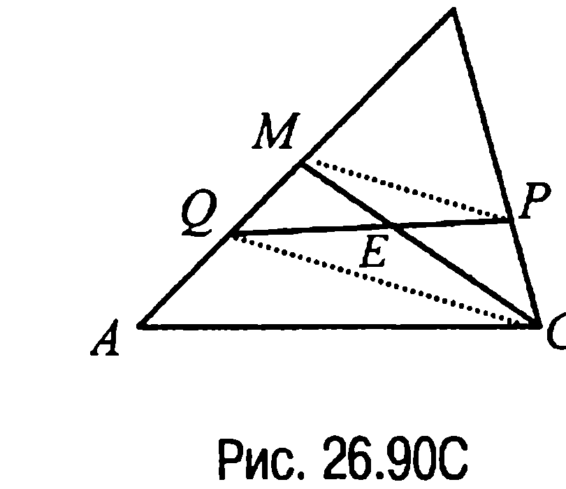

Действительно, если точка $E$ — точка пересечения отрезков $MC$ и $QP$, то площади треугольников $EQM$ и $EPC$ равны как площади треугольников, примыкающих к боковым сторонам трапеции $QMPC$ с диагоналями $MC$ и $QP$. А поскольку

---
**стр. 564**
---

$S_{AQBP} = S_{\Delta EQM} + S_{MBPE} = S_{\Delta EPC} + S_{MBPE} = S_{\Delta MBC},$
$S_{AQPC} = S_{\Delta EPC} + S_{\Delta QEC} = S_{\Delta EQM} + S_{\Delta QEC} = S_{\Delta AMC},$
а $S_{\Delta MBC} = S_{\Delta AMC}$ (медиана $CM$ разбивает треугольник $ABC$ на два равновеликих треугольника), то отсюда следует требуемое.

**26.87С.** Пусть $M$ (рис. 26.91C) — искомая точка. Тогда если повернуть треугольник $ABC$ вместе с точкой $M$ около точки $A$ (например, по ходу часовой стрелки) на $60^\circ$, то точки $B, C$ и $M$ перейдут в некоторые точки $B_1, C_1$ и $M_1$ соответственно.

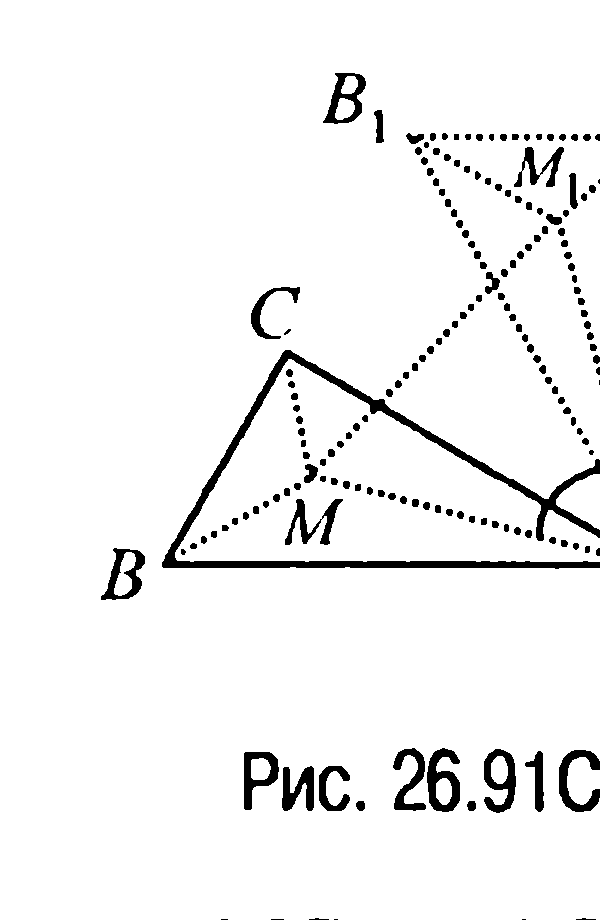

А поскольку $AM = AM_1$, $\angle M_1AM = 60^\circ$, то треугольник $AMM_1$ — равносторонний и, следовательно, $AM = MM_1$. Учитывая же, что $MC = M_1C_1$, имеем $d = MA + MB + MC = BM + MM_1 + M_1C_1$. Таким образом, при наименьшем значении $d$ точка $M$ лежит на прямой $BC_1$ и, значит, $\angle BMA = 180^\circ - \angle AMM_1 = 120^\circ$.

Если теперь сделать поворот треугольника $ABC$ на $60^\circ$ в направлении против хода часовой стрелки, то, проведя аналогичные рассуждения, получим, что $\angle CMA = 120^\circ$. Но в таком случае и $\angle BMC = 120^\circ$. Отсюда и следует построение.

Именно, на отрезках $AB$ и $BC$ как на основаниях строим равносторонние треугольники $ABD$ и $BCE$ (рис. 26.92C). Тогда искомая точка $M$ — это отличная от точки $B$ точка пересечения окружностей, описанных около треугольников $ABD$ и $BCE$.

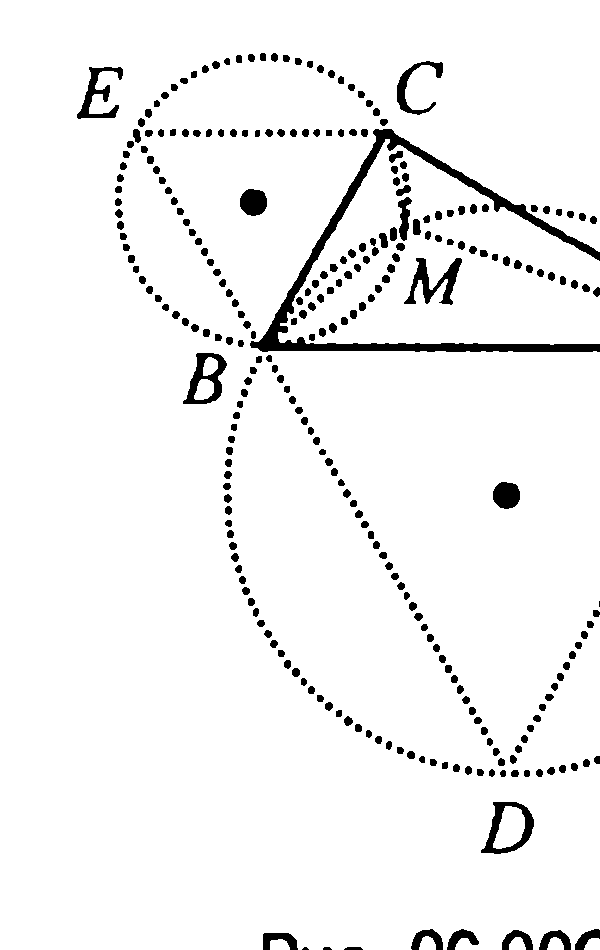

**Ответ:** отличная от точки $B$ точка пересечения дуг в $120^\circ$, построенных на сторонах $AB$ и $BC$ треугольника $ABC$ как на стягивающих хордах.

**26.88С.** Пусть $AB$ и $CD$ — заданные отрезки (рис. 26.93C). Обозначая тогда через $l_1$ и $l_2$ прямые, проходящие через точки $A, B$ и $C, D$ соответственно, проведем через точку $A$ прямую $l_3$, параллельную прямой $l_2$. Далее, на прямых $l_1$ и $l_3$ отложим соответст-
