## 9.26. Многоугольники и окружности

---
**стр. 565**
---

венно равные отрезки $AE$ и $AF$ и проведем прямую $EF$.

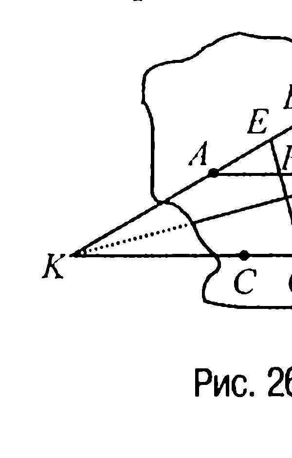

Пусть $G$ — точка пересечения прямой $EF$ с прямой $l_2$. Проведя теперь к отрезку $EG$ через его серединную точку $H$ перпендикуляр $l$, мы и решим задачу.

Действительно, треугольники $AEF$ и $KEG$, где $K$ — точка пересечения прямых $l_1$ и $l_2$, лежащая вне клочка бумаги, подобны и поэтому $\frac{AF}{KG} = \frac{AE}{KE}$. Отсюда с учетом того что $AF = AE$, следует равенство $KE = KG$, которое, в свою очередь, означает, что треугольник $GKE$ — равнобедренный. Но $EH = HG$, а $l \perp EG$, поэтому на серединном к отрезку $EG$ перпендикуляре $l$ и будет лежать требуемый отрезок биссектрисы.

**§27. Многоугольники и окружности**

**27.1C.** По условию $AO = OB = OF = 6$. Обозначим $\angle DAB = 2\alpha$

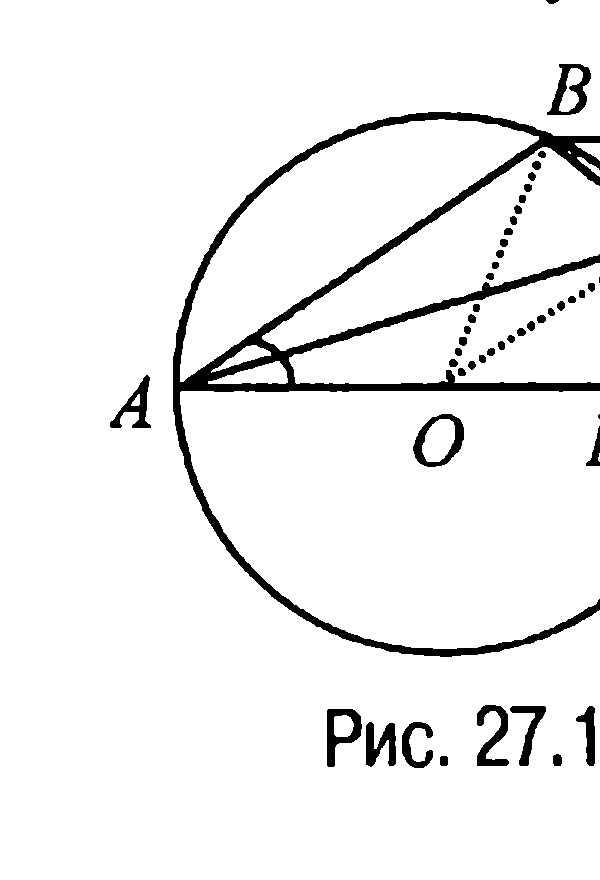

(рис. 27.1C). Тогда так как диагональ ромба делит его угол пополам, то $\angle CAB = \angle DAC = \alpha$. А поскольку треугольник $FOA$ — равнобедренный с $\angle OAF = \angle AFC = \alpha$ и с внешним углом $\angle ECF = 2\alpha$, то приходим к выводу, что $OF \parallel AB$ и, значит, треугольник $FEO$ подобен треугольнику $BEA$. Из подобия же треугольников следует, что $\frac{OF}{AB} = \frac{OE}{AE}$, откуда $AB =$

$$AB = \frac{OF \cdot AE}{OE} = \frac{OF \cdot AE}{AE - AO} = \frac{6 \cdot 14}{14 - 6} = \frac{21}{2}.$$

Рассмотрим равнобедренный треугольник $BOA$. По теореме синусов

$$\frac{AO}{\sin 2\alpha} = \frac{AB}{\sin(180^\circ - 4\alpha)} = \frac{AB}{\sin 4\alpha} = \frac{AB}{2 \sin 2\alpha \cdot \cos 2\alpha}$$

---
**стр. 566**
---

или $AB = 2AO \cdot \cos 2\alpha$. Таким образом, $\cos 2\alpha = \frac{AB}{2AO} = \frac{21}{2 \cdot 2 \cdot 6} = \frac{7}{8}$

и из треугольника $ABE$ по теореме косинусов находим $BE$:

$$BE = \sqrt{AB^2 + AE^2 - 2AB \cdot AE \cdot \cos 2\alpha} = \sqrt{\left(\frac{21}{2}\right)^2 + 14^2 - 21 \cdot 14 \cdot \frac{7}{8}} = 7.$$

**Ответ:** $BE = 7$.

**27.2С.** Пусть $\angle CEF = \alpha$ (рис. 27.2C). Тогда и $\angle EAC = \alpha$ как угол со взаимно перпендикулярными сторонами к углу $CEF$. Но тогда $\angle CDB = \angle DBC = \angle BCA = \angle EAC = \alpha$. А из того факта, что два равных угла $CEG$ и $CDG$ опираются на один и тот же отрезок $CG$, следует, что около четырехугольника $EGCD$ можно описать окружность, где угол $DGC$ равен прямому углу $DEC$ как угол, опирающийся на тот же отрезок $CD$, что и угол $DEC$. Таким образом, $CG$ — высота равнобедренного треугольника $BCD$, а значит, точка $G$ делит отрезок $BD$ пополам, т. е. $BD : BG = 2 : 1$.

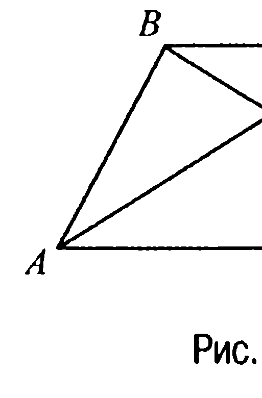

**Ответ:** $BD : BG = 2 : 1$.

**27.3С.** Обозначим $BC = a$, $BE = b$, $\angle FAB = \varphi$ (рис. 27.3C). Тогда из условия задачи следует, что $AB = 2a$, $AQ = 3b$, $\angle FQC = \angle CFQ = \angle AQD = \varphi$ и, значит, $\angle BEC = 180^\circ - \varphi$.

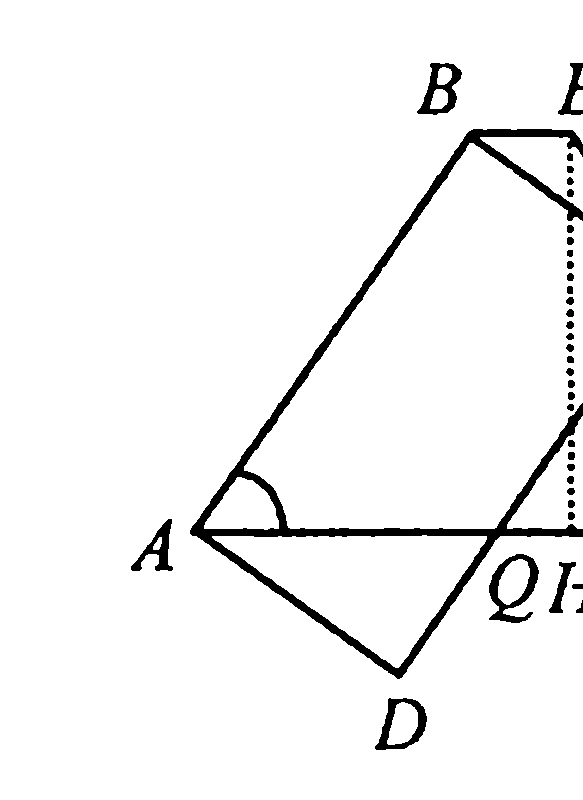

Рассмотрим прямоугольный треугольник $QDA$. В этом треугольнике $AD = AQ \cdot \sin \varphi$ или $a = 3b \cdot \sin \varphi$, а $QD = AQ \cdot \cos \varphi$ или $QD = 3b \cdot \cos \varphi$.

Замечая теперь, что $EF = CD$, $CF = CQ$, находим, что $EC = QD$, т. е. $EC = 3b \cdot \cos \varphi$.

Далее, по теореме косинусов из треугольника $BEC$ имеем $a^2 = b^2 + 9b^2 \cdot \cos^2 \varphi - 6b^2 \cdot \cos \varphi \cdot \cos(180^\circ - \varphi) = b^2 + 9b^2 \cdot \cos^2 \varphi + 6b^2 \cdot \cos^2 \varphi$, или, с учетом того что $a = 3b \cdot \sin \varphi$, $9\sin^2 \varphi = 1 +$

---
**стр. 567**
---

$+ 15\cos^2\phi$. Отсюда $\sin\phi = \sqrt{\frac{2}{3}}$ ($\cos\phi = \sqrt{\frac{1}{3}}$), из чего следует, что $\phi = \arcsin\sqrt{\frac{2}{3}}$ и, таким образом, $\angle BEC = \pi - \arcsin\sqrt{\frac{2}{3}}$.

Вычислим площадь $S$ трапеции. С учетом найденного значения $\sin\phi$ из равенства $a = 3b \cdot \sin\phi$ получаем, что одно основание трапеции $b = \frac{a}{\sqrt{6}}$. Высота трапеции $EH = EF \cdot \sin\phi = 2a \cdot \sqrt{\frac{2}{3}}$.

Таким образом, $S = \frac{1}{2}(AF + BE) \cdot EH = \frac{1}{2}(AQ + QF + BE) \cdot EH =$
$= \frac{1}{2}(QF + 4BE) \cdot EH$. Но $QF = 2CQ \cdot \cos\phi$, так как по теореме
синусов из треугольника $CFQ$ следует, что
$$\frac{CQ}{\sin\phi} = \frac{QF}{\sin(180^\circ - 2\phi)} = \frac{QF}{\sin 2\phi} = \frac{QF}{2\sin\phi\cos\phi}$$
или $CQ = \frac{QF}{2\cos\phi}$.

Определим $CQ$. Имеем $CQ = 2a - QD = 2a - 3b \cdot \cos\phi = 2a -$
$- \frac{3}{\sqrt{6}} \cdot a \cdot \frac{1}{\sqrt{3}} = \frac{4-\sqrt{2}}{2}a$.

Итак, $QF = 2\frac{4-\sqrt{2}}{2}a \cdot \frac{1}{\sqrt{3}} = \frac{4-\sqrt{2}}{\sqrt{3}}a$ и, значит, $QF + 4BE =$
$= \frac{4-\sqrt{2}}{\sqrt{3}}a + \frac{4}{\sqrt{6}}a = \frac{4+\sqrt{2}}{\sqrt{3}}a$. Тогда $S = \frac{4+\sqrt{2}}{2\sqrt{3}} \cdot 2 \cdot \sqrt{\frac{2}{3}} a^2 =$
$= \frac{2+4\sqrt{2}}{3}a^2$. А так как площадь прямоугольника $ABCD$ — это
$S_1 = 2a^2$, то $\frac{S}{S_1} = \frac{1+2\sqrt{2}}{3}$.

Ответ: $\arcsin\sqrt{\frac{2}{3}}$; $\pi - \arcsin\sqrt{\frac{2}{3}}$; $(1+2\sqrt{2}) : 3$.

**27.4C.** Обозначим через $E$ точку пересечения диагоналей параллелограмма $ABCD$ (рис. 27.4C). Так как в точке $E$ диагонали параллелограмма делятся пополам, а по условию задачи центры

---
**стр. 568**
---

окружностей, описанных около треугольников $ABD$ и $BCD$, лежат на диагонали $AC$ параллелограмма, то последний будет ромбом. Отсюда следует, что $\angle ACD = \angle BCA = 40^\circ$.

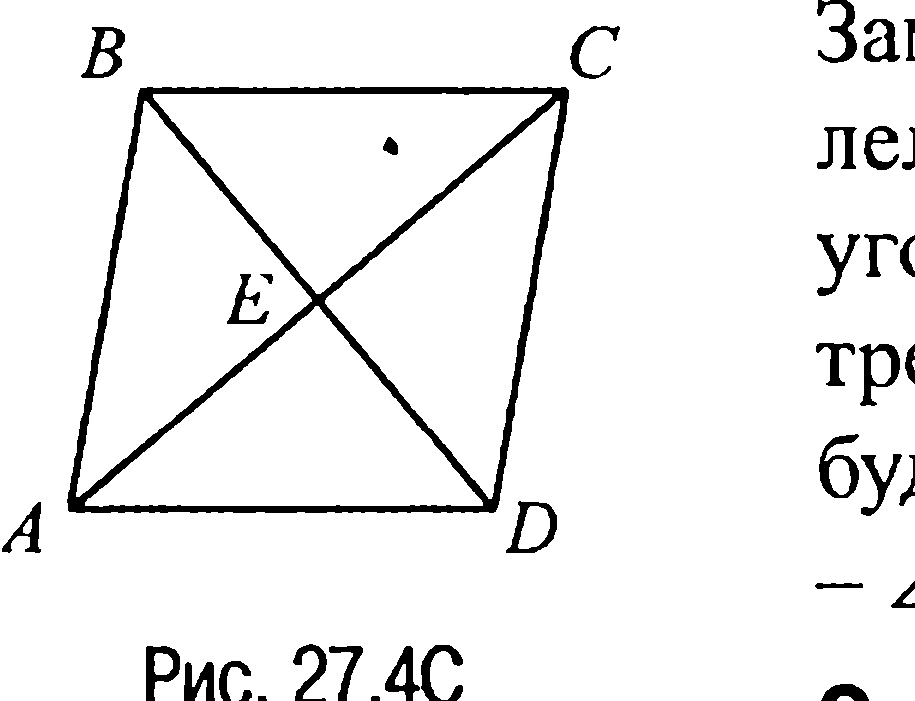

Заметим далее, что в частном случае параллелограмм $ABCD$ может оказаться прямоугольником. Тогда центры описанных около треугольников $ABD$ и $BCD$ окружностей будут совпадать и, значит, $\angle ACD = 90^\circ - \angle BCA = 90^\circ - 40^\circ = 50^\circ$.

Ответ: $40^\circ$ или $50^\circ$.

**27.5C.** Пусть окружность, описанная около треугольника $AED$,

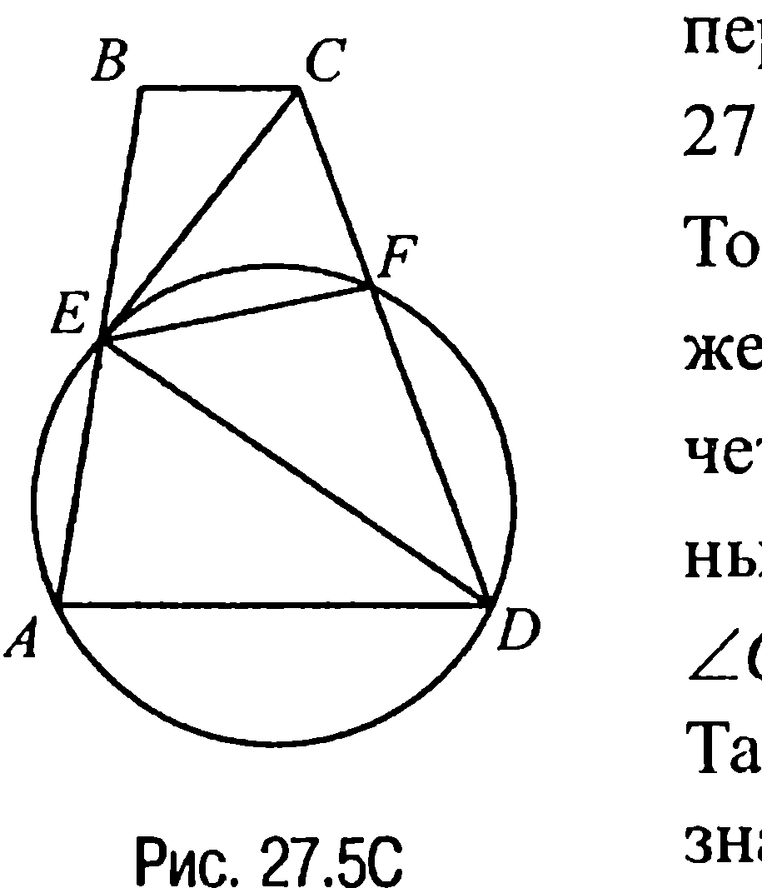

пересекает отрезок $CD$ в точке $F$ (рис. 27.5C).

Тогда если обозначить $\angle DAE = \alpha$, то окажется, что $\angle EBC = 180^\circ - \alpha$. Далее, так как четырехугольник $AEFD$ является вписанным, то $\angle EFD = 180^\circ - \alpha$ и, следовательно, $\angle CFE = \alpha$.

Таким образом, $\angle EBC + \angle CFE = 180^\circ$ и, значит, около четырехугольника $EBCF$ (треугольника $BCE$) можно описать окружность, что доказывает требуемое.

**27.6C.** Пусть $\angle BAD = \alpha$ (рис. 27.6C). Тогда $\angle CBA = 180^\circ - \alpha$ и,

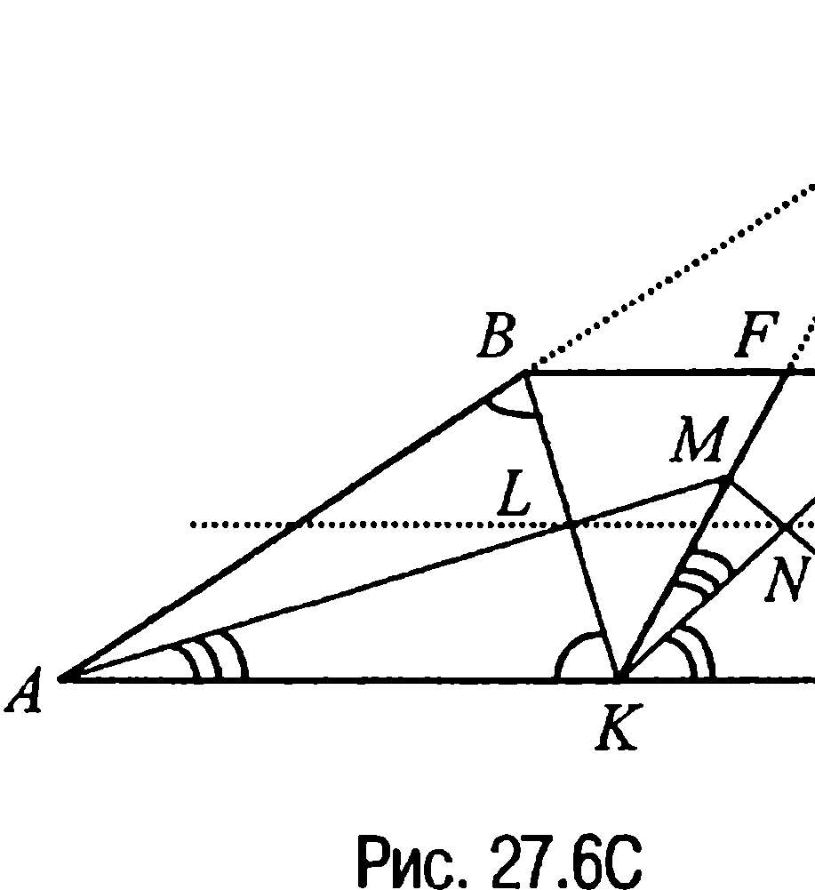

значит, $\angle ABK = 90^\circ - \frac{\alpha}{2}$. С другой стороны, $\angle BKA = 180^\circ - \left(\alpha + 90^\circ - \frac{\alpha}{2}\right) = 90^\circ - \frac{\alpha}{2}$, следовательно, треугольник $KAB$ — равнобедренный. Таким образом, $AK = AB = 9$. Аналогично показывается, что и треугольник $CDK$ также оказывается равнобедренным, поэтому $KD = CD = 5$.

---
**стр. 569**
---

Далее, так как $L$ и $N$ — середины сторон $BK$ и $CK$ треугольника $BKC$, то отрезок $LN$ — его средняя линия. Отсюда очевидным образом следует, что прямая $LN$ делит сторону $AB$ трапеции в отношении $1 : 1$.

Пусть теперь $E$ — точка пересечения прямых $AB$ и $DC$. Тогда из подобия треугольников $AED$ и $BEC$ вытекает, что $\frac{AE}{BE} = \frac{DE}{CE}$ или $\frac{AE}{DE} = \frac{BE}{CE}$, или $\frac{9+BE}{5+CE} = \frac{BE}{CE}$, т. е. $\frac{AE}{DE} = \frac{BE}{CE} = \frac{9}{5}$.

С другой стороны, $\frac{AK}{KD} = \frac{9}{5}$ и поэтому $EK$ — биссектриса треугольника $AED$, которая, в частности, проходит через точку $M$ (биссектрисы треугольника пересекаются в одной точке). По свойству биссектрисы $\frac{BF}{FC} = \frac{BE}{CE} = \frac{9}{5}$, т. е. $BF : FC = 9 : 5$.

Обратимся, наконец, к последнему вопросу задачи. Обозначим $\angle ADC = \delta$. Тогда $\angle AED = 180^\circ - (\alpha + \delta)$ и поэтому $\angle KED = 90^\circ - \frac{\alpha+\delta}{2}$. Но в таком случае

$\angle EKD = 180^\circ - \left(90^\circ - \frac{\alpha+\delta}{2} + \delta\right) = 90^\circ + \frac{\alpha-\delta}{2}$, а $\angle EKC = \angle EKD -$
$- \angle CKD = 90^\circ + \frac{\alpha-\delta}{2} - \left(90^\circ - \frac{\delta}{2}\right) = \frac{\alpha}{2}$. Отсюда следует, что прямоугольные треугольники $ALK$ и $KNM$, имеющие равные острые углы $KAL$ и $NKM$ соответственно, подобны и, значит, $\frac{MN}{KL} = \frac{KN}{AL} = \frac{MK}{AK} = \frac{MK}{9}$ или $\frac{MN}{KL} = \frac{MK}{9}$.

Аналогично из подобия прямоугольных треугольников $KLM$ и $KND$ имеем $\frac{LM}{KN} = \frac{MK}{KD} = \frac{MK}{5}$ или $\frac{3}{7} = \frac{MK}{5}$, откуда $MK = \frac{15}{7}$ и, таким образом, $\frac{MN}{KL} = \frac{15}{7 \cdot 9} = \frac{5}{21}$, т. е. $MN : KL = 5 : 21$.

Ответ: $1 : 1$; $9 : 5$; $MN : KL = 5 : 21$.

---
**стр. 570**
---

**27.7C.** Так как $S_{ABCD} = S_{\triangle ABC} + S_{\triangle ACD} = S_{\triangle ABD} + S_{\triangle BCD}$ (рис. 27.7C),

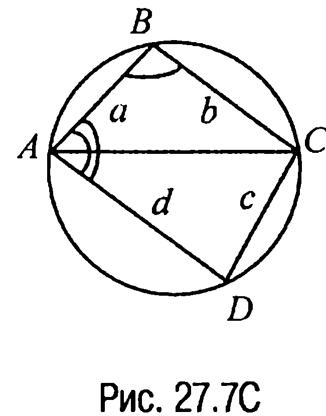

$S_{\triangle ABC} = \frac{1}{2} a \cdot b \cdot \sin \angle ABC,$

$S_{\triangle ACD} = \frac{1}{2} d \cdot c \cdot \sin \angle CDA = \frac{1}{2} d \cdot c \cdot \sin(180^\circ - \angle ABC) = \frac{1}{2} d \cdot c \cdot \sin \angle ABC,$

$S_{\triangle ABD} = \frac{1}{2} a \cdot d \cdot \sin \angle DAB,$

$S_{\triangle BCD} = \frac{1}{2} b \cdot c \cdot \sin(180^\circ - \angle DAB) = \frac{1}{2} b \cdot c \cdot \sin \angle DAB,$

то $\frac{1}{2}(ab + dc) \cdot \sin \angle ABC = \frac{1}{2}(ad + bc) \cdot \sin \angle DAB$, откуда и следует требуемое.

**27.8C.** Опишем около треугольника $BCD$ окружность $s$ (рис. 27.8C). Тогда поскольку треугольник $BAD$ — равнобедренный, его высота $AE$ является и медианой и, следовательно, $AE$ — серединный к стороне $DB$ треугольника $BCD$ перпендикуляр.

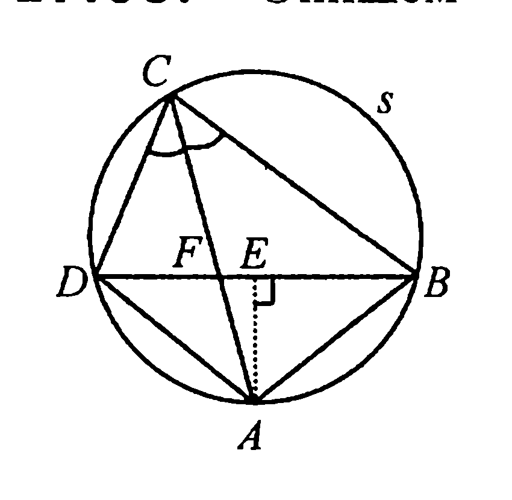

Поэтому прямая $EA$ делит пополам дугу $BD$ окружности $s$. Продолжение за сторону $BD$ биссектрисы $CF$ треугольника $BCD$ тоже делит дугу $BD$ (не содержащую точку $C$) пополам. А так как $CD \neq CB$, то прямые $CF$ и $EA$ пересекаются и их точка пересечения $A$ лежит на окружности $s$.

Итак, все вершины четырехугольника лежат на окружности $s$, а это и доказывает требуемое.

**27.9C.** Пусть $E$ и $F$ — точки пересечения противоположных сторон четырехугольника, $\angle AED = \beta$, $\angle BFA = \alpha$, (рис. 27.9C). Отсюда следует, что $\angle CDA = \angle DCF + \alpha$ как внешний угол треугольника $DCF$. Аналогично доказывается, что $\angle BCD = \angle FDC + \alpha$. А тогда $\angle BCD + \angle CDA = \angle FDC + DCF + 2\alpha = \pi - \alpha + 2\alpha = \pi + \alpha$. <!-- вероятная опечатка оригинала: $DCF$ без знака угла --> Точно также приходим к выводу, что $\angle ABC + \angle BCD = \pi + \beta$.

---
**стр. 571**
---

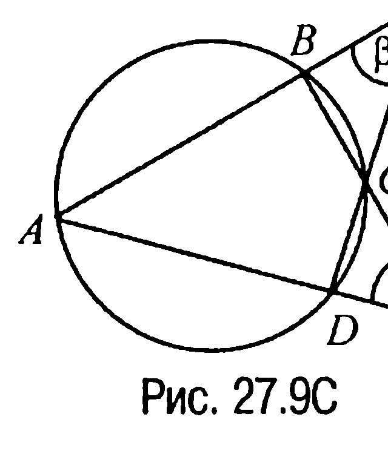

Итак, имеем систему

$$
\left\{
\begin{aligned}
\angle BCD + \angle CDA &= \pi + \alpha,\\
\angle ABC + \angle BCD &= \pi + \beta,\\
\angle BCD + \angle DAB &= \pi,\\
\angle ABC + \angle CDA &= \pi,
\end{aligned}
\right.
$$

решая которую, находим, что $\angle DAB = \frac{\pi - \alpha - \beta}{2},$

$\angle ABC = \frac{\pi - \alpha + \beta}{2}, \angle BCD = \frac{\pi + \alpha + \beta}{2}, \angle CDA = \frac{\pi + \alpha - \beta}{2}.$

**Ответ:** $\frac{\pi}{2} - \frac{\alpha + \beta}{2}; \frac{\pi}{2} - \frac{\alpha - \beta}{2}; \frac{\pi}{2} + \frac{\alpha + \beta}{2}; \frac{\pi}{2} + \frac{\alpha - \beta}{2}.$

**27.10C.** Рассмотрим четырехугольник $ABCD$, вписанный в окружность с центром $O$. Обозначим через $E, F, G, H$ серединные точки отрезков $AB, BC, CD, DA$ соответственно. Пусть $K$ — точка пересечения перпендикуляров, опущенных из точек $E$ и $G$ на противолежащие стороны четырехугольника $ABCD$ (рис. 27.10C).

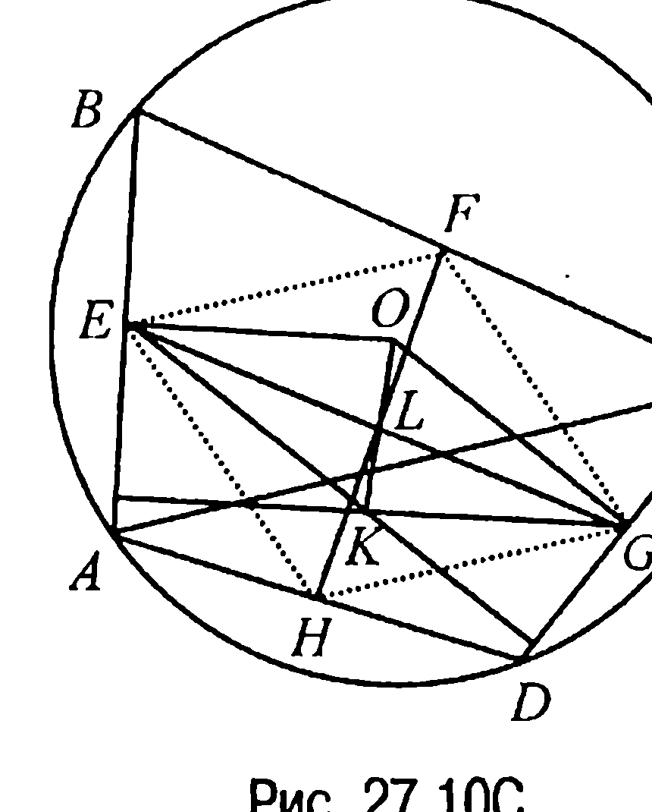

Докажем сначала, что отрезки, соединяющие середины противолежащих сторон заданного четырехугольника, пересекаясь, делятся пополам.

Действительно, $EF$ — средняя линия треугольника $ABC$ и, следовательно, $EF \parallel AC$. С другой стороны, $HG$ — средняя линия треугольника $ACD$ и, значит, $HG \parallel AC$. Таким образом, $EF \parallel HG$. Аналогично доказывается, что $EH \parallel FG$, и мы приходим к выводу, что четырехугольник $EFGH$ — параллелограмм. Но отрезки, соединяющие середины противолежащих сторон четырехугольника $ABCD$, являются диагоналями параллелограмма $EFGH$ и поэтому, пересекаясь, делятся пополам в точке $L$.

Рассмотрим теперь четырехугольник $EOGK$. Этот четырехугольник является параллелограммом (точки $E$ и $G$ — середины хорд $AB$ и $CD$ и, следовательно, $OE \perp AB$, $OG \perp CD$, откуда $EK \parallel OG$,

---
**стр. 572**
---

$EO \parallel KG$) и поэтому точка $K$ симметрична точке $O$ относительно середины отрезка $EG$ — точки $L$.

Замечая теперь, что $FH$ делится точкой $L$ пополам, опустив перпендикуляры из точек $F$ и $H$ на противолежащие стороны четырехугольника $ABCD$, мы, рассуждая как и выше, придем к выводу, что точка пересечения последних перпендикуляров будет симметрична точке $O$ относительно точки $L$ как середины отрезка $FH$, а значит, будет совпадать с точкой $K$, что и требовалось доказать.

**27.11C.** Обозначим углы при вершинах $A$, $B$, $C$ через $\alpha$, $\beta$, $\gamma$ соответственно. Пусть, далее, $O$ — точка внутри треугольника $ABC$, являющаяся точкой пересечения окружностей, описанных около треугольников $ADF$ и $DBE$ (рис. 27.11C). Тогда

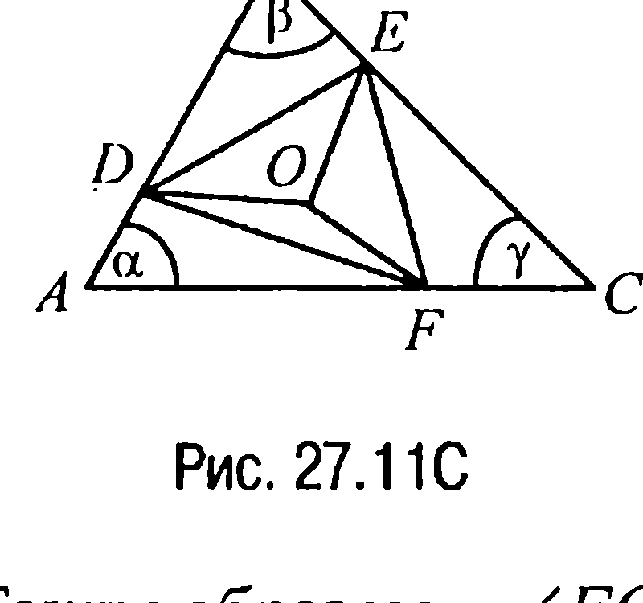

$\angle DOE + \angle DOF = (180^\circ - \beta) + (180^\circ - \alpha) = 360^\circ - (\alpha + \beta).$

Таким образом, $\angle FOE = 360^\circ - (360^\circ - (\alpha + \beta)) = \alpha + \beta.$

Учитывая теперь, что $\alpha + \beta + \gamma = 180^\circ$, приходим к выводу, что $\angle FOE + \angle ECF = 180^\circ$. <!-- вероятная опечатка оригинала: $\angle ECF$ вместо $\angle EOC$? --> Последнее означает, что около четырехугольника $FOEC$ можно описать окружность, которая будет и окружностью, описанной около треугольника $FEC$. А это и доказывает требуемое.

**27.12C.** Пусть $D$ — точка окружности, описанной около треугольника $ABC$ и пусть $E$, $F$ и $G$ — основания перпендикуляров, опущенных на стороны $AB$, $AC$ и продолжение стороны $BC$ соответственно (рис. 27.12C). Тогда из условия задачи следует, что точки $A$, $E$, $F$ и $D$ лежат на окружности, описанной около четырехугольника $AEFD$, так как $\angle AED = \angle AFD = 90^\circ$, $\angle EFA = \angle EDA = 90^\circ - \angle DAE$ и, значит, $\angle EFD + \angle DAE = 180^\circ$.

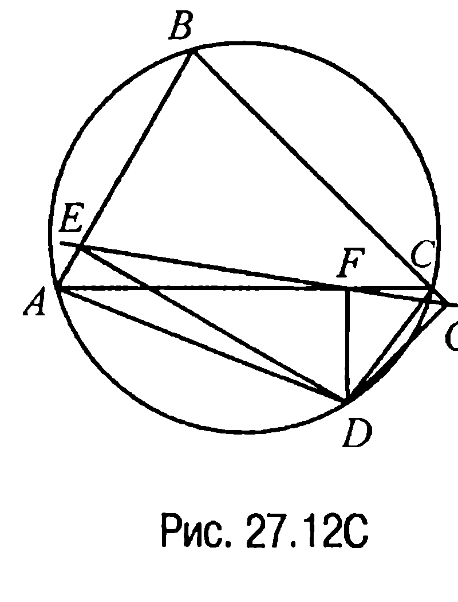

Аналогично показывается, что точки $D$, $F$, $C$ и $G$ лежат на окружности, описанной около четырехугольника $DFCG$.

---
**стр. 573**
---

Таким образом,
$\angle GFC = \angle GDC = 90^\circ - \angle DCG = 90^\circ - (180^\circ - \angle BCD) = \angle BCD -$
$- 90^\circ = (180^\circ - \angle DAB) - 90^\circ = 90^\circ - \angle DAB = 90^\circ - \angle DAE$
и, следовательно $\angle GFC = \angle EFA$. Из полученного равенства углов вытекает, что точки $E, F, G$ лежат на одной прямой.

**27.13C.** Пусть $D$ — точка пересечения окружностей, описанных около треугольников $A_1CB_1$ и $A_1C_1B$. При этом рассмотрим случай, когда точка $D$ расположена внутри треугольника $ABC$ (рис. 27.13C). Другие расположения точки $D$ предлагается рассмотреть читателю самостоятельно.

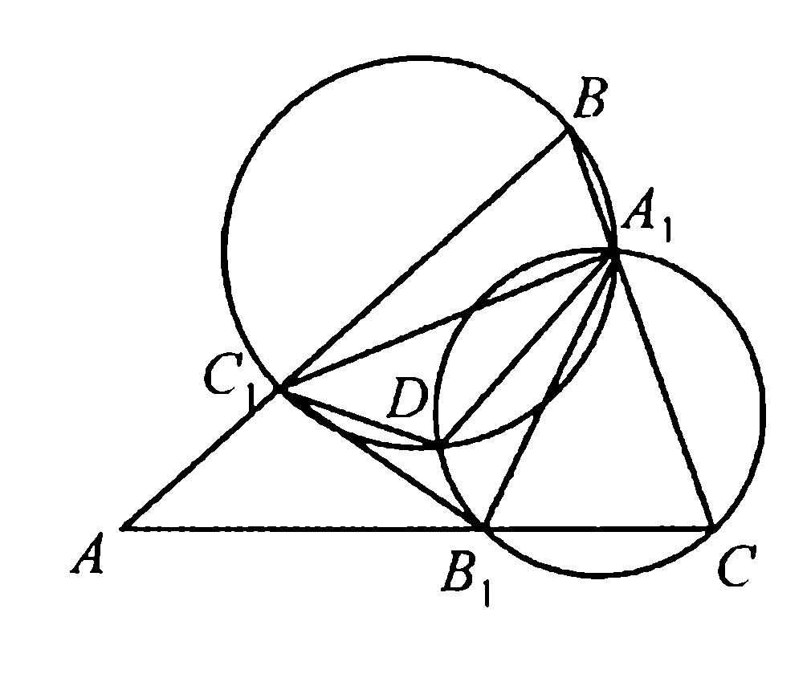

В рассматриваемом случае четырехугольник $A_1CB_1D$ является вписанным и, значит, $\angle B_1DA_1 = 180^\circ - \angle A_1CB_1$. Вписанным является и четырехугольник $A_1DC_1B$, поэтому $\angle ADC_1 = 180^\circ - \angle C_1BA_1$. А тогда $\angle C_1DB_1 = 360^\circ - \angle B_1DA_1 - \angle ADC_1 = 360^\circ - (180^\circ - \angle A_1CB_1) -$
$- (180^\circ - \angle C_1BA_1) = \angle A_1CB_1 + \angle C_1BA_1 = 180^\circ - \angle CAB = 180^\circ -$
$- \angle B_1AC_1$, откуда следует, что точка $D$ лежит на окружности, описанной около четырехугольника $AC_1DB_1$, а значит, и на окружности, описанной около треугольника $AC_1B_1$, что и доказывает требуемое.

**27.14C.** Опишем около треугольника $ADE$ окружность с центром $O_2$ и обозначим через $G$ точку пересечения этой окружности с прямой $EF$.

Покажем, что около четырехугольника $CFGD$ можно описать окружность. Для этого, как известно (свойство 15.1X), достаточно показать, что $\angle DCF + \angle FGD = 180^\circ$.

Действительно, $\angle DCF = 180^\circ - \angle BCD = \angle DAB = 180^\circ - \angle EAD =$
$= \angle DGE = 180^\circ - \angle FGD$, откуда и следует требуемое.

---
**стр. 574**
---

Далее, в соответствии с условием задачи, на рис. 27.14C отрезки $EK$ и $FL$ касательных к окружности с центром $O_1$ равны соответственно $a$ и $b$.

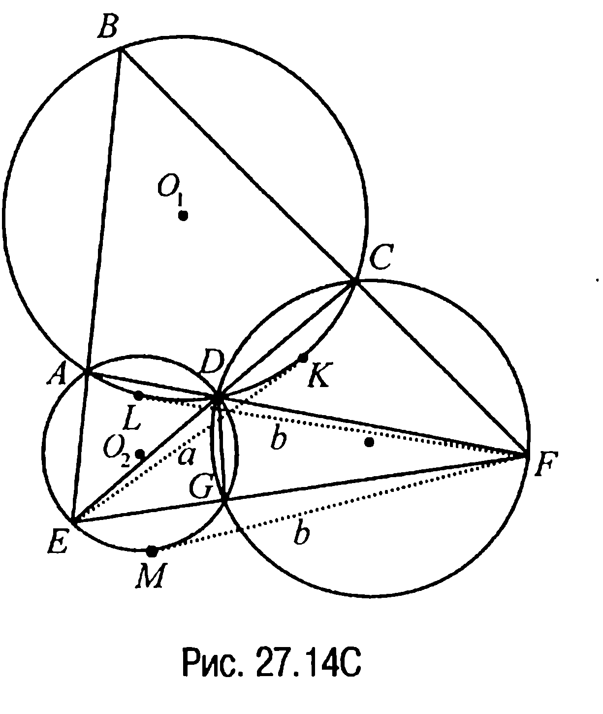

А тогда, замечая, что отрезок $FL$ равен отрезку $FM$ касательной к окружности с центром $O_2$ (задача 5.1C), на основании свойства 5.5 имеем равенства:
$EC \cdot ED = a^2$, $EF \cdot GF = b^2$.
Отсюда следует, что
$EC \cdot ED + EF \cdot GF = a^2 + b^2$. Но $EC \cdot ED = EF \cdot EG$, так как $EF$ и $EC$ — секущие окружности, описанной около четырехугольника $CFGD$. Поэтому
$EC \cdot ED + EF \cdot GF = EF \cdot EG + EF \cdot GF = EF \cdot (EG + GF) = EF^2 = a^2 + b^2$ и, таким образом, $EF = \sqrt{a^2 + b^2}$.

**Ответ:** $EF = \sqrt{a^2 + b^2}$.

**27.15C.** По свойствам углов $\angle DBE = \angle DAB$, а $\angle FAD = \angle DBA$

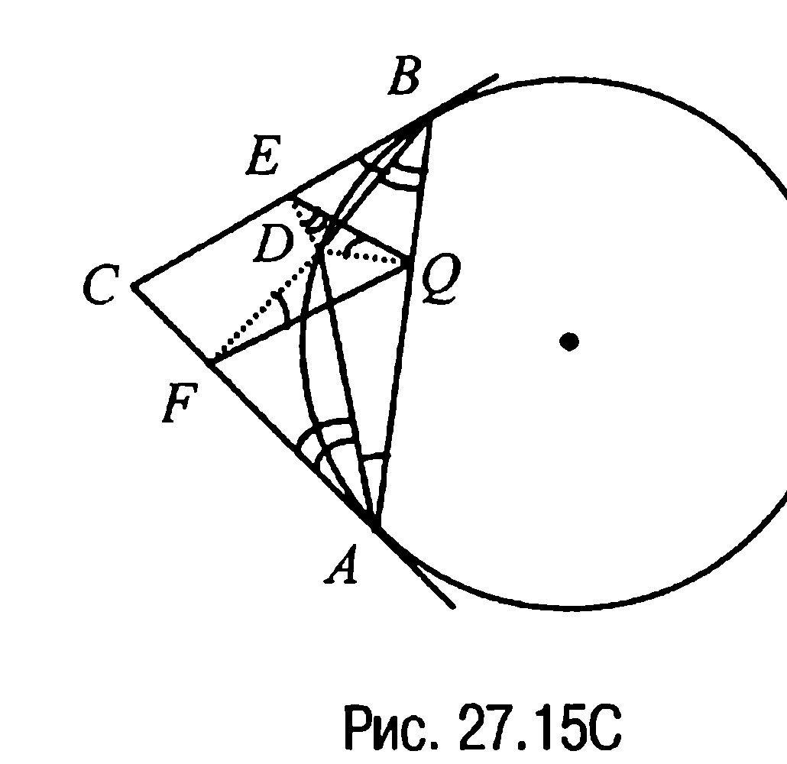

(рис. 27.15C). А поскольку четырехугольники $QBED$ и $QDFA$ вписаны в окружность (что следует из характеристичности свойства 15.1X), то
$\angle DAQ = \angle DFQ, \angle FAD = \angle FQD;$
$\angle DBE = \angle EQD, \angle DBQ = \angle DEQ$.
Но замечая, что треугольники $FDQ$ и $EDQ$ подобны, приходим к выводу, что $\frac{ED}{DQ} = \frac{DQ}{FD}$ или $\frac{a}{DQ} = \frac{DQ}{b}$, откуда находим $DQ = \sqrt{ab}$.

**Ответ:** $DQ = \sqrt{ab}$.

---
**стр. 575**
---

**27.16C.** Так как $\angle AMC = \angle ADC$ (рис. 27.16C), то около четырехугольника $ACDM$ можно описать окружность (задача 15.7). Но тогда $\angle DMC = \angle CAD$, а $\angle MDA = \angle ACM$. Отсюда следует, что треугольники $MED$ и $AEC$ подобны и, значит, $\frac{AC}{MD} = \frac{CE}{ED}$ или $\frac{AC}{a} = \frac{k}{n}$, откуда находим, что $AC = ak/n$.

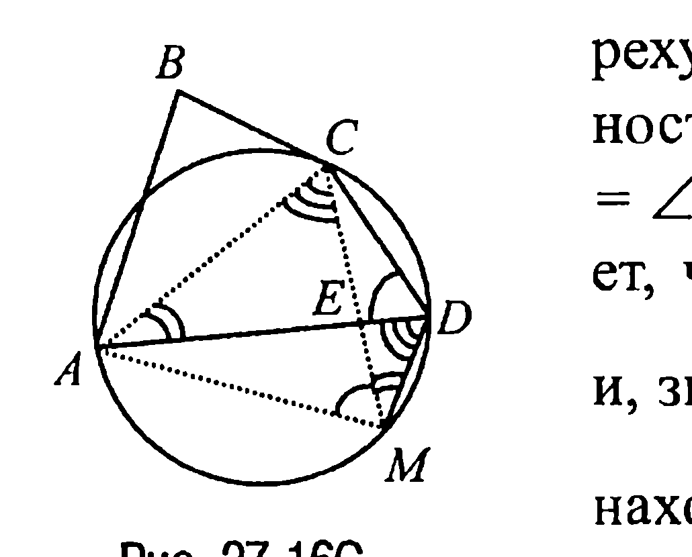

**Ответ:** $AC = ak/n$.

**27.17C.** Обозначим $AB = c$, $AK = m$, $BM = n$. Пусть $O$ — точка пересечения медиан треугольника $ABC$ (рис. 27.17C). Достроим данный треугольник до параллелограммов $ACLB$ и $ABCN$. Тогда на основании свойства 13.5X имеем систему
$$\begin{cases} 4m^2 + a^2 = 2b^2 + 2c^2, \\ 4n^2 + b^2 = 2a^2 + 2c^2, \end{cases}$$
откуда находим, что $4(m^2 + n^2) = a^2 + b^2 + 4c^2$.

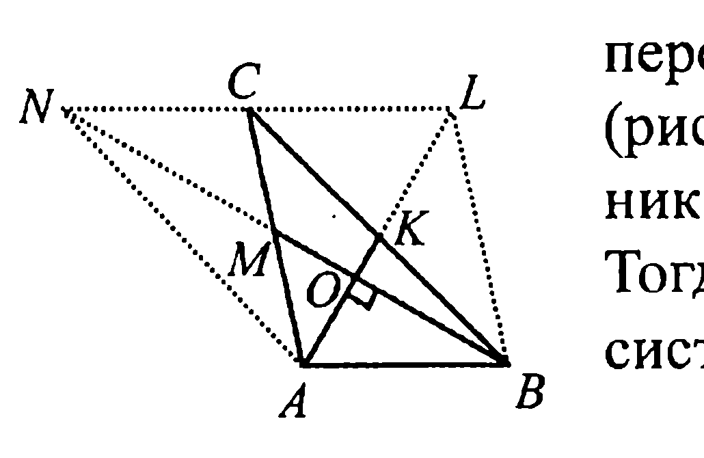

Но поскольку $m^2 + n^2 = \frac{9}{4} AO^2 + \frac{9}{4} BO^2 = \frac{9}{4} c^2$, приходим к выводу, что $9c^2 = a^2 + b^2 + 4c^2$ или $c = \sqrt{\frac{a^2 + b^2}{5}}$.

**Ответ:** $AB = \sqrt{\frac{a^2 + b^2}{5}}$.

**27.18C.** Пусть точки $K$ и $M$ — середины сторон $AB$ и $CD$ соответственно, $L$ и $N$ — середины диагоналей $AC$ и $BD$ соответственно, $O$ — точка пересечения прямых $AD$ и $BC$ (рис. 27.18C). Тогда так как $KL$ и $NM$ — средние линии треугольников $ABC$ и $BCD$ (с общим основанием $BC$) соответственно, то $KL \parallel BC$, $NM \parallel BC$ и, значит, $KL \parallel NM$. Аналогично рассматривая треугольники $ACD$ и $ABD$, приходим к выводу, что $KN \parallel LM$. Замечая теперь, что

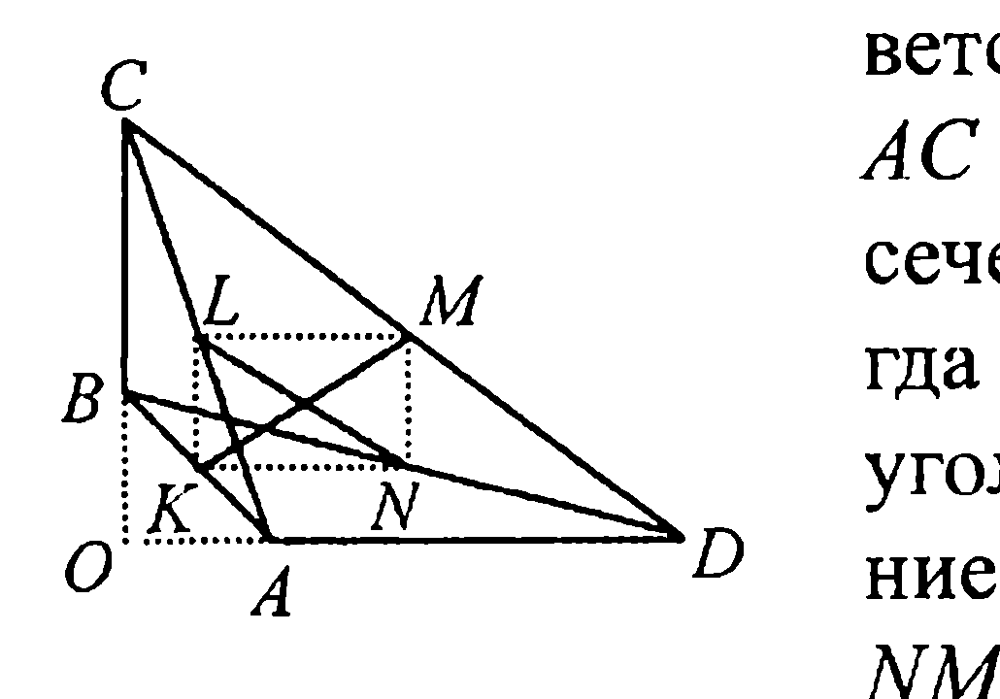

---
**стр. 576**
---

$\angle LKN = \angle COD = 90^\circ$, заключаем, что четырехугольник $KLMN$ является прямоугольником. А поскольку в прямоугольнике диагонали равны, то искомый отрезок $LN = KM = 1$.

**Ответ:** 1.

**27.19C.** «Обойдем» стороны $a_1, a_2, \dots, a_n$ данного $n$-угольника $A_1 A_2 \dots A_n$, где $a_i = A_i A_{i+1}$ при $1 \le i < n$, $a_n = A_n A_1$, например, по ходу часовой стрелки и обозначим через $h_i$ перпендикуляр, опущенный из точки $O$ на сторону $a_i$ (или ее продолжение). Очевидно, что стороны $n$-угольника $A_1 A_2 \dots A_n$ соответственно параллельны сторонам некоторого правильного $n$-угольника.

Рассмотрим два случая:

1) число $n$ — четное,

2) число $n$ — нечетное.

Итак, пусть сначала $n = 2k, k \ge 2, k \in \mathbb{N}$.

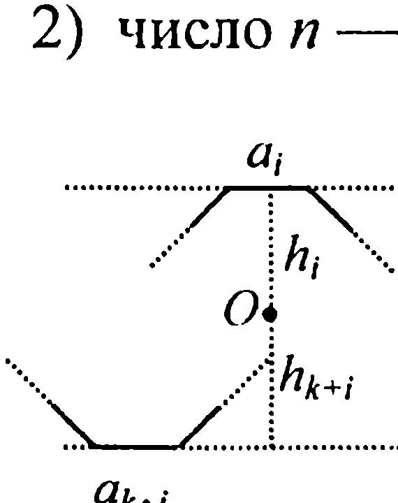

В этом случае (рис. 27.19C) сторона $a_i \parallel a_{k+i}, 1 \le i \le k$ (стороны $a_i$ и $a_{k+i}$ являются противолежащими) и поэтому сумма $h_1 + h_2 + \dots + h_n$ равна сумме расстояний между парами продолжений параллельных противолежащих сторон $n$-угольника и не зависит от положения точки $O$.

Пусть теперь $n = 2k + 1, k \ge 1, k \in \mathbb{N}$. Проведем через точку $O$ прямую, параллельную прямой, на которой лежит сторона $a_{k+1}$ данного $n$-угольника, и пусть $A$ и $B$ — точки пересечения этой прямой с продолжениями сторон $a_1$ и, соответственно, $a_n$ (сторона $a_{k+1}$ является противолежащей по отношению к вершине $A_1$ — общему концу сторон $a_1$ и $a_n$). При таком построении треугольник $AA_1B$ (рис. 27.20C) будет равнобедренным с углом $\phi$ при основании $AB$, равным $180^\circ/n$.

Пусть $h_1 = OP, h_n = OQ, h_{k+1} = OT$, где точки $P, Q, T$ — основания перпендикуляров, опущенных из точки $O$ на прямые $A_1A_2$, $A_nA_1$, $A_{k+2}A_{k+1}$ соответственно.

Опустим теперь из точки $O'$ пересечения прямой $AB$ с перпендикуляром $H_1 = A_1T'$, опущенным из точки $A_1$ на прямую $A_{k+2}A_{k+1}$,

---
**стр. 577**
---

перпендикуляры $h'_1 = O'P'$ и $h'_n = O'Q'$ на прямые $A_1A_2$ и $A_1A_n$ соответственно.

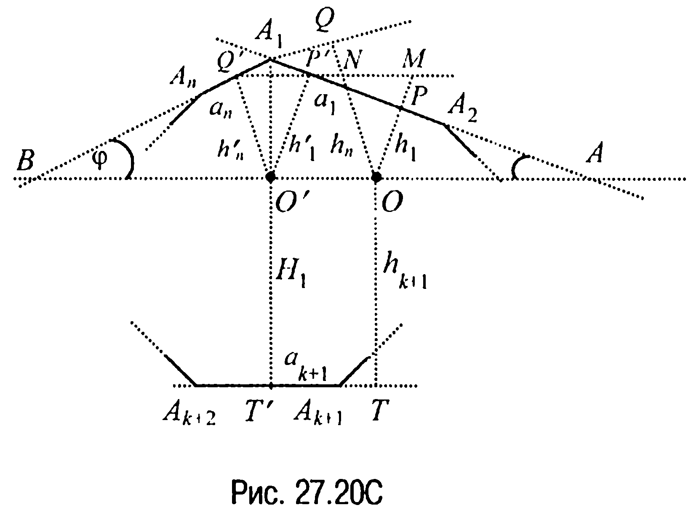

Пусть, далее, $N$ и $M$ — точки пересечения прямой $Q'P'$ с прямыми $OQ$ и $OP$ соответственно. Тогда поскольку $O'Q'NO$ и $O'P'MO$ — параллелограммы с общей стороной $O'O$, то $Q'N = P'M$ и, следовательно, прямоугольные треугольники $Q'QN$ и $P'PM$ равны, а значит, $QN = MP$. Но тогда $h_1 + h_n = (OM - MP) + (ON + QN) =$
$= OM + ON = h'_1 + h'_n = 2O'A_1 \cdot \cos\phi = 2(H_1 - h_{k+1}) \cdot \cos\phi$, откуда находим, что $2H_1 \cdot \cos \frac{180^\circ}{n} = h_1 + h_n + 2h_{k+1} \cdot \cos \frac{180^\circ}{n}$.

Если провести теперь подобные рассуждения относительно вершин $A_2, \dots, A_n$ и просуммировать полученные равенства, то придем к соотношению $(H_1 + H_2 + \dots + H_n) \cdot \cos \frac{180^\circ}{n} = (h_1 + h_2 + \dots + h_n) \cdot \left( 1 + \cos \frac{180^\circ}{n} \right)$, где $H_i$ — расстояние от вершины $A_i$ до продолжения противолежащей стороны, из которого и следует независимость суммы $h_1 + h_2 + \dots + h_n$ от положения точки $O$.

**27.20C.** Рассмотрим круг, содержащий внутри себя выпуклый семиугольник, и обозначим через $B_i$, $i = \overline{1, 14}$, точки пересечения прямых $A_1A_4, A_1A_5, A_2A_5, A_2A_6, A_3A_6, A_3A_7, A_4A_7$ с границей круга (рис. 27.21C). Пусть, далее, $\alpha_i$ — это углы с вершинами $A_i, i = \overline{1, 7}$

---
**стр. 578**
---

семиконечной звездочки, указанной в условии задачи. Тогда

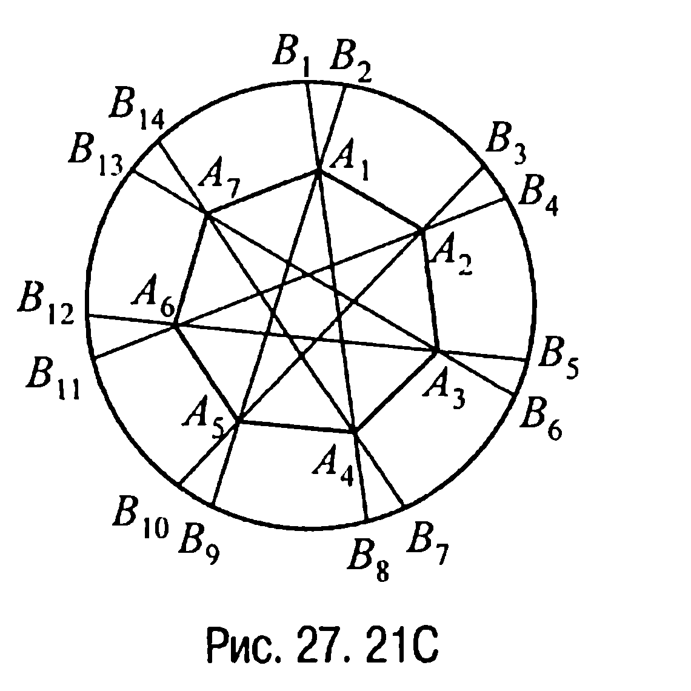

$\alpha_1 = \frac{1}{2}(\cup B_1 B_2 + \cup B_8 B_9),$

$\alpha_2 = \frac{1}{2}(\cup B_3 B_4 + \cup B_{10} B_{11}),$

$\alpha_3 = \frac{1}{2}(\cup B_5 B_6 + \cup B_{12} B_{13}),$

$\alpha_4 = \frac{1}{2}(\cup B_7 B_8 + \cup B_{14} B_1),$

$\alpha_5 = \frac{1}{2}(\cup B_9 B_{10} + \cup B_2 B_3),$

$\alpha_6 = \frac{1}{2}(\cup B_{11}B_{12} + \cup B_4B_5)$, $\alpha_7 = \frac{1}{2}(\cup B_{13}B_{14} + \cup B_6B_7)$ и, таким образом, $\alpha_1 + \alpha_2 + \alpha_3 + \alpha_4 + \alpha_5 + \alpha_6 + \alpha_7 = \frac{1}{2} \cdot 2\pi = \pi$.

**Ответ:** $\pi$.

**27.21C.** Пусть $O$ — центр окружности с бо́льшим радиусом (рис. 27.22C). Тогда так как $\angle AKB = 90^\circ$, то из прямоугольного треугольника $BKM$ находим, что $BM = \frac{MK}{\cos \angle KMB} = \frac{\sqrt{2 + \sqrt{3}}}{\cos 15^\circ}$ или, замечая, что $\cos 30^\circ = 2\cos^2 15^\circ - 1 = \frac{\sqrt{3}}{2}$, а значит, $\cos 15^\circ = \frac{\sqrt{2 + \sqrt{3}}}{2}$, находим, что $BM = 2$.

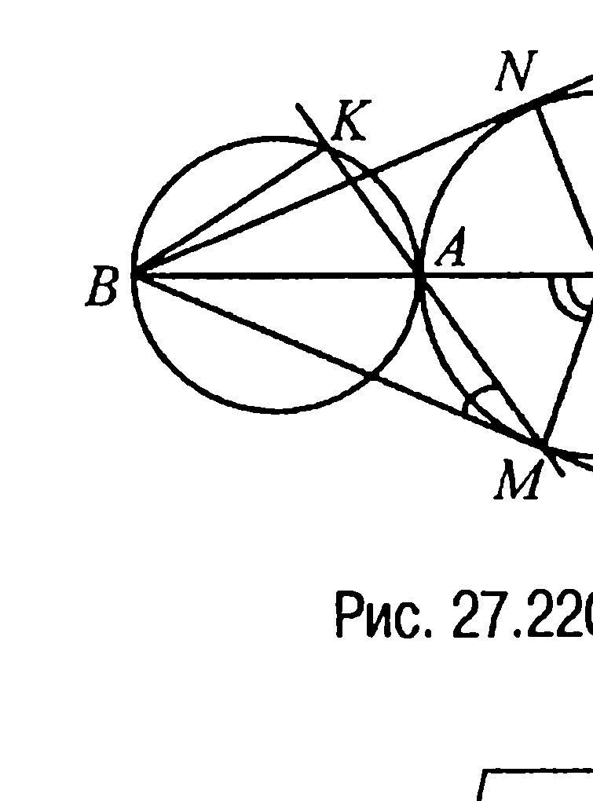

Далее, поскольку $\angle BOM = \angle AOM = 2\angle AMB = 30^\circ$, то из прямоугольного треугольника $BMO$ (точки $B, A, C$ лежат на одной прямой) следует, что $OM = BM \cdot \operatorname{ctg} \angle BOM = 2 \cdot \operatorname{ctg} 30^\circ = 2\sqrt{3}$:

Но в таком случае искомая площадь $S$, равная сумме площадей четырехугольника $BMON$ и сектора $OMCN$, — это

---
**стр. 579**
---

$S = 2S_{\Delta BMO} + S_{OMCN} = BM \cdot OM + \frac{\pi \cdot OM^2 \cdot 300^\circ}{360^\circ} = 4\sqrt{3} + 10\pi$.

**Ответ:** $4\sqrt{3} + 10\pi$.

**27.22C.** Пусть $\angle CBD = \varphi$ (рис. 27.23C). Тогда $\angle ABD = \varphi + 90^\circ$,

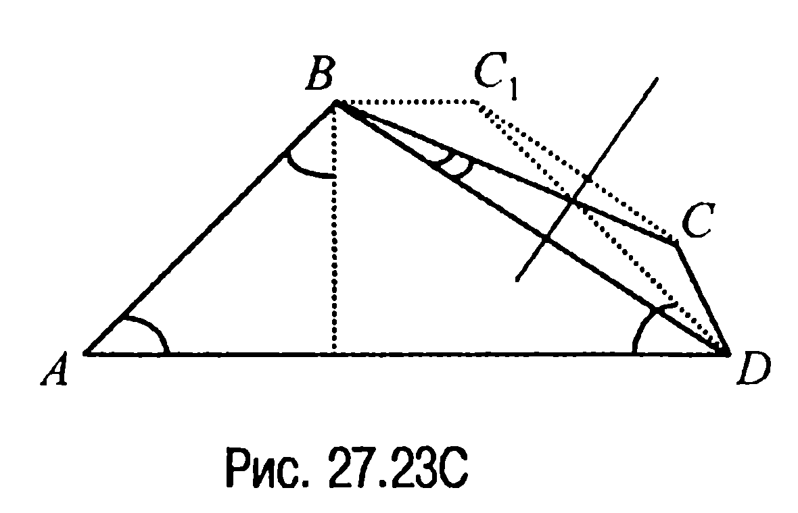

$\angle BDA = 180^\circ - (\angle ABD + \angle DAB) =$
$= 180^\circ - (\varphi + 90^\circ + 45^\circ) = 45^\circ - \varphi$

и, значит, $\angle CBD + \angle BDA = \varphi + 45^\circ - \varphi = 45^\circ$.

Пусть $C_1$ — точка, симметричная точке $C$ относительно серединного к отрезку $BD$ перпендикуляра. Тогда очевидно, что

$\Delta BC_1D = \Delta BCD$, $\angle C_1DA = \angle DAB = 45^\circ$, $BC_1 \parallel AD$, $BA = C_1D$,

т. е. четырехугольник $ABC_1D$ — равнобочная трапеция, равновеликая четырехугольнику $ABCD$. Но поскольку высота трапеции в данном случае равна $\frac{b-a}{2}$ (что очевидно), то

$S_{ABCD} = S_{ABC_1D} = \frac{1}{2} \frac{(a+b)(b-a)}{2} = \frac{b^2 - a^2}{4}$.

**Ответ:** $\frac{b^2 - a^2}{4}$.

**27.23C.** Пусть $O$ — точка пересечения диагоналей четырехугольника $ABCD$, $\angle CAB = \pi/6$ (рис. 27.24C) и пусть $S_{\Delta OBC} = S_1$,

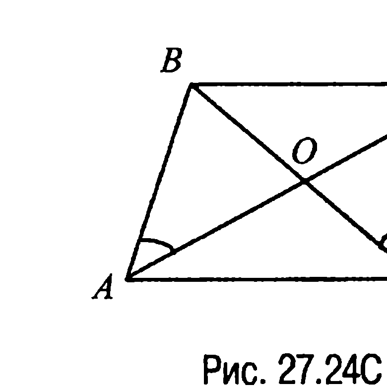

$S_{\Delta OCD} = S_2$, $S_{\Delta ODA} = S_3$, $S_{\Delta OAB} = S_4$. По условию площади указанных треугольников образуют арифметическую прогрессию. Предположим, для определенности, что

$S_2 = S_1 + d$, $S_4 = S_1 + 2d$, $S_3 = S_1 + 3d$,

где $d$ — разность прогрессии. Тогда поскольку $S_1 \cdot S_3 = S_2 \cdot S_4$ (задача 19.8C), то $S_1 \cdot (S_1 + 3d) = (S_1 + d) \cdot (S_1 + 2d)$ или $S_1^2 + 3S_1 \cdot d = S_1^2 + 3S_1 \cdot d + 2d^2$, откуда следует, что $d = 0$, а значит, $S_1 = S_2 = S_3 = S_4$.

---
**стр. 580**
---

Последняя цепочка равенств приводит к выводу, что четырехугольник $ABCD$ — параллелограмм.

Таким образом, $OC = 2$, $OD = \sqrt{7}/2$. Но по теореме синусов

$\frac{OC}{\sin \angle CDO} = \frac{OD}{\sin \angle DCO}$, откуда находим, что $\sin \angle CDO = \frac{2\sqrt{7}}{7}$ и

поэтому угол $\varphi = \angle CDO = \arcsin \frac{2\sqrt{7}}{7}$. Но тогда $\sin \angle COD =$

$= \sin \left(\pi - \frac{\pi}{6} - \varphi\right) = \sin\left(\frac{\pi}{6} + \varphi\right) = \sin \frac{\pi}{6} \cdot \cos\left(\arcsin \frac{2\sqrt{7}}{7}\right) +$

$+ \cos \frac{\pi}{6} \cdot \sin\left(\arcsin \frac{2\sqrt{7}}{7}\right) = \frac{1}{2}\sqrt{1 - \left(\frac{2\sqrt{7}}{7}\right)^2} + \frac{\sqrt{3}}{2} \cdot \frac{2\sqrt{7}}{7} = \frac{3}{2} \cdot \frac{\sqrt{21}}{7}$,

а искомая площадь

$S_{ABCD} = \frac{1}{2} AC \cdot BD \cdot \sin \angle COD = \frac{1}{2} \cdot 4 \cdot \sqrt{7} \cdot \frac{3}{2} \frac{\sqrt{21}}{7} = 3\sqrt{3}$.

**Ответ:** $3\sqrt{3}$.

**27.24C.** При решении задачи воспользуемся понятием вектора. Итак, пусть $\overline{AB} = \bar{a}$, $\overline{BC} = \bar{b}$ (рис. 27.25C). Тогда

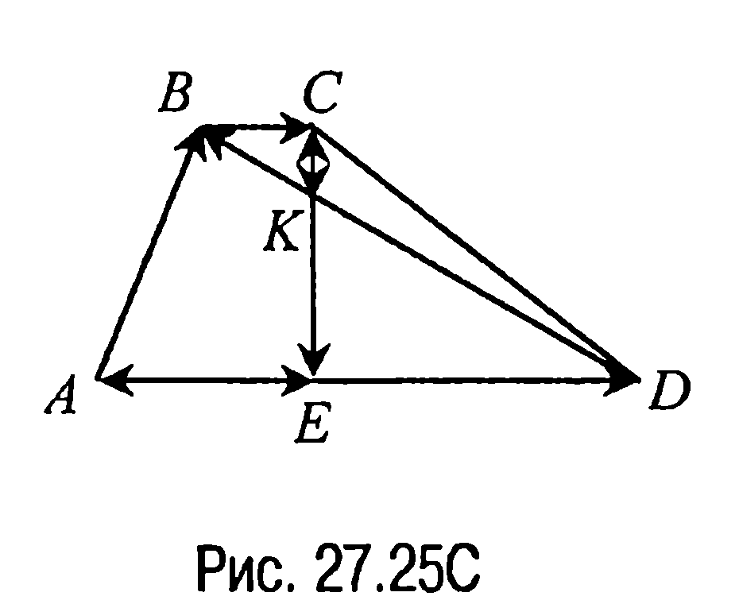

$\overline{AE} = 2\bar{b}$, $\overline{ED} = 3\bar{b}$, $\overline{DB} = \overline{DA} + \overline{AB} =$
$= \bar{a} - 5\bar{b}$, $\overline{CE} = \overline{CB} + \overline{BA} + \overline{AE} = \bar{b} - \bar{a}$.

Теперь так как $\overline{CK} \uparrow\uparrow \overline{CE}$, то $\overline{CK} =$
$= \lambda \overline{CE} = \lambda \bar{b} - \lambda \bar{a}$, где $\lambda > 0$ — некоторая константа, а $\overline{KB} = \overline{KC} + \overline{CB} = \lambda \bar{a} -$
$- \lambda \bar{b} - \bar{b} = \lambda \bar{a} - (\lambda + 1) \cdot \bar{b}$. С другой стороны, поскольку
$\overline{KB} \uparrow\uparrow \overline{DB}$, то $\overline{KB} = \mu \overline{DB}$, где $\mu > 0$ — некоторая константа, и,
значит, $\lambda \bar{a} - (\lambda + 1) \bar{b} = \mu \bar{a} - 5\mu \bar{b}$. Но в таком случае приходим
к системе $\begin{cases} \lambda = \mu, \\ \lambda + 1 = 5\mu, \end{cases}$ решая которую, находим, что $\lambda = \mu = \frac{1}{4}$.

---
**стр. 581**
---

Таким образом, $\overline{KB} = \frac{1}{4}\overline{DB}$ и, следовательно, $BK : KD = 1 : 3$.

**Ответ:** $1 : 3$.

**27.25C.** Предположим, что искомый квадрат $ABCD$ построен (рис. 27.26C). Отложим на диагонали $AC$ квадрата отрезок $AE$, равный стороне квадрата и соединим точки $E$ и $D$. Тогда в треугольнике $ECD$ отрезок $EC = a$ — данная разность диагонали и стороны, причем $\angle ECD = 45^\circ$.

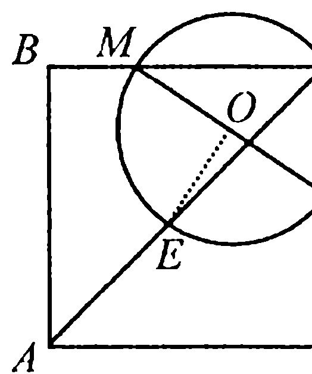

Теперь так как треугольник $DAE$ — равнобедренный, то $\angle AED = \frac{180^\circ - 45^\circ}{2} = 90^\circ - \frac{45^\circ}{2}$. Угол $CED$ — смежный с углом $AED$, поэтому

$\angle CED = 180^\circ - \left( 90^\circ - \frac{45^\circ}{2} \right) = 90^\circ + \frac{45^\circ}{2}$.

Таким образом, у треугольника $ECD$ известны сторона $EC = a$ и прилегающие к ней $\angle ECD = 45^\circ$ и $\angle CED = 112,5^\circ$.

Отсюда следует алгоритм решения задачи. Именно, сначала строим треугольник $ECD$ по стороне $EC = a$ и прилегающим углам в $45^\circ$ и $112,5^\circ$, затем через точку $D$ проводим прямую, перпендикулярную отрезку $CD$. Пусть $A$ — точка пересечения проведенной прямой с прямой $EC$. Если теперь из точек $A$ и $C$ восстановить перпендикуляры к прямым $AD$ и $CD$ соответственно, то точка $B$ пересечения этих перпендикуляров будет четвертой вершиной искомого квадрата.

**27.26C.** Пусть четырехугольник $ABCD$ — искомый квадрат (рис. 27.27C). Тогда поскольку $\angle BCD = 90^\circ$, то, с одной стороны, точка $C$ лежит на окружности диаметра $MN$ с центром $O$, где точка $O$ — серединная точка отрезка $MN$. С другой стороны, луч $CA$ — биссектриса угла $BCD$ и, следова-

---
**стр. 582**
---

тельно, точка $C$ лежит на прямой $AE$, где точка $E$ — серединная точка дуги $MN$. Из этого факта и вытекает способ построения квадрата.

Именно, построив серединный к отрезку $MN$ перпендикуляр и проведя затем окружность с центром в серединной точке $O$ отрезка $MN$ радиуса $\frac{1}{2}MN$, отметим точку $E$ — точку пересечения построенного перпендикуляра с окружностью. Далее, пусть $C$ — точка пересечения прямой $AE$ с построенной окружностью. Тогда, проведя прямые $CM$ и $CN$, а затем опустив из точки $A$ на эти прямые перпендикуляры, мы и получим искомый квадрат.

**27.27C.** Предположим, что искомая трапеция (пусть это будет трапеция $ABCD$ с основаниями $AD = a$, $BC = b$ и диагоналями $AC = d_1$, $BD = d_2$) (рис. 27.28C) построена.

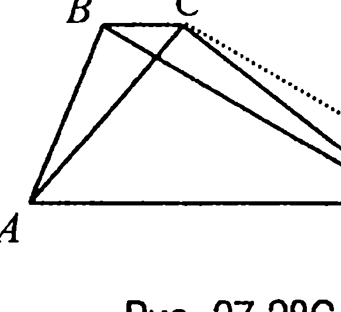

Проведем через точку $C$ прямую, параллельную прямой $BD$, и обозначим через $E$ точку пересечения этой прямой с продолжением стороны $AD$ трапеции за точку $D$. Тогда алгоритм решения задачи очевиден. Именно, сначала строим по трем сторонам $(a + b)$, $d_1$ и $d_2$ треугольник $ACE$. Затем на стороне $AE$ откладываем отрезок $AD = a$ и, наконец, строим четвертую вершину $B$ искомой трапеции.
