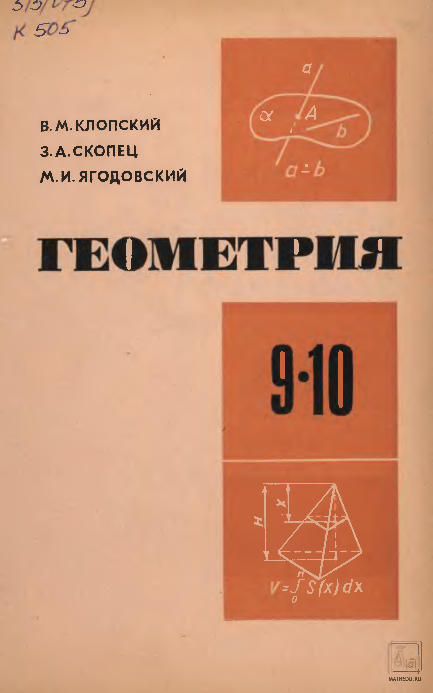

# ВСТУПИТЕЛЬНЫЕ МАТЕРИАЛЫ

## Вступительные материалы

---
**стр. -2**
---

В. М. Клопский  
З. А. Скопец  
М. И. Ягодовский

ГЕОМЕТРИЯ

9·10

---
**стр. -1**
---

$$\vec d = x\vec a + y\vec b + z\vec c$$

$$(\vec a \perp \vec b) \iff (\vec a \cdot \vec b = 0)$$

---
**стр. 0**
---

$$(a \parallel b; \; b \subset \alpha) \Rightarrow (a \parallel \alpha)$$

$$(a \perp b; \; a \perp c; \; b \cap c = M; \; b \subset \alpha; \; c \subset \alpha) \Rightarrow (a \perp \alpha)$$

---
**стр. 1**
---

В. М. КЛОПСКИЙ,
З. А. СКОПЕЦ,
М. И. ЯГОДОВСКИЙ

# ГЕОМЕТРИЯ

УЧЕБНОЕ ПОСОБИЕ
для 9 и 10 классов
средней школы

ПОД РЕДАКЦИЕЙ З. А. СКОПЦА

*Утверждено*
*Министерством просвещения СССР*

Издание 4-е

МОСКВА «ПРОСВЕЩЕНИЕ» 1978

---
**стр. 2**
---

513 (075)
К50

В настоящем издании объединены учебные пособия по геометрии для IX и X классов. Основной материал предыдущих изданий не изменился. Единственное исключение — раздел «Задачи на повторение по курсу IX класса», в котором в связи с удалением нескольких задач незначительно изменилась нумерация. Некоторые сокращения проведены в разделах «Приложения».

Для удобства читателя в этой книге сохранена нумерация параграфов и рисунков, приведенная в пособиях для IX и X классов предыдущих изданий.

<!-- выходные данные внизу страницы -->
К 60601-163 / 103 (02)-78 инф. письмо
© Издательство «Просвещение», 1977 г.
