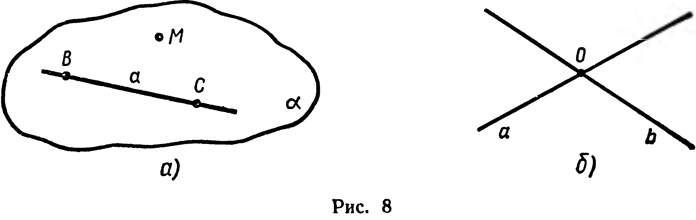
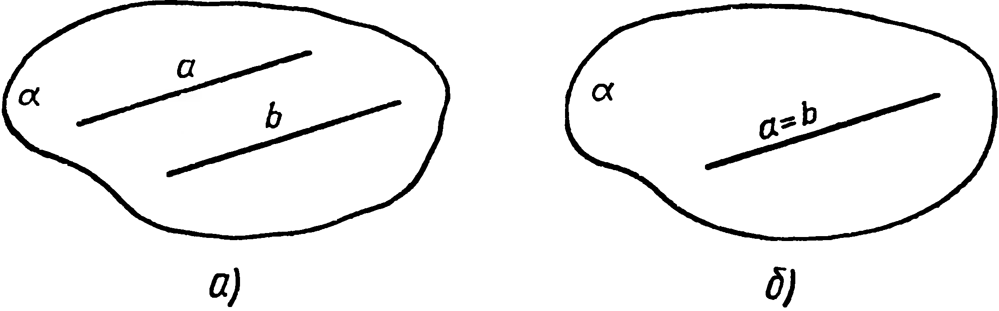
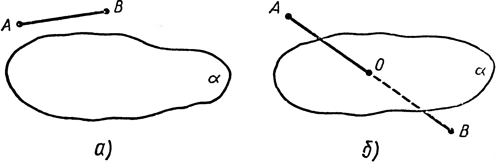

## 1.3. Следствия из аксиом

---
**стр. 8**
---

плоскости принадлежит: 1) центр вписанной в треугольник окружности; 2) центр описанной около него окружности?

**$9^\circ$.** Объясните, почему любой стол, имеющий три ножки, обязательно устойчив, а по отношению к столу с четырьмя ножками этого утверждать нельзя.

**$10^\circ$.** Каждая ли точка дуги окружности принадлежит плоскости, если известно, что этой плоскости принадлежат: 1) две различные точки дуги; 2) три различные точки дуги?

**$11^\circ$.** Как можно проверить качество изготовления линейки, имея хорошо обработанную плоскую плиту? На каком теоретическом положении основана эта проверка?

**$12^\circ$.** Могут ли две различные плоскости иметь две различные общие прямые?

**$13^*$.** Дано: $a \cap b = C$, $b \cap c = A$, $c \cap a = B$, $A \neq B$, $A_1 \in a$, $B_1 \in b$, $C_1 \in (A_1B_1)$. Доказать: $C_1 \in (ABC)$.

**14.** Дано: $\alpha \cap \beta = m$, $a \subset \alpha$, $b \subset \beta$, $a \cap b = A$. Доказать: $A \in m$.

**15.** Даны точки $A$, $B$, $C$, причём $A \notin (BC)$. Докажите, что $|AB| + |BC| > |AC|$.

**§ 3. СЛЕДСТВИЯ ИЗ АКСИОМ**

**1. Следствие 1.** *Через прямую и не принадлежащую ей точку можно провести одну и только одну плоскость.*

**Доказательство.** Пусть даны прямая $a$ и не принадлежащая ей точка $M$ (рис. 8, а). На данной прямой выберем две различные точки $B$ и $C$. Согласно аксиоме 4, через точки $M$, $B$ и $C$ проходит плоскость $\alpha$, причём прямая $a$ лежит в этой плоскости (аксиома 3). Итак, доказано существование плоскости, проходящей через $a$ и $M$. Единственность такой плоскости следует из аксиомы 4. Действительно, любая плоскость, содержащая прямую $a$ и точку $M$, проходит через точки $B$, $C$, $M$. Но через эти точки нельзя провести две различные плоскости. ■

Две прямые называют *пересекающимися*, если они имеют единственную общую точку ($a \cap b = O$; рис. 8, б).

---
**стр. 9**
---

**Следствие 2.** *Через две пересекающиеся прямые можно провести одну и только одну плоскость.* (Докажите самостоятельно.)

Определение параллельных прямых, известное из планиметрии, сохраняется и в стереометрии: две прямые называются **параллельными**, если они лежат в одной плоскости и не имеют общей точки или совпадают (рис. 9, а и б).

**Следствие 3.** *Через две различные параллельные прямые можно провести только одну плоскость.*

Существование одной такой плоскости следует из определения параллельных прямых, поэтому оно особо не оговаривается в формулировке следствия. Докажите, что не существует другой плоскости, проходящей через обе данные прямые.

**2.** Пусть дана плоскость $\alpha$. Рассмотрим множество всех точек пространства, не принадлежащих $\alpha$. Плоскость $\alpha$ разбивает это множество на два непустых подмножества, которые называются **открытыми полупространствами** с границей $\alpha$. Принимаем без доказательства следующие свойства открытых полупространств (рис. 10, а, б):

1. *Отрезок, соединяющий любые две точки одного открытого полупространства, не пересекает его границы.*
2. *Отрезок, соединяющий любые две точки различных открытых полупространств с общей границей $\alpha$, пересекает эту границу.*

Если точки $A$ и $B$ принадлежат одному открытому полупространству с границей $\alpha$, то говорят, что $A$ и $B$ расположены по одну сторону от плоскости $\alpha$ (рис. 10, а). Если же $A$ и $B$ при-

---
**стр. 10**
---

...имеет вид, и если $A$ и $B$ принадлежат различным открытым полупространствам с общей границей $\alpha$, то $A$ и $B$ расположены по разные стороны от $\alpha$ (рис. 10, б).

Объединение открытого полупространства и его границы называют **замкнутым полупространством** (или просто полупространством).

Полупространство является выпуклой фигурой^1^.

### Задачи

**16°.** Сколько различных плоскостей можно провести: 1) через одну точку; 2) через две различные точки; 3) через три различные точки; 4) через четыре точки, никакие три из которых не принадлежат одной прямой?

**17.** Дано: $a \cap b = A$, $a \subset \alpha$. Верно ли утверждение, что: 1) $A \in \alpha$; 2) $b \subset \alpha$?

**18°.** 1) Даны четыре точки, не принадлежащие одной плоскости. Докажите, что никакие три из них не принадлежат одной прямой.  
2) Верно ли обратное утверждение?

**19°.** Из четырех точек никакие три не принадлежат окружности. Принадлежат ли все четыре точки одной плоскости?

**20.** Даны две несовпадающие параллельные прямые. Докажите, что все прямые, пересекающие обе данные прямые, лежат в одной плоскости.

**21°.** Даны две пересекающиеся прямые. Верно ли утверждение, что любая прямая, пересекающая обе данные прямые, лежит с ними в одной плоскости?

**22°.** Может ли пересечение сторон угла с плоскостью быть одной точкой, двумя различными точками, тремя различными точками?

**23.** Дано множество лучей, имеющих общее начало. Никакие три из них не лежат в одной плоскости. Сколько различных плоскостей можно провести так, чтобы в каждой плоскости лежало по два из данных лучей, если всего лучей: 1) три, 2) четыре, 3) $n$?

**24.** Три различные плоскости имеют общую точку. Верно ли утверждение, что эти плоскости имеют общую прямую? Сколько различных прямых может получиться при попарном пересечении этих плоскостей?

**25.** 1) Даны отрезки $AB$, $BC$, $CD$, $DA$, причем $(AC) \cap (BD) = M$. Докажите, что данные отрезки лежат в одной плоскости.  
2) Столяр с помощью двух нитей проверяет, будет ли устойчиво стоять на полу изготовленный стол, имеющий четыре ножки. Как нужно натянуть нити?

---
^1^ Определение выпуклой фигуры, известное из планиметрии, распространяется и на пространственные фигуры: фигура называется **выпуклой**, если она содержит отрезок, соединяющий любые две ее точки.
