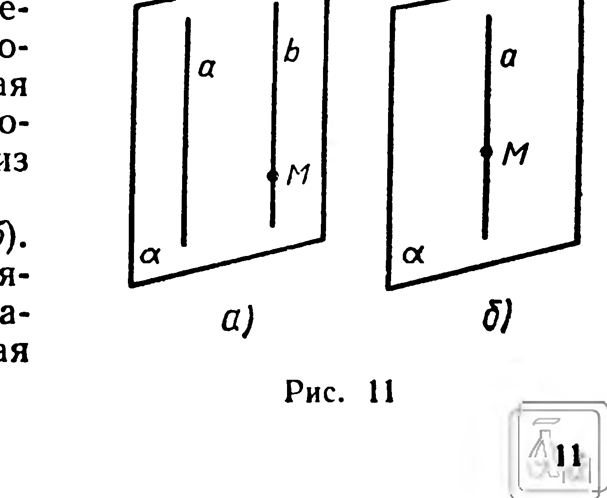

## 1.4. Проведение в пространстве прямой, параллельной данной прямой

---
**стр. 11**
---

**26°.** 1) $P_1$ и $P_2$ — различные полупространства с общей границей $\alpha$. Найдите: а) $P_1 \cap P_2$; б) $P_1 \cup P_2$.  
2) Охарактеризуйте взаимное расположение полупространств $P$ и $Q$ и их границ $\alpha$ и $\beta$, если: а) $P \cap Q = \alpha$; б) $P \cup Q = P \cap Q$.

### § 4. Проведение в пространстве прямой, параллельной данной прямой

Геометрические построения на плоскости выполняют при помощи чертежных инструментов — циркуля, линейки, угольника.

Мы не располагаем инструментами для проведения в пространстве прямой или плоскости. Поэтому в стереометрии термин «провести плоскость (прямую)» употребляют в смысле «доказать существование плоскости (прямой)», удовлетворяющей поставленным условиям. Например, в предыдущем параграфе (следствие 1) говорится о проведении плоскости через прямую и точку вне ее. Это означает, что существует плоскость, проходящая через данные прямую и точку.

Доказательство теорем и решение многих задач сопровождается схематическими рисунками фигур, причем их выполнение не проводится по строго сформулированным правилам: достаточно, чтобы чертеж вызывал желаемое представление об изображаемой фигуре. Иной подход к выполнению чертежей в стереометрии будет рассмотрен в § 5, 12 и 13.

**Задача.** Через данную точку $M$ провести прямую, параллельную данной прямой $a$.

**Решение.** Возможны два случая.

а) Пусть $M \notin a$ (рис. 11, а). Согласно определению параллельных прямых, данная и искомая прямые должны лежать в одной плоскости.

1. Проведем плоскость $\alpha$ через точку $M$ и прямую $a$ (§ 3, следствие 1).

2. В плоскости $\alpha$ проведем через $M$ прямую $b$, параллельную $a$ (это выполнимо на основании аксиомы 9); $b$ — искомая прямая.

Задача имеет единственное решение. Докажем это.

Искомая прямая $b$ должна лежать в той единственной плоскости $\alpha$, которая проходит через прямую $a$ и точку $M$. В плоскости $\alpha$ существует единственная прямая, параллельная $a$ и проходящая через $M$ (это известно из планиметрии).

б) Пусть $M \in a$ (рис. 11, б). В этом случае единственной прямой, проходящей через $M$ и параллельной $a$, служит данная прямая $a$.

