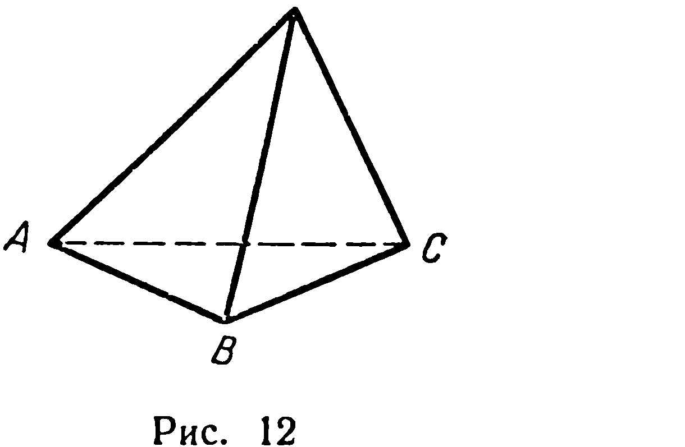
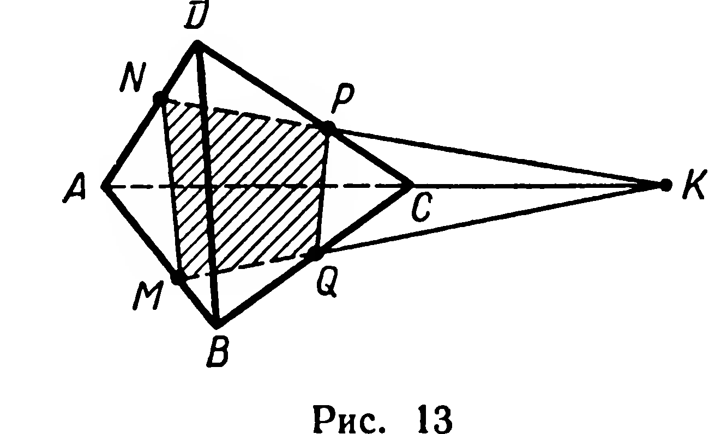

## 1.5. Решение задачи на построение сечения многогранника

---
**стр. 12**
---

Мы доказали, что *через данную точку можно провести одну и только одну прямую, параллельную данной прямой*.

### Задачи

**27.** Даны прямая $a$ и точка $M$. Через данную точку проведите прямую, пересекающую данную прямую под прямым углом. Сколько решений имеет задача, если: 1) $M \notin a$; 2) $M \in a$?

**28.** Дано: $a \cap \alpha = M$, $N \notin a$. Проведите линию пересечения плоскости $\alpha$ с плоскостью, проходящей через $a$ и $N$.

**29.** В плоскости $\alpha$ даны прямая $a$ и точка $M$. Через точку $N \notin \alpha$ проведите плоскость $\beta$ так, чтобы линия пересечения плоскостей $\alpha$ и $\beta$ проходила через $M$ и была перпендикулярна к $a$.

### § 5. Решение задачи на построение сечения многогранника^1^

Простейшим многогранником служит треугольная пирамида (рис. 12). Она имеет всего четыре грани. Поэтому мы будем ее кратко именовать *тетраэдром* (четырехгранником). Если пересечением многогранника и плоскости является многоугольник, то этот многоугольник называют *сечением многогранника* данной плоскостью.

**Задача.** На ребрах $AB$, $AD$, $CD$ тетраэдра $ABCD$ выбраны соответственно точки $M$, $N$, $P$ так, что прямые $NP$ и $AC$ не параллельны (рис. 13). Построить сечение тетраэдра плоскостью, проходящей через данные точки.

**Решение.** Плоскость, проходящую через точки $M$, $N$, $P$, обозначим $\alpha$. Плоскость $\alpha$ имеет с плоскостью $DAC$ общие точки $N$ и $P$, поэтому пересечение плоскостей $DAC$ и $\alpha$ есть прямая $NP$ (аксиома 5). Отрезок $NP$ — пересечение грани $DAC$ и плоскости $\alpha$. Аналогично построим отрезок $NM$.

Точка $M$ принадлежит плоскости $\alpha$ и плоскости $ABC$; для построения линии пересечения этих плоскостей достаточно найти еще одну их общую точку. Такой точкой является точка $K$ пе-

---
^1^ Понятия «многогранник», «пирамида», «параллелепипед» и т. п. будут определены в X классе. Сейчас мы основываемся на сведениях из восьмилетней школы.

