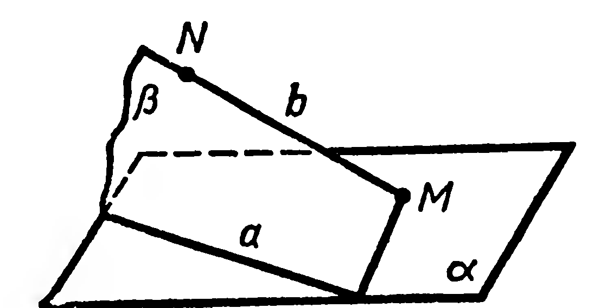

## 1.6. Скрещивающиеся прямые. Признак скрещивающихся прямых

---
**стр. 13**
---

пересечения прямых $NP$ и $AC$ ($K \in \alpha$ и $K \in (ABC)$). Построив прямую $MK$, получим точку $Q$ на ребре $BC$. Отрезки $MQ$ и $QP$ — остальные стороны искомого сечения.

Символическая запись построения:

1) $\alpha = (MNP)$; 2) $[NP] = \alpha \cap \triangle ADC$, $[NM] = \alpha \cap \triangle ADB$;

3) $(NP) \cap (AC) = K$; 4) $(KM) \cap [BC] = Q$; 5) $[MQ] = \alpha \cap \triangle ABC$, $[QP] = \alpha \cap \triangle BDC$.

Четырёхугольник $MNPQ$ — искомое сечение.

Замечание. Чертеж к этой задаче имеет существенные отличия от иллюстративных чертежей, применявшихся в предыдущем параграфе. Именно: на рисунке 13 точки $K$ и $D$, отрезки $MQ$, $QP$ и другие выбирались не произвольно, а занимали вполне определённое положение на изображении тетраэдра. Кроме того, построения теперь выполнялись чертёжными инструментами. Рассмотренные построения являются примером так называемых построений на проекционном чертеже. Подробнее о таких построениях вы узнаете позднее, при изучении § 12, 13.

**Задачи**

$30^\circ$. Каждое из рёбер тетраэдра $ABCD$ (рис. 12) равно $a$. Найдите: 1) сумму длин всех его рёбер; 2) сумму площадей всех его граней.

31. Даны тетраэдр $ABCD$ и точки $M$ и $N$, $M \in [DC]$, $N \in [AB]$. Постройте линию пересечения плоскостей $ABM$ и $DCN$.

32. 1) Постройте сечение тетраэдра $ABCD$ плоскостью, проходящей через вершину $B$ и середины рёбер $AD$ и $CD$.

2) Найдите площадь сечения, если каждое ребро тетраэдра равно $a$.

33. 1) Постройте сечение тетраэдра $ABCD$ плоскостью, проходящей через ребро $DC$ и точку пересечения медиан грани $ACB$.

2) Найдите площадь сечения, если каждое ребро тетраэдра равно $a$.

34. Плоскость $\alpha$ задана тремя различными точками, принадлежащими соответственно рёбрам $DA$, $DB$, $DC$ тетраэдра $ABCD$. Постройте точку пересечения плоскости $\alpha$ с прямой, проведённой через вершину $D$ и точку пересечения медиан грани $ABC$.

35. Дан тетраэдр $ABCD$. Постройте его сечение плоскостью, проходящей через медиану $DD_1$ грани $DBC$ и точку $M$, которая принадлежит грани $ADC$, но не принадлежит ни одному из рёбер тетраэдра.

§ 6. СКРЕЩИВАЮЩИЕСЯ ПРЯМЫЕ.
ПРИЗНАК СКРЕЩИВАЮЩИХСЯ ПРЯМЫХ

Мы уже знаем, что две прямые $a$ и $b$ в пространстве могут быть пересекающимися или параллельными (в частном случае совпадающими). Оказывается, возможен ещё один характерный

---
**стр. 14**
---

для стереометрии случай взаимного расположения двух прямых в пространстве.

*Определение.* Две прямые называются скрещивающимися, если они не пересекаются и не параллельны.

Докажем существование скрещивающихся прямых.

В плоскости $\alpha$ проведём прямую $a$ и выберем в этой плоскости точку $M$, не принадлежащую $a$ (рис. 14). Через точку $M$ и произвольную точку $N$, взятую вне плоскости $\alpha$, проведём прямую $b$. Докажем, что прямые $a$ и $b$ скрещиваются.

Применим способ рассуждения «от противного». Предположим, что прямые $a$ и $b$ пересекаются или параллельны. Тогда обе они лежат в некоторой плоскости $\beta$ (рис. 14). Плоскости $\beta$ и $\alpha$ совпадают (обе они проходят через прямую $a$ и точку $M$ вне её). Но $\beta$ проходит и через точку $N$, не принадлежащую $\alpha$, поэтому $\beta$ не может совпасть с $\alpha$. Получено противоречие, т. е. наше предположение неверно. Следовательно, прямые $a$ и $b$ скрещиваются. ■

Доказан признак скрещивающихся прямых.

1. **Теорема.** *Если одна из двух прямых лежит в плоскости, а другая пересекает эту плоскость в точке, не принадлежащей первой прямой, то данные прямые скрещиваются.*

Для обозначения скрещивающихся прямых $a$ и $b$ будем применять запись $a \div b$. Обратите внимание: через скрещивающиеся прямые нельзя провести плоскость.

**Задачи**

$36^\circ$. 1) Укажите на модели куба несколько пар его рёбер, лежащих на скрещивающихся прямых.

2) Укажите модели скрещивающихся прямых, пользуясь предметами классной обстановки.

37. Через данную точку проведите прямую, скрещивающуюся с данной прямой.

38. Верны ли высказывания: $1^\circ$) «Если две прямые в пространстве не имеют общей точки, то они параллельны»?

2) $(a \div b,\; b \div c) \Rightarrow (a \div c)$?

39. Известно, что $A \in \alpha$, $B \in \beta$, $\alpha \cap \beta = m$. Возможны ли какие-либо случаи взаимного расположения прямых $AB$ и $m$, кроме случая, изображённого на рисунке 15?

$40^\circ$. Назовите два ребра тетраэдра $ABCD$ (рис. 12), лежащие на скрещивающихся прямых. Сколько таких пар рёбер имеет тетраэдр?

$41^\circ$. Даны прямая $m$ и две принадлежащие ей точки $A$ и $B$. Через точки $A$ и $B$ проведены соответственно прямые $a$ и $b$, пер-
