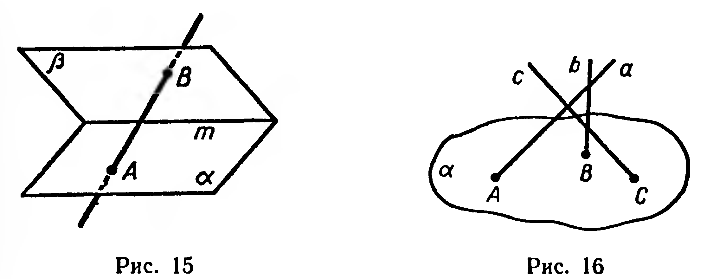
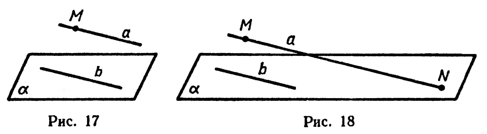
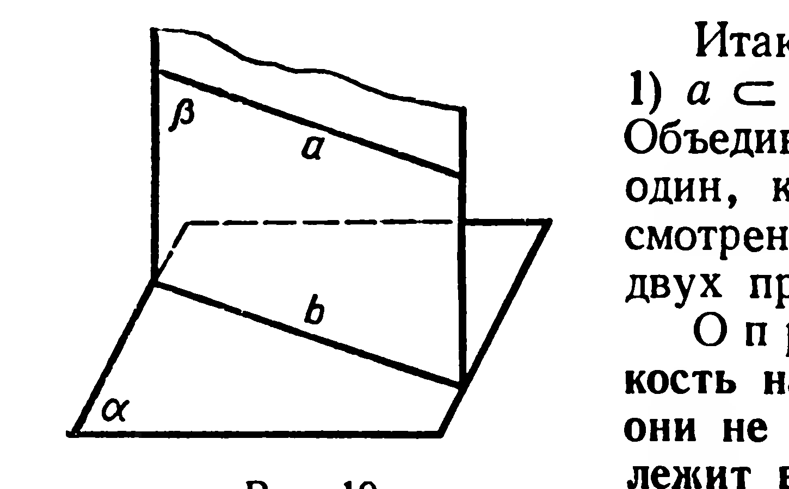
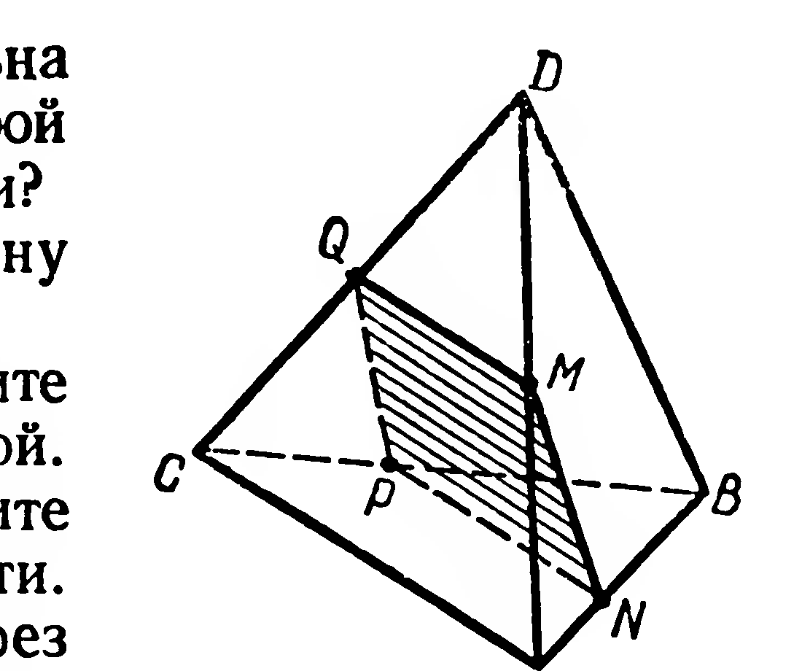

## 1.7. Взаимное расположение прямой и плоскости. Признак параллельности прямой и плоскости

---
**стр. 15**
---

пендикулярные прямой $m$. Каким может быть взаимное расположение прямых $a$ и $b$?

42. Дано: $a \div b$, $\{A_1, A_2\} \subset a$, $\{B_1, B_2\} \subset b$. Доказать: $(A_1B_1) \div (A_2B_2)$, $(A_1B_2) \div (A_2B_1)$.

43. Прямые $a$, $b$, $c$ пересекают плоскость $\alpha$ в точках $A$, $B$, $C$, причём $A \notin (BC)$ (рис. 16). Могут ли данные прямые быть попарно пересекающимися?

§ 7. ВЗАИМНОЕ РАСПОЛОЖЕНИЕ ПРЯМОЙ И ПЛОСКОСТИ.
ПРИЗНАК ПАРАЛЛЕЛЬНОСТИ ПРЯМОЙ И ПЛОСКОСТИ

Нам уже известны два случая взаимного расположения прямой и плоскости: 1) прямая лежит в плоскости, если две различные точки этой прямой принадлежат плоскости (§ 2, аксиома 3); 2) прямая и плоскость пересекаются, если они имеют единственную общую точку (§ 2).

Докажем, что возможен и третий случай: прямая $a$ и плоскость $\alpha$ не имеют общей точки ($a \cap \alpha = \varnothing$).

Пусть даны плоскость $\alpha$ и не принадлежащая ей точка $M$ (рис. 17). Проведём в плоскости $\alpha$ произвольную прямую $b$. Через точку $M$ проведём прямую $a$, параллельную $b$.

Предположим, что $a$ и $\alpha$ имеют общую точку $N$ (рис. 18). Прямые $a$ и $b$ параллельны и различны, поэтому прямая $b$ не может проходить через точку $N$, принадлежащую $a$. Тогда по признаку скрещивающихся прямых (§ 6) прямые $a$ и $b$ скрещиваются.

Пришли к противоречию: прямые $a$ и $b$ одновременно скрещиваются и параллельны. Следовательно, прямая $a$ и плоскость $\alpha$ не имеют общей точки.

---
**стр. 16**
---

Итак, возможны только три случая:

1) $a \subset \alpha$; 2) $a \cap \alpha = A$; 3) $a \cap \alpha = \varnothing$.

Объединим первый и третий случаи в один, как это было сделано при рассмотрении взаимного расположения двух прямых.

**Определение.** Прямая и плоскость называются *параллельными*, если они не имеют общей точки или прямая лежит в плоскости.

Обозначение параллельности прямой и плоскости: $a \parallel \alpha$ или $\alpha \parallel a$.

Имеет место следующий признак параллельности прямой и плоскости.

**2. Теорема.** *Если прямая параллельна какой-либо прямой, лежащей в плоскости, то данные прямая и плоскость параллельны.*

При доказательстве следует рассмотреть два случая: 1) прямая $a$ не лежит в плоскости $\alpha$; 2) прямая $a$ лежит в этой плоскости.

Истинность теоремы для первого случая доказывают рассуждения, проведённые выше.

Если $a \subset \alpha$, то $a \parallel \alpha$ согласно определению параллельности прямой и плоскости.

**3. Теорема (обратная).** *Если плоскость проходит через прямую, параллельную другой плоскости, и пересекает эту плоскость, то линия пересечения плоскостей параллельна данной прямой.*

Дано: $a \parallel \alpha$, $a \subset \beta$, $\beta \cap \alpha = b$. Доказать: $b \parallel a$.

Доказательство. Рассмотрим случай, когда $a \not\subset \alpha$ (рис. 19).

Во-первых, прямые $b$ и $a$ лежат в плоскости $\beta$; во-вторых, прямая $a$ не может пересекать прямую $b$, так как иначе $a$ пересекла бы плоскость $\alpha$. Следовательно, $b \parallel a$. Истинность теоремы для случая $a \subset \alpha$ очевидна.

**Задачи**

**44°.** Является ли сформулированное в теореме 2 условие параллельности прямой и плоскости только достаточным или также и необходимым?

**45°.** Прямая $a$ параллельна линии пересечения плоскостей $\alpha$ и $\beta$. Каково взаимное расположение $a$ и $\alpha$, $a$ и $\beta$?

**46°.** Сторона $AB$ треугольника $ABC$ лежит в плоскости $\alpha$. Как расположена относительно этой плоскости прямая $MN$, проходящая через середины сторон $AC$ и $BC$?

**47°.** Через сторону $AB$ правильного шестиугольника $ABCDEF$ проведена плоскость $\alpha$. Как расположена по отношению к этой плоскости прямая: 1) $CF$, 2) $CD$, 3) $DF$, 4) $DE$?

---
**стр. 17**
---

**48°.** Известно, что прямая параллельна плоскости. 1) Параллельна ли она любой прямой, лежащей в этой плоскости? 2) Может ли она пересечь хотя бы одну из таких прямых?

**49.** 1) Через данную точку проведите плоскость, параллельную данной прямой. 2) Через данную точку проведите прямую, параллельную данной плоскости.

**50.** Прямые $a$ и $b$ параллельны. Через прямую $a$ проведите плоскость, параллельную прямой $b$.

**51.** Точки $A$ и $B$ принадлежат соответственно пересекающимся плоскостям $\alpha$ и $\beta$, но не принадлежат их линии пересечения $c$. Проведите через $A$ и $B$ плоскость, параллельную $c$.

**52°.** Дано: $a \cap \alpha = M$, $b \parallel \alpha$. Каким может быть взаимное расположение прямых $a$ и $b$?

**53.** Точки $M$ и $N$ — внутренние точки рёбер $AD$ и $AB$ тетраэдра $ABCD$. Построить сечение тетраэдра плоскостью, проходящей через данные точки и параллельной прямой $AC$.

*Решение.* **Анализ.** Предположим, что сечение построено (рис. 20).

Пересечение плоскости сечения с гранью $ADB$ получим, соединив точки $M$ и $N$. По условию прямая $AC$ параллельна плоскости сечения, поэтому пересечениями граней $ACB$ и $ACD$ с плоскостью сечения служат отрезки $NP$ и $MQ$, параллельные прямой $AC$ (§ 7, теорема 3).

*Построение.* 1) $[NP] \parallel (AC)$, $P \in [BC]$; 2) $[MQ] \parallel (AC)$; $Q \in [DC]$. Четырёхугольник $NMQP$ — искомое сечение.

*Доказательство.* Плоскость $NMQ$ параллельна прямой $AC$, так как $(MQ) \parallel (AC)$ (§ 7, теорема 2).

*Исследование.* Задача имеет единственное решение. Действительно, ребро $BC$ пересекает плоскость сечения в единственной точке $P$, а по аксиоме 4 через точки $M$, $N$, $P$ проходит единственная плоскость.

**Примечание.** Применённая в этой задаче схема решения (анализ, построение, доказательство, исследование) является общей схемой решения задач на построение как в стереометрии, так и в планиметрии. Анализ в задаче на построение — это составление плана построения. Затем выполняется построение, после чего доказывается, что построенная фигура удовлетворяет всем требованиям условия задачи. Наконец, при исследовании выясняется, сколько различных решений имеет задача.

Впрочем, выделение всех четырёх этапов при решении каждой задачи не является обязательным: иногда удаётся сразу начать с построения, иногда доказательство проводится вместе с построением. Нередко исследование опускается. Если в задаче требуется провести исследование, то об этом говорится в условии.
