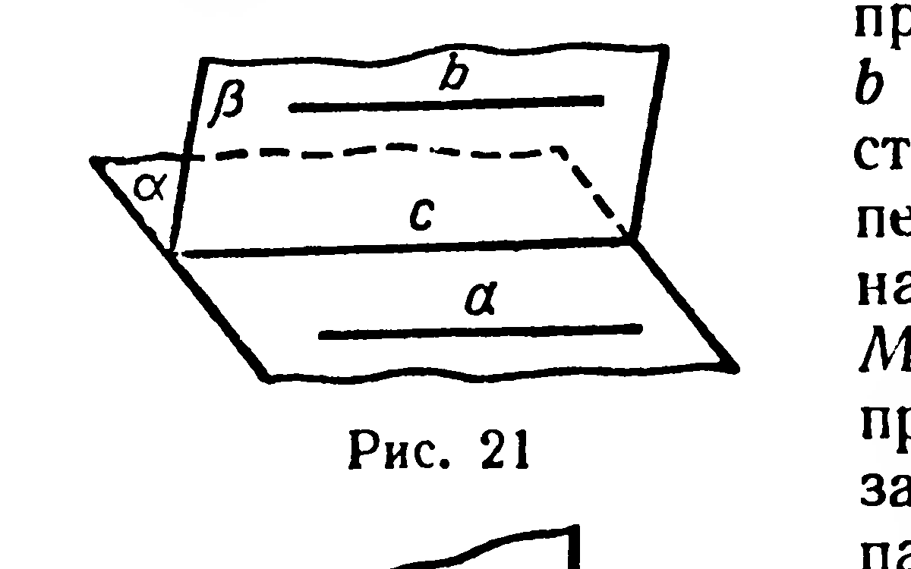
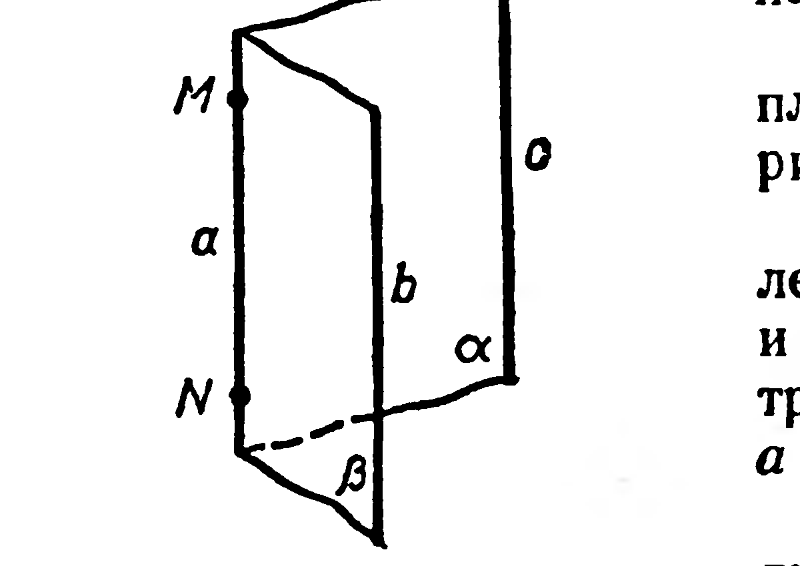

## 1.8. Транзитивность параллельности прямых. Связка параллельных прямых

---
**стр. 18**
---

**54.** 1) Постройте сечение тетраэдра $ABCD$ плоскостью, содержащей медиану $CM$ грани $ABC$ и параллельной прямой $AD$. 2) Найдите площадь сечения, если каждое ребро тетраэдра имеет длину $a$.

**55.** Дан тетраэдр $ABCD$. Постройте линию пересечения плоскости $ABC$ и плоскости, проходящей через $(AD)$ и параллельной $(BC)$.

**56.** Постройте сечение тетраэдра плоскостью, проходящей через середины рёбер $AD$ и $CD$ и внутреннюю точку $P$ ребра $BC$.

**§ 8. Транзитивность параллельности прямых. Связка параллельных прямых**

**4. Теорема.** *Если через каждую из двух параллельных прямых проведена плоскость, причём эти плоскости пересекаются, то их линия пересечения параллельна каждой из данных прямых.*

Доказательство. Пусть прямая $a$ параллельна прямой $b$ (рис. 21).

Через $a$ проведена плоскость $\alpha$, через $b$ — плоскость $\beta$, причём пересечением плоскостей $\alpha$ и $\beta$ служит прямая $c$. Докажем, что $c \parallel a$. По признаку параллельности прямой и плоскости заключаем, что прямая $a$ параллельна плоскости $\beta$, но тогда $c \parallel a$ (§ 7, теорема 3). Аналогично доказывается, что $c \parallel b$.

**5. Теорема.** *Если две прямые параллельны третьей, то они параллельны между собой.*

Доказательство. Пусть $a \parallel c$ и $b \parallel c$, причём $a$, $b$ и $c$ не лежат в одной плоскости (рис. 22).

Возьмём на прямой $a$ произвольную точку $M$. Через $c$ и $M$, $b$ и $M$ проведём соответственно плоскости $\alpha$ и $\beta$; по теореме 4 линия $MN$ пересечения этих плоскостей параллельна прямой $b$ и прямой $c$. Через точку $M$ нельзя провести две различные прямые, параллельные прямой $c$ (§ 4, задача), поэтому прямые $MN$ и $a$ совпадают. Но так как $(MN) \parallel b$, то и $a \parallel b$.

Случай, когда $a$, $b$, $c$ лежат в одной плоскости, был рассмотрен в планиметрии.

Из теоремы 5 следует, что параллельность прямых в пространстве (как и на плоскости) обладает свойством транзитивности: *если $a \parallel b$ и $b \parallel c$, то $a \parallel c$.*

Рассмотрим множество всех прямых пространства, параллельных одной и той же прямой $m$ (рис. 23). Это множе-
