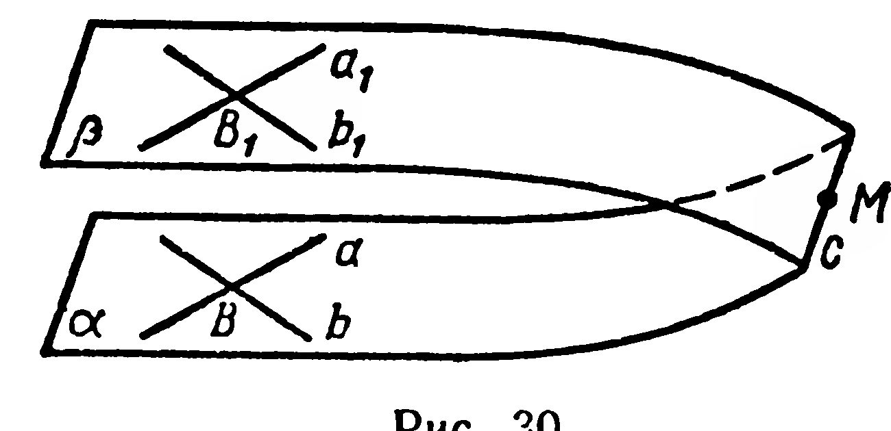
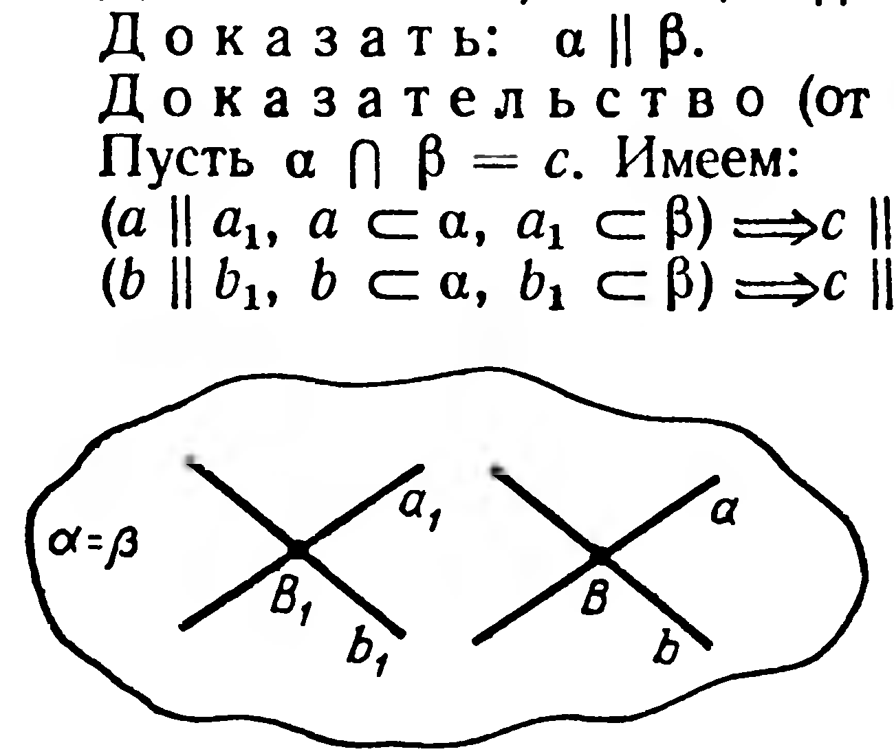

## 1.10. Взаимное расположение двух плоскостей. Признак параллельности плоскостей

---
**стр. 21**
---

плоскости $ABC$ (аксиома 3), поэтому $(FE)$ — искомая прямая.

*Исследование.* Задача имеет единственное решение. Точки $M$, $N$ и $P$ определяют единственную плоскость (§ 2, аксиома 4). Общая прямая $FE$ плоскостей $NMP$ и $ABC$ существует, так как они имеют общую точку $F$. Эта прямая единственна (аксиома 5).

**Задачи**

**69°.** Дан параллелепипед $ABCDA_1B_1C_1D_1$ (рис. 27); $|BC| = a$, $|AB| = b$, $|BB_1| = c$. Найдите сумму длин всех ребер параллелепипеда.

**70°.** Дан параллелепипед $ABCDA_1B_1C_1D_1$ (рис. 27). Плоскостям каких его граней параллельны прямые: 1) $AB$; 2) $DD_1$; 3) $B_1C_1$; 4) прямая, соединяющая середины ребер $AB$ и $CD$?

**71.** Постройте сечение куба плоскостью, проходящей через концы трех ребер, выходящих из одной вершины. Найдите периметр и площадь сечения, если ребро куба имеет длину $a$.

**72.** Дан параллелепипед $ABCDA_1B_1C_1D_1$; $M$ и $N$ — середины ребер $DC$ и $A_1B_1$. 1) Постройте точки пересечения прямых $AM$ и $AN$ с плоскостью грани $BB_1C_1C$; 2) постройте линию пересечения плоскостей $AMN$ и $BB_1C_1C$.

**73.** Постройте сечение параллелепипеда $ABCDA_1B_1C_1D_1$ плоскостью, проходящей через $(BC_1)$ и середину $M$ ребра $DD_1$.

**74.** В параллелепипеде $ABCDA_1B_1C_1D_1$ точка $M$ — середина $[B_1C_1]$. Постройте сечение параллелепипеда плоскостью, проходящей через: 1) $(DC)$ и $M$; 2) $(AD)$ и $M$.

**75.** Дан прямоугольный параллелепипед $ABCDA_1B_1C_1D_1$. Постройте его сечение плоскостью, проходящей через середины ребер $AB$, $AA_1$ и $CD$. Вычислите периметр сечения, принимая $|AB| = 8$ см, $|BC| = 7$ см, $|AA_1| = 6$ см.

**76.** Дан параллелепипед $ABCDA_1B_1C_1D_1$. Постройте точку пересечения прямой $A_1C$ с плоскостью, проходящей через ребра $AB$ и $C_1D_1$.

**§ 10. ВЗАИМНОЕ РАСПОЛОЖЕНИЕ ДВУХ ПЛОСКОСТЕЙ. ПРИЗНАК ПАРАЛЛЕЛЬНОСТИ ПЛОСКОСТЕЙ**

Два случая взаимного расположения двух плоскостей нам уже известны. Две плоскости: 1) совпадают, если они имеют три общие точки, не принадлежащие прямой (аксиома 4); 2) пересекаются, если они различны и имеют общую точку (аксиома 5).

Докажем, что возможен третий случай взаимного расположения двух плоскостей: две плоскости не имеют общей точки.

---
**стр. 22**
---

В плоскости $\alpha$ проведём две пересекающиеся прямые $a$ и $b$ (рис. 30). Через точку $B_1$, не принадлежащую $\alpha$, проведём прямые $a_1 \parallel a$ и $b_1 \parallel b$; через $a_1$ и $b_1$ проведём плоскость $\beta$ (§ 3, следствие 2).

Докажем (от противного), что $\alpha$ и $\beta$ не имеют общей точки. Предположим, что $M$ — общая точка плоскостей $\alpha$ и $\beta$. Из аксиомы 5 следует, что их пересечением служит некоторая прямая $c$. Но плоскость $\alpha$ проходит через $a$, плоскость $\beta$ — через $a_1$, причём $a \parallel a_1$. Тогда $c \parallel a$ (§ 8, теорема 4).

Таким же образом доказываем, что $c \parallel b$. Получили противоречие с аксиомой параллельных: в плоскости $\alpha$ через точку $B$ проходят две пересекающиеся прямые $a$ и $b$, параллельные прямой $c$. Следовательно, плоскости $\alpha$ и $\beta$ не имеют ни одной общей точки. $\blacksquare$

Итак, для двух плоскостей $\alpha$ и $\beta$ возможны только три случая: 1) $\alpha = \beta$; 2) $\alpha \cap \beta = a$; 3) $\alpha \cap \beta = \varnothing$.

Первый и третий случаи мы снова объединим.

**Определение.** Две плоскости называются параллельными, если они не имеют общей точки или совпадают.

Обозначение параллельности плоскостей $\alpha$ и $\beta$: $\alpha \parallel \beta$.

**6. Теорема** (признак параллельности двух плоскостей). *Если две пересекающиеся прямые одной плоскости соответственно параллельны двум прямым другой плоскости, то эти плоскости параллельны.*

Истинность признака для случая, когда данные плоскости различны, следует из рассуждения, проведённого выше. Запишем символически это доказательство (рис. 30).

Дано: $a \subset \alpha$, $b \subset \alpha$, $a \cap b = B$; $a_1 \subset \beta$, $b_1 \subset \beta$; $a_1 \parallel a$, $b_1 \parallel b$.

Доказать: $\alpha \parallel \beta$.

Доказательство (от противного).

Пусть $\alpha \cap \beta = c$. Имеем:

$(a \parallel a_1,\; a \subset \alpha,\; a_1 \subset \beta) \Rightarrow c \parallel a$ (теорема 4).

$(b \parallel b_1,\; b \subset \alpha,\; b_1 \subset \beta) \Rightarrow c \parallel b$.

Мы получили противоречие с аксиомой параллельных прямых. Следовательно, $\alpha \parallel \beta$.

Плоскости $\alpha$ и $\beta$, удовлетворяющие условию теоремы, могут совпадать (рис. 31). И в этом случае признак остаётся верным, так как совпадающие плоскости параллельны. $\blacksquare$

