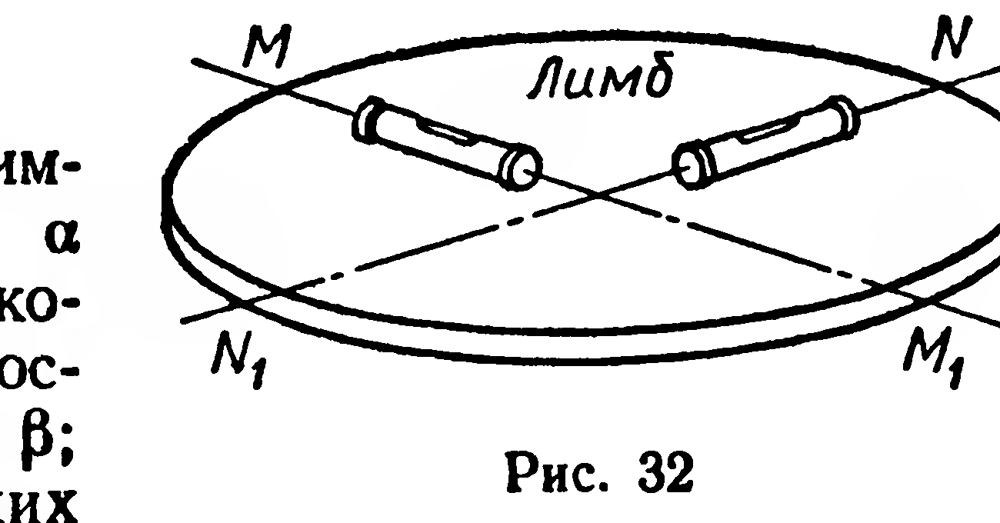
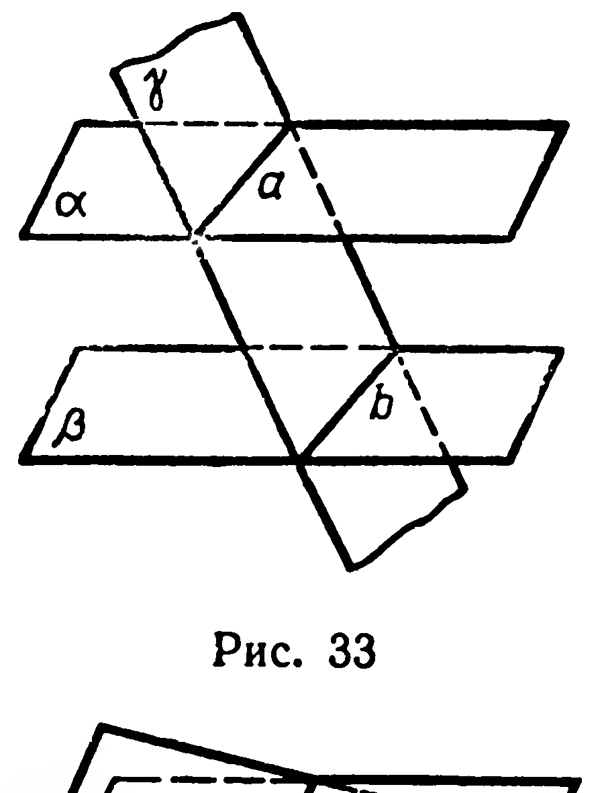
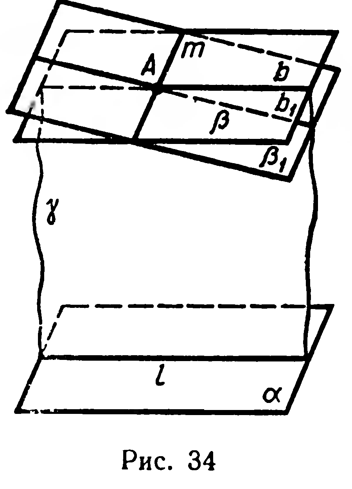
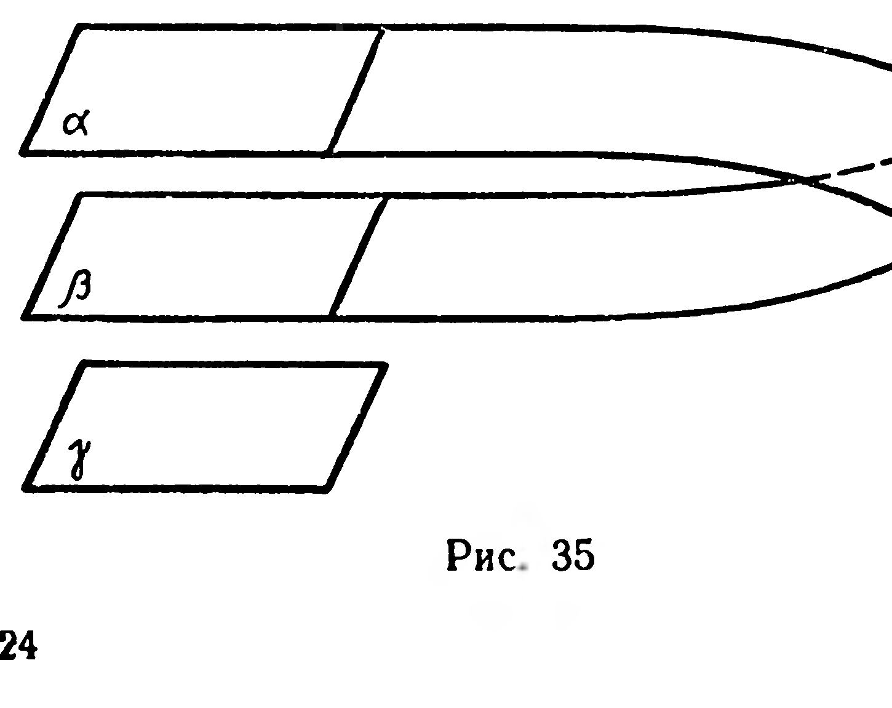
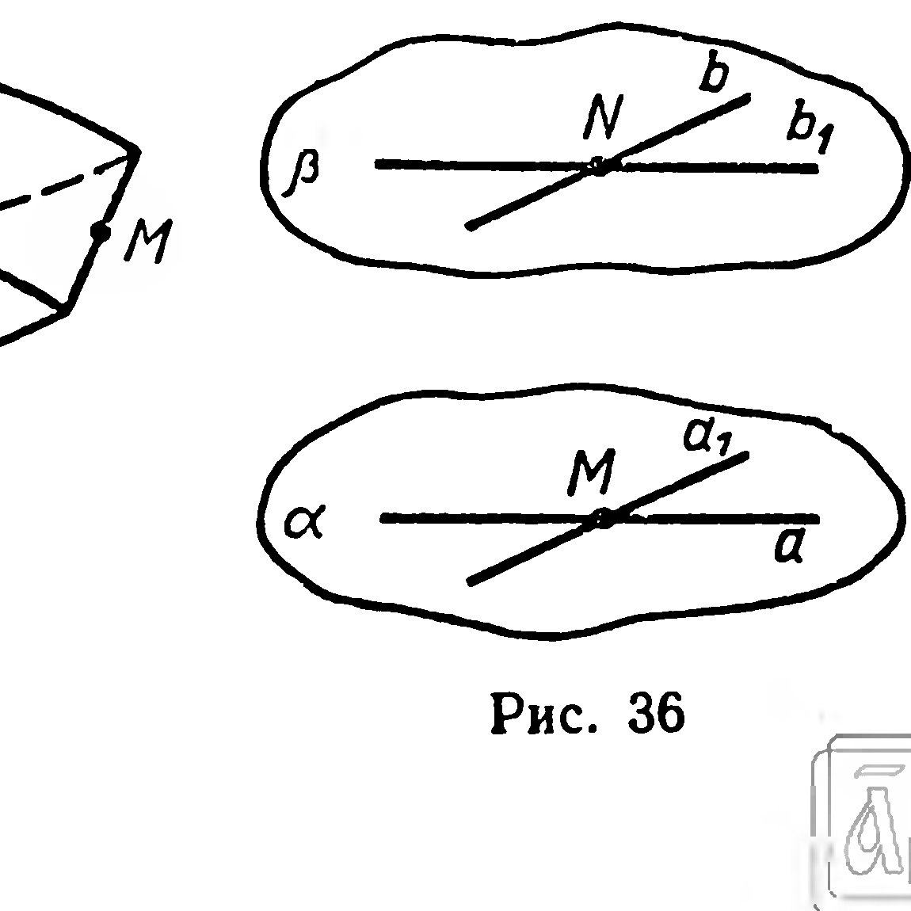
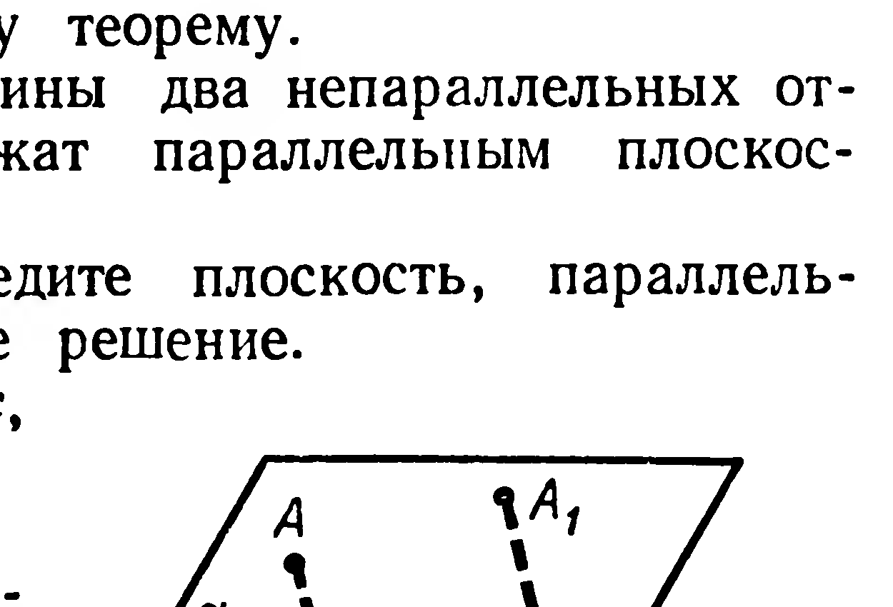
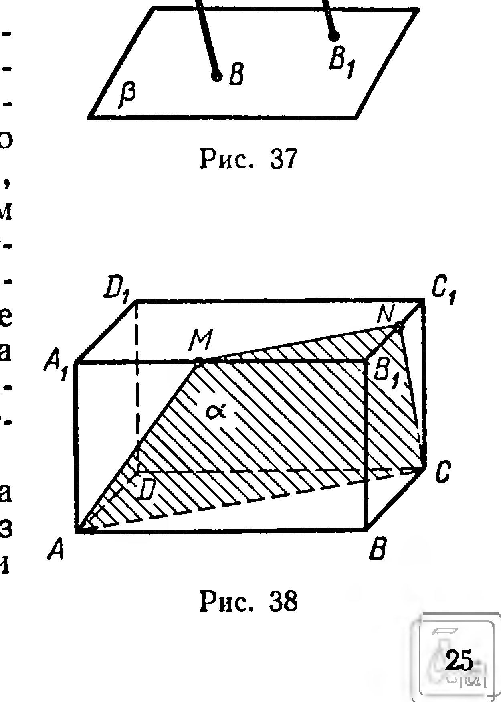

## 1.11. Теоремы о параллельных плоскостях

---
**стр. 23**
---

**Задачи.**

**77°.** Каким может быть взаимное расположение плоскостей $\alpha$ и $\beta$, если известно, что: 1) некоторая прямая $a$, лежащая в плоскости $\alpha$, не лежит в плоскости $\beta$; 2) ни одна из прямых, лежащих в плоскости $\alpha$, не лежит в плоскости $\beta$.

**78°.** Верно ли утверждение, что плоскости параллельны, если: 1) прямая, лежащая в одной плоскости, параллельна прямой другой плоскости; 2) две прямые, лежащие в одной плоскости, соответственно параллельны двум прямым другой плоскости?

**79°.** Укажите модели параллельных плоскостей на предметах классной обстановки.

**80°.** Докажите параллельность плоскостей, в которых расположены противолежащие грани параллелепипеда (рис. 27).

**81.** Диагональ и сторона многоугольника параллельны плоскости $\alpha$. Верно ли утверждение, что плоскость многоугольника параллельна плоскости $\alpha$, если многоугольник имеет: 1) четыре стороны; 2) пять сторон; 3) $n$ сторон ($n > 5$)?

**82.** Дан тетраэдр $ABCD$; точки $M$, $N$, $P$ являются серединами рёбер $DA$, $DB$, $DC$. Докажите, что $(MNP) \parallel (ABC)$.

**83.** Прямые $a$, $b$, $c$, не лежащие в одной плоскости, имеют общую точку $O$. На каждой из этих прямых взяты по разные стороны от точки $O$ соответственно пары точек: $A_1$ и $A_2$, $B_1$ и $B_2$, $C_1$ и $C_2$. Докажите, что плоскости $A_1B_1C_1$ и $A_2B_2C_2$ параллельны, если $|OA_1| = |OA_2|$, $|OB_1| = |OB_2|$, $|OC_1| = |OC_2|$.

**84.** 1) Докажите, что если каждая из двух пересекающихся прямых плоскости $\alpha$ параллельна плоскости $\beta$, то эти плоскости параллельны.

2°) Для проверки горизонтальности установки лимба угломерных инструментов пользуются двумя уровнями, расположенными на одной плоскости (рис. 32). Почему уровни располагают на пересекающихся прямых?

**§ 11. ТЕОРЕМЫ О ПАРАЛЛЕЛЬНЫХ ПЛОСКОСТЯХ**

**7. Теорема.** *Если две параллельные плоскости пересечены третьей плоскостью, то линии пересечения параллельны.*

Дано: $\alpha \parallel \beta$, $\gamma \cap \alpha = a$, $\gamma \cap \beta = b$.

Доказать: $a \parallel b$.

Доказательство проведите самостоятельно (рис. 33). Рассмотрите только тот случай, когда плоскости $\alpha$ и $\beta$ различны.

**8. Теорема.** *Через данную точку можно провести одну и только одну плоскость, параллельную данной плоскости.*

---
**стр. 24**
---

**Доказательство.** Пусть $A \notin \alpha$ (рис. 34). Существование плоскости $\beta$, проходящей через точку $A$ и параллельной плоскости $\alpha$, уже было доказано (§ 10). Докажем единственность такой плоскости.

Предположим, что через $A$ проходит плоскость $\beta_1$, параллельная $\alpha$ и не совпадающая с $\beta$. Тогда по аксиоме 5 плоскости $\beta$ и $\beta_1$ пересекаются по некоторой прямой $m$ (рис. 34). Проведём в плоскости $\alpha$ прямую $l$, скрещивающуюся с $m$; через $l$ и $A$ проведём плоскость $\gamma$. Эта плоскость пересечёт плоскости $\beta$ и $\beta_1$ соответственно по прямым $b$ и $b_1$. Согласно теореме 7 имеем: $b \parallel l$ и $b_1 \parallel l$, что противоречит аксиоме параллельных прямых. Следовательно, предположение о существовании плоскости $\beta_1$ неверно.

Истинность теоремы для случая, когда точка $B$ принадлежит плоскости $\alpha$, не требует подробных пояснений. В этом случае единственной плоскостью, проходящей через $B$ и параллельной $\alpha$, служит эта же плоскость $\alpha$. $\blacksquare$

**Следствие.** *Если каждая из двух данных плоскостей параллельна третьей плоскости, то данные две плоскости параллельны между собой.*

Доказательство проведите самостоятельно, например, способом от противного (рис. 35).

**Задача.** Через каждую из двух скрещивающихся прямых провести плоскость так, чтобы эти плоскости были параллельны.

**Решение.** Через произвольную точку $M$ прямой $a$ проведём прямую $a_1$, параллельную прямой $b$ (рис. 36); через прямые $a$ и $a_1$ проведём плоскость $\alpha$. Аналогично проводим плоскость $\beta$.

---
**стр. 25**
---

Плоскости $\alpha$ и $\beta$ параллельны согласно признаку параллельности плоскостей.

Задача имеет единственное решение.

## Задачи

**85.** Каким может быть взаимное расположение прямых $a$ и $b$, каждая из которых лежит в одной из двух различных параллельных плоскостей?

**86.** Могут ли быть параллельны прямые, полученные при пересечении двух пересекающихся плоскостей третьей плоскостью?

**87.** Докажите, что если плоскость пересекает одну из параллельных плоскостей, то она пересекает и другую.

**88.** Докажите, что если прямая пересекает одну из двух параллельных плоскостей, то она пересекает и другую.

**89.** 1) Закончите формулировку теоремы: «Два параллельных отрезка, концы которых принадлежат параллельным плоскостям (рис. 37), имеют...». Докажите эту теорему.

2°) Могут ли иметь равные длины два непараллельных отрезка, концы которых принадлежат параллельным плоскостям?

**90.** Через данную прямую проведите плоскость, параллельную данной плоскости. Исследуйте решение.

**91.** Дано: $\alpha \parallel \alpha_1$, $\beta \parallel \beta_1$, $\alpha \cap \beta = c$, $\alpha_1 \cap \beta_1 = c_1$.

Доказать: $c \parallel c_1$.

**92.** Построить сечение параллелепипеда $ABCDA_1B_1C_1D_1$ плоскостью $\alpha$, проходящей через вершины $A$, $C$ и точку $M$ ребра $A_1B_1$ (рис. 38).

Решение. Пересечение плоскости $\alpha$ с двумя гранями получим, проведя отрезки $AC$ и $AM$. Линия пересечения плоскости $\alpha$ с гранью $A_1B_1C_1D_1$ параллельна $(AC)$ (§ 11, теорема 7), поэтому построим $[MN] \parallel [AC]$. Наконец, строим отрезок $NC$. Трапеция $AMNC$ — искомое сечение. Если $M = B_1$, то искомое сечение есть треугольник $AB_1C$, а если $M = A_1$, то сечение — параллелограмм $AA_1C_1C$. Решение единственное (аксиома 4).

**93.** Постройте сечение тетраэдра $ABCD$ плоскостью, проходящей через внутреннюю точку $M$ ребра $AB$ и параллельной грани $DBC$.
