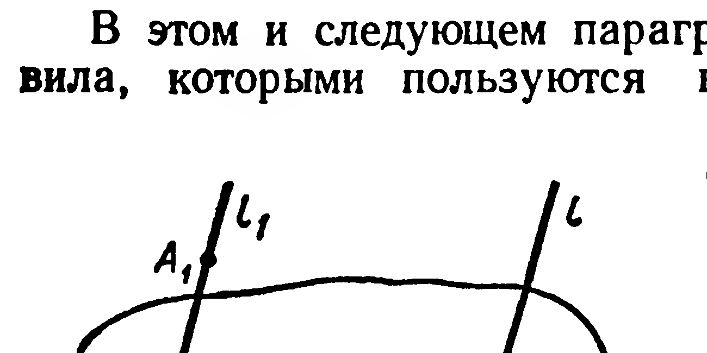
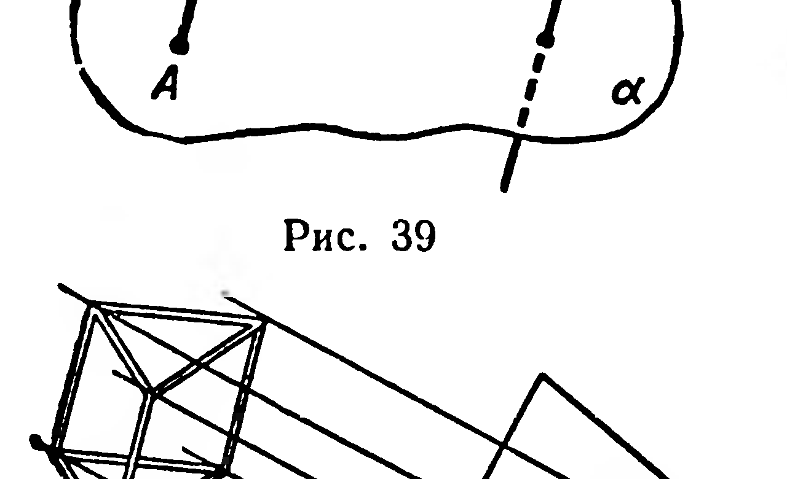
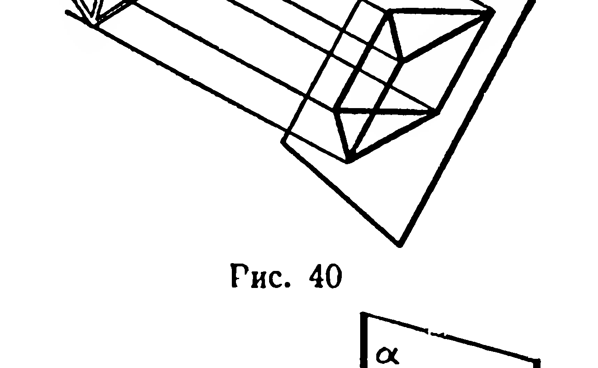

## 1.12. Параллельная проекция фигуры. Свойства параллельной проекции

---
**стр. 26**
---

**94.** Через вершину тетраэдра проведена плоскость, параллельная противолежащей грани. Постройте линии пересечения этой плоскости с плоскостями остальных граней тетраэдра.

**95.** На ребрах $AD$ и $B_1C_1$ параллелепипеда $ABCDA_1B_1C_1D_1$ даны внутренние точки $M$ и $N$. Постройте сечение параллелепипеда плоскостью, проходящей через точки $M$, $N$ и параллельной ребру $AB$.

**96.** Постройте сечение куба $ABCDA_1B_1C_1D_1$ плоскостью, проходящей через вершину $B$ и середины ребер $CC_1$ и $A_1D_1$.

## § 12. Параллельная проекция фигуры. Свойства параллельной проекции

В этом и следующем параграфах будут сформулированы правила, которыми пользуются в стереометрии при изображении фигур. Прежде всего введем несколько новых понятий.

Пусть дана плоскость $\alpha$ и прямая $l$, пересекающая $\alpha$ (рис. 39). Возьмем произвольную точку $A_1$; через нее проведем прямую $l_1$, параллельную прямой $l$. Прямая $l_1$ пересечет $\alpha$ в некоторой точке $A$ (рис. 39). Полученную таким способом точку $A$ назовем проекцией точки $A_1$ на плоскость $\alpha$ при проектировании параллельно прямой $l$ (короче, точка $A$ — параллельная проекция точки $A_1$). **Параллельной проекцией фигуры** $\Phi_1$ назовем множество $\Phi$ параллельных проекций всех точек данной фигуры.

Представление о параллельной проекции фигуры получим, рассматривая тень, которую отбрасывает на стену в солнечный день картонная или проволочная модель этой фигуры (рис. 40 и 41). Солнечные лучи можно приближенно считать параллельными вследствие большой удаленности Солнца от Земли.

Модель правильного шестиугольника $A_1B_1C_1D_1E_1F_1$ (рис. 41) отбрасывает на стену тень в виде многоугольника $ABCDEF$. Рассматривая эту тень (при различ-

