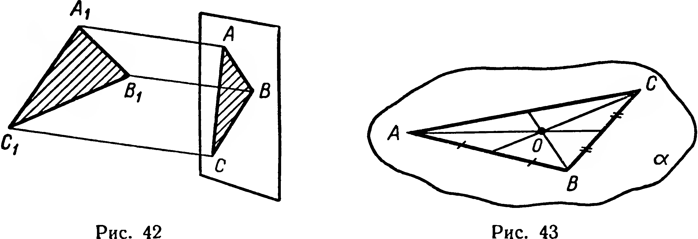
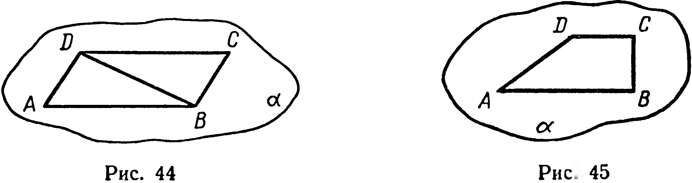
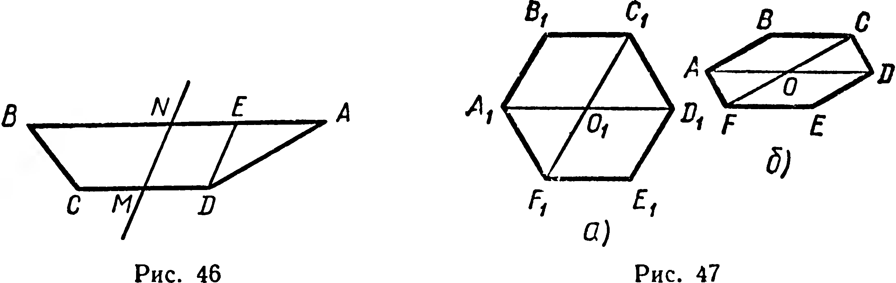
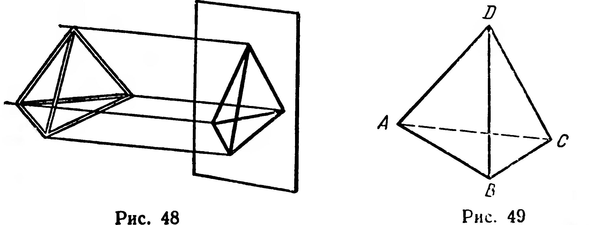
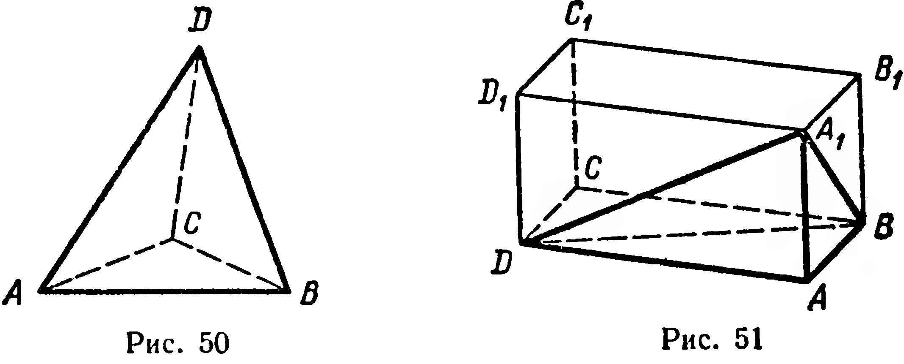
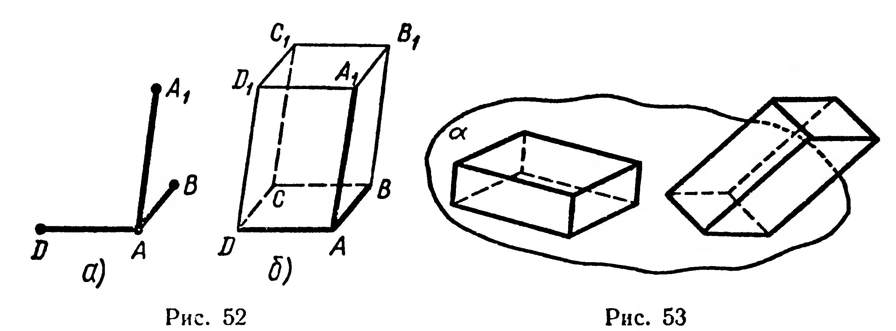

## 1.13. Изображение фигур в стереометрии

---
**стр. 27**
---

ных положениях плоскости шестиугольника относительно плоскости стены), можно высказать несколько гипотез о свойствах параллельного проектирования. Формулируя эти свойства, будем полагать, что проектирование производится параллельно прямой $l$, не параллельной проектируемым прямым или отрезкам.

**Свойство 1.** *Проекция прямой есть прямая.*

**Свойство 2.** *Проекции параллельных прямых параллельны.*

**Свойство 3.** *Отношение длин проекций двух параллельных отрезков равно отношению длин проектируемых отрезков.*

Доказательства этих свойств опускаем.

## Задачи

**97.** Даны три различные точки. Сколько точек может получиться на плоскости проекций при проектировании данных точек?

**98°.** Какой фигурой является проекция проектирующей прямой?

**99°.** Какой фигурой может быть проекция: 1) плоскости; 2) полуплоскости; 3) угла, отличного от развернутого?

**100°.** В каком случае: 1) проекция точки совпадает с этой точкой; 2) проекция прямой совпадает с этой прямой?

**101°.** В каком случае неверно утверждение: «Проекции параллельных прямых параллельны»?

**102.** Известно, что отрезок и его проекция имеют равные длины. Как может быть расположен данный отрезок по отношению к плоскости проекций?

**103.** 1) Какие фигуры можно получить, проектируя на плоскость объединение двух пересекающихся прямых?

2) Какие фигуры можно получить, проектируя на плоскость объединение двух скрещивающихся прямых?

**104.** 1°) Если проекции двух прямых параллельны, то верно ли утверждение, что параллельны и проектируемые прямые?

2) Даны скрещивающиеся прямые $a$, $b$ и плоскость проекций $\alpha$. Проведите прямую $l$ так, чтобы при проектировании параллельно $l$ проекции прямых $a$ и $b$ были параллельны.

**105.** Из одной точки выходят три луча, не лежащие в одной плоскости. Какой фигурой может быть проекция объединения этих лучей?

**106.** Отрезок $AB$ пересекает плоскость проекций в точке $M$. Его проекцией служит отрезок $A_1B_1$. Известно: $|AB| = m$, $|A_1M| : |MB_1| = p : q$. Найдите $|AM|$ и $|MB|$.

## § 13. Изображение фигур в стереометрии

В стереометрии *изображением фигуры* (оригинала) будем называть любую фигуру, подобную параллельной проекции данной фигуры на некоторую плоскость. Для данной фигуры форма ее изображения зависит от положения оригинала относительно

---
**стр. 28**
---

плоскости проекций, а также от выбора прямой $l$, параллельно которой выполняется проектирование.

Задача построения изображения фигуры считается решенной, если получено любое изображение фигуры, достаточно наглядное и удобное для проведения на нем дополнительных линий. Способы построения изображений, которыми мы будем пользоваться, основаны на свойствах параллельного проектирования.

**1. Треугольник.** Наблюдая тень модели треугольника (рис. 42), естественно предположить, что проекция данного треугольника может быть треугольником любой формы. Верно утверждение: *произвольный треугольник, лежащий в плоскости проекций, можно считать изображением данного треугольника*.

В частности, равносторонний треугольник можно изображать в виде любого разностороннего треугольника. Приходим к выводу: при параллельном проектировании величина угла и отношение длин непараллельных отрезков, вообще говоря, не сохраняются.

Свойство 3 параллельной проекции позволяет, в частности, заключить, что медиана треугольника изображается медианой изображения этого треугольника (рис. 43).

**2. Параллелограмм.** Так как параллельность прямых при параллельном проектировании сохраняется, то изображением параллелограмма (в частности, прямоугольника, ромба, квадрата) служит параллелограмм (рис. 44). Длины сторон и величины углов этого параллелограмма (изображения) можно выбирать произвольно.

Для обоснования последнего утверждения достаточно приме-
нить правило изображения треугольника (пункт 1) к треуголь-

---
**стр. 29**
---

нику, полученному после проведения диагонали параллелограмма-оригинала (рис. 44).

**3. Трапеция.** Свойства параллельной проекции позволяют заключить, что трапеция $A_1B_1C_1D_1$ изобразится в виде трапеции $ABCD$ (рис. 45), у которой отношение $|AB| : |CD|$ оснований равно отношению $|A_1B_1| : |C_1D_1|$ оснований оригинала.

Равнобедренная трапеция имеет ось симметрии. Пользуясь этим, построим (рис. 46) изображение высоты $[DE]$ этой трапеции: $|BN| = |NA|$, $|CM| = |MD|$, $(DE) \parallel (MN)$.

**4. Правильный шестиугольник.** Рассмотрим правильный шестиугольник $A_1B_1C_1D_1E_1F_1$ (рис. 47, а). Проведем в нем диагонали $A_1D_1$ и $C_1F_1$. Получим ромбы $A_1B_1C_1O_1$ и $O_1D_1E_1F_1$, симметричные относительно точки $O_1$.

Ромб $A_1B_1C_1O_1$ изображаем согласно пункту 2 в виде произвольного параллелограмма $ABCO$ (рис. 47, б). Затем изображаем параллелограмм $ODEF$, симметричный параллелограмму $ABCO$ относительно точки $O$ (§ 12, свойство 3). Соединив точки $C$ и $D$, $A$ и $F$, получим искомое изображение $ABCDEF$.

**5. Тетраэдр.** Рассмотрим тень каркасной модели тетраэдра (рис. 48).

Можно предположить, что *изображениями ребер данного тетраэдра могут служить стороны и диагонали произвольного (выпуклого или невыпуклого) четырехугольника $ABCD$* (рис. 49 и 50). Доказательство этого факта, которым будем в дальнейшем пользоваться, опускаем.

---
**стр. 30**
---

**6. Параллелепипед.** Пусть дан параллелепипед $ABCDA_1B_1C_1D_1$ (оригинал). Выберем три его ребра $AB$, $AD$, $AA_1$ (рис. 51), выходящие из одной вершины. Рассмотрим тетраэдр $A_1ABD$. Пользуясь правилом изображения тетраэдра, приходим к выводу, что ребра $AB$, $AD$, $AA_1$ можно изобразить в виде трех произвольных отрезков, выходящих из одной точки (рис. 52, а). На этом «произвол» при изображении параллелепипеда заканчивается. Остальные его ребра придется изображать (согласно свойствам 1—3 из § 12) вполне определенными отрезками (рис. 52, б): каждый из них параллелен одному из построенных отрезков и равен ему по длине.

Верно выполненное изображение параллелепипеда (как, впрочем, и других фигур) может иногда выглядеть несколько необычным. Например, на рисунке 53 показаны изображения куба, которые можно получить при надлежащем выборе проектирования. Ясно, что мы предпочтем привычное изображение куба (рис. 24).

Способы изображения многих других фигур будут рассмотрены в курсе X класса.

**Задачи**

**107°.** Треугольник $ABC$ является проекцией треугольника $A_1B_1C_1$. В треугольнике $A_1B_1C_1$ проведены из вершины биссектриса, медиана и высота. Будут ли проекции этих отрезков

---
**стр. 31**
---

...являться биссектрисой, медианой и высотой треугольника $ABC$?

**108.** Дано изображение равнобедренного треугольника в виде разностороннего треугольника. На этом изображении постройте: 1) изображение биссектрисы угла при вершине, 2) изображение перпендикуляра к основанию, проведённого через середину боковой стороны.

**109.** Дано изображение треугольника и двух его высот. Постройте изображение центра круга, описанного около треугольника-оригинала.

**110\*.** 1) Треугольник $ABC$ служит изображением треугольника $A_1B_1C_1$, у которого $|A_1B_1| : |B_1C_1| = 2 : 3$. Постройте изображение биссектрисы угла $B_1$.

2) Треугольник $ABC$ — изображение прямоугольного треугольника $A_1B_1C_1$, длины катетов $A_1C_1$ и $B_1C_1$ которого относятся как $3 : 4$. Постройте изображение центра круга, вписанного в треугольник $A_1B_1C_1$.

**111°.** Может ли: 1) изображением заданного четырёхугольника служить произвольный четырёхугольник; 2) изображением трапеции служить параллелограмм; 3) изображением ромба — квадрат?

**112°.** 1) Какие из свойств ромба останутся верными для изображения этого ромба? Какие могут не сохраниться?

2) Какие свойства прямоугольника остаются верными для его проекции?

**113.** Трапеция $ABCD$ является проекцией трапеции $ABC_1D_1$ на плоскость, проходящую через $(AB)$. Равны ли длины средних линий этих трапеций, если: 1) $(AB) \parallel (CD)$; 2) $(BC) \parallel (AD)$?

**114.** На изображении равнобедренного прямоугольного треугольника постройте изображение квадрата, лежащего в плоскости треугольника, если стороной квадрата служит: 1) катет данного треугольника; 2) его гипотенуза.

**115.** На изображении правильного шестиугольника постройте изображение: 1) апофемы шестиугольника; 2) биссектрисы одного из его внешних углов; 3) перпендикуляра, проведённого через центр к одной из меньших диагоналей.

**116.** Постройте на изображении ромба изображение его высоты, если угол ромба равен $45^\circ$.

**117¹.** Все рёбра тетраэдра $ABCD$ имеют равные длины, $K$ — середина ребра $BD$. 1) Постройте две прямые $KM$ и $KN$, перпендикулярные соответственно $(AD)$ и $(DC)$ и пересекающие их в точках $M$ и $N$. 2) Постройте точку пересечения плоскости $KMN$ с прямой, соединяющей вершину $D$ и точку пересечения медиан противолежащей грани. 3) Найдите площадь треугольника $KMN$, приняв длину каждого ребра тетраэдра равной $a$.
