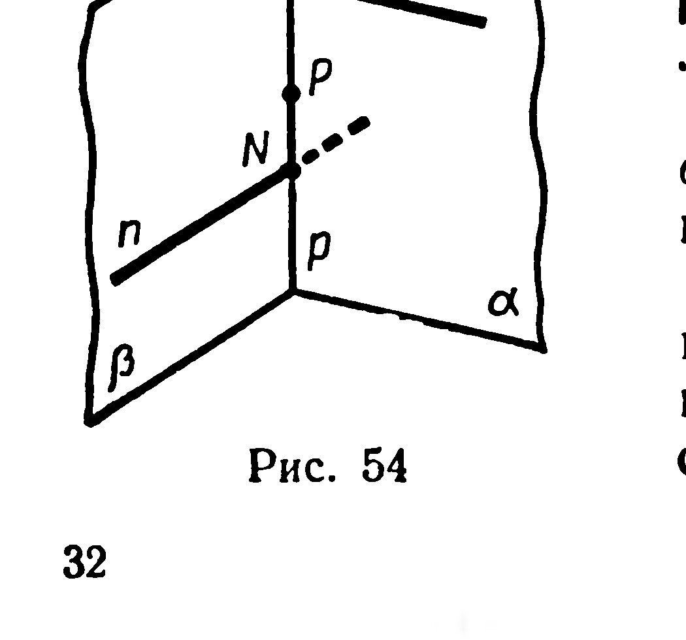
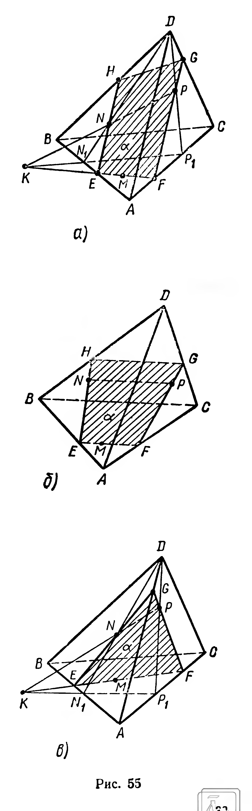
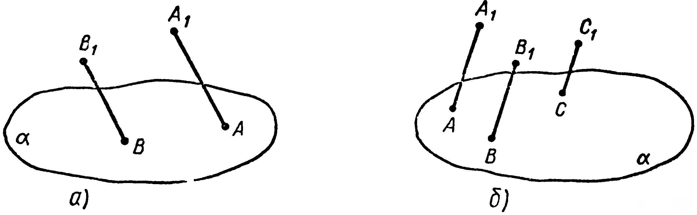

## 1.14. Задачи на повторение к главе I

---
**стр. 32**
---

**118.** Точка $M$ принадлежит ребру $AA_1$ куба $ABCDA_1B_1C_1D_1$, причём $|AM| : |MA_1| = 2$. 1) Постройте сечение, проходящее через точку $M$ и делящее пополам $[BB_1]$ и $[CC_1]$. 2) Найдите наибольшую сторону сечения, если ребро куба равно $a$.

**119\*.** В прямоугольном параллелепипеде $ABCDA_1B_1C_1D_1$ длины рёбер $AB$, $BC$, $BB_1$ пропорциональны числам $3$, $2$, $1$. Постройте две прямые, проходящие через точку $B_1$ и соответственно перпендикулярные $(BC_1)$ и $(BA_1)$.

**120.** В прямоугольном параллелепипеде $ABCDA_1B_1C_1D_1$ длины рёбер $AB$, $BC$, $BB_1$ пропорциональны числам $3$, $2$, $1$. Постройте точку пересечения: 1) ребра $AB$ с биссектрисой угла $BB_1A_1$; 2) прямой $CC_1$ с биссектрисой угла $BB_1C_1$.

**Задачи на повторение к главе I**

**121.** Даны $n$ точек ($n \geqslant 4$), никакие четыре из которых не принадлежат одной плоскости. Сколько различных плоскостей можно провести так, чтобы каждая из них проходила через три данные точки?

**122.** Даны точки $A$, $B$, $C$, $D$, не принадлежащие одной плоскости. Докажите, что середины отрезков $AB$, $BC$, $CD$, $DA$ принадлежат одной плоскости. Вершинами какой фигуры служат эти точки?

**123°.** Может ли прямая лежать в плоскости грани параллелепипеда, если известно, что эта прямая имеет общие точки: 1) только с одним ребром параллелепипеда; 2) только с двумя рёбрами; 3) только с тремя рёбрами; 4) только с четырьмя рёбрами; 5) с шестью рёбрами?

**124\*.** В параграфе 6 сформулировано достаточное условие того, чтобы прямые $a$ и $b$ были скрещивающимися. Является ли это условие также необходимым?

**125.** Дано: $a \perp b$, $M \notin a$, $M \notin b$. Через точку $M$ проведите прямую $c$ так, чтобы она скрещивалась с каждой из данных прямых.

**126\*.** Даны две скрещивающиеся прямые $m$ и $n$. Через точку $P$, не принадлежащую ни одной из них, проведите прямую, пересекающую обе данные прямые (рис. 54).

**127.** Дано: $\alpha \cap \beta = m$, $a \subset \alpha$, $m \cap a = A$, $\beta \cap b = B$ ($A \neq B$). Каково взаимное расположение прямых $a$ и $b$?

**128°.** Прямая $a$ пересекает плоскость $\alpha$. Можно ли провести в плоскости $\alpha$ прямую, параллельную $a$?

**129°.** Как могут быть расположены прямая $a$ и плоскость $\alpha$, если данная прямая и некоторая прямая, лежащая в плоскости $\alpha$, скрещиваются?

---
**стр. 33**
---

**130.** Прямая $a$ параллельна плоскости $\alpha$. Докажите, что прямая, проведённая через точку $M$, принадлежащую данной плоскости, параллельно данной прямой, лежит в плоскости $\alpha$.

**131.** Дано: $m \parallel \alpha$, $m \subset \beta$, $m \subset \gamma$; $\beta \cap \alpha = a$, $\gamma \cap \alpha = b$. Доказать: $a \parallel b$.

**132.** Постройте сечение тетраэдра $ABCD$ плоскостью, проходящей через внутреннюю точку $M$ грани $ABC$ и параллельной прямым $AB$ и $DC$.

**133.** Даны тетраэдр $ABCD$ и точки $M$, $N$, $P$, принадлежащие соответственно граням $ABC$, $ABD$ и $ACD$ (но не принадлежащие рёбрам). Построить сечение тетраэдра плоскостью $MNP$.

*Решение.* **Анализ.** Пусть $(MNP) = \alpha$. Выясним, как построить пересечение плоскости $\alpha$ с гранью $ABC$ (рис. 55). Точка $M$ является общей для $\alpha$ и $(ABC)$. Если $(NP) \nparallel (ABC)$ (рис. 55, а), то второй общей точкой плоскостей $ABC$ и $\alpha$ может служить точка пересечения прямых $NP$ и $N_1P_1$, где $(N_1P_1) = (ABC) \cap (NPD)$. Если же $(NP) \parallel (ABC)$ (рис. 55, б), то линия пересечения плоскостей $\alpha$ и $(ABC)$ параллельна $(NP)$ (§ 7, теорема 3).

**Построение.**

1) $(N_1P_1) = (NPD) \cap (ABC)$;

2) $K = (N_1P_1) \cap (NP)$ (для случая $(NP) \nparallel (ABC)$, рис. 55, а);

3) $(KM) = \alpha \cap (ABC)$,
   $[FE] = \alpha \cap \triangle ABC$.

Если же $(NP) \parallel (ABC)$, то $[FE] \parallel [NP]$ (рис. 55, б);

4) $(EN) = \alpha \cap (ABD)$,
   $[EH] = \alpha \cap \triangle ABD$;

5) $(FP) = \alpha \cap (ACD)$,
   $[FG] = \alpha \cap \triangle ACD$.

Сечение $EFGH$ удовлетворяет условию задачи.

---
**стр. 34**
---

*Исследование.* Задача имеет единственное решение (аксиома 4). Сечение может быть четырехугольником (рис. 55, *а*, *б*) или треугольником (рис. 55, *в*).

**134*.** Постройте сечение тетраэдра $ABCD$ плоскостью $MNP$, где $M \in \triangle ADC$, $N \in \triangle BDC$, $P \in [AB]$.

**135.** 1) Дано: $\alpha \parallel \beta$. Верно ли утверждение, что в плоскости $\alpha$ можно провести две прямые, соответственно параллельные двум пересекающимся прямым плоскости $\beta$?

2°) Используя результат пункта 1 этой задачи, сформулируйте достаточное и необходимое условие параллельности двух плоскостей.

**136.** Как могут быть расположены плоскости $\alpha$ и $\beta$, если: 1) некоторая прямая $a$, пересекающая $\alpha$, параллельна $\beta$; 2) любая прямая, лежащая в плоскости $\alpha$, параллельна $\beta$?

**137°.** Дано: $a \subset \alpha$, $a \parallel \beta$. Верно ли утверждение, что $\alpha \parallel \beta$?

**138.** Дано: $\alpha \parallel \beta$, $a \parallel \alpha$. Доказать: $a \parallel \beta$.

**139.** Дано: $\alpha \parallel \beta$ ($\alpha \neq \beta$), $\{A,\,C\} \subset \alpha$, $\{B,\,D\} \subset \beta$, $[AB] \cap [CD] = M$. Доказать: $(AC) \parallel (BD)$.

**140.** Верны ли утверждения: 1) $(\alpha \parallel \beta,\; a \subset \alpha) \Longrightarrow a \parallel \beta$; 2) $(a \subset \alpha,\; b \subset \beta,\; a \cap b = \varnothing) \Longrightarrow \alpha \parallel \beta$?

**141.** Дан параллелепипед $ABCDA_1B_1C_1D_1$. Докажите, что $(A_1DB) \parallel (D_1CB_1)$.

**142.** Даны параллельные плоскости $\alpha$ и $\beta$. Через точку $M$, не принадлежащую ни одной из них, проведены прямые $a$ и $b$, которые пересекают $\alpha$ соответственно в точках $A_1$ и $B_1$, а плоскость $\beta$ — в точках $A_2$ и $B_2$. Известно: $|MA_1| = 8$ см, $|A_1A_2| = 12$ см, $|A_2B_2| = 25$ см. Найдите $|A_1B_1|$.

**143.** Дано: $\alpha \parallel \beta$, $\gamma \cap \delta = m$, $\gamma \cap \alpha = a$, $\delta \cap \beta = b$, $m \parallel a$. Доказать: $m \parallel b$.

**144.** Найдите объединение всех прямых, которые проходят через данную точку и параллельны данной плоскости.

**145*.** Постройте сечение параллелепипеда $ABCDA_1B_1C_1D_1$ плоскостью $MNP$, если точки $M$, $N$, $P$ принадлежат соответственно: 1) ребру $AB$, граням $AA_1D_1D$ и $BB_1C_1C$; 2) граням $ABCD$, $AA_1B_1B$, $BB_1C_1C$.

---
**стр. 35**
---

**146.** В тетраэдре $ABCD$ вершина $D$ соединена отрезком с точкой $M$ пересечения медиан грани $ABC$. Постройте сечение тетраэдра плоскостью, проходящей через точку $N \in [DM]$ и параллельной грани $BCD$.

**147*.** На трех попарно скрещивающихся ребрах параллелепипеда взяты три точки. Постройте сечение, проходящее через эти точки.

**148.** Может ли сечением куба являться: 1) правильный треугольник; 2) квадрат; 3) правильный пятиугольник; 4) правильный шестиугольник; 5) восьмиугольник?

**149.** Дан перечень фигур: 1) точка; 2) прямая; 3) отрезок; 4) луч; 5) угол; 6) плоскость. Какие фигуры могут получиться при проектировании каждой из данных фигур? При выборе ответов пользуйтесь этим же перечнем.

**150°.** Даны точки $A_1$, $B_1$ и их проекции $A$, $B$ на плоскость $\alpha$ (рис. 56, *а*). Как построить точку пересечения прямой $A_1B_1$ с плоскостью $\alpha$?

**151°.** Даны точки $A_1$, $B_1$, $C_1$, не принадлежащие прямой, и их проекции $A$, $B$, $C$ на плоскость $\alpha$ (рис. 56, *б*). Как построить линию пересечения плоскостей $A_1B_1C_1$ и $\alpha$?

**152.** Постройте точку пересечения плоскости, проходящей через ребро $AD$ тетраэдра $ABCD$ и точку $M \in [BC]$, с прямой $PQ$, где $P \in [AB]$ и $Q \in [CD]$.
