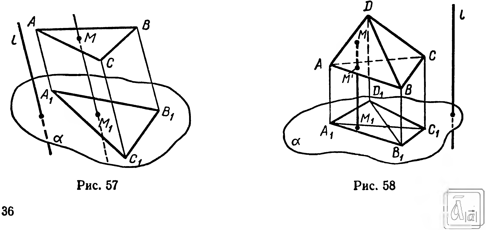

## 2.1. Отображение фигуры. Преобразование пространства

---
**стр. 36**
---

# Глава II. Преобразования пространства. Векторы

## § 14. Отображение фигуры. Преобразование пространства

В стереометрии важную роль играет понятие отображения одной фигуры на другую. Смысл этого понятия такой же, как и в планиметрии.

В качестве примера отображения рассмотрим проектирование треугольника $ABC$ на плоскость $\alpha$ параллельно прямой $l$ (рис. 57). Этим отображением каждой точке $M$ треугольника $ABC$ ставится в соответствие единственная точка $M_1$, принадлежащая плоскости $\alpha$.

Если каждой точке $M$ фигуры $\Phi$ ставится в соответствие единственная точка $M_1$ фигуры $F$, то такое соответствие называют **отображением фигуры** $\Phi$ **в фигуру** $F$. Точку $M_1$ при этом называют **образом точки** $M$.

В приведенном примере $\Phi = \triangle ABC$, $F = \alpha$. Проекцией треугольника $ABC$ служит треугольник $A_1B_1C_1$, лежащий в плоскости $\alpha$ (предполагаем, что плоскость $ABC$ не параллельна прямой $l$).

Множество $\Phi_1$ образов всех точек фигуры $\Phi$ называется **образом фигуры** $\Phi$. Из определения отображения следует, что $\Phi_1 \subset F$. Если же $\Phi_1 = F$, то говорят: фигура $\Phi$ отображается на фигуру $\Phi_1$ (вместо предлога «в» употребляют предлог «на»). Например, при проектировании на плоскость $\alpha$ параллельно прямой $l$ образом тетраэдра $ABCD$ служит четырехугольник $A_1B_1C_1D_1$ (рис. 58).

